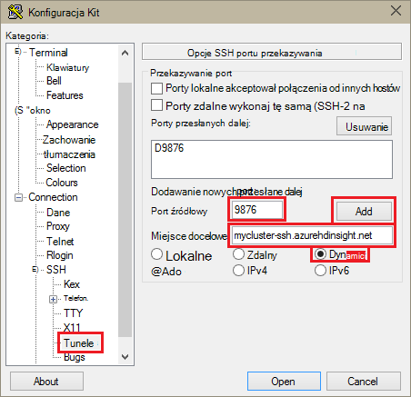
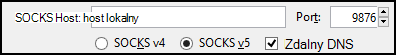
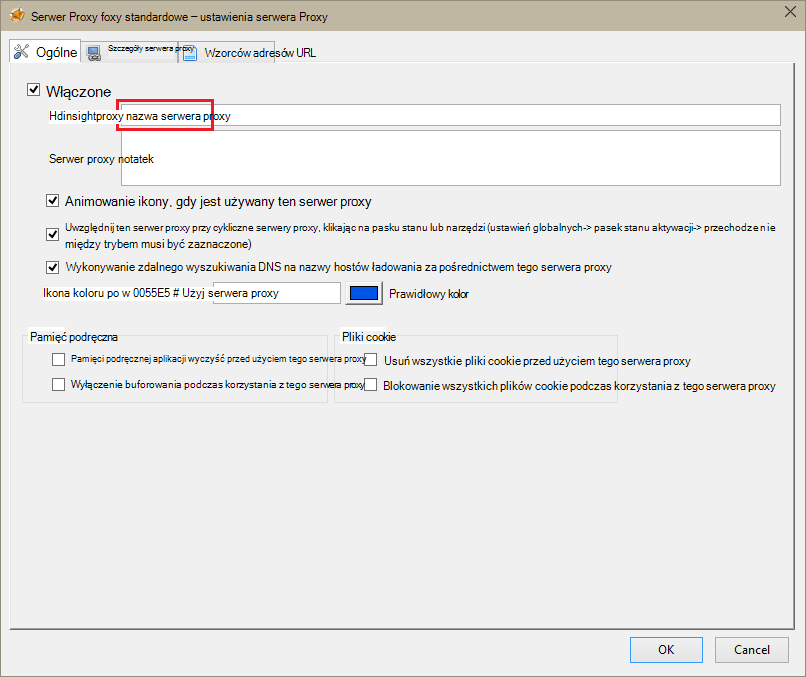
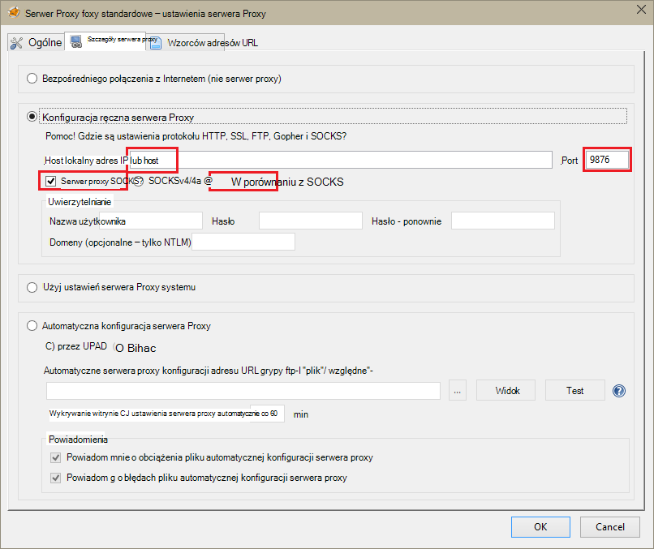
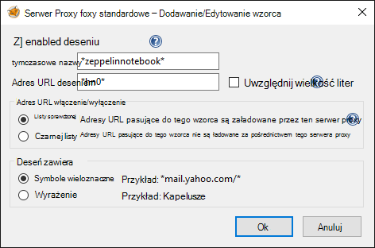
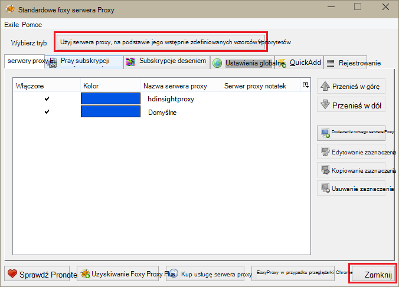

<properties 
    pageTitle="Instalowanie notesów Zeppelin klaster Apache Spark na HDInsight Linux | Microsoft Azure" 
    description="Instrukcje krok po kroku dotyczące instalacji i używania notesów Zeppelin z klastrów Spark na HDInsight Linux." 
    services="hdinsight" 
    documentationCenter="" 
    authors="nitinme" 
    manager="jhubbard" 
    editor="cgronlun"/>

<tags 
    ms.service="hdinsight" 
    ms.workload="big-data" 
    ms.tgt_pltfrm="na" 
    ms.devlang="na" 
    ms.topic="article" 
    ms.date="10/28/2016" 
    ms.author="nitinme"/>

# Instalowanie notesy Zeppelin klaster Apache Spark na HDInsight Linux

Dowiedz się, jak zainstalować Zeppelin notesów na klastrów Apache Spark i jak używać notesów Zeppelin do uruchamiania Spark zadań.

> [AZURE.IMPORTANT] Notesy Zeppelin są teraz dostępne domyślnie z klastrów Spark. Nie musisz jawnie zainstaluj je w klastrze Spark już. Aby uzyskać więcej informacji, zobacz [Zeppelin używanie notesów Apache Spark klaster w HDInsight Linux](hdinsight-apache-spark-zeppelin-notebook.md). 

**Wymagania wstępne dotyczące:**

* Przed rozpoczęciem tego samouczka, musisz mieć subskrypcję usługi Azure. Zobacz [Azure pobrać bezpłatną wersję próbną](https://azure.microsoft.com/documentation/videos/get-azure-free-trial-for-testing-hadoop-in-hdinsight/).
* Klaster Apache Spark. Aby uzyskać instrukcje zobacz [Tworzenie Spark Apache klastrów w Azure HDInsight](hdinsight-apache-spark-jupyter-spark-sql.md).
* Klient SSH. Rozkład Linux i Unix lub Macintosh OS X `ssh` polecenie jest dostępne w systemie operacyjnym. Dla systemu Windows zalecamy [Kit](http://www.chiark.greenend.org.uk/~sgtatham/putty/download.html)

    > [AZURE.NOTE] Jeśli chcesz użyć innego niż klienta SSH `ssh` lub Kit, zapoznaj się z dokumentacją dla klienta na temat ustanawiania tunelem SSH.

* Przeglądarki sieci web, która może być skonfigurowany do używania serwera proxy SOCKS

* __(opcjonalnie)__: wtyczki, takich jak [FoxyProxy](http://getfoxyproxy.org/,) , który można zastosować zasady, które tylko rozsyłanie próśb za pośrednictwem tunelem.

    > [AZURE.WARNING] Bez wtyczki, takich jak FoxyProxy wszystkie wnioski za pomocą przeglądarki może być przesłane za pośrednictwem tunelem. Może to powodować tempo ładowania stron sieci web w przeglądarce.

## Instalowanie Zeppelin w klastrze Spark

Możesz zainstalować Zeppelin w klastrze Spark przy użyciu akcji skryptów. Akcja skrypt używa skrypty do zainstalowania składników w klastrze, które nie są dostępne jako domyślne. Za pomocą skryptu niestandardowego instalacji Zeppelin z Azure Portal za pomocą usługi HDInsight .NET SDK lub przy użyciu programu PowerShell Azure. Za pomocą skryptu instalacji Zeppelin albo w ramach tworzenia klaster lub po klaster i rozpocząć pracę. Łącza w poniższych sekcjach podano instrukcje o tym, jak to zrobić. 

### Za pomocą portalu Azure

Aby uzyskać instrukcje dotyczące sposobu używania Azure Portal, aby uruchomić akcję skrypt do zainstalowania Zeppelin zobacz [Dostosowywanie HDInsight klastrów przy użyciu akcji skryptu](hdinsight-hadoop-customize-cluster-linux.md#use-a-script-action-from-the-azure-portal). Musisz wprowadzić kilka zmian do instrukcji w tym artykule.

* Skrypt należy użyć, aby zainstalować Zeppelin. Niestandardowy skrypt, aby zainstalować Zeppelin w klastrze Spark na HDInsight są dostępne w następujących łączy:
    * W przypadku klastrów Spark 1.6.0-`https://hdiconfigactions.blob.core.windows.net/linuxincubatorzeppelinv01/install-zeppelin-spark160-v01.sh`
    * W przypadku klastrów Spark 1.5.2-`https://hdiconfigactions.blob.core.windows.net/linuxincubatorzeppelinv01/install-zeppelin-spark151-v01.sh`

* Akcja skrypt musi być uruchamiane tylko na headnode.

* Skrypt nie ma potrzeby parametry. 

### Przy użyciu zestawu SDK .NET HDInsight

Aby uzyskać instrukcje dotyczące sposobu używania usługi HDInsight .NET SDK Aby uruchomić akcję skryptu zainstalować Zeppelin zobacz [Dostosowywanie HDInsight klastrów przy użyciu akcji skryptu](hdinsight-hadoop-customize-cluster-linux.md#use-a-script-action-from-the-hdinsight-net-sdk). Musisz wprowadzić kilka zmian do instrukcji w tym artykule.

* Skrypt należy użyć, aby zainstalować Zeppelin. Niestandardowy skrypt, aby zainstalować Zeppelin w klastrze Spark na HDInsight są dostępne w następujących łączy:
    * W przypadku klastrów Spark 1.6.0-`https://hdiconfigactions.blob.core.windows.net/linuxincubatorzeppelinv01/install-zeppelin-spark160-v01.sh`
    * W przypadku klastrów Spark 1.5.2-`https://hdiconfigactions.blob.core.windows.net/linuxincubatorzeppelinv01/install-zeppelin-spark151-v01.sh`

* Skrypt nie ma potrzeby parametry. 

* Ustaw typ klaster tworzonego Spark.

### Przy użyciu programu PowerShell Azure

Umożliwia utworzenie klastrze Spark na HDInsight Linux z Zeppelin zainstalowane następujące wstawkę kodu programu PowerShell. W zależności od tego, jaka wersja programu klaster Spark masz możesz zaktualizować wstawkę kodu programu PowerShell poniżej, aby uwzględnić łącze do odpowiedniego skryptu niestandardowego. 

* W przypadku klastrów Spark 1.6.0-`https://hdiconfigactions.blob.core.windows.net/linuxincubatorzeppelinv01/install-zeppelin-spark160-v01.sh`
* W przypadku klastrów Spark 1.5.2-`https://hdiconfigactions.blob.core.windows.net/linuxincubatorzeppelinv01/install-zeppelin-spark151-v01.sh`

[AZURE.INCLUDE [upgrade-powershell](../../includes/hdinsight-use-latest-powershell.md)]

    Login-AzureRMAccount
    
    # PROVIDE VALUES FOR THE VARIABLES
    $clusterAdminUsername="admin"
    $clusterAdminPassword="<<password>>"
    $clusterSshUsername="adminssh"
    $clusterSshPassword="<<password>>"
    $clusterName="<<clustername>>"
    $clusterContainerName=$clusterName
    $resourceGroupName="<<resourceGroupName>>"
    $location="<<region>>"
    $storage1Name="<<storagename>>"
    $storage1Key="<<storagekey>>"
    $subscriptionId="<<subscriptionId>>"
    
    Select-AzureRmSubscription -SubscriptionId $subscriptionId
    
    $passwordAsSecureString=ConvertTo-SecureString $clusterAdminPassword -AsPlainText -Force
    $clusterCredential=New-Object System.Management.Automation.PSCredential ($clusterAdminUsername, $passwordAsSecureString)
    $passwordAsSecureString=ConvertTo-SecureString $clusterSshPassword -AsPlainText -Force
    $clusterSshCredential=New-Object System.Management.Automation.PSCredential ($clusterSshUsername, $passwordAsSecureString)
    
    $azureHDInsightConfigs= New-AzureRmHDInsightClusterConfig -ClusterType Spark
    $azureHDInsightConfigs.DefaultStorageAccountKey = $storage1Key
    $azureHDInsightConfigs.DefaultStorageAccountName = "$storage1Name.blob.core.windows.net"
    
    Add-AzureRMHDInsightScriptAction -Config $azureHDInsightConfigs -Name "Install Zeppelin" -NodeType HeadNode -Parameters "void" -Uri "https://hdiconfigactions.blob.core.windows.net/linuxincubatorzeppelinv01/install-zeppelin-spark151-v01.sh"
    
    New-AzureRMHDInsightCluster -Config $azureHDInsightConfigs -OSType Linux -HeadNodeSize "Standard_D12" -WorkerNodeSize "Standard_D12" -ClusterSizeInNodes 2 -Location $location -ResourceGroupName $resourceGroupName -ClusterName $clusterName -HttpCredential $clusterCredential -DefaultStorageContainer $clusterContainerName -SshCredential $clusterSshCredential -Version "3.3"
 
## Konfigurowanie SSH tunelowania, aby uzyskać dostęp do notesu Zeppelin

Tunele SSH będzie umożliwia dostęp do notesów Zeppelin uruchamiania w klastrze Spark na HDInsight Linux. Poniższe kroki przedstawiają sposób tworzenia tunelem SSH przy użyciu ssh wiersza polecenia (Linux) i Kit (Windows).

### Tworzenie tunelem za pomocą polecenia SSH (Linux).

Użyj następujące polecenie, aby utworzyć SSH tunelu przy użyciu `ssh` polecenia. Zamień __nazwę użytkownika__ na użytkownika SSH klaster HDInsight i Zamień __NAZWAKLASTRA__ nazwę klaster HDInsight

    ssh -C2qTnNf -D 9876 USERNAME@CLUSTERNAME-ssh.azurehdinsight.net

Spowoduje to utworzenie połączenia, który kieruje ruch do portu lokalnego 9876 z klastrem przez SSH. Dostępne są następujące opcje:

* **D 9876** - port lokalny, który będzie skierować ruch do tunelem.

* **C** - skompresować wszystkie dane, ponieważ ruchu w sieci web jest głównie tekstem.

* **2** - Wymuszaj SSH wypróbować protokół tylko w wersji 2.

* **pytania** — tryb cichy.

* **T** - Wyłącz pseudo tty alokacji, ponieważ firma Microsoft po prostu przesyłasz portu.

* **n** - zapobieganie odczytu STDIN, ponieważ firma Microsoft po prostu przesyłasz portu.

* **N** - nie wykonuj polecenia zdalnego, ponieważ firma Microsoft po prostu przesyłasz portu.

* **f** - działanie w tle.

Jeśli skonfigurowano klaster przy użyciu klucza SSH, może być konieczne używanie `-i` parametru i określ ścieżkę do klucz prywatny SSH.

Po zakończeniu wykonywania polecenia ruch wysyłane do portu 9876 na komputerze lokalnym będzie kierowane przez warstwy SSL (Secure Sockets) z klastrem głowy węzeł i wydaje się pochodzą.

### Tworzenie tunelem przy użyciu Kit (Windows)

Wykonaj następujące czynności, aby utworzyć tunelem SSH przy użyciu Kit.

1. Otwórz Kit i wprowadź informacje o połączeniu. Jeśli nie znasz Kit, zobacz [Używanie SSH z systemem Linux Hadoop na HDInsight z systemu Windows](hdinsight-hadoop-linux-use-ssh-windows.md) dla informacji na temat sposobu używania go z usługi HDInsight.

2. W sekcji **kategorii** po lewej stronie okna dialogowego rozwiń **połączenie**, rozwiń **SSH**, a następnie wybierz pozycję **tuneli**.

3. Wprowadź następujące informacje w formularzu **Opcje przekierowania portów SSH** :

    * **Port źródłowy** — port klienta, który chcesz przesłać dalej. Na przykład **9876**.

    * **Miejsce docelowe** - SSH adres klaster HDInsight systemem Linux. Na przykład **mycluster ssh.azurehdinsight.net**.

    * **Dynamiczne** — umożliwia dynamiczne serwera proxy SOCKS routing.

    

4. Kliknij przycisk **Dodaj** , aby dodać ustawienia, a następnie kliknij przycisk **Otwórz** , aby otworzyć połączenie SSH.

5. Gdy zostanie wyświetlony monit, zaloguj się na serwerze. Spowoduje to ustanowić sesję SSH i Włącz tunelem.

### Używanie tunelem za pomocą przeglądarki

> [AZURE.NOTE] Czynności opisane w tej sekcji za pomocą przeglądarki FireFox, ponieważ jest dostępne bezpłatnie do systemów Linux, Unix, Macintosh OS X i Windows. Inne nowoczesne przeglądarki, takich jak Google Chrome, Microsoft Edge lub Apple Safari powinna działać jednak dodatek FoxyProxy używane w kilka czynności, nie mogą być dostępne dla wszystkich przeglądarek.

1. Konfigurowanie przeglądarki, aby użyć **localhost:9876** jako serwer proxy **SOCKS v5** . Poniżej przedstawiono wygląd ustawienia przeglądarki Firefox. Jeśli używasz innego portu niż 9876 Zmień portu, którego używasz:

    

    > [AZURE.NOTE] Wybieranie **Zdalnego DNS** rozwiąże żądania Domain Name (System DNS) przy użyciu klaster HDInsight. Jeśli ta opcja jest zaznaczona, DNS zostaną rozwiązane lokalnie.

2. Upewnij się, że ruch jest rozsyłana za pośrednictwem tunelem przez vising witrynie, takiej jak [http://www.whatismyip.com/](http://www.whatismyip.com/) dotyczącą ustawień serwera proxy włączona, a wyłączona w programie Firefox. Ustawienia są włączone, adres IP będzie dla komputera w centrum danych Microsoft Azure.

### Rozszerzenia przeglądarki

Podczas konfigurowania przeglądarkę tunelem działa, zwykle nie chcesz skierować cały ruch przez tunelem. Rozszerzenia przeglądarki, takie jak [FoxyProxy](http://getfoxyproxy.org/) obsługuje wzorca dopasowanie żądania adresu URL (standardowe FoxyProxy lub Plus tylko), tak aby tylko żądania dotyczące określonych adresów URL zostaną wysłane przez tunelem.

Jeśli zainstalowano standardowe FoxyProxy wykonaj następujące czynności, aby skonfigurować go, aby tylko przekazywać ruch dla HDInsight za pośrednictwem tunelem.

1. Otwórz rozszerzenie FoxyProxy w przeglądarce. Na przykład w programie Firefox wybierz ikonę FoxyProxy obok pola Adres.

    

2. Wybierz pozycję **Dodaj nowego serwera Proxy**, wybierz kartę **Ogólne** , a następnie wprowadź nazwę serwera proxy **HDInsightProxy**.

    

3. Wybierz kartę **Szczegóły serwera Proxy** i wypełnij następujące pola:

    * **Adres IP lub host** — jest to host lokalny, ponieważ użyto tunelem SSH na komputerze lokalnym.

    * **Port** — jest to port używany do tunelem SSH.

    * Serwer **SOCKS proxy** — wybierz tę opcję, aby włączyć przeglądarkę tunelem jako serwer proxy.

    * **SOCKS v5** — wybierz tę opcję, aby ustawić wymagana wersja serwera proxy.

    

4. Wybierz kartę **Wzorców adresów URL** , a następnie wybierz pozycję **Dodaj nowy deseń**. Użyj następujące czynności, aby zdefiniować wzorzec, a następnie kliknij **przycisk OK**:

    * **Nazwa wzorca** - **zeppelinnotebook** — jest to po prostu przyjazną nazwę wzorca.

    * **Adres URL deseniu** - **\*hn0** * - definiuje deseń odpowiadającą w wewnętrznych w pełni kwalifikowaną nazwę domeny miejsce, w którym znajdują się notesy Zeppelin punktu końcowego. Ponieważ notesy Zeppelin są dostępne tylko na headnode0 klastrze i punkt końcowy jest zazwyczaj `http://hn0-<string>.internal.cloudapp.net`, przy użyciu wzorcem * *hn0** czy upewnij się, że żądanie jest przekierowywane do punktu końcowego Zeppelin.

        

4. Kliknij przycisk **OK** , aby dodać serwer proxy i zamknąć **Ustawienia serwera Proxy**.

5. W górnej części okna dialogowego FoxyProxy zmienić **Tryb zaznaczania** **Użyj serwera proxy**oparte na ich wstępnie zdefiniowanych wzorców oraz priorytetów, a następnie kliknij **Zamknij**.

    

Po wykonaniu tych czynności, tylko żądania dla adresów URL, które zawierają ciąg __hn0__ będą kierowane przez tunelem SSL. 

## Dostęp do notesu Zeppelin

Po umieszczeniu SSH tunneling konfiguracji umożliwia następujące czynności dostęp do notesu Zeppelin w klastrze Spark, wykonując poniższe czynności. W tej sekcji pojawi się, jak uruchomić % sql i instrukcje gałęzi %.

1. W przeglądarce sieci web Otwórz następujący punkt końcowy:

        http://hn0-myspar:9995

    * **hn0** oznacza headnode0
    * **myspar** jest pierwszych sześć liter nazwy klaster Spark.
    * **9995** jest port, w którym Zeppelin Notes jest dostępny.

2. Tworzenie nowego notesu. W okienku nagłówka kliknij **Notes**, a następnie kliknij **Utworzyć nową notatkę**.

    ![Tworzenie nowego notesu Zeppelin] (./media/hdinsight-apache-spark-use-zeppelin-notebook/hdispark.createnewnote.png "Tworzenie nowego notesu Zeppelin")

    Na tej samej stronie pod nagłówkiem **notesu** powinien zostać wyświetlony nowego notesu o nazwie, zaczynając od **XXXXXXXXX notatki**. Kliknij pozycję Nowy notes.

3. Na stronie sieci web dla nowego notesu kliknij nagłówek, a następnie zmień nazwę notesu, jeśli chcesz. Naciśnij klawisz ENTER, aby zapisać zmiany nazwy. Ponadto upewnij się, że nagłówek notes zawiera stan **połączony** w prawym górnym rogu.

    ![Zeppelin notesów ze stanem] (./media/hdinsight-apache-spark-use-zeppelin-notebook/hdispark.newnote.connected.png "Zeppelin notesów ze stanem")

### Uruchamianie instrukcji SQL

4. Ładowanie przykładowych danych do tabeli tymczasowej. Po utworzeniu klastrze Spark w HDInsight przykładowy plik danych, **hvac.csv**są kopiowane do konta skojarzonego miejsca do magazynowania w ramach **\HdiSamples\SensorSampleData\hvac**.

    Pusty akapitu, który jest tworzony domyślnie w nowym notesie Wklej poniższy fragment.

        // Create an RDD using the default Spark context, sc
        val hvacText = sc.textFile("wasbs:///HdiSamples/HdiSamples/SensorSampleData/hvac/HVAC.csv")
        
        // Define a schema
        case class Hvac(date: String, time: String, targettemp: Integer, actualtemp: Integer, buildingID: String)
        
        // Map the values in the .csv file to the schema
        val hvac = hvacText.map(s => s.split(",")).filter(s => s(0) != "Date").map(
            s => Hvac(s(0), 
                    s(1),
                    s(2).toInt,
                    s(3).toInt,
                    s(6)
            )
        ).toDF()
        
        // Register as a temporary table called "hvac"
        hvac.registerTempTable("hvac")
        
    Naciśnij klawisze **SHIFT + ENTER** lub kliknij przycisk **Odtwórz** akapitu uruchomić wstawkę kodu. Stan w prawym rogu akapitu powinny postępować z gotowych do czasu pracy na ZAKOŃCZONE. Wynik wyświetlane u dołu tego samego akapitu. Zrzut ekranu wygląda następująco:

    ![Utwórz tabelę tymczasową z nieprzetworzonych danych] (./media/hdinsight-apache-spark-use-zeppelin-notebook/hdispark.note.loaddDataintotable.png "Utwórz tabelę tymczasową z nieprzetworzonych danych")

    Możesz także podać tytuł do każdego akapitu. W prawym rogu kliknij ikonę **Ustawienia** , a następnie kliknij pozycję **Pokaż tytuł**.

5. Teraz możesz uruchomić instrukcji Spark SQL w tabeli **instalacji grzewczo-wentylacyjnych** . Wklej poniższe zapytanie nowego akapitu. Kwerenda pobiera identyfikator budynku i różnica między docelowej i rzeczywistych temperatury dla każdego w oparciu o określonej daty. Naciśnij klawisze **SHIFT + ENTER**.

        %sql
        select buildingID, (targettemp - actualtemp) as temp_diff, date 
        from hvac
        where date = "6/1/13" 

    Instrukcja **% sql** na początku informuje Notes do użytku interpretera Spark SQL. Możesz obejrzeć tłumaczy zdefiniowane na karcie **interpretera** w nagłówku notesu.

    Następujące zrzucie ekranu pokazano wyniki.

    ![Uruchamiać instrukcję Spark SQL korzystać z notesu] (./media/hdinsight-apache-spark-use-zeppelin-notebook/hdispark.note.sparksqlquery1.png "Uruchamiać instrukcję Spark SQL korzystać z notesu")

     Aby przełączać się między różne reprezentacje uzyskać taki sam wynik, kliknij przycisk Opcje wyświetlania (wyróżnione w oknie prostokąt). Kliknij przycisk **Ustawienia** , aby wybrać jakie consitutes klucza i wartości w wyniku kwerendy. Zrzut ekranu powyżej używa **buildingID** jako klucz i wartość średnią **temp_diff** jako wartość.

    
6. Możesz również uruchomić instrukcji Spark SQL przy użyciu zmiennych w kwerendzie. Wstawkę kodu następnej pokazano sposób Definiowanie zmiennej **Temp**w kwerendzie możliwe wartości, którą chcesz kwerendy z. Przy pierwszym uruchomieniu kwerendy, lista rozwijana jest automatycznie wprowadzana wartości określonej dla zmiennej.

        %sql
        select buildingID, date, targettemp, (targettemp - actualtemp) as temp_diff
        from hvac
        where targettemp > "${Temp = 65,65|75|85}" 

    Wklej następujący fragment nowego akapitu, a następnie naciśnij klawisze **SHIFT + ENTER**. Następujące zrzucie ekranu pokazano wyniki.

    ![Uruchamiać instrukcję Spark SQL korzystać z notesu] (./media/hdinsight-apache-spark-use-zeppelin-notebook/hdispark.note.sparksqlquery2.png "Uruchamiać instrukcję Spark SQL korzystać z notesu")

    Następnych kwerend można wybrać nową wartość z listy rozwijanej i ponownie uruchomić kwerendę. Kliknij przycisk **Ustawienia** , aby wybrać jakie consitutes klucza i wartości w wyniku kwerendy. Zrzut ekranu powyżej używa **buildingID** jako klucz średnią **temp_diff** jako wartość i **targettemp** jako grupy.

7. Uruchom ponownie interpretera Spark SQL, aby zakończyć aplikację. Kliknij kartę **interpretera** u góry, a dla interpretera Spark, kliknij przycisk **Uruchom**.

    ![Uruchom ponownie Zeppelin intepreter] (./media/hdinsight-apache-spark-use-zeppelin-notebook/hdispark.zeppelin.restart.interpreter.png "Uruchom ponownie Zeppelin intepreter")

### Uruchamianie instrukcji gałęzi

1. Z notesu Zeppelin kliknij przycisk **interpretera** .

    ![Aktualizacja gałęzi interpretera] (./media/hdinsight-apache-spark-use-zeppelin-notebook/zeppelin-update-hive-interpreter-1.png "Aktualizacja gałęzi interpretera")

2. Dla interpretera **gałęzi** kliknij przycisk **Edytuj**.

    ![Aktualizacja gałęzi interpretera] (./media/hdinsight-apache-spark-use-zeppelin-notebook/zeppelin-update-hive-interpreter-2.png "Aktualizacja gałęzi interpretera")

    Zaktualizuj następujące właściwości.

    * Ustaw **default.password** hasło dla użytkownika admin podczas tworzenia klaster HDInsight Spark.
    * Ustaw **default.url** `jdbc:hive2://<spark_cluster_name>.azurehdinsight.net:443/default;ssl=true?hive.server2.transport.mode=http;hive.server2.thrift.http.path=/hive2`. Zamienianie ** \<spark_cluster_name >** o nazwie klaster Spark.
    * Ustaw **default.user** nazwę użytkownika administratora, określonej podczas tworzenia klaster. Na przykład *Administrator*.

3. Kliknij przycisk **Zapisz** , a gdy zostanie wyświetlony monit o ponowne uruchomienie interpretera gałęzi, kliknij **przycisk OK**.

4. Tworzenie nowego notesu i uruchom następującą instrukcję, aby wyświetlić listę wszystkich tabel gałęzi w klastrze.

        %hive
        SHOW TABLES

    Domyślnie klaster HDInsight ma przykładowej tabeli o nazwie **hivesampletable** , powinien zostać wyświetlony następujący wynik.

    ![Gałąź wyjścia] (./media/hdinsight-apache-spark-use-zeppelin-notebook/zeppelin-update-hive-interpreter-3.png "Gałąź wyjścia")

5. Uruchom następującą instrukcję, aby wyświetlić listę rekordów w tabeli.

        %hive
        SELECT * FROM hivesampletable LIMIT 5

    Należy wyniki podobne do następujących.

    ![Gałąź wyjścia] (./media/hdinsight-apache-spark-use-zeppelin-notebook/zeppelin-update-hive-interpreter-4.png "Gałąź wyjścia")

## Zobacz też

* [Omówienie: Apache Spark na usługa Azure HDInsight](hdinsight-apache-spark-overview.md)

### Scenariusze

* [Spark usługi BI: Analiza danych interakcyjnych przy użyciu Spark w HDInsight z narzędzi analizy Biznesowej](hdinsight-apache-spark-use-bi-tools.md)

* [Spark z komputera nauki: używanie Spark w HDInsight do analizy temperatury konstrukcyjnych Instalacja grzewczo-Wentylacyjna danych](hdinsight-apache-spark-ipython-notebook-machine-learning.md)

* [Spark z komputera nauki: używanie Spark w HDInsight do przewidywania żywność wyników inspekcji](hdinsight-apache-spark-machine-learning-mllib-ipython.md)

* [Spark Streaming: Używanie Spark w HDInsight do tworzenia aplikacji strumieniowych w czasie rzeczywistym](hdinsight-apache-spark-eventhub-streaming.md)

* [Analiza dziennika witryny sieci Web przy użyciu Spark w HDInsight](hdinsight-apache-spark-custom-library-website-log-analysis.md)

### Tworzenie i uruchamianie aplikacji

* [Tworzenie autonomiczną aplikację za pomocą Scala](hdinsight-apache-spark-create-standalone-application.md)

* [Zdalne uruchamianie zadania w klastrze Spark przy użyciu Livy](hdinsight-apache-spark-livy-rest-interface.md)

### Narzędzia i rozszerzenia

* [Tworzenie i przesyłanie Spark Scala aplikacji za pomocą dodatku Narzędzia HDInsight uzyskać ogólny obraz IntelliJ](hdinsight-apache-spark-intellij-tool-plugin.md)

* [Zdalne debugowanie aplikacji Spark za pomocą wtyczki narzędzia HDInsight uzyskać ogólny obraz IntelliJ](hdinsight-apache-spark-intellij-tool-plugin-debug-jobs-remotely.md)

* [Jądra dostępne dla notesu Jupyter w klastrze Spark dla HDInsight](hdinsight-apache-spark-jupyter-notebook-kernels.md)

* [Korzystanie z notesów Jupyter pakietów zewnętrznych](hdinsight-apache-spark-jupyter-notebook-use-external-packages.md)

* [Zainstaluj Jupyter na komputerze i łączenie się z klastrem HDInsight Spark](hdinsight-apache-spark-jupyter-notebook-install-locally.md)

### Zarządzanie zasobami

* [Zarządzanie zasobami dla klastrów Apache Spark w Azure HDInsight](hdinsight-apache-spark-resource-manager.md)

* [Śledzenie i debugowania zadań uruchomionych iskry Apache klaster w HDInsight](hdinsight-apache-spark-job-debugging.md)

[hdinsight-versions]: hdinsight-component-versioning.md
[hdinsight-upload-data]: hdinsight-upload-data.md
[hdinsight-storage]: hdinsight-hadoop-use-blob-storage.md

[azure-purchase-options]: http://azure.microsoft.com/pricing/purchase-options/
[azure-member-offers]: http://azure.microsoft.com/pricing/member-offers/
[azure-free-trial]: http://azure.microsoft.com/pricing/free-trial/
[azure-management-portal]: https://manage.windowsazure.com/
[azure-create-storageaccount]: storage-create-storage-account.md 

