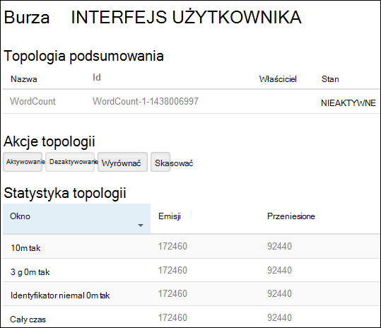
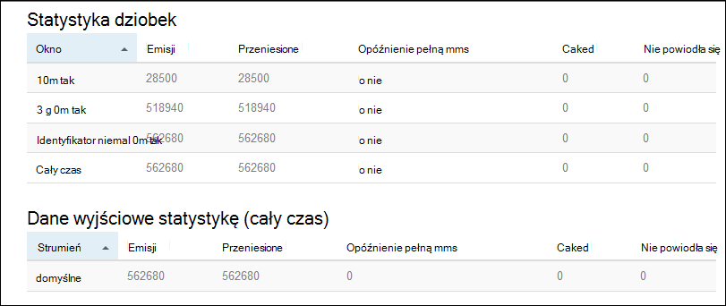

<properties
    pageTitle="Samouczek Burza Apache: rozpoczynanie pracy z systemem Linux Burza na HDInsight | Microsoft Azure"
    description="Wprowadzenie do analizy danych duży za pomocą Burza Apache i przykłady Starter Burza na podstawie Linux HDInsight. Dowiedz się, jak za pomocą Burza proces danych w czasie rzeczywistym."
    keywords="Burza Apache, samouczek Burza apache, analizy danych duży, Burza starter"
    services="hdinsight"
    documentationCenter=""
    authors="Blackmist"
    manager="jhubbard"
    editor="cgronlun"/>

<tags
   ms.service="hdinsight"
   ms.devlang="java"
   ms.topic="get-started-article"
   ms.tgt_pltfrm="na"
   ms.workload="big-data"
   ms.date="10/12/2016"
   ms.author="larryfr"/>

# Samouczek Burza Apache: rozpoczynanie pracy z próbki Burza Starter do analizy danych duży na HDInsight

Burza Apache jest system skalowalna, odporność na uszkodzenia, rozłożone, w czasie rzeczywistym obliczeń dla przetwarzania danych. Z Burza na Azure HDInsight możesz utworzyć klaster Burza opartej na chmurze wykonującego analizy dużych danych w czasie rzeczywistym.

> [AZURE.NOTE] Kroki opisane w tym artykule Utwórz klaster HDInsight systemem Linux. Aby uzyskać procedury tworzenie Burza systemu Windows w klastrze HDInsight, zobacz [Burza Apache samouczek: rozpocząć pracę z przykładowymi Burza Starter za pomocą analizy danych na HDInsight](hdinsight-apache-storm-tutorial-get-started.md)

## Wymagania wstępne

[AZURE.INCLUDE [delete-cluster-warning](../../includes/hdinsight-delete-cluster-warning.md)]

Wymagane są poniższe czynności, aby było użyć tego samouczka Burza Apache:

- **Azure subskrypcji**. Zobacz [Azure pobrać bezpłatną wersję próbną](https://azure.microsoft.com/documentation/videos/get-azure-free-trial-for-testing-hadoop-in-hdinsight/).

- **Znajomość SSH i połączenia**. Aby uzyskać więcej informacji na temat korzystania z usługi HDInsight SSH i połączenia Zobacz:

    - **Klienci Linux, Unix lub OS X**: zobacz [Używanie SSH z systemem Linux Hadoop na HDInsight z Linux, OS X lub Unix](hdinsight-hadoop-linux-use-ssh-unix.md)

    - **Klienci systemu Windows**: zobacz [Używanie SSH z systemem Linux Hadoop na HDInsight z systemu Windows](hdinsight-hadoop-linux-use-ssh-windows.md)

### Wymagania dotyczące kontroli dostępu

[AZURE.INCLUDE [access-control](../../includes/hdinsight-access-control-requirements.md)]

## Utworzyć klaster Burza

W tej sekcji można tworzyć klastrze wersji 3,2 HDInsight (Burza wersji 0.9.3) przy użyciu szablonu Azure Menedżera zasobów. Uzyskać informacje o wersji usługi HDInsight i ich poziomu zobacz [Przechowywanie wersji składnika HDInsight](hdinsight-component-versioning.md). Dla innych metod tworzenia klaster zobacz [Tworzenie HDInsight klastrów](hdinsight-hadoop-provision-linux-clusters.md).

1. Kliknij, aby otworzyć szablon w portalu Azure następujące obraz.         

    
    
    Szablon znajduje się w kontenerze publicznej obiektów blob, *https://hditutorialdata.blob.core.windows.net/armtemplates/create-linux-based-storm-cluster-in-hdinsight.json*. 
   
2. Z karta Parametry wprowadź następujące informacje:

    - **NazwaKlastra**: Wprowadź nazwę klaster Hadoop, który ma zostać utworzony.
    - **Klaster nazwę logowania i hasło**: domyślna nazwa logowania to administrator.
    - **SSH nazwy użytkownika i hasła**.
    
    Zapisz te wartości.  Należy je w dalszej części samouczka.

    > [AZURE.NOTE] SSH umożliwia zdalny dostęp do klaster HDInsight za pomocą wiersza polecenia. Nazwa użytkownika i hasło używane w tym miejscu jest używana podczas łączenia się z klastrem za pośrednictwem SSH. Ponadto SSH nazwa użytkownika musi być unikatowa, podczas tworzenia konta użytkownika na wszystkie węzły HDInsight. Poniżej przedstawiono kilka nazw kont zarezerwowana do użytku w usługach w klastrze, a nie można użyć jako nazwa użytkownika SSH:
    >
    > główny, hdiuser, burza, hbase, ubuntu, zookeeper, hdfs, przędzy, mapred, hbase, gałęzi, oozie, falcon, sqoop, administrator, tez, hcat, hdinsight zookeeper.

    > Aby uzyskać więcej informacji na temat korzystania z usługi HDInsight SSH zobacz jeden z następujących artykułów:

    > * [Używanie SSH z systemem Linux Hadoop na HDInsight z Linux, Unix lub systemu OS X](hdinsight-hadoop-linux-use-ssh-unix.md)
    > * [Używanie SSH z systemem Linux Hadoop na HDInsight z systemu Windows](hdinsight-hadoop-linux-use-ssh-windows.md)

    
3.w kliknij **przycisk OK** , aby zapisać parametry.

4. z karta **wdrożenia niestandardowe** kliknij pole listy rozwijanej **Grupa zasobów** , a następnie kliknij **Nowy** , aby utworzyć nową grupę zasobów. Grupa zasobów jest kontenerem grupującego klastrem, konto zależne miejsca do magazynowania i innych zasobów połączonych.

5 kliknij **warunki prawne**, a następnie kliknij przycisk **Utwórz**.

6 kliknij przycisk **Utwórz**. Zostanie wyświetlony fragment zatytułowany wdrożenia Submitting wdrożenia szablonu. Wystarczy o około 20 minut utworzyć klaster i baza danych SQL.

##Uruchom próbki Starter Burza na HDInsight

Przykłady [starter Burza](https://github.com/apache/storm/tree/master/examples/storm-starter) znajdują się w klastrze HDInsight. W poniższej procedurze zostanie uruchomione w przykładzie WordCount.

1. Nawiązywanie połączenia z klastrem HDInsight przy użyciu SSH:

        ssh USERNAME@CLUSTERNAME-ssh.azurehdinsight.net
        
    Jeżeli używasz hasła do zabezpieczenia konta użytkownika SSH, wyświetli się monit o wprowadź je. Jeśli został użyty klucz publiczny, może być konieczne używanie `-i` parametru do określenia pasujące klucz prywatny. Na przykład `ssh -i ~/.ssh/id_rsa USERNAME@CLUSTERNAME-ssh.azurehdinsight.net`.
        
    Aby uzyskać więcej informacji na temat korzystania z SSH z systemem Linux HDInsight zobacz następujące artykuły:
    
    * [Używanie SSH z systemem Linux Hadoop na HDInsight z Linux, Unix lub systemu OS X](hdinsight-hadoop-linux-use-ssh-unix.md)

    * [Używanie SSH z systemem Linux Hadoop na HDInsight z systemu Windows](hdinsight-hadoop-linux-use-ssh-windows)

2. Użyj następującego polecenia, aby uruchomić topologii przykładzie:

        storm jar /usr/hdp/current/storm-client/contrib/storm-starter/storm-starter-topologies-*.jar storm.starter.WordCountTopology wordcount
        
    > [AZURE.NOTE] `*` Część nazwy pliku jest używany do dopasowywania z numerem wersji, co spowoduje zmianę jako HDInsight zostanie zaktualizowany.

    Spowoduje to uruchomienie topologii WordCount przykład w klastrze z przyjazną nazwę "wordcount". Będą losowo Generowanie zdań i Zliczanie wystąpień każdego wyrazu w zdaniami.

    > [AZURE.NOTE] Podczas przesyłania topologii z klastrem, najpierw należy skopiować plik słoik zawierający klaster przed użyciem `storm` polecenia. Można to osiągnąć przy użyciu `scp` polecenia od klienta, w którym znajduje się plik. Na przykład`scp FILENAME.jar USERNAME@CLUSTERNAME-ssh.azurehdinsight.net:FILENAME.jar`
    >
    > Przykład WordCount i inne przykłady starter Burza znajdują się już w klastrze na `/usr/hdp/current/storm-client/contrib/storm-starter/`.

##Monitorowanie topologii

Interfejs użytkownika Burza udostępnia interfejs sieci web do pracy z systemem topologii i znajduje się w klastrze HDInsight.

Monitorowanie topologii przy użyciu interfejsu użytkownika burza, wykonaj następujące czynności:

1. Otwórz przeglądarkę sieci web do https://CLUSTERNAME.azurehdinsight.net/stormui, gdzie __NAZWAKLASTRA__ to nazwa klaster. Spowoduje to otwarcie Burza interfejsu użytkownika.

    > [AZURE.NOTE] Jeśli zostanie wyświetlony monit o podanie nazwy użytkownika i hasła, wprowadź administrator klastrów (Administrator) i hasło używane podczas tworzenia klaster.

2. W obszarze **Podsumowanie topologii**wybierz pozycję **wordcount** w kolumnie **Nazwa** . Spowoduje to wyświetlenie więcej informacji na temat topologii.

    

    Ta strona zawiera następujące informacje:

    * **Statystyki topologii** — podstawowe informacje na temat wydajności topologii zorganizowane na czas systemu windows.

        > [AZURE.NOTE] Wybieranie okna czasu określonego zmienia przedział czasu dla informacji wyświetlanych w innych części strony.

    * **Spouts** — podstawowe informacje o spouts, w tym ostatni błąd zwracane przez każdego dziobek.

    * **Śrub** — podstawowe informacje o tekst "Śruby".

    * **Topologia Konfiguracja** — szczegółowe informacje na temat konfiguracji topologii.

    Ta strona zawiera również akcje, które można podjąć w topologii:

    * **Aktywuj** — przetwarzanie życiorysy topologii został dezaktywowany.

    * **Dezaktywuj** — można wstrzymać uruchomionego topologii.

    * **Wyrównać** — dopasowuje podobieństwa topologii. Po zmianie liczby węzłów w klastrze, należy wyrównać uruchomionego topologii. Dzięki temu topologię, aby dostosować równoległości wyrównania zwiększonym mniejszy liczby węzłów w klastrze. Aby uzyskać więcej informacji zobacz [Opis podobieństwa topologii Burza](http://storm.apache.org/documentation/Understanding-the-parallelism-of-a-Storm-topology.html).

    * **Skasować** - kończy topologii Burza po określonym czasie.

3. Na tej stronie wybierz pozycję z sekcji **Spouts** lub **śrub** . Spowoduje to wyświetlenie informacji na temat wybranego składnika.

    

    Ta strona zawiera następujące informacje:

    * **Statystyka dziobek-błyskawicy** — podstawowe informacje na temat wydajności składnikami zorganizowane w uruchomieniu systemu windows.

        > [AZURE.NOTE] Wybieranie okna określonego czasu zmienia przedział czasu dla informacji wyświetlanych w innych części strony.

    * **Statystyki wprowadzania** (tylko śruby) — informacje na temat składników powodującymi zużywanej przez śruby danych.

    * **Dane wyjściowe statystykę** — informacje na temat danych dostarczanych przez ten błyskawicy.

    * **Testamentu** - informacji na temat wystąpienia tego składnika.

    * **Błędy** - błędy tworzone przez tego składnika.

4. Podczas wyświetlania szczegółów dziobek lub błyskawicy, wybierz pozycję w kolumnie **Port** w sekcji **testamentu** , aby wyświetlić szczegóły dotyczące konkretnego wystąpienia składnika.

        2015-01-27 14:18:02 b.s.d.task [INFO] Emitting: split default ["with"]
        2015-01-27 14:18:02 b.s.d.task [INFO] Emitting: split default ["nature"]
        2015-01-27 14:18:02 b.s.d.executor [INFO] Processing received message source: split:21, stream: default, id: {}, [snow]
        2015-01-27 14:18:02 b.s.d.task [INFO] Emitting: count default [snow, 747293]
        2015-01-27 14:18:02 b.s.d.executor [INFO] Processing received message source: split:21, stream: default, id: {}, [white]
        2015-01-27 14:18:02 b.s.d.task [INFO] Emitting: count default [white, 747293]
        2015-01-27 14:18:02 b.s.d.executor [INFO] Processing received message source: split:21, stream: default, id: {}, [seven]
        2015-01-27 14:18:02 b.s.d.task [INFO] Emitting: count default [seven, 1493957]

    Z tych danych można zobaczyć, że program word **siedem** wystąpił 1493957 razy. To, ile razy go wystąpił od uruchomienia tej topologii.

##Zatrzymywanie topologii

Wróć do strony **Podsumowanie topologii** topologii Statystyka wyrazów, a następnie wybierz przycisk **skasować** w sekcji **Akcje topologii** . Po wyświetleniu monitu wprowadź 10 dla sekundach oczekiwania zatrzymywanie topologii. Limit czasu, po topologii nie będzie już wyświetlana podczas odwiedzania sekcji **Interfejsu użytkownika Burza** pulpitu nawigacyjnego.

##Usuwanie klaster

[AZURE.INCLUDE [delete-cluster-warning](../../includes/hdinsight-delete-cluster-warning.md)]

##Następne kroki

W tym samouczku Apache Burza został użyty Starter burza, aby dowiedzieć się, jak tworzyć Burza w klastrze HDInsight i wdrażanie, monitorowanie i zarządzanie nią topologii Burza za pomocą pulpitu nawigacyjnego Burza. Teraz dowiesz się, jak [topologii oparte na opracowywanie Java przy użyciu środowiska Maven](hdinsight-storm-develop-java-topology.md).

Jeśli już znasz opracowywania topologii opartego na języku Java i chcesz wdrożyć istniejących topologii HDInsight, zobacz [rozmieszczanie i zarządzanie nimi topologii Burza Apache na HDInsight](hdinsight-storm-deploy-monitor-topology-linux.md).

Jeśli jesteś deweloperem .NET, możesz utworzyć C# lub hybrydowych C# / topologii Java przy użyciu programu Visual Studio. Aby uzyskać więcej informacji zobacz [topologii opracowywanie C# dla Burza Apache na HDInsight przy użyciu narzędzia Hadoop programu Visual Studio](hdinsight-storm-develop-csharp-visual-studio-topology.md).

Na przykład topologii, które mogą być używane z Burza na HDInsight, zobacz poniższe przykłady:

    * [Przykład topologii dla Burza na HDInsight](hdinsight-storm-example-topology.md)

[apachestorm]: https://storm.incubator.apache.org
[stormdocs]: http://storm.incubator.apache.org/documentation/Documentation.html
[stormstarter]: https://github.com/apache/storm/tree/master/examples/storm-starter
[stormjavadocs]: https://storm.incubator.apache.org/apidocs/
[azureportal]: https://manage.windowsazure.com/
[hdinsight-provision]: hdinsight-provision-clusters.md
[preview-portal]: https://portal.azure.com/
