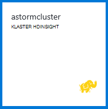

<properties
    pageTitle="Burza Apache samouczek: wprowadzenie do Burza | Microsoft Azure"
    description="Wprowadzenie do analizy danych duży za pomocą Burza Apache i przykłady Starter Burza na HDInsight. Dowiedz się, jak za pomocą Burza proces danych w czasie rzeczywistym."
    keywords="Burza Apache, samouczek Burza apache, analizy danych duży, Burza starter"
    services="hdinsight"
    documentationCenter=""
    authors="Blackmist"
    manager="jhubbard"
    editor="cgronlun"
    tags="azure-portal"/>

<tags
   ms.service="hdinsight"
   ms.devlang="java"
   ms.topic="article"
   ms.tgt_pltfrm="na"
   ms.workload="big-data"
   ms.date="09/07/2016"
   ms.author="larryfr"/>

# Samouczek Burza Apache: rozpoczynanie pracy z próbki Burza Starter do analizy danych duży na HDInsight

Burza Apache jest system skalowalna, odporność na uszkodzenia, rozłożone, w czasie rzeczywistym obliczeń dla przetwarzania danych. Z Burza na Microsoft Azure HDInsight możesz utworzyć klaster Burza opartej na chmurze wykonującego analizy dużych danych w czasie rzeczywistym. 

> [AZURE.NOTE] Kroki opisane w tym artykule Utwórz klaster HDInsight systemu Windows. Aby uzyskać procedury tworzenie Burza systemem Linux w klastrze HDInsight, zobacz [Burza Apache samouczek: rozpocząć pracę z przykładowymi Burza Starter za pomocą analizy danych na HDInsight](hdinsight-apache-storm-tutorial-get-started-linux.md)

## Wymagania wstępne

[AZURE.INCLUDE [delete-cluster-warning](../../includes/hdinsight-delete-cluster-warning.md)]

Wymagane są poniższe czynności, aby było użyć tego samouczka Burza Apache:

- **Azure subskrypcji**. Zobacz [Azure pobrać bezpłatną wersję próbną](https://azure.microsoft.com/documentation/videos/get-azure-free-trial-for-testing-hadoop-in-hdinsight/).

### Wymagania dotyczące kontroli dostępu

[AZURE.INCLUDE [access-control](../../includes/hdinsight-access-control-requirements.md)]

## Utworzyć klaster Burza

Burza na HDInsight używa magazyn obiektów Blob platformy Azure do przechowywania plików dziennika i topologii przesłane z klastrem. Aby utworzyć konto Azure miejsca do magazynowania do użytku z klaster, wykonaj następujące czynności:

1. Zaloguj się do [portalu Azure][preview-portal].

2. Wybierz pozycję **Nowy**wybierz __Analizy danych__, a następnie wybierz pozycję __HDInsight__.

    

3. Wprowadź __nazwę klaster__. Zielony znacznik wyboru pojawia się obok __Nazwy klaster__ , jeśli jest dostępna.

4. Jeśli masz więcej niż jedną subskrypcję, wybierz pozycję __subskrypcji__ , aby zaznaczyć Azure subskrypcji, która będzie używana dla klaster.

5.  __Wybieranie typu klaster__ umożliwia wybierz klaster __Burza__ . W __systemie operacyjnym__wybierz systemu Windows. Dla __Poziomu klaster__wybierz pozycję standardowe. Na koniec aby zapisać te ustawienia za pomocą przycisku Wybierz.

    

5. __Grupa zasobów__możesz nam listy rozwijanej listy, aby wyświetlić listę istniejących grup zasobów, a następnie wybierz pozycję jeden, aby utworzyć klaster w. Lub możesz wybierz pozycję __Nowy__ , a następnie wprowadź nazwę nowej grupy zasobów. Zielony znacznik wyboru zostanie wyświetlony wskazujący, jeśli nazwy nowej grupy jest dostępna.

6. Wybierz pozycję __poświadczenia__, a następnie wprowadź nazwę __Klaster logowania użytkownika__ i __Hasło logowania klaster__. Na koniec umożliwia __Wybierz pozycję__ Ustaw poświadczenia. Pulpit zdalny nie będą używane w tym dokumencie, aby pozostawić dodatek wyłączony.

    

6. __Źródła danych__zaznacz tę pozycję, aby wybrać istniejącego źródła danych lub Utwórz nowy.

    

    Obecnie można wybrać konto Azure magazynowania jako źródła danych dla klastrów HDInsight. Opis wpisów na karta __Źródła danych__ , należy wykonać następujące kroki.

    - __Wybór metody__: można ustawić __ze wszystkich subskrypcji__ umożliwiające przeglądanie kont miejsca do magazynowania w subskrypcji. Ustaw __Klucz dostępu__ , jeśli chcesz wprowadzić __Nazwę miejsca do magazynowania__ i __Klawisz dostępu__ istniejącego konta miejsca do magazynowania.

    - __Utwórz nowy__: umożliwia utworzenie nowego konta miejsca do magazynowania. Za pomocą pola, które zostanie wyświetlone, aby wprowadzić nazwę konta magazynu. Zielony znacznik wyboru pojawia się nazwa jest dostępna.

    - __Wybieranie domyślnego kontenera__: umożliwia wprowadź nazwę domyślnego kontenera dla klaster. Można wprowadzić dowolną nazwę poniżej, zaleca się pod tą samą nazwą co klaster tak, aby łatwo rozpoznać, że kontener jest używany dla określonych klaster.

    - __Lokalizacja__: regionu geograficznego, który będzie konta miejsca do magazynowania w lub zostanie utworzony w.

        > [AZURE.IMPORTANT] Wybieranie lokalizacji domyślne źródło danych ustawia również lokalizacji klaster HDInsight. Klaster i domyślne źródła danych musi znajdować się w tym samym regionie.

    - __Wybierz pozycję__: umożliwia zapisywanie konfiguracji źródła danych.

7. Zaznacz __Warstwy ceny węzeł__ do wyświetlania informacji na temat węzły, które zostaną utworzone dla tej klaster. Domyślnie liczby węzłów pracownik jest równa __4__. Ustaw to __1__, jak to jest wystarczające dla tego samouczka i zmniejsza koszt klaster. Szacowany koszt klaster jest wyświetlany w dolnej części ta karta.

    

    Za pomocą funkcji __Wybierz__ zapisywanie informacji __Węzeł ceny warstwy__ .

8. Wybierz pozycję __opcjonalnym__. Ta karta umożliwia wybieranie wersji klaster, a także skonfigurować inne ustawienia opcjonalne, takie jak dołączania __Wirtualną sieć__.

    

9. Upewnij się, że __Przypnij do Startboard__ jest zaznaczone, a następnie wybierz pozycję __Utwórz__. Tworzy klaster i dodaje ją kafelka do Startboard portalu sieci Azure. Ikona wskazuje, że inicjowania obsługi administracyjnej klaster, a zostanie wyświetlona ikona HDInsight raz inicjowania obsługi administracyjnej zostało zakończone.

  	| Podczas inicjowania obsługi administracyjnej | Obsługa administracyjna wykonania |
  	| ------------------ | --------------------- |
  	|  |  |

    > [AZURE.NOTE] Wystarczy trochę czasu, aby klaster można utworzyć, zwykle około 15 minut. W systemie fragmentu Startboard lub wpisu __powiadomienia__ w lewej części strony, aby sprawdzić procesu inicjowania obsługi administracyjnej.

## Uruchom próbki Starter Burza na HDInsight

Ten samouczek Burza Apache wprowadza do analizy danych duży korzystanie z przykładów Starter Burza na GitHub.

Każdy Burza w klastrze HDInsight zawiera Burza pulpitu nawigacyjnego, które mogą być używane do przekazywania i uruchamiania w klastrze Burza topologii. Każdy klaster zawiera również topologii próbki, które mogą być uruchamiane bezpośrednio z pulpitu nawigacyjnego Burza.

### Nawiązywanie połączenia z pulpitu nawigacyjnego

Pulpit nawigacyjny znajduje się w **https://&lt;NazwaKlastra >.azurehdinsight.net//**, gdzie **NazwaKlastra** jest nazwę grupie. Można również znaleźć link do pulpitu nawigacyjnego, wybierając klaster z Startboard i kliknąć łącze __pulpitu nawigacyjnego__ w górnej części karta.

> [AZURE.NOTE] Podczas łączenia z pulpitu nawigacyjnego, zostanie wyświetlony monit o wprowadzenie nazwy użytkownika i hasła. Jest to nazwa administratora (**Administrator**) i hasło używane podczas tworzenia klaster.

Po załadowaniu pulpitu nawigacyjnego burza, zostanie wyświetlony formularz **Przesyłanie topologii** .

Formularz **Przesyłania topologii** umożliwia przekazywanie i uruchamiać pliki .jar, które zawierają topologii Burza. Zawiera również kilka próbek podstawowych, które są dostarczane z klastrem.

### Uruchamianie przykładowych Statystyka wyrazów z projektu Burza Starter w GitHub

Przykłady te z klastrem zawiera kilka zmian topologii zliczanie w programie word. Te przykłady zawierają **spout** który losowo emituje zdań i **śrub** podziału każdego zdania na pojedyncze wyrazy, a następnie zliczania, ile razy wystąpił każdego wyrazu. Te przykłady są z [próbki Starter Burza](https://github.com/apache/storm/tree/master/examples/storm-starter)będące częścią Burza Apache.

Wykonaj poniższe czynności, aby uruchomić próbki Starter Burza:

1. Z listy rozwijanej **Jar plik** , wybierz pozycję **StormStarter - WordCount** . Spowoduje to wypełnienie pola **Nazwa klasy** i **Dodatkowe parametry** parametrów w tym przykładzie.

    

    * **Nazwa klasy** - klasy w pliku .jar, który przesyła topologii.
    * **Dodatkowe parametry** — wszelkie parametry wymagane przez topologii. W tym przykładzie pole służy do podania przyjaznej nazwy dla przesłanych topologii.

2. Kliknij przycisk **Prześlij**. Po chwili pole **wynik** zawiera polecenia umożliwiające przesyłanie zadania, a także wyniki działania polecenia. W polu **błędu** są wyświetlane wszystkie błędy składając topologii.

    

    > [AZURE.NOTE] Wyniki nie wskazują topologii zakończenie - **Burza topologii, po uruchomieniu zostanie uruchomiony do momentu zatrzymania go.** Topologia Statystyka wyrazów generuje losową zdań i zlicza, ile razy napotkania każdego wyrazu do momentu zatrzymania go.

### Monitorowanie topologii

Interfejs użytkownika Burza może służyć do monitorowania topologii.

1. U góry pulpitu nawigacyjnego burza, wybierz pozycję **Burza interfejsu użytkownika** . Spowoduje to wyświetlenie informacje podsumowujące dla klaster i wszystkie uruchomione topologii.

    

    Na stronie powyżej widać razem, gdy topologii była aktywna, a także liczbę pracowników, testamentu i zadań używane.

    > [AZURE.NOTE] W kolumnie **Nazwa** zawiera podanej przyjaznej nazwy wcześniej za pośrednictwem pola **Dodatkowe parametry** .

4. W obszarze **Podsumowanie topologii**wybierz pozycję **wordcount** w kolumnie **Nazwa** . Spowoduje to wyświetlenie więcej informacji na temat topologii.

    

    Ta strona zawiera następujące informacje:

    * **Statystyki topologii** — podstawowe informacje na temat wydajności topologii zorganizowane na czas systemu windows.

        > [AZURE.NOTE] Wybieranie okna określonego czasu zmienia przedział czasu dla informacji wyświetlanych w innych części strony.

    * **Spouts** — podstawowe informacje o spouts, w tym ostatni błąd zwracane przez każdego dziobek.

    * **Śrub** — podstawowe informacje o tekst "Śruby".

    * **Topologia Konfiguracja** — szczegółowe informacje na temat konfiguracji topologii.

    Ta strona zawiera również akcje, które można podjąć w topologii:

    * **Aktywuj** — przetwarzanie życiorysy topologii został dezaktywowany.

    * **Dezaktywuj** — można wstrzymać żywa topologii.

    * **Wyrównać** — dopasowuje podobieństwa topologii. Po zmianie liczby węzłów w klastrze, należy wyrównać uruchomionego topologii. Dzięki temu topologię, aby dostosować równoległości wyrównania zwiększone mniejszy liczby węzłów w klastrze. Aby uzyskać więcej informacji zobacz [Opis podobieństwa topologii Burza](http://storm.apache.org/documentation/Understanding-the-parallelism-of-a-Storm-topology.html).

    * **Skasować** - kończy topologii Burza po określonym czasie.

5. Na tej stronie wybierz pozycję z sekcji **Spouts** lub **śrub** . Spowoduje to wyświetlenie informacji na temat wybranego składnika.

    

    Ta strona zawiera następujące informacje:

    * **Statystyka dziobek-błyskawicy** — podstawowe informacje na temat wydajności składnikami zorganizowane w uruchomieniu systemu windows.

        > [AZURE.NOTE] Wybieranie okna określonego czasu zmienia przedział czasu dla informacji wyświetlanych w innych części strony.

    * **Statystyki wprowadzania** (tylko śruby) — informacje na temat składników powodującymi zużywanej przez śruby danych.

    * **Dane wyjściowe statystykę** — informacje na temat danych dostarczanych przez ten błyskawicy.

    * **Testamentu** - informacji na temat wystąpienia tego składnika.

    * **Błędy** - błędy tworzone przez tego składnika.

5. Podczas wyświetlania szczegółów dziobek lub błyskawicy, wybierz pozycję w kolumnie **Port** w sekcji **testamentu** , aby wyświetlić szczegóły dotyczące konkretnego wystąpienia składnika.

        2015-01-27 14:18:02 b.s.d.task [INFO] Emitting: split default ["with"]
        2015-01-27 14:18:02 b.s.d.task [INFO] Emitting: split default ["nature"]
        2015-01-27 14:18:02 b.s.d.executor [INFO] Processing received message source: split:21, stream: default, id: {}, [snow]
        2015-01-27 14:18:02 b.s.d.task [INFO] Emitting: count default [snow, 747293]
        2015-01-27 14:18:02 b.s.d.executor [INFO] Processing received message source: split:21, stream: default, id: {}, [white]
        2015-01-27 14:18:02 b.s.d.task [INFO] Emitting: count default [white, 747293]
        2015-01-27 14:18:02 b.s.d.executor [INFO] Processing received message source: split:21, stream: default, id: {}, [seven]
        2015-01-27 14:18:02 b.s.d.task [INFO] Emitting: count default [seven, 1493957]

    Z tych danych można zobaczyć, że program word **siedem** wystąpił 1,493,957 razy. To, ile razy go wystąpił od uruchomienia tej topologii.

### Zatrzymywanie topologii

Wróć do strony **Podsumowanie topologii** topologii Statystyka wyrazów, a następnie wybierz pozycję **skasować** w sekcji **Akcje topologii** . Po wyświetleniu monitu wprowadź 10 dla sekundach oczekiwania zatrzymywanie topologii. Limit czasu, po topologii przestanie być wyświetlane po otwarciu sekcji **Interfejsu użytkownika Burza** pulpitu nawigacyjnego.

##Usuwanie klaster

[AZURE.INCLUDE [delete-cluster-warning](../../includes/hdinsight-delete-cluster-warning.md)]

## Podsumowanie

W tym samouczku Apache Burza został użyty Starter burza, aby dowiedzieć się, jak tworzyć Burza w klastrze HDInsight i wdrażanie, monitorowanie i zarządzanie nią topologii Burza za pomocą pulpitu nawigacyjnego Burza.

## Następne kroki

* **Usługa HDInsight Tools for Visual Studio** — narzędzia HDInsight umożliwia przesyłanie, monitorowanie i zarządzanie topologii Burza podobne do pulpitu nawigacyjnego Burza wspomniano wcześniej za pomocą programu Visual Studio. Narzędzia HDInsight również zawiera możliwość tworzenia topologii C# Burza oraz topologii próbki, które można wdrożyć i uruchamiania w klastrze.

    Aby uzyskać więcej informacji zobacz [Wprowadzenie do narzędzia HDInsight programu Visual Studio](hdinsight-hadoop-visual-studio-tools-get-started.md).

* **Przykładowe pliki** - klaster Burza HDInsight zawiera kilka przykładów w katalogu **%STORM_HOME%\contrib** . Każdy przykład powinien zawierać następujące czynności:

    * Kod źródłowy — na przykład Burza starter-0.9.1.2.1.5.0-2057-sources.jar

    * Dokumenty Java — na przykład Burza starter-0.9.1.2.1.5.0-2057-javadoc.jar

    * Przykład — na przykład storm-starter-0.9.1.2.1.5.0-2057-jar-with-dependencies.jar

    Aby wyodrębnić kodu źródłowego lub Java dokumentów za pomocą polecenia "jar". Na przykład "jar - xvf Burza-starter-0.9.1.2.1.5.0.2057-javadoc.jar".

    > [AZURE.NOTE] Dokumenty Java składają się z stron sieci Web. Po wyodrębnionych, przejrzyj plik **index.html** za pomocą przeglądarki.

    Aby uzyskać dostęp do tych przykładów, możesz włączyć pulpitu zdalnego dla Burza w klastrze HDInsight, a następnie skopiuj pliki z **%STORM_HOME%\contrib**.

* Ten dokument zawiera listę inne przykłady, które mogą być używane z Burza na HDInsight:

    * [Przykład topologii dla Burza na HDInsight](hdinsight-storm-example-topology.md)

[apachestorm]: https://storm.incubator.apache.org
[stormdocs]: http://storm.incubator.apache.org/documentation/Documentation.html
[stormstarter]: https://github.com/apache/storm/tree/master/examples/storm-starter
[stormjavadocs]: https://storm.incubator.apache.org/apidocs/
[azureportal]: https://manage.windowsazure.com/
[hdinsight-provision]: hdinsight-provision-clusters.md
[preview-portal]: https://portal.azure.com/
