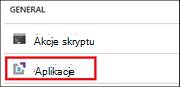
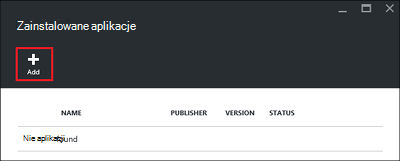
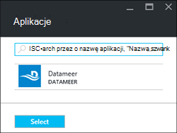
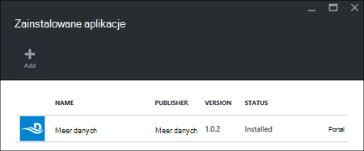

<properties
    pageTitle="Instalowanie aplikacji Hadoop na HDInsight | Microsoft Azure"
    description="Dowiedz się, jak zainstalować aplikacje HDInsight na HDInsight aplikacji."
    services="hdinsight"
    documentationCenter=""
    authors="mumian"
    manager="jhubbard"
    editor="cgronlun"
    tags="azure-portal"/>

<tags
    ms.service="hdinsight"
    ms.devlang="na"
    ms.topic="hero-article"
    ms.tgt_pltfrm="na"
    ms.workload="big-data"
    ms.date="09/14/2016"
    ms.author="jgao"/>

# Instalowanie aplikacji HDInsight

Aplikacja HDInsight jest aplikacja, z której użytkownicy mogą zainstalować w klastrze HDInsight systemem Linux. Te aplikacje mogą opracowane przez firmę Microsoft, niezależnych dostawców oprogramowania (Model) lub przez siebie. W tym artykule dowiesz się, jak zainstalować opublikowaną aplikację. Dotyczące instalowania aplikacji, zobacz [Instalowanie niestandardowe aplikacje HDInsight](hdinsight-apps-install-custom-applications.md). 

Jest obecnie jednej opublikowanej aplikacji:

- **Datameer**: [Datameer](http://www.datameer.com/documentation/display/DAS50/Home?ls=Partners&lsd=Microsoft&c=Partners&cd=Microsoft) oferuje analityków interakcyjne sposób na odnajdowanie, analizowanie i wizualizowanie wyników na duży danych. Uwzględniał dodatkowe źródła danych łatwo, aby odnaleźć nowe relacje i szybko potrzebne odpowiedzi.

>[AZURE.NOTE] Datameer jest obecnie obsługiwane tylko w klastrów w wersji 3,2 Azure HDInsight.

Azure portal za pomocą z instrukcjami podanymi w tym artykule. Można również wyeksportować szablon Menedżera zasobów Azure z portalu lub uzyskać kopię szablonu Menedżera zasobów od dostawców i wdrożyć szablonu przy użyciu programu PowerShell Azure i polecenie Azure.  Zobacz [Hadoop systemem Linux oraz tworzenie klastrów w HDInsight przy użyciu szablonów Menedżera zasobów](hdinsight-hadoop-create-linux-clusters-arm-templates.md).

## Wymagania wstępne

Jeśli chcesz zainstalować aplikacje HDInsight na istniejącym klastrem HDInsight musi być klaster HDInsight. Aby utworzyć ankietę, zobacz [Tworzenie klastrów](hdinsight-hadoop-linux-tutorial-get-started.md#create-cluster). Można również zainstalować aplikacje HDInsight podczas tworzenia klaster HDInsight.

## Instalowanie aplikacji do istniejących klastrów

Poniższa procedura pokazano, jak zainstalować aplikacje HDInsight z istniejącym klastrem HDInsight.

**Aby zainstalować aplikację HDInsight**

1. Zaloguj się do [portalu Azure](https://portal.azure.com).
2. Kliknij pozycję **Klastrów HDInsight** w menu po lewej stronie.  Jeśli nie widzisz, kliknij przycisk **Przeglądaj**, a następnie kliknij **Klastrów HDInsight**.
3. Kliknij pozycję klaster HDInsight.  Jeśli nie istnieje, musisz utworzyć jeden pierwszy.  zobacz [Tworzenie klastrów](hdinsight-hadoop-linux-tutorial-get-started.md#create-cluster).
4. Karta **Ustawienia** kliknij **aplikacji** w kategorii **Ogólne** . Karta **Zainstalowane aplikacje** wymieniono wszystkie zainstalowane aplikacje. 

    

5. Z menu karta, kliknij przycisk **Dodaj** . 

    

    Są zostanie wyświetlona lista istniejących aplikacji HDInsight.

    

6. Kliknij jedną z aplikacji, zaakceptuj warunki prawne, a następnie kliknij przycisk **Wybierz**.

Można wyświetlić stan instalacji z portalu powiadomienia (kliknij ikonę dzwonka w górnej części portalu). Po zainstalowaniu aplikacji aplikacji pojawią się na karta zainstalowane aplikacje.

## Instalowanie aplikacji podczas tworzenia klaster

Masz opcję, aby zainstalować aplikacje HDInsight podczas tworzenia klastrze. W trakcie procesu HDInsight aplikacje są instalowane po utworzeniu klaster i jest w stanie uruchomienia. Poniższa procedura pokazano, jak zainstalować aplikacje HDInsight podczas tworzenia klastrze.

**Aby zainstalować aplikację HDInsight**

1. Zaloguj się do [portalu Azure](https://portal.azure.com).
2. Kliknij przycisk **Nowy**, kliknij pozycję **dane + analizy**, a następnie kliknij **HDInsight**.
3. Wprowadź **Nazwę klaster**: Ta nazwa musi być globalnie unikatowe.
4. Kliknij pozycję **Subskrypcja** Wybierz subskrypcję Azure używany w klastrze.
5. Kliknij przycisk **Wybierz klaster typ**, a następnie wybierz pozycję:

    - **Typ klaster**: Jeśli nie wiesz, co wybrać, wybierz pozycję **Hadoop**. Najpopularniejszym typem klaster jest.
    - **System operacyjny**: Wybierz **Linux**.
    - **Wersja**: Użyj wersji domyślnej, jeśli nie wiesz, co do wyboru. Aby uzyskać więcej informacji zobacz [HDInsight klaster wersji](hdinsight-component-versioning.md).
    - **Klaster warstwa**: Usługa Azure HDInsight zawiera ofertę chmury duży danych na dwie kategorie: warstwa standardowy i warstwa Premium. Aby uzyskać więcej informacji zobacz [poziomy klaster](hdinsight-hadoop-provision-linux-clusters.md#cluster-tiers).
6. Kliknij pozycję **aplikacje**, kliknij jeden z opublikowanych aplikacji, a następnie kliknij **Wybierz**.
6. Kliknij pozycję **poświadczeń** , a następnie wprowadź hasło dla użytkownika administratora. Należy również wprowadzić **SSH nazwy użytkownika** i **HASŁA** lub **Klucz PUBLICZNY**, które będą używane do uwierzytelnienia użytkownika SSH. Za pomocą klucza publicznego jest zalecane podejście. U dołu w celu zapisania konfiguracji poświadczeń, kliknij przycisk **Wybierz** .
8. Kliknij przycisk **Źródło danych**, wybierz jedną z istniejącego konta miejsca do magazynowania lub Utwórz nowe konto przestrzeni dyskowej, aby służyć jako konto domyślne miejsca do magazynowania dla klaster.
9. Kliknij przycisk **Grupa zasobów** , aby zaznaczyć istniejącej grupy zasobów, lub kliknij przycisk **Nowy** , aby utworzyć nową grupę zasobów

10. Na karta **Nowy klaster HDInsight** Sprawdź **Przypnij do Startboard** jest zaznaczone, a następnie kliknij przycisk **Utwórz**. 

## Listy zainstalowane aplikacje HDInsight i właściwości

Portalu zawiera listę zainstalowanych aplikacji HDInsight dla klastrów i właściwości każdej zainstalowanych aplikacji.

**Aby liście aplikacji HDInsight i wyświetlić właściwości**

1. Zaloguj się do [portalu Azure](https://portal.azure.com).
2. Kliknij pozycję **Klastrów HDInsight** w menu po lewej stronie.  Jeśli nie widzisz, kliknij przycisk **Przeglądaj**, a następnie kliknij **Klastrów HDInsight**.
3. Kliknij pozycję klaster HDInsight.
4. Karta **Ustawienia** kliknij **aplikacji** w kategorii **Ogólne** . Karta zainstalowane aplikacje wymieniono wszystkie zainstalowane aplikacje. 

    

5. Kliknij jeden z zainstalowanych aplikacji, aby wyświetlić właściwości. Karta właściwości listy:

    - Nazwa aplikacji: Nazwa aplikacji.
    - Stan: stan aplikacji. 
    - Strony sieci Web: Adres URL aplikacji sieci web, który został wdrożony do węzła krawędź, jeśli występuje dowolny. Parametr credential jest taka sama, jak poświadczeń użytkownika HTTP, skonfigurowane do klaster.
    - Punkt końcowy HTTP: poświadczenia jest taka sama jak poświadczeń użytkownika HTTP, skonfigurowane do klaster. 
    - Punkt końcowy SSH: umożliwia [SSH](hdinsight-hadoop-linux-use-ssh-unix.md) nawiązać węzeł krawędzi. Poświadczenia SSH różnią się od poświadczeń użytkownika SSH skonfigurowane do klaster.

6. Aby usunąć aplikację, kliknij prawym przyciskiem myszy aplikację, a następnie kliknij polecenie **Usuń** z menu kontekstowego.

## Nawiązywanie połączenia z węzeł krawędzi

Można nawiązać węzeł edge przy użyciu protokołu HTTP i SSH. Informacje o punktach końcowych można znaleźć w [portalu](#list-installed-hdinsight-apps-and-properties). Aby uzyskać więcej informacji na temat korzystania z SSH zobacz [Używanie SSH z systemem Linux Hadoop na HDInsight z Linux, Unix lub OS X](hdinsight-hadoop-linux-use-ssh-unix.md). 

Poświadczenia punktu końcowego HTTP są poświadczenia użytkownika HTTP, skonfigurowane dla klastrów HDInsight; poświadczenia punktu końcowego SSH są skonfigurowane do klaster HDInsight poświadczenia SSH.

## Rozwiązywanie problemów

Zobacz [Rozwiązywanie problemów z instalacją](hdinsight-apps-install-custom-applications.md#troubleshoot-the-installation).

## Następne kroki

- [Instalowanie niestandardowej aplikacji HDInsight](hdinsight-apps-install-custom-applications.md): Dowiedz się, jak wdrożyć aplikację HDInsight nie opublikowanych w HDInsight.
- [Publikowanie HDInsight aplikacji](hdinsight-apps-publish-applications.md): Dowiedz się, jak opublikować niestandardowe aplikacje HDInsight Azure Marketplace.
- [MSDN: zainstalować aplikację HDInsight](https://msdn.microsoft.com/library/mt706515.aspx): Dowiedz się, jak zdefiniować HDInsight aplikacji.
- [Przy użyciu akcji skryptu klastrów systemem Linux Dostosowywanie HDInsight](hdinsight-hadoop-customize-cluster-linux.md): Dowiedz się, jak zainstalować dodatkowe aplikacje za pomocą skryptu akcji.
- [Oparte na tworzenie Linux Hadoop klastrów w HDInsight przy użyciu szablonów Menedżera zasobów](hdinsight-hadoop-create-linux-clusters-arm-templates.md): Dowiedz się, jak połączeń szablony Menedżera zasobów do tworzenia HDInsight klastrów.
- [Użyj pustego krawędzi węzłów na HDInsight](hdinsight-apps-use-edge-node.md): Dowiedz się, jak użyć węzła pustych krawędzi uzyskiwania dostępu do usługi HDInsight klaster, testowania aplikacji HDInsight oraz hostingu aplikacji HDInsight.

