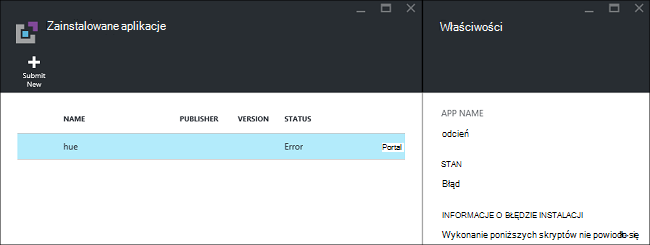
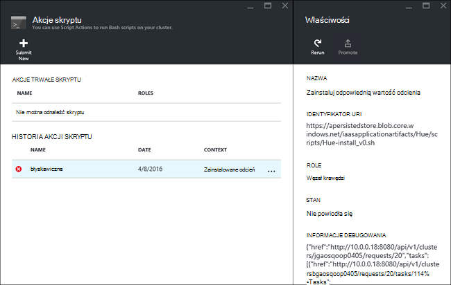

<properties
    pageTitle="Instalowanie aplikacji Hadoop na HDInsight | Microsoft Azure"
    description="Dowiedz się, jak zainstalować aplikacje HDInsight na HDInsight aplikacji."
    services="hdinsight"
    documentationCenter=""
    authors="mumian"
    manager="jhubbard"
    editor="cgronlun"
    tags="azure-portal"/>

<tags
    ms.service="hdinsight"
    ms.devlang="na"
    ms.topic="hero-article"
    ms.tgt_pltfrm="na"
    ms.workload="big-data"
    ms.date="09/14/2016"
    ms.author="jgao"/>

# Instalowanie aplikacji niestandardowych HDInsight

Aplikacja HDInsight jest aplikacja, z której użytkownicy mogą zainstalować w klastrze HDInsight systemem Linux.  Te aplikacje mogą opracowywane przez firmę Microsoft, niezależnych dostawców oprogramowania (Model) lub przez siebie. W tym artykule dowiesz się, jak zainstalować aplikację usługi HDInsight, która nie została opublikowana Portal Azure na HDInsight. Aplikację, która zostanie zainstalowany jest [odcień](http://gethue.com/). 

Inne artykuły pokrewne:

- [Instalowanie usługi HDInsight aplikacji](hdinsight-apps-install-applications.md): Dowiedz się, jak zainstalować aplikację HDInsight do klastrów.
- [Publikowanie HDInsight aplikacji](hdinsight-apps-publish-applications.md): Dowiedz się, jak opublikować niestandardowe aplikacje HDInsight Azure Marketplace.
- [MSDN: zainstalować aplikację HDInsight](https://msdn.microsoft.com/library/mt706515.aspx): Dowiedz się, jak zdefiniować HDInsight aplikacji.

 
## Wymagania wstępne

Jeśli chcesz zainstalować aplikacje HDInsight na istniejącym klastrem HDInsight musi być klaster HDInsight. Aby utworzyć ankietę, zobacz [Tworzenie klastrów](hdinsight-hadoop-linux-tutorial-get-started.md#create-cluster). Można również zainstalować aplikacje HDInsight podczas tworzenia klaster HDInsight.

## Instalowanie aplikacji HDInsight

Po utworzeniu klastrze lub z istniejącym klastrem HDInsight można zainstalować aplikacje HDInsight. Aby zdefiniować szablony Azure Menedżera zasobów, zobacz [MSDN: zainstalować aplikację HDInsight](https://msdn.microsoft.com/library/mt706515.aspx).

Pliki potrzebne do wdrożenia tej aplikacji (Odcień):

- [azuredeploy.JSON](https://github.com/hdinsight/Iaas-Applications/blob/master/Hue/azuredeploy.json): Menedżer zasobów szablonu dotyczące instalowania aplikacji usługi HDInsight. Zobacz [MSDN: zainstalować aplikację HDInsight](https://msdn.microsoft.com/library/mt706515.aspx) do projektowania szablonu Menedżera zasobów.
- [odcień install_v0.sh](https://github.com/hdinsight/Iaas-Applications/blob/master/Hue/scripts/Hue-install_v0.sh): akcji skryptu wywoływana w szablonie Menedżera zasobów do konfigurowania węzeł krawędzi. 
- [odcień binaries.tgz](https://hdiconfigactions.blob.core.windows.net/linuxhueconfigactionv01/hue-binaries-14-04.tgz): plik binarny odcień wywoływana z install_v0.sh Hui firmy. 
- [odcień-plików binarnych-14-04.tgz](https://hdiconfigactions.blob.core.windows.net/linuxhueconfigactionv01/hue-binaries-14-04.tgz): plik binarny odcień wywoływana z install_v0.sh Hui firmy. 
- [webwasb tomcat.tar.gz](https://hdiconfigactions.blob.core.windows.net/linuxhueconfigactionv01/webwasb-tomcat.tar.gz): próbki aplikacji sieci web (Tomcat) wywoływana z install_v0.sh Hui firmy.

**Aby zainstalować odcień z istniejącym klastrem HDInsight**

1. Kliknij obraz następujące czynności, aby zalogować się do Azure i otwórz szablon Menedżera zasobów w Azure Portal. 

    

    Kliknięcie tego przycisku spowoduje otwarty szablon Menedżera zasobów w portalu Azure.  Szablon Menedżera zasobów znajduje się w [https://github.com/hdinsight/Iaas-Applications/tree/master/Hue](https://github.com/hdinsight/Iaas-Applications/tree/master/Hue).  Aby dowiedzieć się, jak napisać ten szablon Menedżera zasobów, zobacz [MSDN: zainstalować aplikację HDInsight](https://msdn.microsoft.com/library/mt706515.aspx).
    
2. Z karta **Parametry** wprowadź następujące informacje:

    - **NazwaKlastra**: Wprowadź nazwę klaster, w którym chcesz zainstalować aplikację. Ten klaster musi być istniejącym klastrem.
    
3. Kliknij **przycisk OK** , aby zapisać parametry.
4. Z karta **wdrożenia niestandardowe** wprowadź **Grupa zasobów**.  Grupa zasobów jest kontenerem grupującego klastrem, konto zależne miejsca do magazynowania i inne zasoby. Aby użyć tej samej grupy zasobów co klaster jest wymagane.
5. Kliknij pozycję **warunki prawne**, a następnie kliknij przycisk **Utwórz**.
6. Sprawdź **numer Pin do pulpitu nawigacyjnego** pole wyboru jest zaznaczone, a następnie kliknij **Utwórz**. Można wyświetlić stan instalacji z kafelków przypięta do portalu pulpitu nawigacyjnego i portalu powiadomienie (kliknij ikonę dzwonka w górnej części portalu).  Aby zainstalować aplikację trwa około 10 minut.

**Aby zainstalować odcień podczas tworzenia klastrze**

1. Kliknij obraz następujące czynności, aby zalogować się do Azure i otwórz szablon Menedżera zasobów w Azure Portal. 

    

    Kliknięcie tego przycisku spowoduje otwarty szablon Menedżera zasobów w portalu Azure.  Szablon Menedżera zasobów znajduje się w [https://hditutorialdata.blob.core.windows.net/hdinsightapps/create-linux-based-hadoop-cluster-in-hdinsight.json](https://hditutorialdata.blob.core.windows.net/hdinsightapps/create-linux-based-hadoop-cluster-in-hdinsight.json).  Aby dowiedzieć się, jak napisać ten szablon Menedżera zasobów, zobacz [MSDN: zainstalować aplikację HDInsight](https://msdn.microsoft.com/library/mt706515.aspx).

2. Postępuj zgodnie z instrukcjami, aby utworzyć klaster i zainstaluj odpowiednią wartość odcienia. Aby uzyskać więcej informacji na temat tworzenia klastrów HDInsight zobacz [klastrów opartych na tworzenie Linux Hadoop w HDInsight](hdinsight-hadoop-provision-linux-clusters.md).

Oprócz portalu Azure umożliwia także [Azure programu PowerShell](hdinsight-hadoop-create-linux-clusters-arm-templates.md#deploy-with-powershell) i [Polecenie Azure](hdinsight-hadoop-create-linux-clusters-arm-templates.md#deploy-with-azure-cli) połączenie szablony Menedżera zasobów.

## Sprawdź poprawność instalacji

Możesz sprawdzić stan aplikacji na portal Azure, aby sprawdzić poprawność instalacji aplikacji. Ponadto można zweryfikować wszystkie HTTP dostarczonej punkty końcowe w górę zgodnie z oczekiwaniami i strony sieci Web, jeśli istnieje:

**Aby otworzyć portal odcień**

1. Zaloguj się do [portalu Azure](https://portal.azure.com).
2. Kliknij pozycję **Klastrów HDInsight** w menu po lewej stronie.  Jeśli nie widzisz, kliknij przycisk **Przeglądaj**, a następnie kliknij **Klastrów HDInsight**.
3. Kliknij miejsce, w którym instalowania aplikacji klaster.
4. Karta **Ustawienia** kliknij **aplikacji** w kategorii **Ogólne** . Zapewniają **odcień** wymienionych w karta **Zainstalowane aplikacje** .
5. Kliknij **odpowiednią wartość odcienia** z listy, aby wyświetlić właściwości.  
6. Kliknij łącze strony sieci Web, aby sprawdzić poprawność w witrynie sieci Web; Otwórz punkt końcowy HTTP w przeglądarce, aby sprawdzić poprawność web odcień interfejsu użytkownika, otwórz punkt końcowy SSH przy użyciu [Kit](hdinsight-hadoop-linux-use-ssh-windows.md) lub innych [SSH klientów](hdinsight-hadoop-linux-use-ssh-unix.md).
 
## Rozwiązywanie problemów z instalacją

Możesz sprawdzić stan instalacji aplikacji z poziomu portalu powiadomienia o (kliknij ikonę dzwonka w górnej części portalu). 

Jeśli nie można zainstalować aplikacji, można wyświetlone komunikaty o błędach i informacje z miejsc 3 debugowania:

- Aplikacje HDInsight: informacje ogólne o błędzie.

    Otwórz klaster z portalu i kliknij pozycję aplikacje z karta Ustawienia:

    

- Akcja skrypt HDInsight: Jeśli komunikat o błędzie aplikacji HDInsight wskazuje błąd akcji skrypt, szczegółowe informacje o błędach skryptu zostanie wyświetlona w okienku akcji skrypt.

    Kliknij pozycję Akcja skrypt z karta Ustawienia. Skrypt akcji historii przedstawiono komunikaty o błędach

    
    
- Ambari interfejs użytkownika sieci Web: Jeśli skrypt instalacji spowodować uszkodzenie, umożliwia Ambari interfejs sieci Web sprawdź pełny dzienniki dotyczące skryptów instalacji.

    Aby uzyskać więcej informacji zobacz [Rozwiązywanie problemów](hdinsight-hadoop-customize-cluster-linux.md#troubleshooting).

## Usuwanie aplikacji usługi HDInsight

Istnieje kilka sposobów usuwania aplikacji HDInsight.

### Za pomocą portalu

**Aby usunąć aplikację za pomocą portalu**

1. Zaloguj się do [portalu Azure](https://portal.azure.com).
2. Kliknij pozycję **Klastrów HDInsight** w menu po lewej stronie.  Jeśli nie widzisz, kliknij przycisk **Przeglądaj**, a następnie kliknij **Klastrów HDInsight**.
3. Kliknij miejsce, w którym instalowania aplikacji klaster.
4. Karta **Ustawienia** kliknij **aplikacji** w kategorii **Ogólne** . Są wyświetlić listę zainstalowanych aplikacji. Dla tego samouczka **odcień** wymienionych w karta **Zainstalowane aplikacje** .
5. Kliknij prawym przyciskiem myszy aplikację, którą chcesz usunąć, a następnie kliknij polecenie **Usuń**.
6. Kliknij przycisk **Tak,** aby potwierdzić.

W portalu można również usunąć klaster lub usunąć grupa zasobów, która zawiera aplikację.

### Przy użyciu Azure

Przy użyciu programu PowerShell Azure, możesz usunąć klaster lub usuwanie grupy zasobów. Zobacz [Usuwanie klastrów przy użyciu programu PowerShell Azure](hdinsight-administer-use-powershell.md#delete-clusters).

### Polecenie Azure za pomocą

Za pomocą interfejsu wiersza polecenia Azure, możesz usunąć klaster lub usunąć grup zasobów. Zobacz [Usuwanie klastrów za pomocą interfejsu wiersza polecenia Azure](hdinsight-administer-use-command-line.md#delete-clusters).

## Następne kroki

- [MSDN: zainstalować aplikację HDInsight](https://msdn.microsoft.com/library/mt706515.aspx): Dowiedz się, jak można opracowywać szablony Menedżera zasobów dla wdrażania aplikacji HDInsight.
- [Instalowanie usługi HDInsight aplikacji](hdinsight-apps-install-applications.md): Dowiedz się, jak zainstalować aplikację HDInsight do klastrów.
- [Publikowanie HDInsight aplikacji](hdinsight-apps-publish-applications.md): Dowiedz się, jak opublikować niestandardowe aplikacje HDInsight Azure Marketplace.
- [Przy użyciu akcji skryptu klastrów systemem Linux Dostosowywanie HDInsight](hdinsight-hadoop-customize-cluster-linux.md): Dowiedz się, jak zainstalować dodatkowe aplikacje za pomocą skryptu akcji.
- [Oparte na tworzenie Linux Hadoop klastrów w HDInsight przy użyciu szablonów Menedżera zasobów](hdinsight-hadoop-create-linux-clusters-arm-templates.md): Dowiedz się, jak połączeń szablony Menedżera zasobów do tworzenia HDInsight klastrów.
- [Użyj pustego krawędzi węzłów na HDInsight](hdinsight-apps-use-edge-node.md): Dowiedz się, jak użyć węzła pustych krawędzi uzyskiwania dostępu do usługi HDInsight klaster, testowania aplikacji HDInsight oraz hostingu aplikacji HDInsight.
