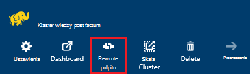
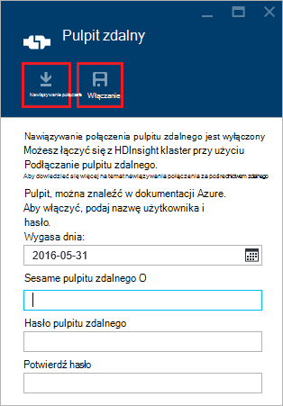
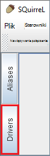
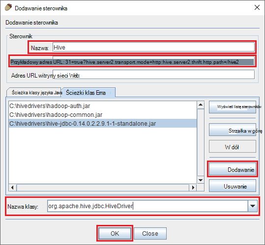
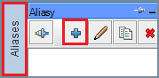
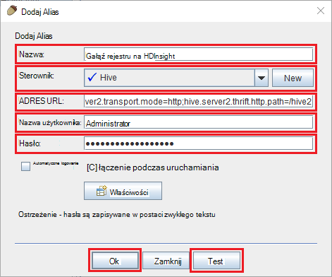
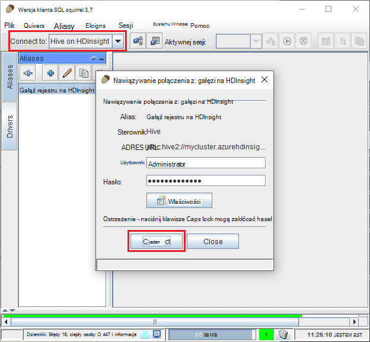
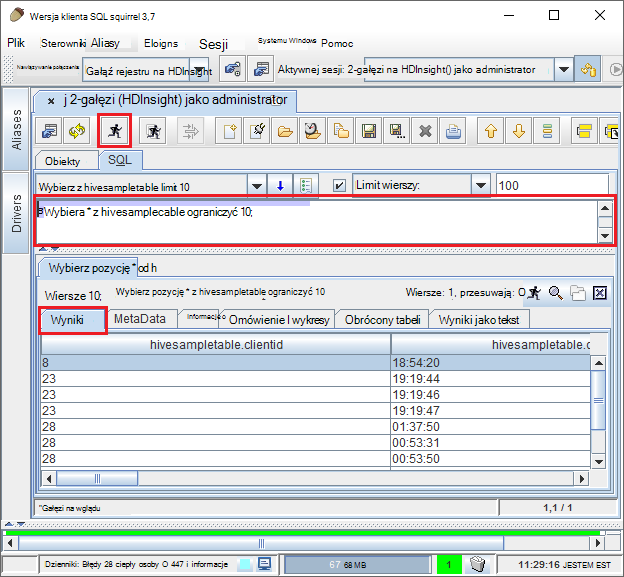

<properties
 pageTitle="JDBC za pomocą kwerendy gałęzi na Azure HDInsight"
 description="Dowiedz się, jak za pomocą JDBC nawiązywanie połączenia z gałęzi na Azure HDInsight i zdalne uruchamianie kwerend danych przechowywanych w chmurze."
 services="hdinsight"
 documentationCenter=""
 authors="Blackmist"
 manager="jhubbard"
 editor="cgronlun"
    tags="azure-portal"/>

<tags
 ms.service="hdinsight"
 ms.devlang="java"
 ms.topic="article"
 ms.tgt_pltfrm="na"
 ms.workload="big-data"
 ms.date="08/23/2016"
 ms.author="larryfr"/>

#Nawiązywanie połączenia z gałęzi na HDInsight Azure za pomocą sterownika gałęzi JDBC

[AZURE.INCLUDE [ODBC-JDBC-selector](../../includes/hdinsight-selector-odbc-jdbc.md)]

W tym dokumencie dowiesz się, jak za pomocą JDBC z aplikacji Java zdalne przesyłanie kwerend gałęzi do klastrów HDInsight. Dowiesz się, jak połączyć z klienta programu SQuirreL SQL i jak programowo nawiązywanie połączenia z języka Java.

Aby uzyskać więcej informacji o interfejsie JDBC gałęzi zobacz [HiveJDBCInterface](https://cwiki.apache.org/confluence/display/Hive/HiveJDBCInterface).

##Wymagania wstępne

Aby wykonać czynności opisane w tym artykule, będą potrzebne następujące elementy:

* Hadoop w klastrze HDInsight. Klastrów systemem Linux albo systemu Windows będzie działać.

* [SQuirreL SQL](http://squirrel-sql.sourceforge.net/). SQuirreL jest aplikacją kliencką JDBC.

Do tworzenia i uruchamiania aplikacji Java przykład połączone z tego artykułu, będą potrzebne następujące elementy.

* [Java Developer Kit (JDK) w wersji 7](https://www.oracle.com/technetwork/java/javase/downloads/jdk7-downloads-1880260.html) lub nowszy.

* [Środowiska Maven Apache](https://maven.apache.org). Środowiska maven jest projektu tworzenie systemu dla języka Java projektów, jest używana przez projektu skojarzone z tym artykułem.

##Parametry połączenia

JDBC połączeń klastrem HDInsight Azure dokonywanych ponad 443, a dane są zabezpieczone przy użyciu protokołu SSL. Publicznej bramy, która klastrów znajdują się pod spód przekierowuje dane do portu, który HiveServer2 faktycznie oczekuje się na. Dlatego parametry połączenia typowe potem następujące czynności:

    jdbc:hive2://CLUSTERNAME.azurehdinsight.net:443/default;ssl=true?hive.server2.transport.mode=http;hive.server2.thrift.http.path=/hive2

Zamień __NAZWAKLASTRA__ nazwę klaster HDInsight.

##Uwierzytelnianie

Podczas nawiązywania połączenia, należy użyć HDInsight klaster nazwy i hasła administratora do uwierzytelnienia bramy klaster. Podczas łączenia z JDBC klientów, takich jak SQuirreL SQL, wprowadź nazwę administratora i hasło w obszarze Ustawienia klienta.

Z aplikacji Java należy użyć nazwy i hasła podczas nawiązywania połączenia. Na przykład poniższy kod języka Java zostanie otwarte nowe połączenie przy użyciu parametrów połączenia, nazwę administratora i hasło:

    DriverManager.getConnection(connectionString,clusterAdmin,clusterPassword);

##Łączenie się z SQuirreL programu SQL client

SQuirreL SQL jest klienta JDBC, który może służyć do zdalne uruchamianie kwerend gałęzi z klaster HDInsight. Następujące krokach przyjęto założenie, jest już zainstalowana SQuirreL SQL i prowadzi użytkownika przez proces pobierania i konfigurowanie sterowników dla gałęzi.

1. Skopiuj sterowniki JDBC gałęzi z klaster HDInsight.

    * __Systemem Linux HDInsight__wykonaj następujące czynności, aby pobrać pliki jar wymagane.

        1. Utwórz nowy katalog, który będzie zawierać pliki. Na przykład `mkdir hivedriver`.

        2. Wiersz polecenia, imprezie, programu PowerShell i innych wierszu polecenia Zmień katalog do nowego katalogu i użyć następujących poleceń, aby skopiować pliki z usługi HDInsight klaster.

                scp USERNAME@CLUSTERNAME:/usr/hdp/current/hive-client/lib/hive-jdbc*standalone.jar .
                scp USERNAME@CLUSTERNAME:/usr/hdp/current/hadoop-client/hadoop-common.jar .
                scp USERNAME@CLUSTERNAME:/usr/hdp/current/hadoop-client/hadoop-auth.jar .

            Nazwa konta użytkownika SSH klaster Zamień __nazwę użytkownika__ . Zastąp __NAZWAKLASTRA__ HDInsight klaster.

            > [AZURE.NOTE] W środowiskach systemu Windows należy użyć narzędzia PSCP zamiast połączenia. Możesz pobrać ją z [http://www.chiark.greenend.org.uk/~sgtatham/putty/download.html](http://www.chiark.greenend.org.uk/~sgtatham/putty/download.html).

    * __HDInsight systemu Windows__wykonaj następujące czynności, aby pobrać pliki jar.

        1. Z portalu Azure wybierz klaster HDInsight, a następnie wybierz ikonę __Pulpitu zdalnego__ .

            

        2. Na karta pulpitu zdalnego przy użyciu przycisku __Połącz__ , aby połączyć się z klastrem. Jeśli nie włączono pulpitu zdalnego, za pomocą formularza o podanie nazwy użytkownika i hasła, następnie zaznacz pole wyboru __Włącz__ włączyć pulpitu zdalnego dla klaster.

            

            Po wybraniu opcji __Połącz__, będą pobierane plik RDP. Umożliwia uruchamianie klienta pulpitu zdalnego tego pliku. Gdy zostanie wyświetlony monit, za pomocą nazwy użytkownika i hasła, wprowadzone pulpitu zdalnego dostępu.

        3. Po połączeniu, skopiuj następujące pliki z sesji pulpitu zdalnego na komputerze lokalnym. Umieść je w katalogu lokalnym o nazwie `hivedriver`.

            * C:\apps\dist\hive-0.14.0.2.2.9.1-7\lib\hive-jdbc-0.14.0.2.2.9.1-7-Standalone.JAR
            * C:\apps\dist\hadoop-2.6.0.2.2.9.1-7\share\hadoop\common\hadoop-Common-2.6.0.2.2.9.1-7.JAR
            * C:\apps\dist\hadoop-2.6.0.2.2.9.1-7\share\hadoop\common\lib\hadoop-auth-2.6.0.2.2.9.1-7.JAR

            > [AZURE.NOTE] Numery wersji zawarte w ścieżki i nazwy plików mogą się różnić w klaster.

        4. Rozłączanie sesji pulpitu zdalnego po zakończeniu kopiowania plików.

3. Uruchom aplikację SQuirreL SQL. W lewej części okna wybierz __sterowniki__.

    

4. Ikony w górnej części okna dialogowego __sterowników__ , zaznacz __+__ ikonę, aby utworzyć nowy sterownik.

    

5. W oknie dialogowym Dodawanie sterownik Dodaj następujące informacje.

    * __Nazwa__: gałęzi
    * __Przykładowy adres URL__: jdbc:hive2://localhost:443/default;ssl=true?hive.server2.transport.mode=http;hive.server2.thrift.http.path=/hive2
    * __Dodatkowe ścieżki klas__: używanie przycisk Dodaj, aby dodać pliki jar pobrane wcześniej
    * __Nazwa klasy__: org.apache.hive.jdbc.HiveDriver

    

    Kliknij __przycisk OK__ , aby zapisać ustawienia.

6. Po lewej stronie okna programu SQuirreL SQL wybierz __aliasów__. Następnie kliknij pozycję __+__ ikonę, aby utworzyć nowy alias połączenia.

    

7. Zastosuj następujące wartości do okna dialogowego __Dodawanie aliasu__ .

    * __Nazwa__: gałęzi na HDInsight
    * __Sterownik__: Użyj listy rozwijanej, aby wybrać sterownika __gałęzi__
    * __Adres URL__: jdbc:hive2://CLUSTERNAME.azurehdinsight.net:443/default;ssl=true?hive.server2.transport.mode=http;hive.server2.thrift.http.path=/hive2

        Zamień __NAZWAKLASTRA__ nazwę klaster HDInsight.

    * __Nazwa użytkownika__: nazwy konta logowania klaster klaster HDInsight. Wartość domyślna to `admin`.
    * __Hasło__: hasło do konta logowania klaster. Jest to hasło podana podczas tworzenia klaster HDInsight.

    

    Przycisk __Test__ umożliwia Sprawdź, czy połączenie działa. Gdy __nawiązać połączenie: gałęzi na HDInsight__ zostanie wyświetlone okno dialogowe, zaznacz pole wyboru __Połącz__ przeprowadzić badania. Jeśli wynik testu zakończyło się powodzeniem, pojawi się okno dialogowe __Połączenie pomyślne__ .

    Użyj przycisku __Ok__ w dolnej części okna dialogowego __Dodawanie Alias__ , aby zapisać alias połączenia.

8. Z menu rozwijanego __Nawiązywanie połączenia__ w górnej części SQuirreL SQL zaznacz __gałęzi na HDInsight__. Gdy zostanie wyświetlony monit, wybierz pozycję __Połącz__.

    

9. Po połączeniu wprowadź poniższe zapytanie w oknie dialogowym Kwerenda SQL, a następnie wybierz ikonę __Uruchamianie__ . Obszar wyników należy wyświetlić wyniki kwerendy.

        select * from hivesampletable limit 10;

    

##Nawiązywanie połączenia z przykładem aplikacji języka Java

Przykład korzysta z klienta Java do kwerendy gałęzi na HDInsight jest dostępna w [https://github.com/Azure-Samples/hdinsight-java-hive-jdbc](https://github.com/Azure-Samples/hdinsight-java-hive-jdbc). Postępuj zgodnie z instrukcjami w repozytorium do tworzenia i uruchamiania próbki.

##Rozwiązywanie problemów

### Wystąpił nieoczekiwany błąd podczas próby otwarcia połączenia SQL.

__Objawów__: podczas nawiązywania połączenia z klastrem HDInsight będącej wersji 3.3 lub 3.4, może zostać wyświetlony komunikat o błędzie, który wystąpił nieoczekiwany błąd. Śledzenie stosu tego błędu zaczyna się od następujących wierszy:

    java.util.concurrent.ExecutionException: java.lang.RuntimeException: java.lang.NoSuchMethodError: org.apache.commons.codec.binary.Base64.<init>(I)V
    at java.util.concurrent.FutureTas...(FutureTask.java:122)
    at java.util.concurrent.FutureTask.get(FutureTask.java:206)

__Przyczyna__: ten błąd jest powodowany przez niezgodność wersji pliku commons codec.jar używanego przez SQuirreL i jeden wymagany przez składniki gałęzi JDBC pobrane z klaster HDInsight.

__Rozdzielczość__: Aby naprawić ten błąd, wykonaj następujące czynności.

1. Pobierz plik słoik koder-dekoder commons z klaster HDInsight.

        scp USERNAME@CLUSTERNAME:/usr/hdp/current/hive-client/lib/commons-codec*.jar ./commons-codec.jar

2. Zamknij SQuirreL, a następnie przejdź do katalogu miejsce, w którym SQuirreL jest zainstalowany w systemie. W katalogu SquirreL w obszarze `lib` katalogu, Zastąp istniejące codec.jar commons każdy z nich pobrane z klaster HDInsight.

3. Uruchom ponownie SQuirreL. Komunikat o błędzie nie jest już powinna zostać wykonana podczas nawiązywania połączenia gałęzi na HDInsight.

##Następne kroki

Teraz, gdy znasz sposobu używania JDBC do pracy z gałęzi, użyj następujących łączy, aby poznać inne sposoby pracy z usługi HDInsight Azure.

* [Przekazywanie danych do HDInsight](hdinsight-upload-data.md)
* [Gałąź za pomocą usługi HDInsight](hdinsight-use-hive.md)
* [Świnka korzystanie z usługi HDInsight](hdinsight-use-pig.md)
* [MapReduce zadań za pomocą usługi HDInsight](hdinsight-use-mapreduce.md)
