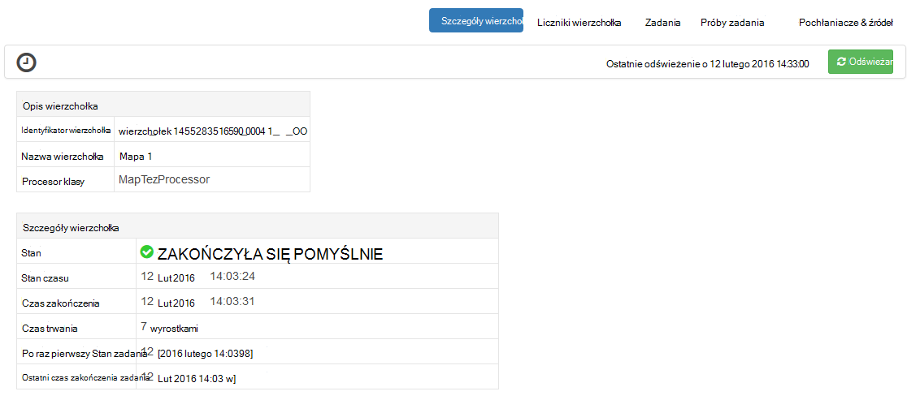

<properties
pageTitle="Korzystanie z widoku Tez Ambari z usługi HDInsight | Azure"
description="Dowiedz się, jak za pomocą widoku Ambari Tez debugowanie Tez zadania na HDInsight."
services="hdinsight"
documentationCenter=""
authors="Blackmist"
manager="jhubbard"
editor="cgronlun"/>

<tags
ms.service="hdinsight"
ms.devlang="na"
ms.topic="article"
ms.tgt_pltfrm="na"
ms.workload="big-data"
ms.date="10/04/2016"
ms.author="larryfr"/>

# Debugowanie Tez zadania dotyczące HDInsight za pomocą widoków Ambari

Interfejsu sieci Web Ambari HDInsight zawiera widok Tez, który może być używany do zrozumienia i debugowania zadania, które używają Tez jako aparat wykonania. Widok Tez umożliwia wizualizowanie zadanie jako wykres połączonych elementów, przechodzić do poszczególnych elementów i pobieranie statystyki i rejestrowania informacji.

> [AZURE.NOTE] Informacje w tym dokumencie są specyficzne dla klastrów HDInsight systemem Linux. Aby uzyskać informacji na temat debugowania Tez zadań przy użyciu usługi HDInsight systemu Windows zobacz [za pomocą interfejsu użytkownika Tez debugowania Tez zadania dotyczące usługi HDInsight systemu Windows](hdinsight-debug-tez-ui.md).

## Wymagania wstępne

* Klaster HDInsight systemem Linux. Aby uzyskać instrukcje dotyczące tworzenia nowych klaster zobacz [rozpocząć korzystanie z usługi HDInsight systemem Linux](hdinsight-hadoop-linux-tutorial-get-started.md).

* Przeglądarki sieci web nowoczesny, która obsługuje HTML5.

## Opis Tez

Tez jest extensible podstawę przetwarzania danych w Hadoop zawierającego prędkości większe niż tradycyjny przetwarzanie MapReduce. Dla klastrów systemem Linux HDInsight jest domyślny aparat gałęzi.

Gdy praca jest przesyłany do Tez, tworzy przekierowywany acykliczne wykresu (AG) opisujący kolejność wykonywania czynności wymagane przez zadanie. Poszczególne działania są nazywane wierzchołki i wykonywanie fragmentu ogólnego zadania. Rzeczywiste wykonanie pracy opisane wierzchołka nosi nazwę zadania i rozkładany wiele węzłów w klastrze.

### Opis widoku Tez

Widok Tez zapewnia, że informacji dotyczących procesów, które są uruchomione lub mają wcześniej uruchomiono przy użyciu Tez. Umożliwia wyświetlenie AG wygenerowane przez Tez, jak rozkładany klastrów liczniki takich jak pamięci używanej przez zadań i wierzchołki oraz informacje o błędzie. Może on oferować przydatne informacje w następujących sytuacjach:

* Monitorowanie długim przetwarza wyświetlania postępu mapy i zmniejszyć zadania.

* Analizowanie danych historycznych na pomyślne niepowodzeniu procesów Dowiedz się, jak można poprawić przetwarzanie lub dlaczego nie powiodło się.

## Generowanie AG

Widok Tez będzie zawierać tylko dane, jeśli zadanie, która używa aparat Tez jest uruchomiony lub został działała w przeszłości. Prostych kwerend gałąź można rozpoznawać zazwyczaj bez użycia Tez, jednak bardziej złożone kwerendy, wykonujące filtrowanie, grupowanie, kolejnością sprzężenia itp zwykle wymagać Tez.

Wykonaj następujące czynności, aby uruchomić kwerendę gałęzi, która będzie wykonywana przy użyciu Tez.

1. W przeglądarce sieci web przejdź do https://CLUSTERNAME.azurehdinsight.net, gdzie __NAZWAKLASTRA__ to nazwa klaster HDInsight.

2. Z menu u góry strony wybierz ikonę __widoków__ . Wygląd serii kwadraty. Na liście rozwijanej, które zostanie wyświetlone wybierz pozycję __gałęzi widoku__. 

    

3. Gdy gałęzi widoku obciążenia, wklej następujący ciąg w edytorze zapytań, a następnie kliknij __Wykonywanie__.

        select market, state, country from hivesampletable where deviceplatform='Android' group by market, country, state;
    
    Po ukończeniu zadania powinien zostać wyświetlony wynik wyświetlany w sekcji __Wyniki procesu kwerendy__ . Wyniki powinny być podobny do następującego
    
        market  state       country
        en-GB   Hessen      Germany
        en-GB   Kingston    Jamaica
        
4. Wybierz kartę __dziennika__ . Zostaną wyświetlone informacje podobne do następujących czynności:
    
        INFO : Session is already open
        INFO :

        INFO : Status: Running (Executing on YARN cluster with App id application_1454546500517_0063)

    Zapisz wartość __Identyfikator aplikacji__ , jak będzie on używany w następnej sekcji.

## Korzystanie z widoku Tez

1. Z menu u góry strony wybierz ikonę __widoków__ . Na liście rozwijanej, które zostanie wyświetlone wybierz __Widok Tez__.

    

2. Podczas ładowania widoku Tez pojawi się, że lista DAGs, które są obecnie uruchomione lub zostały wykonane w klastrze. Widok domyślny zawiera AG nazwa, identyfikator, przesyłające, stan, czas rozpoczęcia, czas zakończenia, czas trwania, identyfikator aplikacji i kolejki. Można dodać więcej kolumn przy użyciu ikony koła zębatego w prawym rogu strony.

    

3. Jeśli masz tylko jeden wpis będzie dla kwerendy, która działała w poprzedniej sekcji. Jeśli masz wiele wpisów, możesz wyszukiwać przy wprowadzaniu identyfikator aplikacji w polu __Identyfikator aplikacji__ , a następnie naciśnij klawisz enter.

4. Wybierz __Nazwę AG__. Spowoduje to wyświetlenie informacji o AG, a także możliwość pobierania zip JSON plików, które zawierają informacje o AG.

    

5. Powyżej __Szczegóły AG__ są kilku łączy, których można używać do wyświetlania informacji na temat AG.

    * __Liczniki AG__ Wyświetla liczniki informacje o tym AG.
    
    * __Widok graficzny__ Wyświetla reprezentację ten AG.
    
    * __Wszystkie wierzchołki__ Wyświetla listę wierzchołki w tym AG.
    
    * __Wszystkie zadania__ Wyświetla listę zadania dla wszystkich wierzchołki w tym AG.
    
    * __Wszystkie TaskAttempts__ Wyświetla informacje o próby uruchomienia zadań dla tego AG.
    
    > [AZURE.NOTE] Jeśli podczas przewijania wyświetlanie kolumny wierzchołki, zadania i TaskAttempts, zwróć uwagę, czy łącza, aby zobaczyć __liczników__ i __wyświetlić lub pobrać dzienniki__ dla każdego wiersza.

    Jeśli wystąpił błąd z zadaniem, szczegóły AG będzie wyświetlany stan nie powiodła się wraz z łączami do informacji o zadaniu nie powiodło się. Informacje diagnostyczne będą wyświetlane poniżej szczegóły AG.
    
    

7. Wybierz __Widok graficzny__. Spowoduje to wyświetlenie reprezentację AG. Możesz umieścić wskaźnik myszy nad każdego wierzchołka w widoku do wyświetlania informacji związanych z nim.

    

8. Klikając wierzchołek pobierze __Wierzchołek szczegóły__ dla tego elementu. Kliknij wierzchołek __1 mapy__ , aby wyświetlić szczegóły dla tego elementu.

    

9. Należy zauważyć, że można teraz łącza w górnej części strony, które dotyczą wierzchołki i zadania.

    > [AZURE.NOTE] Na tej stronie można również otrzymują zamiar __Szczegóły AG__, zaznaczając __Wierzchołek szczegóły__i wybierając wierzchołek __1 mapy__ .

    * __Wierzchołek liczniki__ Wyświetla informacje licznik dla tego wierzchołek.
    
    * __Zadania__ są wyświetlane zadania związane z tym wierzchołek.
    
    * __Pozwala podjąć próbę zadania__ są wyświetlane informacje o próby uruchomienia zadania związane z tym wierzchołek.
    
    * __Źródeł i ujść__ Wyświetla źródeł danych i pochłaniacze ten wierzchołka.

    > [AZURE.NOTE] Jak można będzie przewijać wyświetlanie kolumny dla zadania, prób zadania i źródła & Sinks__ wyświetlić łącza do dodatkowych informacji dla każdego elementu z poprzedniego menu.

10. Wybierz __zadania__, a następnie wybierz pozycję elementu o nazwie __00_000000__. Spowoduje to wyświetlenie __Szczegóły zadania__ dla tego zadania. W tym oknie można wyświetlić __Liczników zadań__ i __Próby zadania__.

    

## Następne kroki

Teraz, gdy znasz sposobu korzystania z widoku Tez, Dowiedz się więcej o [Użyciu gałęzi na HDInsight](hdinsight-use-hive.md).

Aby uzyskać bardziej szczegółowe informacje techniczne na Tez zobacz [stronę Tez na Hortonworks](http://hortonworks.com/hadoop/tez/).

Aby uzyskać więcej informacji na temat korzystania z usługi HDInsight Ambari zobacz [klastrów zarządzanie HDInsight za pomocą Interfejsu sieci Web Ambari](hdinsight-hadoop-manage-ambari.md)
