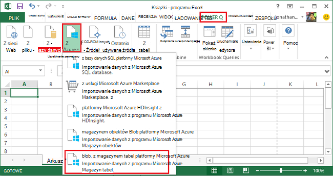
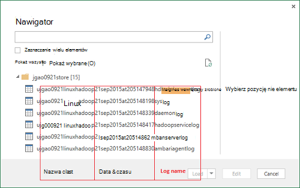
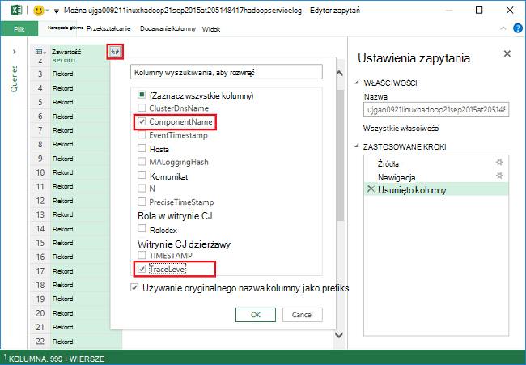
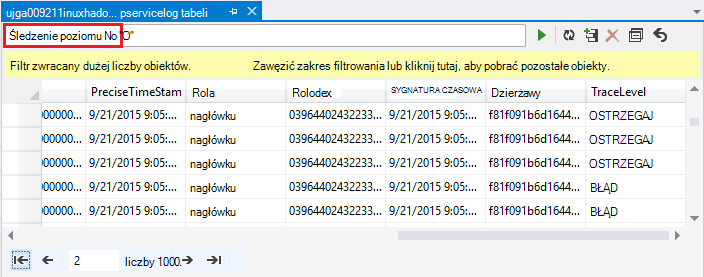
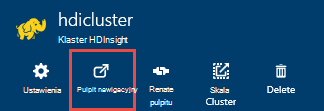
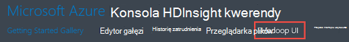
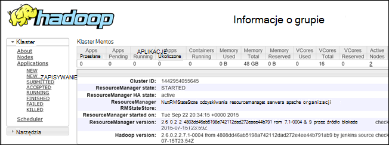

<properties
    pageTitle="Debugowanie Hadoop w HDInsight: wyświetlanie dzienników i interpretowanie komunikaty o błędach | Microsoft Azure"
    description="Informacje na temat komunikatów o błędach, które mogą zostać wyświetlone podczas administrowania HDInsight przy użyciu programu PowerShell i czynności, które można wykonać, aby odzyskać."
    services="hdinsight"
    tags="azure-portal"
    editor="cgronlun"
    manager="jhubbard"
    authors="mumian"
    documentationCenter=""/>

<tags
    ms.service="hdinsight"
    ms.workload="big-data"
    ms.tgt_pltfrm="na"
    ms.devlang="na"
    ms.topic="article"
    ms.date="09/02/2016"
    ms.author="jgao"/>

# Analizowanie dzienniki HDInsight

Każdy klaster Hadoop Azure HDInsight ma konto Azure magazynowania używane jako domyślnego systemu plików. Konto miejsca do magazynowania jest określana jako konto domyślne miejsca do magazynowania. Klaster używa magazyn tabel platformy Azure i magazyn obiektów Blob na domyślne konto miejsca do magazynowania do przechowywania jej dzienników.  Aby dowiedzieć się domyślne konto miejsca do magazynowania dla klaster, zobacz [Zarządzanie Hadoop klastrów w HDInsight](hdinsight-administer-use-management-portal.md#find-the-default-storage-account). Dzienniki zachowują na koncie miejsca do magazynowania, nawet w przypadku, gdy klaster zostanie usunięty.

##Dzienniki zapisane w tabelach Azure

Dzienniki zapisane w tabelach Azure zapewniają wgląd co się dzieje z klastrem HDInsight o jeden poziom.

Po utworzeniu klaster HDInsight 6 tabele są tworzone automatycznie dla systemem Linux klastrów w magazynie tabel domyślne:

- hdinsightagentlog
- SYSLOG
- daemonlog
- hadoopservicelog
- ambariserverlog
- ambariagentlog

3 tabele są tworzone dla klastrów systemu Windows:

- setuplog: dziennik zdarzeń i wyjątki podczas inicjowania obsługi administracyjnej i konfigurowania klastrów HDInsight.
- hadoopinstalllog: dziennik zdarzeń i wyjątki napotkanych podczas instalowania Hadoop w klastrze. W poniższej tabeli mogą być przydatne do rozwiązywania problemów związanych z klastrów utworzone za pomocą parametry niestandardowe.
- hadoopservicelog: dziennik zdarzeń i wyjątków został zapisany przez wszystkie usługi Hadoop. W poniższej tabeli mogą być przydatne do rozwiązywania problemów związanych z błędy zadań dotyczących klastrów HDInsight.

Nazwy plików tabeli są **u<ClusterName>DDMonYYYYatHHMMSSsss<TableName>**.

W poniższych tabelach zawiera następujące pola:

- ClusterDnsName
- NazwaSkładnika
- EventTimestamp
- Hosta
- MALoggingHash
- Komunikat
- N
- PreciseTimeStamp
- Rola
- Właściwość RowIndex
- Dzierżawy
- SYGNATURA CZASOWA
- TraceLevel

### Narzędzia umożliwiające dostęp do dzienników

Dostępne są wielu narzędzi do uzyskiwania dostępu do danych w poniższych tabelach:

-  Programu Visual Studio
-  Eksplorator magazynu platformy Azure
-  Dodatek Power Query dla programu Excel

#### Za pomocą dodatku Power Query dla programu Excel

Dodatek Power Query można zainstalować z [www.microsoft.com/en-us/download/details.aspx?id=39379]( http://www.microsoft.com/en-us/download/details.aspx?id=39379). Odwiedź stronę pobierania wymagania systemowe

**Aby otworzyć i analizowania dziennika usługi za pomocą dodatku Power Query**

1. Otwórz **Program Microsoft Excel**.
2. Z menu **Dodatku Power Query** kliknij pozycję **Z Azure**, a następnie kliknij **magazynowania od firmy Microsoft Azure tabeli**.
 
    
3. Wprowadź nazwę konta magazynu. Może to być krótką nazwę lub nazwy FQDN.
4. Wprowadź klucz konta miejsca do magazynowania. Są zostanie wyświetlona lista tabel:

    
5. Kliknij prawym przyciskiem myszy tabelę hadoopservicelog w okienku **Nawigator** , a następnie kliknij przycisk **Edytuj**. Zapewniają 4 kolumnach. Opcjonalnie Usuń kolumny **Klucza Partition**, **Klucz wiersza**i **sygnatury czasowej** , zaznaczając je, a następnie klikając polecenie **Usuń kolumny** z opcji dostępnych na Wstążce.
6. Kliknij ikonę rozwijania na podstawie zawartości kolumny, aby wybrać kolumny, które mają zostać zaimportowane do arkusza kalkulacyjnego programu Excel. Dla tego pokaz wybrano TraceLevel i NazwaSkładnika: go przekazać mnie podstawowych informacji, na którym składniki sprzedał problemów.

    
7. Kliknij **przycisk OK** , aby zaimportować dane.
8. Zaznacz kolumny **TraceLevel**, Role i **NazwaSkładnika** , a następnie kliknij **Grupuj według** formantu na Wstążce.
9. Kliknij przycisk **OK** w oknie dialogowym grupowanie według
10. Kliknij przycisk** Zastosuj i zamknij**.
 
Za pomocą programu Excel można teraz filtrowanie i sortowanie stosownie do potrzeb. Oczywiście można uwzględnienie innych kolumn (na przykład wiadomości), aby przechodzić do problemów, gdy występują, ale zaznaczanie i grupowanie kolumn opisanych powyżej zawiera obraz zadowalający co się dzieje z usługami Hadoop. Tym samym ogólny obraz można stosować do tabel setuplog i hadoopinstalllog.

#### Używając programu Visual Studio

**Aby użyć programu Visual Studio**

1. Otwórz program Visual Studio.
2. W menu **Widok** kliknij polecenie **Eksplorator chmury**. Lub po prostu kliknij pozycję **kombinację klawiszy CTRL +\, klawisze CTRL + X**.
3. Korzystając z **Eksploratora w chmurze**zaznacz **Typów zasobów**.  Inne opcja dostępna jest **Grup zasobów**.
4. Rozwijanie **Kont miejsca do magazynowania**, domyślne konto miejsca do magazynowania dla klaster i **tabel**.
5. Kliknij dwukrotnie **hadoopservicelog**.
6. Dodawanie filtru. Na przykład:
    
        TraceLevel eq 'ERROR'

    

    Aby uzyskać więcej informacji o tworzeniu filtrów zobacz [Konstruowanie ciągów filtru z projektanta tabel](../vs-azure-tools-table-designer-construct-filter-strings.md).
 
##Dzienniki zapisane z magazynem obiektów Blob platformy Azure

[Dzienniki zapisane w tabelach Azure](#log-written-to-azure-tables) zapewniają wgląd co się dzieje z klastrem HDInsight o jeden poziom. W poniższych tabelach zapewnia jednak dzienniki poziomie zadania, które mogą być pomocne w przechodzenia do do problemów wystąpieniach. Aby zapewnić ten następny poziom szczegółów, klastrów HDInsight są skonfigurowane do zapisu dzienniki zadanie do swojego konta magazyn obiektów Blob dla dowolnego zadania, które jest przesyłany do Templeton. W praktyce oznacza to zadania przekazane przy użyciu poleceń cmdlet programu Microsoft Azure programu PowerShell lub API przesyłania zadania .NET, nie zadania przekazane przez RDP-polecenia-wiersza dostęp z klastrem. 

Aby wyświetlić pliki dziennika, zobacz [Dzienniki aplikacji programu Access PRZĘDZY na podstawie Linux HDInsight](hdinsight-hadoop-access-yarn-app-logs-linux.md).

Aby uzyskać więcej informacji o dziennikach aplikacji zobacz [Zarządzanie logowania użytkownika Simplifying i dostęp w PRZĘDZY](http://hortonworks.com/blog/simplifying-user-logs-management-and-access-in-yarn/).
 
 
## Wyświetlanie dzienników klaster zdrowia i zadania

###Interfejs użytkownika programu Access Hadoop

Azure Portal kliknij nazwę klaster HDInsight, aby otworzyć karta klaster. Karta klaster kliknij **pulpitu nawigacyjnego**.

Po wyświetleniu monitu wprowadź poświadczenia administratora klaster. W konsoli kwerendy kliknij **Hadoop interfejsu użytkownika**.

###Przędza interfejsu użytkownika programu Access

Azure Portal kliknij nazwę klaster HDInsight, aby otworzyć karta klaster. Karta klaster kliknij **pulpitu nawigacyjnego**. Po wyświetleniu monitu wprowadź poświadczenia administratora klaster. W konsoli kwerendy kliknij **PRZĘDZY interfejsu użytkownika**.

Za pomocą interfejsu użytkownika PRZĘDZY wykonaj następujące czynności:

* **Pobierz stan klaster**. W okienku po lewej stronie rozwiń **klaster**, a następnie kliknij polecenie **informacje**. Ten obecnie klaster stanu szczegóły, takie jak całkowita przydzielona pamięć, rdzenie używane, stan Menedżera zasobów klaster, klaster wersji itp.

    

* **Pobierz stan węzła**. W okienku po lewej stronie rozwiń **klaster**, a następnie kliknij **węzły**. Ta lista zawiera wszystkie węzły w klastrze, adres HTTP każdego węzła zasoby przydzielone do każdej węzeł itp.

* **Monitoruje stan zadania**. W okienku po lewej stronie rozwiń **klaster**, a następnie kliknij **aplikacje** , aby wyświetlić wszystkie zadania w grupie. Jeśli chcesz przeglądać zadania w określonym stanie (na przykład uruchomiony nowy, przesłanych, itp.), kliknij odpowiednie łącze w obszarze **aplikacje**. Można dodatkowo kliknij nazwę zadania, aby dowiedzieć się więcej o zadaniu takie w tym dane wyjściowe, dzienniki itp.

###Dostęp do HBase interfejsu użytkownika

Azure Portal kliknij nazwę klaster HDInsight HBase, aby otworzyć karta klaster. Karta klaster kliknij **pulpitu nawigacyjnego**. Po wyświetleniu monitu wprowadź poświadczenia administratora klaster. W konsoli kwerendy kliknij **HBase interfejsu użytkownika**.

## Kody błędów HDInsight

Komunikaty o błędach wyszczególnione w tej sekcji znajdują się w celu użytkowników Hadoop w Azure HDInsight opis możliwych błędów, które mogą się pojawić po administrowanie usługą Azure za pomocą oraz zaleć im na kroki, które należy podjąć Aby naprawić błąd.

Niektóre z tych komunikatów o błędach można także znaleźć w Azure Portal gdy jest używana do zarządzania klastrów HDInsight. Inne komunikaty o błędach, może wystąpić, ale istnieje mniej szczegółowy z powodu ograniczeń dotyczących możliwe w tym kontekście działań naprawczych. Inne komunikaty o błędach są dostarczane w kontekście, w przypadku oczywiste łagodzenia. 

### AtleastOneSqlMetastoreMustBeProvided
- **Opis**: Podaj szczegóły bazy danych Azure SQL dla co najmniej jeden składnik, aby użyć ustawień niestandardowych dla gałąź i Oozie metastores.
- **Ograniczenia**: należy podać prawidłowy metastore platformy SQL Azure, a następnie ponów próbę żądania.  

### AzureRegionNotSupported
- **Opis**: nie można utworzyć klaster w regionie *nameOfYourRegion*. Za pomocą prawidłowych region HDInsight i ponów próbę żądania.
- **Ograniczenia**: klienta należy utworzyć regionu klaster, który obsługuje obecnie: Azji Południowo, Europa Zachodnia, północna Europa, wschodniego USA lub USA Zachód.  

### ClusterContainerRecordNotFound
- **Opis**: serwer nie można odnaleźć rekordu klaster wymagane.  
- **Ograniczenia**: spróbuj jeszcze raz.

### ClusterDnsNameInvalidReservedWord
- **Opis**: klaster DNS nazwa *yourDnsName* jest nieprawidłowy. Upewnij się, nazwa rozpoczyna się i kończy się alfanumeryczny i mogą zawierać tylko "-" znak specjalny  
- **Ograniczenia**: Upewnij się, użycie prawidłową nazwę DNS dla klaster, który zaczyna się i kończy się alfanumeryczny i zawiera żadnych specjalnych znaków innych niż kreskę "-", a następnie ponów próbę operacji.

### ClusterNameUnavailable
- **Opis**: Nazwa klaster *yourClusterName* jest niedostępny. Wybierz inną nazwę.  
- **Ograniczenia**: użytkownika należy określić NazwaKlastra, który jest unikatowy i nie istnieją i spróbuj ponownie. Jeśli użytkownik korzysta z portalem, interfejsu użytkownika będzie wyświetlane powiadomienie o ich Jeśli nazwa klaster jest już używana podczas wykonywania czynności Utwórz.

### ClusterPasswordInvalid
- **Opis**: hasło klaster jest nieprawidłowy. Hasło musi mieć co najmniej 10 znaków i musi zawierać co najmniej jedną cyfrę, Wielkiej litery, litery i znak specjalny bez spacji i nie może zawierać nazwy użytkownika w ramach tego.  
- **Ograniczenia**: hasło prawidłowych klaster i spróbuj jeszcze raz.

### ClusterUserNameInvalid
- **Opis**: nazwa użytkownika klaster jest nieprawidłowa. Upewnij się, że nazwa użytkownika nie zawiera znaki specjalne ani spacje.  
- **Ograniczenia**: udostępnia klaster prawidłową nazwę użytkownika i spróbuj jeszcze raz.

### ClusterUserNameInvalidReservedWord
- **Opis**: klaster DNS nazwa *yourDnsClusterName* jest nieprawidłowy. Upewnij się, nazwa rozpoczyna się i kończy się alfanumeryczny i mogą zawierać tylko "-" znak specjalny  
- **Ograniczenia**: Podaj prawidłową nazwę użytkownika klaster DNS i spróbuj jeszcze raz.

### ContainerNameMisMatchWithDnsName
- **Opis**: nazwy kontenera w URI *yourcontainerURI* i nazw DNS *yourDnsName* w treści wezwania musi być taka sama.  
- **Ograniczenia**: Upewnij się, do kontenera nazwa i nazwa DNS są takie same i spróbuj jeszcze raz.

### DataNodeDefinitionNotFound
- **Opis**: nieprawidłowe klaster konfiguracji. Nie można odnaleźć żadnej definicji węzeł danych w rozmiarze węzeł.  
- **Ograniczenia**: spróbuj jeszcze raz.

### DeploymentDeletionFailure
- **Opis**: usunięcie wdrożenia nie powiodło się dla klaster  
- **Ograniczenia**: spróbuj ponownie operację usuwania.

### DnsMappingNotFound
- **Opis**: błąd konfiguracji usługi. Nie można odnaleźć wymaganych informacji mapowania DNS.  
- **Ograniczenia**: usuwanie klaster i Utwórz nowy klaster.

### DuplicateClusterContainerRequest
- **Opis**: duplikowanie próba utworzenia kontenera klaster. Nie istnieje rekord dla *nameOfYourContainer* , ale Etags nie są zgodne.
- **Ograniczenia**: Podaj unikatową nazwę dla kontenera, a następnie ponów próbę operacji tworzenia.

### DuplicateClusterInHostedService
- **Opis**: hostowana usługa *nameOfYourHostedService* zawiera już klastrze. Hostowana usługa nie może zawierać wiele klastrów  
- **Ograniczenia**: obsługiwać klaster w innej usłudze hostowanej.

### FailureToUpdateDeploymentStatus
- **Opis**: serwer nie można zaktualizować stan wdrażania klastrów.  
- **Ograniczenia**: spróbuj jeszcze raz. W takim przypadku kilka razy, skontaktuj się z arkuszy CSS.

### HdiRestoreClusterAltered
- **Opis**: klaster *yourClusterName* został usunięty w ramach konserwacji. Odtwórz klaster.
- **Ograniczenia**: ponownie utworzyć klaster.

### HeadNodeConfigNotFound
- **Opis**: nieprawidłowe klaster konfiguracji. Nie można odnaleźć powstawanie węzeł Konfiguracja wymagane węzła głównego.
- **Ograniczenia**: spróbuj jeszcze raz.

### HostedServiceCreationFailure
- **Opis**: nie można utworzyć hostowana usługa *nameOfYourHostedService*. Spróbuj ponownie wezwanie.  
- **Ograniczenia**: ponawianie żądania.

### HostedServiceHasProductionDeployment
- **Opis**: hostowana usługa *nameOfYourHostedService* zawiera już wdrożenia produkcji. Hostowana usługa nie może zawierać wiele wdrożeń produkcji. Ponawianie żądania o nazwie różnych klaster.
- **Ograniczenia**: Użyj nazwy różnych klaster i ponów żądanie.

### HostedServiceNotFound
- **Opis**: hostowana usługa *nameOfYourHostedService* dla nie można odnaleźć klaster.  
- **Ograniczenia**: Jeśli klaster jest w stanie błąd, usuń ją, a następnie spróbuj ponownie.

### HostedServiceWithNoDeployment
- **Opis**: hostowana usługa *nameOfYourHostedService* występują nie skojarzone wdrożenia.  
- **Ograniczenia**: Jeśli klaster jest w stanie błąd, usuń ją, a następnie spróbuj ponownie.

### InsufficientResourcesCores
- **Opis**: SubscriptionId *yourSubscriptionId* nie trzeba utworzyć klaster *yourClusterName*rdzenie w lewo. Wymagane: *resourcesRequired*, dostępne: *resourcesAvailable*.  
- **Ograniczenia**: zwolnić zasoby w ramach subskrypcji lub zwiększanie zasobów dostępnych dla subskrypcji i ponownie spróbuj utworzyć klaster.

### InsufficientResourcesHostedServices
- **Opis**: identyfikator subskrypcji *yourSubscriptionId* nie ma przydziału dla nowych HostedService utworzyć klaster *yourClusterName*.  
- **Ograniczenia**: zwolnić zasoby w ramach subskrypcji lub zwiększanie zasobów dostępnych dla subskrypcji i ponownie spróbuj utworzyć klaster.

### InternalErrorRetryRequest
- **Opis**: serwer wystąpił błąd wewnętrzny. Spróbuj ponownie wezwanie.  
- **Ograniczenia**: ponawianie żądania.

### InvalidAzureStorageLocation
- **Opis**: miejsce magazynowania Azure *dataRegionName* nie jest prawidłową lokalizacją. Upewnij się, że obszar jest poprawny i spróbuj ponownie wezwanie.
- **Ograniczenia**: Wybierz miejsce przechowywania, która obsługuje usługi HDInsight, sprawdź, czy klaster jest znajdują się i spróbuj jeszcze raz.

### InvalidNodeSizeForDataNode
- **Opis**: rozmiar pamięci Wirtualnej nieprawidłowe dla węzłów danych. Tylko "Dużych maszyn wirtualnych" rozmiar jest obsługiwany dla wszystkich węzłów danych.  
- **Ograniczenia**: Określ rozmiar obsługiwane węzeł węzeł danych i spróbuj jeszcze raz.

### InvalidNodeSizeForHeadNode
- **Opis**: rozmiar pamięci Wirtualnej nieprawidłowe dla węzła głównego. Tylko "ExtraLarge maszyn wirtualnych" rozmiar jest obsługiwany dla węzła głównego.  
- **Ograniczenia**: Określ rozmiar obsługiwane węzeł węzła głównego i ponowić próbę

### InvalidRightsForDeploymentDeletion
- **Opis**: identyfikator subskrypcji *yourSubscriptionId* używany nie masz wystarczających uprawnień do wykonywania operacji usuwania dla klastrów *yourClusterName*.  
- **Ograniczenia**: Jeśli klaster jest w stanie błędu, upuść ją, a następnie spróbuj ponownie.  

### InvalidStorageAccountBlobContainerName
- **Opis**: zewnętrzna konta obiektów blob kontenera nazwę *yourContainerName* jest nieprawidłowy. Upewnij się, nazwa zaczyna się od litery i zawiera tylko małe litery, cyfry i łącznika.  
- **Ograniczenia**: Określ nazwę kontenera obiektów blob konta magazynującym i spróbuj jeszcze raz.

### InvalidStorageAccountConfigurationSecretKey
- **Opis**: Konfiguracja konta zewnętrzna *yourStorageAccountName* musi mieć kluczowe informacje poufne określone.  
- **Ograniczenia**: Określ prawidłowego klucza tajnego konta miejsca do magazynowania i spróbuj jeszcze raz.

### InvalidVersionHeaderFormat
- **Opis**: nagłówek wersję *yourVersionHeader* nie znajduje się w nieprawidłowym formacie rrrr mm-domenie odnajdowania.  
- **Ograniczenia**: Określ prawidłowy format nagłówka wersji i ponów żądanie.

### MoreThanOneHeadNode
- **Opis**: nieprawidłowe klaster konfiguracji. Znaleźć więcej niż jedna konfiguracja węzła głównego.  
- **Ograniczenia**: Edytuj konfigurację, tak aby jeden węzeł głowy onloy zostało określone.

### OperationTimedOutRetryRequest
- **Opis**: nie można ukończyć tej operacji w czasie dozwolonych lub maksymalną liczbę ponawiania próby możliwe. Spróbuj ponownie wezwanie.  
- **Ograniczenia**: ponawianie żądania.

### ParameterNullOrEmpty
- **Opis**: parametr *yourParameterName* nie może być zerowa lub pusta.  
- **Ograniczenia**: Określ prawidłową wartość parametru.

### PreClusterCreationValidationFailure
- **Opis**: jednej lub większej liczby wartości wejściowych żądania tworzenia klaster jest nieprawidłowy. Upewnij się, wprowadzania wartości są poprawne i ponawianie żądania.  
- **Ograniczenia**: Upewnij się, wartości wejściowych są poprawne i ponawianie żądania.

### RegionCapabilityNotAvailable
- **Opis**: funkcja Region nie jest dostępna dla regionu *yourRegionName* i identyfikator subskrypcji *yourSubscriptionId*.  
- **Ograniczenia**: Określ region, który obsługuje klastrów HDInsight. Są publicznie obsługiwanych regionów: Azji Południowo, Europa Zachodnia, północna Europa, wschodniego USA lub USA Zachód.

### StorageAccountNotColocated
- **Opis**: konto miejsca do magazynowania *yourStorageAccountName* znajduje się w regionie *currentRegionName*. Powinien być taki sam jak region klaster *yourClusterRegionName*.  
- **Ograniczenia**: Określ konto miejsca do magazynowania w tym samym regionie, której klaster lub jeśli dane mają już konto miejsca do magazynowania, Utwórz nowy klaster w tym samym regionie jako istniejącego konta miejsca do magazynowania. Jeśli korzystasz z portalu interfejsu użytkownika będzie wyświetlane powiadomienie o ich ten problem z wyprzedzeniem.

### SubscriptionIdNotActive
- **Opis**: podane identyfikator subskrypcji *yourSubscriptionId* nie jest aktywna.  
- **Ograniczenia**: ponownie aktywować subskrypcję, lub uzyskaj nowej subskrypcji prawidłowe.

### SubscriptionIdNotFound
- **Opis**: nie można odnaleźć identyfikator subskrypcji *yourSubscriptionId* .  
- **Ograniczenia**: Sprawdź, czy identyfikator subskrypcji jest prawidłowy i spróbuj jeszcze raz.

### UnableToResolveDNS
- **Opis**: nie można rozpoznać DNS *yourDnsUrl*. Upewnij się, że znajduje się w pełni kwalifikowany adres URL dla punktu końcowego obiektów blob.  
- **Ograniczenia**: podanie adresu URL prawidłowych obiektów blob. Adres URL musi być w pełni ważne, takich jak rozpoczynające się od *http://* i kończący się *.com*.

### UnableToVerifyLocationOfResource
- **Opis**: nie można sprawdzić lokalizację zasobu *yourDnsUrl*. Upewnij się, że znajduje się w pełni kwalifikowany adres URL dla punktu końcowego obiektów blob.  
- **Ograniczenia**: podanie adresu URL prawidłowych obiektów blob. Adres URL musi być w pełni ważne, takich jak rozpoczynające się od *http://* i kończący się *.com*.

### VersionCapabilityNotAvailable
- **Opis**: wersję funkcja nie jest dostępna dla wersji *specifiedVersion* i identyfikator subskrypcji *yourSubscriptionId*.  
- **Ograniczenia**: wybór wersji, który jest dostępny i spróbuj jeszcze raz.

### VersionNotSupported
- **Opis**: wersja *specifiedVersion* nie jest obsługiwane.
- **Ograniczenia**: wybór wersji, który jest obsługiwany i spróbuj jeszcze raz.

### VersionNotSupportedInRegion
- **Opis**: wersji *specifiedVersion* nie jest dostępna w regionie Azure *specifiedRegion*.  
- **Ograniczenia**: Wybierz wersję, którą jest obsługiwana w regionie określony i spróbuj jeszcze raz.

### WasbAccountConfigNotFound
- **Opis**: nieprawidłowe klaster konfiguracji. Nie można odnaleźć w zewnętrznym konta wymagane konfiguracji konta WASB.  
- **Ograniczenia**: Sprawdź, czy konto istnieje i jest prawidłowo określony w konfiguracji i spróbuj jeszcze raz.

## Następne kroki

- [Debugowanie Tez zadania dotyczące HDInsight za pomocą widoków Ambari](hdinsight-debug-ambari-tez-view.md)
- [Włączanie zrzuty stosu usługi Hadoop na podstawie Linux HDInsight](hdinsight-hadoop-collect-debug-heap-dump-linux.md)
- [Zarządzanie klastrów HDInsight za pomocą Interfejsu sieci Web Ambari](hdinsight-hadoop-manage-ambari.md)
