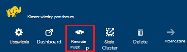
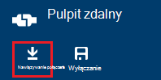
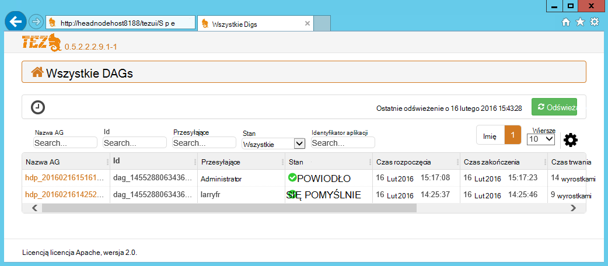
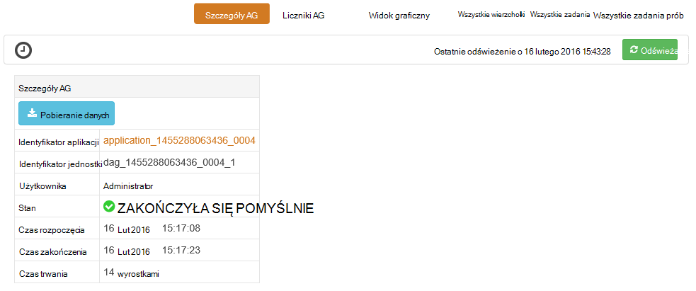
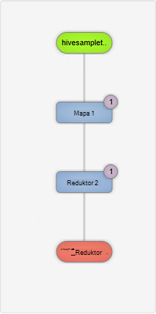
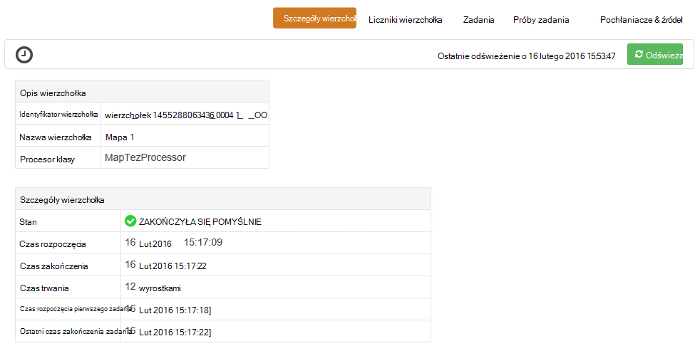
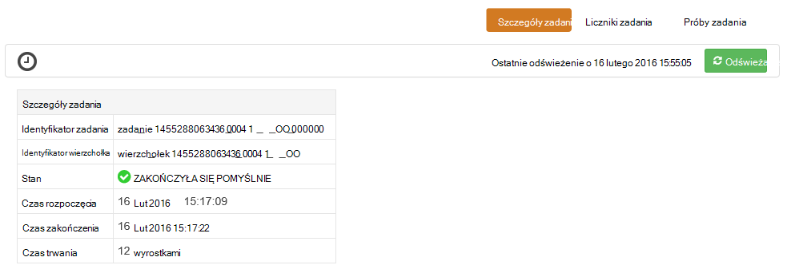

<properties
pageTitle="Używanie Tez interfejsu użytkownika z usługi HDInsight systemu Windows | Azure"
description="Dowiedz się, jak za pomocą interfejsu użytkownika Tez debugowanie Tez zadania na HDInsight HDInsight systemu Windows."
services="hdinsight"
documentationCenter=""
authors="Blackmist"
manager="jhubbard"
editor="cgronlun"/>

<tags
ms.service="hdinsight"
ms.devlang="na"
ms.topic="article"
ms.tgt_pltfrm="na"
ms.workload="big-data"
ms.date="10/04/2016"
ms.author="larryfr"/>

# Debugowanie Tez zadania dotyczące usługi HDInsight systemu Windows za pomocą interfejsu użytkownika Tez

Interfejs użytkownika Tez jest strony sieci web, który może być używany do zrozumienia i debugowania zadania, które korzystają Tez jako aparat wykonania na klastrów HDInsight systemu Windows. Interfejs użytkownika Tez umożliwia wizualizowanie zadanie jako wykres połączonych elementów, przechodzić do poszczególnych elementów i pobieranie statystyki i rejestrowania informacji.

> [AZURE.NOTE] Informacje w tym dokumencie są specyficzne dla klastrów HDInsight systemu Windows. Informacji na temat wyświetlania i debugowanie Tez na podstawie Linux HDInsight zobacz [Używanie widoków Ambari debugowania Tez zadania na HDInsight](hdinsight-debug-ambari-tez-view.md).

## Wymagania wstępne

* Klaster HDInsight systemu Windows. Aby uzyskać instrukcje dotyczące tworzenia nowych klaster zobacz [rozpocząć korzystanie z usługi HDInsight systemu Windows](hdinsight-hadoop-tutorial-get-started-windows.md).

    > [AZURE.IMPORTANT] Interfejs użytkownika Tez jest dostępna tylko na utworzonych po dacie 8 lutego 2016 klastrów HDInsight systemu Windows.

* Klient pulpitu zdalnego z systemem Windows.

## Opis Tez

Tez jest extensible podstawę przetwarzania danych w Hadoop zawierającego prędkości większe niż tradycyjny przetwarzanie MapReduce. W przypadku klastrów HDInsight systemu Windows jest opcjonalne aparat, umożliwiające gałęzi przy użyciu następującego polecenia w ramach kwerendy gałęzi:

    set hive.execution.engine=tez;

Gdy praca jest przesyłany do Tez, tworzy kierowany acykliczne wykresu (AG) opisujący kolejność wykonywania czynności wymagane przez zadanie. Poszczególne działania są nazywane wierzchołki i wykonywanie fragmentu ogólnego zadania. Rzeczywiste wykonanie pracy opisane wierzchołka nosi nazwę zadania i rozkładany wiele węzłów w klastrze.

### Opis Tez interfejsu użytkownika

Interfejs użytkownika Tez jest informacji dotyczących procesów, które są uruchomione lub mają wcześniej uruchomiono przy użyciu Tez zawiera strony sieci web. Umożliwia wyświetlenie AG wygenerowane przez Tez, jak rozkładany klastrów liczniki takich jak pamięci używanej przez zadań i wierzchołki oraz informacje o błędzie. Może on oferować przydatne informacje w następujących sytuacjach:

* Monitorowanie długim przetwarza wyświetlania postępu mapy i zmniejszyć zadania.

* Analizowanie danych historycznych dla pomyślnego lub nie powiodło się procesów dowiedzieć się, jak można poprawić przetwarzanie lub dlaczego nie powiodło się.

## Generowanie AG

Interfejs użytkownika Tez będzie zawierać tylko dane, jeśli zadanie, która używa aparat Tez jest uruchomiony lub został działała w przeszłości. Prostych kwerend gałąź można rozpoznawać zazwyczaj bez użycia Tez, jednak bardziej złożone kwerendy, wykonujące filtrowanie, grupowanie, kolejnością sprzężenia itp zwykle wymagać Tez.

Wykonaj następujące czynności, aby uruchomić kwerendę gałęzi, która będzie wykonywana przy użyciu Tez.

1. W przeglądarce sieci web przejdź do https://CLUSTERNAME.azurehdinsight.net, gdzie __NAZWAKLASTRA__ to nazwa klaster HDInsight.

2. Z menu u góry strony wybierz pozycję __Edytor gałęzi__. Spowoduje to wyświetlenie strony z następujących czynności przykładowa kwerenda.

        Select * from hivesampletable

    Wymazywanie przykładowe zapytania i zamień go z następujących czynności.

        set hive.execution.engine=tez;
        select market, state, country from hivesampletable where deviceplatform='Android' group by market, country, state;

3. Kliknij przycisk __Prześlij__ . Sekcja __Sesji zadań__ u dołu strony jest wyświetlany stan kwerendy. Gdy zostanie zmieniony na __ukończone__, wybierz łącze __Wyświetl szczegóły__ , aby wyświetlić wyniki. __Wynik zadania__ powinien być podobny do następującego:
        
        en-GB   Hessen      Germany
        en-GB   Kingston    Jamaica
        en-GB   Nairobi Area    Kenya

## Za pomocą interfejsu użytkownika Tez

> [AZURE.NOTE] Interfejs użytkownika Tez jest dostępna z pulpitu głowy węzłach, tylko w przypadku, trzeba używać pulpitu zdalnego nawiązywania połączenia z głowy węzły.

1. [Azure portal](https://portal.azure.com)wybierz klaster HDInsight. U góry karta HDInsight wybierz ikonę __Pulpitu zdalnego__ . Spowoduje to wyświetlenie zdalnego karta pulpitu

    

2. Z karta pulpitu zdalnego zaznacz pole wyboru __Połącz__ nawiązywania połączenia z głowy węzła. Po wyświetleniu monitu do uwierzytelnienia połączenia za pomocą nazwy użytkownika pulpitu zdalnego klaster i hasła.

    

    > [AZURE.NOTE] Jeśli nie włączono łączności pulpitu zdalnego, podaj nazwę użytkownika, hasło i datę wygaśnięcia, a następnie zaznacz pole wyboru __włączone__ , aby włączyć Pulpit zdalny. Po jego włączeniu, umożliwia łączenie poprzednie kroki.

3. Po połączeniu, Otwórz program Internet Explorer na pulpicie zdalnym, wybierz ikonę koła zębatego w prawym górnym rogu przeglądarki, a następnie wybierz pozycję __Ustawienia widoku zgodności__.

4. Od dołu __Ustawienia widoku zgodności__wyczyść pole wyboru dla __witryn intranetowych wyświetlania w widoku zgodności__ i __zgodności firmy Microsoft Użyj listy__, a następnie wybierz __Zamknij__.

5. W programie Internet Explorer przejdź do http://headnodehost:8188-tezui-#. Spowoduje to wyświetlenie Tez interfejsu użytkownika

    

    Po załadowaniu Tez interfejsu użytkownika, pojawi się, że lista DAGs, które są obecnie uruchomione lub zostały wykonane w klastrze. Widok domyślny zawiera AG nazwa, identyfikator, przesyłające, stan, czas rozpoczęcia, czas zakończenia, czas trwania, identyfikator aplikacji i kolejki. Można dodać więcej kolumn przy użyciu ikony koła zębatego w prawym rogu strony.

    Jeśli masz tylko jeden wpis będzie dla kwerendy, która działała w poprzedniej sekcji. Jeśli masz wiele wpisów, możesz wyszukać przez wprowadzenie kryteriów wyszukiwania w polach powyżej DAGs, a następnie naciśnij klawisz __Enter__.

4. Wybierz __Nazwę AG__ dla ostatniego wpisu AG. Spowoduje to wyświetlenie informacji o AG, a także możliwość pobierania zip JSON plików, które zawierają informacje o AG.

    

5. Powyżej __Szczegóły AG__ są kilku łączy, których można używać do wyświetlania informacji na temat AG.

    * __Liczniki AG__ Wyświetla liczniki informacje o tym AG.
    
    * __Widok graficzny__ Wyświetla reprezentację ten AG.
    
    * __Wszystkie wierzchołki__ Wyświetla listę wierzchołki w tym AG.
    
    * __Wszystkie zadania__ Wyświetla listę zadania dla wszystkich wierzchołki w tym AG.
    
    * __Wszystkie TaskAttempts__ Wyświetla informacje o próby uruchomienia zadań dla tego AG.
    
    > [AZURE.NOTE] Jeśli podczas przewijania wyświetlanie kolumny wierzchołki, zadania i TaskAttempts, zwróć uwagę, czy łącza, aby zobaczyć __liczników__ i __wyświetlić lub pobrać dzienniki__ dla każdego wiersza.

    Jeśli wystąpił błąd z zadaniem, szczegóły AG będzie wyświetlany stan nie powiodła się wraz z łączami do informacji o zadaniu nie powiodło się. Informacje diagnostyczne będą wyświetlane poniżej szczegóły AG.

7. Wybierz __Widok graficzny__. Spowoduje to wyświetlenie reprezentację AG. Możesz umieścić wskaźnik myszy nad każdego wierzchołka w widoku do wyświetlania informacji związanych z nim.

    

8. Klikając wierzchołek pobierze __Wierzchołek szczegóły__ dla tego elementu. Kliknij wierzchołek __1 mapy__ , aby wyświetlić szczegóły dla tego elementu. Wybierz pozycję __Potwierdź__ , aby potwierdzić nawigacji.

    

9. Należy zauważyć, że można teraz łącza w górnej części strony, które dotyczą wierzchołki i zadania.

    > [AZURE.NOTE] Możesz również dojechać tej strony przez zamiar __Szczegóły AG__, wybierając __Szczegóły wierzchołek__, a następnie wybierając wierzchołek __1 mapy__ .

    * __Wierzchołek liczniki__ Wyświetla informacje licznik dla tego wierzchołek.
    
    * __Zadania__ są wyświetlane zadania związane z tym wierzchołek.
    
    * __Pozwala podjąć próbę zadania__ są wyświetlane informacje o próby uruchomienia zadania związane z tym wierzchołek.
    
    * __Źródeł i ujść__ Wyświetla źródeł danych i pochłaniacze ten wierzchołka.

    > [AZURE.NOTE] Jako można będzie przewijać wyświetlanie kolumny dla zadania, prób zadania i źródła & Sinks__ wyświetlić łącza do dodatkowych informacji dla każdego elementu z poprzedniego menu.

10. Wybierz __zadania__, a następnie wybierz pozycję elementu o nazwie __00_000000__. Spowoduje to wyświetlenie __Szczegóły zadania__ dla tego zadania. W tym oknie można wyświetlić __Liczniki zadania__ i __Próby zadania__.

    

## Następne kroki

Teraz, gdy znasz sposobu korzystania z widoku Tez, Dowiedz się więcej o [Użyciu gałęzi na HDInsight](hdinsight-use-hive.md).

Aby uzyskać bardziej szczegółowe informacje techniczne na Tez zobacz [stronę Tez na Hortonworks](http://hortonworks.com/hadoop/tez/).
