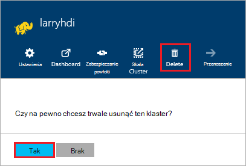

<properties
pageTitle="Jak usunąć klaster HDInsight | Azure"
description="Informacje na temat sposobów usunąć klaster HDInsight."
services="hdinsight"
documentationCenter=""
authors="Blackmist"
manager="jhubbard"
editor="cgronlun"/>

<tags
ms.service="hdinsight"
ms.devlang="na"
ms.topic="article"
ms.tgt_pltfrm="na"
ms.workload="big-data"
ms.date="10/28/2016"
ms.author="larryfr"/>

#Jak usunąć klaster HDInsight

Klaster HDInsight rozliczenia rozpoczyna się po klastrze zostanie utworzona i przestaje być, gdy klaster zostanie usunięty i jest proporcjonalny minutę, dlatego zawsze należy usunąć klaster, gdy nie jest już używana. W tym dokumencie dowiesz się, jak usunąć klaster za pomocą Azure Portal, Azure programu PowerShell i polecenie Azure.

> [AZURE.IMPORTANT] Usunięcie klaster HDInsight nie powoduje usunięcia konta magazynu platformy Azure skojarzone z klastrem. Umożliwia zachowanie i ponowne używanie dowolne dane przechowywane przez klaster.

##Azure Portal

1. Zaloguj się do [portalu Azure](https://portal.azure.com) i wybierz klaster HDInsight. Jeśli klaster HDInsight nie zostanie przypięta do pulpitu nawigacyjnego, można wyszukiwać go według nazwy za pomocą pola wyszukiwania (ikonę lupy), po prawej stronie paska nawigacyjnego.

    

2. Po otwarciu karta dla klaster, wybierz ikonę __usuwania__ . Po wyświetleniu monitu wybierz pozycję __Tak,__ Aby usunąć klaster.

    

##Azure programu PowerShell

W wierszu polecenia programu PowerShell Użyj następującego polecenia, aby usunąć klaster:

    Remove-AzureRmHDInsightCluster -ClusterName CLUSTERNAME

Zamień __NAZWAKLASTRA__ nazwę klaster HDInsight.

##Polecenie Azure

W wierszu usuwanie klaster przy użyciu następujących czynności:

    azure hdinsight cluster delete CLUSTERNAME
    
Zamień __NAZWAKLASTRA__ nazwę klaster HDInsight.
