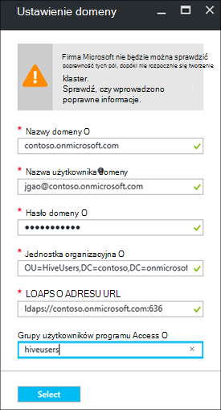

<properties
    pageTitle="Konfigurowanie domeny HDInsight klastrów | Microsoft Azure"
    description="Dowiedz się, jak utworzyć i skonfigurować klastrów domeny HDInsight"
    services="hdinsight"
    documentationCenter=""
    authors="saurinsh"
    manager="jhubbard"
    editor="cgronlun"
    tags=""/>

<tags
    ms.service="hdinsight"
    ms.devlang="na"
    ms.topic="article"
    ms.tgt_pltfrm="na"
    ms.workload="big-data"
    ms.date="10/26/2016"
    ms.author="saurinsh"/>

# Konfigurowanie domeny HDInsight klastrów (wersja Preview)

Dowiedz się, jak skonfigurować klaster Azure HDInsight z usługi Azure Active Directory (Azure AD) i [Zakres Apache](http://hortonworks.com/apache/ranger/) , aby można było korzystać z silnego uwierzytelniania i zasad kontroli (RBAC) sformatowanego dostępu oparta na rolach.  Usługa HDInsight domeny można skonfigurować tylko na podstawie Linux klastrów. Aby uzyskać więcej informacji zobacz [wprowadzenie domeny HDInsight klastrów](hdinsight-domain-joined-introduction.md).

Ten artykuł dotyczy samouczek pierwszej serii:

- Utwórz klaster HDInsight połączony Azure AD (za pomocą funkcji Azure Directory Domain Services) z zakres Apache włączone.
- Tworzenie i stosowanie zasad gałęzi za pośrednictwem zakres Apache i umożliwić użytkownikom (na przykład danych naukowców) połączenia do gałęzi przy użyciu narzędzi opartych na ODBC, na przykład w programie Excel, Tableau itp. Firma Microsoft współpracuje o dodawaniu innych obciążeń pracą, takie jak HBase, Spark i burza, do domeny HDInsight wkrótce.

Przykład ostateczne topologii wygląda następująco:

Ponieważ Azure AD obecnie obsługuje tylko klasyczny wirtualnych sieci (VNets) i HDInsight systemem Linux klastrów obsługują tylko Menedżer zasobów Azure podstawie VNets, integracja HDInsight Azure AD wymaga dwóch VNets i zaglądanie między nimi. Uzyskać informacje porównań między modelami dwóch wdrażania, zobacz [Menedżera zasobów Azure a klasyczny wdrażania: Opis modeli wdrażania i stan zasobów](../resource-manager-deployment-model.md). Dwa VNets muszą znajdować się w tym samym regionie jako Azure AD DS.

Nazwy usług Azure musi być globalnie unikatowa. Następujące nazwy są używane w tym samouczku. Contoso jest nazwą fikcyjny. Po przejściu samouczek, należy zastąpić *contoso* pod inną nazwą. 
    
**Nazwy:**

|Właściwość|Wartość|
|--------|-----|
| Azure AD VNet|contosoaadvnet|
| Azure AD maszyn wirtualnych (maszyn wirtualnych)|contosoaadadmin. Ten maszyn wirtualnych służy do konfigurowania jednostka organizacyjna i odwrócić strefy DNS.|
| Azure AD katalogu|contosoaaddirectory|
| Nazwy domeny w usłudze Azure AD|Contoso (contoso.onmicrosoft.com)|
| HDInsight VNet|contosohdivnet|
| Grupa zasobów HDInsight VNet|contosohdirg|
| Klaster HDInsight|contosohdicluster|

Ten samouczek zawiera instrukcje dotyczące konfigurowania klastrze HDInsight domeny. Każda sekcja zawiera łącza do innych artykułów więcej podstawowych informacji.

## Wymagania wstępne:

- Zapoznaj się z [usług domenowych AD Azure](https://azure.microsoft.com/services/active-directory-ds/) jego strukturę [ceny](https://azure.microsoft.com/pricing/details/active-directory-ds/) .
- Należy się upewnić, że Twoja subskrypcja jest whitelisted dla publicznej Podgląd. Możesz to zrobić przez wysłanie wiadomości e-mail do hdipreview@microsoft.com ze swojego identyfikatora subskrypcji.
- Certyfikat SSL został podpisany przez urząd podpisywania dla swojej domeny. Certyfikat jest wymagane przez skonfigurowanie bezpiecznego protokołu LDAP. Nie można używać certyfikatów z podpisem własnym.

## Procedury

1. Tworzenie Azure VNet klasyczny dla usługi Azure AD.  
2. Tworzenie i konfigurowanie Azure AD i Azure AD DS.
3. Dodawanie maszyny do klasyczny VNet związane z tworzeniem jednostka organizacyjna. 
4. Utwórz jednostkę organizacyjną dla Azure AD DS.
5. Tworzenie HDInsight VNet w trybie zarządzania Azure zasobów.
6. Konfigurowanie strefy DNS odwrócić dla Azure AD DS.
6. Równorzędne dwóch VNets.
7. Utwórz klaster HDInsight.

> [AZURE.NOTE] Tego samouczka przyjęto założenie, że nie masz Azure AD. Jeśli masz, możesz pominąć znajdującej się w kroku 2.
    
## Tworzenie Azure VNet klasyczny

W tej sekcji możesz utworzyć klasyczny VNet, za pomocą portalu Azure. W następnej sekcji można włączyć Azure AD DS usługi Azure AD w klasycznym VNet. Aby uzyskać więcej informacji na temat poniższą procedurę i innych metod tworzenia VNet zobacz [Tworzenie wirtualnej sieci (klasyczny) za pomocą portalu Azure](../virtual-network/virtual-networks-create-vnet-classic-portal.md).

**Aby utworzyć VNet klasyczny**

1. Logowanie się do [portalu Azure](https://portal.azure.com). 
2. Kliknij przycisk **Nowy** > **sieci** > **wirtualnej sieci**.
3. **Wybierz model wdrożenia**wybierz pozycję **Klasyczny**, a następnie kliknij **Utwórz**.
4. Wprowadź lub wybierz następujące wartości:

    - **Nazwa**: contosoaadvnet
    - **Przestrzeń adresów**: 10.1.0.0/16
    - **Nazwa podsieci**: podsieć1
    - **Zakres adresów podsieci**: 10.1.0.0/24
    - **Subskrypcja**: (Wybierz subskrypcję służy do tworzenia tej VNet).
    - **Grupa zasobów**:
    - **Lokalizacja**: (Wybierz region klaster HDInsight).

        > [AZURE.IMPORTANT] Należy wybrać lokalizację obsługującego Azure AD DS. Aby uzyskać więcej informacji zobacz [dostępności według regionów produktów](https://azure.microsoft.com/en-us/regions/services/). 
        >
        > W tym samym regionie jako Azure AD DS musi być zarówno klasyczny VNet i VNet grupy zasobów.

5. Kliknij przycisk **Utwórz** , aby utworzyć VNet.

## Tworzenie i konfigurowanie Azure AD DS dla usługi Azure AD

W tej sekcji spowoduje:

1. Tworzenie Azure AD.
2. Tworzenie użytkowników Azure AD. Ci użytkownicy korzystają z domeny. Konfigurowanie klaster HDInsight za pomocą Azure AD są używane pierwszego użytkownika.  Dwóch użytkowników są opcjonalne dla tego samouczka. Będą używane w [gałęzi Konfigurowanie zasad dla klastrów HDInsight domeny](hdinsight-domain-joined-run-hive.md) podczas konfigurowania zasad Apache zakres.
3. Tworzenie grupy Administratorzy kontrolera domeny AAD i dodać Azure AD użytkownika do grupy. Utwórz jednostkę organizacyjną za pomocą tego użytkownika.
4. Włączanie usługi Azure AD domeny (Azure AD DS) dla Azure AD.
7. Skonfigurować LDAPS Azure AD. Lightweight Directory Access Protocol (LDAP) służy do odczytu i zapisu Azure AD.

Jeśli wolisz używać istniejących Azure AD, możesz pominąć kroki 1 i 2.

**Aby utworzyć Azure AD**

1. [Portal Azure klasyczny](https://manage.windowsazure.com)kliknij przycisk **Nowy** > **Aplikacji usług** > **Usługi Active Directory** > **katalogu** > **Utworzyć niestandardowe**. 
3. Wprowadź lub wybierz następujące wartości:

    - **Nazwa**: contosoaaddirectory
    - **Nazwa domeny**: contoso.  Ta nazwa musi być unikatowa globalnie.
    - **Kraj lub region**: Wybierz swój kraj lub region.
4. Kliknij pozycję **pełne**.

**Utwórz użytkownika Azure AD**

1. [Portal Azure klasyczny](https://manage.windowsazure.com)kliknij **Usługi Active Directory** -> **contosoaaddirectory**. 
3. Kliknij pozycję **Użytkownicy** , w górnym menu.
4. Kliknij pozycję **Dodaj użytkownika**.
4. Wprowadź **Nazwę użytkownika**, a następnie kliknij przycisk **Dalej**. 
5. Konfigurowanie profilu użytkownika; W **roli**wybierz pozycję **Administrator globalny**; a następnie kliknij przycisk **Dalej**.  Rola administratora globalnego jest potrzebne do utworzenia jednostkami organizacyjnymi.
6. Kliknij przycisk **Utwórz** , aby uzyskać hasła tymczasowego.
7. Kopię hasła, a następnie kliknij przycisk **Zakończ**. W dalszej części tego samouczka będzie logowanie do strony Administracja maszyn wirtualnych do tworzenia jednostka organizacyjna i konfigurowania odwrotnej DNS za pomocą tego użytkownika administratora globalnego.

Wykonaj tę samą procedurę, aby utworzyć dwie więcej użytkowników z roli **użytkownika** , hiveuser1 i hiveuser2. Następujący użytkownicy będą używane w [gałęzi Konfigurowanie zasad dla klastrów HDInsight domeny](hdinsight-domain-joined-run-hive.md).

**Aby utworzyć grupy AAD Administratorzy kontrolera domeny i dodać użytkownika w usłudze Azure AD**

1. [Portal Azure klasyczny](https://manage.windowsazure.com)kliknij **Usługi Active Directory** > **contosoaaddirectory**. 
3. Kliknij pozycję **grupy** , w górnym menu.
4. Kliknij przycisk **Dodaj grupę** lub **Dodaj grupę**.
5. Wprowadź lub wybierz następujące wartości:

    - **Nazwa**: Administratorzy kontrolera domeny AAD.  Nie zmienisz nazwę grupy.
    - **Typ grupy**: zabezpieczenia.
6. Kliknij pozycję **pełne**.
7. Kliknij pozycję **Administratorzy kontrolera domeny AAD** otworzyć grupę.
8. Kliknij przycisk **Dodaj członków**.
9. Zaznacz pierwszy użytkownika, którego został utworzony w poprzednim kroku, a następnie kliknij **wykonane**.
10. Powtórz te same kroki, aby utworzyć inną grupę o nazwie **HiveUsers**, a następnie dodaj dwóch użytkowników gałęzi do grupy.

Aby uzyskać więcej informacji zobacz [usług domenowych AD Azure (wersja Preview) — utworzyć grupę "Administratorzy AAD kontrolera domeny"](../active-directory-domain-services/active-directory-ds-getting-started.md).

**Aby włączyć Azure AD DS dla usługi Azure AD**

1. [Portal Azure klasyczny](https://manage.windowsazure.com)kliknij **Usługi Active Directory** > **contosoaaddirectory**. 
3. W górnym menu, kliknij przycisk **Konfiguruj** .
4. Przewiń w dół do **Usług domenowych**i ustaw następujące wartości:

    - **Włączanie usług domenowych dla tego katalogu**: tak.
    - **Nazwa domeny DNS w usługach domenowych**: powoduje wyświetlenie domyślnej nazwy DNS Azure katalogu. Na przykład contoso.onmicrosoft.com.
    - **Usług domenowych łączenie się z tą siecią wirtualną**: wybierz pozycję klasyczny wirtualnej sieci został utworzony wcześniej, to znaczy **contosoaadvnet**.
    
6. Kliknij pozycję **Zapisz** u dołu strony. Zostanie wyświetlona **Oczekiwanie...** obok **włączyć usługi domeny dla tego katalogu**.  
7. Poczekaj **Oczekiwanie...** zniknie, i otrzymuje **Adres IP** . Dwa adresy IP będzie uzyskiwanie wypełnione. Są to adresy IP obsługi administracyjnej w usługach domenowych kontroler domeny. Każdego adresu IP będą widoczne po odpowiedniego kontrolera domeny ustanawianie i gotowe. Zanotuj dwa adresy IP. Należy je później.

Aby uzyskać więcej informacji zobacz [Azure AD domeny usługi (wersja Preview) — Włączanie Azure AD domeny](../active-directory-domain-services/active-directory-ds-getting-started-enableaadds.md).

**Aby zsynchronizować hasła**

Jeśli korzystasz z własnej domeny, należy zsynchronizować hasło. Zobacz [Włącz synchronizację hasło do usług domenowych Azure AD dla tylko do chmury Azure AD katalogu](../active-directory-domain-services/active-directory-ds-getting-started-password-sync.md).

**Aby skonfigurować LDAPS Azure AD**

1. Uzyskaj certyfikat SSL podpisaną przez urząd podpisywania dla swojej domeny. Nie można używać certyfikatów z podpisem własnym. Jeśli nie możesz uzyskać certyfikat SSL, sprawdź bliższy kontakt z hdipreview@microsoft.com wyjątku.
1. [Portal Azure klasyczny](https://manage.windowsazure.com)kliknij **Usługi Active Directory** > **contosoaaddirectory**. 
3. W górnym menu, kliknij przycisk **Konfiguruj** .
4. Przewiń do **usług domenowych**.
5. Kliknij pozycję **Konfiguruj certyfikat**.
6. Postępuj zgodnie z instrukcjami, aby określić plik certyfikatu i hasło. Zostanie wyświetlona **Oczekiwanie...** obok **włączyć usługi domeny dla tego katalogu**.  
7. Poczekaj **Oczekiwanie...** zniknie, i masz **Certyfikatu bezpiecznego LDAP** .  To może potrwać 10 minut lub więcej.
 
>[AZURE.NOTE] Jeśli niektóre zadania w tle są uruchamiane na Azure AD DS, zobaczysz komunikat o błędzie podczas przekazywania certyfikat — <i>jest operację dla dzierżawy. Spróbuj ponownie później</i>.  W przypadku, gdy wystąpi ten błąd, spróbuj ponownie po pewnym czasie. Druga IP kontrolera domeny może potrwać do 3 godzin ma zostać zastrzeżona.

Aby uzyskać więcej informacji zobacz [Konfigurowanie bezpiecznego protokołu LDAP (LDAPS) w domenie usług domenowych AD Azure zarządzane](../active-directory-domain-services/active-directory-ds-admin-guide-configure-secure-ldap.md).

## Konfigurowanie jednostka organizacyjna i odwrócić DNS

W tej sekcji Dodawanie maszyny wirtualnej do Azure AD VNet i zainstaluj narzędzia administracyjne na tym maszyn wirtualnych, więc można skonfigurować jednostka organizacyjna i odwrócić DNS. Odwrotne wyszukiwanie DNS jest wymagany do uwierzytelniania Kerberos.

**Aby utworzyć maszyny wirtualnej w wirtualnej sieci**

1. [Portal Azure klasyczny](https://manage.windowsazure.com)kliknij przycisk **Nowy** > **obliczyć** > **maszyn wirtualnych** > **Z galerii**.
3. Zaznacz obraz, a następnie kliknij przycisk **Dalej**.  Jeśli nie wiesz, która z nich korzystać, wybierz pozycję domyślny, **Windows Server 2012 R2 w centrum danych**.
4. Wprowadź lub wybierz następujące wartości:

    - Nazwa maszyn wirtualnych: **contosoaadadmin**
    - Warstwy: **Podstawowe**
    - Nowa nazwa użytkownika: (Wprowadź nazwę użytkownika)
    - Hasło: (Wprowadź hasło)
    
    Zwróć uwagę, nazwa użytkownika i hasło jest lokalny administrator.
    
5. Kliknij przycisk **Dalej**
6. W **Regionie/wirtualnej sieci**wybierz pozycję Nowy, wirtualną sieć utworzonego w ostatnim kroku (contosoaadvnet), a następnie kliknij **Dalej**.
7. Kliknij pozycję **pełne**.

**Aby RDP do maszyn wirtualnych**

1. [Portal Azure klasyczny](https://manage.windowsazure.com)kliknij **maszyn wirtualnych** > **contosoaadadmin**.
3. Kliknij pozycję **pulpit nawigacyjny** w górnym menu.
4. Kliknij przycisk **Połącz** u dołu strony.
5. Postępuj zgodnie z instrukcjami i nawiązywanie połączenia za pomocą administratora lokalnego nazwę użytkownika i hasło.

**Aby dołączyć do maszyn wirtualnych do domeny Azure AD**

1. Z sesji RDP kliknij przycisk **Start**, a następnie kliknij pozycję **Menedżer serwera**.
2. Kliknij pozycję **Lokalny serwer** z menu po lewej stronie.
3. Z grupy roboczej kliknij pozycję **Grupa robocza**.
4. Kliknij przycisk **Zmień**.
5. Kliknij **domenę**, wprowadź **contoso.onmicrosoft.com**, a następnie kliknij **przycisk OK**.
6. Wprowadź poświadczenia użytkownika domeny, a następnie kliknij **przycisk OK**.
7. Kliknij **przycisk OK**.
8. Kliknij **przycisk OK** , aby zaakceptować Uruchom ponownie komputer.
9. Kliknij przycisk **Zamknij**.
10. Kliknij przycisk **Uruchom ponownie**.

Aby uzyskać więcej informacji zobacz [Dołączanie maszyny wirtualnej Windows Server zarządzanych domeny](../active-directory-domain-services/active-directory-ds-admin-guide-join-windows-vm.md).

**Do zainstalowania narzędzia administracyjne usługi Active Directory i narzędzia systemu DNS**

1. RDP do **contosoaadadmin** przy użyciu konta użytkownika Azure AD.
2. Kliknij przycisk **Start**, a następnie kliknij pozycję **Menedżer serwera**.
3. Kliknij pozycję **pulpit nawigacyjny** z menu po lewej stronie.
4. Kliknij pozycję **Zarządzaj**, a następnie kliknij pozycję **Dodaj role i funkcje**.
5. Kliknij przycisk **Dalej**.
6. Wybrana **Instalacja oparta na rolach lub funkcji**, a następnie kliknij przycisk **Dalej**.
7. Zaznaczanie bieżącej maszyny wirtualnej z puli serwera, a następnie kliknij przycisk **Dalej**.
8. Kliknij przycisk **Dalej** Aby pominąć role.
9. Rozwiń **Narzędzia administracji zdalnej serwera**, rozwiń pozycję **Narzędzia administracyjne roli**, wybierz pozycję **Narzędzia tych usług i usług AD DS** i **Narzędzia serwera DNS**, a następnie kliknij przycisk **Dalej**. 
10. Kliknij przycisk **Dalej**
10. Kliknij przycisk **Zainstaluj**.

Aby uzyskać więcej informacji zobacz [Instalowanie usługi Active Directory narzędzia administracyjne na komputerze wirtualnych](../active-directory-domain-services/active-directory-ds-admin-guide-administer-domain.md#task-2---install-active-directory-administration-tools-on-the-virtual-machine).

**Aby skonfigurować odwrotnej DNS**

1. RDP do contosoaadadmin przy użyciu konta użytkownika Azure AD.
2. Kliknij przycisk **Start**, kliknij polecenie **Narzędzia administracyjne**, a następnie kliknij pozycję **DNS**. 
3. Kliknij przycisk **nie** , aby pominąć, dodając ContosoAADAdmin.
4. Zaznacz **następujący komputer**, wprowadź adres IP pierwszego serwera DNS, które skonfigurowano wcześniej, a następnie kliknij **przycisk OK**.  Jest widoczny kontrolera domeny i DNS jest dodawany do lewego okienka.
3. Rozwiń węzeł serwera DNS kontrolera domeny, kliknij prawym przyciskiem myszy **Stref odwrotnej wyszukiwania**, a następnie kliknij **Nowej strefy**. Zostanie otwarty Kreator nowych stref.
4. Kliknij przycisk **Dalej**.
5. Zaznacz **strefę podstawową**, a następnie kliknij przycisk **Dalej**.
6. Zaznacz **na wszystkich serwerach DNS uruchomionych na kontrolerach domeny w tej domenie**, a następnie kliknij przycisk **Dalej**.
6. Zaznacz **IPv4 odwrócić strefy wyszukiwania**, a następnie kliknij przycisk **Dalej**.
7. W polu **Identyfikator sieci**wprowadź prefiks dla zakresu sieci HDInsight VNET, a następnie kliknij przycisk **Dalej**. Utworzysz HDInsight VNet w następnej sekcji.
8. Kliknij przycisk **Dalej**.
9. Kliknij przycisk **Dalej**.
10. Kliknij przycisk **Zakończ**.

Jednostka organizacyjna, które można tworzyć dalej będzie używany podczas tworzenia klaster HDInsight. Użytkownicy systemu Hadoop i konta komputerów zostaną umieszczone w tym jednostce Organizacyjnej.

**Tworzenie organizacji jednostek (OU) w domenie usług domenowych AD Azure zarządzanych**

1. RDP do **contosoaadadmin** przy użyciu konta domeny, która znajduje się w grupie **Administratorzy kontrolera domeny AAD** .
2. Kliknij przycisk **Start**, kliknij polecenie **Narzędzia administracyjne**, a następnie kliknij **Centrum administracyjnego usługi Active Directory**.
5. Kliknij nazwę domeny w okienku po lewej stronie. Na przykład contoso.
6. W obszarze nazwy domeny, w okienku **zadań** kliknij pozycję **Nowy** , a następnie kliknij **Jednostka organizacyjna**.
7. Wprowadź nazwę, na przykład **HDInsightOU**, a następnie kliknij **przycisk OK**. 

Aby uzyskać więcej informacji zobacz [Tworzenie organizacji jednostek (OU) w domenie usług domenowych AD Azure zarządzane](../active-directory-domain-services/active-directory-ds-admin-guide-create-ou.md).

## Tworzenie VNet Menedżera zasobów dla klastrów HDInsight

W tej sekcji utworzysz VNet Menedżera zasobów Azure używany w klastrze HDInsight. Aby uzyskać więcej informacji na temat tworzenia VNET Azure za pomocą innych metod zobacz [Tworzenie wirtualnej sieci](../virtual-network/virtual-networks-create-vnet-arm-pportal.md)

Po utworzeniu VNet, skonfiguruj VNet Menedżera zasobów do korzystania z tym samym serwerów DNS dla Azure AD VNet. Jeśli zostały wykonane kroki opisane w tym samouczku utworzyć klasyczny VNet i Azure AD, serwery DNS są 10.1.0.4 i 10.1.0.5.

**Aby utworzyć VNet Menedżera zasobów**

1. Logowanie się do [portalu Azure](https://portal.azure.com).
2. Kliknij pozycję **Nowy**, **sieci**, a następnie **wirtualnej sieci**. 
3. **Wybierz model wdrożenia**wybierz pozycję **Menedżer zasobów**, a następnie kliknij **Utwórz**.
4. Wpisz lub wybierz następujące wartości:

    - **Nazwa**: contosohdivnet
    - **Przestrzeń adresów**: 10.2.0.0/16. Upewnij się, że zakres adresów nie może zachodzić na zakres adresów IP VNet klasyczny.
    - **Nazwa podsieci**: podsieć1
    - **Zakres adresów podsieci**: 10.2.0.0/24
    - **Subskrypcja**: (Wybierz subskrypcję Azure).
    - **Grupa zasobów**: contosohdirg
    - **Lokalizacja**: (Wybierz tej samej lokalizacji jako Azure AD VNet, to znaczy contosoaadvnet).

5. Kliknij przycisk **Utwórz**.

**Aby skonfigurować system DNS dla VNet Menedżera zasobów**

1. [Azure portal](https://portal.azure.com), kliknij pozycję **więcej usług** -> **wirtualne sieci**. Upewnij się, aby nie kliknąć przycisku **wirtualne sieci (klasyczny)**.
2. Kliknij pozycję **contosohdivnet**.
4. Kliknij pozycję **serwery DNS** po lewej stronie nowego karta.
6. Kliknij pozycję **niestandardowe**, a następnie wprowadź następujące wartości:

    - 10.1.0.4
    - 10.1.0.5

    Te adresy IP serwera DNS musi odpowiadać na serwerach DNS w AD VNet Azure (klasyczny VNet).
7. Kliknij przycisk **Zapisz**.

## Równorzędne Azure AD VNet i HDInsight VNet

**Równorzędne dwóch VNet**

1. Logowanie się do [portalu Azure](https://portal.azure.com).
2. Kliknij pozycję **więcej usług** z menu po lewej stronie.
3. Kliknij pozycję **wirtualnych sieci**. Nie klikaj **wirtualne sieci (klasyczny)**.
4. Kliknij pozycję **contosohdivnet**.  Jest to HDInsight VNet.
5. Kliknij pozycję **Peerings** w lewym menu karta.
6. W górnym menu, kliknij przycisk **Dodaj** . Karta **Dodawanie zaglądanie** zostanie otwarty.
7. Karta **Dodawanie zaglądanie** Ustaw lub wybierz następujące wartości:

    - **Nazwa**: ContosoAADHDIVNetPeering
    - **Wirtualna sieć wdrożenia modelu**: klasyczny
    - **Subskrypcja**: Wybierz nazwę subskrypcji na potrzeby vnet klasyczny (Azure AD).
    - **Wirtualna sieć**: contosoaadvnet.
    - **Zezwalaj na dostęp wirtualną sieć**: (sprawdzanie)
    - **Zezwalaj przekazywane ruchu**: (sprawdzanie). Nie zaznaczaj wyboru innych dwa pola wyboru.

8. Kliknij **przycisk OK**.

## Utwórz klaster HDInsight

W tej sekcji możesz utworzyć klaster systemem Linux Hadoop w HDInsight za pomocą Azure portal lub [szablon Azure Menedżera zasobów](../resource-group-template-deploy.md). Inne metody tworzenia klaster i opis ustawień, zobacz [Tworzenie HDInsight klastrów](hdinsight-hadoop-provision-linux-clusters.md). Aby uzyskać więcej informacji na temat Tworzenie klastrów Hadoop w HDInsight za pomocą szablonu Menedżera zasobów zobacz [Tworzenie Hadoop klastrów w HDInsight przy użyciu szablonów Menedżera zasobów](hdinsight-hadoop-create-windows-clusters-arm-templates.md)

**Aby utworzyć klaster HDInsight domeny za pomocą portalu Azure**

1. Logowanie się do [portalu Azure](https://portal.azure.com).
2. Kliknij pozycję **Nowy**, **analizy + analizy**, a następnie **HDInsight**.
3. Z karta **HDInsight nowy klaster** wprowadź lub wybierz następujące wartości:

    - **Klaster nazwa**: Wprowadź nazwę nowego klaster klaster HDInsight domeny.
    - **Subskrypcja**: Wybierz subskrypcję usługi Azure służy do tworzenia klaster.
    - **Klaster konfiguracji**:

        - **Typ klaster**: Hadoop. Usługa HDInsight domeny jest obecnie klastrów tylko obsługiwana przez Hadoop.
        - **System operacyjny**: Linux.  Domeny usługi HDInsight jest obsługiwana tylko na klastrów HDInsight systemem Linux.
        - **Wersja**: Hadoop 2.7.3 (HDI 3.5). Domeny usługi HDInsight jest obsługiwana tylko w wersji klaster HDInsight 3.5.
        - **Typ klaster**: PREMIUM

        Kliknij przycisk **Wybierz** , aby zapisać zmiany.

    - **Poświadczenia**: Konfigurowanie poświadczenia dla użytkownik klaster i SSH użytkownika.
    - **Źródła danych**: Tworzenie nowego konta miejsca do magazynowania lub użyj istniejącego konta miejsca do magazynowania jako konto domyślne miejsca do magazynowania dla klastrów HDInsight. Lokalizacja musi być taka sama jak dwóch VNets.  Lokalizacja jest także lokalizację klaster HDInsight.
    - **Ceny**: Wybierz liczbę pracowników węzłów klaster.
    - **Konfiguracje zaawansowane**: 

        - **Dołączanie do domeny i Vnet podsieci**: 

            - **Ustawienia domeny**: 

                - **Nazwa domeny**: contoso.onmicrosoft.com
                - **Nazwa użytkownika domeny**: Wprowadź nazwę użytkownika domeny. Ta domena musi mieć następujące uprawnienia: dołączanie do maszyn do domeny i umieść je w jednostce organizacyjnej skonfigurowano wcześniej; Tworzyć główne usługi w jednostce organizacyjnej, które skonfigurowano wcześniej; Tworzenie odwrotnej wpisy DNS. Użytkownika tej domeny będzie administratorem klaster HDInsight tej domeny.
                - **Hasło domeny**: Wprowadź hasło użytkownika domeny.
                - **Jednostka organizacyjna**: Wprowadź nazwa wyróżniająca umożliwiający OU skonfigurowano wcześniej. Na przykład: OU = HDInsightOU, DC = contoso, kontrolera domeny = onmicrosoft, kontrolera domeny = com
                - **Adres URL LDAPS**: ldaps://contoso.onmicrosoft.com:636
                - **Grupy użytkowników programu Access**: określić użytkowników, którzy wan do synchronizacji z klastrem grupy zabezpieczeń. Na przykład HiveUsers.

                Kliknij przycisk **Wybierz** , aby zapisać zmiany.

                
            - **Wirtualna sieć**: contosohdivnet
            - **Podsieci**: podsieć1

            Kliknij przycisk **Wybierz** , aby zapisać zmiany.       
        Kliknij przycisk **Wybierz** , aby zapisać zmiany.
    - **Grupa zasobów**: Wybierz grupę zasobów na potrzeby HDInsight VNet (contosohdirg).

4. Kliknij przycisk **Utwórz**.  

Innym rozwiązaniem do tworzenia klaster domeny HDInsight jest za pomocą szablonu zarządzania zasobami Azure. Poniższa procedura pokazano, jak:

**Aby utworzyć klaster HDInsight domeny przy użyciu szablonu zarządzanie zasobami**

1. Kliknij następujący obraz, aby otworzyć Menedżera zasobów szablonu w portalu Azure. Szablon Menedżera zasobów znajduje się w kontenerze publicznej obiektów blob. 

    

2. Z karta **Parametry** wprowadź następujące wartości:

    - **Subskrypcja**: (Wybierz subskrypcję Azure).
    - **Grupa zasobów**: kliknij pozycję **Użyj istniejącego**, i określ dla tej samej grupy zasobów był używany.  Na przykład contosohdirg. 
    - **Lokalizacja**: Określ lokalizację grupy zasobów.
    - **Klaster nazwa**: Wprowadź nazwę klaster Hadoop, który ma zostać utworzony. Na przykład contosohdicluster.
    - **Typ klaster**: Wybierz typ klaster.  Wartość domyślna to **hadoop**.
    - **Lokalizacja**: Wybierz lokalizację, w której klaster.  Domyślne konto magazynu używa tej samej lokalizacji.
    - **Liczba pracowników węzła**: Zaznacz liczby węzłów pracownika.
    - **Klaster nazwę logowania i hasło**: domyślna nazwa logowania to **administratora**.
    - **SSH nazwy użytkownika i hasła**: domyślna nazwa użytkownika to **sshuser**.  Można zmienić jej nazwę. 
    - **Identyfikator wirtualnej sieci**: /subscriptions/&lt;SubscriptionID > /resourceGroups/&lt;ResourceGroupName > /providers/Microsoft.Network/virtualNetworks/&lt;VNetName >
    - **Wirtualna podsieci**: /subscriptions/&lt;SubscriptionID > /resourceGroups/&lt;ResourceGroupName > /providers/Microsoft.Network/virtualNetworks/&lt;VNetName >/podsieci/podsieć1
    - **Nazwa domeny**: contoso.onmicrosoft.com
    - **Nazwy domeny jednostki organizacji**: OU = HDInsightOU, DC = contoso, kontrolera domeny = onmicrosoft, kontrolera domeny = com
    - **Klaster użytkowników grupy D Ns**: "\"CN = HiveUsers, OU = użytkownicy AADDC, kontrolera domeny =<DomainName>, kontrolera domeny = onmicrosoft, kontrolera domeny = com\""
    - **LDAPUrls**: ["ldaps://contoso.onmicrosoft.com:636"]
    - **DomainAdminUserName**: (wprowadź nazwę użytkownika administratora domeny)
    - **DomainAdminPassword**: (Wprowadź hasło administratora domeny)
    - **Zgodę na warunki umowy podanych powyżej**: (sprawdzanie)
    - **Przypnij do pulpitu nawigacyjnego**: (sprawdzanie)

6. Kliknij przycisk **Kup**. Zostanie wyświetlony fragment zatytułowany **rozmieszczania wdrażanie szablonu**. Wystarczy o około 20 minut Aby utworzyć klaster. Po utworzeniu klaster, możesz kliknąć pozycję Karta klaster w portalu, aby go otworzyć.

Po ukończeniu samouczka można usunąć klaster. Z usługi HDInsight dane są przechowywane w magazynie Azure, więc można bezpiecznie usunąć klaster, gdy nie jest używany. Możesz również są naliczane dla klastrów HDInsight nawet wtedy, gdy nie jest używany. Ponieważ opłaty za klaster są wielokrotnie większe niż opłaty za miejsca do magazynowania, warto ekonomicznych usuwanie klastrów, gdy nie są one używane. Aby uzyskać instrukcje dotyczące usuwania klastrze zobacz [Zarządzanie Hadoop klastrów w HDInsight za pomocą portalu Azure](hdinsight-administer-use-management-portal.md#delete-clusters).

## Następne kroki

- Do konfigurowania zasad gałęzi i uruchamianie kwerend gałęzi, zobacz [Konfigurowanie gałęzi zasad dla klastrów HDInsight domeny](hdinsight-domain-joined-run-hive.md).
- Na wykonywanie zapytań gałęzi przy użyciu SSH na klastrów domeny usługi HDInsight, zobacz [Używanie SSH z systemem Linux Hadoop na HDInsight z Linux, Unix lub OS X](hdinsight-hadoop-linux-use-ssh-unix.md#connect-to-a-domain-joined-hdinsight-cluster).
