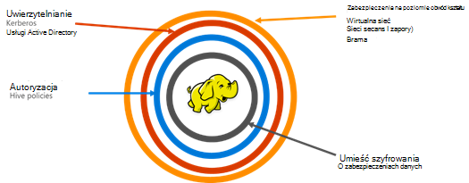

<properties
    pageTitle="Zabezpieczanie omówienie HDInsight | Microsoft Azure"
    description="Więcej informacji..."
    services="hdinsight"
    documentationCenter=""
    authors="saurinsh"
    manager="jhubbard"
    editor="cgronlun"
    tags="azure-portal"/>

<tags
    ms.service="hdinsight"
    ms.devlang="na"
    ms.topic="hero-article"
    ms.tgt_pltfrm="na"
    ms.workload="big-data"
    ms.date="10/24/2016"
    ms.author="saurinsh"/>

# Wprowadzenie klastrów HDInsight domeny (wersja Preview)

Usługa Azure HDInsight do momentu dzisiaj tylko jeden użytkownik lokalny administrator. To ponosić doświadczenia dla mniejszych zespołów aplikacji lub działów. Jak Hadoop podstawie obciążenia zdobyte więcej popularności w sector przedsiębiorstwa, trzeba możliwości klasy przedsiębiorstwa, takich jak usługi active directory podstawie uwierzytelniania, obsługę wielu użytkowników i kontroli dostępu oparte na roli stał się bardziej ważne. Przy użyciu klastrów HDInsight domeny, można utworzyć klaster HDInsight dołączony do domeny usługi Active Directory, skonfiguruj listę pracowników w przedsiębiorstwie, którzy może przeprowadzać uwierzytelnianie za pośrednictwem usługi Azure Active Directory, aby zalogować się do usługi HDInsight klaster. Każda osoba spoza przedsiębiorstwa nie można zalogować ani dostępu klaster HDInsight. Administrator przedsiębiorstwa można skonfigurować kontroli dostępu oparte na roli zabezpieczeń gałęzi przy użyciu [Zakres Apache](http://hortonworks.com/apache/ranger/), więc ograniczanie dostępu do danych w celu tylko, jak wymagane. Ponadto administrator może inspekcji dostęp do danych przez pracowników i wszelkie zmiany w celu zasad kontroli dostępu, a więc osiągnięcia wysoki stopień zarządzania ich zasobów firmy.

[AZURE.NOTE]> Nowe funkcje opisane w tym podglądzie są dostępne tylko na klastrów systemem Linux HDInsight obciążenia pracą gałęzi. Inne obciążenia, takich jak HBase, Spark, Burza i Kafka, będą dostępne w przyszłych wersjach. 

## Zalety

Zabezpieczenia wersji Enterprise zawiera cztery grupy duży — zabezpieczeń obwód kształtu, uwierzytelnianie, autoryzacja i szyfrowania.

.

### Zabezpieczenia obwód kształtu

Zabezpieczenia obwód kształtu w HDInsight uzyskuje się za pomocą wirtualnych sieci i Usługa bramy. Dzisiaj administrator przedsiębiorstwa można utworzyć klaster HDInsight wewnątrz wirtualnej sieci i używać grup zabezpieczeń sieci (reguły zapory przychodzących i wychodzących) aby ograniczyć dostęp do sieci wirtualnej. Tylko adresy IP zdefiniowane w reguły zapory dla ruchu przychodzącego będzie można komunikować się z klastrem HDInsight, zapewniając zabezpieczeń obwód kształtu. Dodatkowej warstwy zabezpieczeń obwód kształtu uzyskuje się przy użyciu usługi bramy. Usługa, która stanowi pierwszą linię obrony żądania przychodzące do klastrów HDInsight jest bramy. Zaakceptuje żądanie, sprawdza je i następnie umożliwia żądanie tak, aby przekazać do innych węzłów w klastrze, zapewniając zabezpieczeń obwód kształtu do innych węzłów nazw i danych w grupie.

### Uwierzytelnianie

Z tym podglądzie publicznej administrator przedsiębiorstwa może obsługi administracyjnej klastrze domeny HDInsight w [wirtualnej sieci](https://azure.microsoft.com/services/virtual-network/). Węzły klaster HDInsight będzie dołączony do domeny zarządza przedsiębiorstwa. Można to osiągnąć przy użyciu [Azure Active Directory Domain Services](https://technet.microsoft.com/library/cc770946.aspx). Wszystkie węzły w klastrze są połączone z domeną, która zarządza przedsiębiorstwa. W przypadku tej konfiguracji pracowników przedsiębiorstwa logować się do węzłach przy użyciu poświadczeń domeny. Poświadczeń domeny mogą również wykorzystać do uwierzytelniania innych zatwierdzonych punktów końcowych, takich jak odcień, Ambari widoków, ODBC, JDBC, programu PowerShell i interfejsów API pozostałych do współdziałania z klastrem. Administrator musi pełną kontrolę nad ograniczanie liczby użytkowników interakcja z klastrem przez te punkty końcowe.

### Autoryzacja

Za najbardziej skuteczne rozwiązanie, a po nim większość przedsiębiorstw to, czy pracownika nie każdy ma dostęp do wszystkich zasobów przedsiębiorstwa. Ponadto w tej wersji Administrator można zdefiniować zasad kontroli dostępu oparte na roli dla zasobów klaster. Na przykład administrator można skonfigurować [Zakres Apache](http://hortonworks.com/apache/ranger/) , aby ustawić zasady kontroli dostępu dla gałęzi. Ta funkcja zapewnia, że pracownicy będą mieli dostęp tylko do tyle dane muszą być skuteczne w swoich zadań. Dostęp SSH z klastrem jest również ograniczone tylko do administratora.

### Inspekcja

Wraz z ochroną zasobów klaster HDInsight z nieautoryzowanych użytkowników i zabezpieczanie danych, inspekcja wszystkich dostępu do zasobów klaster i danych jest niezbędne do śledzenia nieautoryzowanego lub niezamierzony dostępu do zasobów. W tym podglądzie Administrator można wyświetlać i raport dostęp do danych i zasoby klastrów HDInsight. Administrator można przeglądać i przekazać wszystkie zmiany zasad kontroli dostępu w zakres Apache obsługiwane punkty końcowe. Klaster domeny HDInsight używa znany interfejs zakres Apache do wyszukiwania dzienników inspekcji. Do wewnętrznej bazy danych zakres używa [Apache Solr]( http://hortonworks.com/apache/solr/) do przechowywania i przeszukiwanie dzienników.

### Szyfrowanie

Ochrona danych jest ważna w przypadku spotkania organizacji bezpieczeństwa i zgodności z przepisami i wraz z ograniczanie dostępu do danych z nieautoryzowanego pracowników, go należy również zapewniane przez zaszyfrowanie jej. Zbiorów danych dla klastrów, obiektów Blob miejsca do magazynowania Azure i magazynowanie Lake danych Azure HDInsight obsługuje przezroczysty po stronie serwera [szyfrowania danych](../storage/storage-service-encryption.md) w pozostałych. Bezpieczny HDInsight klastrów bezproblemowo będzie współpracować z szyfrowania po stronie serwera danych w pozostałych funkcji.

## Następne kroki

- Do konfigurowania klastrze domeny usługi HDInsight, zobacz [Konfigurowanie domeny HDInsight klastrów](hdinsight-domain-joined-configure.md).
- Do zarządzania klastrów domeny usługi HDInsight, zobacz [Zarządzanie domeny HDInsight klastrów](hdinsight-domain-joined-manage.md).
- Do konfigurowania zasad gałęzi i uruchamianie kwerend gałęzi, zobacz [Konfigurowanie gałęzi zasad dla klastrów HDInsight domeny](hdinsight-domain-joined-run-hive.md).
- Na wykonywanie zapytań gałęzi przy użyciu SSH na klastrów domeny usługi HDInsight, zobacz [Używanie SSH z systemem Linux Hadoop na HDInsight z Linux, Unix lub OS X](hdinsight-hadoop-linux-use-ssh-unix.md#connect-to-a-domain-joined-hdinsight-cluster).