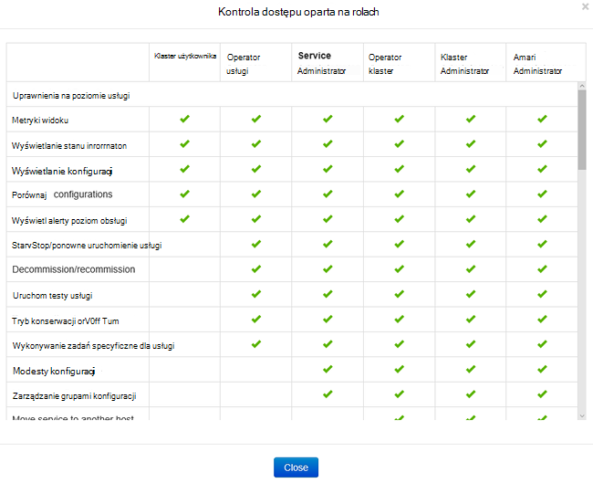
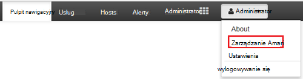
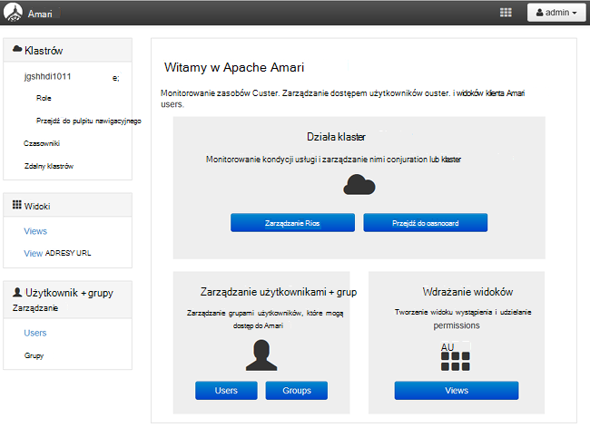
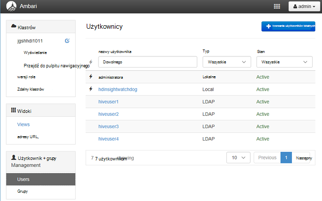
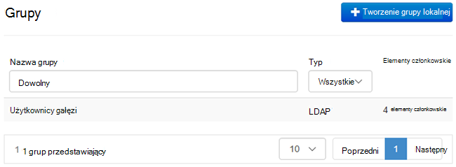
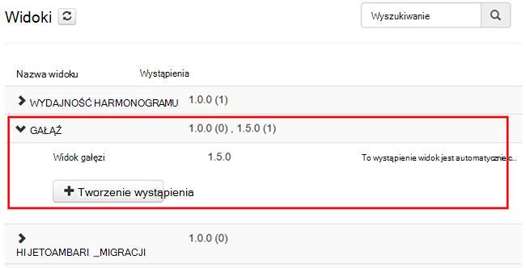
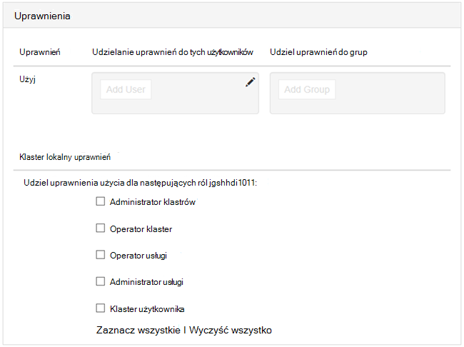

<properties
    pageTitle="Zarządzanie klastrów domeny HDInsight | Microsoft Azure"
    description="Dowiedz się, jak zarządzać klastrów domeny HDInsight"
    services="hdinsight"
    documentationCenter=""
    authors="saurinsh"
    manager="jhubbard"
    editor="cgronlun"
    tags=""/>

<tags
    ms.service="hdinsight"
    ms.devlang="na"
    ms.topic="article"
    ms.tgt_pltfrm="na"
    ms.workload="big-data"
    ms.date="10/25/2016"
    ms.author="saurinsh"/>

# Zarządzanie klastrów HDInsight domeny (wersja Preview)

Dowiedz się, użytkowników i ról w HDInsight domeny oraz jak można zarządzać klastrów HDInsight domeny.

## Użytkownicy klastrów domeny HDInsight

Klaster HDInsight, który nie jest dołączony do domeny obejmuje dwa konta użytkownika, które zostały utworzone podczas tworzenia klaster:

- **Administrator Ambari**: to konto jest nazywany *Hadoop użytkownika* lub *użytkowników HTTP*. To konto służy do logowania się do Ambari u https://&lt;NazwaKlastra >. azurehdinsight.net. Ponadto można go uruchamianie kwerend w widokach Ambari, wykonywanie zadań za pomocą narzędzia zewnętrznych (to znaczy programu PowerShell, Templeton programu Visual Studio) i typ poświadczeń uwierzytelniania sterownika ODBC gałęzi i narzędzi analizy Biznesowej (to znaczy programu Excel, PowerBI lub Tableau).

- **Użytkownik SSH**: to konto mogą być używane z SSH i wykonać polecenia sudo. Ma uprawnienia głównego do maszyny wirtualne Linux.

Klaster HDInsight domeny występują trzy nowych użytkowników oprócz administratorów Ambari i SSH użytkownika.

- **Administrator zakres**: jest lokalne konto administratora Apache zakres. Nie jest użytkownikiem domeny usługi active directory. Ustawienia zasad i innych administratorów użytkowników lub administratorów delegowanych (tak, aby ci użytkownicy mogą zarządzać zasadami) można tego konta. Domyślnie nazwa użytkownika jest *administratora* i hasło jest taka sama, jak Ambari hasło administratora. Hasła można zaktualizować na stronie Ustawienia w zakres.

- **Klaster administrator domeny**: jest to konto użytkownika domeny usługi active directory, wyznaczona jako administrator klaster Hadoop, takich jak Ambari i zakres. Podczas tworzenia klaster, należy podać poświadczenia użytkownika. Ten użytkownik ma następujące uprawnienia:

    - Dołączanie komputerów do domeny i umieść je w jednostce Organizacyjnej, określonym przez użytkownika podczas tworzenia klaster.
    - Tworzenie głównych usługi w jednostce Organizacyjnej, określonym przez użytkownika podczas tworzenia klaster. 
    - Tworzenie odwrotnej wpisy DNS.

    Należy zauważyć, że inni użytkownicy AD również mają te uprawnienia. 

    Istnieje kilka punktów końcowych w klastrze (na przykład Templeton), które nie są zarządzane przez zakres, a więc nie są bezpieczne. Poniższe punkty końcowe są zablokowane dla wszystkich użytkowników z wyjątkiem klaster administrator domeny. 

- **Zwykłe**: podczas tworzenia klaster umożliwiają wielu grup usługi active directory. Użytkownicy w tym grupom będą synchronizowane z zakres i Ambari. Ci użytkownicy są użytkownicy domeny i będą mieli dostęp do tylko zarządzanych zakres punkty końcowe (na przykład Hiveserver2). Wszystkie zasady RBAC i inspekcji będą stosowane do tych użytkowników.

## Role klastrów domeny HDInsight

Usługa HDInsight domeny są następujące role:

- Administrator klastrów
- Operator klaster
- Administrator usługi
- Operator usługi
- Klaster użytkownika

**Aby wyświetlić uprawnienia tych ról**

1. Otwórz okno Zarządzanie Ambari interfejsu użytkownika.  Zobacz, [Otwórz Zarządzanie Ambari interfejsu użytkownika](#open-the-ambari-management-ui).
2. Z menu po lewej stronie kliknij pozycję **role**.
3. Kliknij niebieski znak zapytania, aby wyświetlić uprawnienia:

    

## Otwórz Zarządzanie Ambari interfejsu użytkownika

1. Logowanie się do [portalu Azure](https://portal.azure.com).
2. Otwórz klaster HDInsight w kart. Zobacz [listę i Pokaż klastrów](hdinsight-administer-use-management-portal.md#list-and-show-clusters).
3. Kliknij pozycję **pulpit nawigacyjny** z góry menu, aby otworzyć Ambari.
4. Zaloguj się do Ambari przy użyciu nazwy użytkownika domeny administratora klaster i hasła.
5. Kliknij menu rozwijane **Administrator** w prawym górnym rogu, a następnie kliknij pozycję **Zarządzaj Ambari**.

    

    Wygląda interfejs użytkownika:

    

## Listy użytkowników domeny synchronizowani z usługi Active Directory

1. Otwórz okno Zarządzanie Ambari interfejsu użytkownika.  Zobacz, [Otwórz Zarządzanie Ambari interfejsu użytkownika](#open-the-ambari-management-ui).
2. Z menu po lewej stronie kliknij pozycję **Użytkownicy**. Zapewniają wszystkich użytkowników, które są synchronizowane z usługi Active Directory do klastrów HDInsight.

    

## Lista grup domeny synchronizowani z usługi Active Directory

1. Otwórz okno Zarządzanie Ambari interfejsu użytkownika.  Zobacz, [Otwórz Zarządzanie Ambari interfejsu użytkownika](#open-the-ambari-management-ui).
2. Z menu po lewej stronie kliknij pozycję **grupy**. Jest wyświetlić wszystkie grupy synchronizowane z usługi Active Directory do klastrów HDInsight.

    

## Konfigurowanie uprawnień gałęzi widoków

1. Otwórz okno Zarządzanie Ambari interfejsu użytkownika.  Zobacz, [Otwórz Zarządzanie Ambari interfejsu użytkownika](#open-the-ambari-management-ui).
2. Z menu po lewej stronie kliknij pozycję **widoków**.
3. Kliknij pozycję **gałęzi** , aby wyświetlić szczegóły.

    

4. Kliknij łącze **Wyświetl gałęzi** do konfigurowania gałęzi widoków.
5. Przewiń w dół do sekcji **uprawnienia** .

    

6. Kliknij pozycję **Dodaj użytkownika** lub **Dodaj grupę**, a następnie określ użytkowników lub grup za pomocą widoków gałęzi. 

## Konfigurowanie użytkowników dla ról

 Aby wyświetlić listę ról i uprawnień, zobacz [klastrów HDInsight role domeny](#roles-of-domain---joined-hdinsight-clusters).

1. Otwórz okno Zarządzanie Ambari interfejsu użytkownika.  Zobacz, [Otwórz Zarządzanie Ambari interfejsu użytkownika](#open-the-ambari-management-ui).
2. Z menu po lewej stronie kliknij pozycję **role**.
3. Kliknij pozycję **Dodaj użytkownika** lub **Dodaj grupę** , aby przypisać różne role użytkowników i grup.
 
## Następne kroki

- Do konfigurowania klastrze domeny usługi HDInsight, zobacz [Konfigurowanie domeny HDInsight klastrów](hdinsight-domain-joined-configure.md).
- Do konfigurowania zasad gałęzi i uruchamianie kwerend gałęzi, zobacz [Konfigurowanie gałęzi zasad dla klastrów HDInsight domeny](hdinsight-domain-joined-run-hive.md).
- Na wykonywanie zapytań gałęzi przy użyciu SSH na klastrów domeny usługi HDInsight, zobacz [Używanie SSH z systemem Linux Hadoop na HDInsight z Linux, Unix lub OS X](hdinsight-hadoop-linux-use-ssh-unix.md#connect-to-a-domain-joined-hdinsight-cluster).
