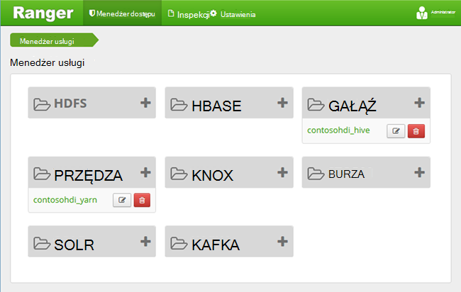
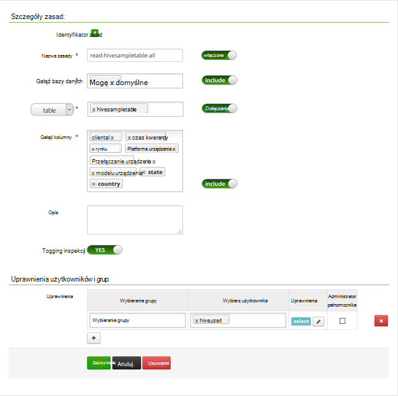

<properties
    pageTitle="Konfigurowanie zasad gałęzi w domeny HDInsight | Microsoft Azure"
    description="Więcej informacji..."
    services="hdinsight"
    documentationCenter=""
    authors="saurinsh"
    manager="jhubbard"
    editor="cgronlun"
    tags="azure-portal"/>

<tags
    ms.service="hdinsight"
    ms.devlang="na"
    ms.topic="hero-article"
    ms.tgt_pltfrm="na"
    ms.workload="big-data"
    ms.date="10/25/2016"
    ms.author="saurinsh"/>

# Konfigurowanie zasad gałęzi w domeny HDInsight (wersja Preview)

Dowiedz się, jak skonfigurować zasady zakres Apache gałęzi. W tym artykule możesz utworzyć dwie zasady zakres ograniczenia dostępu do hivesampletable. Hivesampletable oferowanych klastrów HDInsight. Po skonfigurowaniu zasad używasz sterownika programu Excel i ODBC do łączenia z tabelami gałęzi w HDInsight.

## Wymagania wstępne

- Klaster HDInsight domeny. Zobacz [Konfigurowanie domeny HDInsight klastrów](hdinsight-domain-joined-configure.md).
- Pracy z pakietem Office 2016, Office 2013 Professional Plus, Office 365 Pro Plus, Wersja autonomiczna programu Excel 2013 lub Office 2010 Professional Plus.

## Nawiązywanie połączenia z interfejsu użytkownika administratora zakres Apache

**Aby nawiązać połączenie interfejsu użytkownika administratora zakres**

1. Za pomocą przeglądarki nawiązywanie połączenia z interfejsu użytkownika administratora zakres. Adres URL jest https://&lt;NazwaKlastra >.azurehdinsight.net/Ranger/. 

    >[AZURE.NOTE] Zakres korzysta z innych poświadczeń niż klaster Hadoop. Aby zapobiec przy użyciu poświadczeń Hadoop pamięci podręcznej przeglądarki, użyj nowego okna przeglądarki inprivate nawiązywania połączenia z interfejsu użytkownika administratora zakres.
4. Zaloguj się przy użyciu nazwy użytkownika domeny administratora klaster i hasła:

    

    Obecnie zakres działa wyłącznie z przędzy i gałęzi.

## Tworzenie użytkowników domeny

W [klastrów konfigurowanie domeny HDInsight](hdinsight-domain-joined-configure.md#create-and-configure-azure-ad-ds-for-your-azure-ad)został utworzony hiveruser1 i hiveuser2. Konto użytkownika dwóch użyje w tym samouczku.

## Tworzenie zasad zakres

W tej sekcji możesz utworzyć dwie zasady zakres dostępu do hivesampletable. Możesz zmienić uprawnienia select na inny zestaw kolumn. Użytkownicy utworzono w [klastrów HDInsight konfigurowanie domeny](hdinsight-domain-joined-configure.md#create-and-configure-azure-ad-ds-for-your-azure-ad).  W następnej sekcji spowoduje przetestowanie dwie zasady w programie Excel.

**Aby utworzyć zasady zakres**

1. Otwórz interfejsu użytkownika administratora zakres. Zobacz [Nawiązywanie połączenia z interfejsu użytkownika administratora zakres Apache](#connect-to-apache-ranager-admin-ui).
2. Kliknij pozycję ** &lt;NazwaKlastra > _hive**, w obszarze **gałęzi**. Dwa wstępnie skonfigurować zasady jest widoczny.
3. Kliknij pozycję **Dodaj nową zasadę**, a następnie wprowadź następujące wartości:

    - Nazwa zasady: odczytu hivesampletable-all
    - Gałąź bazy danych: domyślne
    - Tabela: hivesampletable
    - Gałąź kolumny: *
    - Wybierz użytkownika: hiveuser1
    - Uprawnienia: wybierz pozycję

    .

    >[AZURE.NOTE] Jeśli użytkownik domeny nie została wpisana w polu Wybierz użytkownika, poczekaj chwilę zakres w celu synchronizowania z AAD.

4. Kliknij przycisk **Dodaj** , aby zapisać zasady.
5. Powtórz ostatnie dwa kroki, aby utworzyć inne zasady o następujących właściwościach:

    - Nazwa zasady: odczytu hivesampletable-devicemake
    - Gałąź bazy danych: domyślne
    - Tabela: hivesampletable
    - Gałąź kolumny: clientid, devicemake
    - Wybierz użytkownika: hiveuser2
    - Uprawnienia: wybierz pozycję

## Utwórz źródło danych ODBC gałęzi

Instrukcje można znaleźć w [źródle danych ODBC Tworzenie gałęzi](hdinsight-connect-excel-hive-odbc-driver.md).  

    Właściwość|Opis
    ---|---
    Nazwa źródła danych|Nadaj nazwę ze źródłem danych
    Hosta|Wprowadź &lt;HDInsightClusterName >. azurehdinsight.net. Na przykład myHDICluster.azurehdinsight.net
    Port|Za pomocą <strong>443</strong>. (Ten port zmieniła się 563 do 443.)
    Bazy danych|Za pomocą <strong>domyślne</strong>.
    Typ serwera gałęzi|Wybierz pozycję <strong>gałęzi serwera 2</strong>
    Mechanizm|Wybierz pozycję <strong>Usługa Azure HDInsight</strong>
    Ścieżka HTTP|Pozostaw to pole puste.
    Nazwa użytkownika|Wprowadź hiveuser1@contoso158.onmicrosoft.com. Aktualizowanie nazwy domeny, jest inny.
    Hasło|Wprowadź hasło dla hiveuser1.
    </table>

Koniecznie kliknij przycisk **Testuj** przed zapisaniem źródła danych.

##Importowanie danych do programu Excel z usługi HDInsight

W sekcji ostatniej skonfigurowano dwie zasady.  hiveuser1 ma uprawnienia select na wszystkie kolumny i hiveuser2 ma uprawnienia select na dwie kolumny. W tej sekcji dokonać personifikacji dwóch użytkowników, aby zaimportować dane do programu Excel.

1. Otwieranie nowego lub istniejącego skoroszytu w programie Excel.
2. Na karcie **dane** kliknij pozycję **Z innych źródeł danych**, a następnie kliknij pozycję **Z Kreatora połączenia danych** , aby uruchomić **Kreatora połączenia danych**.

    ! [Kreatora połączenia danych otwartych] [img-hdi-simbahiveodbc.excel.dataconnection]

3. Zaznacz **ODBC DSN** jako źródła danych, a następnie kliknij przycisk **Dalej**.
4. Ze źródeł danych ODBC wybierz nazwę źródła danych, który został utworzony w poprzednim kroku, a następnie kliknij przycisk **Dalej**.
5. Wprowadź ponownie hasło dla klastrów w kreatorze, a następnie kliknij **przycisk OK**. Poczekaj, aż okno dialogowe **Wybieranie bazy danych i tabeli** otworzyć. To może potrwać kilka sekund.
8. Zaznacz **hivesampletable**, a następnie kliknij przycisk **Dalej**. 
8. Kliknij przycisk **Zakończ**.
9. W oknie dialogowym **Importowanie danych** można zmienić lub określić kwerendę. Aby to zrobić, kliknij pozycję **Właściwości**. To może potrwać kilka sekund. 
10. Kliknij kartę **Definicja** . Tekst polecenia jest:

        SELECT * FROM "HIVE"."default"."hivesampletable"

    Według zdefiniowanych zasad zakres hiveuser1 ma uprawnienia select na wszystkich kolumn.  Dlatego ta kwerenda działa przy użyciu poświadczeń hiveuser1 w, ale ta kwerenda nie działa nie przy użyciu poświadczeń hiveuser2 osoby.

    ! [Właściwości połączenia] [img-hdi-simbahiveodbc-programu excel — connectionproperties]

11. Kliknij **przycisk OK** , aby zamknąć okno dialogowe właściwości połączenia.
12. Kliknij **przycisk OK** , aby zamknąć okno dialogowe **Importowanie danych** .  
13. Wprowadź ponownie hasło dla hiveuser1, a następnie kliknij **przycisk OK**. Wystarczy kilka sekund przed otrzymuje importowane dane do programu Excel. Po zakończeniu, są Zobacz 11 kolumny danych.

Aby przetestować drugiego zasad (odczytu hivesampletable-devicemake) utworzone w ostatniej sekcji

1. Dodawanie nowego arkusza w programie Excel.
2. Wykonaj ostatniej czynności, aby zaimportować dane.  Zostaną wprowadzone zmiany tylko jest użycie poświadczeń i hiveuser2 zamiast hiveuser1 osoby. Nie będzie hiveuser2 tylko ma uprawnienia do wyświetlania dwóch kolumn. Zostaje wyświetlony następujący komunikat o błędzie:

        [Microsoft][HiveODBC] (35) Error from Hive: error code: '40000' error message: 'Error while compiling statement: FAILED: HiveAccessControlException Permission denied: user [hiveuser2] does not have [SELECT] privilege on [default/hivesampletable/clientid,country ...]'.

3. Wykonaj tę samą procedurę, aby zaimportować dane. Tym razem Użyj poświadczeń hiveuser2 osoby, a także modyfikować instrukcji select z:

        SELECT * FROM "HIVE"."default"."hivesampletable"

    Aby:

        SELECT clientid, devicemake FROM "HIVE"."default"."hivesampletable"

    Po zakończeniu, są Zobacz dwóch kolumnach importowanych danych.

## Następne kroki

- Do konfigurowania klastrze domeny usługi HDInsight, zobacz [Konfigurowanie domeny HDInsight klastrów](hdinsight-domain-joined-configure.md).
- Do zarządzania klastrów domeny usługi HDInsight, zobacz [Zarządzanie domeny HDInsight klastrów](hdinsight-domain-joined-manage.md).
- Na wykonywanie zapytań gałęzi przy użyciu SSH na klastrów domeny usługi HDInsight, zobacz [Używanie SSH z systemem Linux Hadoop na HDInsight z Linux, Unix lub OS X](hdinsight-hadoop-linux-use-ssh-unix.md#connect-to-a-domain-joined-hdinsight-cluster).
- Aby łączenie gałęzi przy użyciu JDBC gałęzi zobacz [Łączenie się gałęzi na HDInsight Azure za pomocą sterownika gałęzi JDBC](hdinsight-connect-hive-jdbc-driver.md)
- Hadoop przy użyciu gałęzi ODBC nawiązywania połączenia programu Excel, zobacz [Nawiązywanie połączenia w programie Excel Hadoop z dyskiem ODBC gałęzi firmy Microsoft](hdinsight-connect-excel-hive-odbc-driver.md)
- Nawiązywania połączenia programu Excel Hadoop przy użyciu dodatku Power Query, zobacz [Nawiązywanie połączenia w programie Excel Hadoop przy użyciu dodatku Power Query](hdinsight-connect-excel-power-query.md)