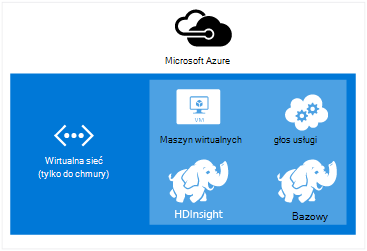
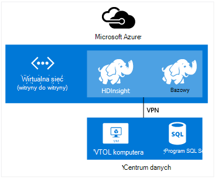

<properties
    pageTitle="Rozszerzanie HDInsight z wirtualną sieć | Microsoft Azure"  
    description="Dowiedz się, jak Azure wirtualną sieć nawiązywania połączenia za pomocą usługi HDInsight do innych zasobów w chmurze lub zasobów w centrum danych"
    services="hdinsight"
    documentationCenter=""
    authors="Blackmist"
    manager="jhubbard"
    editor="cgronlun"/>

<tags
   ms.service="hdinsight"
   ms.devlang="na"
   ms.topic="article"
   ms.tgt_pltfrm="na"
   ms.workload="big-data"
   ms.date="10/21/2016"
   ms.author="larryfr"/>


#<a name="extend-hdinsight-capabilities-by-using-azure-virtual-network"></a>Rozszerzanie możliwości HDInsight przy użyciu wirtualnej sieci Azure

Azure wirtualną sieć pozwala na rozszerzenie rozwiązanie Hadoop uwzględniać zasobów lokalnych, takich jak program SQL Server, łączenie wielu typów klaster HDInsight lub utworzyć bezpiecznego sieci prywatnych między zasobami w chmurze.

[AZURE.INCLUDE [upgrade-powershell](../../includes/hdinsight-use-latest-powershell-and-cli.md)]


##<a id="whatis"></a>Co to jest Azure wirtualnej sieci?

[Wirtualna sieć Azure](https://azure.microsoft.com/documentation/services/virtual-network/) umożliwia tworzenie bezpieczne, trwałych sieci zawierający zasoby, których potrzebujesz dla tego rozwiązania. Wirtualna sieć umożliwia:

* Łączenie zasobów chmury razem w sieci prywatnej (tylko do chmury).

    

    Łącze usługi Azure z usługi HDInsight Azure za pomocą wirtualnej sieci udostępnia następujące scenariusze:

    * **Wywoływanie HDInsight usług lub zadań** z witryny sieci Web Azure lub services działający w środowisku maszyn wirtualnych Azure.

    * **Bezpośrednio przesyłania danych** między HDInsight i bazy danych SQL Azure, SQL Server lub innego rozwiązania magazynowania danych uruchomione na komputerze wirtualnych.

    * **Łączenie wielu serwerów usługi HDInsight** w obrębie pojedynczego rozwiązania. Usługa HDInsight klastrów są dostępne w różnych typów, które odpowiadają obciążenie pracą lub technologii, którą klaster jest dostosowanych do. Istnieje obsługiwana metoda aby utworzyć klaster, który łączy wiele typów, takie jak Burza i HBase na jeden klaster. Za pomocą wirtualnej sieci umożliwia wielu klastrów bezpośrednie komunikowanie się ze sobą.

* Łączenie zasobów chmury do swojej sieci lokalnej centrum danych (witryny do witryny lub punkt do witryny) za pomocą wirtualną sieć prywatną (VPN).

    Konfiguracja witryny do witryny można nawiązać połączenia wielu zasobów z centrum danych Azure wirtualnej sieci przy użyciu sprzętu sieci VPN lub usługi Routing i dostęp zdalny.

    

    Konfiguracja punktu do witryny można nawiązać określonego zasobu Azure wirtualną sieć za pomocą oprogramowania sieci VPN.

    

    Łączenie chmury i centrum danych za pomocą wirtualnej sieci umożliwia podobne scenariusze konfiguracji tylko do chmury. Ale w przeciwieństwie do pracy z zasobami w chmurze, możesz również we współpracy z zasobami w centrum danych.

    * **Bezpośrednio przesyłania danych** między HDInsight i centrum danych. Przykład używa Sqoop do przesyłania danych do lub z programu SQL Server lub odczytu danych wygenerowane przez aplikację z LOB (LOB).

    * **Wywoływanie usługi HDInsight usług lub zadań** z aplikacji LOB. Przykład używa interfejsów API języka Java HBase do przechowywania i pobierania danych z klaster HDInsight HBase.

Aby uzyskać więcej informacji o funkcjach, zalety i funkcje wirtualnej sieci zobacz [Omówienie Azure wirtualnej sieci](../virtual-network/virtual-networks-overview.md).

> [AZURE.NOTE] Musisz utworzyć wirtualną sieć Azure przed inicjowania obsługi administracyjnej klaster HDInsight. Aby uzyskać więcej informacji zobacz [zadania konfiguracji wirtualnej sieci](https://azure.microsoft.com/documentation/services/virtual-network/).

## <a name="virtual-network-requirements"></a>Wirtualna wymagań dotyczących sieci.

> [AZURE.IMPORTANT] Tworzenie klaster HDInsight w wirtualnej sieci wymaga określonych konfiguracji wirtualną sieć opisanych w tej sekcji.

###<a name="location-based-virtual-networks"></a>Sieci wirtualnej lokalizacji

Usługa Azure HDInsight obsługuje tylko opartych na lokalizacji wirtualnych sieci i obecnie nie współpracuje z wirtualnych sieci na podstawie grupy koligacji.

###<a name="classic-or-v2-virtual-network"></a>Klasyczny lub w wersji 2 wirtualnej sieci

Klastrów opartych na systemie Windows wymagają klasyczny wirtualnej sieci, natomiast systemem Linux klastrów wymagają Azure Menedżera zasobów wirtualnej sieci. Jeśli nie masz poprawnych typów sieci, nie będzie można używać podczas tworzenia klaster.

Jeśli masz zasobów w wirtualnej sieci, który nie jest używany przez klaster, które planujesz tworzenie tworzenie nowych wirtualnej sieci, który jest używany przez klaster, a nawiązać niezgodny wirtualnej sieci. Następnie można utworzyć klaster w wersji sieci, który jest wymagany, i będzie mógł uzyskiwać dostęp do zasobów w innych sieciach od dwóch są połączone. Uzyskać więcej informacji dotyczących łączenia i nowych wirtualnych sieci zobacz [Łączenie klasyczny VNets do nowych VNets](../vpn-gateway/vpn-gateway-connect-different-deployment-models-portal.md).

###<a name="custom-dns"></a>Niestandardowy DNS

Podczas tworzenia wirtualnej sieci, Azure udostępnia rozpoznawanie nazw domyślnych dla Azure usług, takich jak usługi HDInsight, które są zainstalowane w sieci. Jednak może być konieczne w sytuacjach, takich jak krzyżowe rozpoznawanie nazw domen sieci za pomocą własnego systemu nazw domen (DNS). Na przykład, kiedy komunikacji między usługami znajduje się w dwóch sprzężone wirtualnych sieci. Usługa HDInsight obsługuje zarówno rozpoznawanie nazw Azure domyślne jak i niestandardowe DNS po połączeniu Azure wirtualną sieć.

Aby uzyskać więcej informacji na temat korzystania z serwera DNS z Azure wirtualną sieć Zobacz sekcję __Rozpoznawanie nazw przy użyciu serwera DNS__ dokumentu [Rozpoznawanie nazw maszyny wirtualne i wystąpień roli](../virtual-network/virtual-networks-name-resolution-for-vms-and-role-instances.md#name-resolution-using-your-own-dns-server) .

###<a name="secured-virtual-networks"></a>Zabezpieczone wirtualnych sieci

Usługa HDInsight zarządzanych usług i wymaga dostępu do Internetu podczas inicjowania obsługi administracyjnej i uruchomionej. To jest więc tego Azure można monitorować kondycję klaster, inicjowanie awaryjnego przeniesienia zasoby klastrów, zmienianie liczby węzłów w klastrze za pośrednictwem operacji skalowania oraz innych zadań zarządzania.

Jeśli musisz zainstalować HDInsight do zabezpieczonego wirtualnej sieci przychodzącego programu access należy zezwolić na na porcie 443 dla następujących adresów IP, umożliwiające Azure do zarządzania klastrem HDInsight.

* 168.61.49.99
* 23.99.5.239
* 168.61.48.131
* 138.91.141.162

Zezwolenia na dostęp ruchu przychodzącego na porcie 443 dla tych adresów pozwoli pomyślnie zainstalować HDInsight do zabezpieczonego wirtualnej sieci.

> [AZURE.IMPORTANT] Usługa HDInsight nie obsługuje Ograniczanie ruchu wychodzącego tylko ruchu przychodzącego. Podczas definiowania zasady grupy zabezpieczeń sieci podsieci, która zawiera HDInsight, tylko za pomocą reguły przychodzące.

W poniższych przykładach pokazano, jak utworzyć nową grupę zabezpieczeń sieci umożliwia wymagane adresów, która dotyczy podsieci wirtualnej sieci grupy zabezpieczeń. W tej procedurze założono, że zostały już utworzone wirtualnej sieci i podsieci, które chcesz zainstalować HDInsight do.

__Przy użyciu programu PowerShell Azure__

    $vnetName = "Replace with your virtual network name"
    $resourceGroupName = "Replace with the resource group the virtual network is in"
    $subnetName = "Replace with the name of the subnet that HDInsight will be installed into"
    # Get the Virtual Network object
    $vnet = Get-AzureRmVirtualNetwork `
        -Name $vnetName `
        -ResourceGroupName $resourceGroupName
    # Get the region the Virtual network is in.
    $location = $vnet.Location
    # Get the subnet object
    $subnet = $vnet.Subnets | Where-Object Name -eq $subnetName
    # Create a new Network Security Group.
    # And add exemptions for the HDInsight health and management services.
    $nsg = New-AzureRmNetworkSecurityGroup `
        -Name "hdisecure" `
        -ResourceGroupName $resourceGroupName `
        -Location $location `
        | Add-AzureRmNetworkSecurityRuleConfig `
            -name "hdirule1" `
            -Description "HDI health and management address 168.61.49.99" `
            -Protocol "*" `
            -SourcePortRange "*" `
            -DestinationPortRange "443" `
            -SourceAddressPrefix "168.61.49.99" `
            -DestinationAddressPrefix "VirtualNetwork" `
            -Access Allow `
            -Priority 300 `
            -Direction Inbound `
        | Add-AzureRmNetworkSecurityRuleConfig `
            -Name "hdirule2" `
            -Description "HDI health and management 23.99.5.239" `
            -Protocol "*" `
            -SourcePortRange "*" `
            -DestinationPortRange "443" `
            -SourceAddressPrefix "23.99.5.239" `
            -DestinationAddressPrefix "VirtualNetwork" `
            -Access Allow `
            -Priority 301 `
            -Direction Inbound `
        | Add-AzureRmNetworkSecurityRuleConfig `
            -Name "hdirule3" `
            -Description "HDI health and management 168.61.48.131" `
            -Protocol "*" `
            -SourcePortRange "*" `
            -DestinationPortRange "443" `
            -SourceAddressPrefix "168.61.48.131" `
            -DestinationAddressPrefix "VirtualNetwork" `
            -Access Allow `
            -Priority 302 `
            -Direction Inbound `
        | Add-AzureRmNetworkSecurityRuleConfig `
            -Name "hdirule4" `
            -Description "HDI health and management 138.91.141.162" `
            -Protocol "*" `
            -SourcePortRange "*" `
            -DestinationPortRange "443" `
            -SourceAddressPrefix "138.91.141.162" `
            -DestinationAddressPrefix "VirtualNetwork" `
            -Access Allow `
            -Priority 303 `
            -Direction Inbound
    # Set the changes to the security group
    Set-AzureRmNetworkSecurityGroup -NetworkSecurityGroup $nsg
    # Apply the NSG to the subnet
    Set-AzureRmVirtualNetworkSubnetConfig `
        -VirtualNetwork $vnet `
        -Name $subnetName `
        -AddressPrefix $subnet.AddressPrefix `
        -NetworkSecurityGroupId $nsg

__Za pomocą polecenie Azure__

1. Użyj następującego polecenia, aby utworzyć nową grupę zabezpieczeń sieci o nazwie `hdisecure`. Grupa zasobów, zawierający wirtualną sieć Azure i lokalizacji (region), grupa została utworzona w Zamień __RESOURCEGROUPNAME__ i __lokalizacji__ .

        azure network nsg create RESOURCEGROUPNAME hdisecure LOCATION
    
    Po utworzeniu grupy otrzymasz informacji na temat nowej grupy. Odszukaj wiersz podobny do następującego i zapisywanie `/subscriptions/GUID/resourceGroups/RESOURCEGROUPNAME/providers/Microsoft.Network/networkSecurityGroups/hdisecure` informacji. Będzie można używać w późniejszym etapie.
    
        data:    Id                              : /subscriptions/GUID/resourceGroups/RESOURCEGROUPNAME/providers/Microsoft.Network/networkSecurityGroups/hdisecure

2. Dodawanie reguły do nowej grupy zabezpieczeń sieci zezwolić na komunikację ruchu przychodzącego na porcie 443 z usługi Azure HDInsight zdrowia i zarządzania za pomocą następujących czynności. Zamień __RESOURCEGROUPNAME__ nazwę grupy zasobów, zawierający wirtualną sieć Azure.

        azure network nsg rule create RESOURCEGROUPNAME hdisecure hdirule1 -p "*" -o "*" -u "443" -f "168.61.49.99" -e "VirtualNetwork" -c "Allow" -y 300 -r "Inbound"
        azure network nsg rule create RESOURCEGROUPNAME hdisecure hdirule2 -p "*" -o "*" -u "443" -f "23.99.5.239" -e "VirtualNetwork" -c "Allow" -y 301 -r "Inbound"
        azure network nsg rule create RESOURCEGROUPNAME hdisecure hdirule3 -p "*" -o "*" -u "443" -f "168.61.48.131" -e "VirtualNetwork" -c "Allow" -y 302 -r "Inbound"
        azure network nsg rule create RESOURCEGROUPNAME hdisecure hdirule4 -p "*" -o "*" -u "443" -f "138.91.141.162" -e "VirtualNetwork" -c "Allow" -y 303 -r "Inbound"

3. Po utworzeniu reguły dotyczą nowej grupy zabezpieczeń sieci podsieci należy wykonać następujące kroki. Zamień __RESOURCEGROUPNAME__ nazwę grupy zasobów, zawierający wirtualną sieć Azure. Zamień nazwę Azure wirtualnej sieci i podsieci, która ma być używany podczas instalowania usługi HDInsight __VNETNAME__ i __SUBNETNAME__ .

        azure network vnet subnet set RESOURCEGROUPNAME VNETNAME SUBNETNAME -w "/subscriptions/GUID/resourceGroups/RESOURCEGROUPNAME/providers/Microsoft.Network/networkSecurityGroups/hdisecure"
    
    Po wykonaniu tego polecenia możesz pomyślnie zainstalować HDInsight do zabezpieczonego wirtualną sieć podsieci używane w tych krokach.

> [AZURE.IMPORTANT] Za pomocą powyższych czynności dostęp tylko otwarte z usługą HDInsight zdrowia i zarządzania w chmurze Azure. Dzięki temu można pomyślnie zainstalować klaster HDInsight do podsieci, jednak dostęp do klastrów HDInsight z zewnątrz wirtualnej sieci jest domyślnie zablokowana. Musisz dodać dodatkowe zasady grupy zabezpieczeń sieci, jeśli chcesz umożliwić dostęp z zewnątrz wirtualnej sieci.
>
> Na przykład aby umożliwić dostęp SSH z Internetu, należy dodać regułę podobny do następującego: 
>
> * Azure PowerShell —```Add-AzureRmNetworkSecurityRuleConfig -Name "SSSH" -Description "SSH" -Protocol "*" -SourcePortRange "*" -DestinationPortRange "22" -SourceAddressPrefix "*" -DestinationAddressPrefix "VirtualNetwork" -Access Allow -Priority 304 -Direction Inbound```
> * Polecenie Azure-```azure network nsg rule create RESOURCEGROUPNAME hdisecure hdirule4 -p "*" -o "*" -u "22" -f "*" -e "VirtualNetwork" -c "Allow" -y 304 -r "Inbound"```

Aby uzyskać więcej informacji dotyczących grup zabezpieczeń sieci zobacz [Omówienie grup zabezpieczeń sieci](../virtual-network/virtual-networks-nsg.md). Uzyskać na kontrolowanie routingu w wirtualnej sieci Azure zobacz [przekazywanie trasy zdefiniowane przez użytkownika i adresów IP](../virtual-network/virtual-networks-udr-overview.md).

##<a id="tasks"></a>Zadania i informacje

Ta sekcja zawiera informacje o typowe zadania i informacje, które może być konieczne podczas korzystania z usługi HDInsight z wirtualnej sieci.

###<a name="determine-the-fqdn"></a>Określanie nazwy FQDN

Klaster HDInsight są przypisywane określone w pełni kwalifikowaną nazwę domeny (FQDN) interfejsu wirtualnej sieci. Jest to adres, który powinien być używany z klastrem łączą się z innymi zasobami w wirtualnej sieci. Aby określić Kwalifikowaną, należy wykonać następujące kroki do adresu URL kwerendy usługi zarządzania Ambari:

    https://<clustername>.azurehdinsight.net/ambari/api/v1/clusters/<clustername>.azurehdinsight.net/services/<servicename>/components/<componentname>

> [AZURE.NOTE] Aby uzyskać więcej informacji na temat korzystania z usługi HDInsight Ambari zobacz [Monitor Hadoop klastrów w HDInsight za pomocą interfejsu API Ambari](hdinsight-monitor-use-ambari-api.md).

Podaj nazwę klaster oraz usługi i uruchamiania w klastrze, takich jak Menedżer zasobów PRZĘDZY składnik.

> [AZURE.NOTE] Zwrócone dane jest dokument notacji obiektu JavaScript (JSON), który zawiera wiele informacji o składniku. Aby wyodrębnić tylko nazwy FQDN, możesz użyć parsera JSON w celu pobrania `host_components[0].HostRoles.host_name` wartość.

Na przykład zwrócić Kwalifikowaną klaster HDInsight Hadoop, umożliwiają jedną z następujących metod do pobierania danych dla Menedżera zasobów PRZĘDZY:

* [Azure programu PowerShell](../powershell-install-configure.md)

        $ClusterDnsName = <clustername>
        $Username = <cluster admin username>
        $Password = <cluster admin password>
        $DnsSuffix = ".azurehdinsight.net"
        $ClusterFQDN = $ClusterDnsName + $DnsSuffix

        $webclient = new-object System.Net.WebClient
        $webclient.Credentials = new-object System.Net.NetworkCredential($Username, $Password)

        $Url = "https://" + $ClusterFQDN + "/ambari/api/v1/clusters/" + $ClusterFQDN + "/services/yarn/     components/resourcemanager"
        $Response = $webclient.DownloadString($Url)
        $JsonObject = $Response | ConvertFrom-Json
        $FQDN = $JsonObject.host_components[0].HostRoles.host_name
        Write-host $FQDN

* [zawinięcie](http://curl.haxx.se/) i [jq](http://stedolan.github.io/jq/)

        curl -G -u <username>:<password> https://<clustername>.azurehdinsight.net/ambari/api/v1/clusters/<clustername>.azurehdinsight.net/services/yarn/components/resourcemanager | jq .host_components[0].HostRoles.host_name

###<a name="connecting-to-hbase"></a>Nawiązywanie połączenia z HBase

Aby nawiązać połączenie HBase zdalnie za pomocą interfejsu API języka Java, możesz określić adresy ZooKeeper kworum dla klastrów HBase i określ to w aplikacji.

Aby uzyskać ZooKeeper adres kworum, użyj jednej z następujących metod do kwerendy usługi zarządzania Ambari:

* [Azure programu PowerShell](../powershell-install-configure.md)

        $ClusterDnsName = <clustername>
        $Username = <cluster admin username>
        $Password = <cluster admin password>
        $DnsSuffix = ".azurehdinsight.net"
        $ClusterFQDN = $ClusterDnsName + $DnsSuffix

        $webclient = new-object System.Net.WebClient
        $webclient.Credentials = new-object System.Net.NetworkCredential($Username, $Password)

        $Url = "https://" + $ClusterFQDN + "/ambari/api/v1/clusters/" + $ClusterFQDN + "/configurations?type=hbase-site&tag=default&fields=items/properties/hbase.zookeeper.quorum"
        $Response = $webclient.DownloadString($Url)
        $JsonObject = $Response | ConvertFrom-Json
        Write-host $JsonObject.items[0].properties.'hbase.zookeeper.quorum'

* [zawinięcie](http://curl.haxx.se/) i [jq](http://stedolan.github.io/jq/)

        curl -G -u <username>:<password> "https://<clustername>.azurehdinsight.net/ambari/api/v1/clusters/<clustername>.azurehdinsight.net/configurations?type=hbase-site&tag=default&fields=items/properties/hbase.zookeeper.quorum" | jq .items[0].properties[]

> [AZURE.NOTE] Aby uzyskać więcej informacji na temat korzystania z usługi HDInsight Ambari zobacz [Monitor Hadoop klastrów w HDInsight za pomocą interfejsu API Ambari](hdinsight-monitor-use-ambari-api.md).

Po umieszczeniu danych kworum, można go używać w aplikacji klienta.

Na przykład dla aplikacji Java, która korzysta z interfejsu API HBase, czy dodać plik **hbase site.xml** do projektu i określ informacje kworum w pliku w następujący sposób:

```
<configuration>
  <property>
    <name>hbase.cluster.distributed</name>
    <value>true</value>
  </property>
  <property>
    <name>hbase.zookeeper.quorum</name>
    <value>zookeeper0.address,zookeeper1.address,zookeeper2.address</value>
  </property>
  <property>
    <name>hbase.zookeeper.property.clientPort</name>
    <value>2181</value>
  </property>
</configuration>
```

###<a name="verify-network-connectivity"></a>Sprawdź połączenie sieciowe

Niektóre usługi, na przykład programu SQL Server, można ograniczyć połączenia przychodzące. Uniemożliwi HDInsight pomyślnie pracę z tymi usługami.

Jeśli występują problemy z dostępem do usługi z usługi HDInsight, zapoznaj się z dokumentacją usługi upewnić się, że masz włączony dostęp do sieci. Można również sprawdzać dostęp do sieci, tworząc Azure maszyn wirtualnych w tej samej sieci wirtualnych i sprawdzanie, czy maszyny wirtualnej można połączyć się z usługą za pośrednictwem wirtualnych sieci za pomocą narzędzi klienta.

##<a id="nextsteps"></a>Następne kroki

W poniższych przykładach pokazano, jak używać HDInsight z wirtualną sieć Azure:

* [Analizowanie danych czujnika przy użyciu Burza i HBase w HDInsight](hdinsight-storm-sensor-data-analysis.md) — pokazano, jak skonfigurować klaster Burza i HBase w wirtualnej sieci, a także jak zdalnie zapisanie danych HBase Burza.

* [Klaster Hadoop świadczenia w HDInsight](hdinsight-hadoop-provision-linux-clusters.md) - zawiera informacje dotyczące obsługi administracyjnej klastrów Hadoop, łącznie z informacjami na temat korzystania z platformy Azure wirtualnej sieci.

* [Używanie Sqoop z Hadoop w HDInsight](hdinsight-use-sqoop-mac-linux.md) — informacje na temat korzystania z Sqoop do przesyłania danych z programem SQL Server za pośrednictwem wirtualnych sieci.

Aby dowiedzieć się więcej na temat Azure wirtualnych sieci, zobacz [Omówienie Azure wirtualnej sieci](../virtual-network/virtual-networks-overview.md).
