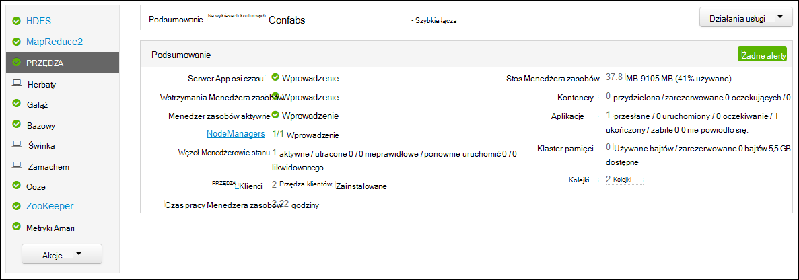
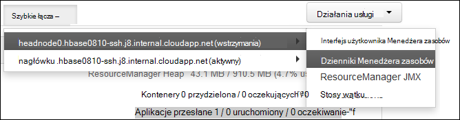

<properties
    pageTitle="Dzienniki aplikacji PRZĘDZY Hadoop programu Access na podstawie Linux HDInsight | Microsoft Azure"
    description="Dowiedz się, jak uzyskać dostęp do PRZĘDZY Dzienniki aplikacji w klastrze systemem Linux HDInsight (Hadoop) za pomocą wiersza polecenia i przeglądarki sieci web."
    services="hdinsight"
    documentationCenter=""
    tags="azure-portal"
    authors="Blackmist" 
    manager="jhubbard"
    editor="cgronlun"/>

<tags
    ms.service="hdinsight"
    ms.workload="big-data"
    ms.tgt_pltfrm="na"
    ms.devlang="na"
    ms.topic="article"
    ms.date="10/21/2016"
    ms.author="larryfr"/>

# Dzienniki aplikacji PRZĘDZY programu Access na podstawie Linux HDInsight 

Ten dokument wyjaśniono, jak uzyskać dostęp do dzienników dla aplikacji PRZĘDZY (jeszcze innego zasobu negocjator), które zostało zakończone w klastrze Hadoop w Azure HDInsight.

> [AZURE.NOTE] Informacje w tym dokumencie są specyficzne dla klastrów HDInsight systemem Linux. Aby uzyskać informacje dotyczące klastrów opartych na systemie Windows zobacz [aplikacji programu Access PRZĘDZY logowania HDInsight systemu Windows](hdinsight-hadoop-access-yarn-app-logs.md)

## Wymagania wstępne

* Klaster HDInsight systemem Linux.

* Należy [utworzyć tunelem SSH](hdinsight-linux-ambari-ssh-tunnel.md) , aby umożliwić dostęp do sieci web dzienniki ResourceManager interfejsu użytkownika.

## Przędza osi czasu serwera

[Przędza osi czasu serwera](http://hadoop.apache.org/docs/r2.4.0/hadoop-yarn/hadoop-yarn-site/TimelineServer.html) zawiera ogólne informacje o złożonym aplikacji, a także informacje o aplikacji framework określonych przez dwa różne interfejsy. W szczególności:

* Przechowywania i udostępniania aplikacji ogólnej informacji dotyczących klastrów HDInsight został włączony przy użyciu wersji 3.1.1.374 lub nowszej.
* Składnik informacji framework identyfikator aplikacji serwera osi czasu nie jest obecnie dostępny na klastrów HDInsight.

Ogólne informacje dotyczące aplikacji zawiera następujące rodzaje danych:

* Identyfikator aplikacji Unikatowy identyfikator aplikacji
* Użytkownik, który uruchomił aplikację
* Informacje o prób dla zakończenia aplikacji
* Kontenery używane przez każda próba danej aplikacji

## Dzienniki aplikacji PRZĘDZY i

Przędza obsługuje wiele modeli programowania (jeden z nich jest MapReduce) rozdzielenie zarządzania zasobami z planowania i monitorowania aplikacji. Można to zrobić przy użyciu globalnej *ResourceManager* (MB), na Pracownik węzła *NodeManagers* (NMs) i każdej aplikacji *ApplicationMasters* (AMs). Do Południa każdej aplikacji negocjuje zasobów (Procesora, pamięci, dysku, sieci) do uruchamiania aplikacji przy użyciu Menedżera zasobów. Menedżer zasobów działa z NMs udzielenia te zasoby, które zostają jako *kontenery*. Do Południa jest odpowiedzialny za śledzenia postępu kontenerów do niego przypisana przez Menedżera zasobów. Aplikacja może wymagać liczby kontenerów w zależności od rodzaju aplikacji.

Ponadto, każdą z nich może się składać z wielu *prób aplikacji* w celu zakończenia w obecności awarii lub ze względu na utratę komunikacji między AM i Menedżera zasobów. W związku z tym kontenerów są przypisywane do określonych próby aplikacji. W ujęciu kontenera zapewnia kontekst podstawowa jednostka pracy wykonanej przez aplikację PRZĘDZY, a wszystkie pracy, do której jest wykonywane w kontekście kontenera odbywa się w węźle pojedynczego pracownika, na którym przydzielono kontenerze. Zobacz [Pojęcia PRZĘDZY] [ YARN-concepts] dla dalszego odwołania.

Dzienniki aplikacji (oraz Dzienniki skojarzone kontenera) są kluczowe do rozwiązywania problemów aplikacji Hadoop. Przędza udostępnia i ramy zbierania, agregowanie i przechowywania Dzienniki aplikacji z [Dziennika agregacji] [ log-aggregation] funkcji. Funkcji agregacji dziennika służy do uzyskiwania dostępu do Dzienniki aplikacji więcej deterministyczne agreguje dzienniki przez wszystkich kontenerów w węźle pracownika i zapisuje je jako jeden zagregowane plik dziennika na węzeł pracownika w systemie plików domyślne po zakończeniu aplikacji. Aplikacja może używać setki lub tysiące kontenery, ale są zawsze agregowane dzienników dla wszystkich kontenerów uruchomiona w węźle pojedynczego pracownika do jednego pliku, uzyskując jeden plik dziennika na węzeł pracownik używane przez aplikację. Agregacji dziennika jest domyślnie włączona w klastrów HDInsight (w wersji 3.0 i powyżej), a zagregowane Dzienniki znajdują się w kontenerze domyślnym klaster w następującej lokalizacji:

    wasbs:///app-logs/<user>/logs/<applicationId>

W tej lokalizacji, *użytkownik* jest nazwą użytkownika, który uruchomił aplikację, a *Identyfikator aplikacji* jest unikatowy identyfikator aplikacji przydzielony przez PRZĘDZY Menedżera zasobów.

Zagregowane dzienniki nie są bezpośrednio czytelny, ponieważ są one zapisane w [TFile][T-file], [format binarny] [ binary-format] indeksowane przez kontener. Aby wyświetlić te dzienniki jako zwykły tekst dla aplikacji lub kontenery zainteresowania, należy użyć dzienniki ResourceManager PRZĘDZY lub interfejsu wiersza polecenia narzędzia. 

##Polecenie PRZĘDZY narzędzia

Aby można było korzystać z narzędzi polecenie PRZĘDZY, musisz najpierw połączyć z klastrem HDInsight przy użyciu SSH. Aby uzyskać informacje na temat korzystania z usługi HDInsight SSH, użyj jednej z następujących dokumentów:

- [Używanie SSH z systemem Linux Hadoop na HDInsight z Linux, Unix lub systemu OS X](hdinsight-hadoop-linux-use-ssh-unix.md)

- [Używanie SSH z systemem Linux Hadoop na HDInsight z systemu Windows](hdinsight-hadoop-linux-use-ssh-windows.md)
    
Można wyświetlić te dzienniki jako zwykły tekst, wykonując jedną z następujących poleceń:

    yarn logs -applicationId <applicationId> -appOwner <user-who-started-the-application>
    yarn logs -applicationId <applicationId> -appOwner <user-who-started-the-application> -containerId <containerId> -nodeAddress <worker-node-address>
    
Należy określić &lt;identyfikator aplikacji >, &lt;użytkownika kto — wprowadzenie — — aplikacji >, &lt;Identyfikator_kontenera >, a & ltworker węzeł adres > informacji podczas uruchamiania tych poleceń.

##Interfejs użytkownika ResourceManager PRZĘDZY

Interfejs użytkownika ResourceManager PRZĘDZY działa w systemach headnode klaster i można uzyskać do nich dostęp za pośrednictwem sieci web Ambari interfejsu użytkownika; jednak należy pierwszy [Tworzenie tunelem SSH](hdinsight-linux-ambari-ssh-tunnel.md) przed przejściem ResourceManager interfejsu użytkownika.

Po utworzeniu tunelem SSH, wykonaj następujące czynności, aby wyświetlić dzienniki PRZĘDZY:

1. W przeglądarce sieci web przejdź do https://CLUSTERNAME.azurehdinsight.net. Zamień NAZWAKLASTRA nazwę klaster HDInsight.

2. Na liście usług po lewej stronie wybierz __PRZĘDZY__.

    

3. Z menu rozwijanego __Szybkie łącza__ wybierz jedną z głowy węzłach, a następnie wybierz pozycję __Dziennika ResourceManager__.

    
    
    Zostanie wyświetlona z listą łączy do dzienników PRZĘDZY.

[YARN-timeline-server]:http://hadoop.apache.org/docs/r2.4.0/hadoop-yarn/hadoop-yarn-site/TimelineServer.html
[log-aggregation]:http://hortonworks.com/blog/simplifying-user-logs-management-and-access-in-yarn/
[T-file]:https://issues.apache.org/jira/secure/attachment/12396286/TFile%20Specification%2020081217.pdf
[binary-format]:https://issues.apache.org/jira/browse/HADOOP-3315
[YARN-concepts]:http://hortonworks.com/blog/apache-hadoop-yarn-concepts-and-applications/
