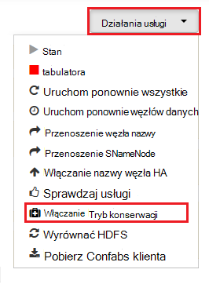

<properties
    pageTitle="Włączanie zrzuty stosu usługi Hadoop na HDInsight | Microsoft Azure"
    description="Włącz zrzuty stosu usługi Hadoop z systemem Linux HDInsight klastrów debugowania i analizy."
    services="hdinsight"
    documentationCenter=""
    authors="Blackmist"
    manager="jhubbard"
    editor="cgronlun"
    tags="azure-portal"/>

<tags
    ms.service="hdinsight"
    ms.workload="big-data"
    ms.tgt_pltfrm="na"
    ms.devlang="na"
    ms.topic="article"
    ms.date="09/27/2016"
    ms.author="larryfr"/>

#Włączanie zrzuty stosu usługi Hadoop na podstawie Linux HDInsight (wersja Preview)

[AZURE.INCLUDE [heapdump-selector](../../includes/hdinsight-selector-heap-dump.md)]

Zrzuty stosu zawierają migawki pamięci aplikacji, w tym wartości zmiennych w czasie utworzone zrzut. Tak, aby były bardzo przydatne w przypadku diagnozowanie problemów występujących w czasie wykonywania.

> [AZURE.NOTE] Informacje w tym artykule dotyczą tylko HDInsight systemem Linux. Aby uzyskać informacje dotyczące usługi HDInsight systemu Windows zobacz [Włączanie zrzuty stosu usługi Hadoop na HDInsight systemu Windows](hdinsight-hadoop-collect-debug-heap-dumps.md)

## Usług

Możesz włączyć zrzuty stosu dla następujących usług:

*  **hcatalog** - tempelton
*  **gałąź** - hiveserver2, metastore, derbyserver
*  **mapreduce** - jobhistoryserver
*  **przędza** - resourcemanager, nodemanager, timelineserver
*  **hdfs** - datanode, secondarynamenode, namenode

Można także włączyć zrzuty stosu mapy i zmniejszyć procesów uruchomiono przez HDInsight.

## Konfigurowanie zrzutu stosu opis

Zrzuty stosu są włączone przekazując opcje (nazywany jako zdecyduje, lub parametry) do maszyny wirtualnej Java podczas uruchamiania usługi. W przypadku większości usług Hadoop można to osiągnąć zmieniając skrypt powłoki używane do uruchamiania usługi.

W każdym polu skrypt jest Eksportuj do ** \* \_OPTS**, który zawiera opcje przekazywane do maszyny wirtualnej Java. Na przykład, w obszarze skrypt **hadoop env.sh** linię który zaczyna się od `export HADOOP_NAMENODE_OPTS=` zawiera opcje usługi NameNode.

Mapowanie i zmniejszyć procesów różnią się nieco, są one proces podrzędny usługi MapReduce. Każda mapa lub zredukowania proces jest uruchamiany w kontenerze i są wyświetlane dwie pozycje, zawierające opcje maszyny wirtualnej Java dla nich. Oba zawartych w **mapred site.xml**:

* **mapreduce.Admin.map.child.Java.opts**
* **mapreduce.Admin.Reduce.child.Java.opts**

> [AZURE.NOTE] Zalecamy modyfikowania za pomocą Ambari skrypty i ustawienia mapred site.xml jako Ambari obsługi replikacji zmian w węzłach w klastrze. Zobacz sekcję [Przy użyciu Ambari](#using-ambari) konkretne czynności.

###Włączanie zrzuty stosu

Następująca opcja pozwala zrzuty stosu, gdy występuje OutOfMemoryError:

    -XX:+HeapDumpOnOutOfMemoryError

**+** Wskazuje, że ta opcja jest włączona. Domyślnie jest wyłączona.

> [AZURE.WARNING] Zrzuty stosu nie są włączone usługi Hadoop na HDInsight domyślnie jako pliki zrzutu może być duży. Jeśli włączysz ich dotyczących rozwiązywania problemów, pamiętaj, aby je wyłączyć po problemu i zebrane pliki zrzutu.

###Lokalizacja zrzutu

Domyślna lokalizacja pliku zrzutu jest bieżącego katalogu roboczego. Możesz sterować w przypadku, gdy jest przechowywany plik, za pomocą następujących opcji:

    -XX:HeapDumpPath=/path

Na przykład za pomocą `-XX:HeapDumpPath=/tmp` spowoduje, że zrzuty mają być przechowywane w katalogu /tmp.

###Skryptów

Skrypt może także wyzwolić, gdy wystąpi **OutOfMemoryError** . Na przykład powodujące powiadomienie, dzięki czemu łatwo ustalisz, że wystąpił błąd. Można to kontrolować za pomocą następujących opcji:

    -XX:OnOutOfMemoryError=/path/to/script

> [AZURE.NOTE] Ponieważ Hadoop jest rozproszony system, dowolny skrypt używane musi znajdować się na wszystkich węzłach w klastrze uruchamianej na usługę.
>
> Skrypt należy również się w lokalizacji dostępnej przy użyciu konta usługi działa jako i podaj uprawnień wykonywania. Na przykład możesz przechowywać skryptów w `/usr/local/bin` i używanie `chmod go+rx /usr/local/bin/filename.sh` Aby udzielić odczytu i uprawnienia do wykonywania.

##Przy użyciu Ambari

Aby zmodyfikować konfigurację usługi, wykonaj następujące czynności:

1. Otwórz web Ambari interfejsu użytkownika dla klaster. Adres URL będzie https://YOURCLUSTERNAME.azurehdinsight.net.

    Po wyświetleniu monitu uwierzytelnienia do witryny za pomocą nazwę konta HTTP (domyślny: Administrator) i hasło dla klaster.

    > [AZURE.NOTE] Może pojawić się monit po raz drugi, Ambari dla nazwy użytkownika i hasła. Jeśli tak, po prostu ponownie wprowadzić tę samą nazwę konta i hasło

2. Z listy po lewej stronie, wybierz pozycję obszar usługi, którą chcesz zmodyfikować. Na przykład **HDFS**. W obszarze Centrum wybierz kartę **podawać** .

    

3. Używając wpisu **Filtr** , wprowadź **zdecyduje się**. Będzie filtrować listę elementów konfiguracji do tylko tych, które zawierają tekst i szybko znaleźć skrypt powłoki lub **szablon** , który może służyć do ustawiania tych opcji.

    

4. Znajdowanie ** \* \_OPTS** wpisu dla usługi, który chcesz włączyć zrzuty stosu dla, a następnie dodaj odpowiednie opcje, które chcesz włączyć. Na poniższej ilustracji został dodany `-XX:+HeapDumpOnOutOfMemoryError -XX:HeapDumpPath=/tmp/` do **HADOOP\_NAMENODE\_OPTS** wpis:

    

    > [AZURE.NOTE] Włączanie stosu dokonuje zrzutu mapy lub zmniejszyć proces podrzędny, zamiast tego będzie wyglądać oznaczonymi pola **mapreduce.admin.map.child.java.opts** i **mapreduce.admin.reduce.child.java.opts**.

    Użyj przycisku **Zapisz** , aby zapisać zmiany. Będzie mieć możliwość Wprowadź krótką notatkę opisem zmiany.

5. Po zastosowaniu zmiany **wymagane ponowne uruchomienie** ikona pojawi się obok jednej lub kilku usług.

    

6. Zaznacz każdej usługi, która wymaga ponownego uruchomienia, a za pomocą przycisku **Akcji usługi** , aby **Włączyć w trybie konserwacji**. Dzięki temu alerty generowany z tej usługi, gdy uruchom go ponownie.

    

7. Po włączeniu trybu konserwacji, użyj przycisku **Uruchom ponownie** **Uruchom ponownie wszystkie dokonane** usługi

    

    > [AZURE.NOTE] pozycje przycisku **Uruchom ponownie** mogą się różnić dla innych usług.

8. Po uruchomieniu usług za pomocą przycisku **Akcji usługi** **Włączanie wyłączyć**tryb konserwacji. Ten Ambari Aby wznowić monitorowanie alertów dla usługi.
