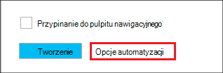

<properties
   pageTitle="Tworzenie klastrów systemem Linux Hadoop w korzystania z szablonów Menedżera zasobów Azure HDInsight | Microsoft Azure"
    description="Dowiedz się, jak utworzyć klastrów dla korzystania z szablonów Menedżera zasobów Azure Azure HDInsight Azure."
   services="hdinsight"
   documentationCenter=""
   tags="azure-portal"
   authors="mumian"
   manager="jhubbard"
   editor="cgronlun"/>

<tags
   ms.service="hdinsight"
   ms.devlang="na"
   ms.topic="article"
   ms.tgt_pltfrm="na"
   ms.workload="big-data"
   ms.date="09/02/2016"
   ms.author="jgao"/>

# Tworzenie klastrów systemem Linux Hadoop w korzystania z szablonów Menedżera zasobów Azure HDInsight

[AZURE.INCLUDE [selector](../../includes/hdinsight-selector-create-clusters.md)]

Dowiedz się, jak tworzenie klastrów HDInsight przy użyciu szablonów Azure Manager(ARM) zasobów. Aby uzyskać więcej informacji zobacz temat [Deploy aplikacji za pomocą szablonu Azure Menedżera zasobów](../resource-group-template-deploy.md). Do tworzenia innych klaster narzędzia i funkcje kliknij pozycję Wybierz kartę u góry tej strony lub zobacz [metody tworzenia klaster](hdinsight-provision-clusters.md#cluster-creation-methods).

##Wymagania wstępne dotyczące:

[AZURE.INCLUDE [delete-cluster-warning](../../includes/hdinsight-delete-cluster-warning.md)]

Przed rozpoczęciem z instrukcjami podanymi w tym artykule, musisz mieć następujące czynności:

- [Azure subskrypcji](https://azure.microsoft.com/documentation/videos/get-azure-free-trial-for-testing-hadoop-in-hdinsight/).
- Interfejs wiersza polecenia programu PowerShell Azure i/lub Azure

    [AZURE.INCLUDE [use-latest-version](../../includes/hdinsight-use-latest-powershell-and-cli.md)]

### Wymagania dotyczące kontroli dostępu

[AZURE.INCLUDE [access-control](../../includes/hdinsight-access-control-requirements.md)]

## Szablony Menedżera zasobów

Menedżer zasobów szablon ułatwia tworzenie klastrów HDInsight, ich zasoby zależne (na przykład domyślnego konta miejsca do magazynowania) i inne zasoby (na przykład baza danych SQL Azure umożliwia Apache Sqoop) dla aplikacji w jednym, skoordynowanego operacji. W szablonie Definiowanie zasoby, które są wymagane przez aplikację i parametry wdrożenia do wprowadzania wartości dla różnych środowiskach. Szablon zawiera JSON i wyrażeń, których można użyć do utworzenia wartości dla wdrożenia.

Menedżer zasobów szablonu w celu tworzenia klaster HDInsight i zależne konta magazynu platformy Azure można znaleźć w [Dodatku A](#appx-a-arm-template). Za pomocą między platformami [VSCode](https://code.visualstudio.com/#alt-downloads) [Rozszerzenie Menedżera zasobów](https://marketplace.visualstudio.com/items?itemName=msazurermtools.azurerm-vscode-tools) lub edytora tekstu w celu zapisania szablonu do pliku w miejscu pracy. Będzie się, jak nawiązać połączenie przy użyciu różnych metod szablonu.

Aby uzyskać więcej informacji na temat szablonów Menedżera zasobów Zobacz

- [Szablony Menedżera zasobów Azure autora](../resource-group-authoring-templates.md)
- [Wdrażanie aplikacji za pomocą szablonu Azure Menedżera zasobów](../resource-group-template-deploy.md)

Aby dowiedzieć się schematu JSON przy niektórych elementów, należy wykonać poniższą procedurę:

1. Otwórz [Azure portal](https://porta.azure.com) , aby utworzyć klaster HDInsight.  Zobacz [systemem Linux oraz tworzenie klastrów w HDInsight za pomocą portalu Azure](hdinsight-hadoop-create-linux-clusters-portal.md).
2. Konfigurowanie wymagane elementy i elementy potrzebne w schemacie JSON.
3. Przed kliknięciem przycisku **Utwórz**, kliknij pozycję **Opcje automatyzacji** , jak pokazano w poniższej zrzut ekranu:

    

    Portalu tworzy szablon Menedżera zasobów na podstawie konfiguracji.
## Rozmieszczanie za pomocą programu PowerShell

Poniższa procedura tworzy klaster HDInsight systemem Linux.

**Aby wdrożyć klaster za pomocą szablonu Menedżera zasobów**

1. Zapisz plik json w [dodatku A](#appx-a-arm-template) do pracy. W obszarze skrypt programu PowerShell nazwa pliku jest *C:\HDITutorials-ARM\hdinsight-arm-template.json*.
2. Ustawianie parametrów i zmiennych w razie potrzeby.
3. Uruchom szablonu, korzystając z tego skryptu programu PowerShell:

        ####################################
        # Set these variables
        ####################################
        #region - used for creating Azure service names
        $nameToken = "<Enter an Alias>" 
        $templateFile = "C:\HDITutorials-ARM\hdinsight-arm-template.json"
        #endregion

        ####################################
        # Service names and varialbes
        ####################################
        #region - service names
        $namePrefix = $nameToken.ToLower() + (Get-Date -Format "MMdd")

        $resourceGroupName = $namePrefix + "rg"
        $hdinsightClusterName = $namePrefix + "hdi"
        $defaultStorageAccountName = $namePrefix + "store"
        $defaultBlobContainerName = $hdinsightClusterName

        $location = "East US 2"

        $armDeploymentName = $namePrefix
        #endregion

        ####################################
        # Connect to Azure
        ####################################
        #region - Connect to Azure subscription
        Write-Host "`nConnecting to your Azure subscription ..." -ForegroundColor Green
        try{Get-AzureRmContext}
        catch{Login-AzureRmAccount}
        #endregion

        # Create a resource group
        New-AzureRmResourceGroup -Name $resourceGroupName -Location $Location

        # Create cluster and the dependent storage accounge
        $parameters = @{clusterName="$hdinsightClusterName"}

        New-AzureRmResourceGroupDeployment `
            -Name $armDeploymentName `
            -ResourceGroupName $resourceGroupName `
            -TemplateFile $templateFile `
            -TemplateParameterObject $parameters

        # List cluster
        Get-AzureRmHDInsightCluster -ResourceGroupName $resourceGroupName -ClusterName $hdinsightClusterName 

    Skrypt programu PowerShell konfiguruje tylko jego nazwy. Nazwę konta magazynu jest ustalony w szablonie. Pojawi się monit o wprowadzenie hasła użytkownika klaster (domyślna nazwa użytkownika to *admin*); i hasło SSH (SSH domyślna nazwa użytkownika to *sshuser*).  
    
Aby uzyskać więcej informacji zobacz [Rozmieszczanie za pomocą programu PowerShell](../resource-group-template-deploy.md#deploy-with-powershell).

## Rozmieszczanie za pomocą interfejsu wiersza polecenia Azure

Poniższy przykładowy tworzy klaster oraz konta zależne miejsca do magazynowania i kontenera, dzwoniąc do szablonu Menedżera zasobów:

    azure login
    azure config mode arm
    azure group create -n hdi1229rg -l "East US"
    azure group deployment create --resource-group "hdi1229rg" --name "hdi1229" --template-file "C:\HDITutorials-ARM\hdinsight-arm-template.json"
    
Wyświetli monit o wprowadź nazwę klaster, klaster hasła użytkownika ( *Administrator*jest domyślna nazwa użytkownika) i hasło użytkownika SSH (SSH domyślna nazwa użytkownika to *sshuser*). Aby zapewnić parametrów w wierszu:

    azure group deployment create --resource-group "hdi1229rg" --name "hdi1229" --template-file "c:\Tutorials\HDInsightARM\create-linux-based-hadoop-cluster-in-hdinsight.json" --parameters '{\"clusterName\":{\"value\":\"hdi1229\"},\"clusterLoginPassword\":{\"value\":\"Pass@word1\"},\"sshPassword\":{\"value\":\"Pass@word1\"}}'

## Rozmieszczanie za pomocą interfejsu API usługi REST

Zobacz, [Rozmieszczanie za pomocą interfejsu API usługi REST](../resource-group-template-deploy.md#deploy-with-the-rest-api).

## Rozmieszczanie za pomocą programu Visual Studio

Przy użyciu programu Visual Studio można utworzyć projekt grupy zasobów i wdrożeniem tego Azure za pomocą interfejsu użytkownika. Wybierz typ zasobów, aby uwzględnić w projekcie i zasoby są automatycznie dodawane do szablonu Menedżera zasobów. Projekt zawiera również skrypt programu PowerShell wdrożyć szablonu.

Wprowadzenie do programu Visual Studio przy użyciu grup zasobów zobacz [Tworzenie i wdrażanie grupy zasobów Azure za pomocą programu Visual Studio](../vs-azure-tools-resource-groups-deployment-projects-create-deploy.md).

##Następne kroki
W tym artykule kiedy znasz już istnieje kilka sposobów tworzenia klaster HDInsight. Aby uzyskać więcej informacji, zobacz następujące artykuły:

- Na przykład wdrażania zasobów za pośrednictwem biblioteki .NET klienta zobacz [zasoby rozmieszczanie przy użyciu bibliotek .NET i szablonu](../virtual-machines/virtual-machines-windows-csharp-template.md).
- Aby szczegółowo przykładem wdrażania aplikacji, zobacz [Obsługa administracyjna i wdrażanie microservices właściwie platformy Azure](../app-service-web/app-service-deploy-complex-application-predictably.md).
- Aby uzyskać wskazówki na temat wdrażania rozwiązania w różnych środowiskach zobacz [rozwoju i środowiskach testowych platformy Microsoft Azure](../solution-dev-test-environments.md).
- Aby dowiedzieć się o części szablonu Menedżera zasobów Azure, zobacz [Narzędzia do tworzenia szablonów](../resource-group-authoring-templates.md).
- Aby uzyskać listę funkcji, które są dostępne w szablonie Menedżera zasobów Azure zobacz [funkcje szablonu](../resource-group-template-functions.md).

##Szablon odpowiedzi ApX Menedżera zasobów

Następujący szablon Menedżera Azure tworzy klaster systemem Linux Hadoop za pomocą konta zależne Azure przestrzeni dyskowej. 

> [AZURE.NOTE] Próbki zawierają informacje dotyczące metastore gałęzi i Oozie metastore konfiguracji.  Usuwanie sekcji lub skonfiguruj sekcję przed za pomocą tego szablonu.

    {
    "$schema": "https://schema.management.azure.com/schemas/2015-01-01/deploymentTemplate.json#",
    "contentVersion": "1.0.0.0",
    "parameters": {
        "clusterName": {
        "type": "string",
        "metadata": {
            "description": "The name of the HDInsight cluster to create."
        }
        },
        "clusterLoginUserName": {
        "type": "string",
        "defaultValue": "admin",
        "metadata": {
            "description": "These credentials can be used to submit jobs to the cluster and to log into cluster dashboards."
        }
        },
        "clusterLoginPassword": {
        "type": "securestring",
        "metadata": {
            "description": "The password must be at least 10 characters in length and must contain at least one digit, one non-alphanumeric character, and one upper or lower case letter."
        }
        },
        "sshUserName": {
        "type": "string",
        "defaultValue": "sshuser",
        "metadata": {
            "description": "These credentials can be used to remotely access the cluster."
        }
        },
        "sshPassword": {
        "type": "securestring",
        "metadata": {
            "description": "The password must be at least 10 characters in length and must contain at least one digit, one non-alphanumeric character, and one upper or lower case letter."
        }
        },
        "location": {
        "type": "string",
        "defaultValue": "East US",
        "allowedValues": [
            "East US",
            "East US 2",
            "North Central US",
            "South Central US",
            "West US",
            "North Europe",
            "West Europe",
            "East Asia",
            "Southeast Asia",
            "Japan East",
            "Japan West",
            "Australia East",
            "Australia Southeast"
        ],
        "metadata": {
            "description": "The location where all azure resources will be deployed."
        }
        },
        "clusterType": {
        "type": "string",
        "defaultValue": "hadoop",
        "allowedValues": [
            "hadoop",
            "hbase",
            "storm",
            "spark"
        ],
        "metadata": {
            "description": "The type of the HDInsight cluster to create."
        }
        },
        "clusterWorkerNodeCount": {
        "type": "int",
        "defaultValue": 2,
        "metadata": {
            "description": "The number of nodes in the HDInsight cluster."
        }
        }
    },
    "variables": {
        "defaultApiVersion": "2015-05-01-preview",
        "clusterApiVersion": "2015-03-01-preview",
        "clusterStorageAccountName": "[concat(parameters('clusterName'),'store')]"
    },
    "resources": [
        {
        "name": "[variables('clusterStorageAccountName')]",
        "type": "Microsoft.Storage/storageAccounts",
        "location": "[parameters('location')]",
        "apiVersion": "[variables('defaultApiVersion')]",
        "dependsOn": [ ],
        "tags": { },
        "properties": {
            "accountType": "Standard_LRS"
        }
        },
        {
        "name": "[parameters('clusterName')]",
        "type": "Microsoft.HDInsight/clusters",
        "location": "[parameters('location')]",
        "apiVersion": "[variables('clusterApiVersion')]",
        "dependsOn": [ "[concat('Microsoft.Storage/storageAccounts/',variables('clusterStorageAccountName'))]" ],
        "tags": {

        },
        "properties": {
            "clusterVersion": "3.4",
            "osType": "Linux",
            "tier": "standard",
            "clusterDefinition": {
            "kind": "[parameters('clusterType')]",
            "configurations": {
                "gateway": {
                "restAuthCredential.isEnabled": true,
                "restAuthCredential.username": "[parameters('clusterLoginUserName')]",
                "restAuthCredential.password": "[parameters('clusterLoginPassword')]"
                },
                "hive-site": {
                    "javax.jdo.option.ConnectionDriverName": "com.microsoft.sqlserver.jdbc.SQLServerDriver",
                    "javax.jdo.option.ConnectionURL": "jdbc:sqlserver://myadla0901dbserver.database.windows.net;database=myhive20160901;encrypt=true;trustServerCertificate=true;create=false;loginTimeout=300",
                    "javax.jdo.option.ConnectionUserName": "johndole",
                    "javax.jdo.option.ConnectionPassword": "myPassword$"
                },
                "hive-env": {
                    "hive_database": "Existing MSSQL Server database with SQL authentication",
                    "hive_database_name": "myhive20160901",
                    "hive_database_type": "mssql",
                    "hive_existing_mssql_server_database": "myhive20160901",
                    "hive_existing_mssql_server_host": "myadla0901dbserver.database.windows.net",
                    "hive_hostname": "myadla0901dbserver.database.windows.net"
                },
                "oozie-site": {
                    "oozie.service.JPAService.jdbc.driver": "com.microsoft.sqlserver.jdbc.SQLServerDriver",
                    "oozie.service.JPAService.jdbc.url": "jdbc:sqlserver://myadla0901dbserver.database.windows.net;database=myhive20160901;encrypt=true;trustServerCertificate=true;create=false;loginTimeout=300",
                    "oozie.service.JPAService.jdbc.username": "johndole",
                    "oozie.service.JPAService.jdbc.password": "myPassword$",
                    "oozie.db.schema.name": "oozie"
                },
                "oozie-env": {
                    "oozie_database": "Existing MSSQL Server database with SQL authentication",
                    "oozie_database_name": "myhive20160901",
                    "oozie_database_type": "mssql",
                    "oozie_existing_mssql_server_database": "myhive20160901",
                    "oozie_existing_mssql_server_host": "myadla0901dbserver.database.windows.net",
                    "oozie_hostname": "myadla0901dbserver.database.windows.net"
                }            
            }
            },
            "storageProfile": {
            "storageaccounts": [
                {
                "name": "[concat(variables('clusterStorageAccountName'),'.blob.core.windows.net')]",
                "isDefault": true,
                "container": "[parameters('clusterName')]",
                "key": "[listKeys(resourceId('Microsoft.Storage/storageAccounts', variables('clusterStorageAccountName')), variables('defaultApiVersion')).key1]"
                }
            ]
            },
            "computeProfile": {
            "roles": [
                {
                "name": "headnode",
                "targetInstanceCount": "2",
                "hardwareProfile": {
                    "vmSize": "Standard_D3"
                },
                "osProfile": {
                    "linuxOperatingSystemProfile": {
                    "username": "[parameters('sshUserName')]",
                    "password": "[parameters('sshPassword')]"
                    }
                }
                },
                {
                "name": "workernode",
                "targetInstanceCount": "[parameters('clusterWorkerNodeCount')]",
                "hardwareProfile": {
                    "vmSize": "Standard_D3"
                },
                "osProfile": {
                    "linuxOperatingSystemProfile": {
                    "username": "[parameters('sshUserName')]",
                    "password": "[parameters('sshPassword')]"
                    }
                }
                }
            ]
            }
        }
        }
    ],
    "outputs": {
        "cluster": {
        "type": "object",
        "value": "[reference(resourceId('Microsoft.HDInsight/clusters',parameters('clusterName')))]"
        }
    }
    }
