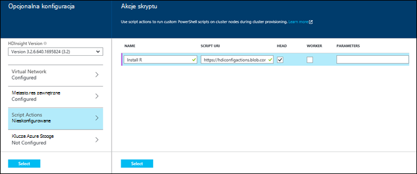
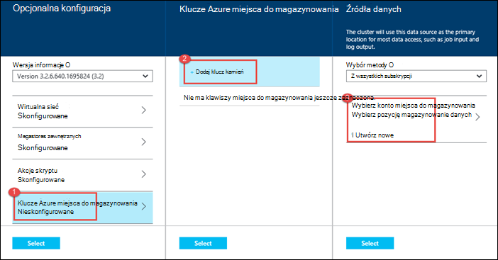

<properties
   pageTitle="Tworzenie klastrów Hadoop w HDInsight | Microsoft Azure"
    description="Dowiedz się, jak utworzyć klastrów dla usługi Azure HDInsight przy użyciu Azure Portal."
   services="hdinsight"
   documentationCenter=""
   tags="azure-portal"
   authors="mumian"
   manager="jhubbard"
   editor="cgronlun"/>

<tags
   ms.service="hdinsight"
   ms.devlang="na"
   ms.topic="article"
   ms.tgt_pltfrm="na"
   ms.workload="big-data"
   ms.date="09/02/2016"
   ms.author="jgao"/>

# Tworzenie klastrów opartych na systemie Windows Hadoop w użyciu Azure Portal HDInsight

[AZURE.INCLUDE [selector](../../includes/hdinsight-selector-create-clusters.md)]

Dowiedz się, jak utworzyć klaster Hadoop w HDInsight przy użyciu Azure Portal. Microsoft [Azure portalu](../azure-portal-overview.md) jest centralne miejsce, gdzie możesz obsługi administracyjnej i zarządzanie zasobami Azure. Azure Portal jest jednym z narzędzi, które umożliwiają tworzenie klaster Hadoop systemem Linux albo systemu Windows w HDInsight. Do tworzenia innych klaster narzędzia i funkcje kliknij pozycję Wybierz kartę u góry tej strony lub zobacz [metody tworzenia klaster](hdinsight-provision-clusters.md#cluster-creation-methods).

##Wymagania wstępne dotyczące:

[AZURE.INCLUDE [delete-cluster-warning](../../includes/hdinsight-delete-cluster-warning.md)]

Przed rozpoczęciem z instrukcjami podanymi w tym artykule, musisz mieć następujące czynności:

- Subskrypcję usługi Azure. Zobacz [Azure pobrać bezpłatną wersję próbną](https://azure.microsoft.com/documentation/videos/get-azure-free-trial-for-testing-hadoop-in-hdinsight/).

### Wymagania dotyczące kontroli dostępu

[AZURE.INCLUDE [access-control](../../includes/hdinsight-access-control-requirements.md)]

## Tworzenie klastrów

**Aby utworzyć klaster HDInsight**

1. Zaloguj się do [portalu Azure](https://portal.azure.com).
2. Kliknij przycisk **Nowy**, kliknij pozycję **Analizy danych**, a następnie kliknij **HDInsight**.

    ![Tworzenie nowego klaster w Azure Portal] (./media/hdinsight-provision-clusters/HDI.CreateCluster.1.png "Tworzenie nowego klaster w Azure Portal")

3. Wpisz lub wybierz następujące wartości:

    * **Klaster nazwa**: Wprowadź nazwę grupie. Zielony znacznik wyboru pojawi się obok jego nazwy, jeśli nazwa jest dostępna.

    * **Typ klaster**: wybierz pozycję **Hadoop**. Inne opcje inclue **HBase**, **Burza**i **Spark**.

        > [AZURE.IMPORTANT] Usługa HDInsight klastrów są dostępne w różnych typów, które odpowiadają obciążenie pracą lub technologii, którą klaster jest dostosowanych do. Istnieje obsługiwana metoda aby utworzyć klaster, który łączy wiele typów, takie jak Burza i HBase na jeden klaster.

    * **Klaster System operacyjny**: Wybierz **systemu Windows**. Aby utworzyć klaster Linux base, wybierz pozycję **Linux**.
    * **Wersja**: zobacz [HDInsight wersji](hdinsight-component-versioning.md).
    * **Subskrypcja**: Wybierz subskrypcję Azure, który będzie używany do tworzenia klaster.
    * **Grupa zasobów**: Wybierz istniejący lub Utwórz nową grupę zasobów. Ten wpis jest domyślnie do jednego z istniejących grup zasobów, jeśli są dostępne.
    * **Poświadczenia**: Konfigurowanie nazwa użytkownika i hasło dla użytkownika Hadoop (HTTP użytkownika). Po włączeniu pulpitu zdalnego dla klastrze należy skonfigurować użytkownika pulpitu zdalnego nazwa użytkownika i hasło oraz datę wygaśnięcia konta. U dołu, aby zapisać zmiany, kliknij przycisk **Wybierz** .

        ![Podaj klaster poświadczeń] (./media/hdinsight-provision-clusters/HDI.CreateCluster.3.png "Podaj klaster poświadczeń")

    * **Źródła danych**: Utwórz nowy lub wybierz istniejące konto Azure miejsca do magazynowania, który ma pełnić rolę domyślnego systemu plików w grupie.

        ![Karta źródła danych] (./media/hdinsight-provision-clusters/HDI.CreateCluster.4.png "Konfiguracja źródła danych zawiera")

        * **Wybór metody**: można ustawić **ze wszystkich subskrypcji** umożliwiające przeglądanie kont miejsca do magazynowania wszystkich subskrypcji. Ustaw ten **Klawisz dostępu** Jeśli chcesz wprowadzić **Nazwę miejsca do magazynowania** i **Klawisz dostępu** istniejącego konta miejsca do magazynowania.
        * **Zaznacz konto miejsca do magazynowania / Utwórz nowe**: kliknij pozycję **Wybierz konto miejsca do magazynowania** do przeglądania i wybrać istniejące konto miejsca do magazynowania chcesz skojarzyć z klastrem. Lub kliknij pozycję **Utwórz nowy** do tworzenia nowego konta miejsca do magazynowania. Za pomocą pola, które zostanie wyświetlone, aby wprowadzić nazwę konta magazynu. Zielony znacznik wyboru zostanie wyświetlona nazwa jest dostępna.
        * **Wybieranie domyślnego kontenera**: umożliwia wprowadź nazwę domyślnego kontenera dla klaster. Można wprowadzić dowolną nazwę poniżej, zaleca się pod tą samą nazwą co klaster tak, aby łatwo rozpoznać, że kontener jest używany dla określonych klaster.
        * **Lokalizacja**: regionu geograficznego, konto miejsca do magazynowania w lub zostanie utworzony w. Tej lokalizacji określa lokalizację klaster.  Klaster i jego domyślne konto miejsca do magazynowania Współtworzenie musi zlokalizować w tym samym centrum danych Azure.
    
    * **Węzeł ceny poziomów**: Ustawianie liczby węzłów pracownik, których potrzebujesz dla klaster. Szacowany koszt klaster będą wyświetlane w karta.
  

        ![Węzeł cennik karta warstwy] (./media/hdinsight-provision-clusters/HDI.CreateCluster.5.png "Określanie liczby węzłów klaster")

    * **Opcjonalnym** , aby wybrać wersję klaster, a także skonfigurować inne ustawienia opcjonalne, takie jak dołączania **Wirtualnej sieci**, konfigurowania **Zewnętrznych Metastore** do przechowywania danych dla gałęzi i Oozie, dostosowywanie klaster instalacji niestandardowych składników za pomocą skryptu akcji lub użyj konta dodatkowego miejsca do magazynowania z klastrem.

    * **Wersja HDInsight**: Wybierz wersję, którego chcesz użyć dla klaster. Aby uzyskać więcej informacji zobacz [HDInsight klaster wersji](hdinsight-component-versioning.md).
    * **Wirtualna sieć**: zaznacz Azure wirtualnej sieci i podsieci, jeśli chcesz umieścić klaster w wirtualnej sieci.  

        ![Karta sieci wirtualnej] (./media/hdinsight-provision-clusters/HDI.CreateCluster.6.png "Określanie wirtualną sieć szczegóły")

        Informacji na temat korzystania z sieci wirtualnej, łącznie z określonej konfiguracji wymagania dotyczące wirtualną sieć HDInsight zobacz [Rozszerzanie HDInsight capbilities przy użyciu wirtualną sieć Azure](hdinsight-extend-hadoop-virtual-network.md).
  

        
    * **Metastores zewnętrzne**: Określanie bazy danych programu Azure SQL do przechowywania metadanych gałąź i Oozie skojarzone z klastrem.
 
        > [AZURE.NOTE] Konfiguracja Metastore nie jest dostępna dla typów klaster HBase.

    ![Karta metastores niestandardowe] (./media/hdinsight-provision-clusters/HDI.CreateCluster.7.png "Określanie metastores zewnętrznych")

    **Użyj istniejącej bazy danych SQL gałęzi** metadanych kliknij przycisk **Tak**, zaznacz bazy danych SQL, a następnie wprowadź nazwy użytkownika i hasła bazy danych. Powtórz te kroki, jeśli chcesz **Użyj istniejącej bazy danych SQL Oozie metadanych**. Kliknij przycisk **Wybierz** , do czasu, gdy zostaną ponownie na karta **Opcjonalnym** .

    >[AZURE.NOTE] Baza danych Azure SQL, używane do metastore muszą zezwolić na łączności z innych usług Azure, w tym Azure HDInsight. Na pulpicie bazy danych Azure SQL, po prawej stronie kliknij nazwę serwera. Jest serwer, na którym działa wystąpienie bazy danych SQL. Raz są w widoku serwera, kliknij przycisk **Konfiguruj**, a następnie **Usługi Azure**, kliknij przycisk **Tak**, a następnie kliknij przycisk **Zapisz**.

            &nbsp;

            > [AZURE.IMPORTANT] Podczas tworzenia metastore, nie należy używać nazwy bazy danych, która zawiera kreski lub łączniki, jak to spowodować proces tworzenia klaster kończy się niepowodzeniem.
        
        * **Script Actions** if you want to use a custom script to customize a cluster, as the cluster is being created. For more information about script actions, see [Customize HDInsight clusters using Script Action](hdinsight-hadoop-customize-cluster.md). On the Script Actions blade provide the details as shown in the screen capture.
    

            

        * **Azure Storage Keys**: Specify additional storage accounts to associate with the cluster. In the **Azure Storage Keys** blade, click **Add a storage key**, and then select an existing storage account or create a new account.
    

            

4. Kliknij przycisk **Utwórz**. Wybieranie **numeru Pin w celu Startboard** spowoduje dodanie kafelka klaster Startboard portalu sieci. Ikona wskaże klastrem jest tworzony i zmieni się po zakończeniu tworzenia są oznaczone ikoną HDInsight.
    
    Zajmie trochę czasu, aby klaster można utworzyć, zwykle około 15 minut. Użyj fragmentu na Startboard lub pozycję **powiadomienia** w lewej części strony, aby sprawdzić procesu inicjowania obsługi administracyjnej.
    

5. Po zakończeniu tworzenia kliknij Kafelek klastrem z Startboard, aby uruchomić karta klaster. Karta klaster zawiera podstawowe informacje o grupie, takie jak nazwa, grupa zasobów, do której należy, lokalizację, w systemie operacyjnym, adres URL na pulpicie nawigacyjnym klaster itd.

    ![Karta klaster] (./media/hdinsight-provision-clusters/HDI.Cluster.Blade.png "Klaster właściwości")

    Opis ikony u góry to karta, a następnie w sekcji **Essentials** należy wykonać następujące kroki:

    * **Ustawienia** i **Wszystkie**: jest wyświetlana karta **Ustawienia** dla klastrów, dzięki czemu można uzyskać dostęp do informacji o grupie szczegółowe konfiguracji.
    * **Pulpit nawigacyjny**, **Klaster pulpitu nawigacyjnego**i **adres URL**: są wszystkie sposoby uzyskiwania dostępu do pulpitu nawigacyjnego klaster, czyli portalu sieci Web do uruchamiania w klastrze zadań.
    * **Pulpit zdalny**: umożliwia włączanie i wyłączanie pulpitu zdalnego w węzłach.
    * **Klaster skali**: umożliwia zmianę liczby węzłów pracownika dla tego klaster.
    * **Usuwanie**: usuwa klaster HDInsight.
    * **Szybki Start** (): Wyświetla informacje, które mogą pomóc rozpocząć korzystanie z usługi HDInsight.
    * **Użytkownicy** (): umożliwia ustawianie uprawnień do _portalu zarządzania_ tym klastrem dla innych użytkowników w subskrypcji usługi Azure.
    

        > [AZURE.IMPORTANT] To _tylko_ ma wpływ na dostęp i uprawnienia, aby ten klaster w portalu, a nie ma wpływu na kto może nawiązać połączenia lub przesyłać zadania do klastrów HDInsight.
        
    * **Znaczniki** (): znaczników umożliwia określenie par klucz wartość do definiowania niestandardowych taksonomii usług w chmurze. Na przykład może utworzyć klucz o nazwie __projektu__, a następnie użyj wartości wspólne dla wszystkich usług skojarzonych z określonego projektu.

##Dostosowywanie klastrów

- Zobacz [Dostosowywanie HDInsight klastrów za pomocą uruchamiania](hdinsight-hadoop-customize-cluster-bootstrap.md).
- Zobacz [klastrów HDInsight systemu Windows dostosowywanie przy użyciu akcji skryptów](hdinsight-hadoop-customize-cluster.md).

##Następne kroki
W tym artykule kiedy znasz już istnieje kilka sposobów tworzenia klaster HDInsight. Aby uzyskać więcej informacji, zobacz następujące artykuły:

* [Wprowadzenie do usługi HDInsight Azure](hdinsight-hadoop-linux-tutorial-get-started.md) — Dowiedz się, jak rozpocząć pracę z klaster HDInsight
* [Przesyłanie Hadoop zadań programowy](hdinsight-submit-hadoop-jobs-programmatically.md) — Dowiedz się, jak programowo przesyłać zadania do HDInsight
* [Zarządzanie klastrów Hadoop w HDInsight za pomocą Azure Portal](hdinsight-administer-use-management-portal.md)

