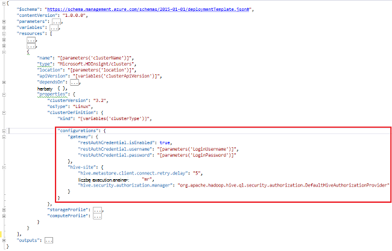

<properties
    pageTitle="Dostosowywanie przy użyciu początkowego klastrów HDInsight | Microsoft Azure"
    description="Dowiedz się, jak dostosować klastrów HDInsight za pomocą uruchamiania."
    services="hdinsight"
    documentationCenter=""
    authors="mumian"
    manager="jhubbard"
    editor="cgronlun"
    tags="azure-portal"/>

<tags
    ms.service="hdinsight"
    ms.workload="big-data"
    ms.tgt_pltfrm="na"
    ms.devlang="na"
    ms.topic="article"
    ms.date="09/02/2016"
    ms.author="jgao"/>

# Dostosowywanie przy użyciu początkowego klastrów HDInsight

Czasami chcesz skonfigurować pliki konfiguracyjne, które obejmują:

- clusterIdentity.xml
- podstawowe site.xml
- Gateway.XML
- hbase env.xml
- hbase site.xml
- hdfs site.xml
- gałąź env.xml
- gałąź site.xml
- Witryna mapred
- oozie site.xml
- oozie env.xml
- site.xml Burza
- tez site.xml
- webhcat site.xml
- Przędza site.xml

Klastrów nie może zachować zmian z powodu ponownie do obrazowania. Aby uzyskać więcej informacji na ponownie do obrazowania zobacz [Roli wystąpienia ponowne uruchomienie z powodu uaktualnienia systemu operacyjnego](http://blogs.msdn.com/b/kwill/archive/2012/09/19/role-instance-restarts-due-to-os-upgrades.aspx). Aby zachować zmiany przez okres amortyzacji klastrów, umożliwia dostosowywania klaster HDInsight w trakcie procesu tworzenia. To jest zalecany sposób zmień konfigurację klastrze i zachowywane między te Azure reimage zdarzenia Uruchom ponownie uruchom ponownie komputer. Te zmiany w konfiguracji są stosowane przed rozpoczęciem usługi, aby needn't jest ponowne uruchomienie usług. 

Istnieją 3 sposoby uruchamiania za pomocą:

- Za pomocą programu PowerShell Azure

    [AZURE.INCLUDE [upgrade-powershell](../../includes/hdinsight-use-latest-powershell.md)]
    
- Użycie zestawu SDK .NET
- Używanie Menedżera zasobów Azure szablonu

Aby uzyskać informacji na temat instalowania dodatkowych składników w klastrze HDInsight podczas tworzenia zobacz:

- [Dostosowywanie klastrów HDInsight przy użyciu akcji skryptu (Linux).](hdinsight-hadoop-customize-cluster-linux.md)
- [Dostosowywanie klastrów HDInsight przy użyciu akcji skryptu (Windows)](hdinsight-hadoop-customize-cluster.md)

## Przy użyciu Azure

Poniższy kod programu PowerShell dostosowuje konfiguracji gałęzi:

    # hive-site.xml configuration
    $hiveConfigValues = @{ "hive.metastore.client.socket.timeout"="90" }
    
    $config = New-AzureRmHDInsightClusterConfig `
        | Set-AzureRmHDInsightDefaultStorage `
            -StorageAccountName "$defaultStorageAccountName.blob.core.windows.net" `
            -StorageAccountKey $defaultStorageAccountKey `
        | Add-AzureRmHDInsightConfigValues `
            -HiveSite $hiveConfigValues 
    
    New-AzureRmHDInsightCluster `
        -ResourceGroupName $existingResourceGroupName `
        -ClusterName $clusterName `
        -Location $location `
        -ClusterSizeInNodes $clusterSizeInNodes `
        -ClusterType Hadoop `
        -OSType Windows `
        -Version "3.2" `
        -HttpCredential $httpCredential `
        -Config $config 

Zakończenie pracy skrypt programu PowerShell można znaleźć w [Dodatku A](#hdinsight-hadoop-customize-cluster-bootstrap.md/appx-a:-powershell-sample).

**Aby sprawdzić zmiany:**

1. Logowanie się do [portalu Azure](https://portal.azure.com).
2. W okienku po lewej stronie kliknij przycisk **Przeglądaj**, a następnie kliknij **Klastrów HDInsight**.
3. Kliknij klaster właśnie utworzonego za pomocą skryptu programu PowerShell.
4. Kliknij pozycję **pulpit nawigacyjny** z górnej części karta otworzyć Ambari interfejsu użytkownika.
5. Kliknij **gałąź** z menu po lewej stronie.
6. Kliknij pozycję **HiveServer2** z **podsumowania**.
7. Kliknij kartę **podawać** .
8. Kliknij **gałąź** z menu po lewej stronie.
9. Kliknij kartę **Zaawansowane** .
10. Przewiń w dół, a następnie rozwiń **Zaawansowane witryny gałęzi**.
11. Poszukaj **hive.metastore.client.socket.timeout** w sekcji.

Niektóre przykłady więcej o dostosowywaniu inne pliki konfiguracyjne:

    # hdfs-site.xml configuration
    $HdfsConfigValues = @{ "dfs.blocksize"="64m" } #default is 128MB in HDI 3.0 and 256MB in HDI 2.1

    # core-site.xml configuration
    $CoreConfigValues = @{ "ipc.client.connect.max.retries"="60" } #default 50

    # mapred-site.xml configuration
    $MapRedConfigValues = @{ "mapreduce.task.timeout"="1200000" } #default 600000

    # oozie-site.xml configuration
    $OozieConfigValues = @{ "oozie.service.coord.normal.default.timeout"="150" }  # default 120

Aby uzyskać więcej informacji zobacz blog Azim Uddin zatytułowany [Tworzenie dostosowywania klaster HDInsight](http://blogs.msdn.com/b/bigdatasupport/archive/2014/04/15/customizing-hdinsight-cluster-provisioning-via-powershell-and-net-sdk.aspx).

## Użycie zestawu SDK .NET

Zobacz [systemem Linux oraz tworzenie klastrów w HDInsight przy użyciu zestawu SDK .NET](hdinsight-hadoop-create-linux-clusters-dotnet-sdk.md#use-bootstrap).

## Używanie Menedżera zasobów szablonu

Za pomocą uruchamiania w szablonie Menedżera zasobów:

    "configurations": {
        …
        "hive-site": {
            "hive.metastore.client.connect.retry.delay": "5",
            "hive.execution.engine": "mr",
            "hive.security.authorization.manager": "org.apache.hadoop.hive.ql.security.authorization.DefaultHiveAuthorizationProvider"
        }
    }

## Zobacz też

- [Tworzenie klastrów Hadoop w HDInsight] [ hdinsight-provision-cluster] zawiera instrukcje dotyczące tworzenia klaster HDInsight przy użyciu innych opcji niestandardowych.
- [Projektowania skryptów Akcja skrypt do HDInsight][hdinsight-write-script]
- [Instalowanie i używanie Spark na klastrów HDInsight][hdinsight-install-spark]
- [Instalowanie i używanie R na klastrów HDInsight][hdinsight-install-r]
- [Instalowanie i używanie klastrów Solr na HDInsight](hdinsight-hadoop-solr-install.md).
- [Instalowanie i używanie klastrów Giraph na HDInsight](hdinsight-hadoop-giraph-install.md).

[hdinsight-install-spark]: hdinsight-hadoop-spark-install.md
[hdinsight-install-r]: hdinsight-hadoop-r-scripts.md
[hdinsight-write-script]: hdinsight-hadoop-script-actions.md
[hdinsight-provision-cluster]: hdinsight-provision-clusters.md
[powershell-install-configure]: powershell-install-configure.md

[img-hdi-cluster-states]: ./media/hdinsight-hadoop-customize-cluster/HDI-Cluster-state.png "Etapy podczas tworzenia klaster"

## Przykładowy programu PowerShell ApX o:

Ten skrypt programu PowerShell tworzy klaster HDInsight i dostosowuje ustawienie gałęzi:

    ####################################
    # Set these variables
    ####################################
    #region - used for creating Azure service names
    $nameToken = "<ENTER AN ALIAS>" 
    #endregion

    #region - cluster user accounts
    $httpUserName = "admin"  #HDInsight cluster username
    $httpPassword = "<ENTER A PASSWORD>" #"<Enter a Password>"

    $sshUserName = "sshuser" #HDInsight ssh user name
    $sshPassword = "<ENTER A PASSWORD>" #"<Enter a Password>"
    #endregion

    ####################################
    # Service names and varialbes
    ####################################
    #region - service names
    $namePrefix = $nameToken.ToLower() + (Get-Date -Format "MMdd")

    $resourceGroupName = $namePrefix + "rg"
    $hdinsightClusterName = $namePrefix + "hdi"
    $defaultStorageAccountName = $namePrefix + "store"
    $defaultBlobContainerName = $hdinsightClusterName

    $location = "East US 2"
    #endregion

    # Treat all errors as terminating
    $ErrorActionPreference = "Stop"

    ####################################
    # Connect to Azure
    ####################################
    #region - Connect to Azure subscription
    Write-Host "`nConnecting to your Azure subscription ..." -ForegroundColor Green
    try{Get-AzureRmContext}
    catch{Login-AzureRmAccount}
    #endregion

    #region - Create an HDInsight cluster
    ####################################
    # Create dependent components
    ####################################
    Write-Host "Creating a resource group ..." -ForegroundColor Green
    New-AzureRmResourceGroup `
        -Name  $resourceGroupName `
        -Location $location

    Write-Host "Creating the default storage account and default blob container ..."  -ForegroundColor Green
    New-AzureRmStorageAccount `
        -ResourceGroupName $resourceGroupName `
        -Name $defaultStorageAccountName `
        -Location $location `
        -Type Standard_GRS

    $defaultStorageAccountKey = (Get-AzureRmStorageAccountKey `
                                    -ResourceGroupName $resourceGroupName `
                                    -Name $defaultStorageAccountName)[0].Value
    $defaultStorageContext = New-AzureStorageContext `
                                    -StorageAccountName $defaultStorageAccountName `
                                    -StorageAccountKey $defaultStorageAccountKey
    New-AzureStorageContainer `
        -Name $defaultBlobContainerName `
        -Context $defaultStorageContext #use the cluster name as the container name

    ####################################
    # Create a configuration object
    ####################################
    $hiveConfigValues = @{ "hive.metastore.client.socket.timeout"="90" }
        
    $config = New-AzureRmHDInsightClusterConfig `
        | Set-AzureRmHDInsightDefaultStorage `
            -StorageAccountName "$defaultStorageAccountName.blob.core.windows.net" `
            -StorageAccountKey $defaultStorageAccountKey `
        | Add-AzureRmHDInsightConfigValues `
            -HiveSite $hiveConfigValues 

    ####################################
    # Create an HDInsight cluster
    ####################################
    $httpPW = ConvertTo-SecureString -String $httpPassword -AsPlainText -Force
    $httpCredential = New-Object System.Management.Automation.PSCredential($httpUserName,$httpPW)

    $sshPW = ConvertTo-SecureString -String $sshPassword -AsPlainText -Force
    $sshCredential = New-Object System.Management.Automation.PSCredential($sshUserName,$sshPW)

    New-AzureRmHDInsightCluster `
        -ResourceGroupName $resourceGroupName `
        -ClusterName $hdinsightClusterName `
        -Location $location `
        -ClusterSizeInNodes 1 `
        -ClusterType Hadoop `
        -OSType Linux `
        -Version "3.2" `
        -HttpCredential $httpCredential `
        -SshCredential $sshCredential `
        -Config $config

    ####################################
    # Verify the cluster
    ####################################
    Get-AzureRmHDInsightCluster -ClusterName $hdinsightClusterName

    #endregion
