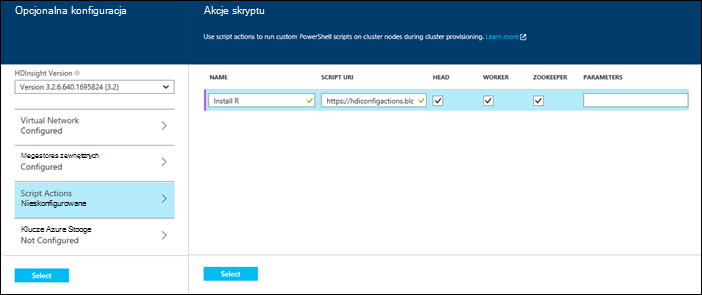
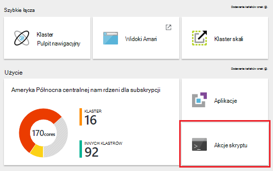
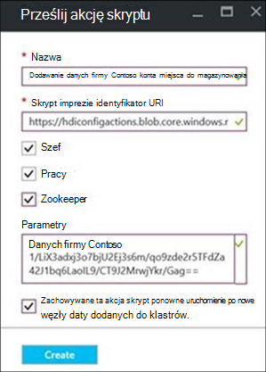
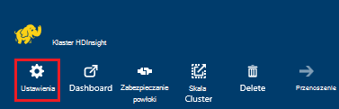
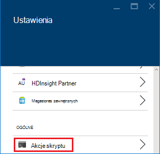
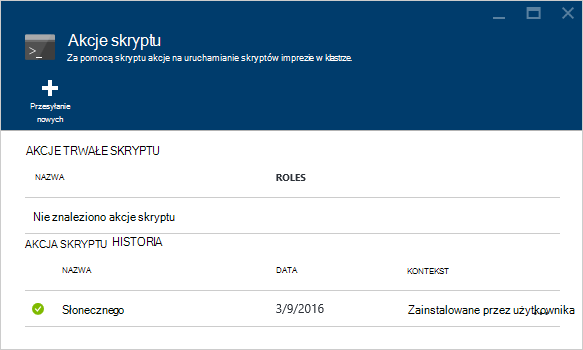
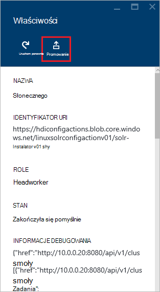
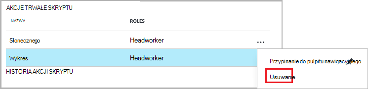
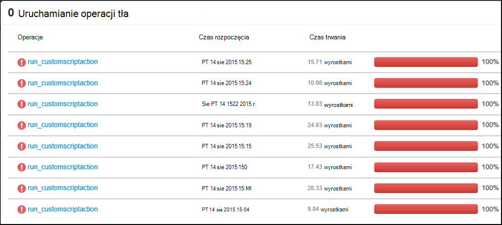
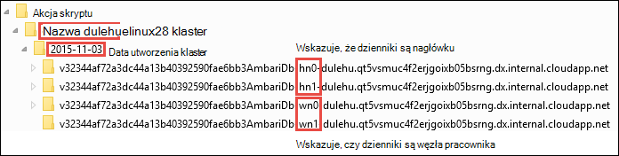

<properties
    pageTitle="Dostosowywanie przy użyciu akcji skryptu klastrów HDInsight | Microsoft Azure"
    description="Dowiedz się, jak dodać niestandardowe składniki do klastrów systemem Linux HDInsight za pomocą skryptu akcje. Akcje skryptu są imprezie wykorzystującego skrypty w węzłach i można dostosować konfiguracji klaster lub dodać dodatkowe usługi i narzędzia, takiego jak odcień, Solr lub R."
    services="hdinsight"
    documentationCenter=""
    authors="Blackmist"
    manager="jhubbard"
    editor="cgronlun"
    tags="azure-portal"/>

<tags
    ms.service="hdinsight"
    ms.workload="big-data"
    ms.tgt_pltfrm="na"
    ms.devlang="na"
    ms.topic="article"
    ms.date="09/06/2016"
    ms.author="larryfr"/>

# Dostosowywanie przy użyciu akcji skryptu klastrów systemem Linux HDInsight

Usługa HDInsight zawiera opcję konfiguracji o nazwie **Skryptu akcję** , która wywołuje skrypty niestandardowe Dostosowywanie klaster. Skrypty te mogą być używane podczas tworzenia klaster lub w klastrze już uruchomiony i są używane zainstalować dodatkowe składniki lub zmienić ustawienia konfiguracji.

> [AZURE.NOTE] Możliwość używania akcji skryptu w klastrze już uruchomiony jest dostępne tylko dla klastrów HDInsight systemem Linux. Uzyskać informacji na temat korzystania z akcji skryptu z systemem Windows klastrów zobacz [klastrów Dostosowywanie HDInsight przy użyciu akcji skryptu (Windows)](hdinsight-hadoop-customize-cluster.md).

Akcje skryptu również można opublikować Azure Marketplace jako aplikacja HDInsight. Pokaż przykłady w tym dokumencie, jak zainstalować aplikację HDInsight przy użyciu polecenia akcji skryptów programu PowerShell i .NET SDK. Aby uzyskać więcej informacji o aplikacjach HDInsight zobacz [Publikowanie HDInsight aplikacji do usługi Azure Marketplace](hdinsight-apps-publish-applications.md). 

## Opis akcji skryptu

Akcja skrypt jest po prostu imprezie skrypt, że podanie adresu URL i parametry i jest ona wykonano w węzłach HDInsight. Poniżej przedstawiono właściwości i funkcje skryptu akcji.

* Muszą być przechowywane na identyfikatora URI, który jest dostępne w grupie HDInsight. Możliwych lokalizacji przechowywania są następujące:

    * Konto magazyn obiektów blob, który jest albo magazynowania podstawowego lub dodatkowe konto klaster HDInsight. Ponieważ usługa HDInsight ma uprawnienia do oba typy kont miejsca do magazynowania podczas tworzenia klaster, te umożliwiają za pomocą akcji skryptu nie publicznej.
    
    * Identyfikator URI publicznie czytelne takich jak obiektów Blob platformy Azure, GitHub, OneDrive, Dropbox, itp.
    
    Przykłady identyfikatora URI dla skryptów przechowywanych w kontenerze obiektów blob (publicznie czytelne) zobacz sekcję [Przykładowy skrypt akcji skryptów](#example-script-action-scripts) .

* Może być ograniczone do __uruchamiać na niektórych typów węzeł__, węzłów na przykład głowy lub węzły pracownika.

    > [AZURE.NOTE] Gdy używana z usługi HDInsight Premium, możesz określić, że skrypt powinien być używany w węźle krawędzi.

* Może być __zachowywane__ lub __ad hoc__.

    Skryptów __PERSISTED__ są skryptów, które są stosowane do węzły pracownika, a zostanie automatycznie uruchomiono na nowe węzły utworzenia Skalowanie wewnętrzne klastrze.

    Trwałe skrypt może również Zastosuj zmiany do innego typu węzła, takich jak węzła głównego, ale z perspektywy funkcji tylko przyczyny pozostać skrypt jest więc it ma zastosowanie do nowych węzłów pracownik utworzenia skalowania klastrze.

    > [AZURE.IMPORTANT] Akcje skryptu trwałe musi mieć unikatową nazwę.

    __Spontanicznych__ skryptów nie są zachowywane; jednak można później promowanie spontanicznych skrypt do skryptu trwałe lub obniżanie poziomu trwałe skrypt do spontanicznej skryptu.

    > [AZURE.IMPORTANT] Akcje skryptu używany podczas tworzenia klaster automatycznie są zachowywane.
    >
    > Skrypty błędów nie są zachowywane, nawet jeśli wyraźnie wskazują że powinny być.

* Można zaakceptować __Parametry__ , które są używane przez skrypt podczas wykonywania.

* Są uruchomiono z __głównego poziomu uprawnień__ w węzłach.

* Można używać za pośrednictwem __Azure portal__, __Azure programu PowerShell__, __Polecenie Azure__lub __HDInsight.NET SDK__

    [AZURE.INCLUDE [upgrade-powershell](../../includes/hdinsight-use-latest-powershell-cli-and-dotnet-sdk.md)]

Aby pomóc w Opis skryptów, jakie zostały zastosowane do klastrów i określanie, że identyfikator skrypty do promocji lub obniżanie, klaster zachowuje historię wszystkich skryptów, które zostały wykonane.

> [AZURE.IMPORTANT] Istnieje automatycznego można cofnąć zmiany wprowadzone przez akcję skryptu. Jeśli zachodzi potrzeba odwrócenia efektów skrypt, należy zrozumieć, jakie zmiany zostały wprowadzone i ręcznie je odwrócić (lub Podaj akcję skrypt, która powoduje ich odwrócenie.)

### Akcja skrypt w procesie tworzenia klaster

Akcje skryptu używany podczas tworzenia klaster są nieco inaczej niż skrypt, które akcje został uruchomiony na istniejącym klastrem:

* Skrypt jest __automatycznie zachowywane__.

* __Błąd__ skryptu może spowodować proces tworzenia klaster kończy się niepowodzeniem.

Na poniższym diagramie przedstawiono, gdy skrypt akcja jest wykonywana w trakcie procesu tworzenia:

![Dostosowywanie klaster HDInsight i etapów podczas tworzenia klaster][img-hdi-cluster-states]

Skrypt jest uruchomione podczas HDInsight jest konfigurowany. Na tym etapie skrypt jest uruchomione równolegle na określonych węzłach w klastrze i jest uruchomiono z uprawnieniami głównego w węzłach.

> [AZURE.NOTE] Ponieważ skrypt jest uruchomiono z głównego poziomu uprawnień na przez klaster, można wykonywać operacje, takie jak zatrzymywania i uruchamiania usługi, w tym usługi związane z Hadoop. Zatrzymanie usługi, należy się upewnić, że usługa Ambari i innych usług związanych z Hadoop są i rozpocząć pracę przed skrypt zakończeniu. Te usługi są wymagane do określenia pomyślnie zdrowia i stan klaster podczas jej tworzenia.

Podczas tworzenia klaster można określić kilka akcji skryptu wywoływane w kolejności, w jakiej zostały określone.

> [AZURE.IMPORTANT] Akcje skryptu należy wykonać w ciągu 60 minut lub zostaną przekroczenia limitu czasu. Podczas inicjowania obsługi administracyjnej klaster, skrypt jest uruchomione równocześnie z innymi procesami instalacja i konfiguracja. Konkurencji dla zasobów, takich jak przepustowość Procesora czasu lub sieci może spowodować skrypt umożliwiający potrwać dłużej niż w środowisku rozwoju.
>
> Aby zminimalizować czas potrzebny na uruchamianie skryptu, należy unikać zadań takich jak pobieranie i kompilowania aplikacji ze źródła. Zamiast tego wstępnie Kompilowanie aplikacji i zapisanie pliku binarnego w magazynie obiektów Blob platformy Azure szybko można pobrać z klastrem.

###Akcja skrypt w klastrze uruchomione

W przeciwieństwie do skryptu, które akcje używany podczas tworzenia klaster błąd skryptu został uruchomiony na już uruchomiony klaster nie powoduje automatycznego klaster zmienić stan nie powiodło się. Po ukończeniu działania skryptu klastrze należy powrócić do stanu "uruchomiony".

> [AZURE.IMPORTANT] Oznacza to, że uruchomionego klaster jest błędy skrypty do wykonywania operacji nieprawidłowe. Na przykład skrypt można usunąć pliki potrzebne przez klaster konfiguracja zmiany, tak, aby usługi mogły itp.
>
> Akcje skryptów Uruchom z uprawnieniami głównego, należy się upewnić, opis przed zastosowaniem w klastrze działanie skryptu.

Stosując skrypt do klastrów, stan klaster zmienianie __uruchomiony__ __zaakceptowane__, następnie __HDInsight konfiguracji__i na końcu z powrotem do __uruchamiania__ skryptów pomyślnie. Stan skryptu jest zalogowany historię akcji skryptu i można to stwierdzić, czy skrypt zakończyła się pomyślnie, albo nie powiodło się. Na przykład `Get-AzureRmHDInsightScriptActionHistory` polecenia cmdlet programu PowerShell umożliwia wyświetlanie stanu skryptu. Kwerenda zwróci informacje podobne do następujących:

    ScriptExecutionId : 635918532516474303
    StartTime         : 2/23/2016 7:40:55 PM
    EndTime           : 2/23/2016 7:41:05 PM
    Status            : Succeeded

> [AZURE.NOTE] Jeśli zmienisz hasło użytkownika (administratora) klaster po klaster został utworzony, może to powodować skrypt, które akcje uruchomiono przed tym klastrem kończy się niepowodzeniem. Jeśli masz akcji trwałe skrypt tego węzły pracownik docelowej, te może zakończyć się niepowodzeniem po dodaniu, że węzły do klastrów do zmiany rozmiaru operacji.

## Przykładowy skrypt akcji skryptów

Skrypt skrypty akcji można używać z portalu Azure Azure programu PowerShell, polecenie Azure lub HDInsight .NET SDK. Usługa HDInsight zawiera skrypty do zainstalowania następujących składników na HDInsight klastrów:

Nazwa | Skrypt
----- | -----
**Dodawanie konta magazynu platformy Azure** | https://hdiconfigactions.blob.Core.Windows.NET/linuxaddstorageaccountv01/Add-Storage-Account-v01.sh. Zobacz [Stosowanie Akcja skrypt do uruchomionego klastrów](#apply-a-script-action-to-a-running-cluster).
**Instalowanie odcień** | https://hdiconfigactions.blob.Core.Windows.NET/linuxhueconfigactionv02/Install-Hue-Uber-v02.sh. Zobacz [Instalowanie i używanie odcień na HDInsight klastrów](hdinsight-hadoop-hue-linux.md).
**Instalowanie R** | https://hdiconfigactions.blob.Core.Windows.NET/linuxrconfigactionv01/r-Installer-v01.sh. Zobacz [Instalowanie i używanie R na klastrów HDInsight](hdinsight-hadoop-r-scripts-linux.md).
**Instalowanie Solr** | https://hdiconfigactions.blob.Core.Windows.NET/linuxsolrconfigactionv01/solr-Installer-v01.sh. Zobacz [Instalowanie i używanie klastrów Solr na HDInsight](hdinsight-hadoop-solr-install-linux.md).
**Instalowanie Giraph** | https://hdiconfigactions.blob.Core.Windows.NET/linuxgiraphconfigactionv01/giraph-Installer-v01.sh. Zobacz [Instalowanie i używanie klastrów Giraph na HDInsight](hdinsight-hadoop-giraph-install-linux.md).
| **Wstępnie załadować bibliotek gałęzi** | https://hdiconfigactions.blob.Core.Windows.NET/linuxsetupcustomhivelibsv01/Setup-customhivelibs-v01.sh. Zobacz [Dodawanie gałęzi biblioteki na klastrów HDInsight](hdinsight-hadoop-add-hive-libraries.md) |

## Podczas tworzenia klaster za pomocą akcji skryptu

Ta sekcja zawiera przykłady na różne sposoby, za pomocą szablonu Menedżera zasobów Azure, przy użyciu poleceń cmdlet programu PowerShell i przy użyciu zestawu SDK .NET można używać akcji skryptu podczas tworzenia klaster HDInsight - z portalu Azure.

### Podczas tworzenia klaster z portalu Azure za pomocą akcji skryptu

1. Rozpocznij tworzenie klastrze, zgodnie z opisem w [klastrów tworzenie Hadoop w HDInsight](hdinsight-provision-clusters.md#portal).

2. W obszarze __Opcjonalnym__dla karta **Akcje skrypt** kliknij przycisk **Dodaj akcję skryptu** o podanie szczegółowych informacji o akcji skrypt, tak jak pokazano poniżej:

    

  	| Właściwość | Wartość |
  	| -------- | ----- |
  	| Nazwa | Określ nazwę akcji skryptów. |
  	| Skrypt identyfikator URI | Określ identyfikator URI skrypt, który jest wywoływana, aby dostosować klaster. |
  	| Głowy/pracownika | Określ węzły (**głowy**, **Pracownik**lub **ZooKeeper**) na jest uruchamiany skrypt dostosowywania. |
  	| Parametry | Określ parametry, jeśli jest to wymagane przez skrypt. |

    Naciśnij klawisz ENTER, aby dodać więcej niż jedną akcję skrypt do zainstalowania wielu składników w klastrze.

3. Kliknij przycisk **Wybierz** , aby zapisać konfigurację i kontynuować tworzenie klaster.

### Za pomocą akcji skryptu z szablonów Azure Menedżera zasobów

W tej sekcji używamy Menedżera zasobów Azure szablonów do tworzenia klaster HDInsight i również zainstalować składniki niestandardowe (w tym przykładzie R) w klastrze za pomocą akcji skryptu. Ta sekcja zawiera przykładowy szablon, aby utworzyć klaster przy użyciu akcji skryptów.

> [AZURE.NOTE] Czynności opisane w tej sekcji przedstawiają tworzenia klaster za pomocą akcji skryptów. Przykład tworzenia klastrze przy użyciu szablonu przy użyciu aplikacji usługi HDInsight zobacz [Instalowanie niestandardowe aplikacje HDInsight](hdinsight-apps-install-custom-applications.md).

#### Przed rozpoczęciem

* Uzyskać informacje o konfigurowaniu pracy, aby uruchomić polecenia cmdlet programu Powershell usługi HDInsight, zobacz [Instalowanie i konfigurowanie programu PowerShell Azure](../powershell-install-configure.md).
* Aby uzyskać instrukcje dotyczące tworzenia szablonów zobacz [Szablony do tworzenia Azure Menedżera zasobów](../resource-group-authoring-templates.md).
* Jeśli nie wcześniej używano Azure programu PowerShell przy użyciu Menedżera zasobów, zobacz [Używanie Azure przy użyciu Menedżera zasobów Azure](../powershell-azure-resource-manager.md).

#### Tworzenie klastrów przy użyciu akcji skryptu

1. Skopiuj następujący szablon do lokalizacji na komputerze. Ten szablon jest instalowana Giraph na headnodes oraz węzły pracownika w klastrze. Można też sprawdzić, czy szablon JSON jest prawidłowe. Wklej zawartość szablonu do [JSONLint](http://jsonlint.com/), narzędzie sprawdzania poprawności online JSON.

            {
            "$schema": "http://schema.management.azure.com/schemas/2015-01-01/deploymentTemplate.json#",
            "contentVersion": "1.0.0.0",
            "parameters": {
                "clusterLocation": {
                    "type": "string",
                    "defaultValue": "West US",
                    "allowedValues": [ "West US" ]
                },
                "clusterName": {
                    "type": "string"
                },
                "clusterUserName": {
                    "type": "string",
                    "defaultValue": "admin"
                },
                "clusterUserPassword": {
                    "type": "securestring"
                },
                "sshUserName": {
                    "type": "string",
                    "defaultValue": "username"
                },
                "sshPassword": {
                    "type": "securestring"
                },
                "clusterStorageAccountName": {
                    "type": "string"
                },
                "clusterStorageAccountResourceGroup": {
                    "type": "string"
                },
                "clusterStorageType": {
                    "type": "string",
                    "defaultValue": "Standard_LRS",
                    "allowedValues": [
                        "Standard_LRS",
                        "Standard_GRS",
                        "Standard_ZRS"
                    ]
                },
                "clusterStorageAccountContainer": {
                    "type": "string"
                },
                "clusterHeadNodeCount": {
                    "type": "int",
                    "defaultValue": 1
                },
                "clusterWorkerNodeCount": {
                    "type": "int",
                    "defaultValue": 2
                }
            },
            "variables": {
            },
            "resources": [
                {
                    "name": "[parameters('clusterStorageAccountName')]",
                    "type": "Microsoft.Storage/storageAccounts",
                    "location": "[parameters('clusterLocation')]",
                    "apiVersion": "2015-05-01-preview",
                    "dependsOn": [ ],
                    "tags": { },
                    "properties": {
                        "accountType": "[parameters('clusterStorageType')]"
                    }
                },
                {
                    "name": "[parameters('clusterName')]",
                    "type": "Microsoft.HDInsight/clusters",
                    "location": "[parameters('clusterLocation')]",
                    "apiVersion": "2015-03-01-preview",
                    "dependsOn": [
                        "[concat('Microsoft.Storage/storageAccounts/', parameters('clusterStorageAccountName'))]"
                    ],
                    "tags": { },
                    "properties": {
                        "clusterVersion": "3.2",
                        "osType": "Linux",
                        "clusterDefinition": {
                            "kind": "hadoop",
                            "configurations": {
                                "gateway": {
                                    "restAuthCredential.isEnabled": true,
                                    "restAuthCredential.username": "[parameters('clusterUserName')]",
                                    "restAuthCredential.password": "[parameters('clusterUserPassword')]"
                                }
                            }
                        },
                        "storageProfile": {
                            "storageaccounts": [
                                {
                                    "name": "[concat(parameters('clusterStorageAccountName'),'.blob.core.windows.net')]",
                                    "isDefault": true,
                                    "container": "[parameters('clusterStorageAccountContainer')]",
                                    "key": "[listKeys(resourceId('Microsoft.Storage/storageAccounts', parameters('clusterStorageAccountName')), '2015-05-01-preview').key1]"
                                }
                            ]
                        },
                        "computeProfile": {
                            "roles": [
                                {
                                    "name": "headnode",
                                    "targetInstanceCount": "[parameters('clusterHeadNodeCount')]",
                                    "hardwareProfile": {
                                        "vmSize": "Large"
                                    },
                                    "osProfile": {
                                        "linuxOperatingSystemProfile": {
                                            "username": "[parameters('sshUserName')]",
                                            "password": "[parameters('sshPassword')]"
                                        }
                                    },
                                    "scriptActions": [
                                        {
                                            "name": "installGiraph",
                                            "uri": "https://hdiconfigactions.blob.core.windows.net/linuxgiraphconfigactionv01/giraph-installer-v01.sh",
                                            "parameters": ""
                                        }
                                    ]
                                },
                                {
                                    "name": "workernode",
                                    "targetInstanceCount": "[parameters('clusterWorkerNodeCount')]",
                                    "hardwareProfile": {
                                        "vmSize": "Large"
                                    },
                                    "osProfile": {
                                        "linuxOperatingSystemProfile": {
                                            "username": "[parameters('sshUserName')]",
                                            "password": "[parameters('sshPassword')]"
                                        }
                                    },
                                    "scriptActions": [
                                        {
                                            "name": "installR",
                                            "uri": "https://hdiconfigactions.blob.core.windows.net/linuxrconfigactionv01/r-installer-v01.sh",
                                            "parameters": ""
                                        }
                                    ]
                                }
                            ]
                        }
                    }
                }
            ],
            "outputs": {
                "cluster":{
                    "type" : "object",
                    "value" : "[reference(resourceId('Microsoft.HDInsight/clusters',parameters('clusterName')))]"
                }
            }
        }

2. Uruchom Azure programu PowerShell i zalogowany do konta Azure. Po zapewnieniu poświadczenia, polecenie zwraca informacje o Twoim koncie.

        Add-AzureRmAccount

        Id                             Type       ...
        --                             ----
        someone@example.com            User       ...

3. Jeśli masz wiele subskrypcji, podaj identyfikator subskrypcji, którego chcesz użyć do wdrożenia.

        Select-AzureRmSubscription -SubscriptionID <YourSubscriptionId>

    > [AZURE.NOTE] Możesz użyć `Get-AzureRmSubscription` Aby uzyskać listę wszystkich subskrypcji skojarzonych z Twoim kontem, która zawiera identyfikator subskrypcji dla każdego z nich.

5. Jeśli nie masz istniejącej grupy zasobów, należy utworzyć nową grupę zasobów. Wprowadź nazwę grupy zasobów i lokalizacji, w której potrzebne do tego rozwiązania. Podsumowanie nowej grupy zasobów jest zwracana.

        New-AzureRmResourceGroup -Name myresourcegroup -Location "West US"

        ResourceGroupName : myresourcegroup
        Location          : westus
        ProvisioningState : Succeeded
        Tags              :
        Permissions       :
                            Actions  NotActions
                            =======  ==========
                            *
        ResourceId        : /subscriptions/######/resourceGroups/ExampleResourceGroup

6. Aby utworzyć nowy wdrożenia grupy zasobów, uruchom polecenie **Nowy AzureRmResourceGroupDeployment** i podaj wymaganych parametrów. Parametry będzie zawierać nazwę rozmieszczenia, nazwę swojej grupy zasobów i ścieżkę lub adres URL do szablonu, który został utworzony. Jeśli szablon wymaga parametry, musisz przekazać także tych parametrów. W tym przypadku akcja skrypt do zainstalowania R w klastrze nie wymaga żadnych parametrów.

        New-AzureRmResourceGroupDeployment -Name mydeployment -ResourceGroupName myresourcegroup -TemplateFile <PathOrLinkToTemplate>

    Użytkownik zostanie wyświetlony monit o podanie wartości parametrów zdefiniowanych w szablonie.

7. Po wdrożeniu grupa zasobów, zobaczysz podsumowanie wdrożenia.

          DeploymentName    : mydeployment
          ResourceGroupName : myresourcegroup
          ProvisioningState : Succeeded
          Timestamp         : 8/17/2015 7:00:27 PM
          Mode              : Incremental
          ...

8. Jeśli wdrożenia nie powiedzie się, można uzyskać informacje na temat błędów za pomocą następujące polecenia cmdlet.

        Get-AzureRmResourceGroupDeployment -ResourceGroupName myresourcegroup -ProvisioningState Failed

### Podczas tworzenia klaster za pomocą programu PowerShell Azure za pomocą akcji skryptu

W tej sekcji możemy użyć polecenia cmdlet [AzureRmHDInsightScriptAction Dodaj](https://msdn.microsoft.com/library/mt603527.aspx) do wywołania skryptów przy użyciu akcji skrypt dostosowywania klastrze. Przed kontynuowaniem upewnij się, możesz zainstalowaniu i skonfigurowaniu programu PowerShell Azure. Uzyskać informacje o konfigurowaniu pracy, aby uruchomić polecenia cmdlet programu PowerShell usługi HDInsight, zobacz [Instalowanie i konfigurowanie programu PowerShell Azure](../powershell-install-configure.md).

Wykonaj następujące czynności:

1. Otwórz konsolę Azure programu PowerShell i użyć następującej składni, aby zalogować się do subskrypcji usługi Azure deklarować niektóre zmienne programu PowerShell:

        # LOGIN TO ZURE
        Login-AzureRmAccount

        # PROVIDE VALUES FOR THESE VARIABLES
        $subscriptionId = "<SubscriptionId>"        # ID of the Azure subscription
        $clusterName = "<HDInsightClusterName>"         # HDInsight cluster name
        $storageAccountName = "<StorageAccountName>"    # Azure storage account that hosts the default container
        $storageAccountKey = "<StorageAccountKey>"      # Key for the storage account
        $containerName = $clusterName
        $location = "<MicrosoftDataCenter>"             # Location of the HDInsight cluster. It must be in the same data center as the storage account.
        $clusterNodes = <ClusterSizeInNumbers>          # The number of nodes in the HDInsight cluster.
        $resourceGroupName = "<ResourceGroupName>"      # The resource group that the HDInsight cluster will be created in

2. Określ wartości konfiguracji (na przykład węzły w klastrze) i przechowywania domyślnego ma być używany.

        # SPECIFY THE CONFIGURATION OPTIONS
        Select-AzureRmSubscription -SubscriptionId $subscriptionId
        $config = New-AzureRmHDInsightClusterConfig
        $config.DefaultStorageAccountName="$storageAccountName.blob.core.windows.net"
        $config.DefaultStorageAccountKey=$storageAccountKey

3. Aby wywołać skrypt, należy użyć polecenia cmdlet **AzureRmHDInsightScriptAction Dodaj** . W poniższym przykładzie użyto skryptu, która jest instalowana Giraph w klastrze:

        # INVOKE THE SCRIPT USING THE SCRIPT ACTION FOR HEADNODE AND WORKERNODE
        $config = Add-AzureRmHDInsightScriptAction -Config $config -Name "Install Giraph"  -NodeType HeadNode -Uri https://hdiconfigactions.blob.core.windows.net/linuxgiraphconfigactionv01/giraph-installer-v01.sh
        $config = Add-AzureRmHDInsightScriptAction -Config $config -Name "Install Giraph"  -NodeType WorkerNode -Uri https://hdiconfigactions.blob.core.windows.net/linuxgiraphconfigactionv01/giraph-installer-v01.sh

    Polecenia cmdlet **AzureRmHDInsightScriptAction Dodaj** wymaga następujących parametrów:

  	| Parametr | Definicja |
  	| --------- | ---------- |
  	| Konfiguracji | Obiekt konfiguracji, do którego skryptu akcji informacje są dodawane. |
  	| Nazwa | Nazwa akcji skryptów. |
  	| Typ węzła | Określa węzeł, dla którego jest uruchamiany skrypt dostosowywania. Prawidłowe wartości to **HeadNode** (Aby zainstalować na węzła głównego) **WorkerNode** (Aby zainstalować na wszystkich węzłach danych) lub **ZookeeperNode** (Aby zainstalować w węźle zookeeper). |
  	| Parametry | Parametry wymagane przez skrypt. |
  	| Identyfikator URI | Określa identyfikator URI skrypt, który jest wykonywane. |

4. Ustaw dla klaster użytkownika administratora/HTTPS:

        $httpCreds = get-credential

    Po wyświetleniu monitu wprowadź "admin" jako nazwę i hasło.

5. Ustawianie poświadczeń SSH:

        $sshCreds = get-credential

    Po wyświetleniu monitu wprowadź SSH nazwę użytkownika i hasło. Jeśli chcesz zabezpieczyć konta SSH za pomocą certyfikatu zamiast hasła, za pomocą pustego hasła i ustaw `$sshPublicKey` zawartości klucz publiczny certyfikatu chcesz użyć. Na przykład:

        $sshPublicKey = Get-Content .\path\to\public.key -Raw

4. Na koniec Utwórz klaster:

        New-AzureRmHDInsightCluster -config $config -clustername $clusterName -DefaultStorageContainer $containerName -Location $location -ResourceGroupName $resourceGroupName -ClusterSizeInNodes $clusterNodes -HttpCredential $httpCreds -SshCredential $sshCreds -OSType Linux

    Jeśli korzystasz z kluczem publicznym do zabezpieczenia konta SSH, musisz także określić `-SshPublicKey $sshPublicKey` jako parametru.

Może potrwać kilka minut, zanim klaster jest tworzony.

### Podczas tworzenia klaster z zestawu SDK .NET HDInsight za pomocą akcji skryptu

Zestaw SDK programu .NET HDInsight zawiera bibliotek klienta, które ułatwia pracować nad HDInsight z aplikacji .NET. Przykładowy kod zobacz [systemem Linux oraz tworzenie klastrów w HDInsight przy użyciu zestawu SDK .NET](hdinsight-hadoop-create-linux-clusters-dotnet-sdk.md#use-script-action).

## Stosowanie akcji skrypt do uruchomionego klastrów

Ta sekcja zawiera przykłady na różne sposoby, można zastosować akcje skryptu do uruchomionego klaster HDInsight; z portalu Azure za pomocą poleceń cmdlet środowiska PowerShell, przy użyciu polecenie Azure i platform i używanie .NET SDK. Akcja skrypt trwałe używane w tej sekcji dodaje istniejącego konta magazynu platformy Azure do uruchomionego klastrów. Umożliwia także inne akcje skrypt, zobacz [Przykładowy skrypt akcji skryptów](#example-script-action-scripts).

### Stosowanie akcji skrypt do uruchomionego klastrów Azure portal

1. [Azure portal](https://portal.azure.com)wybierz klaster HDInsight.

2. Karta klaster HDInsight zaznacz kafelków __Skrypt akcji__ .

    

    > [AZURE.NOTE] Można też zaznaczyć __wszystkie ustawienia__ , a następnie wybierz __Akcje skryptu__ z karta Ustawienia.

4. U góry karta akcje Skrypt wybierz pozycję __Prześlij nowe__.

    

5. Z karta Dodaj akcję skryptu wprowadź następujące informacje.

    * __Nazwa__: przyjazną nazwę, którą za pomocą tej akcji skryptów. W tym przykładzie `Add Storage account`.
    * __Identyfikator URI skrypt__: identyfikator URI skrypt. W tym przykładzie`https://hdiconfigactions.blob.core.windows.net/linuxaddstorageaccountv01/add-storage-account-v01.sh`
    * __Głowy__, __Pracownik__i __Zookeeper__: Sprawdź węzły, które powinny być stosowane ten skrypt do. W tym przykładzie głowy, pracownik i Zookeeper są zaznaczone.
    * __Parametry__: Jeśli skrypt akceptuje parametry, wprowadź je w tym miejscu. W tym przykładzie wprowadź nazwę konta magazynu i klucz konta miejsca do magazynowania:

        

        Na zrzut ekranu `contosodata` jest istniejące konto magazyn Azure drugi wiersz jest klucz konta miejsca do magazynowania.
    * __PERSISTED__: zaznacz ten wpis, jeśli chcesz skrypt, zostanie zastosowana do nowego pracownika węzłów podczas rozbudowy klaster.

6. Na koniec użyj przycisku __Utwórz__ stosowanie skrypt z klastrem.

### Stosowanie akcji skrypt do uruchomionego klastrów Azure programu PowerShell

Przed kontynuowaniem upewnij się, możesz zainstalowaniu i skonfigurowaniu programu PowerShell Azure. Uzyskać informacje o konfigurowaniu pracy, aby uruchomić polecenia cmdlet programu PowerShell usługi HDInsight, zobacz [Instalowanie i konfigurowanie programu PowerShell Azure](../powershell-install-configure.md).

1. Otwórz konsolę Azure programu PowerShell i użyć następującej składni, aby zalogować się do subskrypcji usługi Azure deklarować niektóre zmienne programu PowerShell:

        # LOGIN TO ZURE
        Login-AzureRmAccount

        # PROVIDE VALUES FOR THESE VARIABLES
        $clusterName = "<HDInsightClusterName>"         # HDInsight cluster name
        $saName = "<ScriptActionName>"                  # Name of the script action
        $saURI = "<URI to the script>"                  # The URI where the script is located
        $nodeTypes = "headnode", "workernode"
        
    > [AZURE.NOTE] Jeśli przy użyciu klaster HDInsight Premium, możesz użyć typ węzła z `"edgenode"` do uruchomienia skryptu w węźle krawędzi.

2. Aby zastosować skrypt z klastrem, użyj następującego polecenia:

        Submit-AzureRmHDInsightScriptAction -ClusterName $clusterName -Name $saName -Uri $saURI -NodeTypes $nodeTypes -PersistOnSuccess

    Po zakończeniu zadania, powinien zostać wyświetlony informacje podobne do następujących czynności:

        OperationState  : Succeeded
        ErrorMessage    :
        Name            : Giraph
        Uri             : https://hdiconfigactions.blob.core.windows.net/linuxgiraphconfigactionv01/giraph-installer-v01.sh
        Parameters      :
        NodeTypes       : {HeadNode, WorkerNode}

### Stosowanie akcji skrypt do klastrów uruchomione polecenie Azure

Przed kontynuowaniem upewnij się, możesz zainstalowaniu i skonfigurowaniu polecenie Azure. Aby uzyskać więcej informacji zobacz [Instalowanie polecenie Azure](../xplat-cli-install.md).

    [AZURE.INCLUDE [use-latest-version](../../includes/hdinsight-use-latest-cli.md)] 

1. Otwórz sesję powłoki, terminal, wiersz polecenia lub innego wiersza polecenia systemu i użyj następującego polecenia, aby przełączyć do trybu Azure Menedżera zasobów.

        azure config mode arm

2. Uwierzytelnianie do subskrypcji usługi Azure należy wykonać następujące kroki.

        azure login

3. Użyj następującego polecenia, aby zastosować akcję skrypt do uruchomionego klaster

        azure hdinsight script-action create <clustername> -g <resourcegroupname> -n <scriptname> -u <scriptURI> -t <nodetypes>

    Jeśli pominie się argument parametrów dla tego polecenia, zostanie wyświetlony monit dla nich. Jeśli skrypt Określ z `-u` akceptuje parametry, można je określić przy użyciu `-p` parametru.

    Prawidłowe __nodetypes__ są __headnode__, __workernode__i __zookeeper__. Jeśli skrypt powinny być stosowane do wielu typów węzeł, określić typy, oddzielając je ";". Na przykład `-n headnode;workernode`.

    Skrypt, aby dodać `--persistOnSuccess`. Skrypt może przechowywać w późniejszym terminie, przy użyciu `azure hdinsight script-action persisted set`.
    
    Po zakończeniu zadania, zostanie wyświetlony wynik podobny do następującego.
    
        info:    Executing command hdinsight script-action create
        + Executing Script Action on HDInsight cluster
        data:    Operation Info
        data:    ---------------
        data:    Operation status:
        data:    Operation ID:  b707b10e-e633-45c0-baa9-8aed3d348c13
        info:    hdinsight script-action create command OK

### Stosowanie akcji skrypt do klaster uruchomionego za pomocą interfejsu API usługi REST

Zobacz [Uruchamianie skryptu akcje w klastrze uruchomione](https://msdn.microsoft.com/library/azure/mt668441.aspx).
### Stosowanie akcji skrypt do uruchomionego klastrów HDInsight .NET SDK

Przykład za pomocą .NET SDK w celu zastosowania skrypty do klastrów zobacz [https://github.com/Azure-Samples/hdinsight-dotnet-script-action](https://github.com/Azure-Samples/hdinsight-dotnet-script-action).

## Wyświetlanie historii, podwyższanie i obniżanie poziomu akcje skryptu

### Za pomocą portalu Azure

1. [Azure portal](https://portal.azure.com)wybierz klaster HDInsight.

2. Z usługi HDInsight karta klaster wybierz pozycję __Ustawienia__.

    

3. Karta Ustawienia zaznacz __Akcje skryptu__.

    

4. Zostanie wyświetlona lista trwałe skryptów, a także Historia skrypty stosowane z klastrem na karta akcje skryptu. Poniżej ekranu widać, że Solr została skrypt działał w tym klastrze, ale umieszczone żadnych działań skryptu.

    

5. Wybieranie skryptu z historii zostanie wyświetlona karta właściwości dla tego skryptu. U góry karta można ponownie uruchomić skrypt lub przenosząc je.

    

6. Można również użyć __...__ po prawej stronie pozycji na karta akcje skrypt do wykonywania czynności, takich jak ponownie, utrzymują lub (w przypadku akcji trwałe) usuwanie.

    

### Przy użyciu programu PowerShell Azure

| Użyj następujących... | Aby... |
| ----- | ----- |
| Get-AzureRmHDInsightPersistedScriptAction | Pobieranie informacji na temat akcji trwałe skryptu |
| Get-AzureRmHDInsightScriptActionHistory | Pobieranie historii działań skrypt zastosowane do klaster lub szczegóły dotyczące określonej skryptu |
| Ustawianie AzureRmHDInsightPersistedScriptAction | Powoduje podwyższenie akcji spontanicznych skrypt akcją trwałe skryptu |
| Usuń AzureRmHDInsightPersistedScriptAction | Powoduje obniżenie poziomu akcję trwałe skrypt do spontanicznej akcji |

> [AZURE.IMPORTANT] Za pomocą `Remove-AzureRmHDInsightPersistedScriptAction` czy nie Cofnij akcje wykonywane przez skrypt, powoduje tylko usunięcie flagi trwałe tak, aby skrypt nie będzie został uruchomiony na nowe węzły pracownik dodane do klaster.

W poniższym przykładzie skryptu zaprezentowano podwyższyć, a następnie obniżanie poziomu skrypt przy użyciu poleceń cmdlet.

    # Get a history of scripts
    Get-AzureRmHDInsightScriptActionHistory -ClusterName mycluster

    # From the list, we want to get information on a specific script
    Get-AzureRmHDInsightScriptActionHistory -ClusterName mycluster -ScriptExecutionId 635920937765978529

    # Promote this to a persisted script
    # Note: the script must have a unique name to be promoted
    # if the name is not unique, you will receive an error
    Set-AzureRmHDInsightPersistedScriptAction -ClusterName mycluster -ScriptExecutionId 635920937765978529

    # Demote the script back to ad hoc
    # Note that demotion uses the unique script name instead of
    # execution ID.
    Remove-AzureRmHDInsightPersistedScriptAction -ClusterName mycluster -Name "Install Giraph"

### Za pomocą polecenie Azure

| Użyj następujących... | Aby... |
| ----- | ----- |
| `azure hdinsight script-action persisted list <clustername>` | Pobieranie listy działań trwałe skryptu |
| `azure hdinsight script-action persisted show <clustername> <scriptname>` | Pobieranie informacji o działaniach określonych trwałe skryptu |
| `azure hdinsight script-action history list <clustername>` | Pobieranie historii działań skrypt zastosowane do klaster |
| `azure hdinsight script-action history show <clustername> <scriptname>` | Pobieranie informacji o działaniach określonych skryptu |
| `azure hdinsight script action persisted set <clustername> <scriptexecutionid>` | Powoduje podwyższenie akcji spontanicznych skrypt akcją trwałe skryptu |
| `azure hdinsight script-action persisted delete <clustername> <scriptname>` | Powoduje obniżenie poziomu akcję trwałe skrypt do spontanicznej akcji |

> [AZURE.IMPORTANT] Za pomocą `azure hdinsight script-action persisted delete` czy nie Cofnij akcje wykonywane przez skrypt, powoduje tylko usunięcie flagi trwałe tak, aby skrypt nie będzie został uruchomiony na nowe węzły pracownik dodane do klaster.

### Przy użyciu zestawu SDK .NET HDInsight

Przykład użycia .NET SDK pobrać historię skryptu z klastrem podwyższanie lub obniżanie poziomu skryptów, zobacz [https://github.com/Azure-Samples/hdinsight-dotnet-script-action](https://github.com/Azure-Samples/hdinsight-dotnet-script-action).

> [AZURE.NOTE] W przykładzie pokazano również jak zainstalować aplikację HDInsight przy użyciu zestawu SDK .NET.

## Rozwiązywanie problemów

Interfejs użytkownika sieci web Ambari służy do wyświetlania informacji zarejestrowane przez skrypt akcje. Jeśli skrypt był używany podczas tworzenia klastrów, a nie powiodło się z powodu błędu skryptu tworzenia klaster dzienniki są również dostępne w domyślne konto miejsca do magazynowania skojarzone z klastrem. Ta sekcja zawiera informacje o tym, jak pobrać dzienników przy użyciu obu tych opcji.

### Korzystanie z sieci Web Ambari interfejsu użytkownika

1. W przeglądarce przejdź do https://CLUSTERNAME.azurehdinsight.net. Zamień NAZWAKLASTRA nazwę klaster HDInsight.

    Po wyświetleniu monitu wprowadź nazwę konta administratora (Administrator) i hasło, aby klaster. Może być konieczne ponowne wprowadzenie poświadczeń administratora w formularza sieci web.

2. Na pasku u góry strony wybierz pozycję __ops__ . Spowoduje to wyświetlenie listy bieżący i poprzedni operacji wykonywanych na klastrze za pośrednictwem Ambari.

    

3. Znajdź pozycje, które mają __Uruchamianie\_customscriptaction__ w kolumnie __Operations__ . Te są tworzone podczas akcje skryptu są uruchomione.

    

    Zaznacz tę pozycję, a rozwijania szczegółów za pomocą łącza, aby zobaczyć wynik STDOUT i STDERR wygenerowane podczas skrypt zostało wykonane w klastrze.

### Dzienniki dostępu z domyślnego konta miejsca do magazynowania

Jeśli nie można utworzyć klaster z powodu błędu w działaniu skryptu, skrypt Dzienniki czynności nadal są dostępne bezpośrednio z magazynu domyślnego konta skojarzone z klastrem.

* Dzienniki przestrzeni dyskowej są dostępne na `\STORAGE_ACOCUNT_NAME\DEFAULT_CONTAINER_NAME\custom-scriptaction-logs\CLUSTER_NAME\DATE`.

    

    W obszarze, dzienniki są zorganizowane oddzielnie headnode, workernode i zookeeper węzły. Oto kilka przykładów są:
    * **Headnode** - `<uniqueidentifier>AmbariDb-hn0-<generated_value>.cloudapp.net`
    * **Węzeł pracownika** - `<uniqueidentifier>AmbariDb-wn0-<generated_value>.cloudapp.net`
    * **Węzeł zookeeper** - `<uniqueidentifier>AmbariDb-zk0-<generated_value>.cloudapp.net`

* Wszystkie stdout i stderr odpowiedniego hosta jest przekazane do rachunku miejsca do magazynowania. Istnieje **dane wyjściowe -\*txt** i **błędy -\*txt** dla każdej akcji skryptów. Plik danych wyjściowych *.txt zawiera informacje o identyfikator URI skryptu, który masz uruchomić na hoście. Na przykład

        'Start downloading script locally: ', u'https://hdiconfigactions.blob.core.windows.net/linuxrconfigactionv01/r-installer-v01.sh'

* Istnieje możliwość wielokrotnie utworzyć klaster akcji skrypt o takiej samej nazwie. W takim przypadku można odróżnić odpowiednich dzienniki na podstawie nazwy folderu daty. Na przykład będzie struktura folderów dla klastrów (mycluster) utworzone w różnych terminach:
    * `\STORAGE_ACOCUNT_NAME\DEFAULT_CONTAINER_NAME\custom-scriptaction-logs\mycluster\2015-10-04`
    * `\STORAGE_ACOCUNT_NAME\DEFAULT_CONTAINER_NAME\custom-scriptaction-logs\mycluster\2015-10-05`

* Po utworzeniu klastrze akcji skryptu o takiej samej nazwie w tym samym dniu służy unikatowy prefiks do identyfikowania odpowiednich dzien.

* Jeśli tworzysz klastrze na koniec dnia, jest możliwe, że pliki dziennika zakresu przez dwa dni. W takich przypadkach będą widoczne dwa foldery inną datę na tym samym klastrze.

* Przekazywanie plików dziennika do domyślnego kontenera może potrwać maksymalnie 5 min, zwłaszcza w przypadku dużych klastrów. Tak Jeśli chcesz uzyskać dostęp do dzienników, należy nie natychmiast usunąć klaster Jeśli akcja skrypt nie powiedzie się.

## Obsługa oprogramowania Otwórz źródło klastrów HDInsight

Usługa Microsoft Azure HDInsight jest elastyczną platformę, umożliwiający tworzenie aplikacji duży danych w chmurze przy użyciu ekosystem utworzone wokół Hadoop technologii Otwórz źródło. Microsoft Azure przewiduje ogólne poziom obsługi technologii Otwórz źródło, zgodnie z opisem w sekcji **Zakres pomocy technicznej** [witryny sieci Web często zadawane pytania dotyczące obsługi Azure](https://azure.microsoft.com/support/faq/). Usługa HDInsight zawiera dodatkowy poziom obsługi dla niektórych elementów, zgodnie z poniższym opisem.

Istnieją dwa typy składników Otwórz źródło, które są dostępne w usłudze HDInsight:

- **Wbudowane składniki** — składniki te są preinstalowane w systemie klastrów HDInsight i zapewniają podstawowe funkcje klaster. Na przykład ResourceManager PRZĘDZY, języka kwerend programu Hive (HiveQL) i biblioteki Mahout należą do tej kategorii. Pełna lista obejmuje składniki klaster jest dostępna w [Co nowego w wersji klaster Hadoop dostarczony przez HDInsight?](hdinsight-component-versioning.md).

- **Niestandardowe składniki** —, jako użytkownik klaster, można zainstalować lub użyć w swojej obciążenie pracą jakikolwiek składnik dostępny we Wspólnocie lub utworzonych przez Ciebie.

> [AZURE.WARNING] Składniki dostarczony z klastrem HDInsight są w pełni obsługiwane i Microsoft Support pomogą izolowanie i rozwiązywanie problemów związanych z tych składników.
>
> Niestandardowe składniki otrzymają komercyjnego rozsądne pomocy technicznej, aby pomóc rozwiązać ten problem. Może to spowodować w rozwiązaniu problemu lub pytaniem nawiązanie dostępnych kanałów technologiami Otwórz źródło miejsce, w którym znajduje się głębokości specjalizacji tej technologii. Na przykład, istnieje wiele witryn społeczności, których można używać, takich jak: [forum w witrynie MSDN HDInsight](https://social.msdn.microsoft.com/Forums/azure/en-US/home?forum=hdinsight), [http://stackoverflow.com](http://stackoverflow.com). Projekty Apache mieć także witryn projektów na [http://apache.org](http://apache.org), na przykład: [Hadoop](http://hadoop.apache.org/).

Usługa HDInsight udostępnia kilka sposobów używania składników niestandardowych. Niezależnie od tego, jak składnik jest używany lub zainstalowane w klastrze dotyczy taki sam poziom pomocy technicznej. Poniżej znajduje się lista najczęściej używanych metod, że niestandardowe składniki mogą być używane na klastrów HDInsight:

1. Przesyłanie zadania - Hadoop albo innych typów zadań, których wykonanie lub za pomocą niestandardowych składników mogły być przesyłane z klastrem.

2. Dostosowywanie klaster - podczas tworzenia klaster, można określić dodatkowe ustawienia i niestandardowe składniki zainstalowane na węzłach.

3. Przykłady - popularne niestandardowe składniki, firmy Microsoft i inne osoby mogą udostępniać próbki sposobu użycia tych składników na klastrów HDInsight. Te przykłady są udostępniane bez pomocy technicznej.

##Rozwiązywanie problemów

###Historia nie pokazuje skrypty używane podczas tworzenia klaster

Jeśli utworzono klaster przed 15 marca 2016 nie widać wpisu w historii Akcja skrypt skrypty używany podczas tworzenia klaster. Jednak jeśli rozmiar klaster po 15 marca 2016 skryptów przy użyciu podczas tworzenia klaster pojawi się w historii jako są stosowane do nowych węzłów w klastrze w ramach operacji zmiany rozmiaru.

Istnieją dwa wyjątki:

* Jeśli klaster został utworzony przed 1 września 2015 r. Jest to w przypadku akcji skryptu zostały wprowadzone, aby klaster, wszelkie utworzone przed tą datą nie ma użyć akcji skryptu tworzenia klaster.

* Jeśli używany podczas tworzenia klaster kilka akcji skryptu i tej samej nazwie w przypadku wielu skryptów lub takiej samej nazwie, sam identyfikator URI, ale różnych parametrów na potrzeby wiele skryptów. W tych przypadkach wyświetlony następujący komunikat o błędzie.

    Nie nowych akcji skrypt można wykonać w tym klastrze z powodu powodujące konflikt nazw skrypt w istniejących skryptów. Tworzenie nazw skrypt podany w klastrze muszą być unikatowe. Istniejące skrypty będą nadal wykonywane przy zmianie rozmiaru.

## Następne kroki

Zobacz następujące informacje i przykłady dotyczące tworzenia i dostosowywania klastrze za pomocą skryptów:

- [Projektowania skryptów Akcja skrypt do HDInsight](hdinsight-hadoop-script-actions-linux.md)
- [Instalowanie i używanie Solr na klastrów HDInsight](hdinsight-hadoop-solr-install-linux.md)
- [Instalowanie i używanie Giraph na klastrów HDInsight](hdinsight-hadoop-giraph-install-linux.md)

[img-hdi-cluster-states]: ./media/hdinsight-hadoop-customize-cluster-linux/HDI-Cluster-state.png "Etapy podczas tworzenia klaster"
