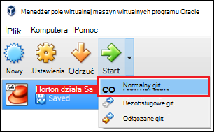

<properties
    pageTitle="Dowiedz się więcej o Hadoop za pomocą piaskownicy Hadoop | Microsoft Azure"
    description="Aby rozpocząć nauki o używaniu ekosystemie Hadoop, możesz skonfigurować piaskownicy Hadoop z Hortonworks na Azure maszyn wirtualnych. "
    keywords="hadoop emulatorze hadoop piaskownicy"
    editor="cgronlun"
    manager="jhubbard"
    services="hdinsight"
    authors="nitinme"
    documentationCenter=""
    tags="azure-portal"/>

<tags
    ms.service="hdinsight"
    ms.workload="big-data"
    ms.tgt_pltfrm="na"
    ms.devlang="na"
    ms.topic="article"
    ms.date="08/24/2016"
    ms.author="nitinme"/>

# Rozpoczynanie pracy w ekosystemie Hadoop z piaskownicy Hadoop na komputerze wirtualnych

Dowiedz się, jak zainstalować piaskownicy Hadoop z Hortonworks na komputerze wirtualnych, aby uzyskać informacje o ekosystemie Hadoop. Piaskownicy stanowi środowisko projektowe lokalnych, aby uzyskać informacje o Hadoop, System plików Distributed Hadoop (HDFS) i przesyłania zadania.

## Wymagania wstępne

* [Oracle VirtualBox](https://www.virtualbox.org/)

Po przejściu na Hadoop, można uruchomić przy użyciu Hadoop Azure, tworząc klaster HDInsight. Aby uzyskać więcej informacji o tym, jak rozpocząć pracę zobacz [Rozpoczynanie pracy z Hadoop na HDInsight](hdinsight-hadoop-linux-tutorial-get-started.md).

## Pobieranie i instalowanie maszyny wirtualnej

1. Z [http://hortonworks.com/downloads/#sandbox](http://hortonworks.com/downloads/#sandbox)zaznacz element, __Pobierz VIRTUALBOX__ dla 2,4 HDP w trybie piaskownicy Hortonworks. Wyświetli monit o rejestrować Hortonworks przed rozpoczęciem pobierania.

    

2. Na tej samej stronie sieci web wybierz pozycję __VirtualBox zainstalować przewodnik__ dla 2,4 HDP w trybie piaskownicy Hortonworks. To zostanie zapisany plik PDF zawierający instrukcje dotyczące instalacji na komputerze wirtualnych.

    

## Rozpoczynanie maszyny wirtualnej

1. Rozpoczynanie VirtualBox, wybierz piaskownicy Hortonworks wybierz pozycję __Uruchom__, a następnie __Uruchom normalny__.

    

2. Po zakończeniu procesu uruchamiania maszyny wirtualnej wyświetli instrukcjami logowania. Otwórz przeglądarkę sieci web i przejdź do wyświetlania adresu URL (zazwyczaj http://127.0.0.1:8888).

## Ustawianie hasła

1. W kroku __Wprowadzenie do__ strony piaskownicy Hortonworks wybierz __Opcje zaawansowane widoku__. Skorzystaj z informacji na tej stronie, aby zalogować się do piaskownicy przy użyciu SSH. Użyj nazwy i hasła.

    > [AZURE.NOTE] Jeśli nie masz klienta SSH zainstalowany, możesz użyć SSH oparte na sieci web, w przez komputer wirtualnych w __http://localhost:4200-__.

    Po raz pierwszy łączysz się przy użyciu SSH, zostanie wyświetlony monit o Zmienianie hasła konta administratora. Wprowadź nowe hasło, które będzie używane podczas logowania, za pomocą SSH w przyszłości.

2. Po zalogowaniu się, wpisz następujące polecenie:

        ambari-admin-password-reset
    
    Po wyświetleniu monitu podanie hasła do konta administratora Ambari. Będzie on używany podczas uzyskiwania dostępu do Ambari interfejs sieci Web.

## Za pomocą polecenia gałęzi

1. Z połączenia SSH piaskownicy Użyj następującego polecenia, aby uruchomić powłoki gałęzi:

        hive

2. Po rozpoczęciu powłokę, przeglądać tabele, które mają do dyspozycji piaskownicy należy wykonać następujące kroki:

        show tables;

3. Pobieranie 10 wierszy z za pomocą następujących `sample_07` tabeli:

        select * from sample_07 limit 10;

## Następne kroki

* [Dowiedz się, jak używać programu Visual Studio z piaskownicy Hortonworks](hdinsight-hadoop-emulator-visual-studio.md)
* [Nauka lin o piaskownicy Hortonworks](http://hortonworks.com/hadoop-tutorial/learning-the-ropes-of-the-hortonworks-sandbox/)
* [Samouczek Hadoop — wprowadzenie HDP](http://hortonworks.com/hadoop-tutorial/hello-world-an-introduction-to-hadoop-hcatalog-hive-and-pig/)