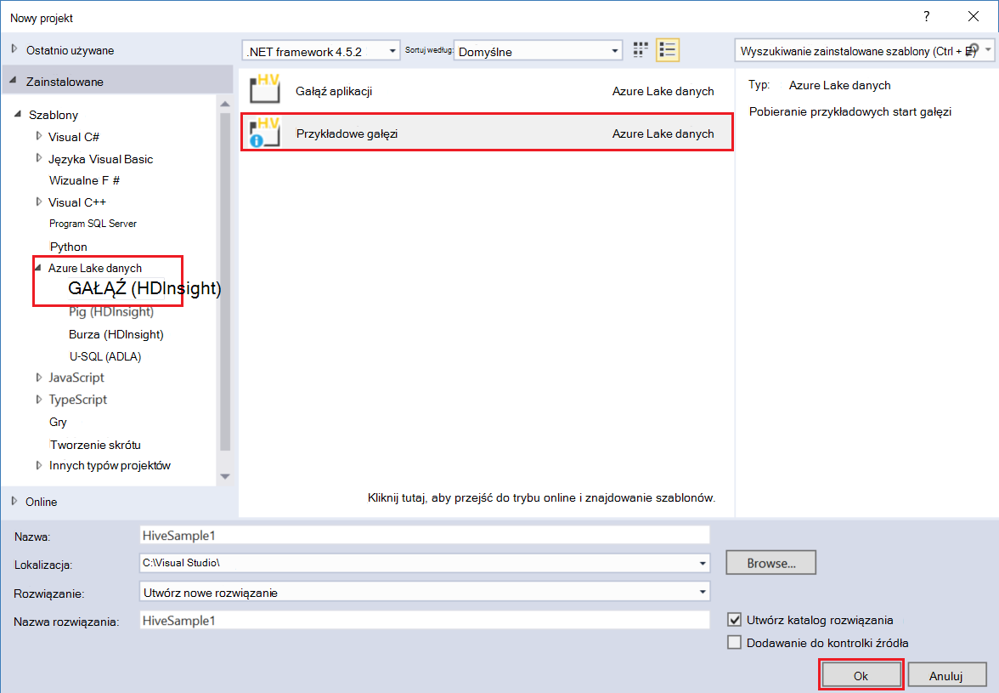
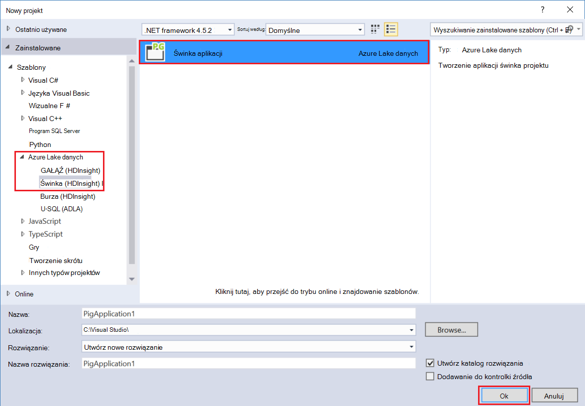

<properties
pageTitle="Korzystanie z narzędzi Microsoft Azure danych Lake programu Visual Studio z piaskownicy Hortonworks | Microsoft Azure"
description="Dowiedz się, jak za pomocą narzędzia Lake danych Azure programu VIsual Studio piaskownicy Hortonworks (działa w lokalnym maszyn wirtualnych). Z tych narzędzi można utworzyć i uruchomić zadania gałęzi i świnka w trybie piaskownicy i wyświetlanie dane wyjściowe zadania i Historia."
services="hdinsight"
documentationCenter=""
authors="Blackmist"
manager="paulettm"
editor="cgronlun"/>

<tags
ms.service="hdinsight"
ms.devlang="na"
ms.topic="article"
ms.tgt_pltfrm="na"
ms.workload="big-data"
ms.date="08/26/2016"
ms.author="larryfr"/>

# Narzędzia programu Visual Studio z piaskownicy Hortonworks Lake Azure danych

Narzędzia Lake danych Azure programu Visual Studio zawiera narzędzia do pracy z ogólnego klastrów Hadoop, oprócz narzędzia do pracy z Lake danych Azure i HDInsight. Niniejszy dokument zawiera czynności, aby użyć narzędzia Lake danych Azure z piaskownicy Hortonworks działa w komputerze wirtualnych.

Używanie piaskownicy Hortonworks pozwala do pracy z Hadoop lokalnie na środowiska programowania. Po mają opracowane rozwiązanie i umieścić ją w skali, następnie można przenosić do klastrów HDInsight.

## Wymagania wstępne

* Piaskownicy Hortonworks, uruchomionych na komputerze wirtualnych środowiska programowania. Ten dokument został zapisany i z piaskownicy działa w VirtualBox Oracle, który został skonfigurowany, korzystając z informacji w dokumencie [wprowadzenie w ekosystemie Hadoop](hdinsight-hadoop-emulator-get-started.md) .

* Visual Studio 2013 lub 2015 r., dowolnej wersji.

* [Azure SDK dla środowiska .NET](https://azure.microsoft.com/downloads/) 2.7.1 lub nowszy

* [Narzędzia Lake Azure danych dla programu Visual Studio](https://www.microsoft.com/download/details.aspx?id=49504)

## Konfigurowanie haseł piaskownicy

Upewnij się, że działa piaskownicy Hortonworks, a następnie postępuj zgodnie z instrukcjami [wprowadzenie w ekosystemie Hadoop](hdinsight-hadoop-emulator-get-started.md#set-passwords) , aby skonfigurować hasła dla SSH `root` konto i Ambari `admin` konta. Te hasła będzie używany podczas łączenia się piaskownicy z programu Visual Studio.

## Łączenie narzędzia z piaskownicy

1. Otwórz program Visual Studio i wybierz __Widok__, a następnie __Server Explorer__.

2. Korzystając z __Eksploratora serwera__kliknij prawym przyciskiem myszy pozycję __HDInsight__ , a następnie wybierz __Nawiązywanie połączenia z usługi HDInsight emulatora__.

    

3. W oknie dialogowym __Nawiązywanie połączenia z usługi HDInsight emulatora__ wpisz hasło, którego skonfigurowane dla Ambari.

    

    Wybierz przycisk __Dalej__ , aby kontynuować.

4. Przy użyciu pola __hasło__ wprowadź hasło skonfigurowane dla `root` konta. Pozostaw pozostałe pola wartość domyślną.

    

    Wybierz przycisk __Dalej__ , aby kontynuować.

5. Poczekaj, aż sprawdzanie poprawności usług do wykonania. W niektórych przypadkach sprawdzanie poprawności może zakończyć się niepowodzeniem i monit o zaktualizowanie konfiguracji. W takim przypadku wybierz przycisk __Aktualizuj__ i zaczekaj konfiguracji i weryfikacji w usłudze do wykonania.

    

    > [AZURE.NOTE] Proces aktualizacji używa Ambari, aby zmodyfikować konfigurację piaskownicy Hortonworks do oczekiwano za pomocą narzędzi Lake danych Azure programu Visual Studio.

    Po zakończeniu sprawdzania poprawności, wybierz przycisk __Zakończ__ , aby zakończyć konfigurację.

    

    > [AZURE.NOTE] W zależności od szybkości środowiska programowania i ilości pamięci przydzielone maszyn wirtualnych może potrwać kilka minut, aby skonfigurować i sprawdź poprawność usług.

Po wykonaniu tych czynności, teraz masz wpisu "HDInsight klaster lokalny" w Eksploratorze serwera w sekcji HDInsight.

## Napisać kwerendę gałęzi

Gałąź zawiera języka kwerend SQL przypominających (HiveQL,) do pracy z danych strukturalnych. Wykonaj następujące czynności, aby dowiedzieć się, jak wykonywane są kwerendy ad hoc klaster lokalny.

1. W __Eksploratorze serwera__kliknij prawym przyciskiem myszy pozycję odpowiadającą klaster lokalny dodany wcześniej, a następnie wybierz __kwerendę gałęzi__.

    

    Spowoduje to otwarcie nowego okna kwerendy, które pozwala na szybkie wpisz w górę i przesłaniu kwerendy do lokalnych klastrów.

2. W nowym oknie zapytania wprowadź następujące informacje:

        select count(*) from sample_08;
    
    U góry okna kwerendy upewnij się, że konfiguracja dla klaster lokalny jest zaznaczone, a następnie wybierz __Prześlij__. Pozostaw innych wartości (__partii__ i nazwa serwera,) na wartości domyślne.

    

    Należy zauważyć, że można umożliwia również menu rozwijanym obok pozycji __Prześlij__ wybierz pozycję __Zaawansowane__. Spowoduje to otwarcie okna dialogowego umożliwiającego zapewniają dodatkowe opcje, gdy przesyłanie zadania.

    

3. Po przesłaniu kwerendy zostanie wyświetlony stan zadania. To informacje o zadaniu w trakcie przetwarzania przez Hadoop. Wpis __Stan zadania__ zawiera bieżący stan zadania. Stan zostaną zaktualizowane okresowo lub ikonę Odśwież można użyć do ręcznego odświeżania stanu.

    

    __Stan zadania__ zmienia się na __zakończone__, zostanie wyświetlony przekierowywany acykliczne wykresu (AG). W takim ścieżkę wykonanie, która została określona przez Tez (domyślny wykonanie aparat gałęzi na klaster lokalny.) 
    
    > [AZURE.NOTE] Tez jest to wartość domyślna, używając klastrów HDInsight systemem Linux. Nie jest domyślny w HDInsight systemu Windows; Aby używać tej funkcji, należy dodać linię `set hive.execution.engine = tez;` na początku kwerendy gałęzi. 

    Łącze __Dane wyjściowe zadania__ umożliwia wyświetlanie danych wyjściowych. W tym przypadku jest __823__; Liczba wierszy w tabeli sample_08. Informacje diagnostyczne o zadaniu można wyświetlić przy użyciu łączy __Dziennik zadań__ i __Dziennika PRZĘDZY pobierania__ .

4. Można również interaktywne uruchamianie zadania gałęzi, zmieniając pola __partii__ na __interakcyjnie__, a następnie wybierz __Wykonywanie__. 

    

    Umożliwia strumieniowe przesyłanie dziennika wyjściowego wygenerowane podczas przetwarzania do okna __Dane wyjściowe HiveServer2__ .
    
    > [AZURE.NOTE] Jest to te same informacje, które są dostępne za pomocą łącza __Dziennik zadań__ , po zakończeniu zadania.

    

## Tworzenie projektu gałęzi

Możesz również utworzyć projekt, który zawiera wiele gałęzi skryptów. Jest to przydatne, gdy masz dotyczące skryptów, które chcesz zachować razem lub zachować przy użyciu systemów kontroli wersji.

1. W programie Visual Studio zaznacz __plik__, __Nowy__i then__Project__.

2. Z listy projektów rozwiń listę __Szablony__, __Azure Lake danych__ , a następnie wybierz __gałąź (HDInsight)__. Z listy szablonów wybierz __Gałąź próbki__. Wpisz nazwę i lokalizację, a następnie wybierz __przycisk OK__.

    

__Przykładowy gałęzi__ projekt zawiera dwa skrypty __WebLogAnalysis.hql__ i __SensorDataAnalysis.hql__. Można przesłać te przy użyciu tego samego przycisku __Prześlij__ w górnej części okna.

## Tworzenie projektu świnka

Gałąź zapewnia języka SQL podobne do pracy z danych strukturalnych, jednocześnie świnka znajdują się w języku (łaciński świnka,), który umożliwia opracowywanie potok przekształcenia, które są stosowane do danych. Do użytku świnka z klaster lokalny, wykonaj następujące czynności.

1. Otwórz program Visual Studio i wybierz __plik__, __Nowy__, a następnie __projektu__. Z listy projektów rozwiń listę __Szablony__, __Azure Lake danych__, a następnie wybierz pozycję __świnka (HDInsight)__. Z listy szablonów wybierz __Aplikację świnka__. Wprowadź nazwę i lokalizację, a następnie wybierz __przycisk OK__.

    

2. Wprowadź następujące jako zawartość pliku __script.pig__ , który został utworzony przy użyciu tego projektu.

        a = LOAD '/demo/data/Website/Website-Logs' AS (
            log_id:int, 
            ip_address:chararray, 
            date:chararray, 
            time:chararray, 
            landing_page:chararray, 
            source:chararray);
        b = FILTER a BY (log_id > 100);
        c = GROUP b BY ip_address;
        DUMP c;

    Podczas świnka korzysta z innego języka niż gałęzi, sposobu uruchamiania zadania jest zgodne między obu językach za pomocą przycisku __Prześlij__ . Wybieranie listy w dół obok pozycji __Prześlij__ Wyświetla okno dialogowe Zaawansowane Prześlij świnka.

    
    
3. Stan zadania i wynik jest również wyświetlany taki sam jako kwerendy gałęzi.

    

## Wyświetlanie zadań

Azure narzędzia Lake danych pozwalają również umożliwia łatwe wyświetlanie informacji o zadaniach, które zostały wykonane na Hadoop. Wykonaj następujące czynności, aby wyświetlić zadania, które zostały wykonane w klastrze lokalny.

1. Korzystając z __Eksploratora serwera__kliknij prawym przyciskiem myszy klaster lokalny, a następnie wybierz __Widok zadania__. Spowoduje to wyświetlenie listy zadań, które zostały przesłane do klastrów.

    

2. Z listy zadań wybierz jedną, aby wyświetlić szczegóły zadania.

    

    Informacje wyświetlane jest podobna do co widać po uruchomieniu gałęzi lub świnka kwerendę, zawierający łącza do wyświetlania danych wyjściowych i rejestrowania informacji.

3. Możesz także modyfikowanie i Prześlij ponownie to zadanie, w tym miejscu.

## Wyświetlanie gałęzi baz danych

1. W __Eksploratorze serwera__rozwiń pozycję __HDInsight klaster lokalny__ , a następnie rozwiń __Gałąź baz danych__. Wyświetlanie kolejnych __domyślne__ i __xademo__ baz danych na klaster lokalny. Rozwijanie bazy danych powoduje wyświetlenie tabel w bazie danych.

    

2. Rozwijanie tabeli są wyświetlane kolumny dla tej tabeli. Możesz kliknąć prawym przyciskiem myszy tabelę i wybierz __Widok pierwszych 100 wierszy__ , aby szybko wyświetlić dane.

    

### Właściwości bazy danych i tabeli

Można zauważyć, że możesz wybrać, aby wyświetlić __Właściwości__ na bazy danych lub tabeli. Wyświetli szczegóły dla zaznaczonego elementu w oknie dialogowym właściwości.

### Tworzenie tabeli

Aby utworzyć nową tabelę, kliknij prawym przyciskiem myszy bazy danych, a następnie wybierz pozycję __Create Table__.

Następnie można utworzyć tabelę przy użyciu formularza. Można zobaczyć nieprzetworzonych HiveQL, użyta do utworzenia tabeli u dołu tej strony.

## Następne kroki

* [Nauka lin o piaskownicy Hortonworks](http://hortonworks.com/hadoop-tutorial/learning-the-ropes-of-the-hortonworks-sandbox/)
* [Samouczek Hadoop — wprowadzenie HDP](http://hortonworks.com/hadoop-tutorial/hello-world-an-introduction-to-hadoop-hcatalog-hive-and-pig/)