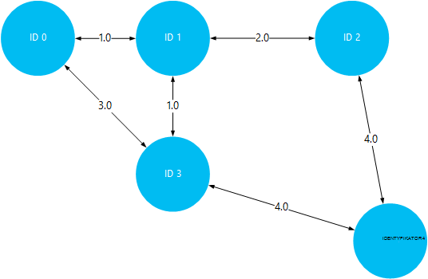
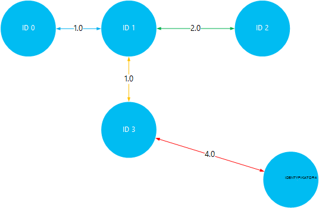

<properties
    pageTitle="Instalowanie i używanie Giraph na podstawie Linux HDInsight (Hadoop) | Microsoft Azure"
    description="Dowiedz się, jak zainstalować Giraph na klastrów systemem Linux HDInsight za pomocą skryptu akcje. Akcje skryptu umożliwia dostosowywanie klaster podczas tworzenia, zmieniania konfiguracji klaster lub instalując usługi i narzędzia."
    services="hdinsight"
    documentationCenter=""
    authors="Blackmist"
    manager="jhubbard"
    editor="cgronlun"
    tags="azure-portal"/>

<tags
    ms.service="hdinsight"
    ms.workload="big-data"
    ms.tgt_pltfrm="na"
    ms.devlang="na"
    ms.topic="article"
    ms.date="10/17/2016"
    ms.author="larryfr"/>

# Zainstaluj Giraph na klastrów HDInsight Hadoop i Giraph za pomocą przetwarzania dużych wykresów.

Możesz zainstalować Giraph na dowolnym typie klaster w Hadoop na Azure HDInsight przy użyciu **Akcji skryptu** , aby dostosować klastrze.

W tym temacie dowiesz się, jak zainstalować Giraph za pomocą skryptu akcji. Po zainstalowaniu Giraph zawiera również informacje dotyczące używania Giraph dla najbardziej typowe aplikacji, czyli przetwarzania dużych wykresów.

> [AZURE.NOTE] Informacje w tym artykule są specyficzne dla klastrów HDInsight systemem Linux. Aby uzyskać informacje na temat pracy z systemem Windows klastrów zobacz [Instalowanie Giraph na HDInsight Hadoop klastrów (Windows)](hdinsight-hadoop-giraph-install.md)

## Co to jest Giraph?

[Apache Giraph](http://giraph.apache.org/) umożliwia wykonywanie wykresu przetwarzania przy użyciu Hadoop i mogą być używane z usługi HDInsight Azure. Wykresy modelu relacje między obiekty, takie jak połączenia między routerami w dużych sieci, takich jak Internet lub relacje między osoby w sieciach społecznościowych (nazywane społecznościowych wykresu). Przetwarzanie wykres umożliwia powodu o relacjach między obiektami na wykresie, takich jak:

- Identyfikowanie potencjalnych znajomych na podstawie Twojej bieżącej relacji.
- Identyfikowanie najkrótszą trasę między dwoma komputerami w sieci.
- Obliczanie pozycja strony stron sieci Web.

> [AZURE.WARNING] Składniki dostarczony z klastrem HDInsight są w pełni obsługiwane i Microsoft Support pomogą izolowanie i rozwiązywanie problemów związanych z tych składników.
>
> Składniki niestandardowe, takie jak Giraph, otrzymają komercyjnego rozsądne pomocy technicznej, aby pomóc rozwiązać ten problem. Może to spowodować w rozwiązaniu problemu lub pytaniem nawiązanie dostępnych kanałów technologiami Otwórz źródło miejsce, w którym znajduje się głębokości specjalizacji tej technologii. Na przykład, istnieje wiele witryn społeczności, których można używać, takich jak: [forum w witrynie MSDN HDInsight](https://social.msdn.microsoft.com/Forums/azure/en-US/home?forum=hdinsight), [http://stackoverflow.com](http://stackoverflow.com). Projekty Apache mieć także witryn projektów na [http://apache.org](http://apache.org), na przykład: [Hadoop](http://hadoop.apache.org/).

##Co oznacza skryptu

Ten skrypt wykonuje następujące czynności:

* Instalacje Giraph do`/usr/hdp/current/giraph`
* Kopii `giraph-examples.jar` pliku do domyślnego magazynu (WASB) dla klaster:`/example/jars/giraph-examples.jar`

## Instalowanie Giraph przy użyciu akcji skryptu

Przykładowy skrypt, aby zainstalować Giraph w klastrze HDInsight jest dostępna w następującej lokalizacji.

    https://hdiconfigactions.blob.core.windows.net/linuxgiraphconfigactionv01/giraph-installer-v01.sh

Ta sekcja zawiera instrukcje dotyczące sposobu używania przykładowy skrypt podczas tworzenia klaster przy użyciu Azure Portal. 

> [AZURE.NOTE] Azure programu PowerShell, polecenie Azure, HDInsight .NET SDK lub Menedżer zasobów Azure szablony można również stosowanie akcji skryptów. Akcje skryptu można też zastosowane do już uruchomiony klastrów. Aby uzyskać więcej informacji zobacz [Dostosowywanie HDInsight klastrów z akcjami skrypt](hdinsight-hadoop-customize-cluster-linux.md).

1. Rozpoczynanie tworzenia klastrze wykonując kroki opisane w [klastrów opartych na tworzenie Linux HDInsight](hdinsight-hadoop-create-linux-clusters-portal.md), ale nie zakończyć tworzenie.

2. Na karta **Opcjonalnym** wybierz **Akcje skryptu**i wprowadź poniższe informacje:

    * __Nazwa__: Wprowadź przyjazną nazwę akcji skryptów.
    * __Identyfikator URI skrypt__: https://hdiconfigactions.blob.core.windows.net/linuxgiraphconfigactionv01/giraph-installer-v01.sh
    * __Głowy__: Zaznaczenie tego pola wyboru
    * __Pracownik__: nie zaznaczaj tego wyboru
    * __ZOOKEEPER__: nie zaznaczaj tego wyboru
    * __Parametry__: pozostaw to pole puste

3. U dołu **Akcje skrypt**Użyj przycisk **Wybierz** , aby zapisać konfigurację. Na koniec używania przycisku **Zaznaczenie** u dołu karta **Opcjonalnym** do zapisywania informacji opcjonalnym.

4. Kontynuuj tworzenie klaster, zgodnie z opisem w [klastrów opartych na tworzenie Linux HDInsight](hdinsight-hadoop-create-linux-clusters-portal.md).

## Jak korzystać z Giraph w HDInsight?

Po zakończeniu klaster podczas tworzenia, wykonaj następujące czynności, aby uruchomić przykład SimpleShortestPathsComputation dostępny w pakiecie Giraph. To wykonuje podstawowe implementacji <a href = "http://people.apache.org/~edwardyoon/documents/pregel.pdf">Pregel</a> znajdowania najkrótszy ścieżkę między obiektami na wykresie.

1. Nawiązywanie połączenia z klastrem HDInsight SSH:

        ssh USERNAME@CLUSTERNAME-ssh.azurehdinsight.net

    Aby uzyskać więcej informacji na temat korzystania z usługi HDInsight SSH zobacz:

    * [Używanie SSH z systemem Linux Hadoop na HDInsight z Linux, Unix lub systemu OS X](hdinsight-hadoop-linux-use-ssh-unix.md)

    * [Używanie SSH z systemem Linux Hadoop na HDInsight z systemu Windows](hdinsight-hadoop-linux-use-ssh-windows.md)

1. Tworzenie nowego pliku o nazwie __tiny_graph.txt__należy wykonać następujące kroki:

        nano tiny_graph.txt

    Zawartość tego pliku, należy użyć następującej składni:

        [0,0,[[1,1],[3,3]]]
        [1,0,[[0,1],[2,2],[3,1]]]
        [2,0,[[1,2],[4,4]]]
        [3,0,[[0,3],[1,1],[4,4]]]
        [4,0,[[3,4],[2,4]]]

    Te dane w tym artykule opisano relacji między obiektami na wykresie bezpośrednie, stosując format [źródła\_identyfikator, źródła\_wartość, [[dest\_identyfikator], [krawędź\_wartość]...]]. Każdy wiersz reprezentuje relację między **źródła\_identyfikator** obiektu i co najmniej jednym **dest\_identyfikator** obiektów. **Krawędź\_wartość** (lub grubość) można traktować jako siłę lub odległość połączenia między **source_id** i **dest\_identyfikator**.

    Zmiany, i używania wartość (lub grubość) jako odległości między obiektami, powyższych danych może wyglądać podobnie do następującej:

    

2. Aby zapisać plik, użyj __Klawisze Ctrl + X__, a następnie __Y__, a na końcu __Enter__ zaakceptuj nazwę pliku.

3. Przechowywanie danych do podstawowego miejsca do magazynowania dla klaster HDInsight należy wykonać następujące kroki:

        hdfs dfs -put tiny_graph.txt /example/data/tiny_graph.txt

4. Uruchom w przykładzie SimpleShortestPathsComputation przy użyciu następującego polecenia.

         yarn jar /usr/hdp/current/giraph/giraph-examples.jar org.apache.giraph.GiraphRunner org.apache.giraph.examples.SimpleShortestPathsComputation -ca mapred.job.tracker=headnodehost:9010 -vif org.apache.giraph.io.formats.JsonLongDoubleFloatDoubleVertexInputFormat -vip /example/data/tiny_graph.txt -vof org.apache.giraph.io.formats.IdWithValueTextOutputFormat -op /example/output/shortestpaths -w 2

    W poniższej tabeli opisano parametry używane w tym poleceniu.

  	| Parametr | Działanie |
  	| --------- | ------------ |
  	| `jar /usr/hdp/current/giraph/giraph-examples.jar` | Plik słoik zawierający przykładami. |
  	| `org.apache.giraph.GiraphRunner` | Klasa używanych do uruchamiania w przykładach. |
  	| `org.apache.giraph.examples.SimpleShortestPathsCoputation` | Przykład, w którym będzie uruchomiono. W tym przypadku będzie ją obliczyć najkrótszy ścieżkę między 1 identyfikator i wszystkie identyfikatory na wykresie. |
  	| `-ca mapred.job.tracker=headnodehost:9010` | Headnode dla klaster. |
  	| `-vif org.apache.giraph.io.formats.JsonLongDoubleFloatDoubleVertexInputFromat` | Format wprowadzania danych do użycia dla wprowadzania danych. |
  	| `-vip /example/data/tiny_graph.txt` | Plik danych wejściowych. |
  	| `-vof org.apache.giraph.io.formats.IdWithValueTextOutputFormat` | Format docelowy. Identyfikator, w tym przypadku i wartości jako zwykły tekst. |
  	| `-op /example/output/shortestpaths` | Lokalizację danych wyjściowych. |
  	| `-w 2` | Liczba pracowników umożliwia. W tym przypadku 2. |

    Aby uzyskać więcej informacji na temat tych i innych parametry używane w próbkach Giraph zobacz [Szybki Start Giraph](http://giraph.apache.org/quick_start.html).

5. Po zakończeniu zadania, wyniki będą przechowywane w __wasbs: / / / przykład limit shotestpaths__ katalogu. Pliki utworzone zaczyna się od __części-m -__ a kończą liczbę wskazującą pierwszy, drugi, plik itp. Wyświetlanie danych wyjściowych należy wykonać następujące kroki:

        hdfs dfs -text /example/output/shortestpaths/*

    Wynik powinna wyglądać podobnie do następującej:

        0   1.0
        4   5.0
        2   2.0
        1   0.0
        3   1.0

    SimpleShortestPathComputation, które przykład trudno jest kodowane zaczynać się obiekt ID 1 i Znajdź najkrótszą ścieżką do innych obiektów. Aby dane wyjściowe są odczytywane jako `destination_id distance`, gdzie odległość jest wartość (lub grubość) krawędzie w czasie podróży między obiektu ID 1 i identyfikatora docelowej.

    To wizualizacji, możesz sprawdzić wyniki przez podróże najkrótszy ścieżek między ID 1 i innych obiektów. Należy zauważyć, że ścieżka najkrótszy między ID 1 i 4 identyfikator jest 5. To jest całkowita odległość między ID 1 i 3, a następnie identyfikator 3 i 4.

    

## Następne kroki

- [Instalowanie i używanie odcień na HDInsight klastrów](hdinsight-hadoop-hue-linux.md). Odcień jest interfejsu użytkownika, który ułatwia tworzenie, uruchamianie i Zapisz zadania świnka i gałęzi, oraz miejsca do magazynowania domyślne Przeglądaj w poszukiwaniu usługi HDInsight klaster w sieci web.

- [Instalowanie R dotyczących klastrów HDInsight](hdinsight-hadoop-r-scripts-linux.md): instrukcje dotyczące sposobu używania klastrów dostosowywania Instalowanie i używanie R na klastrów HDInsight Hadoop. R jest język źródłowy Otwórz i środowisko przetwarzania danych statystycznych. Udostępnia setki wbudowanych funkcji statystycznych i własny język programowania, łączący aspektów programowania funkcjonalne i obiektowych. Umożliwia także rozbudowane funkcje graficzne.

- [Instalowanie Solr na HDInsight klastrów](hdinsight-hadoop-solr-install-linux.md). Dostosowywanie klaster należy zainstalować Solr na HDInsight Hadoop klastrów. Solr umożliwia wykonywanie operacji możliwości wyszukiwania danych przechowywanych.
