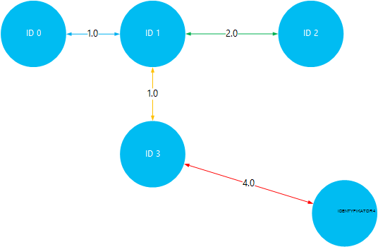

<properties
    pageTitle="Instalowanie i używanie Giraph na klastrów Hadoop w HDInsight | Microsoft Azure"
    description="Dowiedz się, jak dostosować klaster HDInsight z Giraph i jak używać funkcji Giraph."
    services="hdinsight"
    documentationCenter=""
    authors="nitinme"
    manager="jhubbard"
    editor="cgronlun"
    tags="azure-portal"/>

<tags
    ms.service="hdinsight"
    ms.workload="big-data"
    ms.tgt_pltfrm="na"
    ms.devlang="na"
    ms.topic="article"
    ms.date="02/05/2016"
    ms.author="nitinme"/>

# Instalowanie i używanie Giraph w HDInsight

Dowiedz się, jak dostosować klaster HDInsight systemu Windows z Giraph przy użyciu akcji skryptu i jak używać Giraph przetwarzania dużych wykresów. Aby uzyskać informacje na temat korzystania z systemem Linux klastrze Giraph zobacz [Instalowanie Giraph na HDInsight Hadoop klastrów (Linux)](hdinsight-hadoop-giraph-install-linux.md).
 
Możesz zainstalować Giraph na dowolnym typie klaster (Hadoop, burza, HBase, iskrowy) na Azure HDInsight za pomocą *Skryptu akcji*. Przykładowy skrypt, aby zainstalować Giraph w klastrze HDInsight jest dostępna z obiektów blob tylko do odczytu Azure miejsca do magazynowania w [https://hdiconfigactions.blob.core.windows.net/giraphconfigactionv01/giraph-installer-v01.ps1](https://hdiconfigactions.blob.core.windows.net/giraphconfigactionv01/giraph-installer-v01.ps1). Przykładowy skrypt działa tylko z usługi HDInsight klaster wersji 3.1. Aby uzyskać więcej informacji w wersjach klaster HDInsight zobacz [HDInsight klaster wersji](hdinsight-component-versioning.md).

**Artykuły pokrewne**

- [Instalowanie Giraph na HDInsight Hadoop klastrów (Linux).](hdinsight-hadoop-giraph-install-linux.md)
- [Tworzenie Hadoop klastrów w HDInsight](hdinsight-provision-clusters.md): ogólne informacje na temat tworzenia HDInsight klastrów.
- [Dostosowywanie przy użyciu akcji skryptu klaster HDInsight][hdinsight-cluster-customize]: ogólne informacje na temat dostosowywania klastrów HDInsight przy użyciu akcji skryptów.
- [Można opracowywać Akcja skrypt skrypty do HDInsight](hdinsight-hadoop-script-actions.md).

## Co to jest Giraph?

<a href="http://giraph.apache.org/" target="_blank">Apache Giraph</a> umożliwia wykonywanie wykresu przetwarzania przy użyciu Hadoop i mogą być używane z usługi HDInsight Azure. Wykresy modelu relacje między obiekty, takie jak połączenia między routerami w dużych sieci, takich jak Internet lub relacje między osoby w sieciach społecznościowych (nazywane społecznościowych wykresu). Przetwarzanie wykres umożliwia powodu o relacjach między obiektami na wykresie, takich jak:

- Identyfikowanie potencjalnych znajomych na podstawie Twojej bieżącej relacji.
- Identyfikowanie najkrótszą trasę między dwoma komputerami w sieci.
- Obliczanie pozycja strony stron sieci Web.

## Instalowanie Giraph za pomocą portalu

1. Mieli możliwość tworzenia klaster przy użyciu opcji **Utwórz niestandardowe** , zgodnie z opisem w [klastrów tworzenie Hadoop w HDInsight](hdinsight-provision-clusters.md#portal).
2. Na stronie **Skrypt akcji** kreatora kliknij przycisk **Dodaj akcję skryptu** o podanie szczegółowych informacji o akcji skryptu, tak jak pokazano poniżej:

    ![Używanie akcji skrypt dostosowywania klastrze] (./media/hdinsight-hadoop-giraph-install/hdi-script-action-giraph.png "Używanie akcji skrypt dostosowywania klastrze")

    <table border='1'>
        <tr><th>Właściwość</th><th>Wartość</th></tr>
        <tr><td>Nazwa</td>
            <td>Określ nazwę akcji skryptów. Na przykład <b>Giraph instalacji</b>.</td></tr>
        <tr><td>Skrypt identyfikator URI</td>
            <td>Określ identyfikator URI (Uniform Resource) do skrypt, który jest wywoływana, aby dostosować klaster. Na przykład <i>https://hdiconfigactions.blob.core.windows.net/giraphconfigactionv01/giraph-installer-v01.ps1</i></td></tr>
        <tr><td>Typ węzła</td>
            <td>Określ węzły, na których jest uruchamiany skrypt dostosowywania. Możesz wybrać <b>wszystkie węzły</b>, <b>tylko węzłów głowy</b>lub <b>tylko węzłów pracownika</b>.
        <tr><td>Parametry</td>
            <td>Określ parametry, jeśli jest to wymagane przez skrypt. Skrypt, aby zainstalować Giraph nie wymaga wszystkie parametry, więc możesz można pozostawić to pole puste.</td></tr>
    </table>

    Możesz dodać więcej niż jedną akcję skrypt do zainstalowania wielu składników w klastrze. Po dodaniu skryptów kliknij znacznik wyboru, aby rozpocząć tworzenie klaster.

## Za pomocą Giraph

Firma Microsoft korzysta z przykład SimpleShortestPathsComputation w celu zademonstrowania podstawowe implementacji <a href = "http://people.apache.org/~edwardyoon/documents/pregel.pdf">Pregel</a> znajdowania najkrótszy ścieżkę między obiektami na wykresie. Wykonaj następujące czynności do przekazania przykładowych danych i słoik próbki, uruchamiając w tym przykładzie SimpleShortestPathsComputation zadanie, a następnie wyświetlanie wyników.

1. Przekaż przykładowy plik danych z magazynem obiektów Blob platformy Azure. Na lokalnej stacji roboczej Utwórz nowy plik o nazwie **tiny_graph.txt**. Powinien zawierać następujące wiersze:

        [0,0,[[1,1],[3,3]]]
        [1,0,[[0,1],[2,2],[3,1]]]
        [2,0,[[1,2],[4,4]]]
        [3,0,[[0,3],[1,1],[4,4]]]
        [4,0,[[3,4],[2,4]]]

    Przekaż plik tiny_graph.txt do podstawowego miejsca do magazynowania dla klaster HDInsight. Aby uzyskać instrukcje na temat przekazywania danych zobacz [przekazywanie danych dla zadań Hadoop w HDInsight](hdinsight-upload-data.md).

    Te dane w tym artykule opisano relacji między obiektami na wykresie bezpośrednie, stosując format [źródła\_identyfikator, źródła\_wartość, [[dest\_identyfikator], [krawędź\_wartość]...]]. Każdy wiersz reprezentuje relację między **źródła\_identyfikator** obiektu i co najmniej jednym **dest\_identyfikator** obiektów. **Krawędź\_wartość** (lub grubość) można traktować jako siłę lub odległość połączenia między **source_id** i **dest\_identyfikator**.

    Zmiany, i używania wartość (lub grubość) jako odległości między obiektami, powyższych danych może wyglądać podobnie do następującej:

    

4. Uruchom w przykładzie SimpleShortestPathsComputation. Następujące polecenia cmdlet programu PowerShell Azure umożliwia uruchamianie w przykładzie przy użyciu tego pliku tiny_graph.txt jako danych wejściowych. 

    [AZURE.INCLUDE [upgrade-powershell](../../includes/hdinsight-use-latest-powershell.md)]

        $clusterName = "clustername"
        # Giraph examples jar
        $jarFile = "wasbs:///example/jars/giraph-examples.jar"
        # Arguments for this job
        $jobArguments = "org.apache.giraph.examples.SimpleShortestPathsComputation",
                        "-ca", "mapred.job.tracker=headnodehost:9010",
                        "-vif", "org.apache.giraph.io.formats.JsonLongDoubleFloatDoubleVertexInputFormat",
                        "-vip", "wasbs:///example/data/tiny_graph.txt",
                        "-vof", "org.apache.giraph.io.formats.IdWithValueTextOutputFormat",
                        "-op",  "wasbs:///example/output/shortestpaths",
                        "-w", "2"
        # Create the definition
        $jobDefinition = New-AzureHDInsightMapReduceJobDefinition
          -JarFile $jarFile
          -ClassName "org.apache.giraph.GiraphRunner"
          -Arguments $jobArguments

        # Run the job, write output to the Azure PowerShell window
        $job = Start-AzureHDInsightJob -Cluster $clusterName -JobDefinition $jobDefinition
        Write-Host "Wait for the job to complete ..." -ForegroundColor Green
        Wait-AzureHDInsightJob -Job $job
        Write-Host "STDERR"
        Get-AzureHDInsightJobOutput -Cluster $clusterName -JobId $job.JobId -StandardError
        Write-Host "Display the standard output ..." -ForegroundColor Green
        Get-AzureHDInsightJobOutput -Cluster $clusterName -JobId $job.JobId -StandardOutput

    W powyższym przykładzie Zamień **NazwaKlastra** o nazwie zawierającej Giraph zainstalowany klaster HDInsight.

5. Wyświetlanie wyników. Po zakończeniu zadania, wyniki będą przechowywane na dwa pliki wyjściowe w __wasbs: / / / przykład limit shotestpaths__ folder. Pliki są nazywane __części m-00001__ i __części m-00002__. Wykonaj poniższe czynności, aby pobrać i wyświetlić wyniki:

        $subscriptionName = "<SubscriptionName>"       # Azure subscription name
        $storageAccountName = "<StorageAccountName>"   # Azure Storage account name
        $containerName = "<ContainerName>"             # Blob storage container name

        # Select the current subscription
        Select-AzureSubscription $subscriptionName

        # Create the Storage account context object
        $storageAccountKey = Get-AzureStorageKey $storageAccountName | %{ $_.Primary }
        $storageContext = New-AzureStorageContext -StorageAccountName $storageAccountName -StorageAccountKey $storageAccountKey

        # Download the job output to the workstation
        Get-AzureStorageBlobContent -Container $containerName -Blob example/output/shortestpaths/part-m-00001 -Context $storageContext -Force
        Get-AzureStorageBlobContent -Container $containerName -Blob example/output/shortestpaths/part-m-00002 -Context $storageContext -Force

    To będzie tworzenie struktury katalogu __przykładzie-dane wyjściowe i shortestpaths__ w bieżącym katalogu w miejscu pracy i pobieranie plików dwa wyjścia do tej lokalizacji.

    Aby wyświetlić zawartość pliku, należy użyć polecenia cmdlet __kot__ :

        Cat example/output/shortestpaths/part*

    Wynik powinna wyglądać podobnie do następującej:

        0   1.0
        4   5.0
        2   2.0
        1   0.0
        3   1.0

    SimpleShortestPathComputation, które przykład trudno jest kodowane zaczynać się obiekt ID 1 i Znajdź najkrótszą ścieżką do innych obiektów. Aby dane wyjściowe są odczytywane jako `destination_id distance`, gdzie odległość jest wartość (lub grubość) krawędzie w czasie podróży między obiektu ID 1 i identyfikatora docelowej.

    To wizualizacji, możesz sprawdzić wyniki przez podróże najkrótszy ścieżek między ID 1 i innych obiektów. Należy zauważyć, że ścieżka najkrótszy między ID 1 i 4 identyfikator jest 5. To jest całkowita odległość między ID 1 i 3, a następnie identyfikator 3 i 4.

    

## Instalowanie przy użyciu programu Aure PowerShell Giraph

Zobacz [Dostosowywanie HDInsight klastrów przy użyciu akcji skryptów](hdinsight-hadoop-customize-cluster.md#call_scripts_using_powershell).  W przykładzie pokazano, jak zainstalować Spark przy użyciu programu PowerShell Azure. Musisz dostosować skrypt, aby użyć [https://hdiconfigactions.blob.core.windows.net/giraphconfigactionv01/giraph-installer-v01.ps1](https://hdiconfigactions.blob.core.windows.net/giraphconfigactionv01/giraph-installer-v01.ps1).

## Instalowanie przy użyciu zestawu SDK .NET Giraph

Zobacz [Dostosowywanie HDInsight klastrów przy użyciu akcji skryptów](hdinsight-hadoop-customize-cluster.md#call_scripts_using_azure_powershell). W przykładzie pokazano, jak zainstalować Spark przy użyciu zestawu SDK .NET. Musisz dostosować skrypt, aby użyć [https://hdiconfigactions.blob.core.windows.net/giraphconfigactionv01/giraph-installer-v01.ps1](https://hdiconfigactions.blob.core.windows.net/giraphconfigactionv01/giraph-installer-v01.ps1).

## Zobacz też

- [Instalowanie Giraph na HDInsight Hadoop klastrów (Linux).](hdinsight-hadoop-giraph-install-linux.md)
- [Tworzenie Hadoop klastrów w HDInsight](hdinsight-provision-clusters.md): ogólne informacje na temat tworzenia HDInsight klastrów.
- [Dostosowywanie przy użyciu akcji skryptu klaster HDInsight][hdinsight-cluster-customize]: ogólne informacje na temat dostosowywania klastrów HDInsight przy użyciu akcji skryptów.
- [Akcja skrypt można opracowywać skrypty do HDInsight](hdinsight-hadoop-script-actions.md).
- [Instalowanie i używanie Spark na klastrów HDInsight][hdinsight-install-spark]: Przykładowy skrypt akcji o instalowaniu Spark.
- [Instalowanie R na klastrów HDInsight][hdinsight-install-r]: Przykładowy skrypt akcji o instalowaniu R.
- [Instalowanie Solr na HDInsight klastrów](hdinsight-hadoop-solr-install.md): Przykładowy skrypt akcji o instalowaniu Solr.

[tools]: https://github.com/Blackmist/hdinsight-tools
[aps]: http://azure.microsoft.com/documentation/articles/install-configure-powershell/

[powershell-install]: ../powershell-install-configure.md
[hdinsight-provision]: hdinsight-provision-clusters.md
[hdinsight-install-r]: hdinsight-hadoop-r-scripts.md
[hdinsight-install-spark]: hdinsight-hadoop-spark-install.md
[hdinsight-cluster-customize]: hdinsight-hadoop-customize-cluster.md
