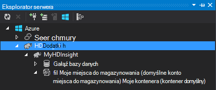
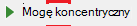

<properties
    pageTitle="Za pomocą C# gałąź i świnka na Hadoop w HDInsight | Microsoft Azure"
    description="Dowiedz się, jak funkcji C# zdefiniowane przez użytkownika (UDF) z gałęzi i świnka streaming w Azure HDInsight."
    services="hdinsight"
    documentationCenter=""
    authors="Blackmist"
    manager="jhubbard"
    editor="cgronlun"
    tags="azure-portal"/>

<tags
    ms.service="hdinsight"
    ms.workload="big-data"
    ms.tgt_pltfrm="na"
    ms.devlang="dotnet"
    ms.topic="article"
    ms.date="10/28/2016"
    ms.author="larryfr"/>

#C# funkcje zdefiniowane za pomocą gałąź i świnka streaming na Hadoop w HDInsight

Gałąź i świnka doskonale nadają się do pracy z danymi w Azure HDInsight, ale czasami potrzebujesz więcej ogólnego zastosowania języka. Zarówno gałęzi i świnka umożliwiają połączenie kodu zewnętrznego przez funkcje zdefiniowane przez użytkownika (UDF) lub strumieniowego przesyłania.

W tym dokumencie Dowiedz się, jak używać C# gałęzi i świnka.

##Wymagania wstępne

* System Windows 7 lub nowszy.

* Program Visual Studio z następujących wersji:

    * Program Visual Studio 2012 Professional i Premium i Ultimate w przypadku [aktualizacji 4](http://www.microsoft.com/download/details.aspx?id=39305)

    * Visual Studio 2013 społeczności i Professional i Premium i Ultimate w przypadku [aktualizacji 4](https://www.microsoft.com/download/details.aspx?id=44921)

    * Visual Studio 2015 r.

* Hadoop w klastrze HDInsight — zobacz [Obsługa administracyjna klaster HDInsight](hdinsight-provision-clusters.md) czynności aby utworzyć klaster

* Narzędzia Hadoop programu Visual Studio. Instrukcje dotyczące instalowania i konfigurowania narzędzi, zobacz [Wprowadzenie do korzystania z usługi HDInsight Hadoop narzędzia programu Visual Studio](hdinsight-hadoop-visual-studio-tools-get-started.md) .

##.NET na HDInsight

.NET języka wspólnego (CLR) i struktury są instalowane domyślnie na klastrów HDInsight systemu Windows. Dzięki temu można używać aplikacji C# gałęzi i świnka streaming (dane są przekazywane między gałęzi-świnka i aplikacji C# za pośrednictwem stdout-stdin).

> [AZURE.NOTE] Jest obecnie uruchomionych dla klastrów systemem Linux HDInsight .NET Framework funkcji zdefiniowanych przez użytkownika nie są obsługiwane. 

##.NET i przesyłanie strumieniowe

Przesyłanie strumieniowe obejmuje gałęzi i świnka przekazaniem do zewnętrznej aplikacji na stdout i odbierania wyników za pośrednictwem stdin. Dla aplikacji C# jest to najłatwiej osiągnąć przy użyciu `Console.ReadLine()` i `Console.WriteLine()`.

Ponieważ gałąź i świnka potrzeba wywołania aplikacji w czasie wykonywania, szablon **Aplikacji konsoli** stosuje się w przypadku projektów C#.

##Gałąź i C# 35;

###Tworzenie projektu C#

1. Otwórz program Visual Studio i utworzenie nowego rozwiązania. Dla typu projektu wybierz **Aplikację konsoli**i nazwę nowego projektu **HiveCSharp**.

2. Zamień zawartość **Plik Program.cs** następujące czynności:

        using System;
        using System.Security.Cryptography;
        using System.Text;
        using System.Threading.Tasks;

        namespace HiveCSharp
        {
            class Program
            {
                static void Main(string[] args)
                {
                    string line;
                    // Read stdin in a loop
                    while ((line = Console.ReadLine()) != null)
                    {
                        // Parse the string, trimming line feeds
                        // and splitting fields at tabs
                        line = line.TrimEnd('\n');
                        string[] field = line.Split('\t');
                        string phoneLabel = field[1] + ' ' + field[2];
                        // Emit new data to stdout, delimited by tabs
                        Console.WriteLine("{0}\t{1}\t{2}", field[0], phoneLabel, GetMD5Hash(phoneLabel));
                    }
                }
                /// 

                /// Returns an MD5 hash for the given string
                /// 

                /// <param name="input">string value</param>
                /// <returns>an MD5 hash</returns>
                static string GetMD5Hash(string input)
                {
                    // Step 1, calculate MD5 hash from input
                    MD5 md5 = System.Security.Cryptography.MD5.Create();
                    byte[] inputBytes = System.Text.Encoding.ASCII.GetBytes(input);
                    byte[] hash = md5.ComputeHash(inputBytes);

                    // Step 2, convert byte array to hex string
                    StringBuilder sb = new StringBuilder();
                    for (int i = 0; i < hash.Length; i++)
                    {
                        sb.Append(hash[i].ToString("x2"));
                    }
                    return sb.ToString();
                }
            }
        }

3. Tworzenie projektu.

###Przekazywanie do miejsca do magazynowania

1. W programie Visual Studio Otwórz **Eksploratora serwera**.

3. Rozwiń **Azure**, a następnie rozwiń węzeł **HDInsight**.

4. Jeśli zostanie wyświetlony monit, wprowadź poświadczenia Azure subskrypcji, a następnie kliknij **Zaloguj się**.

5. Rozwiń klaster HDInsight, którą chcesz wdrożyć tę aplikację do, a następnie rozwiń **Domyślnego konta miejsca do magazynowania**.

    

6. Kliknij dwukrotnie klastrze **Domyślne kontener** . Zostanie otwarte nowe okno, w którym jest wyświetlana zawartość domyślnego kontenera.

7. Kliknij ikonę Przekaż, a następnie przejdź do folderu **bin\debug** projektu **HiveCSharp** . Na koniec wybierz plik **HiveCSharp.exe** i kliknij przycisk **Ok**.

    

8. Po zakończeniu przekazywania, można użyć aplikacji z kwerendy gałęzi.

###Gałąź kwerendy

1. W programie Visual Studio Otwórz **Eksploratora serwera**.

2. Rozwiń **Azure**, a następnie rozwiń węzeł **HDInsight**.

5. Kliknij prawym przyciskiem myszy klaster wdrożony **HiveCSharp** aplikacji, a następnie wybierz **napisać kwerendę gałęzi**.

6. Użyj następującego zapytania gałęzi:

        add file wasbs:///HiveCSharp.exe;

        SELECT TRANSFORM (clientid, devicemake, devicemodel)
        USING 'HiveCSharp.exe' AS
        (clientid string, phoneLabel string, phoneHash string)
        FROM hivesampletable
        ORDER BY clientid LIMIT 50;

    Po wybraniu tej opcji `clientid`, `devicemake`, i `devicemodel` pól z `hivesampletable`i przekazuje pola do aplikacji HiveCSharp.exe. Kwerenda oczekuje aplikacji, aby powrócić trzy pola, które są przechowywane jako `clientid`, `phoneLabel`, i `phoneHash`. Kwerenda oczekuje także znaleźć HiveCSharp.exe w katalogu głównym kontenera domyślnego magazynu (`add file wasbs:///HiveCSharp.exe`).

5. Kliknij przycisk **Prześlij** , aby przesłać zadanie do klastrów HDInsight. Zostanie otwarte okno **Gałęzi podsumowanie zadań** .

6. Kliknij przycisk **Odśwież** , aby odświeżyć podsumowania, aż zmieni **Stan zadania** **wykonane**. Aby wyświetlić wynik zadania, kliknij przycisk **Wyjście zadania**.

##Świnka i C# 35;

###Tworzenie projektu C#

1. Otwórz program Visual Studio i utworzenie nowego rozwiązania. Dla typu projektu wybierz **Aplikację konsoli**i nazwę nowego projektu **PigUDF**.

2. Zamień zawartość pliku **Plik Program.cs** następujące czynności:

        using System;

        namespace PigUDF
        {
            class Program
            {
                static void Main(string[] args)
                {
                    string line;
                    // Read stdin in a loop
                    while ((line = Console.ReadLine()) != null)
                    {
                        // Fix formatting on lines that begin with an exception
                        if(line.StartsWith("java.lang.Exception"))
                        {
                            // Trim the error info off the beginning and add a note to the end of the line
                            line = line.Remove(0, 21) + " - java.lang.Exception";
                        }
                        // Split the fields apart at tab characters
                        string[] field = line.Split('\t');
                        // Put fields back together for writing
                        Console.WriteLine(String.Join("\t",field));
                    }
                }
            }
        }

    Ta aplikacja analizuje linie wysłanych z świnka i linie sformatowanie, których nazwy zaczynają się od `java.lang.Exception`.

3. Zapisz **Plik Program.cs**, a następnie utwórz projekt.

###Przekazywanie aplikacji

1. Świnka streaming oczekuje lokalnych w systemie plików klaster aplikacji. Włączanie pulpitu zdalnego dla klastrów HDInsight, a następnie podłącz do niego zgodnie z instrukcjami na [Nawiązywanie połączenia przy użyciu RDP klastrów HDInsight](hdinsight-administer-use-management-portal.md#rdp).

2. Po połączeniu, skopiuj **PigUDF.exe** z katalogu **Kosza debugowania** projektu PigUDF na komputerze lokalnym, a następnie wklej go do katalogu **PIG_HOME %** w klastrze.

###Za pomocą aplikacji z łaciński świnka

1. Z sesji pulpitu zdalnego uruchom polecenie Hadoop przy użyciu ikony **Hadoop wiersza polecenia** na komputerze.

2. Uruchom polecenie świnka należy wykonać następujące kroki:

        cd %PIG_HOME%
        bin\pig

    Zostanie wyświetlona z `grunt>` wiersza.

3. Wprowadź poniższe czynności, aby uruchomić prosty zadanie świnka przy użyciu aplikacji .NET Framework:

        DEFINE streamer `pigudf.exe` SHIP('pigudf.exe');
        LOGS = LOAD 'wasbs:///example/data/sample.log' as (LINE:chararray);
        LOG = FILTER LOGS by LINE is not null;
        DETAILS = STREAM LOG through streamer as (col1, col2, col3, col4, col5);
        DUMP DETAILS;

    `DEFINE` Instrukcja tworzy alias `streamer` dla aplikacji pigudf.exe i `SHIP` przekazać go w węzłach w klastrze. Później `streamer` jest używana z `STREAM` operator przetwarzanie pojedynczych wierszy zawarte w dzienniku i przekazać je jako serię kolumn.

> [AZURE.NOTE] Nazwę aplikacji, która jest używana do przesyłania strumieniowego muszą być ujęte w \` (backtick) kiedy znaków, ponieważ i "(cudzysłów pojedynczy) używanego z systemami `SHIP`.

3. Po wprowadzeniu ostatniego wiersza, nazwa powinna rozpoczynać zadania. Po pewnym czasie zwróci wynik podobny do następującego:

        (2012-02-03 20:11:56 SampleClass5 [WARN] problem finding id 1358451042 - java.lang.Exception)
        (2012-02-03 20:11:56 SampleClass5 [DEBUG] detail for id 1976092771)
        (2012-02-03 20:11:56 SampleClass5 [TRACE] verbose detail for id 1317358561)
        (2012-02-03 20:11:56 SampleClass5 [TRACE] verbose detail for id 1737534798)
        (2012-02-03 20:11:56 SampleClass7 [DEBUG] detail for id 1475865947)

##Podsumowanie

W tym dokumencie zapoznaniu do korzystania z aplikacji .NET Framework z gałęzi i świnka na HDInsight. Jeśli chcesz dowiedzieć się, jak używać Python gałęzi i świnka, zobacz [Używanie Python z gałęzi i świnka w HDInsight](hdinsight-python.md).

Dla innych sposobów używania świnka i gałęzi i informacje o korzystaniu z MapReduce zobacz następujące artykuły:

* [Gałąź za pomocą usługi HDInsight](hdinsight-use-hive.md)

* [Świnka korzystanie z usługi HDInsight](hdinsight-use-pig.md)

* [Używanie MapReduce z usługi HDInsight](hdinsight-use-mapreduce.md)
