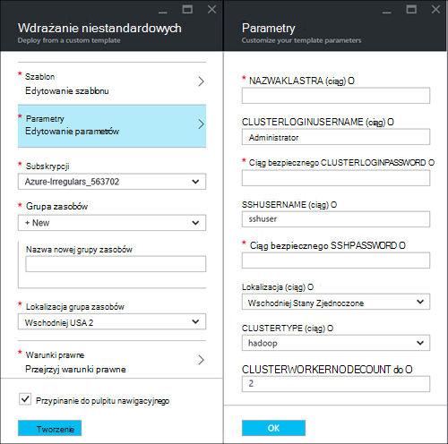
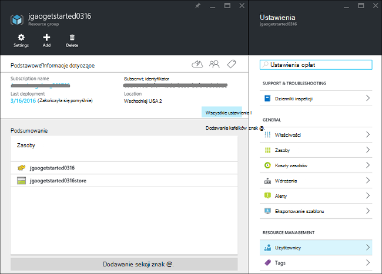
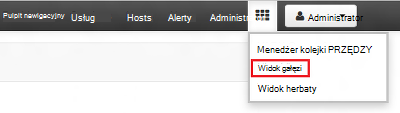
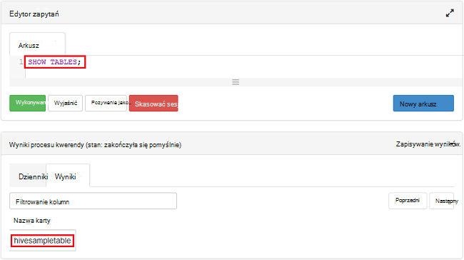

<properties
    pageTitle="Linux samouczek: wprowadzenie do Hadoop i gałęzi | Microsoft Azure"
    description="Skorzystać z tego samouczka Linux, aby rozpocząć używanie Hadoop w HDInsight. Dowiedz się, jak inicjowanie obsługi klastrów Linux i kwerendy danych za pomocą gałęzi."
    services="hdinsight"
    documentationCenter=""
    authors="mumian"
    manager="jhubbard"
    editor="cgronlun"
    tags="azure-portal"/>

<tags
    ms.service="hdinsight"
    ms.devlang="na"
    ms.topic="hero-article"
    ms.tgt_pltfrm="na"
    ms.workload="big-data"
    ms.date="09/14/2016"
    ms.author="jgao"/>

# Hadoop samouczek: wprowadzenie do korzystania z systemem Linux Hadoop w HDInsight

> [AZURE.SELECTOR]
- [Systemem Linux](hdinsight-hadoop-linux-tutorial-get-started.md)
- [Systemu Windows](hdinsight-hadoop-tutorial-get-started-windows.md)

Sprawdzanie Tworzenie klastrów systemem Linux [Hadoop](http://hadoop.apache.org/) w HDInsight i wykonywanie zadań gałąź HDInsight. [Gałąź Apache](https://hive.apache.org/) jest składnik najpopularniejszych w ekosystemie Hadoop. Obecnie HDInsight zawiera 4 klaster różne typy: [Hadoop](hdinsight-hadoop-introduction.md), [Spark](hdinsight-apache-spark-overview.md), [HBase](hdinsight-hbase-overview.md) i [Burza](hdinsight-storm-overview.md).  Każdego typu klaster obsługuje inny zestaw składników. Wszystkie typy 4 klaster obsługuje gałęzi. Aby uzyskać listę obsługiwanych składników usługi HDInsight, zobacz [Co nowego w wersji klaster Hadoop dostarczony przez HDInsight?](hdinsight-component-versioning.md)  

[AZURE.INCLUDE [delete-cluster-warning](../../includes/hdinsight-delete-cluster-warning.md)]

## Wymagania wstępne

Przed rozpoczęciem tego samouczka, musisz mieć:

- **Azure subskrypcji**: Aby utworzyć bezpłatne konto wersji próbnej jednego miesiąca, przejdź do [azure.microsoft.com/free](https://azure.microsoft.com/free).

### Wymagania dotyczące kontroli dostępu

[AZURE.INCLUDE [access-control](../../includes/hdinsight-access-control-requirements.md)]

## Utwórz klaster

Większość zadań Hadoop to zadań. Możesz utworzyć klaster, uruchamianie niektórych zadań, a następnie usuń klaster. W tej sekcji utworzysz klastrze systemem Linux Hadoop w HDInsight przy użyciu [szablonu Azure Menedżera zasobów](../resource-group-template-deploy.md). Szablon Menedżera zasobów jest w pełni dostosować; ułatwia tworzenie Azure zasoby, takie jak HDInsight. Menedżer zasobów szablonu obsługi nie jest wymagane dla po tym samouczku. Inne metody tworzenia klaster i opis właściwości używane w tym samouczku zobacz [Tworzenie HDInsight klastrów](hdinsight-hadoop-provision-linux-clusters.md). Szablon Menedżera zasobów używanych w tym samouczku znajduje się w kontenerze publicznej obiektów blob, [https://hditutorialdata.blob.core.windows.net/armtemplates/create-linux-based-hadoop-cluster-in-hdinsight.json](https://hditutorialdata.blob.core.windows.net/armtemplates/create-linux-based-hadoop-cluster-in-hdinsight.json). 

1. Kliknij obraz następujące czynności, aby zalogować się do Azure i otwórz szablon Menedżera zasobów w Azure Portal. 

    

2. Z karta **Parametry** wprowadź następujące informacje:

    .

    - **NazwaKlastra**: Wprowadź nazwę klaster Hadoop, który ma zostać utworzony.
    - **Klaster nazwę logowania i hasło**: domyślna nazwa logowania to **administratora**.
    - **SSH nazwy użytkownika i hasła**: domyślna nazwa użytkownika to **sshuser**.  Można zmienić jej nazwę. 
    
    Inne parametry są opcjonalne dla po tym samouczku. Możesz pozostawić je w razie. 
    
    Każdy klaster ma zależność konta magazyn obiektów Blob platformy Azure. Zazwyczaj jest on określany jako konto domyślne miejsca do magazynowania. Klaster HDInsight i jego domyślne konto miejsca do magazynowania muszą być Współtworzenie umieszczone w tym samym regionie Azure. Usuwanie klastrów nie spowoduje usunięcia konta miejsca do magazynowania. W szablonie nazwę konta magazynu domyślnego jest definiowana jako nazwę klaster z dodanym "store". 
    
3. Kliknij **przycisk OK** , aby zapisać parametry.
4. Z karta **wdrożenia niestandardowe** wprowadź **nową nazwę grupy zasobów** , aby utworzyć nową grupę zasobów.  Grupa zasobów jest kontenerem grupującego klastrem, konto zależne miejsca do magazynowania i innych s. Lokalizacja grupy zasobów mogą się różnić od lokalizacji klaster.
5. Kliknij pozycję **warunki prawne**, a następnie kliknij przycisk **Utwórz**.
6. Sprawdź **numer Pin do pulpitu nawigacyjnego** pole wyboru jest zaznaczone, a następnie kliknij **Utwórz**. Zostanie wyświetlony fragment zatytułowany **rozmieszczania wdrażanie szablonu**. Wystarczy o około 20 minut Aby utworzyć klaster. 
7.  Po utworzeniu klaster podpis fragmentu zostanie zmieniona na podanej nazwy grupy zasobów. I portalu otwierany automatycznie dwie karty z klastrem i ustawienia klaster. 

    .

    Istnieją dwa zasoby na liście i klastrze domyślne konto miejsca do magazynowania.

##Uruchamianie kwerend gałęzi

[Gałąź Apache](hdinsight-use-hive.md) jest składnik najpopularniejszych używane w HDInsight. Istnieje wiele sposobów wykonywanie zadań gałąź HDInsight. W tym samouczku widoku gałąź Ambari z portalu użyje do uruchomienia niektórych zadań gałęzi. Dla innych metod składania gałęzi zadań zobacz [Używanie gałęzi w HDInsight](hdinsight-use-hive.md).

1. Przejdź do **https://&lt;NazwaKlastra >. azurehdinsight.net**, gdzie &lt;NazwaKlastra > jest klaster został utworzony w poprzedniej sekcji, aby otworzyć Ambari.
2. Wprowadź Hadoop użytkownika i hasło, które określone w poprzedniej sekcji. Domyślna nazwa użytkownika to **administratora**.
3. Otwórz **Widok gałęzi** , jak pokazano w poniższej zrzut ekranu:

    .
4. W sekcji __Edytora zapytań__ strony wklej poniższe instrukcje HiveQL w arkuszu:

        SHOW TABLES;

    >[AZURE.NOTE] Średnik jest wymagane przez gałęzi.       
        
5. Kliknij przycisk __Wykonaj__. Sekcja __Wyniki procesu kwerendy__ należy są wyświetlane poniżej edytora zapytań i wyświetlać informacje o zadaniu. 

    Po zakończeniu kwerendy, sekcji __Proces wyniki__ są wyświetlane wyniki operacji. Zapewniają jednej tabeli o nazwie **hivesampletable**. Poniższa tabela gałęzi oferowanych wszystkich klastrów HDInsight.

    .

6. Powtórz kroki 4 i 5, aby uruchomić kwerendę następujące czynności:

        SELECT * FROM hivesampletable;

    > [AZURE.TIP] Uwaga listy rozwijanej __Zapisz wyniki__ w lewym górnym rogu sekcji __Wyniki procesu kwerendy__ . za pomocą tego programu do pobierania wyników lub zapisywanie ich do magazynu HDInsight jako pliku CSV.

7. Kliknij przycisk **Historia** , aby uzyskać listę zadań.

Po zakończeniu zadania gałęzi, możesz [wyeksportować wyniki do bazy danych Azure SQL lub bazy danych programu SQL Server](hdinsight-use-sqoop-mac-linux.md), możesz także [wizualizowanie wyników za pomocą programu Excel](hdinsight-connect-excel-power-query.md). Aby uzyskać więcej informacji o używaniu gałąź w HDInsight zobacz [Używanie gałęzi i HiveQL z Hadoop w HDInsight do analizowania przykładowy plik log4j Apache](hdinsight-use-hive.md).

##Oczyść przerabiania samouczka

Po ukończeniu samouczka można usunąć klaster. Z usługi HDInsight dane są przechowywane w magazynie Azure, więc można bezpiecznie usunąć klaster, gdy nie jest używany. Możesz również są naliczane dla klastrów HDInsight nawet wtedy, gdy nie jest używany. Ponieważ opłaty za klaster są wielokrotnie większe niż opłaty za miejsca do magazynowania, warto ekonomicznych usuwanie klastrów, gdy nie są one używane. 

>[AZURE.NOTE] Przy użyciu [Azure Factory danych](hdinsight-hadoop-create-linux-clusters-adf.md), można utworzyć klastrów HDInsight na żądanie i ustawienie licznika TimeToLive umożliwia automatyczne usuwanie klastrów. 

**Aby usunąć klaster i/lub domyślne konto miejsca do magazynowania**

1. Zaloguj się do [portalu Azure](https://portal.azure.com).
2. Na pulpicie nawigacyjnym portalu kliknij Kafelek użytą podczas tworzenia klaster Nazwa grupy zasobów.
3. Kliknij polecenie **Usuń** w karta zasobów, aby usunąć grupy zasobów, która zawiera klaster i domyślne konto miejsca do magazynowania; lub kliknij nazwę klaster na kafelku **zasobów** , a następnie kliknij polecenie **Usuń karta klaster** . Uwaga usunięcie grupy zasobów będzie Usuń konto miejsca do magazynowania. Jeśli chcesz zachować konta miejsca do magazynowania, wybierz pozycję usunąć tylko klaster.

## Następne kroki

W tym samouczku zapewne wiesz, jak utworzyć klaster systemem Linux HDInsight za pomocą szablonu Menedżera zasobów i sposób wykonywania podstawowych kwerend gałęzi.

Aby dowiedzieć się więcej na temat analizowania danych z usługi HDInsight, zobacz następujące artykuły:

- Aby dowiedzieć się więcej o korzystaniu z usługi HDInsight gałęzi, włącznie ze sposobem wykonywania kwerend gałęzi z programu Visual Studio, zobacz [Gałęzi korzystanie z usługi HDInsight][hdinsight-use-hive].

- Aby uzyskać informacje o świnka, język używany do przekształcania danych, zobacz [Świnka korzystanie z usługi HDInsight][hdinsight-use-pig].

- Aby uzyskać informacje o MapReduce, umożliwia pisanie programów, które przetwarzania danych na Hadoop, zobacz [MapReduce korzystanie z usługi HDInsight][hdinsight-use-mapreduce].

- Aby uzyskać informacje o przy użyciu narzędzia HDInsight programu Visual Studio do analizowania danych na HDInsight, zobacz [rozpocząć korzystanie z narzędzia Visual Studio Hadoop dla HDInsight](hdinsight-hadoop-visual-studio-tools-get-started.md).

Jeśli możesz już rozpocząć pracę ze swoich danych i chcesz dowiedzieć się więcej o jak HDInsight są przechowywane dane lub jak pobieranie danych do usługi HDInsight, zobacz następujące artykuły:

- Aby uzyskać informacje o używaniu magazynem obiektów blob Azure HDInsight zobacz [Magazyn obiektów Blob platformy Azure korzystanie z usługi HDInsight](hdinsight-hadoop-use-blob-storage.md).

- Aby uzyskać informacje o tym, jak przekazać danych do usługi HDInsight, zobacz [przekazywanie danych do HDInsight][hdinsight-upload-data].

Jeśli chcesz dowiedzieć się więcej na temat tworzenia lub Zarządzanie klastrem HDInsight, zobacz następujące artykuły:

- Aby dowiedzieć się o zarządzaniu klaster systemem Linux HDInsight, zobacz [Zarządzanie HDInsight klastrów przy użyciu Ambari](hdinsight-hadoop-manage-ambari.md).

- Aby uzyskać więcej informacji na temat opcji, które można wybrać podczas tworzenia klaster HDInsight, zobacz [Tworzenie HDInsight na Linux za pomocą opcji niestandardowych](hdinsight-hadoop-provision-linux-clusters.md).

- Jeśli zna Linux oraz Hadoop, ale chcesz dowiedzieć się informacjami o Hadoop na HDInsight, zobacz [Praca z usługi HDInsight w systemie Linux](hdinsight-hadoop-linux-information.md). To informacje takie jak:

    * Adresy URL dla usług dostępnych w grupie, takie jak Ambari i WebHCat
    * Lokalizacja plików Hadoop i przykłady lokalnego systemu plików
    * Korzystanie z platformy Azure przestrzeni dyskowej (WASB) zamiast HDFS jako domyślnych danych przechowywania

[1]: ../HDInsight/hdinsight-hadoop-visual-studio-tools-get-started.md

[hdinsight-provision]: hdinsight-provision-clusters.md
[hdinsight-admin-powershell]: hdinsight-administer-use-powershell.md
[hdinsight-upload-data]: hdinsight-upload-data.md
[hdinsight-use-mapreduce]: hdinsight-use-mapreduce.md
[hdinsight-use-hive]: hdinsight-use-hive.md
[hdinsight-use-pig]: hdinsight-use-pig.md

[powershell-download]: http://go.microsoft.com/fwlink/p/?linkid=320376&clcid=0x409
[powershell-install-configure]: powershell-install-configure.md
[powershell-open]: powershell-install-configure.md#Install

[img-hdi-dashboard]: ./media/hdinsight-hadoop-tutorial-get-started-windows/HDI.dashboard.png
[img-hdi-dashboard-query-select]: ./media/hdinsight-hadoop-tutorial-get-started-windows/HDI.dashboard.query.select.png
[img-hdi-dashboard-query-select-result]: ./media/hdinsight-hadoop-tutorial-get-started-windows/HDI.dashboard.query.select.result.png
[img-hdi-dashboard-query-select-result-output]: ./media/hdinsight-hadoop-tutorial-get-started-windows/HDI.dashboard.query.select.result.output.png
[img-hdi-dashboard-query-browse-output]: ./media/hdinsight-hadoop-tutorial-get-started-windows/HDI.dashboard.query.browse.output.png
[image-hdi-clusterstatus]: ./media/hdinsight-hadoop-tutorial-get-started-windows/HDI.ClusterStatus.png
[image-hdi-gettingstarted-powerquery-importdata]: ./media/hdinsight-hadoop-tutorial-get-started-windows/HDI.GettingStarted.PowerQuery.ImportData.png
[image-hdi-gettingstarted-powerquery-importdata2]: ./media/hdinsight-hadoop-tutorial-get-started-windows/HDI.GettingStarted.PowerQuery.ImportData2.png
