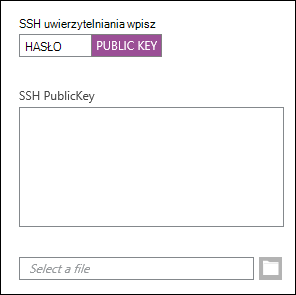
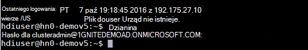
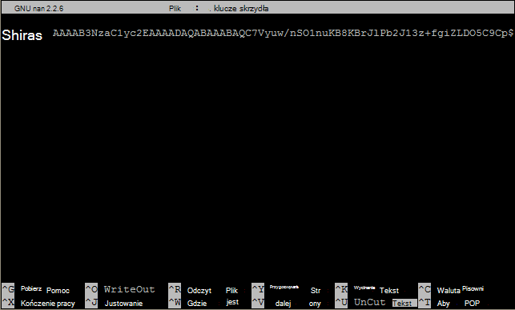

<properties
   pageTitle="Użyj klawiszy SSH z systemem Linux Hadoop z Linux, Unix lub OS X | Microsoft Azure"
   description=" Można uzyskać dostęp za pomocą Secure Shell (SSH) usługi oparte na systemie Linux HDInsight. Niniejszy dokument zawiera informacje dotyczące używania SSH z HDInsight z klientów systemu Linux, Unix lub OS X."
   services="hdinsight"
   documentationCenter=""
   authors="Blackmist"
   manager="jhubbard"
   editor="cgronlun"
    tags="azure-portal"/>

<tags
   ms.service="hdinsight"
   ms.devlang="na"
   ms.topic="get-started-article"
   ms.tgt_pltfrm="na"
   ms.workload="big-data"
   ms.date="09/13/2016"
   ms.author="larryfr"/>

#<a name="use-ssh-with-linux-based-hadoop-on-hdinsight-from-linux-unix-or-os-x"></a>Za subskrypcje opartych na systemie Linux Hadoop na HDInsight z Linux, Unix lub OS X

> [AZURE.SELECTOR]
- [Systemu Windows](hdinsight-hadoop-linux-use-ssh-windows.md)
- [Linux, Unix, OS X](hdinsight-hadoop-linux-use-ssh-unix.md)

[Secure Shell (SSH)](https://en.wikipedia.org/wiki/Secure_Shell) pozwala na zdalne wykonywanie operacji na swoim opartych na systemie Linux klastrów za pomocą interfejsu wiersza polecenia. Niniejszy dokument zawiera informacje dotyczące używania SSH z HDInsight z klientów systemu Linux, Unix lub OS X.

> [AZURE.NOTE] Kroki opisane w tym artykule założono, że używasz klienta Linux, Unix lub OS X. Następujące kroki może być wykonana na komputerze klienckim z systemem Windows, jeśli zainstalowano pakiet, który zawiera `ssh` i `ssh-keygen`, takich jak [urodzinową na Ubuntu w systemie Windows](https://msdn.microsoft.com/commandline/wsl/about).
>
> Jeśli nie masz SSH zainstalowany na komputerze klienckim z systemem Windows, wykonaj kroki w [Użyj SSH z systemem Linux HDInsight (Hadoop) z systemu Windows](hdinsight-hadoop-linux-use-ssh-windows.md) , aby uzyskać informacje dotyczące instalowania i używania Kit.

##<a name="prerequisites"></a>Wymagania wstępne

* **SSH-keygen** i **ssh** dla klientów Unix, OS X i Linux. Tego narzędzia są zazwyczaj udostępniane z systemem operacyjnym lub dostępne za pośrednictwem systemu zarządzania pakietami.

* Nowoczesne przeglądarki obsługującej HTML5.

OR

* [Zarządzanie Klastrami](../xplat-cli-install.md).

    [AZURE.INCLUDE [use-latest-version](../../includes/hdinsight-use-latest-cli.md)] 

##<a name="what-is-ssh"></a>Co to jest szyfrowanie SSH?

SSH jest narzędziem do logowania się do i zdalne wykonywanie, polecenia na serwerze zdalnym. Z systemem Linux HDInsight SSH ustanawia szyfrowane połączenie z headnode klastra i zawiera wiersz polecenia, który służy do wpisywania poleceń. Następnie wykonywane są polecenia bezpośrednio na serwerze.

###<a name="ssh-user-name"></a>Nazwa użytkownika SSH

Nazwa użytkownika SSH jest nazwą używanego do uwierzytelniania automatyzację. Po określeniu nazwy użytkownika SSH podczas tworzenia klastra na wszystkich węzłach w klastrze jest tworzony tego użytkownika. Po utworzeniu klastra, można użyć tej nazwy użytkownika nawiązywania połączenia z headnodes klastra HDInsight. Z headnodes można następnie połączyć węzły poszczególnych pracowników.

###<a name="ssh-password-or-public-key"></a>SSH hasła lub klucza publicznego

Użytkownik SSH służy do uwierzytelniania hasła lub klucza publicznego. Hasło to tylko ciąg tekstu, który można uzupełnić, a klucz publiczny jest częścią klucza kryptograficznego generowane w celu unikatowej identyfikacji użytkownika.

Klucz jest bezpieczniejsze niż hasło, jednak wymaga dodatkowych kroków do wygenerowania klucza i trzeba zachować pliki zawierające klucz w bezpiecznym miejscu. Jeśli ktoś uzyska dostęp do plików kluczowych, uzyskują dostęp do Twojego konta. Lub w przypadku utraty plików klucz, nie będziesz w stanie zalogować się do swojego konta.

Pary kluczy składają się (która jest wysyłana do serwera HDInsight) klucz publiczny i klucz prywatny (który jest przechowywany na komputerze klienta.) Podczas nawiązywania połączenia z serwerem HDInsight przy użyciu SSH, klient SSH używać klucza prywatnego na komputerze do uwierzytelniania na serwerze.

##<a name="create-an-ssh-key"></a>Tworzenie klucza SSH

Użyj poniższych informacji, jeśli planowane jest używanie kluczy SSH z klastra. Jeśli planowane jest użycie hasła, możesz pominąć tę sekcję.

1. Otwórz sesję terminalu i następujące polecenie aby sprawdzić, czy są wszelkie istniejące klucze SSH:

        ls -al ~/.ssh

    Wyszukaj następujące pliki w katalogu aukcji. Są wspólne nazwy kluczy publicznych SSH.

    * ID\_dsa.pub
    * ID\_ecdsa.pub
    * ID\_ed25519.pub
    * ID\_rsa.pub

2. Jeśli nie chcesz użyć istniejącego pliku, lub mieć nie istniejących kluczy SSH, aby wygenerować nowy plik za pomocą następujących:

        ssh-keygen -t rsa

    Zostanie wyświetlony monit o wprowadzenie następujących informacji:

    * Lokalizacja pliku - lokalizacji jest równa ~/.ssh/id\_rsa.
    * A hasło - pojawi się monit to ponowne wprowadzenie.

        > [AZURE.NOTE] Zdecydowanie zaleca się użycie bezpiecznego hasła dla klucza. Jeśli zapomnisz hasło, istnieje jednak ma sposobu na odzyskanie go.

    Po zakończeniu polecenia, będziesz mieć dwa nowe pliki, klucz prywatny (na przykład **id\_rsa**) oraz klucz publiczny (na przykład **id\_rsa.pub**).

##<a name="create-a-linux-based-hdinsight-cluster"></a>Tworzenie automatyzację opartych na systemie Linux

Podczas tworzenia automatyzację opartych na systemie Linux, należy podać klucz publiczny, utworzony wcześniej. Od klientów systemu Linux, Unix lub OS X istnieją dwa sposoby tworzenia pomoc techniczna:

* **Azure Portal** - używa portalu sieci web do utworzenia klastra.

* **Powershell dla Mac, Linux i Windows** - używa polecenia wiersza polecenia do tworzenia klastra.

Każda z tych metod będzie wymagać hasła lub klucza publicznego. Pełne informacje na temat tworzenia automatyzację opartych na systemie Linux zobacz [klastrów opartych na systemie Linux przepisu](hdinsight-hadoop-provision-linux-clusters.md).

###<a name="azure-portal"></a>Azure Portal

Podczas korzystania z [Portalu] [ preview-portal] Aby utworzyć automatyzację opartych na systemie Linux, należy wprowadzić **Nazwę użytkownika SSH**i wybierz, aby wprowadzić **hasło** lub **SSH klucza publicznego**.

Jeśli wybierzesz **SSH klucz PUBLICZNY**, możesz Wklej klucz publiczny (zawarte w pliku z rozszerzeniem **.pub** ) w polu __SSH PublicKey__ lub wybierz polecenie __Wybierz plik__ do Przeglądaj i wybierz plik klucza publicznego.



> [AZURE.NOTE] Plik klucza jest po prostu plikiem tekstowym. Zawartość powinna wyglądać podobnie do następującego:
> ```
ssh-rsa AAAAB3NzaC1yc2EAAAADAQABAAABAQCelfkjrpYHYiks4TM+r1LVsTYQ4jAXXGeOAF9Vv/KGz90pgMk3VRJk4PEUSELfXKxP3NtsVwLVPN1l09utI/tKHQ6WL3qy89WVVVLiwzL7tfJ2B08Gmcw8mC/YoieT/YG+4I4oAgPEmim+6/F9S0lU2I2CuFBX9JzauX8n1Y9kWzTARST+ERx2hysyA5ObLv97Xe4C2CQvGE01LGAXkw2ffP9vI+emUM+VeYrf0q3w/b1o/COKbFVZ2IpEcJ8G2SLlNsHWXofWhOKQRi64TMxT7LLoohD61q2aWNKdaE4oQdiuo8TGnt4zWLEPjzjIYIEIZGk00HiQD+KCB5pxoVtp user@system
> ```

Spowoduje to utworzenie identyfikatora logowania dla określonego użytkownika, przy użyciu hasła lub klucza publicznego, które oferujesz.

###<a name="azure-command-line-interface-for-mac-linux-and-windows"></a>Azure interfejs wiersza polecenia dla komputerów Mac, Linux i Windows

[Powershell dla Mac, Linux i Windows](../xplat-cli-install.md) można użyć do utworzenia nowego klastra za pomocą `azure hdinsight cluster create` polecenia.

Aby uzyskać więcej informacji dotyczących tego polecenia zobacz [Klastry Hadoop Linux przepis w HDInsight przy użyciu własnych opcji](hdinsight-hadoop-provision-linux-clusters.md).

##<a name="connect-to-a-linux-based-hdinsight-cluster"></a>Podłącz do automatyzację opartych na systemie Linux

Z takiej sesji należy użyć polecenia SSH nawiązać headnode klastra przez podanie nazwy użytkownika i adresu:

* **Adres SSH** - istnieją dwa adresy, które mogą służyć do nawiązania połączenia z klastrem za pomocą SSH:

    * **Połącz z headnode**: nazwę klastra, a następnie **-ssh.azurehdinsight.net**. Na przykład, **ssh.azurehdinsight.net mój_klaster**.
    
    * **Połącz z węzłem krawędzi**: Jeśli klaster jest serwer R w HDInsight, klaster będzie również zawierać punkt krawędziowy, który można uzyskać dostęp za pomocą **RServer.CLUSTERNAME.ssh.azurehdinsight.net**, gdzie __NAZWA_KLASTRA__ jest nazwą klastra.

* **Nazwa użytkownika** - SSH użytkownika nazwę podaną podczas tworzenia klastra.

Poniższy przykład połączy się podstawowy headnode o **mój_klaster** jako użytkownik **mnie**:

    ssh me@mycluster-ssh.azurehdinsight.net

Jeśli użyto hasła dla konta użytkownika, pojawi się monit o wprowadzenie hasła.

Jeśli użyto klucza SSH, który jest zabezpieczony hasłem, pojawi się monit, aby wprowadzić hasło. W przeciwnym razie SSH spróbuje automatycznie uwierzytelniane przy użyciu jednego z lokalnych kluczy prywatnych na komputerze klienckim.

> [AZURE.NOTE] Jeśli SSH nie uwierzytelni automatycznie przy użyciu poprawnego klucza prywatnego, należy użyć parametru **-i** i określ ścieżkę do klucza prywatnego. Poniższy przykład załaduje klucza prywatnego z `~/.ssh/id_rsa`:
>
> `ssh -i ~/.ssh/id_rsa me@mycluster-ssh.azurehdinsight.net`

Jeśli łączysz się przy użyciu adresu dla headnode i nie określono portu, SSH będzie domyślnie port 22, który połączy się z podstawowym headnode automatyzację. Jeśli używasz portu 23 połączysz się pomocniczej. Aby uzyskać więcej informacji o headnodes zobacz [dostępność i niezawodność implementacją](hdinsight-high-availability-linux.md).

###<a name="connect-to-worker-nodes"></a>Podłącz do węzłów pracownika

Węzły pracownika nie są bezpośrednio dostępne z zewnątrz Centrum, ale są one dostępne z headnode klastra przez SSH.

Jeśli używasz klucza SSH do uwierzytelnienia konta użytkownika, należy wykonać następujące kroki na komputerze klienckim:

1. Przy użyciu edytora tekstów, otwórz plik `~/.ssh/config`. Jeśli ten plik nie istnieje, można go utworzyć, wprowadzając `touch ~/.ssh/config` w terminalu.

2. Dodaj następującą wartość do pliku. Zamień *NAZWA_KLASTRA* nazwę Twojego automatyzację.

        Host CLUSTERNAME-ssh.azurehdinsight.net
          ForwardAgent yes

    Konfiguruje SSH agenta przekazywania dla Twojego automatyzację.

3. Badania SSH agenta przekazywania za pomocą następujące polecenie z terminalu:

        echo "$SSH_AUTH_SOCK"

    Program powinien zwrócić informacje podobne do następujących:

        /tmp/ssh-rfSUL1ldCldQ/agent.1792

    Jeśli nic nie jest zwracany, oznacza to, że ten **ssh-agent** nie jest uruchomiony. Zapoznaj się z dokumentacją systemu operacyjnego konkretne czynności dotyczące instalowania i konfigurowania **- frazę**lub zobacz [Using - frazę z ssh](http://mah.everybody.org/docs/ssh).

4. Po upewnieniu się, że ten **ssh-agent** jest uruchomiony, aby dodać klucz prywatny SSH do agenta za pomocą następujących:

        ssh-add ~/.ssh/id_rsa

    Jeśli klucz prywatny jest przechowywany w innym pliku, należy zastąpić `~/.ssh/id_rsa` ze ścieżką do pliku.

Połączyć się z węzłów pracownika dla klastra, wykonaj następujące kroki.

> [AZURE.IMPORTANT] Jeśli używasz klucza SSH do uwierzytelniania konta, należy wykonać poprzednie kroki, aby sprawdzić, czy działa tego agenta przekazywania.

1. Połącz się z klastrem HDInsight przy użyciu SSH, opisane wcześniej.

2. Po nawiązaniu połączenia, aby pobrać listę węzłów w klastrze za pomocą następujących. Zastąp *ADMINPASSWORD* hasło dla konta administratora klastra. Zastąpić *NAZWA_KLASTRA* nazwa klastra.

        curl --user admin:ADMINPASSWORD https://CLUSTERNAME.azurehdinsight.net/api/v1/hosts

    Spowoduje to przywrócenie informacji w formacie JSON dla węzłów w klastrze, włącznie z `host_name`, który zawiera nazwę domeny (FQDN) dla każdego węzła. Poniżej znajduje się przykład `host_name` zwracana po wydaniu polecenia **zwijać** wpis:

        "host_name" : "workernode0.workernode-0-e2f35e63355b4f15a31c460b6d4e1230.j1.internal.cloudapp.net"

3. Po utworzeniu listy węzłów pracownika, który chcesz nawiązać połączenie, następujące polecenie z sesji SSH do serwera otworzyć połączenia z węzłem pracownika:

        ssh USERNAME@FQDN

    Zastąp *nazwy użytkownika* SSH, nazwa użytkownika i *Nazwa FQDN* z nazwy FQDN dla węzła pracownika. Na przykład `workernode0.workernode-0-e2f35e63355b4f15a31c460b6d4e1230.j1.internal.cloudapp.net`.

    > [AZURE.NOTE] Jeśli używasz hasła w celu uwierzytelniania sesji SSH, pojawi się monit o wprowadzenie hasła ponownie. Jeśli używasz klucza SSH połączenia powinien zostać zakończony bez wyświetlania żadnych monitów.

4. Po ustanowieniu sesji terminala wiersza zmieni się z `username@hn#-clustername` do `username@wk#-clustername` do wskazania, że nawiązano do węzła pracownika. Poleceń, które można uruchomić w tym momencie będzie działać na węźle pracownika.

4. Po zakończeniu operacji wykonywanych w węźle pracownika, użyj `exit` polecenie, aby zamknąć sesję do węzła pracownika. Spowoduje to powrót do `username@hn#-clustername` wiersza.

## <a name="connect-to-a-domain-joined-hdinsight-cluster"></a>Ustanawianie połączenia z klastrem przyłączone do domeny HDInsight

[HDInsight domeny](hdinsight-domain-joined-introduction.md) Kerberos jest zintegrowany z Hadoop w HDInsight. Ponieważ SSH użytkownik nie jest użytkownikiem domeny Active Direcotry, to konto użytkownika nie można uruchomić polecenia Hadoop z powłoki SSH w klastrze z domeny bezpośrednio. Najpierw należy uruchomić *kinit* . 

**Aby uruchomić gałąź kwerendy domeny automatyzację za pomocą SSH**

1. Ustanawianie połączenia z klastrem przyłączone do domeny HDInsight przy użyciu SSH.  Aby instrocutions zobacz [Łączenie się automatyzację opartych na systemie Linux](#connect-to-a-linux-based-hdinsight-cluster).
2. Uruchom kinit. To poprosi o nazwę użytkownika domeny i hasło użytkownika domeny. Aby uzyskać więcej informacji na temat konfigurowania użytkowników domeny dla domeny klastrów, zobacz [Klastry skonfigurować domeny HDInisight](hdinsight-domain-joined-configure.md).

    
3. Otwórz gałąź wprowadź konsoli według:

        hive

    Następnie można uruchomić polecenia gałęzi.

##<a name="add-more-accounts"></a>Dodać więcej kont

1. Generowanie nowego klucza publicznego i klucza prywatnego dla nowego konta użytkownika, zgodnie z opisem w sekcji [Tworzenie klucza SSH](#create-an-ssh-key-optional) .

    > [AZURE.NOTE] Klucz prywatny powinny być generowane zarówno na kliencie, który użytkownik będzie używać do łączenia się z klastrem lub bezpiecznie przetransferowana do takiego klienta po utworzeniu.

1. Od sesji SSH do klastra Dodaj nowego użytkownika za pomocą następującego polecenia:

        sudo adduser --disabled-password <username>

    Zostanie utworzone nowe konto użytkownika, ale spowoduje to wyłączenie uwierzytelnianie hasłem.

2. Tworzenie katalogów i plików przytrzymaj klawisz za pomocą następujących poleceń:

        sudo mkdir -p /home/<username>/.ssh
        sudo touch /home/<username>/.ssh/authorized_keys
        sudo nano /home/<username>/.ssh/authorized_keys

3. Po otwarciu edytora nano, skopiuj i Wklej zawartość klucza publicznego dla nowego konta użytkownika. Wreszcie należy użyć **Klawiszy Ctrl-X** Zapisz plik i zamknij Edytor.

    

4. Aby zmienić własność obiektu typu .ssh folder i jego zawartość do nowego konta użytkownika, należy użyć następującego polecenia:

        sudo chown -hR <username>:<username> /home/<username>/.ssh

5. Teraz należy w stanie uwierzytelnić się na serwerze z nowego konta użytkownika i klucz prywatny.

##<a id="tunnel"></a>Tunelowanie SSH

SSH może służyć do tunelowania żądań lokalnych, takich jak żądania sieci web, aby automatyzację. Żądanie następnie będą kierowane do żądanego zasobu, tak, jakby miał powstała na headnode klastra HDInsight.

> [AZURE.IMPORTANT] SSH tunel jest wymagany do uzyskiwania dostępu do interfejsu użytkownika sieci web niektóre usługi Hadoop. Na przykład zarówno interfejsu użytkownika historię zadania lub Menedżer zasobów interfejsu użytkownika być dostępne tylko przy użyciu tunelu SSH.

Aby uzyskać więcej informacji na temat tworzenia i używania tunelu SSH zobacz [Użyj SSH tunelowanie dostęp do Interfejsu internetowego systemu Ambari, ResourceManager, JobHistory, NameNode, przykładów i inne języki interfejsu użytkownika sieci web](hdinsight-linux-ambari-ssh-tunnel.md).

##<a name="next-steps"></a>Następne kroki

Teraz, że użytkownik zna sposób uwierzytelniania za pomocą klucza SSH, Dowiedz się, jak używać MapReduce z Hadoop na HDInsight.

* [Gałąź rejestru za pomocą usługi HDInsight](hdinsight-use-hive.md)

* [Należy użyć wieprzowych z HDInsight](hdinsight-use-pig.md)

* [MapReduce zadań za pomocą usługi HDInsight](hdinsight-use-mapreduce.md)

[preview-portal]: https://portal.azure.com/
