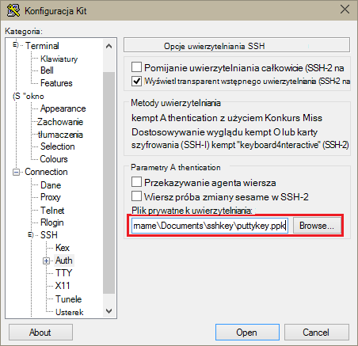
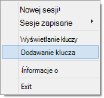

<properties
   pageTitle="Za pomocą klawiszy SSH Hadoop na podstawie Linux klastrów z systemu Windows | Microsoft Azure"
   description="Dowiedz się, jak tworzyć i użyj klawiszy SSH do uwierzytelnienia do klastrów HDInsight systemem Linux. Łączenie klastrów z systemem Windows klientów za pomocą klienta SSH Kit."
   services="hdinsight"
   documentationCenter=""
   authors="Blackmist"
   manager="jhubbard"
   editor="cgronlun"
    tags="azure-portal"/>

<tags
   ms.service="hdinsight"
   ms.devlang="na"
   ms.topic="get-started-article"
   ms.tgt_pltfrm="na"
   ms.workload="big-data"
   ms.date="08/30/2016"
   ms.author="larryfr"/>

#Używanie SSH z systemem Linux Hadoop na HDInsight z systemu Windows

> [AZURE.SELECTOR]
- [Systemu Windows](hdinsight-hadoop-linux-use-ssh-windows.md)
- [Linux, Unix systemu OS X](hdinsight-hadoop-linux-use-ssh-unix.md)

[Secure Shell (SSH)](https://en.wikipedia.org/wiki/Secure_Shell) umożliwia zdalne wykonywania operacji na klastrów systemem Linux HDInsight przy użyciu interfejsu wiersza polecenia. Ten dokument zawiera informacje dotyczące połączenie z usługą HDInsight z klienci z systemem Windows przy użyciu klienta SSH Kit.

> [AZURE.NOTE] Kroki opisane w tym artykule założono, że korzystasz z komputera klienckiego z systemem Windows. Jeśli używasz klienta Linux, Unix lub OS X, zobacz [Używanie SSH z systemem Linux Hadoop na HDInsight z Linux, Unix lub OS X](hdinsight-hadoop-linux-use-ssh-unix.md).
>
> Jeśli masz systemu Windows 10 i używasz [urodzinową na Ubuntu w systemie Windows](https://msdn.microsoft.com/commandline/wsl/about), można wykonaj czynności podane w dokumencie [Za pomocą SSH z systemem Linux Hadoop na HDInsight z Linux, Unix lub OS X](hdinsight-hadoop-linux-use-ssh-unix.md) .

##Wymagania wstępne

* **Kit** i **PuTTYGen** dla klientów z systemem Windows. Te narzędzia są dostępne w [http://www.chiark.greenend.org.uk/~sgtatham/putty/download.html](http://www.chiark.greenend.org.uk/~sgtatham/putty/download.html).

* Przeglądarki sieci web nowoczesny, która obsługuje HTML5.

LUB

* [Polecenie azure](../xplat-cli-install.md).

    [AZURE.INCLUDE [use-latest-version](../../includes/hdinsight-use-latest-cli.md)] 

##Co to jest SSH?

SSH jest narzędziem do logowania do oraz zdalne wykonywanie, polecenia na serwerze zdalnym. Z systemem Linux HDInsight SSH ustala szyfrowane połączenie z węzła głowy i zawiera wiersz polecenia, który umożliwia wpisywania poleceń. Następnie wykonywane są polecenia bezpośrednio na serwerze.

###Nazwa użytkownika SSH

Nazwa użytkownika SSH jest nazwą używanego do uwierzytelniania klaster HDInsight. Po określeniu nazwy użytkownika SSH podczas tworzenia klaster tego użytkownika jest tworzona we wszystkich węzłach w klastrze. Po utworzeniu klaster umożliwia nawiązywanie połączenia z głowy węzłach HDInsight przez osoby ta nazwa użytkownika. Z głowy węzłów można połączyć węzły poszczególnych pracowników.

###Hasło SSH lub klucz publiczny

Użytkownik SSH może użyć hasła lub kluczem publicznym uwierzytelniania. Hasło jest po prostu ciąg tekstu, gdy klucz publiczny jest częścią cryptographic pary kluczy wygenerowanych jednoznacznie identyfikować możesz.

Klucz jest bezpieczniejsze niż hasło, jednak wymaga dodatkowe kroki w celu wygenerowania klucza i należy zachować pliki zawierające klucz w bezpiecznym miejscu. Jeśli każdy użytkownik uzyskuje dostęp do plików kluczowych, uzyskują dostęp do swojego konta. Lub w przypadku utraty plików kluczowych, nie będziesz w stanie się zalogować do swojego konta.

Pary kluczy składa się z kluczem publicznym (który są wysyłane do serwera HDInsight) i klucz prywatny (który jest przechowywany na komputerze klienckim.) Podczas łączenia się z serwerem HDInsight przy użyciu SSH, klient SSH będzie używał klucz prywatny na komputerze do uwierzytelniania na serwerze.

##Utworzenie klucza SSH

Jeśli planujesz korzystanie z klaster SSH klawiszy, należy użyć poniższych informacji. Jeśli planujesz przy użyciu hasła, możesz pominąć tę sekcję.

1. Otwórz PuTTYGen.

2. W obszarze **Typ klucza, aby wygenerować**wybierz **RSA SSH-2**, a następnie kliknij **Generuj**.

    

3. Umieść wskaźnik myszy w obszarze poniżej paska postępu pasek wypełnia. Przesuwania generuje losową danych, który jest używany do wygenerowania klucza.

    

    Wygenerowany klucz klucz publiczny będą wyświetlane.

4. Aby zwiększyć bezpieczeństwo możesz wprowadzić hasło w polu **klucz hasło** , a następnie wpisz tę samą wartość w polu **Potwierdź hasło** .

    

    > [AZURE.NOTE] Zdecydowanie zaleca się użycie bezpiecznego hasła dla klucza. Jeśli zapomnisz hasło, istnieje jednak nie można go odzyskać.

5. Kliknij przycisk **Zapisz klucz prywatny** , aby zapisać klucz pliku **.ppk** . Ten klucz będzie używany do uwierzytelniania klaster HDInsight systemem Linux.

    > [AZURE.NOTE] Ten klucz należy przechowywać w bezpiecznym miejscu, jak mogą być używane do dostępu klaster HDInsight systemem Linux.

6. Kliknij przycisk **Zapisz klucz publiczny** , aby zapisać klucz jako plik z rozszerzeniem **txt** . Umożliwia ponowne używanie klucz publiczny w przyszłości podczas tworzenia dodatkowe klastrów HDInsight systemem Linux.

    > [AZURE.NOTE] Klucz publiczny jest również wyświetlany w górnej części PuTTYGen. Możesz kliknij prawym przyciskiem myszy to pole, skopiuj wartość, a następnie wklej je do formularza podczas tworzenia klaster za pomocą Azure Portal.

##Utworzyć klaster systemem Linux HDInsight

Podczas tworzenia klastrze systemem Linux HDInsight, musisz podać klucz publiczny utworzony wcześniej. Od klientów z systemem Windows istnieją dwa sposoby tworzenia klastrze systemem Linux HDInsight:

* **Azure Portal** - użyto aplikacja portal oparta na sieci web, aby utworzyć klaster.

* **Polecenie azure dla komputerów Mac, Linux i systemu Windows** — użyto polecenia, aby utworzyć klaster.

Każdej z tych metod wymaga klucz publiczny. Aby uzyskać pełne informacje na temat tworzenia klastrze systemem Linux HDInsight zobacz [klastrów systemem Linux świadczenia usługi HDInsight](hdinsight-hadoop-provision-linux-clusters.md).

###Azure Portal

Podczas korzystania z [Azure Portal] [ preview-portal] Aby utworzyć klaster systemem Linux HDInsight, możesz wprowadź **Nazwę użytkownika SSH**i wybierz, aby wprowadzić **hasło** lub **SSH klucz PUBLICZNY**.

Jeśli wybierzesz **SSH klucz PUBLICZNY**, albo można wkleić klucz publiczny (wyświetlane w __klucz publiczny wklejenie go do OpenSSH autoryzowanych\_pliku klawiszy__ w PuttyGen,) do pola __SSH PublicKey__ lub wybierz pozycję __Wybierz plik__ do przeglądania i wybierz plik, który zawiera klucz publiczny.

Tworzy logowania dla określonego użytkownika, a umożliwia uwierzytelniania hasła lub uwierzytelnianie oparte na kluczu SSH.

###Azure interfejs wiersza polecenia dla komputerów Mac, Linux i systemu Windows

[Polecenie Azure dla komputerów Mac, Linux i Windows](../xplat-cli-install.md) umożliwia tworzenie nowy klaster przy użyciu `azure hdinsight cluster create` polecenia.

Aby uzyskać więcej informacji na temat korzystania z tego polecenia zobacz [klastrów Hadoop Linux świadczenia w HDInsight za pomocą opcji niestandardowych](hdinsight-hadoop-provision-linux-clusters.md).

##Nawiązywanie połączenia z klastrem systemem Linux HDInsight

1. Otwórz Kit.

    

2. Jeśli są udostępniane klawisza SSH po utworzeniu konta użytkownika, należy wykonać następujące czynności, aby zaznaczyć klucz prywatny używany podczas uwierzytelniania w grupie:

    W **kategorii**rozwiń **połączenie**, rozwiń **SSH**, a następnie wybierz pozycję **Auth**. Na koniec kliknij przycisk **Przeglądaj** i wybierz plik .ppk, który zawiera klucz prywatny.

    

3. W polu **Kategoria**wybierz **sesji**. Na ekranie **podstawowych opcji sesję Kit** wprowadź adres SSH serwera HDInsight w polu **Nazwa hosta (lub adres IP)** . Istnieją dwa możliwe adresy SSH, który może być używany podczas łączenia się z klastrem:

    * __Adres węzła głowy__: Aby nawiązać węzeł głowy klaster, użyj swojej nazwy klaster następnie **-ssh.azurehdinsight.net**. Na przykład **mycluster ssh.azurehdinsight.net**.
    
    * __Adres węzła krawędzi__: Jeśli łączysz się z serwerem R w klastrze HDInsight, można nawiązać połączenie przy użyciu adresu __RServer.CLUSTERNAME.ssh.azurehdinsight.net__, gdzie NAZWAKLASTRA to nazwa klaster węzeł krawędzi serwera R. Na przykład __RServer.mycluster.ssh.azurehdinsight.net__.

    

4. Aby zapisać informacje o połączeniu do użycia w przyszłości, wprowadź nazwę dla tego połączenia, w obszarze **Sesje zapisany**, a następnie kliknij **Zapisz**. Połączenie zostanie dodana do listy zapisane sesji.

5. Kliknij przycisk **Otwórz** , aby połączyć się z klastrem.

    > [AZURE.NOTE] Jeśli masz połączenie z klastrem po raz pierwszy, otrzymujesz alert zabezpieczeń. Jest to normalne. Wybierz pozycję **Tak,** aby buforować klawisz RSA2 serwera, aby kontynuować.

6. Po wyświetleniu monitu wprowadź użytkownika, którego wprowadzone po utworzeniu klaster. Jeśli są udostępniane hasła dla użytkownika, wyświetli się monit o także podać.

> [AZURE.NOTE] Powyższe czynności założono, że używasz 22 portu, który będzie łączyć się podstawowego headnode w klastrze HDInsight. Jeśli używasz port 23 połączysz się pomocniczej. Aby uzyskać więcej informacji w węzłach głowy zobacz [dostępności i niezawodności klastrów Hadoop w HDInsight](hdinsight-high-availability-linux.md).

###Nawiązywanie połączenia z węzły pracownika

Węzły pracownik nie są dostępne bezpośrednio z zewnątrz Azure centrum danych, ale są one dostępne z węzła głowy za pośrednictwem SSH.

Jeśli są udostępniane klawisza SSH po utworzeniu konta użytkownika, należy wykonać następujące czynności, aby używać klucza prywatnego podczas uwierzytelniania z klastrem, jeśli chcesz nawiązać połączenie węzły pracownika.

1. Zainstaluj Konkurs Miss z [http://www.chiark.greenend.org.uk/~sgtatham/putty/download.html](http://www.chiark.greenend.org.uk/~sgtatham/putty/download.html). To narzędzie służy do pamięci podręcznej klawiszy SSH Kit.

2. Uruchom Konkurs Miss. Jego zostanie zminimalizowane do ikony na pasku stanu. Kliknij prawym przyciskiem myszy ikonę, a następnie wybierz pozycję **Dodaj klucz**.

    

3. Po wyświetleniu okna dialogowego przeglądania zaznacz plik .ppk, który zawiera klucz, a następnie kliknij przycisk **Otwórz**. Spowoduje to dodanie klucz Konkurs Miss, który zapewni jego Kit podczas łączenia się z klastrem.

    > [AZURE.IMPORTANT] Jeśli klawisza SSH umożliwia zabezpieczenia konta, trzeba wykonać powyższe kroki, zanim będzie można nawiązać węzły pracownika.

4. Otwórz Kit.

5. Jeśli uwierzytelniania w sekcji **kategorii** przy użyciu klucza SSH rozwiń **połączenie**, rozwiń **SSH**, a następnie wybierz **uwierzytelniania**.

    W sekcji **parametry uwierzytelniania** Włącz **agenta Zezwalaj przesyłania dalej**. Dzięki temu Kit automatycznie przekazywane uwierzytelniania certyfikatów za pośrednictwem połączenia do węzła głowy podczas nawiązywania połączenia węzły pracownika.

    

6. Połącz się z klastrem opisane wcześniej. Jeśli dla uwierzytelniania za pomocą klawisza SSH nie trzeba wybierz klucz — klucz SSH dodane do Konkurs Miss będzie są używane do uwierzytelnienia z klastrem.

7. Po nawiązaniu połączenia, należy wykonać następujące kroki pobrać listę węzłów w klastrze. Zamień *ADMINPASSWORD* hasło do konta administratora klaster. Zamień *NAZWAKLASTRA* nazwę klaster.

        curl --user admin:ADMINPASSWORD https://CLUSTERNAME.azurehdinsight.net/api/v1/hosts

    Zwraca informacje w formacie JSON dla węzłów w klastrze, łącznie z `host_name`, w którym znajduje się w pełni kwalifikowaną nazwę domeny (FQDN) dla każdego węzła. Oto przykład `host_name` zwracane przez polecenie **zawinięcie** wpis:

        "host_name" : "workernode0.workernode-0-e2f35e63355b4f15a31c460b6d4e1230.j1.internal.cloudapp.net"

8. Po utworzeniu listy węzłów pracownik, który chcesz nawiązać połączenie, użyj następującego polecenia z sesji Kit do otwarcia połączenia do węzła pracownika:

        ssh USERNAME@FQDN

    Zamień *nazwę użytkownika* SSH nazwy użytkownika i *nazwy FQDN* przy użyciu nazwy FQDN węzła pracownika. Na przykład `workernode0.workernode-0-e2f35e63355b4f15a31c460b6d4e1230.j1.internal.cloudapp.net`.

    > [AZURE.NOTE] Jeżeli używasz hasła do uwierzytelniania sesję SSH, pojawi się monit o wprowadzenie hasła ponownie. Użycie klawisza SSH połączenia należy zakończyć bez wyświetlania monitów.

9. Po ustaleniu sesji, Monituj o sesję Kit zmieni się z `username@hn#-clustername` do `username@wn#-clustername` aby wskazać, że nawiązano do węzła pracownika. Wszystkie polecenia, w tym momencie uruchomienia będzie działać na węzeł pracownika.

10. Po zakończeniu operacji wykonywanych w węźle pracownika za pomocą `exit` polecenie, aby zamknąć sesję do węzła pracownika. To spowoduje powrót do `username@hn#-clustername` wiersza.

##Dodać więcej kont

Jeśli chcesz dodać więcej kont do klaster, wykonaj następujące czynności:

1. Generowanie nowy klucz publiczny i klucz prywatny do nowego konta użytkownika opisany powyżej.

2. Z sesji SSH z klastrem dodać nowego użytkownika z następujące polecenie:

        sudo adduser --disabled-password <username>

    Zostanie utworzone nowe konto użytkownika, ale wyłączy uwierzytelniania hasła.

3. Tworzenie katalogu i plików do przytrzymaj klawisz za pomocą następujących poleceń:

        sudo mkdir -p /home/<username>/.ssh
        sudo touch /home/<username>/.ssh/authorized_keys
        sudo nano /home/<username>/.ssh/authorized_keys

4. Gdy zostanie otwarty Edytor nano, kopiowanie i wklejanie zawartości klucz publiczny dla nowego konta użytkownika. Aby zapisać plik, a następnie zamknij Edytor na koniec użyj **CTRL + X** .

    

5. Aby zmienić własność .ssh folder i zawartość do nowego konta użytkownika, użyj następującego polecenia:

        sudo chown -hR <username>:<username> /home/<username>/.ssh

6. Teraz powinno być możliwe do uwierzytelniania na serwerze przy użyciu nowych kont użytkowników i klucz prywatny.

##Tunelowanie SSH

SSH może służyć do tunelowania żądań lokalnych, takich jak żądania sieci web do klastrów HDInsight. Żądanie następnie będą kierowane do żądanego zasobu, tak jakby były rozpoczęte na głowy węzła HDInsight.

> [AZURE.IMPORTANT] Tunelem SSH jest wymagane do uzyskiwania dostępu do sieci web interfejs użytkownika w przypadku niektórych usług Hadoop. Na przykład zarówno interfejsu użytkownika historii zadania lub Menedżer zasobów interfejsu użytkownika są dostępne tylko za pomocą tunelem SSH.

Aby uzyskać więcej informacji o tworzeniu i używaniu tunelem SSH zobacz [Używanie SSH Tunneling dostęp do sieci web Ambari interfejsu użytkownika, ResourceManager, JobHistory, NameNode, Oozie i inne osoby interfejs użytkownika w sieci web](hdinsight-linux-ambari-ssh-tunnel.md).

##Następne kroki

Teraz, gdy wiesz, jak uwierzytelnianie przy użyciu klawisza SSH, Dowiedz się, jak używać MapReduce z Hadoop na HDInsight.

* [Gałąź za pomocą usługi HDInsight](hdinsight-use-hive.md)

* [Świnka korzystanie z usługi HDInsight](hdinsight-use-pig.md)

* [MapReduce zadań za pomocą usługi HDInsight](hdinsight-use-mapreduce.md)

[preview-portal]: https://portal.azure.com/
