<properties
   pageTitle="Monitorowanie i zarządzanie nimi za pomocą Interfejsu sieci Web Ambari Apache klastrów HDInsight | Microsoft Azure"
   description="Dowiedz się, jak za pomocą Ambari monitorowania i zarządzania systemem Linux HDInsight klastrów. W tym dokumencie dowiesz się, jak za pomocą interfejsu użytkownika Web Ambari, które zostały dołączone do klastrów HDInsight."
   services="hdinsight"
   documentationCenter=""
   authors="Blackmist"
   manager="jhubbard"
   editor="cgronlun"
    tags="azure-portal"/>

<tags
   ms.service="hdinsight"
   ms.devlang="na"
   ms.topic="article"
   ms.tgt_pltfrm="na"
   ms.workload="big-data"
   ms.date="09/27/2016"
   ms.author="larryfr"/>

#Zarządzanie klastrów HDInsight za pomocą Interfejsu sieci Web Ambari

[AZURE.INCLUDE [ambari-selector](../../includes/hdinsight-ambari-selector.md)]

Apache Ambari upraszcza zarządzanie i monitorowanie klastrze Hadoop, dostarczając ułatwia korzystanie z sieci web interfejsu użytkownika i interfejsu API usługi REST. Ambari znajduje się na klastrów systemem Linux HDInsight i służy do monitorowania klaster i wprowadzania zmian w konfiguracji.

W tym dokumencie dowiesz się, jak korzystać z klastrem HDInsight Ambari interfejs sieci Web.

##Co to jest Ambari?

<a href="http://ambari.apache.org" target="_blank">Apache Ambari</a> ułatwiają zarządzanie Hadoop prostsze, dostarczając web łatwe w obsłudze interfejs użytkownika, który może być używany do obsługi administracyjnej, zarządzanie i monitorowanie klastrów Hadoop. Deweloperów można zintegrować te funkcje aplikacji przy użyciu <a href="https://github.com/apache/ambari/blob/trunk/ambari-server/docs/api/v1/index.md" target="_blank">Interfejsów API pozostałych Ambari</a>.

Interfejs sieci Web Ambari znajduje się domyślnie z systemem Linux HDInsight klastrów. 

##Łączność

Interfejs sieci Web Ambari jest dostępna w klastrze HDInsight w HTTPS://CLUSTERNAME.azurehdidnsight.net, gdzie __NAZWAKLASTRA__ to nazwa klaster. 

> [AZURE.IMPORTANT] Nawiązywanie połączenia z Ambari na HDInsight wymaga HTTPS. Należy również uwierzytelniania Ambari przy użyciu nazwę konta administratora (wartość domyślna to __Administrator__) i hasło, podana podczas tworzenia klaster.

##Serwer proxy SSH

> [AZURE.NOTE] Podczas Ambari dla klaster jest dostępna bezpośrednio w Internecie, niektóre łącza z Ambari interfejs sieci Web (na przykład jako JobTracker) nie są dostępne w Internecie. Dlatego otrzymasz błędy "nie znaleziono serwera" Próbując uzyskać dostęp do tych funkcji, chyba że używasz tunelem Secure Shell (SSH) do serwera proxy ruchu w sieci web do węzła głowy.

Aby uzyskać informacje na temat tworzenia tunelem SSH do pracy z Ambari zobacz [Używanie SSH Tunneling dostęp do sieci web Ambari interfejsu użytkownika, ResourceManager, JobHistory, NameNode, Oozie i inne osoby interfejs użytkownika w sieci web](hdinsight-linux-ambari-ssh-tunnel.md).

##Ambari interfejs użytkownika sieci Web

Podczas łączenia z Ambari interfejs sieci Web, wyświetli się monit o uwierzytelnienia do strony. Użyj administrator klaster (domyślnie administrator) i hasła użytych podczas tworzenia klaster.

Po otwarciu strony, należy zwrócić uwagę na pasku u góry. Ta strona zawiera następujące informacje i kontrolki:

* **Ambari logo** — zostanie wyświetlona pulpitu nawigacyjnego, które mogą być używane do monitorowania klaster.

* **Klaster nazwa # ops** — Wyświetla liczbę operacji Ambari bieżących. Wybieranie nazwy klaster lub **# ops** spowoduje wyświetlenie operacji tła.

* **alerty #** — ostrzeżenia lub krytyczne ostrzeżenia dla klaster. Wybranie tej opcji spowoduje wyświetlenie alertów.

* **Pulpit nawigacyjny** — powoduje wyświetlenie pulpitu nawigacyjnego.

* **Usług** — informacje i konfiguracji ustawienia dla usług w klastrze.

* **Hosts** — informacje i ustawienia konfiguracji dla węzłów w klastrze.

* **Alerty** — dziennik informacji, ostrzeżenia i alerty krytyczne.

* **Administrator** — oprogramowanie stosem i usług, które są zainstalowane na klaster, informacje o koncie usługi i zabezpieczeń Kerberos.

* **Przycisk Administrator** — Zarządzanie Ambari, ustawienia użytkownika i wyloguj się.

##Monitorowanie

###Alerty

Ambari zawiera wiele alertów, mających jedną z następujących jako stanu:

* **Ok**

* **Ostrzeżenie**

* **KRYTYCZNE**

* **NIEZNANY**

Alerty inne niż **OK** spowoduje, że wpis **# alerty** w górnej części strony, aby wyświetlić liczbę alertów. Wybranie tego wpisu są wyświetlane alerty i ich stanu.

Alerty są zorganizowane na kilka grup domyślnych, które mogą być wyświetlane na stronie **alerty** .

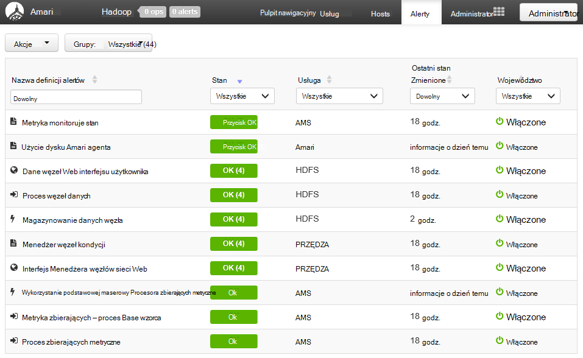

Grupy można zarządzać, korzystając z menu **Akcje** i wybierając pozycję **Zarządzanie grupami Alert**. Pozwala na modyfikowanie istniejących grup lub tworzenie nowych grup.

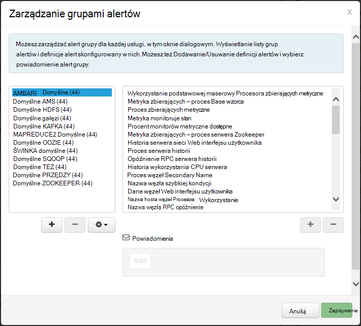

Można także tworzyć alertów, w menu **Akcje** . Umożliwia utworzenie wyzwalaczy, które wysyłania powiadomień za pośrednictwem **poczty E-mail** lub **SNMP** w przypadku wystąpienia kombinacji określonego alertu i ważności. Na przykład możesz wysłać zestawu alertu po tych alertów w grupie **Domyślne PRZĘDZY** **krytyczna**.

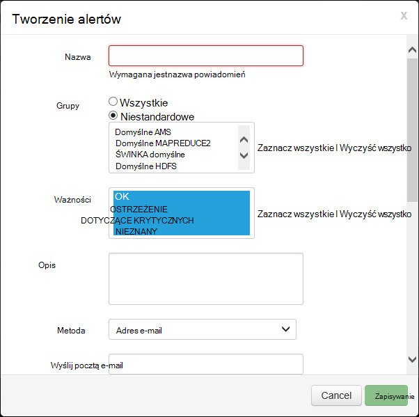

###Klaster

Karta **metryki** pulpitu nawigacyjnego zawiera szereg widżety, które ułatwiają monitorowanie stanu klaster rzut oka. Widżety kilka, takie jak **Użycie Procesora**, wpisz dodatkowe informacje po kliknięciu.

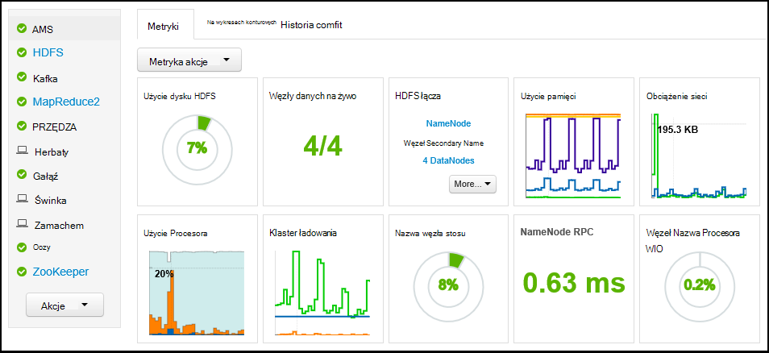

Na karcie **Heatmaps** Wyświetla metryki jako heatmaps kolorem, przechodząc z zielonego na czerwony.

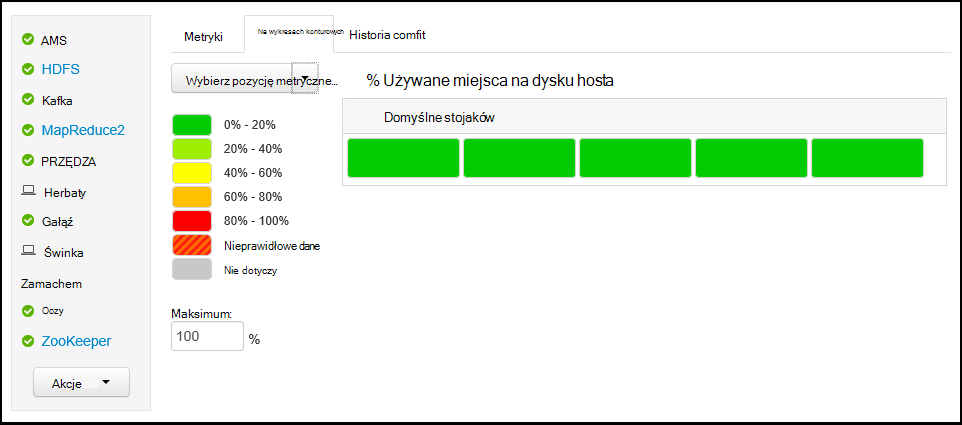

Aby uzyskać bardziej szczegółowe informacje o węzłach w klastrze zaznacz **Hosts**, a następnie wybierz węzeł określonych, który Cię interesuje.

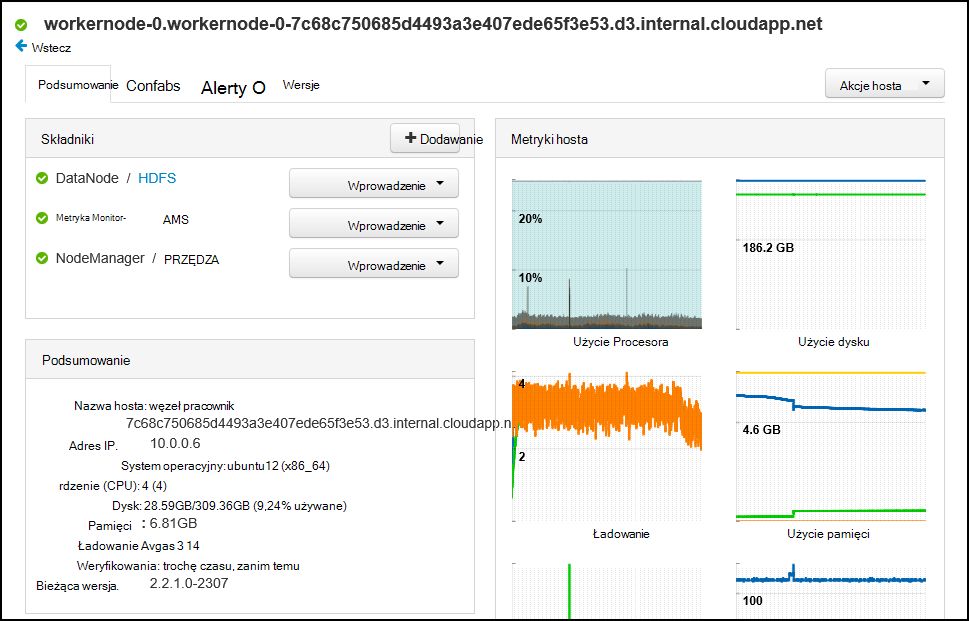

###Usług

Pasek boczny **usług** na pulpicie nawigacyjnym zapewnia szybki wgląd w stan usług uruchamiania w klastrze. Różne ikony są używane do wskazywania stanu lub akcje, które należy podjąć, takich jak symbol żółty Kosz, jeśli usługa musi być odtwarzane.

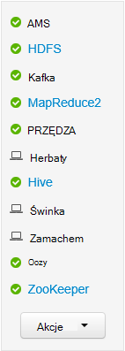

Wybieranie usługi wyświetlanie bardziej szczegółowych informacji w usłudze.

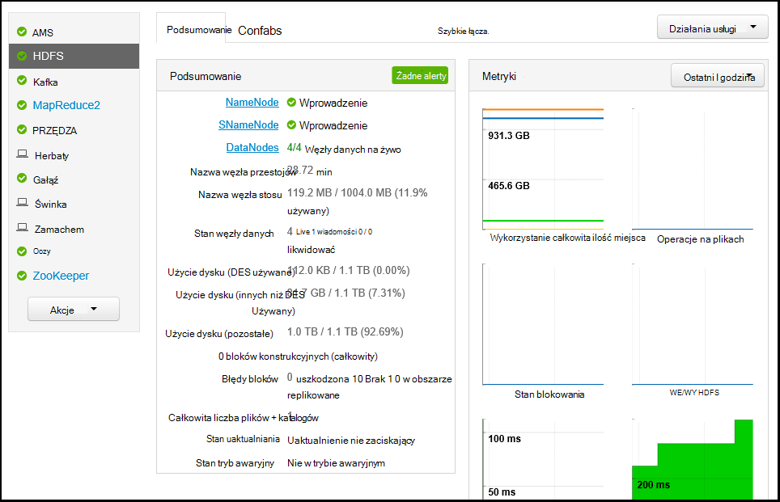

####Szybkie łącza

Niektóre usługi wyświetlone łącze **Szybkie łącza** w górnej części strony. To umożliwia dostęp do usługi sieci web pakietu, takich jak:

* **Historię zatrudnienia** - MapReduce historii zadań.

* **Menedżer zasobów** — interfejs użytkownika ResourceManager PRZĘDZY.

* **NameNode** - Hadoop Distributed Interfejsu NameNode plików systemowych (HDFS).

* **Interfejs użytkownika sieci Web Oozie** - Oozie interfejsu użytkownika.

Wybieranie dowolne z tych łączy otworzy nowej karcie w przeglądarce, co powoduje wyświetlenie wybranej strony.

> [AZURE.NOTE] Wybieranie łącza **Szybkie łącza** do dowolnej usługi spowoduje komunikat o błędzie "nie znaleziono serwera" tylko w przypadku korzystania z tunelem Secure Sockets Layer (SSL) do serwera proxy ruchu w sieci web z klastrem. Jest to spowodowane aplikacji sieci web umożliwia wyświetlanie te informacje nie są dostępne w Internecie.
>
> Aby uzyskać informacje na temat korzystania z usługi HDInsight tunelem SSL zobacz [Używanie SSH Tunneling dostęp do sieci web Ambari interfejsu użytkownika, ResourceManager, JobHistory, NameNode, Oozie i inne osoby interfejs użytkownika w sieci web](hdinsight-linux-ambari-ssh-tunnel.md)

##Zarządzanie

###Ambari użytkowników, grupy i uprawnienia

Zarządzanie użytkownikami, grupami i uprawnieniami nie można używać z usługi HDInsight klastrów.

###Hosts

Strona **Hosts** zawiera listę wszystkich hostów w klastrze. Aby zarządzać hosts, wykonaj następujące kroki.

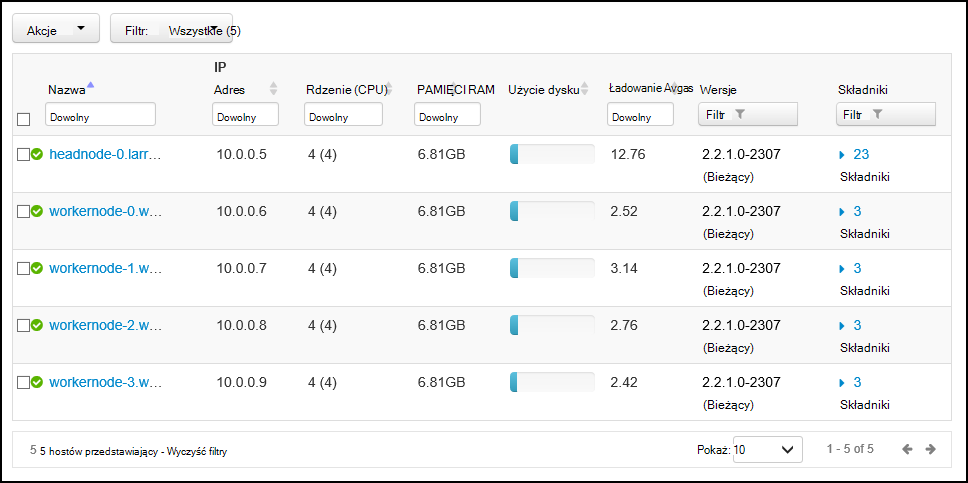

> [AZURE.NOTE] Dodawanie, likwidować lub recommissioning hosta nie powinna można używać z klastrów HDInsight.

1. Wybierz pozycję hostami, którą chcesz zarządzać.

2. Korzystając z menu **Akcje** wybierz akcję, którą chcesz wykonać:

    * **Wszystkie składniki rozpoczęcie** - rozpoczęcie wszystkie składniki na hoście.

    * **Zatrzymywanie wszystkie składniki** - Zatrzymaj wszystkie składniki na hoście.

    * **Uruchom ponownie wszystkie składniki** - tabulatora i rozpocząć wszystkie składniki na hoście.

    * **Włącz tryb konserwacji** — powoduje pominięcie alerty dla hosta. Jeśli przeprowadzasz akcje, które wygeneruje alerty, takie jak ponowne uruchomienie usługi korzystające z programem services, to powinna być włączona.

    * **Wyłącz tryb konserwacji** — zwraca hosta do normalnego alertu.

    * **Zatrzymywanie** - stopnie DataNode i NodeManagers na hoście.

    * **Rozpoczęcie** - DataNode zaczyna się lub NodeManagers na hoście.

    * **Uruchom ponownie** - stopnie i uruchomieniu DataNode lub NodeManagers na hoście.

    * **Decommission** - usuwa hosta z klastrem.

        > [AZURE.NOTE] Nie należy używać tej akcji na klastrów HDInsight.

    * **Recommission** - dodaje wcześniej likwidowanego hosta z klastrem.

        > [AZURE.NOTE] Nie należy używać tej akcji na klastrów HDInsight.

###Usług

Ze strony **pulpitu nawigacyjnego** lub **usługi** użyj przycisku **akcji** u dołu listy usług Aby zatrzymać i uruchomić wszystkich usług.

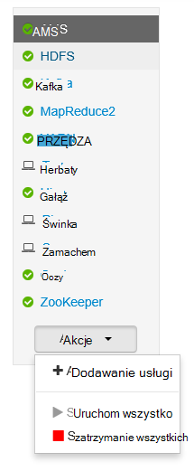

> [AZURE.WARNING] Podczas __Dodawanie usługi__ jest wyświetlana w menu, nie powinny być użyty w celu dodania usług do klastrów HDInsight. Nowe usługi, należy dodać przy użyciu akcji skryptu podczas inicjowania obsługi administracyjnej klaster. Aby uzyskać więcej informacji na temat korzystania z akcji skryptu zobacz [klastrów Dostosowywanie HDInsight za pomocą skryptu akcje](hdinsight-hadoop-customize-cluster-linux.md).

Gdy wszystkie usługi można uruchomić ponownie przycisk **Akcje** , często chcesz uruchomić, zatrzymać lub ponownie uruchomić określonej usługi. Do działania na poszczególnych usług, wykonaj następujące czynności:

1. Po wyświetleniu strony **pulpitu nawigacyjnego** lub **usług** wybierz usługę.

2. U góry na karcie **Podsumowanie** przy użyciu przycisku **Akcji usługi** i wybierz akcję do wykonania. Ponownie uruchom usługę na wszystkich węzłach.

    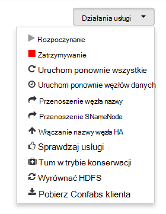

    > [AZURE.NOTE] Ponowne uruchomienie usług niektóre, gdy jest uruchomiony klaster może generować alertów. Aby tego uniknąć, można użyć przycisku **Akcji usługi** Aby włączyć **Tryb konserwacji** usługi przed wykonaniem po ponownym uruchomieniu komputera.

3. Po wybraniu akcji wpis **Otwórz #** w górnej części strony będzie zwiększać pokazanie, że występuje operacji tła. Jeśli skonfigurowany do wyświetlania, zostanie wyświetlona lista operacji tła.

    > [AZURE.NOTE] Włączenie **trybu konserwacji** usługi Pamiętaj, aby ją wyłączyć, korzystając z przycisku **Akcji usługi** po zakończeniu operacji.

Aby skonfigurować usługę, wykonaj następujące czynności:

1. Po wyświetleniu strony **pulpitu nawigacyjnego** lub **usług** wybierz usługę.

2. Wybierz kartę **podawać** . Pojawi się bieżącej konfiguracji. Również zostanie wyświetlona lista poprzedniej konfiguracji.

    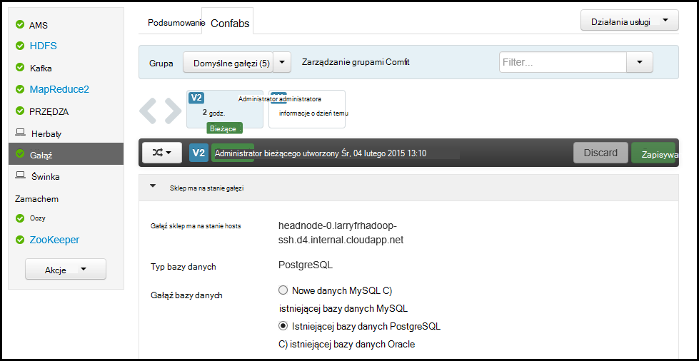

3. Za pomocą pola wyświetlane modyfikować konfigurację, a następnie wybierz **Zapisz**. Lub wybierz poprzedniej konfiguracji, a następnie wybierz pozycję **zostać bieżącym** , aby przywrócić poprzednie ustawienia.

##Widoki Ambari

Widoki Ambari umożliwiają projektantom podłączyć elementów interfejsu użytkownika do Ambari interfejs sieci Web, przy użyciu [Struktury widoki Ambari](https://cwiki.apache.org/confluence/display/AMBARI/Views). Usługa HDInsight zawiera następujące widoki Hadoop klaster typów:

* Menedżer kolejki przędzy: Menedżer kolejki udostępnia prosty interfejs użytkownika do przeglądania i modyfikowania kolejek PRZĘDZY.
* Widok gałęzi: Widok gałęzi umożliwia uruchamianie zapytania gałęzi bezpośrednio w przeglądarce sieci web. Można zapisać zapytania, wyświetlanie wyników, Zapisz wyniki do magazynu klaster lub pobrać wyniki na komputerze lokalnym. Aby uzyskać więcej informacji na temat korzystania z widoków gałęzi zobacz [Widoki gałęzi korzystanie z usługi HDInsight](hdinsight-hadoop-use-hive-ambari-view.md).
* Widok tez: Widok Tez pozwala na lepsze zrozumienie i zoptymalizować zadania wyświetlając informacje jak Tez zadania są wykonywane i jakie zasoby są używane przez zadanie.
