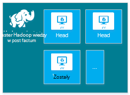
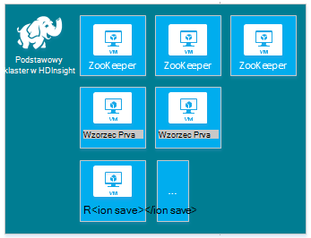
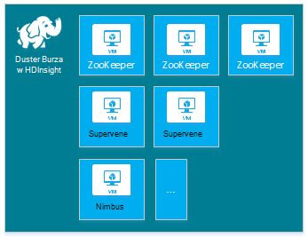
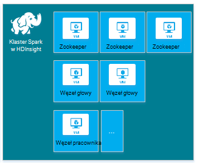
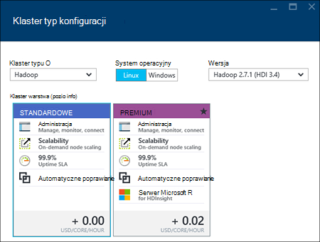
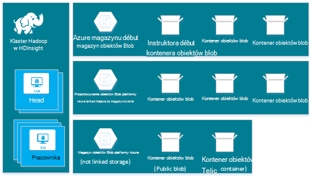
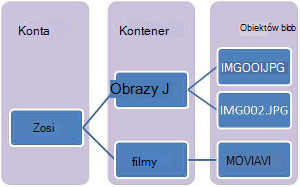
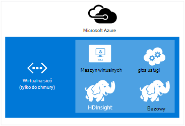
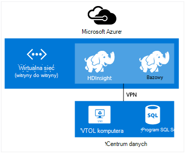
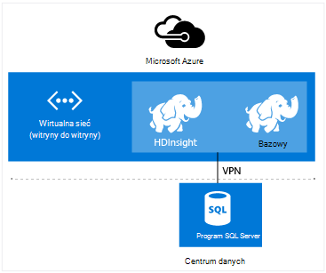

<properties
    pageTitle="Tworzenie klastrów Hadoop, HBase, Burza lub Spark na Linux w HDInsight | Microsoft Azure"
    description="Dowiedz się, jak tworzyć Hadoop, HBase, Burza lub wzmóc klastrów na Linux oraz dla HDInsight w przeglądarce, polecenie Azure, Azure programu PowerShell, pozostałe lub za pośrednictwem SDK."
    services="hdinsight"
    documentationCenter=""
    authors="mumian"
    manager="jhubbard"
    editor="cgronlun"
    tags="azure-portal"/>

<tags
    ms.service="hdinsight"
    ms.devlang="na"
    ms.topic="article"
    ms.tgt_pltfrm="na"
    ms.workload="big-data"
    ms.date="10/18/2016"
    ms.author="jgao"/>

# Tworzenie klastrów systemem Linux Hadoop w HDInsight

[AZURE.INCLUDE [selector](../../includes/hdinsight-selector-create-clusters.md)]

Klaster Hadoop składa się z kilku maszyn wirtualnych (węzłach), które są używane do przetwarzanie rozproszone zadań w klastrze. Azure abstracts szczegóły dotyczące implementacji instalacji i konfiguracji poszczególnych węzłów, więc musisz podać informacje ogólne konfiguracji. W tym artykule informacje o te ustawienia konfiguracji.

## Wymagania dotyczące kontroli dostępu

[AZURE.INCLUDE [access-control](../../includes/hdinsight-access-control-requirements.md)]

## Typy klastrów

Obecnie Azure HDInsight zawiera pięciu różnych typów klastrów, każda z zestawem składników zapewniają niektóre funkcje.

| Typ klaster | Funkcje |
| ------------ | ----------------------------- |
| Hadoop       | Kwerendy i analizy (zadań)     |
| HBase        | Magazynowanie danych NoSQL            |
| Burza        | Przetwarzanie zdarzenia w czasie rzeczywistym |
| Spark        | Przetwarzanie w pamięci, interakcyjnych kwerendy, przetwarzanie partii micro strumienia |
| [Interakcyjne gałęzi (wersja Preview)](hdinsight-hadoop-use-interactive-hive.md) | Interakcyjny i szybsze kwerend gałęzi pamięci podręcznej w pamięci|
| Serwer R w iskrowym (wersja Preview) | Różnych statystyki duży danych, przewidywanych modelowanie i maszynowego uczenia możliwości |

Każdy typ klaster ma własny liczby węzłów w klastrze, terminologia dotycząca węzły w klastrze i domyślny rozmiar pamięci Wirtualnej dla każdego typu węzła. W poniższej tabeli liczby węzłów dla każdego typu węzła jest w nawiasach.

| Typ| Węzły | Diagram|
|-----|------|--------|
|Hadoop| Węzeł głowy (2), węzeł danych (1 +)||
|HBase|Szef serwer (2), Region (1 +), węzeł wzorca/Zookeeper (3)||
|Burza|Węzeł nimbus (2), kierownik server (1 +), węzeł Zookeeper (3)||
|Spark|Węzeł głowy (2), węzeł pracownika (1 +), węzeł Zookeeper (3) (bezpłatnie uzyskać rozmiar pamięci Wirtualnej opiekunowie A1)||

W poniższej tabeli przedstawiono domyślne rozmiary maszyn wirtualnych dla HDInsight:

- Wszystkie obsługiwane regionów z wyjątkiem Brazylia południe i zachód Japonia:

  	|Typ klaster                     | Hadoop               | HBase                | Burza                | Spark                                                                 | Serwer R |
  	|---------------------------------|----------------------|----------------------|----------------------|-----------------------------------------------------------------------|-----------------------------------------------------------------------|
  	|Szef — domyślny rozmiar pamięci Wirtualnej           | D3 w wersji 2                | D3 w wersji 2                | A3                   | D12 w wersji 2                                                                | D12 w wersji 2                                                                |
  	|Szef — polecane rozmiarów maszyn wirtualnych      | W wersji 2 D3, D4 w wersji 2, D12 w wersji 2 | W wersji 2 D3, D4 w wersji 2, D12 w wersji 2 | A3, A4, A5           | D12 w wersji 2, D13 w wersji 2, D14 w wersji 2                                                | D12 w wersji 2, D13 w wersji 2, D14 w wersji 2                                                |
  	|Pracownik — domyślny rozmiar pamięci Wirtualnej         | D3 w wersji 2                | D3 w wersji 2                | D3 w wersji 2                | Systemu Windows: Wersja D12 2; Linux: D4 w wersji 2                                         | Systemu Windows: Wersja D12 2; Linux: D4 w wersji 2                                         |
  	|Pracownik — polecane rozmiarów maszyn wirtualnych    | W wersji 2 D3, D4 w wersji 2, D12 w wersji 2 | W wersji 2 D3, D4 w wersji 2, D12 w wersji 2 | W wersji 2 D3, D4 w wersji 2, D12 w wersji 2 | Windows: D12 w wersji 2, D13 w wersji 2, wersja 2 D14; Linux: D4 w wersji 2, D12 w wersji 2, D13 w wersji 2, D14 w wersji 2 | Windows: D12 w wersji 2, D13 w wersji 2, wersja 2 D14; Linux: D4 w wersji 2, D12 w wersji 2, D13 w wersji 2, D14 w wersji 2 |
  	|Zookeeper — domyślny rozmiar pamięci Wirtualnej      |                      | A3                   | A2                   |                                                                       |
  	|Zookeeper — polecane rozmiarów maszyn wirtualnych |                      | A3, A4, A5           | A2, A3, A4           |                                                                       |
  	|Krawędź - domyślny rozmiar pamięci Wirtualnej           |                      |                      |                      |                                                                       | Systemu Windows: Wersja D12 2; Linux: D4 w wersji 2                                         |
  	|Krawędź - zalecany rozmiar pamięci Wirtualnej       |                      |                      |                      |                                                                       | Windows: D12 w wersji 2, D13 w wersji 2, wersja 2 D14; Linux: D4 w wersji 2, D12 w wersji 2, D13 w wersji 2, D14 w wersji 2 |

- Brazylia południe i zachód Japonii tylko (nie w wersji 2 rozmiarach poniżej):

  	|Typ klaster                     | Hadoop      | HBase       | Burza      | Spark                                          |Serwer R|
  	|---------------------------------|-------------|-------------|------------|------------------------------------------------|--------|
  	|Szef — domyślny rozmiar pamięci Wirtualnej           | D3          | D3          | A3         | D12                                            | D12|
  	|Szef — polecane rozmiarów maszyn wirtualnych      | D12 D3, D4, | D12 D3, D4, | A3, A4, A5 | D14 D12, D13,                                  | D14 D12, D13,|
  	|Pracownik — domyślny rozmiar pamięci Wirtualnej         | D3          | D3          | D3         | System Windows: D12; Linux: D4                        | System Windows: D12; Linux: D4|
  	|Pracownik — polecane rozmiarów maszyn wirtualnych    | D12 D3, D4, | D12 D3, D4, | D12 D3, D4,| System Windows: D12, D13, D14; Linux: D4, D14 D12, D13,| System Windows: D12, D13, D14; Linux: D4, D14 D12, D13,|
  	|Zookeeper — domyślny rozmiar pamięci Wirtualnej      |             | A2          | A2         |                                                | |
  	|Zookeeper — polecane rozmiarów maszyn wirtualnych |             | A2, A3, A4  | A2, A3, A4 |                                                | |
  	|Krawędź — domyślne rozmiary maszyn wirtualnych          |             |             |            |                                                | System Windows: D12; Linux: D4 |
  	|Krawędź — polecane rozmiarów maszyn wirtualnych      |             |             |            |                                                | System Windows: D12, D13, D14; Linux: D4, D14 D12, D13, |

Należy zauważyć, że szef nosi nazwę *Nimbus* typu Burza klaster. Pracownik jest znany jako *Region* dla typu klaster HBase, a *Kierownik* typu Burza klaster.

> [AZURE.IMPORTANT] Jeśli masz więcej niż 32 węzły pracownika, podczas tworzenia klaster lub skalowania klaster po utworzeniu, musisz wybrać odpowiedni rozmiar węzła głównego z co najmniej 8 rdzeni i 14 GB pamięci RAM.

Możesz dodać inne składniki, takie jak odcień i R do tych podstawowych typów za pomocą [Skryptu akcje](#customize-clusters-using-script-action).

> [AZURE.IMPORTANT] Usługa HDInsight klastrów są dostępne w różnych typów, które odpowiadają obciążenie pracą lub technologii, którą klaster jest dostosowanych do. Istnieje obsługiwana metoda aby utworzyć klaster, który łączy wiele typów, takie jak Burza i HBase na jeden klaster. 

Jeśli rozwiązanie wymaga technologie, które są rozciągnąć wielu typów klaster HDInsight, należy utworzyć Azure wirtualną sieć i utworzyć typów wymagane klaster w wirtualnej sieci. Dzięki temu klastrów oraz cały kod Wdroż ich bezpośrednie komunikowanie się ze sobą.

Aby uzyskać więcej informacji na temat korzystania z usługi HDInsight Azure wirtualną sieć Zobacz [Rozszerzanie HDInsight z Azure wirtualnych sieci](hdinsight-extend-hadoop-virtual-network.md).

Przykład użycia dwóch typów klaster w wirtualnej sieci Azure zobacz [Analiza danych czujnik z Burza i HBase](hdinsight-storm-sensor-data-analysis.md).

## Klaster warstwy

Usługa Azure HDInsight zawiera ofertę chmury duży danych na dwie kategorie: Standard i [Premium](hdinsight-component-versioning.md#hdinsight-standard-and-hdinsight-premium). HDInsight Premium zawiera R i inne dodatkowe składniki. HDInsight Premium jest obsługiwana tylko na HDInsight wersję 3.4.

W poniższej tabeli wymieniono typ klaster HDInsight i HDInsight Premium macierzy pomocy technicznej.

| Typ klaster | Standardowe | Premium  |
|--------------|---------------|--------------|
| Hadoop       | Tak           | Tak          |
| Spark        | Tak           | Tak          |
| HBase        | Tak           | Brak           |
| Burza        | Tak           | Brak           |
| Serwer R w iskrowym | Brak | Tak |

Opisane więcej typów klaster w HDInsight Premium zostaną zaktualizowane w tej tabeli. Następujące zrzucie ekranu pokazano Azure portalu informacje dotyczące wybierania typy klastrów.

## Opcje konfiguracji podstawowej

Dostępne są następujące opcje konfiguracji podstawowej użyte do utworzenia klaster HDInsight.

### Nazwa klaster ###

Klaster Nazwa jest używana do identyfikowania klastrze. Nazwa klaster musi być unikatowa globalnie i muszą spełniać następujące wskazówki nazw:

- Pole musi być ciągiem o długości od 3 do 63 znaków.
- Pole może zawierać tylko litery, cyfry i łączniki.

### Typ klaster###

Zobacz [typy klastrów](#cluster-types) i [poziomów klaster](#cluster-tiers).

### System operacyjny ###

Możesz utworzyć HDInsight klastrów na jednym z dwóch poniższych systemach operacyjnych:

- Usługa HDInsight w systemie Linux.  Usługa HDInsight zawiera jest możliwość skonfigurowania klastrów Linux Azure. Skonfigurować klaster Linux, jeśli znasz Linux lub Unix migracji z istniejącego rozwiązania oparte na Linux Hadoop, lub mają ułatwiające integrację z składniki ekosystemu Hadoop utworzone Linux. Aby uzyskać więcej informacji zobacz [Rozpoczynanie pracy z Hadoop na Linux w HDInsight](hdinsight-hadoop-linux-tutorial-get-started.md).
- Usługa HDInsight w systemie Windows (Windows Server 2012 R2 centrum danych).

### Wersja HDInsight###

Umożliwia określanie wersji programu HDInsight wymagane przez ten klaster. Aby uzyskać więcej informacji zobacz [Hadoop klaster wersji i składniki w HDInsight](https://go.microsoft.com/fwLink/?LinkID=320896&clcid=0x409).

### Nazwy subskrypcji.###

Każdy klaster HDInsight jest związany jedną subskrypcję Azure.

### Nazwa grupy zasobów ###

Ułatwia [Menedżera zasobów Azure](../azure-resource-manager/resource-group-overview.md) , z którymi pracujesz z zasobami w aplikacji grupowo, nazywane Azure grupa zasobów. Możesz wdrożyć, aktualizowanie, monitorować lub usunąć wszystkie zasoby dla aplikacji w jednej operacji skoordynowanego.

### Poświadczenia###

Podczas tworzenia klaster klastrów HDInsight, można skonfigurować dwa konta użytkownika:

- Użytkownik HTTP. Nazwa użytkownika domyślnego jest *administratora* w portalu Azure za pomocą konfiguracji podstawowej. Czasami nazywany "Klaster użytkownika".
- Użytkownik SSH (Linux klastrów). To jest używane do łączenia się z klastrem przy użyciu SSH. Po utworzeniu klaster, wykonując kroki opisane w [Użyciu SSH z systemem Linux Hadoop na HDInsight z Linux, Unix lub OS X](hdinsight-hadoop-linux-use-ssh-unix.md) lub [Użyj SSH z systemem Linux Hadoop na HDInsight z systemu Windows](hdinsight-hadoop-linux-use-ssh-unix.md), możesz utworzyć dodatkowe SSH kont użytkowników.

    >[AZURE.NOTE] W przypadku klastrów opartych na systemie Windows można utworzyć RDP użytkownikowi połączyć się z klastrem przy użyciu RDP.

### Źródła danych###

Oryginalny distributed system plików usługi Hadoop (HDFS) użyto wielu lokalnych dyskach w klastrze. Usługa HDInsight używa magazyn obiektów Blob platformy Azure do przechowywania danych. Magazyn obiektów Blob platformy Azure jest rozwiązaniem niezawodne, ogólnego przeznaczenia przestrzeni dyskowej, która bezproblemowo integruje się z usługi HDInsight. Za pomocą interfejsu HDFS pełny zestaw składników HDInsight może pracować bezpośrednio na dane strukturalne i niestrukturalne w magazynie obiektów Blob. Dane są przechowywane w magazynie obiektów Blob ułatwia bezpiecznie usunąć klastrów HDInsight, które są używane do obliczeń bez utraty danych użytkownika.

Podczas konfigurowania należy określić konto Azure przestrzeni dyskowej oraz kontenerem magazyn obiektów Blob platformy Azure na konto Azure miejsca do magazynowania. Niektóre procesy tworzenia wymagają konto Azure miejsca do magazynowania i kontenera magazynu obiektów Blob ma zostać utworzony wcześniej. Kontener magazyn obiektów Blob jest używany jako domyślnej lokalizacji przechowywania przez klaster. Opcjonalnie można określić dodatkowe konta magazyn Azure (magazynowanie połączonych), które będą dostępne przez klaster. Klaster również dostęp do dowolnego kontenerów miejsca do magazynowania obiektów Blob skonfigurowanych z publicznej dostęp do odczytu lub publiczny dostęp do odczytu dla obiektów blob tylko.  Aby uzyskać więcej informacji zobacz [Zarządzanie dostępu do zasobów magazynowania Azure](../storage/storage-manage-access-to-resources.md).

>[AZURE.NOTE] Kontener magazyn obiektów Blob zawiera grupę zestawu obiektów blob, jak pokazano na poniższej ilustracji.

Nie zaleca się przechowywania danych biznesowych przy użyciu domyślnego kontenera magazyn obiektów Blob. Usuwanie domyślnego kontenera magazyn obiektów Blob po każdym użyciu, aby zajmowała miejsca do magazynowania jest zalecane. Uwaga, że domyślny kontener zawiera aplikacji i systemu dzienniki. Pamiętaj pobrać pliki dziennika przed usunięciem kontenerze.

>[AZURE.WARNING] Udostępnianie jeden kontener magazyn obiektów Blob dla wielu klientów nie jest obsługiwane.

Aby uzyskać więcej informacji na temat korzystania z magazynem obiektów Blob platformy pomocniczej zobacz [Magazyn obiektów Blob Azure korzystania z usługi HDInsight](hdinsight-hadoop-use-blob-storage.md).

Oprócz magazyn obiektów Blob platformy Azure umożliwia także [Magazynu Lake danych Azure](../data-lake-store/data-lake-store-overview.md) jako domyślnego konta miejsca do magazynowania dla klastrów HBase w HDInsight i połączone miejsca do magazynowania dla wszystkich czterech typów klaster HDInsight. Aby uzyskać więcej informacji zobacz [Tworzenie klastrze HDInsight z magazynu Lake danych za pomocą portalu Azure](../data-lake-store/data-lake-store-hdinsight-hadoop-use-portal.md).

### Lokalizacja (Region) ###

Klaster HDInsight i jego domyślne konto miejsca do magazynowania musi znajdować się w tej samej lokalizacji Azure.

Aby uzyskać listę obsługiwanych regionów kliknij przycisk listy rozwijanej **Region** na [HDInsight ceny](https://go.microsoft.com/fwLink/?LinkID=282635&clcid=0x409).

### Węzeł ceny warstwy###

Klienci są zafakturowane z użyciem tych węzłów na czas trwania życia klaster. Rozliczenia uruchomienia po utworzeniu klastrze i zatrzymuje się, gdy klaster zostanie usunięty. Klastrów nie można wyłączyć przydzielonego lub zawieszenie.

Klaster różne typy mają różnych typów węzłów, liczby węzłów i rozmiary węzeł. Na przykład typ klaster Hadoop ma dwa _węzły głowy_ i domyślne cztery _węzły danych_typu Burza klaster ma dwa _węzły nimbus_, trzy _węzły zookeeper_i domyślne cztery _węzły inspektora_. Koszt klastrów HDInsight zależy od liczby węzłów i rozmiary maszyn wirtualnych dla węzłów. Na przykład jeśli wiesz, że będziesz wykonywać operacje, które wymagają dużej ilości pamięci, być może zechcesz wybierz zasób obliczeń z większą ilością pamięci. Do nauki celów, zaleca się za pomocą jednego węzła danych. Aby uzyskać więcej informacji na temat HDInsight ceny zobacz [HDInsight ceny](https://go.microsoft.com/fwLink/?LinkID=282635&clcid=0x409).

>[AZURE.NOTE] Limit rozmiaru klaster zmienia się między Azure subskrypcji. Kontakt z pomocą techniczną rozliczeń Aby zwiększyć limit.

>Węzły używane przez klaster nie są uznawane za maszyn wirtualnych, ponieważ obrazy maszyn wirtualnych węzłów na potrzeby szczegółowa implementacja usługi HDInsight. Rdzenie obliczeń używanych przez węzły są wliczane całkowitą liczbę rdzenie obliczeń dostępnych dla subskrypcji. Można wyświetlić liczbę dostępne rdzenia i rdzeni, które będą używane przez klaster w sekcji Podsumowanie karta węzeł ceny warstw podczas tworzenia klaster HDInsight.

Użycie Azure portal skonfiguruj klaster, rozmiaru węzła jest dostępne za pośrednictwem karta __Węzeł ceny warstwy__ . Można też wyświetlić koszt związany z rozmiarów innego węzła. Następujące zrzut ekranu przedstawia opcje klastrze Hadoop Linux base.

W poniższej tabeli przedstawiono rozmiarów obsługiwanych przez klastrów HDInsight i możliwości, które zapewniają.

#### Standardowa warstwa: A serii####

W modelu Klasyczny wdrożenia niektórych rozmiarów maszyn wirtualnych są nieco inne w programu PowerShell i interfejsu wiersza polecenia.
* Standard_A3 jest duży
* Standard_A4 jest ExtraLarge

|Rozmiar |Rdzenie Procesora|Pamięci|Nic (maks.)|Maksymalna liczba. rozmiar dysku|Maksymalna liczba. dyski danych (1023 GB każdego)|Maksymalna liczba. Operacji i/o na SEKUNDĘ (500 na dysku)|
|---|---|---|---|---|---|---|
|Standard_A3\Large|4|7 GB|2|Tymczasowe = 285 GB |8|8 x 500|
|Standard_A4\ExtraLarge|8|14 GB|4|Tymczasowe = 605 GB |16|16 x 500|
|Standard_A6|4|28 GB|2|Tymczasowe = 285 GB |8|8 x 500|
|Standard_A7|8|56 GB|4|Tymczasowe = 605 GB |16|16 x 500|

#### Standardowa warstwa: serii D####

|Rozmiar |Rdzenie Procesora|Pamięci|Nic (maks.)|Maksymalna liczba. rozmiar dysku|Maksymalna liczba. dyski danych (1023 GB każdego)|Maksymalna liczba. Operacji i/o na SEKUNDĘ (500 na dysku)|
|---|---|---|---|---|---|---|
|Standard_D3 |4|14 GB|4|Tymczasowe (SSD) = 200 GB |8|8 x 500|
|Standard_D4 |8|28 GB|8|Tymczasowe (SSD) = 400 GB |16|16 x 500|
|Standard_D12 |4|28 GB|4|Tymczasowe (SSD) = 200 GB |8|8 x 500|
|Standard_D13 |8|56 GB|8|Tymczasowe (SSD) = 400 GB |16|16 x 500|
|Standard_D14 |16|112 GB|8|Tymczasowe (SSD) = 800 GB |32|32 x 500|

#### Standardowa warstwa: Dv2 serii####

|Rozmiar |Rdzenie Procesora|Pamięci|Nic (maks.)|Maksymalna liczba. rozmiar dysku|Maksymalna liczba. dyski danych (1023 GB każdego)|Maksymalna liczba. Operacji i/o na SEKUNDĘ (500 na dysku)|
|---|---|---|---|---|---|---|
|Standard_D3_v2 |4|14 GB|4|Tymczasowe (SSD) = 200 GB |8|8 x 500|
|Standard_D4_v2 |8|28 GB|8|Tymczasowe (SSD) = 400 GB |16|16 x 500|
|Standard_D12_v2 |4|28 GB|4|Tymczasowe (SSD) = 200 GB |8|8 x 500|
|Standard_D13_v2 |8|56 GB|8|Tymczasowe (SSD) = 400 GB |16|16 x 500|
|Standard_D14_v2 |16|112 GB|8|Tymczasowe (SSD) = 800 GB |32|32 x 500|    

Aby uzyskać zagadnienia dotyczące rozmieszczania obowiązujących po planujesz korzystać z tych zasobów zobacz [rozmiarów maszyn wirtualnych](../virtual-machines/virtual-machines-windows-sizes.md). Aby uzyskać informacje o cenach o różnych rozmiarach zobacz [HDInsight ceny](https://azure.microsoft.com/pricing/details/hdinsight).   

> [AZURE.IMPORTANT] Jeśli masz więcej niż 32 węzły pracownika, podczas tworzenia klaster lub skalowania klaster po utworzeniu, musisz wybrać odpowiedni rozmiar węzła głównego z co najmniej 8 rdzeni i 14 GB pamięci RAM.

Rozliczenia uruchamianego po klastrze zostanie utworzona i przestaje być, gdy klaster zostanie usunięty. Aby uzyskać więcej informacji dotyczących ceny zobacz [szczegółowe informacje o cenach HDInsight](https://azure.microsoft.com/pricing/details/hdinsight/).

## Za pomocą dodatkowego miejsca do magazynowania

W niektórych przypadkach możesz dodać dodatkowe miejsce do magazynowania z klastrem. Na przykład może być wiele kont Azure miejsca do magazynowania dla różnych regionów geograficznych lub różnych usług, ale chcesz przeanalizować ich wszystkich z usługi HDInsight.

Możesz dodać konta miejsca do magazynowania, podczas tworzenia klaster HDInsight lub po utworzeniu klastrze.  Zobacz [klastrów HDInsight systemem Linux dostosowywanie przy użyciu akcji skryptów](hdinsight-hadoop-customize-cluster-linux.md).

Aby uzyskać więcej informacji na temat pomocniczej magazyn obiektów Blob zobacz [masowej przy użyciu obiektów Blob platformy Azure HDInsight](hdinsight-hadoop-use-blob-storage.md). Aby uzyskać więcej informacji o pomocniczej masowej Lake zobacz [klastrów tworzenie HDInsight z magazynu Lake danych za pomocą portalu Azure](../data-lake-store/data-lake-store-hdinsight-hadoop-use-portal.md).

## Używanie programu Hive-Oozie metastore

Zdecydowanie zaleca się Użyj niestandardowych metastore, jeśli chcesz zachować tabel gałąź po usunięciu klaster HDInsight. Będzie można dołączyć do innego klastrów HDInsight tego metastore.

> [AZURE.IMPORTANT] Nie można udostępniać utworzone dla jednej wersji klaster HDInsight metastore HDInsight w różnych wersjach klaster HDInsight. Aby uzyskać listę wersji usługi HDInsight zobacz [obsługiwane HDInsight wersji](hdinsight-component-versioning.md#supported-hdinsight-versions).

Metastore zawiera gałąź i Oozie metadanych, takich jak tabele gałęzi, partycje, schematy i kolumn. Metastore pomaga zachować gałąź i Oozie metadane, więc nie musisz ponownie utworzyć gałąź tabel lub Oozie zadania po utworzeniu nowy klaster. Domyślnie gałęzi korzysta osadzone bazą danych Azure SQL przechowywania tych informacji. Po usunięciu klaster osadzony bazy danych nie są zachowywane metadane. Po utworzeniu tabeli gałęzi w klastrze HDInsight z metastore gałęzi, skonfigurowane tych tabel zostaną zachowane podczas odtworzenie klaster przy użyciu samej metastore gałęzi.

Konfiguracja Metastore nie jest dostępna dla typów klaster HBase.

> [AZURE.IMPORTANT] Podczas tworzenia niestandardowych metastore, nie należy używać nazwy bazy danych, która zawiera kreski lub łączniki. Może to powodować proces tworzenia klaster kończy się niepowodzeniem.

## Używanie Azure wirtualnych sieci

Z [Azure wirtualnej sieci](https://azure.microsoft.com/documentation/services/virtual-network/)możesz utworzyć bezpieczne, trwałych sieci zawierający zasoby, których potrzebujesz dla tego rozwiązania. Za pomocą wirtualnej sieci można:

* Łączenie zasobów chmury razem w sieci prywatnej (tylko do chmury).

    

* Łączenie zasobów chmury do swojej sieci lokalnej centrum danych (witryny do witryny lub punkt do witryny) za pomocą wirtualną sieć prywatną (VPN).

| Konfiguracja witryny do witryny | Konfiguracja punktu do witryny |
| -------------------------- | --------------------------- |
| W konfiguracji witryny do witryny można nawiązać wielu zasobów z centrum danych Azure wirtualnej sieci przy użyciu sprzętu VPN lub Routing i dostęp zdalny.  | Z konfiguracją punktu do witryny określonego zasobu można nawiązać Azure wirtualną sieć za pomocą oprogramowania sieci VPN.  |

Wymaganie klastrów systemu Windows w wersji 1 (klasyczny) wirtualnej sieci, a systemem Linux klastrów wymagają wirtualnej sieci (Azure Menedżer zasobów) w wersji 2. Jeśli nie masz poprawnych typów sieci, nie będzie można używać podczas tworzenia klaster.

Aby uzyskać więcej informacji o korzystaniu z usługi HDInsight z wirtualnych sieci, w tym określonej konfiguracji wymagania dotyczące wirtualną sieć Zobacz [możliwości rozszerzenie HDInsight przy użyciu Azure wirtualnej sieci](hdinsight-extend-hadoop-virtual-network.md).

## Dostosowywanie klastrów korzystających z usługi HDInsight klaster dostosowywania (uruchamiania)

Czasami chcesz skonfigurować następujące pliki konfiguracji:

- clusterIdentity.xml
- podstawowe site.xml
- Gateway.XML
- hbase env.xml
- hbase site.xml
- hdfs site.xml
- gałąź env.xml
- gałąź site.xml
- Witryna mapred
- oozie site.xml
- oozie env.xml
- site.xml Burza
- tez site.xml
- webhcat site.xml
- Przędza site.xml

Aby zachować zmiany za pośrednictwem ważności klastrze, możesz użyć usługi HDInsight dostosowywania klaster w trakcie procesu tworzenia lub za pomocą Ambari na podstawie Linux klastrów. Aby uzyskać więcej informacji zobacz [Dostosowywanie HDInsight klastrów za pomocą uruchamiania](hdinsight-hadoop-customize-cluster-bootstrap.md).

>[AZURE.NOTE] Klastrów systemu Windows nie może zachować zmian z powodu ponownie utworzyć obraz. Aby uzyskać więcej informacji zobacz [Roli wystąpienia ponowne uruchomienie z powodu uaktualnianie systemów operacyjnych](http://blogs.msdn.com/b/kwill/archive/2012/09/19/role-instance-restarts-due-to-os-upgrades.aspx).  Aby zachować zmiany za pośrednictwem istnienia klastrów, należy użyć HDInsight dostosowywania klaster w trakcie procesu tworzenia.

## Dostosowywanie klastrów przy użyciu akcji skryptu

Można zainstalować dodatkowe składniki lub dostosować konfiguracyjnych klaster za pomocą skryptów podczas tworzenia. Te skrypty są wywoływane za pomocą **Skryptu akcję**, która jest opcja konfiguracji, który może być używany z portalem Azure, poleceń cmdlet programu Windows PowerShell HDInsight lub HDInsight .NET SDK. Aby uzyskać więcej informacji zobacz [Dostosowywanie HDInsight klaster przy użyciu akcji skryptów](hdinsight-hadoop-customize-cluster-linux.md).

Niektóre składniki natywne języka Java, takich jak Mahout i usuwania kaskadowego, można uruchamiać w klastrze jako pliki archiwum Java (SŁOIK). Te pliki JAR można rozdzielana magazyn obiektów Blob platformy Azure i przesłane do klastrów HDInsight poprzez mechanizmy przesyłania zadania Hadoop. Aby uzyskać więcej informacji zobacz [Przesyłanie Hadoop programowy zadania](hdinsight-submit-hadoop-jobs-programmatically.md).

>[AZURE.NOTE] Jeśli masz problemy wdrażania plików JAR do klastrów HDInsight lub nawiązywania połączeń z plików JAR na klastrów HDInsight kontakt z [Pomocą techniczną firmy Microsoft](https://azure.microsoft.com/support/options/).

> Kaskadowe nie jest obsługiwana przez HDInsight i nie jest uprawniony do Support firmy Microsoft. Dla list obsługiwane składniki, zobacz [Co nowego w wersji klaster dostarczony przez HDInsight?](hdinsight-component-versioning.md)

## Węzeł krawędzi

 Węzeł pustego krawędź jest maszyny wirtualnej Linux z tym samym narzędzia klienckie zainstalowaniu i skonfigurowaniu jak headnodes. Węzeł krawędzi służy do uzyskiwania dostępu klaster, testowanie aplikacji klienckich i hostingu aplikacji klienta. Aby uzyskać więcej informacji zobacz [Używanie pustych krawędzi węzłów na HDInsight](hdinsight-apps-use-edge-node.md).
 
## Metody tworzenia klaster

W tym artykule kiedy znasz już podstawowe informacje o tworzeniu klastrze HDInsight systemem Linux. Skorzystaj z poniższej tabeli do znajdowania określonych informacji o tworzeniu klaster za pomocą metody, która najlepiej odpowiada potrzebom użytkownika.

| Utworzone za pomocą klastrów | Przeglądarki sieci Web | Wiersza polecenia | INTERFEJSU API USŁUGI REST | ZESTAW SDK | Linux, systemu Mac OS X lub Unix | Systemu Windows |
| ------------------------------- |:----------------------:|:--------------------:|:------------------:|:------------:|:-----------------------------:|:------------:|
| [Azure portal](hdinsight-hadoop-create-linux-clusters-portal.md) | ✔     | &nbsp; | &nbsp; | &nbsp; | ✔      | ✔ |
| [Factory Azure danych](hdinsight-hadoop-create-linux-clusters-adf.md) | ✔     | ✔  | ✔  |✔  | ✔      | ✔ |
| [Polecenie Azure](hdinsight-hadoop-create-linux-clusters-azure-cli.md)         | &nbsp; | ✔     | &nbsp; | &nbsp; | ✔      | ✔ |
| [Azure programu PowerShell](hdinsight-hadoop-create-linux-clusters-azure-powershell.md) | &nbsp; | ✔     | &nbsp; | &nbsp; | ✔ | ✔ |
| [Zwinięcie](hdinsight-hadoop-create-linux-clusters-curl-rest.md) | &nbsp; | ✔     | ✔ | &nbsp; | ✔      | ✔ |
| [ZESTAW SDK PROGRAMU .NET](hdinsight-hadoop-create-linux-clusters-dotnet-sdk.md) | &nbsp; | &nbsp; | &nbsp; | ✔ | ✔      | ✔ |
| [Azure szablony Menedżera zasobów](hdinsight-hadoop-create-linux-clusters-arm-templates.md) | &nbsp; | ✔     | &nbsp; | &nbsp; | ✔      | ✔ |
