<properties
   pageTitle="Rozpoczynanie pracy z serwerem R na HDInsight (wersja preview) | Azure"
   description="Dowiedz się, jak tworzyć Apache Spark w klastrze HDInsight (Hadoop), który zawiera R Server (wersja preview), a następnie przesyłać skrypt R w klastrze."
   services="HDInsight"
   documentationCenter=""
   authors="jeffstokes72"
   manager="jhubbard"
   editor="cgronlun"
/>

<tags
   ms.service="HDInsight"
   ms.devlang="R"
   ms.topic="article"
   ms.tgt_pltfrm="na"
   ms.workload="data-services"
   ms.date="08/19/2016"
   ms.author="jeffstok"
/>

# Wprowadzenie do korzystania z serwera R na HDInsight (wersja preview)

Poziom premium oferowanie do HDInsight zawiera serwera R jako część klaster HDInsight (wersja preview). Dzięki temu skryptów R używać MapReduce i Spark do przeprowadzania obliczeń rozłożone. W tym dokumencie dowiesz się, jak utworzyć nowy serwer R na HDInsight, a następnie uruchomić skrypt R demonstrujący przy użyciu Spark w obliczeniach rozłożone R.

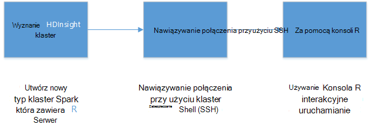

## Wymagania wstępne

* __Subskrypcja Azure__: przed rozpoczęciem tego samouczka, musisz mieć subskrypcję usługi Azure. Aby uzyskać więcej informacji, zobacz [Uzyskiwanie Azure bezpłatnej wersji próbnej](https://azure.microsoft.com/documentation/videos/get-azure-free-trial-for-testing-hadoop-in-hdinsight/) .

* __Klient Secure Shell (SSH)__: do zdalnie połączyć się z klastrem HDInsight i uruchomienie poleceń bezpośrednio w klastrze jest używany klient SSH. Systemy Linux, Unix lub OS X zapewniają klienta SSH za pośrednictwem `ssh` polecenia. W przypadku systemu zalecamy [Kit](http://www.chiark.greenend.org.uk/~sgtatham/putty/download.html).

    * __Klucze SSH (opcjonalnie)__: można zabezpieczyć konto SSH, używane do łączenia się z klastrem za pomocą hasła lub klucz publiczny. Za pomocą hasła jest łatwiejsze i umożliwia wprowadzenie bez konieczności tworzenia parę kluczy publicznych i prywatnych; przy użyciu klucza jest jednak zabezpieczyć.
    
        Kroki opisane w tym dokumencie przyjęto założenie, że używasz hasła. Aby uzyskać informacje na temat tworzenia i używania kluczy SSH z usługi HDInsight zobacz następujące dokumenty:
        
        * [Za pomocą SSH HDInsight od klientów Linux, Unix lub OS X](hdinsight-hadoop-linux-use-ssh-unix.md)
        
        * [Za pomocą SSH HDInsight przez klientów systemu Windows](hdinsight-hadoop-linux-use-ssh-windows.md)

### Wymagania dotyczące kontroli dostępu

[AZURE.INCLUDE [access-control](../../includes/hdinsight-access-control-requirements.md)]

## Utworzyć klaster

> [AZURE.NOTE] Kroki opisane w tym dokumencie tworzenia serwera R na HDInsight przy użyciu informacji o konfiguracji podstawowej. Inne ustawienia konfiguracji klaster (na przykład dodawania konta dodatkowego miejsca do magazynowania, używając Azure wirtualnej sieci lub tworzenie metastore gałęzi) zobacz [klastrów HDInsight oparte na tworzenie Linux](hdinsight-hadoop-provision-linux-clusters.md).

1. Zaloguj się do [portalu Azure](https://portal.azure.com).

2. Wybierz pozycję __Nowy__, __danych + analizy__, a następnie __HDInsight__.

    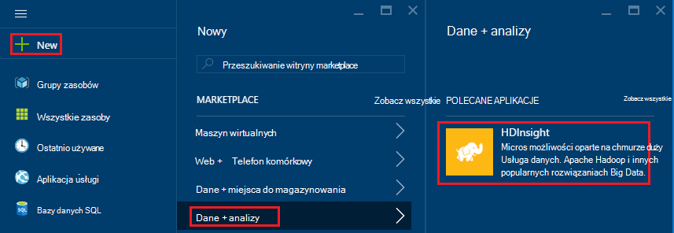

3. Wprowadź nazwę klaster w polu __Nazwa klaster__ . Jeśli masz wiele subskrypcji Azure, należy użyć wpisu __subskrypcji__ , wybierz ten, który ma być wyświetlany.

    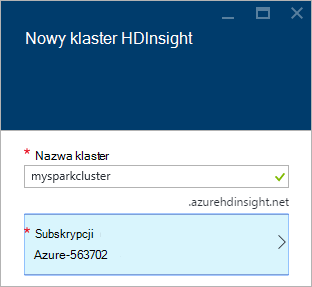

4. Wybierz __Typ klaster__. Na karta __Typ klaster__ wybierz następujące opcje:

    * __Typ klaster__: serwer R w iskrowym
    
    * __Klaster warstwa__: Premium

    Pozostaw domyślne wartości innych opcji, a następnie zapisania klaster przy użyciu przycisku __Wybierz__ .
    
    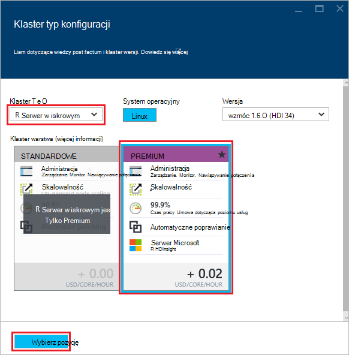
    
    > [AZURE.NOTE] Można również dodać R serwera z innymi typami klaster HDInsight (na przykład Hadoop lub HBase,), wybierając typ klaster, a następnie pozycję __Premium__.

5. Wybierz pozycję **Grupa zasobów** , aby wyświetlić listę istniejących grup zasobów, a następnie wybierz pozycję jeden, aby utworzyć klaster w. Lub wybierz polecenie **Utwórz nowy** i wprowadź nazwę nowej grupy zasobów. Zielony znacznik wyboru pojawi się w celu wskazania, że nazwę nowej grupy jest dostępna.

    > [AZURE.NOTE] Ten wpis jest domyślnie do jednego z istniejących grup zasobów, jeśli są dostępne.
    
    Przycisk __Wybierz__ umożliwia zapisywanie grupa zasobów.

6. Wybierz pozycję **poświadczenia**, a następnie wprowadź nazwę **Klaster logowania użytkownika** i **Hasło logowania klaster**.

    Wprowadź __nazwę użytkownika SSH__.  SSH umożliwia zdalne połączenia z klastrem przy użyciu klienta __Secure Shell (SSH)__ . W tym oknie dialogowym lub po utworzeniu klaster (kartę Konfiguracja klaster) można określić użytkownika SSH. R Server jest skonfigurowany do oczekiwać __nazwa_użytkownika SSH__ "remoteuser".  Jeśli używasz innej nazwy użytkownika, konieczne będzie wykonanie dodatkowych czynności, po utworzeniu klaster.
    
    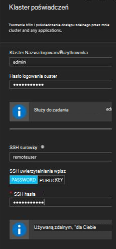

    __Typ uwierzytelniania SSH__: Wybierz __hasło__ jako typ uwierzytelniania, chyba że wolisz stosowania klucz publiczny.  Musisz pary kluczy publicznych i prywatnych, jeśli chcesz uzyskać dostęp do serwera R w klastrze za pośrednictwem klienta zdalnego, np. RTVS, RStudio lub innego pulpitu IDE.   

    Aby utworzyć i przy użyciu klucza publicznych i prywatnych pary zaznacz "Klucz PUBLICZNY" i wykonać następujące czynności.  W poniższych instrukcjach przyjęto, jest programów Cygwin z ssh-keygen lub odpowiednik zainstalowany.

    -    Generowanie pary kluczy publicznych i prywatnych z wiersza polecenia na komputerze przenośnym:
      
            SSH-keygen - t rsa -b 2048 — f < prywatne — klucz nazwa_pliku >
      
    -    Spowoduje to utworzenie plik klucza prywatnego i plik klucza publicznego w obszarze pub nazwa < prywatne — klucz nazwa_pliku > np.  davec i davec.pub.  Następnie określ plik klucza publicznego (* pub) podczas przypisywania HDI klaster poświadczeń:
      
        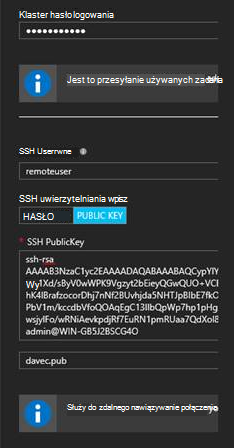  
      
    -    Zmienianie uprawnień do prywatnych pliku klucza na komputerze przenośnym
      
            chmod 600 < prywatny klucza filename >
      
    -    Za pomocą plik klucza prywatnego SSH do logowania zdalnego, np.
      
            SSH – i < prywatny klucza filename >remoteuser@<hostname public ip>
      
      lub jako część definicji kontekstu obliczeń Hadoop Spark R serwer na komputerze klienckim (zobacz przy użyciu serwera R jako klienta Hadoop w sekcji [Tworzenie obliczyć kontekst dla Spark](https://msdn.microsoft.com/microsoft-r/scaler-spark-getting-started#creating-a-compute-context-for-spark) online [RevoScaleR Hadoop Spark Przewodnik wprowadzający dla](https://msdn.microsoft.com/microsoft-r/scaler-spark-getting-started)).

7. Wybierz **Źródło danych** wybierz źródło danych dla klaster. Wybierz istniejące konto miejsca do magazynowania wybieranie __Wybierz konto miejsca do magazynowania__ , a następnie wybierając konto albo utwórz nowe konto, za pomocą łącza __Nowy__ w sekcji __Wybierz konto miejsca do magazynowania__ .

    Jeśli wybierzesz __Nowy__, wprowadź nazwę dla nowego konta miejsca do magazynowania. Zielony znacznik wyboru zostanie wyświetlona nazwa zostanie odebrane.

    __Kontener domyślny__ jest domyślnie nazwę grupie. Pozostaw to wartość.
    
    Wybierz __lokalizację__ , aby zaznaczyć obszar, aby utworzyć konto miejsca do magazynowania w.
    
    > [AZURE.IMPORTANT] Wybieranie lokalizacji domyślne źródło danych również ustawić lokalizację klaster HDInsight. Klaster i domyślne źródła danych musi znajdować się w tym samym regionie.

    Przycisk **Wybierz** umożliwia zapisywanie konfiguracji źródła danych.
    
    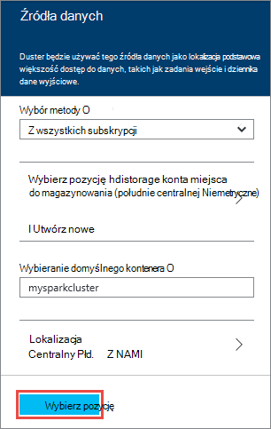

8. Zaznacz **Warstwy ceny węzeł** do wyświetlania informacji na temat węzły, które zostaną utworzone dla tej klaster. Jeśli nie znasz, musisz klastrze większe, pozostaw liczby węzłów pracownik domyślną `4`. Szacowany koszt klaster będą wyświetlane w karta.

    > [AZURE.NOTE] W razie potrzeby można zmieniać rozmiar klaster później za pośrednictwem portalu (klaster -> Ustawienia -> Skala klaster) aby zwiększyć lub zmniejszyć liczby węzłów pracownika.  Może to być przydatne wolnych w dół klaster nieużywane lub dodawania zdolności do potrzeb bardziej złożone zadania.

    Niektóre czynniki, które należy pamiętać podczas zmiany rozmiaru klaster, węzłów danych i węzeł krawędzi obejmują:  
   
    - Wydajność rozłożone analiz serwera R w iskrowym jest proporcjonalny do liczby węzłów pracownika, gdy danych jest duży.  
    - Wydajność serwera R analiz jest liniowa w rozmiarze analizowane dane. Na przykład:  
        - Mała, aby niewielkie danych wydajność będzie najlepiej, gdy są analizowane w kontekście lokalnym w węźle krawędzi.  Więcej informacji na temat scenariusze, w jakich lokalnych i konteksty obliczeń Spark działają najlepiej, zobacz Opcje kontekstu obliczeń dla serwera R na HDInsight. 
        - Jeśli Zaloguj się do węzła krawędzi i uruchomić swój skrypt R, a następnie wszystkie, ale funkcji odbierania ScaleR będzie wykonywać <strong>lokalnie</strong> w węźle krawędzi tak pamięci i liczby rdzeni węzła krawędzi powinny być o rozmiarze odpowiednio. To samo ma zastosowanie, jeśli korzystasz z serwera R na HDI jako kontekst obliczeń zdalnego z komputera przenośnego.
    
    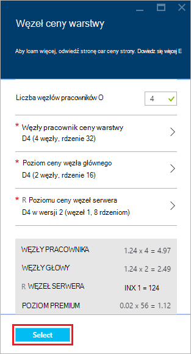

    Użyj przycisk **Wybierz** , aby zapisać węzeł ceny konfiguracji.
    
9. Na karta **Nowy klaster HDInsight** upewnij się, że jest zaznaczona opcja **Przypnij do Startboard** , a następnie wybierz pozycję **Utwórz**. To utworzy klaster i dodaj go kafelka do Startboard portalu sieci Azure. Ikona wskaże klastrem tworzy i zmieni się po zakończeniu tworzenia są oznaczone ikoną HDInsight.

  	| Podczas tworzenia | Zakończono tworzenie |
  	| ------------------ | --------------------- |
  	|  |  |

    > [AZURE.NOTE] Zajmie trochę czasu, aby klaster można utworzyć, zwykle około 15 minut. Użyj fragmentu na Startboard lub pozycję **powiadomienia** w lewej części strony, aby sprawdzić procesu tworzenia.

## Nawiązywanie połączenia z węzeł krawędzi serwera R

Nawiązywanie połączenia węzeł krawędzi serwera R klastrze HDInsight przy użyciu SSH:

    ssh USERNAME@r-server.CLUSTERNAME-ssh.azurehdinsight.net
    
> [AZURE.NOTE] Możesz również znaleźć `R-Server.CLUSTERNAME-ssh.azurehdinsight.net` adres w portalu Azure przez wybranie klaster, a następnie __Wszystkie ustawienia__, __aplikacji__i __użyciu polecenia RServer__. Spowoduje to wyświetlenie informacji punktu końcowego SSH węzła krawędzi.
>
> 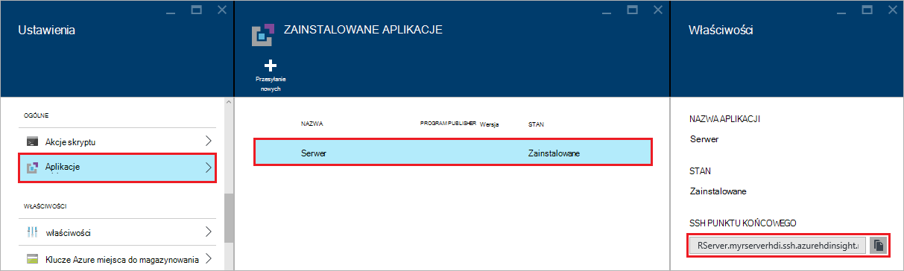
    
Jeżeli używasz hasła do zabezpieczenia konta użytkownika SSH, wyświetli się monit o wprowadź je. Jeśli został użyty klucz publiczny, może być konieczne używanie `-i` parametru do określenia pasujące klucz prywatny. Na przykład `ssh -i ~/.ssh/id_rsa USERNAME@R-Server.CLUSTERNAME-ssh.azurehdinsight.net`.
    
Aby uzyskać więcej informacji na temat korzystania z SSH z systemem Linux HDInsight zobacz następujące artykuły:

* [Używanie SSH z systemem Linux Hadoop na HDInsight z Linux, Unix lub systemu OS X](hdinsight-hadoop-linux-use-ssh-unix.md)

* [Używanie SSH z systemem Linux Hadoop na HDInsight z systemu Windows](hdinsight-hadoop-linux-use-ssh-windows.md)

Po nawiązaniu połączenia będzie obciążony wiersz podobny do następującego.

    username@ed00-myrser:~$

## Za pomocą konsoli R

1. Od sesji SSH Użyj następującego polecenia, aby uruchomić konsolę R.

        R
    
    Zostaną wyświetlone informacje podobne do następujących.
    
        R version 3.2.2 (2015-08-14) -- "Fire Safety"
        Copyright (C) 2015 The R Foundation for Statistical Computing
        Platform: x86_64-pc-linux-gnu (64-bit)

        R is free software and comes with ABSOLUTELY NO WARRANTY.
        You are welcome to redistribute it under certain conditions.
        Type 'license()' or 'licence()' for distribution details.

        Natural language support but running in an English locale

        R is a collaborative project with many contributors.
        Type 'contributors()' for more information and
        'citation()' on how to cite R or R packages in publications.

        Type 'demo()' for some demos, 'help()' for on-line help, or
        'help.start()' for an HTML browser interface to help.
        Type 'q()' to quit R.

        Microsoft R Server version 8.0: an enhanced distribution of R
        Microsoft packages Copyright (C) 2016 Microsoft Corporation

        Type 'readme()' for release notes.

        >

2. Z `>` monitu, można wprowadzić kod R. Serwer R zawiera pakiety, które umożliwiają łatwe interakcję Hadoop i uruchomić rozłożone obliczeń. Na przykład następujące polecenie do wyświetlania na poziomie głównym domyślnego systemu plików dla klastrów HDInsight.

        rxHadoopListFiles("/")
    
    Umożliwia także adresowania WASB styl.
    
        rxHadoopListFiles("wasbs:///")

## Przy użyciu serwera R w HDI ze zdalnego wystąpienia programu Microsoft R Server lub Microsoft R klienta

Na sekcji powyżej dotyczące stosowania pary kluczy publicznych i prywatnych, aby uzyskać dostęp do klaster istnieje możliwość ustawienia dostępu do kontekstu obliczeń HDI Hadoop Spark, ze zdalnego wystąpienia programu Microsoft R Server lub klient programu Microsoft R uruchomione na komputerze stacjonarnym lub przenośnym (zobacz przy użyciu serwera R jako klienta Hadoop w sekcji [Tworzenie obliczyć kontekst dla Spark](https://msdn.microsoft.com/microsoft-r/scaler-spark-getting-started#creating-a-compute-context-for-spark) online [RevoScaleR Hadoop Spark Przewodnik wprowadzający dla](https://msdn.microsoft.com/microsoft-r/scaler-spark-getting-started)).  W tym celu należy określić następujące opcje podczas definiowania RxSpark obliczyć kontekstu na komputerze przenośnym: hdfsShareDir, shareDir, sshUsername, sshHostname, sshSwitches i sshProfileScript. Na przykład:

    
    myNameNode <- "default"
    myPort <- 0 
 
    mySshHostname  <- 'rkrrehdi1-ssh.azurehdinsight.net'  # HDI secure shell hostname
    mySshUsername  <- 'remoteuser'# HDI SSH username
    mySshSwitches  <- '-i /cygdrive/c/Data/R/davec'   # HDI SSH private key
 
    myhdfsShareDir <- paste("/user/RevoShare", mySshUsername, sep="/")
    myShareDir <- paste("/var/RevoShare" , mySshUsername, sep="/")
 
    mySparkCluster <- RxSpark(
      hdfsShareDir = myhdfsShareDir,
      shareDir     = myShareDir,
      sshUsername  = mySshUsername,
      sshHostname  = mySshHostname,
      sshSwitches  = mySshSwitches,
      sshProfileScript = '/etc/profile',
      nameNode     = myNameNode,
      port         = myPort,
      consoleOutput= TRUE
    )

    
 
## Użyj kontekstu obliczeń

Kontekst obliczeń pozwala kontrolować, czy obliczenia będą wykonywane lokalnie w węźle krawędzi lub czy go rozdzielane w węzłach w klastrze HDInsight.
        
1. Za pomocą konsoli R ładowanie przykładowych danych do magazynowania domyślne dla HDInsight należy wykonać następujące kroki.

        # Set the HDFS (WASB) location of example data
        bigDataDirRoot <- "/example/data"
        # create a local folder for storaging data temporarily
        source <- "/tmp/AirOnTimeCSV2012"
        dir.create(source)
        # Download data to the tmp folder
        remoteDir <- "http://packages.revolutionanalytics.com/datasets/AirOnTimeCSV2012"
        download.file(file.path(remoteDir, "airOT201201.csv"), file.path(source, "airOT201201.csv"))
        download.file(file.path(remoteDir, "airOT201202.csv"), file.path(source, "airOT201202.csv"))
        download.file(file.path(remoteDir, "airOT201203.csv"), file.path(source, "airOT201203.csv"))
        download.file(file.path(remoteDir, "airOT201204.csv"), file.path(source, "airOT201204.csv"))
        download.file(file.path(remoteDir, "airOT201205.csv"), file.path(source, "airOT201205.csv"))
        download.file(file.path(remoteDir, "airOT201206.csv"), file.path(source, "airOT201206.csv"))
        download.file(file.path(remoteDir, "airOT201207.csv"), file.path(source, "airOT201207.csv"))
        download.file(file.path(remoteDir, "airOT201208.csv"), file.path(source, "airOT201208.csv"))
        download.file(file.path(remoteDir, "airOT201209.csv"), file.path(source, "airOT201209.csv"))
        download.file(file.path(remoteDir, "airOT201210.csv"), file.path(source, "airOT201210.csv"))
        download.file(file.path(remoteDir, "airOT201211.csv"), file.path(source, "airOT201211.csv"))
        download.file(file.path(remoteDir, "airOT201212.csv"), file.path(source, "airOT201212.csv"))
        # Set directory in bigDataDirRoot to load the data into
        inputDir <- file.path(bigDataDirRoot,"AirOnTimeCSV2012") 
        # Make the directory
        rxHadoopMakeDir(inputDir)
        # Copy the data from source to input
        rxHadoopCopyFromLocal(source, bigDataDirRoot)

2. Następnie Załóżmy tworzenie niektóre informacje danych i zdefiniować dwóch źródeł danych, tak aby można było pracować z danymi.

        # Define the HDFS (WASB) file system
        hdfsFS <- RxHdfsFileSystem()
        # Create info list for the airline data
        airlineColInfo <- list(
            DAY_OF_WEEK = list(type = "factor"),
            ORIGIN = list(type = "factor"),
            DEST = list(type = "factor"),
            DEP_TIME = list(type = "integer"),
            ARR_DEL15 = list(type = "logical"))

        # get all the column names
        varNames <- names(airlineColInfo)

        # Define the text data source in hdfs
        airOnTimeData <- RxTextData(inputDir, colInfo = airlineColInfo, varsToKeep = varNames, fileSystem = hdfsFS)
        # Define the text data source in local system
        airOnTimeDataLocal <- RxTextData(source, colInfo = airlineColInfo, varsToKeep = varNames)

        # formula to use
        formula = "ARR_DEL15 ~ ORIGIN + DAY_OF_WEEK + DEP_TIME + DEST"

3. Załóżmy uruchamianie regresją nad danymi przy użyciu lokalnego obliczyć kontekstu.

        # Set a local compute context
        rxSetComputeContext("local")
        # Run a logistic regression
        system.time(
            modelLocal <- rxLogit(formula, data = airOnTimeDataLocal)
        )
        # Display a summary 
        summary(modelLocal)

    Powinien zostać wyświetlony wynik kończący się linie podobny do następującego.

        Data: airOnTimeDataLocal (RxTextData Data Source)
        File name: /tmp/AirOnTimeCSV2012
        Dependent variable(s): ARR_DEL15
        Total independent variables: 634 (Including number dropped: 3)
        Number of valid observations: 6005381
        Number of missing observations: 91381
        -2*LogLikelihood: 5143814.1504 (Residual deviance on 6004750 degrees of freedom)

        Coefficients:
                        Estimate Std. Error z value Pr(>|z|)
        (Intercept)   -3.370e+00  1.051e+00  -3.208  0.00134 **
        ORIGIN=JFK     4.549e-01  7.915e-01   0.575  0.56548
        ORIGIN=LAX     5.265e-01  7.915e-01   0.665  0.50590
        ......
        DEST=SHD       5.975e-01  9.371e-01   0.638  0.52377
        DEST=TTN       4.563e-01  9.520e-01   0.479  0.63172
        DEST=LAR      -1.270e+00  7.575e-01  -1.676  0.09364 .
        DEST=BPT         Dropped    Dropped Dropped  Dropped
        ---
        Signif. codes:  0 ‘***’ 0.001 ‘**’ 0.01 ‘*’ 0.05 ‘.’ 0.1 ‘ ’ 1

        Condition number of final variance-covariance matrix: 11904202
        Number of iterations: 7

4. Dalej Przejdźmy uruchamianie samej regresją w kontekście Spark. Kontekst Spark będzie rozpowszechniać przetwarzania przez wszystkie węzły pracownika w klastrze HDInsight.

        # Define the Spark compute context 
        mySparkCluster <- RxSpark()
        # Set the compute context 
        rxSetComputeContext(mySparkCluster)
        # Run a logistic regression 
        system.time(  
            modelSpark <- rxLogit(formula, data = airOnTimeData)
        )
        # Display a summary
        summary(modelSpark)

    > [AZURE.NOTE] Za pomocą MapReduce do rozpowszechniania obliczeń w węzłach. Aby uzyskać więcej informacji w kontekście obliczeń zobacz [obliczyć kontekstu opcje serwera R na HDInsight premium](hdinsight-hadoop-r-server-compute-contexts.md).

## Rozpowszechnianie kod R, aby wiele węzłów

Z serwerem R łatwo istniejący kod R, można uruchomić go w różnych węzłach w klastrze przy użyciu `rxExec`. Jest to przydatne, gdy wykonując wyczyść parametru lub symulacji. Oto przykład zastosowania `rxExec`.

    rxExec( function() {Sys.info()["nodename"]}, timesToRun = 4 )
    
Jeśli nadal używasz kontekście Spark lub MapReduce, to zwróci wartość NazwaWęzła węzły pracownik który kod (`Sys.info()["nodename"]`) jest uruchomiono. Na przykład w klastrze cztery węzeł może zostać wyświetlony wynik podobny do następującego.

    $rxElem1
        nodename
    "wn3-myrser"

    $rxElem2
        nodename
    "wn0-myrser"

    $rxElem3
        nodename
    "wn3-myrser"

    $rxElem4
        nodename
    "wn3-myrser"

## Zainstalować pakiety R

Jeśli chcesz zainstalować dodatkowe pakiety R w węźle krawędzi, możesz użyć `install.packages()` bezpośrednio z poziomu R konsoli po podłączeniu do węzła krawędzi za pośrednictwem SSH. Jednak jeśli musisz zainstalować pakiety R w węzłach pracownik klaster, należy użyć akcji skryptu.

Akcje skryptu są skrypty imprezie, które są używane do wprowadzania zmian w konfiguracji do klastrów HDInsight ani do zainstalowania dodatkowego oprogramowania. W tym przypadku dodatkowe R zainstalować pakiety. Aby zainstalować dodatkowe pakiety przy użyciu akcji skrypt, wykonaj następujące czynności.

> [AZURE.IMPORTANT] Używanie akcji skrypt do zainstalowania dodatkowe pakiety R można używać tylko po utworzeniu klaster. Nie należy można używać podczas tworzenia klaster, jak skrypt korzysta z serwera R, całkowicie zainstalowana i skonfigurowana.

1. [Azure portal](https://portal.azure.com)zaznacz serwera R w klastrze HDInsight.

2. Z karta klaster zaznacz __Wszystkie ustawienia__, a następnie __Skrypt akcji__. Karta __Akcje skryptu__ zaznacz __Przesyłanie nowych__ przesyłanie nowej akcji skryptów.

    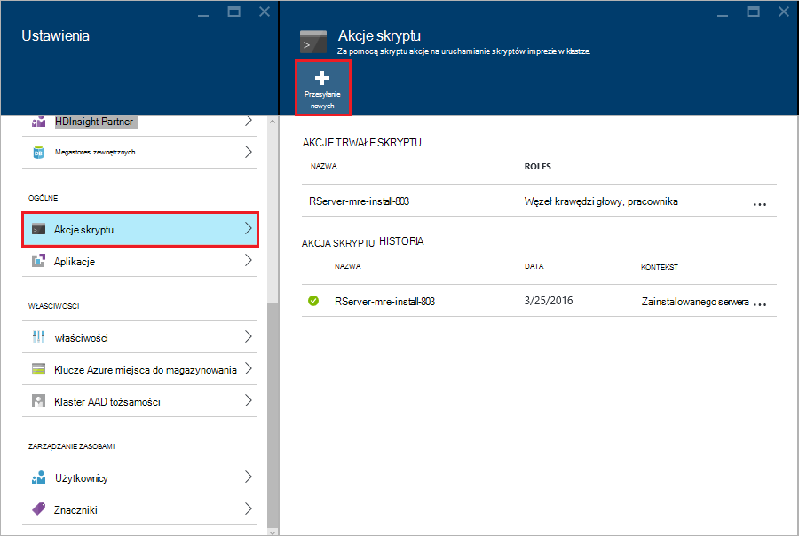

3. Z karta __Akcja skrypt przesyłania__ wprowadź następujące informacje.

  - __Nazwa__: przyjazną nazwę identyfikującą tego skryptu
  - __Urodzinową skryptu identyfikatora URI__:`http://mrsactionscripts.blob.core.windows.net/rpackages-v01/InstallRPackages.sh`
  - __Szef__: to powinny być __zaznaczone__
  - __Pracownik__: to powinny być __zaznaczone pole wyboru__
  - __Zookeeper__: to powinny być __zaznaczone__
  - __Parametry__: R pakiety do zainstalowania. Na przykład`bitops stringr arules`
  - __Utrwalania skryptu..__: to powinny być __zaznaczone__  

    > [AZURE.NOTE] 1. Domyślnie wszystkie pakiety R są instalowane z migawki Microsoft MRAN repozytorium zgodny z wersji serwera R, który został zainstalowany.  Jeśli chcesz zainstalować nowsze wersje pakietów, a następnie niektórych ryzyko niezgodności, jednak jest to możliwe, określając `useCRAN` jako pierwszy element pakietu listy, np.  `useCRAN bitops, stringr, arules`.  
    > 2. Niektóre pakiety R wymaga dodatkowe biblioteki system Linux. Dla wygody możemy zainstalowano wstępnie zależności wymagane przez górny 100 najpopularniejszych pakietów R. Jednak jeśli pakiety R, które można zainstalować wymagają bibliotek poza te, następnie należy pobrać podstawowy skrypt używane w tym miejscu i dodaj kroki, aby zainstalować bibliotek systemu. Należy przekazać zmodyfikowany skrypt do kontenera obiektów blob publicznej w magazynie Azure i zainstalować pakiety za pomocą skryptu zmienione.
    > Aby uzyskać więcej informacji o tworzeniu akcji skryptu zobacz [rozwoju skrypt akcji](hdinsight-hadoop-script-actions-linux.md).  

    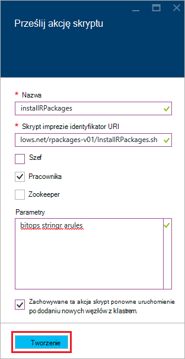

4. Wybierz pozycję __Utwórz__ , aby uruchomić skrypt. Po zakończeniu działania skrypt pakietów R będą dostępne we wszystkich węzłach pracownika.
    
## Następne kroki

Teraz, gdy wiesz, jak utworzyć nowy klaster HDInsight, zawierająca R serwera i podstawy za pomocą konsoli R z sesji SSH, należy wykonać następujące kroki innych sposobów pracy z serwerem R na HDInsight.

- [Dodawanie serwera RStudio do HDInsight premium](hdinsight-hadoop-r-server-install-r-studio.md)

- [Obliczanie kontekstu opcje serwera R na HDInsight premium](hdinsight-hadoop-r-server-compute-contexts.md)

- [Azure Opcje miejsca do magazynowania dla serwera R na HDInsight premium](hdinsight-hadoop-r-server-storage.md)

### Azure szablony Menedżera zasobów

Jeśli interesują Cię Automatyzacja tworzenia serwera R na używanie szablonów Menedżera zasobów Azure HDInsight, zobacz następujące szablony przykład.

* [Utwórz na serwerze R w węźle HDInsight przy użyciu klucza publicznego SSH](http://go.microsoft.com/fwlink/p/?LinkID=780809)
* [Utwórz na serwerze R w węźle HDInsight przy użyciu hasła SSH](http://go.microsoft.com/fwlink/p/?LinkID=780810)

Oba szablony utworzyć nowy klaster HDInsight i konto skojarzone miejsca do magazynowania i mogą być używane polecenie Azure, Azure programu PowerShell lub Azure Portal.

Aby uzyskać ogólne informacje na temat korzystania z szablonów Menedżera zasobów Azure zobacz [Hadoop systemem Linux oraz tworzenie klastrów w korzystania z szablonów Menedżera zasobów Azure HDInsight](hdinsight-hadoop-create-linux-clusters-arm-templates.md).
