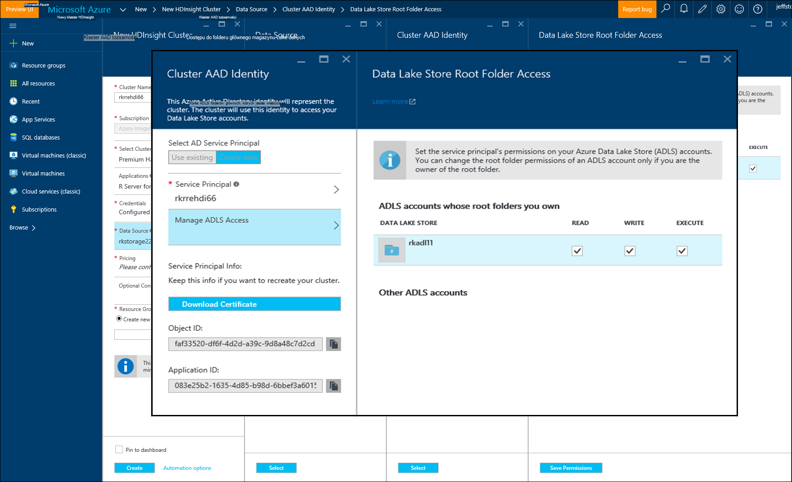

<properties
   pageTitle="Azure Opcje miejsca do magazynowania dla serwera R na HDInsight (wersja preview) | Microsoft Azure"
   description="Więcej informacji na temat różnych przestrzeni dyskowej opcje dostępne dla użytkowników z serwerem R na HDInsight (wersja preview)"
   services="HDInsight"
   documentationCenter=""
   authors="jeffstokes72"
   manager="jhubbard"
   editor="cgronlun"
/>

<tags
   ms.service="HDInsight"
   ms.devlang="R"
   ms.topic="article"
   ms.tgt_pltfrm="na"
   ms.workload="data-services"
   ms.date="09/01/2016"
   ms.author="jeffstok"
/>

# <a name="azure-storage-options-for-r-server-on-hdinsight-preview"></a>Azure Opcje miejsca do magazynowania dla serwera R na HDInsight (wersja preview)

Microsoft Server R w HDInsight (wersja preview) ma dostęp do obu obiektów Blob platformy Azure i [Przechowywania Lake danych Azure](https://azure.microsoft.com/services/data-lake-store/)sposób utrwalanie danych, kod, wynik obiektów z analizy i tak dalej.

Po utworzeniu klastrze Hadoop w HDInsight Określ konto Azure miejsca do magazynowania. Określonego kontenera magazyn obiektów Blob z tego konta zawiera system plików dla klaster, w którym możesz utworzyć (na przykład Hadoop rozproszony System plików). Ze względów wydajności klaster HDInsight jest tworzony w tym samym centrum danych jako konto podstawowy, określonym przez użytkownika. Aby uzyskać więcej informacji zobacz [Magazyn obiektów Blob platformy Azure korzystanie z usługi HDInsight](hdinsight-hadoop-use-blob-storage.md "Magazyn obiektów Blob platformy Azure korzystanie z usługi HDInsight").   


## <a name="use-multiple-azure-blob-storage-accounts"></a>Używanie wielu kont magazyn obiektów Blob platformy Azure

W razie potrzeby uzyskiwania dostępu do wielu kont Azure miejsca do magazynowania lub kontenery z klaster HDI. Aby to zrobić, musisz określić konta dodatkowego miejsca do magazynowania w interfejsie użytkownika, kiedy utworzyć klaster, a następnie wykonaj poniższe czynności, aby używać ich w R.  

1.  Utwórz klaster HDInsight nazwą konta miejsca do magazynowania **storage1** i domyślnego kontenera o nazwie **container1**.
2. Określanie konta dodatkowe miejsce w magazynie o nazwie **storage2**.  
3. Skopiuj plik mycsv.csv do katalogu/share i przeprowadzania analizy dla tego pliku.  

    ````
    hadoop fs –mkdir /share
    hadoop fs –copyFromLocal myscsv.scv /share  
    ````

3.  W kodzie R ustaw **Domyślnie** węzeł nazwę i ustaw z katalogów i plików do procesu.  

    ````
    myNameNode <- "default"
    myPort <- 0
    ````

  Lokalizacja danych:  

    bigDataDirRoot <-"/ share"  

  Definiowanie Spark obliczeń kontekstu:

    mySparkCluster <-RxSpark(consoleOutput=TRUE)

  Ustaw kontekst obliczeń:

    rxSetComputeContext(mySparkCluster)

  Definiowanie systemu plików systemu plików Distributed Hadoop (HDFS):

    hdfsFS <-RxHdfsFileSystem (nazwa hosta = myNameNode, port = myPort)

  Określ plik wprowadzania danych do przeanalizowania w HDFS:

    Plik_wejściowy <-file.path(bigDataDirRoot,"mycsv.csv")

Wszystkie odwołania katalogów i plików wskaż konto miejsca do magazynowania wasbs://container1@storage1.blob.core.windows.net. Jest **domyślne konto miejsca do magazynowania** , który jest skojarzony z klastrem HDInsight.

Załóżmy, że przetwarzania w pliku o nazwie mySpecial.csv, który znajduje się w /private systemu **container2** w **storage2**.

W kodzie R wskaż nazwa węzeł odwołania do rachunku **storage2** miejsca do magazynowania.

    myNameNode <- "wasbs://container2@storage2.blob.core.windows.net"
    myPort <- 0

  Lokalizacja danych:

    bigDataDirRoot <- "/private"

  Definiowanie Spark obliczeń kontekstu:

    mySparkCluster <- RxSpark(consoleOutput=TRUE, nameNode=myNameNode, port=myPort)

  Ustaw kontekst obliczeń:

    rxSetComputeContext(mySparkCluster)

  Definiowanie system plików HDFS:

    hdfsFS <- RxHdfsFileSystem(hostName=myNameNode, port=myPort)

  Określ plik wprowadzania danych do przeanalizowania w HDFS:

    inputFile <-file.path(bigDataDirRoot,"mySpecial.csv")

Wszystkie odwołania katalogów i plików teraz wskaż konto miejsca do magazynowania wasbs://container2@storage2.blob.core.windows.net. Jest to **Nazwa węzła** określone.

Uwaga, że musisz skonfigurować/User/RevoShare/<SSH username> katalogu na **storage2** w następujący sposób:

    hadoop fs -mkdir wasbs://container2@storage2.blob.core.windows.net/user
    hadoop fs -mkdir wasbs://container2@storage2.blob.core.windows.net/user/RevoShare
    hadoop fs -mkdir wasbs://container2@storage2.blob.core.windows.net/user/RevoShare/<RDP username>

## <a name="use-an-azure-data-lake-store"></a>Użycie magazynu Lake danych Azure

Aby użyć sklepy Lake danych za pomocą konta usługi HDInsight, należy udzielić dostępu klaster do każdego sklepu Azure Lake danych, który ma być używany. Można używać sklepu za pomocą skryptu R podobnie jak korzystasz z konta magazynu pomocniczego (zgodnie z opisem w poprzedniej procedurze).

## <a name="add-cluster-access-to-your-azure-data-lake-stores"></a>Dodaj klaster dostęp do sklepach Lake danych Azure

Masz dostęp do magazynu Lake danych przy użyciu kapitału usługi Azure Active Directory (Azure AD), który jest skojarzony z klaster HDInsight.

### <a name="to-add-a-service-principal"></a>Aby dodać wystawcy usługi
1. Po utworzeniu klaster HDInsight wybierz **Klaster AAD tożsamości** , na karcie **Źródło danych** .
2. W oknie dialogowym **Tożsamości AAD klaster** w obszarze **Wybierz kapitału usług AD**wybierz pozycję **Utwórz nowy**.

Po nazwę wystawcy usługi i tworzyć hasła dla niej zostanie otwarta nowa karta miejsce, w którym możesz skojarzyć wystawcy usługi z sklepach Lake danych.

Uwaga, że można również dodać dostępu do magazynu danych Lake później, otwierając sklepu Lake danych w portalu Azure i przechodzenie do **Eksplorator danych** > **programu Access**.  Oto przykład okna dialogowego, która pokazuje, jak utworzyć wystawcy usługi i skojarzyć sklepu Lake danych "rkadl11".




## <a name="use-the-data-lake-store-with-r-server"></a>W sklepie Lake danych za pomocą serwera R
Po udzieleniu dostępu do sklepu Lake danych, korzystając z magazynu w R Server na HDInsight tak samo konto Azure magazyn pomocniczy. Jedyną różnicą jest prefiks **wasb: / /** zmieni się na **adl: / /** w następujący sposób:

````
# Point to the ADL store (e.g. ADLtest)
myNameNode <- "adl://rkadl1.azuredatalakestore.net"
myPort <- 0

# Location of the data (assumes a /share directory on the ADL account)
bigDataDirRoot <- "/share"  

# Define Spark compute context
mySparkCluster <- RxSpark(consoleOutput=TRUE, nameNode=myNameNode, port=myPort)

# Set compute context
rxSetComputeContext(mySparkCluster)

# Define HDFS file system
hdfsFS <- RxHdfsFileSystem(hostName=myNameNode, port=myPort)

# Specify the input file in HDFS to analyze
inputFile <-file.path(bigDataDirRoot,"AirlineDemoSmall.csv")

# Create factors for days of the week
colInfo <- list(DayOfWeek = list(type = "factor",
               levels = c("Monday", "Tuesday", "Wednesday", "Thursday",
                          "Friday", "Saturday", "Sunday")))

# Define the data source
airDS <- RxTextData(file = inputFile, missingValueString = "M",
                    colInfo  = colInfo, fileSystem = hdfsFS)

# Run a linear regression
model <- rxLinMod(ArrDelay~CRSDepTime+DayOfWeek, data = airDS)
````

Poniżej przedstawiono polecenia, które są używane do konfigurowania konta miejsca do magazynowania danych Lake z katalogu RevoShare i dodawanie przykładowy plik CSV z poprzedniego przykładu:

````
hadoop fs -mkdir adl://rkadl1.azuredatalakestore.net/user
hadoop fs -mkdir adl://rkadl1.azuredatalakestore.net/user/RevoShare
hadoop fs -mkdir adl://rkadl1.azuredatalakestore.net/user/RevoShare/<user>

hadoop fs -mkdir adl://rkadl1.azuredatalakestore.net/share

hadoop fs -copyFromLocal /usr/lib64/R Server-7.4.1/library/RevoScaleR/SampleData/AirlineDemoSmall.csv adl://rkadl1.azuredatalakestore.net/share

hadoop fs –ls adl://rkadl1.azuredatalakestore.net/share
````

## <a name="use-azure-files-on-the-edge-node"></a>Korzystanie z plików Azure w węźle krawędzi

Jest też dostępny miejsca do magazynowania wygodny danych do użycia w węźle krawędzi, nazywane [Pliki Azure](../storage/storage-how-to-use-files-linux.md "Azure plików"). Umożliwia zainstalować Magazyn Azure udziale plików w systemie plików Linux. Może to być przydatne do przechowywania plików danych, R skrypty i wynik obiektów, które mogą być potrzebne później, gdy jest to właściwe rozwiązanie przy użyciu systemu plików natywnych węzeł krawędzi zamiast HDFS.

Główną zaletą plików Azure to, że udziałach plików można zainstalować i używane przez system z obsługiwane systemy operacyjne, takie jak Windows i Linux oraz. Na przykład może używany przez inny klaster HDInsight zawierającą Ciebie lub inną członkom zespołu, maszyn wirtualnych Azure lub nawet przez system lokalnego.


## <a name="next-steps"></a>Następne kroki

Teraz, aby poznać podstawowe zagadnienia dotyczące korzystania z konsoli R z sesji SSH i Utwórz nowy klaster HDInsight zawierającym R Server, użyj następujących łączy do innych sposobów pracy z serwerem R na HDInsight.

- [Omówienie serwera R w HDInsight](hdinsight-hadoop-r-server-overview.md)
- [Rozpoczynanie pracy z serwerem R na Hadoop](hdinsight-hadoop-r-server-get-started.md)
- [Dodawanie serwera RStudio do HDInsight premium](hdinsight-hadoop-r-server-install-r-studio.md)
- [Obliczanie kontekstu opcje serwera R na HDInsight](hdinsight-hadoop-r-server-compute-contexts.md)
