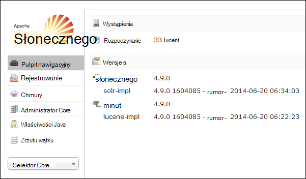
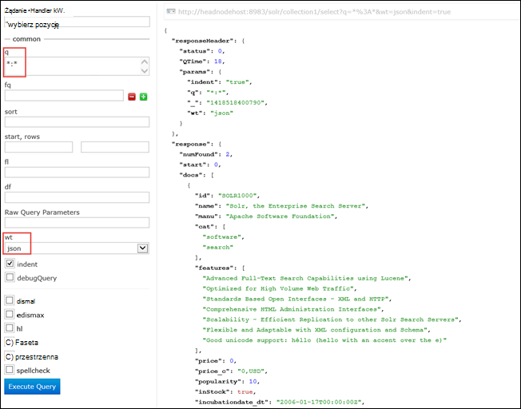

<properties
    pageTitle="Za pomocą akcji skrypt można zainstalować Solr na podstawie Linux HDInsight | Microsoft Azure"
    description="Dowiedz się, jak zainstalować Solr na klastrów systemem Linux HDInsight Hadoop za pomocą skryptu akcje."
    services="hdinsight"
    documentationCenter=""
    authors="Blackmist"
    manager="jhubbard"
    editor="cgronlun"
    tags="azure-portal"/>

<tags
    ms.service="hdinsight"
    ms.workload="big-data"
    ms.tgt_pltfrm="na"
    ms.devlang="na"
    ms.topic="article"
    ms.date="10/03/2016"
    ms.author="larryfr"/>

# Instalowanie i używanie Solr na klastrów HDInsight Hadoop

W tym temacie dowiesz się, jak zainstalować Solr na Azure HDInsight za pomocą skryptu akcji. Solr platforma wyszukiwanie zaawansowane, a także możliwości wyszukiwania na poziomie przedsiębiorstwa na danych zarządzanych przez Hadoop. Po zainstalowaniu Solr w klastrze HDInsight również dowiesz sposoby wyszukiwania danych przy użyciu Solr.

> [AZURE.NOTE] Kroki opisane w tym dokumencie wymagają klastrze HDInsight systemem Linux. Dla informacji na temat używania Solr z klastrem bazującym na systemie Windows zobacz [Instalowanie i używanie Solr na HDinsight Hadoop klastrów (Windows)](hdinsight-hadoop-solr-install.md)

Przykładowy skrypt używane w tym temacie tworzy klaster Solr z określonej konfiguracji. Aby skonfigurować klaster Solr z różnych zbiorów, odłamki, schematy, replik itp., należy odpowiednio zmodyfikować skrypt i danych binarnych Solr.

## Co to jest Solr?

[Apache Solr](http://lucene.apache.org/solr/features.html) jest platformą wyszukiwania przedsiębiorstwa umożliwiający zaawansowane wyszukiwanie pełnotekstowe na danych. Podczas Hadoop umożliwia przechowywanie i zarządzanie nią dużych ilości danych, Apache Solr zapewnia możliwości wyszukiwania, aby szybko pobrać dane. Ten temat zawiera instrukcje dotyczące dostosowywania klaster HDInsight, aby zainstalować Solr.

> [AZURE.WARNING] Składniki dostarczony z klastrem HDInsight są w pełni obsługiwane i Microsoft Support pomogą izolowanie i rozwiązywanie problemów związanych z tych składników.
>
> Składniki niestandardowe, takie jak Solr, otrzymają komercyjnego rozsądne pomocy technicznej, aby pomóc rozwiązać ten problem. Może to spowodować w rozwiązaniu problemu lub pytaniem nawiązanie dostępnych kanałów technologiami Otwórz źródło miejsce, w którym znajduje się głębokości specjalizacji tej technologii. Na przykład, istnieje wiele witryn społeczności, których można używać, takich jak: [forum w witrynie MSDN HDInsight](https://social.msdn.microsoft.com/Forums/azure/en-US/home?forum=hdinsight), [http://stackoverflow.com](http://stackoverflow.com). Projekty Apache mieć także witryn projektów na [http://apache.org](http://apache.org), na przykład: [Hadoop](http://hadoop.apache.org/).

## Co oznacza skryptu

Ten skrypt wprowadza następujące zmiany do klastrów HDInsight:

* Instalacje Solr do`/usr/hdp/current/solr`
* Umożliwia utworzenie nowego użytkownika, __solrusr__, który jest używany do uruchamiania usługi Solr
* Ustawia __solruser__ jako właściciel`/usr/hdp/current/solr`
* Dodaje [Upstart](http://upstart.ubuntu.com/) konfiguracji, która zostanie uruchomiona Solr, po ponownym uruchomieniu węzła. Solr jest również automatycznie uruchamiany w węzłach klaster po zakończeniu instalacji

## Instalowanie Solr przy użyciu akcji skryptu

Przykładowy skrypt, aby zainstalować Solr w klastrze HDInsight jest dostępna w następującej lokalizacji.

    https://hdiconfigactions.blob.core.windows.net/linuxsolrconfigactionv01/solr-installer-v01.sh

Ta sekcja zawiera instrukcje dotyczące sposobu używania przykładowy skrypt, podczas tworzenia nowego klaster za pomocą portalu Azure. 

> [AZURE.NOTE] Azure programu PowerShell, polecenie Azure, HDInsight .NET SDK lub Menedżer zasobów Azure szablony można również stosowanie akcji skryptów. Akcje skryptu można też zastosowane do już uruchomiony klastrów. Aby uzyskać więcej informacji zobacz [Dostosowywanie HDInsight klastrów z akcjami skrypt](hdinsight-hadoop-customize-cluster-linux.md).

1. Rozpoczynanie inicjowania obsługi administracyjnej klastrze, wykonując kroki opisane w [klastrów systemem Linux świadczenia usługi HDInsight](hdinsight-hadoop-create-linux-clusters-portal.md), ale nie zostanie inicjowania obsługi administracyjnej.

2. Na karta **Opcjonalnym** wybierz **Akcje skryptu**i wprowadź poniższe informacje:

    * __Nazwa__: Wprowadź przyjazną nazwę akcji skryptów.
    * __Identyfikator URI skrypt__: https://hdiconfigactions.blob.core.windows.net/linuxsolrconfigactionv01/solr-installer-v01.sh
    * __Głowy__: Zaznaczenie tego pola wyboru
    * __Pracownik__: Zaznaczenie tego pola wyboru
    * __ZOOKEEPER__: Zaznacz tę opcję, aby zainstalować w węźle Zookeeper
    * __Parametry__: pozostaw to pole puste

3. U dołu **Akcje skrypt**Użyj przycisk **Wybierz** , aby zapisać konfigurację. Na koniec używania przycisku **Zaznaczenie** u dołu karta **Opcjonalnym** do zapisywania informacji opcjonalnym.

4. Kontynuuj inicjowania obsługi administracyjnej klaster, zgodnie z opisem w [klastrów systemem Linux świadczenia usługi HDInsight](hdinsight-hadoop-create-linux-clusters-portal.md).

## Jak korzystać z Solr w HDInsight?

### Indeksowanie danych

Musi się zaczynać indeksowania Solr przy użyciu niektóre pliki danych. Następnie można Solr uruchamianie kwerend wyszukiwania danych indeksowane. Wykonaj następujące czynności, aby dodać kilka przykładowych danych do Solr, a następnie go kwerendy:

1. Nawiązywanie połączenia z klastrem HDInsight SSH:

        ssh USERNAME@CLUSTERNAME-ssh.azurehdinsight.net

    Aby uzyskać więcej informacji na temat korzystania z usługi HDInsight SSH zobacz:

    * [Używanie SSH z systemem Linux Hadoop na HDInsight z Linux, Unix lub systemu OS X](hdinsight-hadoop-linux-use-ssh-unix.md)

    * [Używanie SSH z systemem Linux Hadoop na HDInsight z systemu Windows](hdinsight-hadoop-linux-use-ssh-windows.md)

    > [AZURE.IMPORTANT] Procedura później dokonać tego dokumentu stosowania tunelem SSL nawiązywania połączenia z sieci web Solr interfejsu użytkownika. Aby wykonać te kroki, należy ustalić tunelem SSL, a następnie skonfiguruj przeglądarki, aby go używać.
    >
    > Aby uzyskać więcej informacji zobacz [Używanie SSH Tunneling dostęp do sieci web Ambari interfejsu użytkownika, ResourceManager, JobHistory, NameNode, Oozie i inne osoby interfejs użytkownika w sieci web](hdinsight-linux-ambari-ssh-tunnel.md)

2. Aby Solr indeks przykładowych danych, należy użyć następujących poleceń:

        cd /usr/hdp/current/solr/example/exampledocs
        java -jar post.jar solr.xml monitor.xml

    Zostanie wyświetlony następujący komunikat na konsoli:

        POSTing file solr.xml
        POSTing file monitor.xml
        2 files indexed.
        COMMITting Solr index changes to http://localhost:8983/solr/update..
        Time spent: 0:00:01.624

    Narzędzie post.jar indeksy Solr z dokumentami dwie próby, **solr.xml** i **monitor.xml**. Są one przechowywane w __collection1__ w Solr.

3. Kwerenda interfejsu API usługi REST ujawnionego przez Solr należy wykonać następujące kroki:

        curl "http://localhost:8983/solr/collection1/select?q=*%3A*&wt=json&indent=true"

    Problemy to zapytanie __collection1__ dla wszystkich dokumentów pasujących __ \*:\* __ (kodowane jako \*% 3A\* w ciągu kwerendy) oraz że odpowiedzi powinny być zwracane jako JSON. Odpowiedź powinna wyglądać podobnie do następującej:

            "response": {
                "numFound": 2,
                "start": 0,
                "maxScore": 1,
                "docs": [
                  {
                    "id": "SOLR1000",
                    "name": "Solr, the Enterprise Search Server",
                    "manu": "Apache Software Foundation",
                    "cat": [
                      "software",
                      "search"
                    ],
                    "features": [
                      "Advanced Full-Text Search Capabilities using Lucene",
                      "Optimized for High Volume Web Traffic",
                      "Standards Based Open Interfaces - XML and HTTP",
                      "Comprehensive HTML Administration Interfaces",
                      "Scalability - Efficient Replication to other Solr Search Servers",
                      "Flexible and Adaptable with XML configuration and Schema",
                      "Good unicode support: héllo (hello with an accent over the e)"
                    ],
                    "price": 0,
                    "price_c": "0,USD",
                    "popularity": 10,
                    "inStock": true,
                    "incubationdate_dt": "2006-01-17T00:00:00Z",
                    "_version_": 1486960636996878300
                  },
                  {
                    "id": "3007WFP",
                    "name": "Dell Widescreen UltraSharp 3007WFP",
                    "manu": "Dell, Inc.",
                    "manu_id_s": "dell",
                    "cat": [
                      "electronics and computer1"
                    ],
                    "features": [
                      "30\" TFT active matrix LCD, 2560 x 1600, .25mm dot pitch, 700:1 contrast"
                    ],
                    "includes": "USB cable",
                    "weight": 401.6,
                    "price": 2199,
                    "price_c": "2199,USD",
                    "popularity": 6,
                    "inStock": true,
                    "store": "43.17614,-90.57341",
                    "_version_": 1486960637584081000
                  }
                ]
              }

### Za pomocą pulpitu nawigacyjnego Solr

Pulpit nawigacyjny Solr jest interfejsu użytkownika, który umożliwia pracę z Solr za pośrednictwem przeglądarki sieci web w sieci web. Pulpit nawigacyjny Solr nie jest dostępna bezpośrednio w Internecie z klaster HDInsight, ale muszą być dostępne za pomocą tunelem SSH. Aby uzyskać więcej informacji na temat korzystania z tunelem SSH zobacz [Używanie SSH Tunneling dostęp do sieci web Ambari interfejsu użytkownika, ResourceManager, JobHistory, NameNode, Oozie i inne osoby interfejs użytkownika w sieci web](hdinsight-linux-ambari-ssh-tunnel.md)

Po ustaleniu tunelem SSH, wykonaj następujące czynności, aby użyć pulpitu nawigacyjnego Solr:

1. Określanie nazwy hosta dla podstawowego headnode:

    1. Nawiązywanie połączenia z klastrem na porcie 22 za pomocą SSH. Na przykład `ssh USERNAME@CLUSTERNAME-ssh.azurehdinsight.net` gdzie __nazwa_użytkownika__ to nazwa użytkownika SSH i __NAZWAKLASTRA__ to nazwa klaster.

        Aby uzyskać więcej informacji na temat korzystania z SSH zobacz następujące dokumenty:

        * [Używanie SSH z systemem Linux HDInsight kliencie Linux, Unix lub systemu Mac OS X](hdinsight-hadoop-linux-use-ssh-unix.md)

        * [Używanie SSH z systemem Linux HDInsight z klientem systemu Windows](hdinsight-hadoop-linux-use-ssh-windows.md)
    
    3. Użyj następującego polecenia, aby uzyskać w pełni kwalifikowana nazwa hosta:

            hostname -f

        Spowoduje to przywrócenie nazwę podobną do następującej:

            hn0-myhdi-nfebtpfdv1nubcidphpap2eq2b.ex.internal.cloudapp.net
    
        Jest to nazwa hosta, który ma być używany w następującej procedurze.
    
1. W przeglądarce, nawiązywanie połączenia z __#-http://HOSTNAME:8983-solr-__, gdzie __Nazwa hosta__ jest nazwą określone w poprzednich krokach. 

    Żądanie powinny być kierowane do tunelem SSH do węzła głównego dla klaster HDInsight. Powinien zostać wyświetlony strony podobny do następującego:

    

2. W okienku po lewej stronie umożliwia wybranie **collection1** **Selektor Core** listy rozwijanej. Kilka wpisy powinny ich są wyświetlane poniżej __collection1__.

3. W polach poniżej __collection1__wybierz __kwerendy__. Wypełnianie strona wyszukiwania za pomocą następujące wartości:

    * W polu tekstowym **pytania** wprowadź ** \*:**\*. Zwróci wszystkie dokumenty, które są indeksowane w Solr. Jeśli chcesz wyszukać określony ciąg w dokumentach, należy wprowadzić poniżej tego ciągu.

    * W polu tekstowym **wt** wybierz format danych wyjściowych. Domyślnie jest **json**.

    Na koniec kliknij przycisk **Wykonywanie zapytania** w dolnej części pate wyszukiwania.

    

    Wynik zwraca dwóch dokumentów, używane do indeksowania Solr. Wynik podobny do następującego:

            "response": {
                "numFound": 2,
                "start": 0,
                "maxScore": 1,
                "docs": [
                  {
                    "id": "SOLR1000",
                    "name": "Solr, the Enterprise Search Server",
                    "manu": "Apache Software Foundation",
                    "cat": [
                      "software",
                      "search"
                    ],
                    "features": [
                      "Advanced Full-Text Search Capabilities using Lucene",
                      "Optimized for High Volume Web Traffic",
                      "Standards Based Open Interfaces - XML and HTTP",
                      "Comprehensive HTML Administration Interfaces",
                      "Scalability - Efficient Replication to other Solr Search Servers",
                      "Flexible and Adaptable with XML configuration and Schema",
                      "Good unicode support: héllo (hello with an accent over the e)"
                    ],
                    "price": 0,
                    "price_c": "0,USD",
                    "popularity": 10,
                    "inStock": true,
                    "incubationdate_dt": "2006-01-17T00:00:00Z",
                    "_version_": 1486960636996878300
                  },
                  {
                    "id": "3007WFP",
                    "name": "Dell Widescreen UltraSharp 3007WFP",
                    "manu": "Dell, Inc.",
                    "manu_id_s": "dell",
                    "cat": [
                      "electronics and computer1"
                    ],
                    "features": [
                      "30\" TFT active matrix LCD, 2560 x 1600, .25mm dot pitch, 700:1 contrast"
                    ],
                    "includes": "USB cable",
                    "weight": 401.6,
                    "price": 2199,
                    "price_c": "2199,USD",
                    "popularity": 6,
                    "inStock": true,
                    "store": "43.17614,-90.57341",
                    "_version_": 1486960637584081000
                  }
                ]
              }

### Uruchamianie i zatrzymywanie Solr

Jeśli trzeba ręcznie zatrzymywanie lub uruchamianie Solarne, należy użyć następujących poleceń:

    sudo stop solr

    sudo start solr

## Indeksowane danych kopii zapasowej

Dobrym rozwiązaniem warto tworzyć kopie zapasowe danych indeksowane z węzłach Solr na magazyn obiektów Blob platformy Azure. Wykonaj poniższe czynności, aby to zrobić:

1. Nawiązywanie połączenia z klastrem przy użyciu SSH, a następnie użyj następującego polecenia uzyskać nazwy hosta węzła głównego:

        hostname -f
        
2. Tworzenie migawki indeksowane danych należy wykonać następujące kroki. Zastąp __HOSTNAME__ zwracana z poprzedniego polecenia nazwa:

        curl http://HOSTNAME:8983/solr/replication?command=backup

    Powinien zostać wyświetlony odpowiedzi w następujący sposób:

        <?xml version="1.0" encoding="UTF-8"?>
        <response>
          <lst name="responseHeader">
            <int name="status">0</int>
            <int name="QTime">9</int>
          </lst>
          <str name="status">OK</str>
        </response>

2. Następnie należy zmienić katalogów __/usr/hdp/current/solr/example/solr__. Będzie podkatalogów każdego zbioru. Katalog każdego zbioru zawiera katalog __danych__ , który jest miejsce, w którym jest migawkę dla tej kolekcji znajduje się.

    Na przykład jeśli wcześniej używana czynności do indeksowania dokumentów przykładowych katalogu __/usr/hdp/current/solr/example/solr/collection1/data__ powinna już zawierać katalogu o nazwie __migawkę. ###__ # 's których data i godzina migawki.

3. Tworzenie skompresowany archiwum folderu migawki przy użyciu polecenia podobny do następującego:

        tar -zcf snapshot.20150806185338855.tgz snapshot.20150806185338855

    Spowoduje to utworzenie nowego archiwum o nazwie __snapshot.20150806185338855.tgz__, który zawiera zawartość katalogu __snapshot.20150806185338855__ .

3. Następnie należy umieścić archiwum do magazynu podstawowego klaster przy użyciu następującego polecenia:

    hadoop fs - copyFromLocal snapshot.20150806185338855.tgz/przykład/danych

    > [AZURE.NOTE] Być może zechcesz utworzyć dedykowane katalog do przechowywania migawek Solr. Na przykład `hadoop fs -mkdir /solrbackup`.

Aby uzyskać więcej informacji o pracy z Solr wykonywanie kopii zapasowych i przywracania zobacz [Wykonywanie i przywracanie kopii zapasowych SolrCores](https://cwiki.apache.org/confluence/display/solr/Making+and+Restoring+Backups+of+SolrCores).

## Zobacz też

- [Instalowanie i używanie odcień na HDInsight klastrów](hdinsight-hadoop-hue-linux.md). Odcień jest interfejsu użytkownika, który ułatwia tworzenie, uruchamianie i Zapisz zadania świnka i gałęzi, oraz miejsca do magazynowania domyślne Przeglądaj w poszukiwaniu usługi HDInsight klaster w sieci web.

- [Instalowanie R na klastrów HDInsight][hdinsight-install-r]. Dostosowywanie klaster należy zainstalować R dotyczących klastrów HDInsight Hadoop. R jest język źródłowy Otwórz i środowisko przetwarzania danych statystycznych. Udostępnia setki wbudowanych funkcji statystycznych i własny język programowania, łączący aspektów programowania funkcjonalne i obiektowych. Umożliwia także rozbudowane funkcje graficzne.

- [Instalowanie Giraph na HDInsight klastrów](hdinsight-hadoop-giraph-install-linux.md). Dostosowywanie klaster należy zainstalować Giraph na HDInsight Hadoop klastrów. Giraph umożliwia wykonywanie wykresu przetwarzania przy użyciu Hadoop i mogą być używane z usługi HDInsight Azure.

- [Instalowanie odcień dotyczących klastrów HDInsight](hdinsight-hadoop-hue-linux.md). Dostosowywanie klaster należy zainstalować odcień dotyczących klastrów HDInsight Hadoop. Odcień to zestaw aplikacji sieci Web umożliwiające interakcję z klastrem Hadoop.

[hdinsight-install-r]: hdinsight-hadoop-r-scripts-linux.md
[hdinsight-cluster-customize]: hdinsight-hadoop-customize-cluster-linux.md
