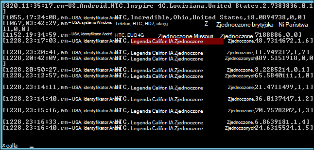

<properties
    pageTitle="Za pomocą akcji skrypt można zainstalować Spark w klastrze Hadoop | Microsoft Azure"
    description="Dowiedz się, jak dostosować klastrze HDInsight z Spark przy użyciu akcji skryptów."
    services="hdinsight"
    documentationCenter=""
    authors="nitinme"
    manager="jhubbard"
    editor="cgronlun"/>

<tags
    ms.service="hdinsight"
    ms.workload="big-data"
    ms.tgt_pltfrm="na"
    ms.devlang="na"
    ms.topic="article"
    ms.date="02/05/2016"
    ms.author="nitinme"/>

# Instalowanie i używanie Spark na klastrów HDInsight Hadoop przy użyciu akcji skryptu

> [AZURE.IMPORTANT] Ten artykuł jest teraz przestarzałe. HDInsight zawiera teraz Spark jako typ najlepszych klaster dla klastrów opartych na systemie Windows, co oznacza teraz można bezpośrednio utworzyć klaster Spark bez modyfikowania klaster Hadoop za pomocą skryptu akcji. Przy użyciu typu klaster Spark, możesz uzyskać klastrze wersji 3,2 HDInsight z Spark wersji 1.3.1.  Aby zainstalować wersje Spark, należy użyć akcji skryptu. Usługa HDInsight zawiera przykładowy skrypt skrypt akcji.

Dowiedz się, jak zainstalować Spark w systemie Windows podstawie HDInsight przy użyciu akcji skryptu i uruchamianie kwerendy Spark na HDInsight klastrów.

**Artykuły pokrewne**

- [Tworzenie Hadoop klastrów w HDInsight](hdinsight-provision-clusters.md): ogólne informacje na temat tworzenia HDInsight klastrów.

- [Rozpoczynanie pracy z Spark Apache na HDInsight](hdinsight-apache-spark-jupyter-spark-sql.md): tworzenie klaster HDInsight Spark.

- [Dostosowywanie przy użyciu akcji skryptu klaster HDInsight][hdinsight-cluster-customize]: ogólne informacje na temat dostosowywania klastrów HDInsight przy użyciu akcji skryptów.

- [Można opracowywać Akcja skrypt skrypty do HDInsight](hdinsight-hadoop-script-actions.md).

## Co to jest Spark?

<a href="http://spark.apache.org/docs/latest/index.html" target="_blank">Apache Spark</a> jest równolegle Otwórz źródło przetwarzania framework obsługującego przetwarzania w pamięci, aby zwiększyć wydajność aplikacji analityczny duży danych. Możliwości obliczeń w pamięci w iskrowym ułatwiają dobrym rozwiązaniem iteracyjne algorytmów w obliczeniach maszynowego uczenia się i wykres.

Można także Spark przeprowadzić konwencjonalny przetwarzanie danych opartych na dysku. Spark zwiększa tradycyjnych framework MapReduce przez uniknięcie zapisuje na dysku na pośrednich etapach. Ponadto Spark jest zgodny z magazynu System plików Distributed Hadoop (HDFS) i obiektów Blob platformy Azure, łatwo przetwarzania istniejących danych za pośrednictwem Spark.

Ten temat zawiera instrukcje dotyczące dostosowywania klaster HDInsight, aby zainstalować Spark.

## Instalowanie Spark przy użyciu Azure Portal

Przykładowy skrypt, aby zainstalować Spark w klastrze HDInsight jest dostępna z obiektów blob tylko do odczytu Azure miejsca do magazynowania w [https://hdiconfigactions.blob.core.windows.net/sparkconfigactionv03/spark-installer-v03.ps1](https://hdiconfigactions.blob.core.windows.net/sparkconfigactionv03/spark-installer-v03.ps1). Ten skrypt można zainstalować Spark 1.2.0 lub Spark 1.0.2 w zależności od wersji klaster HDInsight utworzone.

- Jeśli podczas tworzenia klaster **3,2 HDInsight** za pomocą skryptu instaluje **Spark 1.2.0**.
- Jeśli podczas tworzenia klaster **HDInsight 3.1** za pomocą skryptu instaluje **Spark 1.0.2**.

Można zmodyfikować ten skrypt lub utworzenie własnego skryptu, aby zainstalować inne wersje Spark.

> [AZURE.NOTE] Przykładowy skrypt działa tylko w przypadku HDInsight 3.1 i 3,2 klastrów. Aby uzyskać więcej informacji w wersjach klaster HDInsight zobacz [HDInsight klaster wersji](hdinsight-component-versioning.md).

1. Mieli możliwość tworzenia klaster przy użyciu opcji **Utwórz niestandardowe** , zgodnie z opisem w [klastrów tworzenie Hadoop w HDInsight](hdinsight-provision-clusters.md#portal). Wybierz wersję klaster w zależności od następujących czynności:

    - Jeśli chcesz zainstalować **Spark 1.2.0**, Utwórz klaster HDInsight 3,2.
    - Jeśli chcesz zainstalować **Spark 1.0.2**, Utwórz klaster HDInsight 3.1.

2. Na stronie **Skrypt akcji** kreatora kliknij przycisk **Dodaj akcję skryptu** o podanie szczegółowych informacji o akcji skryptu, tak jak pokazano poniżej:

    ![Używanie akcji skrypt dostosowywania klastrze] (./media/hdinsight-hadoop-spark-install/HDI.CustomProvision.Page6.png "Używanie akcji skrypt dostosowywania klastrze")

    <table border='1'>
        <tr><th>Właściwość</th><th>Wartość</th></tr>
        <tr><td>Nazwa</td>
            <td>Określ nazwę akcji skryptów. Na przykład <b>Spark instalacji</b>.</td></tr>
        <tr><td>Skrypt identyfikator URI</td>
            <td>Określ identyfikator URI (Uniform Resource) do skrypt, który jest wywoływana, aby dostosować klaster. Na przykład <i>https://hdiconfigactions.blob.core.windows.net/sparkconfigactionv03/spark-installer-v03.ps1</i></td></tr>
        <tr><td>Typ węzła</td>
            <td>Określ węzły, na których jest uruchamiany skrypt dostosowywania. Możesz wybrać <b>wszystkie węzły</b>, <b>tylko węzłów głowy</b>lub <b>tylko węzłów pracownika</b>.
        <tr><td>Parametry</td>
            <td>Określ parametry, jeśli jest to wymagane przez skrypt. Skrypt, aby zainstalować Spark nie wymaga parametry, więc możesz można pozostawić to pole puste.</td></tr>
    </table>

    Możesz dodać więcej niż jedną akcję skrypt do zainstalowania wielu składników w klastrze. Po dodaniu skryptów kliknij znacznik wyboru, aby rozpocząć tworzenie klaster.

Za pomocą skryptu zainstalować Spark na HDInsight przy użyciu programu PowerShell Azure lub HDInsight .NET SDK. Instrukcje dotyczące tej procedury znajdują się w dalszej części tego tematu.

## Używanie Spark w HDInsight
Interfejs API programu Scala, Python i Java znajdują się w iskrowym. Za pomocą interakcyjnego powłoki Spark uruchamianie kwerend w iskrowym. Ta sekcja zawiera instrukcje na temat pracy z Spark za pomocą różnych metod:

- [Uruchamianie kwerend interakcyjnych za pomocą powłoki Spark](#sparkshell)
- [Uruchamianie zapytania Spark SQL przy użyciu powłoki Spark](#sparksql)
- [Korzystanie z programu Scala autonomicznego](#standalone)

###Uruchamianie kwerend interakcyjnych za pomocą powłoki Spark
Wykonaj następujące czynności uruchomienia kwerendy Spark z interakcyjnych powłoki Spark. W tej sekcji, możemy uruchomić kwerendę Spark na przykładowy plik danych (-example/data/gutenberg/davinci.txt) jest dostępny na klastrów HDInsight domyślnie.

1. Z portalu Azure Włączanie pulpitu zdalnego dla klastrów, utworzone za pomocą Spark zainstalowana, a następnie zdalnego w grupie. Aby uzyskać instrukcje zobacz [Łączenie się przy użyciu RDP klastrów HDInsight](hdinsight-administer-use-management-portal.md#rdp).

2. W sesji protokołu RDP (Remote Desktop) na komputerze otwórz wiersza polecenia Hadoop (ze skrótu pulpitu), a następnie przejdź do lokalizacji, w którym zainstalowano Spark; na przykład **C:\apps\dist\spark-1.2.0**.

3. Uruchom następujące polecenie, aby uruchomić powłoki Spark:

         .\bin\spark-shell --master yarn

    Po zakończeniu polecenie Scala powinna pobierać monitu:

         scala>

5. W monicie Scala wprowadź zapytanie Spark, jak pokazano poniżej. To zapytanie zlicza wystąpienie każdego wyrazu w pliku davinci.txt, który jest dostępny w/przykład/danych/gutenberg/lokalizacji w magazynie obiektów Blob platformy Azure skojarzone z klastrem.

        val file = sc.textFile("/example/data/gutenberg/davinci.txt")
        val counts = file.flatMap(line => line.split(" ")).map(word => (word, 1)).reduceByKey(_ + _)
        counts.toArray().foreach(println)

6. Wynik powinien wyglądać w następujący sposób:

    

7. Wprowadź: q, aby zamknąć monit Scala.

        :q

###Uruchamianie zapytania Spark SQL przy użyciu powłoki Spark

Spark SQL pozwala na uruchamianie kwerend relacyjnych wyrażony jest w języku SQL (Structured Query), HiveQL lub Scala przy użyciu Spark. W tej sekcji przyjrzymy się przy użyciu Spark, aby uruchomić kwerendę gałęzi na przykładową tabelę programu Hive. Tabelę programu Hive używane w tej sekcji (nazywane **hivesampletable**) jest domyślnie dostępne podczas tworzenia klastrze.

>[AZURE.NOTE] Poniższe przykładowe został utworzony przed **wzmóc 1.2.0**, która jest instalowana po uruchomieniu akcji skryptu podczas tworzenia klaster HDInsight 3,2.

1. Z portalu Azure Włączanie pulpitu zdalnego dla klastrów, utworzone za pomocą Spark zainstalowana, a następnie zdalnego w grupie. Aby uzyskać instrukcje zobacz [Łączenie się przy użyciu RDP klastrów HDInsight](hdinsight-administer-use-management-portal.md#rdp).

2. W sesja RDP na komputerze otwórz wiersza polecenia Hadoop (ze skrótu pulpitu), a następnie przejdź do lokalizacji, w którym zainstalowano Spark; na przykład **C:\apps\dist\spark-1.2.0**.

3. Uruchom następujące polecenie, aby uruchomić powłoki Spark:

         .\bin\spark-shell --master yarn

    Po zakończeniu polecenie Scala powinna pobierać monitu:

         scala>

4. W monicie Scala Ustaw kontekst gałęzi. Jest to wymagane do pracy z kwerendami gałęzi przy użyciu Spark.

        val hiveContext = new org.apache.spark.sql.hive.HiveContext(sc)

    Należy zauważyć, że ten **sc** jest kontekst Spark domyślne, ustawiany podczas uruchamiania powłoki Spark.

5. Uruchamianie kwerendy gałęzi przy użyciu kontekstu gałęzi i wydruk do konsoli. Kwerenda pobiera dane na urządzeniach konkretnej marki i ogranicza liczbę rekordów pobieranych do 20.

        hiveContext.sql("""SELECT * FROM hivesampletable WHERE devicemake LIKE "HTC%" LIMIT 20""").collect().foreach(println)

6. Powinny zostać wyświetlone wyniki podobne do następujących:

    

7. Wprowadź: q, aby zamknąć monit Scala.

        :q

### Korzystanie z programu Scala autonomicznego

W tej sekcji, możemy napisz aplikację Scala, która zlicza wiersze zawierające ciąg "a" i "b" w przykładowy plik danych (-example/data/gutenberg/davinci.txt) jest dostępny na klastrów HDInsight domyślnie. Pisanie i używania autonomicznego programu Scala z klastrze dostosowany za pomocą Spark instalacji, należy wykonać następujące czynności:

- Napisz Scala program
- Tworzenie programu Scala pobierania pliku .jar
- Uruchamianie zadania w klastrze

#### Napisz Scala program
W tej sekcji można napisać program Scala zlicza wiersze zawierające "a" i "b" w przykładowym pliku danych.

1. Otwórz Edytor tekstu i wklej następujący kod:

        /* SimpleApp.scala */
        import org.apache.spark.SparkContext
        import org.apache.spark.SparkContext._
        import org.apache.spark.SparkConf

        object SimpleApp {
          def main(args: Array[String]) {
            val logFile = "/example/data/gutenberg/davinci.txt"         //Location of the sample data file on Azure Blob storage
            val conf = new SparkConf().setAppName("SimpleApplication")
            val sc = new SparkContext(conf)
            val logData = sc.textFile(logFile, 2).cache()
            val numAs = logData.filter(line => line.contains("a")).count()
            val numBs = logData.filter(line => line.contains("b")).count()
            println("Lines with a: %s, Lines with b: %s".format(numAs, numBs))
          }
        }

2. Zapisz plik pod nazwą **SimpleApp.scala**.

#### Tworzenie programu Scala
W tej sekcji za pomocą <a href="http://www.scala-sbt.org/0.13/docs/index.html" target="_blank">Narzędzia Tworzenie prostych</a> (lub sbt) można tworzyć programu Scala. SBT wymaga Java 1,6 lub nowszy, dlatego należy się upewnić, że masz prawo wersji języka Java zainstalowane przed kontynuowaniem w tej sekcji.

1. Zainstaluj sbt z http://www.scala-sbt.org/0.13/tutorial/Installing-sbt-on-Windows.html.
2. Utwórz folder o nazwie **SimpleScalaApp**, a w tym folderze utwórz plik o nazwie **simple.sbt**. To pliku konfiguracji, który zawiera informacje o wersji Scala zależności biblioteki, itp. Wklej następujący ciąg do pliku simple.sbt i zapisz go:

        name := "SimpleApp"

        version := "1.0"

        scalaVersion := "2.10.4"

        libraryDependencies += "org.apache.spark" %% "spark-core" % "1.2.0"

    >[AZURE.NOTE] Upewnij się, że zachowanie puste wiersze w pliku.

3. W folderze **SimpleScalaApp** tworzenie struktury katalogów **\src\main\scala** i wklejanie program Scala (**SimpleApp.scala**) został utworzony wcześniej w folderze \src\main\scala.
4. Otwórz wiersz polecenia, przejdź do katalogu SimpleScalaApp i wpisz następujące polecenie:

        sbt package

    Po skompilowaniu aplikacji zostanie wyświetlona **simpleapp_2.10 1.0.jar** pliku utworzonego w katalogu **\target\scala-2.10** w folderze głównym SimpleScalaApp.

#### Uruchamianie zadania w klastrze
W tej sekcji możesz zdalnego w klastrze, który zawiera Spark zainstalowana, a następnie skopiuj folder docelowy projektu SimpleScalaApp. Następnie użyj polecenia **Przesyłanie spark** Aby przesłać zadanie w klastrze.

1. Zdalne w klastrze, który został zainstalowany Spark. Na komputerze, której zapisano i wbudowany SimpleApp.scala program Skopiuj **SimpleScalaApp\target** folder i wklej je do lokalizacji w klastrze.
2. W sesji RDP z pulpitu Otwórz wiersz polecenia Hadoop i przejdź do lokalizacji, w której jest wklejany folder **docelowy** .
3. Wpisz następujące polecenie, aby uruchomić SimpleApp.scala program:

        C:\apps\dist\spark-1.2.0\bin\spark-submit --class "SimpleApp" --master local target/scala-2.10/simpleapp_2.10-1.0.jar

4. Po zakończeniu programu wynik jest wyświetlany na konsoli.

        Lines with a: 21374, Lines with b: 11430

## Instalowanie Spark przy użyciu programu PowerShell Azure

W tej sekcji możemy użyć polecenia cmdlet **<a href = "http://msdn.microsoft.com/library/dn858088.aspx" target="_blank">AzureHDInsightScriptAction Dodaj</a>** do wywołania skryptów przy użyciu akcji skrypt dostosowywania klastrze. Przed kontynuowaniem upewnij się, możesz zainstalowaniu i skonfigurowaniu programu PowerShell Azure. Aby uzyskać informacje na temat konfigurowania roboczej współdziałać z poleceń cmdlet środowiska PowerShell Azure HDInsight, zobacz [Instalowanie i konfigurowanie programu PowerShell Azure](../powershell-install-configure.md).

Wykonaj następujące czynności:

1. Otwórz okno Azure programu PowerShell i zadeklarować następujące zmienne:

        # Provide values for these variables
        $subscriptionName = "<SubscriptionName>"        # Name of the Azure subscription
        $clusterName = "<HDInsightClusterName>"         # HDInsight cluster name
        $storageAccountName = "<StorageAccountName>"    # Azure Storage account that hosts the default container
        $storageAccountKey = "<StorageAccountKey>"      # Key for the Storage account
        $containerName = $clusterName
        $location = "<MicrosoftDataCenter>"             # Location of the HDInsight cluster. It must be in the same data center as the Storage account.
        $clusterNodes = <ClusterSizeInNumbers>          # Number of nodes in the HDInsight cluster
        $version = "<HDInsightClusterVersion>"          # For example, "3.2"

2. Określ wartości konfiguracji, takie jak węzły w klastrze i przechowywania domyślnego ma być używany.

        # Specify the configuration options
        Select-AzureSubscription $subscriptionName
        $config = New-AzureHDInsightClusterConfig -ClusterSizeInNodes $clusterNodes
        $config.DefaultStorageAccount.StorageAccountName="$storageAccountName.blob.core.windows.net"
        $config.DefaultStorageAccount.StorageAccountKey=$storageAccountKey
        $config.DefaultStorageAccount.StorageContainerName=$containerName

3. Aby dodać akcję skrypt konfiguracji klaster, należy użyć polecenia cmdlet **AzureHDInsightScriptAction Dodaj** . Później podczas tworzenia klaster otrzymuje wykonać akcję skryptu.

        # Add a script action to the cluster configuration
        $config = Add-AzureHDInsightScriptAction -Config $config -Name "Install Spark" -ClusterRoleCollection HeadNode -Uri https://hdiconfigactions.blob.core.windows.net/sparkconfigactionv03/spark-installer-v03.ps1

    Polecenie cmdlet **AzureHDInsightScriptAction Dodaj** wymaga następujących parametrów:

    <table style="border-color: #c6c6c6; border-width: 2px; border-style: solid; border-collapse: collapse;">
    <tr>
    <th style="border-color: #c6c6c6; border-width: 2px; border-style: solid; border-collapse: collapse; width:90px; padding-left:5px; padding-right:5px;">Parametr</th>
    <th style="border-color: #c6c6c6; border-width: 2px; border-style: solid; border-collapse: collapse; width:550px; padding-left:5px; padding-right:5px;">Definicja</th></tr>
    <tr>
    <td style="border-color: #c6c6c6; border-width: 2px; border-style: solid; border-collapse: collapse; padding-left:5px;">Konfiguracji</td>
    <td style="border-color: #c6c6c6; border-width: 2px; border-style: solid; border-collapse: collapse; padding-left:5px; padding-right:5px;">Obiekt konfiguracji, do którego skryptu akcji informacje są dodawane.</td></tr>
    <tr>
    <td style="border-color: #c6c6c6; border-width: 2px; border-style: solid; border-collapse: collapse; padding-left:5px;">Nazwa</td>
    <td style="border-color: #c6c6c6; border-width: 2px; border-style: solid; border-collapse: collapse; padding-left:5px;">Nazwa akcji skryptów.</td></tr>
    <tr>
    <td style="border-color: #c6c6c6; border-width: 2px; border-style: solid; border-collapse: collapse; padding-left:5px;">ClusterRoleCollection</td>
    <td style="border-color: #c6c6c6; border-width: 2px; border-style: solid; border-collapse: collapse; padding-left:5px;">Określa węzły, na których jest uruchamiany skrypt dostosowywania. Prawidłowe wartości są HeadNode (Aby zainstalować na węzła głównego) lub DataNode (Aby zainstalować na wszystkich węzłach danych). Można użyć wartości jeden lub oba.</td></tr>
    <tr>
    <td style="border-color: #c6c6c6; border-width: 2px; border-style: solid; border-collapse: collapse; padding-left:5px;">Identyfikator URI</td>
    <td style="border-color: #c6c6c6; border-width: 2px; border-style: solid; border-collapse: collapse; padding-left:5px;">Określa identyfikator URI skrypt, który jest wykonywane.</td></tr>
    <tr>
    <td style="border-color: #c6c6c6; border-width: 2px; border-style: solid; border-collapse: collapse; padding-left:5px;">Parametry</td>
    <td style="border-color: #c6c6c6; border-width: 2px; border-style: solid; border-collapse: collapse; padding-left:5px;">Parametry wymagane przez skrypt. Przykładowy skrypt używane w tym temacie nie wymaga parametry, a więc nie widzisz ten parametr w wstawkę kodu powyżej.
    </td></tr>
    </table>

4. Na koniec mieli możliwość tworzenia niestandardowych klaster z Spark zainstalowany.  

        # Start creating a cluster with Spark installed
        New-AzureHDInsightCluster -Config $config -Name $clusterName -Location $location -Version $version

Po wyświetleniu monitu wprowadź poświadczenia, aby klaster. Może potrwać kilka minut, zanim klaster jest tworzony.

## Instalowanie Spark przy użyciu programu PowerShell

Zobacz [Dostosowywanie HDInsight klastrów przy użyciu akcji skryptów](hdinsight-hadoop-customize-cluster.md#call_scripts_using_powershell).

## Instalowanie Spark przy użyciu zestawu SDK .NET

Zobacz [Dostosowywanie HDInsight klastrów przy użyciu akcji skryptów](hdinsight-hadoop-customize-cluster.md#call_scripts_using_azure_powershell).

## Zobacz też

- [Tworzenie Hadoop klastrów w HDInsight](hdinsight-provision-clusters.md): Tworzenie klastrów HDInsight.
- [Rozpoczynanie pracy z Spark Apache na HDInsight](hdinsight-apache-spark-jupyter-spark-sql.md): rozpoczynanie pracy z Spark na HDInsight.
- [Dostosowywanie przy użyciu akcji skryptu klaster HDInsight][hdinsight-cluster-customize]: dostosowywanie klastrów HDInsight przy użyciu akcji skryptów.
- [Można opracowywać Akcja skrypt skrypty do HDInsight](hdinsight-hadoop-script-actions.md): projektowania skryptów skrypt akcji.
- [Instalowanie R na klastrów HDInsight] [ hdinsight-install-r] instrukcje na temat dostosowywania klaster umożliwia instalowanie i używanie R na klastrów HDInsight Hadoop. R jest język źródłowy Otwórz i środowisko przetwarzania danych statystycznych. Udostępnia setki wbudowanych funkcji statystycznych i własny język programowania łączy aspekty funkcjonalne i obiektowych programowania. Umożliwia także rozbudowane funkcje graficzne.
- [Instalowanie Giraph na HDInsight klastrów](hdinsight-hadoop-giraph-install.md). Dostosowywanie klaster należy zainstalować Giraph na HDInsight Hadoop klastrów. Giraph umożliwia wykonywanie wykresu przetwarzania przy użyciu Hadoop i mogą być używane z usługi HDInsight Azure.
- [Instalowanie Solr na HDInsight klastrów](hdinsight-hadoop-solr-install.md). Dostosowywanie klaster należy zainstalować Solr na HDInsight Hadoop klastrów. Solr umożliwia wykonywanie operacji możliwości wyszukiwania danych przechowywanych.

[hdinsight-provision]: hdinsight-provision-clusters.md
[hdinsight-install-r]: hdinsight-hadoop-r-scripts.md
[hdinsight-cluster-customize]: hdinsight-hadoop-customize-cluster.md
[powershell-install-configure]: powershell-install-configure.md
