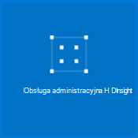

<properties
   pageTitle="Hadoop samouczek: wprowadzenie do Hadoop w systemie Windows | Microsoft Azure"
   description="Rozpoczynanie pracy z Hadoop w HDInsight. Dowiedz się, jak utworzyć klastrów Hadoop w systemie Windows, uruchomić kwerendę gałęzi na danych i analizowanie danych wyjściowych w programie Excel."
   keywords="Samouczek hadoop, hadoop w systemie windows, klaster hadoop informacje hadoop, gałęzi kwerendy"
   services="hdinsight"
   documentationCenter=""
   authors="nitinme"
   manager="jhubbard"
   editor="cgronlun"
   tags="azure-portal"/>

<tags
   ms.service="hdinsight"
   ms.devlang="na"
   ms.topic="article"
   ms.tgt_pltfrm="na"
   ms.workload="big-data"
   ms.date="03/07/2016"
   ms.author="nitinme"/>

# Hadoop samouczek: wprowadzenie do korzystania z Hadoop w HDInsight w systemie Windows

> [AZURE.SELECTOR]
- [Systemem Linux](../hdinsight-hadoop-linux-tutorial-get-started.md)
- [Systemu Windows](../hdinsight-hadoop-tutorial-get-started-windows.md)

Aby ułatwić sobie informacje Hadoop w systemie Windows i rozpocząć korzystanie z usługi HDInsight, ten samouczek pokazano, jak uruchomić kwerendę gałęzi niestrukturalne danych w klastrze Hadoop, a następnie analizować wyniki są wyświetlane w programie Microsoft Excel.

>[AZURE.NOTE] Informacje w tym dokumencie są specyficzne dla klastrów HDInsight systemu Windows. Aby uzyskać informacje na podstawie Linux klastrów, zobacz [Hadoop samouczek: rozpoczęcie pracy z systemem Linux Hadoop w HDInsight](hdinsight-hadoop-linux-tutorial-get-started.md).

Przyjęto założenie, masz duże niestrukturalne zestaw danych i chcesz uruchomić kwerendę gałęzi, aby wyodrębnić pewne istotne informacje. To dokładnie mają w tym samouczku. Poniżej opisano, jak można to osiągnąć:

   !["Hadoop samouczek: Tworzenie konta; utworzyć klaster Hadoop; przesłaniu kwerendy gałęzi; analizowanie danych w programie Excel.][image-hdi-getstarted-flow]

Obejrzyj pokaz wideo tego samouczka, aby dowiedzieć się, Hadoop na HDInsight:

![Klip wideo: pierwszego samouczek Hadoop: przesłaniu kwerendy gałęzi w klastrze Hadoop i analizowanie wyników w programie Excel.][img-hdi-getstarted-video]

**[Czekanie samouczek Hadoop HDInsight w witrynie YouTube](https://www.youtube.com/watch?v=Y4aNjnoeaHA&list=PLDrz-Fkcb9WWdY-Yp6D4fTC1ll_3lU-QS)**

W połączeniu z ogólnodostępną Azure HDInsight firma Microsoft udostępnia HDInsight Emulator platformy Azure, wcześniej znana pod nazwą *Microsoft HDInsight Developer Preview*. Emulatorze jest przeznaczony dla deweloperów scenariuszy i obsługuje tylko pojedynczy węzeł wdrożenia. Aby uzyskać informacje o korzystaniu z usługi HDInsight emulatora, zobacz [Wprowadzenie]do emulatorze HDInsight[hdinsight-emulator].

[AZURE.INCLUDE [delete-cluster-warning](../../includes/hdinsight-delete-cluster-warning.md)]

## Wymagania wstępne

Przed rozpoczęciem tego samouczka dla Hadoop w systemie Windows, musisz mieć następujące czynności:

- **Azure subskrypcji**. Zobacz [Azure pobrać bezpłatną wersję próbną](https://azure.microsoft.com/documentation/videos/get-azure-free-trial-for-testing-hadoop-in-hdinsight/).
- **A stacja robocza** z pakietu Office 2013 Professional Plus, Office 365 Pro Plus, Wersja autonomiczna programu Excel 2013 i Office 2010 Professional Plus.

### Wymagania dotyczące kontroli dostępu

[AZURE.INCLUDE [access-control](../../includes/hdinsight-access-control-requirements.md)]

##Tworzenie klastrów Hadoop

Po utworzeniu klastrze, możesz utworzyć zasoby Azure obliczeń, które zawierają Hadoop i powiązanych aplikacji. W tej sekcji możesz utworzyć klaster wersję 3,2 HDInsight. Można także tworzyć klastrów Hadoop dla innych wersji. Aby uzyskać instrukcje, zobacz [klastrów HDInsight utworzyć za pomocą opcji niestandardowych][hdinsight-provision]. Uzyskać informacje o wersji usługi HDInsight i ich poziomu zobacz [Przechowywanie wersji składnika HDInsight](hdinsight-component-versioning.md).

**Aby utworzyć klaster Hadoop**

1. Zaloguj się do [portalu Azure](https://portal.azure.com/).
2. Kliknij przycisk **Nowy**, kliknij pozycję **Analizy danych**, a następnie kliknij **HDInsight**. Portalu zostanie wyświetlona karta **Nowy klaster HDInsight** .

    ![Utwórz nowy klaster w Azure Portal] (./media/hdinsight-hadoop-tutorial-get-started-windows/HDI.CreateCluster.1.png "Utwórz nowy klaster w Azure Portal")

3. Wprowadź lub wybierz następujące czynności:

    ![Wprowadź nazwę klaster i typ] (./media/hdinsight-hadoop-tutorial-get-started-windows/HDI.CreateCluster.2.png "Wprowadź nazwę klaster i typ")
    
  	|Nazwa pola| Wartość|
  	|----------|------|
  	|Nazwa klaster| Identyfikowanie klaster unikatową nazwę|
  	|Typ klaster| Wybierz pozycję **Hadoop** dla tego samouczka. |
  	|System operacyjny klaster| Wybierz pozycję **Windows Server 2012 R2 w centrum danych** dla tego samouczka.|
  	|Wersja HDInsight| Wybierz najnowszą wersję dla tego samouczka.|
  	|Subskrypcji| Wybierz subskrypcję Azure używany w klastrze.|
  	|Grupa zasobów | Wybierz istniejącą grupą zasobów Azure lub Utwórz nową grupę zasobów. Podstawowe klaster HDInsight zawiera klaster i jego domyślne konto miejsca do magazynowania.  Można grupować dwóch do grupy zasobów dla łatwe zarządzanie.|
  	|Poświadczenia| Wprowadź klaster logowania użytkownika i hasło. Klaster z systemem Windows mogą być 2 konta użytkownika.  Klaster użytkownika (lub użytkownika HTTP) służy do zarządzania klastrem oraz wysyłanie zadań.  Opcjonalnie można utworzyć pulpitu zdalnego (RDP) konta użytkownika w celu zdalnego połączyć się z klastrem. Jeśli wybierzesz Włączanie pulpitu zdalnego, zostanie utworzone konto użytkownika RDP.|
  	|Źródła danych| Kliknij przycisk Utwórz nowy, aby utworzyć nowe domyślne konto Azure miejsca do magazynowania. Użyj nazwy klaster jako domyślnej nazwy kontenera. Co klaster HDinsight zawiera domyślny kontener obiektów Blob accont Azure miejsca do magazynowania.  Położenie domyślne konto Azure magazynowania Określa lokalizację klaster HDInsight.|
  	|Węzeł ceny warstwy| 1 lub 2 węzły pracownika za pomocą domyślna pracownik węzeł i głowy Notatka cennik warstwa dla tego samouczka.|
  	|Opcjonalna konfiguracja| Pomiń tej części.|

9. Na karta **Nowy klaster HDInsight** Sprawdź **Przypnij do Startboard** jest zaznaczone, a następnie kliknij przycisk **Utwórz**. To utworzy klaster i dodaj go kafelka do Startboard portalu sieci Azure. Ikona wskaże klastrem tworzy i zmieni się po zakończeniu tworzenia są oznaczone ikoną HDInsight.

  	| Podczas tworzenia | Zakończono tworzenie |
  	| ------------------ | --------------------- |
  	|  |  |

    > [AZURE.NOTE] Zajmie trochę czasu, aby klaster można utworzyć, zwykle około 15 minut. Użyj fragmentu na Startboard lub pozycję **powiadomienia** w lewej części strony, aby sprawdzić procesu tworzenia.

10. Po zakończeniu tworzenia kliknij Kafelek klastrem z Startboard, aby uruchomić karta klaster.

## Uruchamianie kwerendy gałęzi z portalu
Teraz, gdy utworzono klaster HDInsight, następnym krokiem jest uruchomienie zadania gałąź przykładowej tabeli gałęzi kwerendy. Użyjemy *hivesampletable*, który zawiera klastrów HDInsight. Tabela zawiera dane o producentów urządzenia przenośnego, platformy i modeli. Kwerendy gałęzi w tej tabeli pobiera dane dla urządzeń przenośnych przez konkretnego producenta.

> [AZURE.NOTE] Usługa HDInsight Tools for Visual Studio zawiera Azure SDK dla środowiska .NET wersji 2.5 lub nowszy. Za pomocą narzędzi w programie Visual Studio, można nawiązać HDInsight klaster, tworzenie tabel gałęzi i uruchamianie kwerend gałęzi. Aby uzyskać więcej informacji, zobacz [wprowadzenie]do korzystania z usługi HDInsight Hadoop narzędzi programu Visual Studio[1].

**Aby uruchomić zadanie gałęzi na pulpicie nawigacyjnym klaster**

1. Zaloguj się do [portalu Azure](https://portal.azure.com/).
2. Kliknij pozycję **PRZEGLĄDAJ wszystkie** , a następnie kliknij pozycję **Klastrów HDInsight** , aby wyświetlić listę klastrów klaster właśnie utworzonego w poprzedniej sekcji.
3. Kliknij nazwę klaster, którego chcesz używać do wykonywania zadania gałęzi, a następnie kliknij **pulpitu nawigacyjnego** w górnej części karta.
4. Strony sieci Web zostanie wyświetlona na karcie innej przeglądarki. Wprowadź Hadoop konto użytkownika i hasło. Domyślna nazwa użytkownika to **administracyjnego**; hasło jest wprowadzona podczas tworzenia klaster.
5. Na pulpicie nawigacyjnym kliknij kartę **Edytor gałęzi** . Zostanie wyświetlona następującą stronę sieci web.

    ![Karta Edytor gałęzi na pulpicie nawigacyjnym klaster HDInsight.][img-hdi-dashboard]

    Istnieje kilka kart u góry strony. Karty domyślnej jest **Gałęzi Edytor**, a inne karty są **Historii zadań** i **Przeglądarka plików**. Za pomocą pulpitu nawigacyjnego, można przesyłać kwerendy gałęzi, sprawdź dzienniki zadania Hadoop i przeglądanie plików w magazynie.

    > [AZURE.NOTE] Należy zauważyć, że adres URL strony sieci Web jest * &lt;NazwaKlastra&gt;. azurehdinsight.net*. Dlatego zamiast otwieranie pulpitu nawigacyjnego za pomocą portalu, możesz otworzyć pulpitu nawigacyjnego z przeglądarki sieci web przy użyciu adresu URL.

6. Na karcie **Gałęzi Edytor** w polu **Nazwa kwerendy**wprowadź **HTC20**.  Nazwa kwerendy jest tytuł zadania. W okienku zapytania wpisz kwerendę gałęzi, jak pokazano na ilustracji:

    ![Gałąź zapytanie wprowadzone w okienku zapytania w edytorze gałęzi.][img-hdi-dashboard-query-select]

4. Kliknij przycisk **Prześlij**. Wystarczy kilka minut, aby wrócić wyniki. Ekran są odświeżane co 30 sekund. Możesz również kliknąć pozycję **Odśwież** , aby odświeżyć ekran.

    ![U dołu na pulpicie nawigacyjnym klaster na liście wyników z kwerendy gałęzi.][img-hdi-dashboard-query-select-result]

5. Po stan jest wyświetlany stan ukończenia zadania, kliknij nazwę zapytania na ekranie, aby wyświetlić wynik. Zanotuj **Zadania Rozpoczęcie Time (UTC)**. Konieczne będzie ją później.

    ![Zadania czas rozpoczęcia na liście na karcie historii zadań na pulpicie nawigacyjnym klaster HDInsight.][img-hdi-dashboard-query-select-result-output]

    Strony będzie również zawierać **Dane wyjściowe zadania** i **Dziennik zadań**. Masz również odpowiednią opcję, aby pobrać plik docelowy (\_stdout) i plik dziennika \(_stderr).

**Aby przejść do plik docelowy**

1. Na pulpicie nawigacyjnym klaster kliknij pozycję **Przeglądarka plików**.
2. Kliknij nazwę konta magazynu, kliknij nazwę kontenera (który jest taka sama, jak nazwa klaster), a następnie kliknij **użytkownika**.
3. Kliknij pozycję **Administrator** , a następnie kliknij identyfikator GUID, który zawiera godzinę ostatniej modyfikacji (nieco po godziny, których wspomniano wcześniej rozpoczęcia zadania). Skopiuj ten identyfikator GUID. Będą potrzebne w następnej sekcji.

    ![Kwerenda gałęzi wyjściowy plik, który GUID wymienione na karcie przeglądarka plików.][img-hdi-dashboard-query-browse-output]

##Nawiązywanie połączenia z narzędzi do analizy biznesowej firmy Microsoft dla programu Excel

Aby zaimportować dane wyjściowe zadania z usługi HDInsight w programie Excel, w którym narzędzi do analizy biznesowej firmy Microsoft może służyć do dalszej analizy wyników służy dodatek Power Query dla programu Microsoft Excel.

Musi być programu Excel 2013 lub 2010 zainstalowanego do wykonania tej części samouczka.

**Aby pobrać dodatek Microsoft Power Query dla programu Excel**

- Pobierz dodatek Microsoft Power Query dla programu Microsoft Excel z [Centrum pobierania firmy Microsoft](http://www.microsoft.com/download/details.aspx?id=39379) i zainstaluj go.

**Aby zaimportować dane HDInsight**

1. Otwórz program Excel i Utwórz nowy skoroszyt.
3. Kliknij menu **Dodatku Power Query** , kliknij przycisk **Z innych źródeł**, a następnie kliknij **Z usługi HDInsight Azure**.

    ![Usługa Azure HDInsight otwarte menu programu Excel PowerQuery importowanie.][image-hdi-gettingstarted-powerquery-importdata]

3. Wprowadź **Nazwę konta** konta magazyn obiektów Blob platformy Azure, który jest skojarzony z klaster, a następnie kliknij **przycisk OK**. (Jest to konto miejsca do magazynowania, dla którego został utworzony we wcześniejszej części samouczka).
4. Wprowadź **Klucz konta** dla konta magazyn obiektów Blob platformy Azure, a następnie kliknij przycisk **Zapisz**.
5. W okienku po prawej stronie kliknij dwukrotnie nazwę obiektów blob. Domyślne nazwy obiektów blob jest taka sama jak nazwa klaster.

6. Znajdź **stdout** w kolumnie **Nazwa** . Sprawdź, czy identyfikator GUID w odpowiedniej kolumnie **Ścieżka folderu** odpowiada GUID skopiowany wcześniej. Dopasowanie wskazuje, czy dane wyjściowe odpowiada zadania Ciebie. Kliknij opcję **binarne** w lewej kolumnie **stdout**.

    ![Znajdowanie danych wyjściowych przez identyfikator GUID na liście zawartości.][image-hdi-gettingstarted-powerquery-importdata2]

9. Kliknij przycisk **Zamknij i załaduj** , w lewym górnym rogu, aby zaimportować zadania gałęzi wyjścia do programu Excel.

##Uruchamianie próbki

Klaster HDInsight zawiera konsoli kwerendę, która zawiera wprowadzenie do galerii, aby uruchomić próbki bezpośrednio w portalu. Aby dowiedzieć się, jak pracować z usługi HDInsight przez Instruktaż niektóre podstawowe scenariusze, można użyć próbki. Te przykłady są dostarczane z wszystkich wymaganych składników, takich jak analizę danych i kwerendy do uruchomienia na karcie dane. Aby dowiedzieć się więcej na temat próbki w galerii wprowadzenie, zobacz [Informacje Hadoop w HDInsight przy użyciu galerii HDInsight wprowadzenie wprowadzenie](hdinsight-learn-hadoop-use-sample-gallery.md).

**Aby uruchomić przykład**

1. Startboard Azure Portal kliknij kafelku klaster, w którym został utworzony.
 
2. Na nowej karta klaster kliknij pozycję **pulpit nawigacyjny**. Po wyświetleniu monitu wprowadź nazwę użytkownika administratora i hasło klaster.

    ![Uruchamianie klaster pulpitu nawigacyjnego] (./media/hdinsight-hadoop-tutorial-get-started-windows/HDI.Cluster.Dashboard.png "Uruchamianie klaster pulpitu nawigacyjnego")
 
3. Na stronie sieci Web, która zostanie otwarta kliknij kartę **Getting Started Galeria** , a następnie w kategorii **rozwiązań z przykładowymi danymi** kliknij przykładowy, który chcesz uruchomić. Postępuj zgodnie z instrukcjami na stronie sieci Web, aby zakończyć próbki. W poniższej tabeli wymieniono kilka przykładów i znajdziesz więcej informacji na temat czy jakie każdej próbki.

Przykładowe | Czego?
------ | ---------------
[Czujnik analiza danych][hdinsight-sensor-data-sample] | Dowiedz się, jak używać usługi HDInsight przetwarzania danych historycznych, którego jest tworzone przez ogrzewania, wentylacji i systemy klimatyzacji (GRZEWCZO) do identyfikowania systemów, które nie są w stanie prawidłowo utrzymanie temperatury zestawu.
[Analiza dziennika witryny sieci Web][hdinsight-weblogs-sample] | Dowiedz się, jak analizowanie plików dziennika witryny sieci Web uzyskiwania wgląd częstotliwość wizyty w witrynie sieci Web w dniu z zewnętrznych witryn sieci Web i podsumowanie błędów witryny sieci Web, które wystąpić użytkowników przy użyciu usługi HDInsight.
[Analizy trendu Twitter](hdinsight-analyze-twitter-data.md) | Dowiedz się, jak za pomocą HDInsight analizowanie trendów w serwisie Twitter.

##Usuwanie klaster

[AZURE.INCLUDE [delete-cluster-warning](../../includes/hdinsight-delete-cluster-warning.md)]

##Następne kroki
W tym samouczku Hadoop wiesz, jak utworzyć klaster Hadoop w systemie Windows w HDInsight uruchomić kwerendę gałęzi na danych i importowanie wyników w programie Excel, w którym mogą być jeszcze przetwarzane i graficzne wyświetlone z narzędzi do analizy biznesowej. Aby uzyskać więcej informacji, zobacz następujące samouczki:

- [Wprowadzenie do korzystania z usługi HDInsight Hadoop narzędzia programu Visual Studio][1]
- [Rozpoczynanie pracy z emulatora HDInsight][hdinsight-emulator]
- [Magazyn obiektów Blob platformy Azure za pomocą usługi HDInsight][hdinsight-storage]
- [Administrowanie HDInsight przy użyciu programu PowerShell][hdinsight-admin-powershell]
- [Przekazywanie danych do HDInsight][hdinsight-upload-data]
- [Używanie MapReduce z usługi HDInsight][hdinsight-use-mapreduce]
- [Gałąź za pomocą usługi HDInsight][hdinsight-use-hive]
- [Świnka korzystanie z usługi HDInsight][hdinsight-use-pig]
- [Używanie Oozie z usługi HDInsight][hdinsight-use-oozie]
- [Można opracowywać programy Java MapReduce dla HDInsight][hdinsight-develop-mapreduce]

[1]: ../HDInsight/hdinsight-hadoop-visual-studio-tools-get-started.md

[hdinsight-versions]: hdinsight-component-versioning.md

[hdinsight-provision]: hdinsight-provision-clusters.md
[hdinsight-admin-powershell]: hdinsight-administer-use-powershell.md
[hdinsight-upload-data]: hdinsight-upload-data.md
[hdinsight-use-mapreduce]: hdinsight-use-mapreduce.md
[hdinsight-use-hive]: hdinsight-use-hive.md
[hdinsight-use-pig]: hdinsight-use-pig.md
[hdinsight-use-oozie]: hdinsight-use-oozie.md
[hdinsight-storage]: hdinsight-hadoop-use-blob-storage.md
[hdinsight-emulator]: hdinsight-hadoop-emulator-get-started.md
[hdinsight-develop-mapreduce]: hdinsight-develop-deploy-java-mapreduce-linux.md
[hadoop-hdinsight-intro]: hdinsight-hadoop-introduction.md
[hdinsight-weblogs-sample]: hdinsight-hive-analyze-website-log.md
[hdinsight-sensor-data-sample]: hdinsight-hive-analyze-sensor-data.md

[azure-purchase-options]: http://azure.microsoft.com/pricing/purchase-options/
[azure-member-offers]: http://azure.microsoft.com/pricing/member-offers/
[azure-free-trial]: http://azure.microsoft.com/pricing/free-trial/
[azure-management-portal]: https://portal.azure.com/
[azure-create-storageaccount]: ../storage-create-storage-account.md

[apache-hadoop]: http://go.microsoft.com/fwlink/?LinkId=510084
[apache-hive]: http://go.microsoft.com/fwlink/?LinkId=510085
[apache-mapreduce]: http://go.microsoft.com/fwlink/?LinkId=510086
[apache-hdfs]: http://go.microsoft.com/fwlink/?LinkId=510087
[hdinsight-hbase-custom-provision]: hdinsight-hbase-tutorial-get-started.md

[powershell-download]: http://go.microsoft.com/fwlink/p/?linkid=320376&clcid=0x409
[powershell-install-configure]: powershell-install-configure.md
[powershell-open]: powershell-install-configure.md#step-1-install

[img-hdi-dashboard]: ./media/hdinsight-hadoop-tutorial-get-started-windows/HDI.dashboard.png
[img-hdi-dashboard-query-select]: ./media/hdinsight-hadoop-tutorial-get-started-windows/HDI.dashboard.query.select.png
[img-hdi-dashboard-query-select-result]: ./media/hdinsight-hadoop-tutorial-get-started-windows/HDI.dashboard.query.select.result.png
[img-hdi-dashboard-query-select-result-output]: ./media/hdinsight-hadoop-tutorial-get-started-windows/HDI.dashboard.query.select.result.output.png
[img-hdi-dashboard-query-browse-output]: ./media/hdinsight-hadoop-tutorial-get-started-windows/HDI.dashboard.query.browse.output.png

[img-hdi-getstarted-video]: ./media/hdinsight-hadoop-tutorial-get-started-windows/hdi-get-started-video.png

[image-hdi-storageaccount-quickcreate]: ./media/hdinsight-hadoop-tutorial-get-started-windows/HDI.StorageAccount.QuickCreate.png
[image-hdi-clusterstatus]: ./media/hdinsight-hadoop-tutorial-get-started-windows/HDI.ClusterStatus.png
[image-hdi-quickcreatecluster]: ./media/hdinsight-hadoop-tutorial-get-started-windows/HDI.QuickCreateCluster.png
[image-hdi-getstarted-flow]: ./media/hdinsight-hadoop-tutorial-get-started-windows/HDI.GetStartedFlow.png

[image-hdi-gettingstarted-powerquery-importdata]: ./media/hdinsight-hadoop-tutorial-get-started-windows/HDI.GettingStarted.PowerQuery.ImportData.png
[image-hdi-gettingstarted-powerquery-importdata2]: ./media/hdinsight-hadoop-tutorial-get-started-windows/HDI.GettingStarted.PowerQuery.ImportData2.png
 
