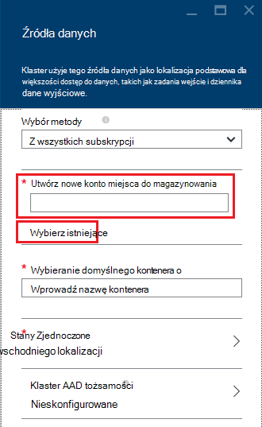

<properties
    pageTitle="Kwerendy danych z magazynem obiektów Blob zgodnego z programem HDFS | Microsoft Azure"
    description="Magazyn obiektów Blob platformy Azure zastosowania HDInsight do przechowywania danych duży dla HDFS. Dowiedz się, jak kwerendy danych z magazynem obiektów Blob, a następnie przechowywać wyniki analizy."
    keywords="blob miejsca do magazynowania, hdfs, dane strukturalne, niestrukturalne dane"
    services="hdinsight,storage"
    documentationCenter=""
    tags="azure-portal"
    authors="mumian"
    manager="jhubbard"
    editor="cgronlun"/>

<tags
    ms.service="hdinsight"
    ms.workload="big-data"
    ms.tgt_pltfrm="na"
    ms.devlang="na"
    ms.topic="get-started-article"
    ms.date="09/06/2016"
    ms.author="jgao"/>

# Magazyn obiektów Blob platformy Azure zgodnego z programem HDFS za pomocą Hadoop w HDInsight

Dowiedz się, jak magazyn obiektów Blob platformy Azure kosztach za pomocą usługi HDInsight, Utwórz konto Azure miejsca do magazynowania i kontenera magazynu obiektów Blob i zająć się dane wewnątrz.

Magazyn obiektów Blob platformy Azure jest rozwiązaniem niezawodne, ogólnego przeznaczenia przestrzeni dyskowej, która bezproblemowo integruje się z usługi HDInsight. Korzystając z interfejsu systemu (HDFS) rozłożone pliku Hadoop pełny zestaw składników usługi HDInsight mogą działać bezpośrednio na dane strukturalne i niestrukturalne w magazynie obiektów Blob.

Dane są przechowywane w magazynie obiektów Blob umożliwia bezpiecznie usunąć klastrów HDInsight, które są używane do obliczeń bez utraty danych użytkownika.

> [AZURE.IMPORTANT] Usługa HDInsight obsługuje tylko blob blok. Nie obsługuje strony lub dołączanie obiektów blob.

Aby informacji o tworzeniu klaster HDInsight, zobacz [Wprowadzenie do usługi HDInsight] [ hdinsight-get-started] lub [klastrów tworzenie HDInsight][hdinsight-creation].

## Architektura pamięci HDInsight
Poniższy diagram zawiera abstrakcyjne widoku architektury HDInsight miejsca do magazynowania:

![Klastrów Hadoop za pomocą interfejsu API HDFS dostępu i przechowywać dane strukturalne i niestrukturalne w magazynie obiektów Blob.] (./media/hdinsight-hadoop-use-blob-storage/HDI.WASB.Arch.png "Architektura pamięci HDInsight")

Usługa HDInsight zapewnia dostęp do Rozproszony system plików lokalnie podłączonego do węzły obliczeń. Ten system plików jest możliwy przy użyciu identyfikatora URI w pełni kwalifikowana, na przykład:

    hdfs://<namenodehost>/<path>

Ponadto HDInsight umożliwia danych programu access, który jest przechowywany w magazynie obiektów Blob platformy Azure. Składnia jest następująca:

    wasb[s]://<containername>@<accountname>.blob.core.windows.net/<path>

> [AZURE.NOTE] W wersji HDInsight wcześniejszej niż 3.0 `asv://` został użyty zamiast `wasb://`. `asv://`nie należy z klastrów HDInsight 3.0 lub nowszy, jak spowoduje błąd.

Hadoop obsługuje pojęcia domyślnego systemu plików. Domyślnego systemu plików oznacza domyślny schemat i urząd. Również można je rozwiązać ścieżki względne. Podczas procesu tworzenia HDInsight, konto Azure miejsca do magazynowania i określonych magazyn obiektów Blob platformy Azure wyznacza się kontenera z tego konta jako domyślnego systemu plików.

Oprócz tego konta miejsca do magazynowania możesz dodać konta dodatkowego miejsca do magazynowania z tym samym Azure subskrypcji lub innej subskrypcji Azure w trakcie procesu tworzenia lub po utworzeniu klastrze. Aby uzyskać instrukcje, informacje o dodawaniu kont dodatkowego miejsca do magazynowania, zobacz [Tworzenie HDInsight klastrów][hdinsight-creation].

- **Kontenerów w oknie konta miejsca do magazynowania, które są połączone z klastrem:** Ponieważ nazwę konta i klucza są skojarzone z klastrem podczas tworzenia, masz pełny dostęp do obiektów blob w tych kontenerach.

- **Kontenerów publicznych lub publicznej BLOB w konta miejsca do magazynowania, które nie są połączone z klastrem:** Masz uprawnienia tylko do odczytu do obiektów blob w kontenerach.

    > [AZURE.NOTE]
        > Kontenerów publicznej pozwalają uzyskać listę wszystkich obiektów blob, które są dostępne w danym kontenerze i pobierać metadane kontener. Blob publicznej umożliwiają dostęp do obiektów blob tylko wtedy, gdy znasz dokładnego adresu URL. Aby uzyskać więcej informacji zobacz <a href="http://msdn.microsoft.com/library/windowsazure/dd179354.aspx">ograniczenia dostępu do kontenerów i obiektów blob</a>.

- **Prywatne kontenerów na kontach miejsca do magazynowania, które nie są połączone z klastrem:** Nie masz dostępu do obiektów blob w kontenerach, chyba że podczas przesyłania zadań WebHCat do definiowania konta miejsca do magazynowania. Jest to opisano w dalszej części tego artykułu.

Konta miejsca do magazynowania, które są definiowane w procesie tworzenia i klucze są przechowywane w %HADOOP_HOME%/conf/core-site.xml w węzłach. Domyślne zachowanie HDInsight jest za pomocą konta miejsca do magazynowania zdefiniowane w pliku site.xml podstawowych. Nie jest zalecane edytować plik core site.xml, ponieważ node(master) głowy klaster może być reimaged lub migracji w dowolnym momencie i wszelkie zmiany do tych plików, zostaną utracone.

Wiele zadań WebHCat, w tym gałęzi, MapReduce Hadoop streaming i świnka, może przenosić opis konta miejsca do magazynowania i metadane z nimi. (To obecnie zastosowanie świnka z kontami miejsca do magazynowania, ale nie metadanych). W sekcji [blob programu Access przy użyciu programu PowerShell Azure](#powershell) w tym artykule jest próbki tej funkcji. Aby uzyskać więcej informacji zobacz [Korzystanie klastrze HDInsight z alternatywnego konta miejsca do magazynowania i Metastores](http://social.technet.microsoft.com/wiki/contents/articles/23256.using-an-hdinsight-cluster-with-alternate-storage-accounts-and-metastores.aspx).

Magazyn obiektów blob może być używany do dane strukturalne i niestrukturalne. Kontenery magazyn obiektów blob przechowywania danych jako pary klucz wartość, a nie jest bez hierarchii katalogów. Jednak znak ukośnika (/) można w nazwie klucza był tak, jakby plik jest przechowywany w strukturze katalogu. Na przykład klucz obiektów blob może być *input/log1.txt*. Katalog rzeczywisty *wprowadzania* nie istnieje, ale ze względu na obecność znak ukośnika w nazwie klucza ma wygląd ścieżki pliku.

###Korzyści wynikające z magazynem obiektów Blob
Koszt dorozumianych wydajności nie Współtworzenie lokalizowanie obliczyć klastrów i zasobów magazynowania, jest nieco ograniczane sposobem utworzyć klaster komputerowe zbliżony koncie zasobów miejsca do magazynowania w obszarze Azure, gdzie szybkich sieciach umożliwia dobry dla węzłów obliczeń uzyskać dostęp do danych w magazyn obiektów Blob platformy Azure.

Istnieje kilka korzyści związanych z dane są przechowywane w magazynie obiektów Blob platformy Azure zamiast HDFS:

* **Udostępniania i ponownego użycia danych:** Dane w HDFS znajduje się wewnątrz klastrów obliczeniowych. Tylko te aplikacje, które mają dostęp do klastrów obliczeniowych można użyć danych przy użyciu interfejsów API HDFS. Dane w magazynie obiektów Blob platformy Azure są dostępne za pośrednictwem interfejsów API HDFS lub za pośrednictwem [Interfejsów API pozostałych magazyn obiektów Blob][blob-storage-restAPI]. W związku z tym większy zestaw narzędzi i aplikacji (w tym innych klastrów HDInsight) służy do tworzenia i korzystającą z danych.
* **Archiwizowania danych:** Dane są przechowywane w magazynie obiektów Blob platformy Azure umożliwia klastrów HDInsight na potrzeby obliczeń bezpiecznie zostanie usunięta bez utraty danych użytkownika.
* **Koszt magazynowania danych:** Przechowywanie danych w DFS długoterminowe jest bardziej kosztów niż przechowywania danych w magazynie obiektów Blob platformy Azure, ponieważ koszt klastrów obliczeniowych jest wyższy niż koszt kontenera magazyn obiektów Blob platformy Azure. Ponadto ponieważ nie ma danych do załadowania do każdej generowania klaster komputerowe, są także zapisywanie ładowania koszty danych.
* **Elastyczne skala w nowym oknie:** Chociaż HDFS zapewnia w systemie plików skalowanej, skali zależy od liczby węzłów utworzone dla klaster. Zmienianie skali może stać się bardziej skomplikowana proces niż Polegaj na elastyczne skalowania możliwości, jakie można pobrać automatycznie magazyn obiektów Blob platformy Azure.
* **Replikacji Geo:** Kontenerów magazyn obiektów Blob platformy Azure mogą być replikowane geo. Mimo że uzyskasz odzyskiwania geograficzne i nadmiarowości danych, trybie awaryjnym do lokalizacji replikowane geo poważnie wpływa na wydajność i mogą być dodatkowo płatne. Firma Microsoft zaleca rozsądnie wybieraj replikacji geo i tylko wtedy, gdy wartość danych warto dodatkowe koszty.

Niektóre zadania MapReduce i pakietów może utworzyć pośrednie wyniki, których naprawdę nie mają być przechowywane w magazynie obiektów Blob platformy Azure. W takim przypadku można wybrać opcję przechowywania danych w lokalnym HDFS. W rzeczywistości HDInsight używa DFS dla kilku tych pośrednie wyników w gałęzi zadań i innych procesów.

> [AZURE.NOTE] Większość poleceń HDFS (na przykład <b>ls</b>, <b>copyFromLocal</b> i <b>mkdir</b>) nadal będą działać zgodnie z oczekiwaniami. Tylko polecenia, które są specyficzne dla natywnych HDFS wykonania (określany nazwą systemu plików), takich jak <b>fschk</b> i <b>dfsadmin</b>zostaną wyświetlone różne zachowanie w magazyn obiektów Blob platformy Azure.

## Tworzenie obiektów Blob kontenerów

Aby użyć obiektów blob, najpierw należy utworzyć [konta magazynu platformy Azure][azure-storage-create]. W ramach tego możesz określić Azure region, w którym będzie przechowywana obiekty utworzone przy użyciu tego konta. Klaster i konto miejsca do magazynowania musi być hostowana w tym samym regionie. Bazy danych programu SQL Server metastore gałęzi i bazy danych programu SQL Server metastore Oozie musi znajdować się też w tym samym regionie.

Miejsce, w którym go umieszczono poszczególnych obiektów blob tworzonych należy do kontenera na koncie magazyn Azure. Ten kontener może być istniejący blob, w którym został utworzony poza HDInsight lub może być kontenera utworzonego dla klastrów HDInsight.

Domyślny kontener obiektów Blob przechowuje klaster określonych informacji, takich jak dzienniki i historię zatrudnienia. Nie można udostępniać domyślnego kontenera obiektów Blob wielu klastrów HDInsight. To może spowodować uszkodzenie historii zadań, a klaster będzie działa źle. Zaleca się używanie inny kontener dla każdego klaster i umieścić udostępnionych danych na koncie usługi połączone magazynowania określonego w wdrażania wszystkich odpowiednich klastrów zamiast domyślnego konta miejsca do magazynowania. Aby uzyskać więcej informacji na temat konfigurowania kont połączonych miejsca do magazynowania, zobacz [Tworzenie HDInsight klastrów][hdinsight-creation]. Jednak po usunięciu oryginalny klaster HDInsight można ponownie użyć domyślnego kontenera miejsca do magazynowania. Dla klastrów HBase faktycznie można zachować schematu tabeli HBase i danych według Utwórz nowy klaster HBase przy użyciu domyślnego kontenera magazyn obiektów blob jest używana przez klaster HBase, który został usunięty.

### Za pomocą portalu Azure

Podczas tworzenia klastrze HDInsight z portalu, dostępne są opcje Użyj istniejącego konta miejsca do magazynowania lub Utwórz nowe konto miejsca do magazynowania:

###Za pomocą interfejsu wiersza polecenia Azure

[AZURE.INCLUDE [use-latest-version](../../includes/hdinsight-use-latest-cli.md)]

Jeśli masz [zainstalowany i skonfigurowany polecenie Azure](../xplat-cli-install.md)następujące polecenie umożliwia konto miejsca do magazynowania i kontener.

    azure storage account create <storageaccountname> --type LRS

> [AZURE.NOTE] `--type` Parametru wskazuje, jak można replikować konta miejsca do magazynowania. Aby uzyskać więcej informacji zobacz [Azure replikacji miejsca do magazynowania](../storage/storage-redundancy.md). Nie używaj ZRS, jak ZRS nie obsługuje obiektów blob strony, pliku, tabeli lub kolejki.

Wyświetli monit o określenie regionu geograficznego, które będą znajdować się na koncie miejsca do magazynowania w. W tym samym regionie, które mają tworzenia klaster HDInsight, należy utworzyć konto miejsca do magazynowania.

Po utworzeniu konta miejsca do magazynowania, użyj następującego polecenia do odbierania kluczy konta miejsca do magazynowania:

    azure storage account keys list <storageaccountname>

Aby utworzyć kontener, użyj następującego polecenia:

    azure storage container create <containername> --account-name <storageaccountname> --account-key <storageaccountkey>

### Przy użyciu programu PowerShell Azure

Jeśli możesz [zainstalowaniu i skonfigurowaniu programu PowerShell Azure][powershell-install], następujące czynności w wierszu Azure programu PowerShell umożliwia tworzenie konta miejsca do magazynowania i kontenera:

[AZURE.INCLUDE [upgrade-powershell](../../includes/hdinsight-use-latest-powershell.md)]

    $SubscriptionID = "<Your Azure Subscription ID>"
    $ResourceGroupName = "<New Azure Resource Group Name>"
    $Location = "EAST US 2"
    
    $StorageAccountName = "<New Azure Storage Account Name>"
    $containerName = "<New Azure Blob Container Name>"
    
    Add-AzureRmAccount
    Select-AzureRmSubscription -SubscriptionId $SubscriptionID
    
    # Create resource group
    New-AzureRmResourceGroup -name $ResourceGroupName -Location $Location
    
    # Create default storage account
    New-AzureRmStorageAccount -ResourceGroupName $ResourceGroupName -Name $StorageAccountName -Location $Location -Type Standard_LRS 
    
    # Create default blob containers
    $storageAccountKey = (Get-AzureRmStorageAccountKey -ResourceGroupName $resourceGroupName -StorageAccountName $StorageAccountName)[0].Value
    $destContext = New-AzureStorageContext -StorageAccountName $storageAccountName -StorageAccountKey $storageAccountKey  
    New-AzureStorageContainer -Name $containerName -Context $destContext

## Pliki adres w magazynie obiektów Blob

Schemat URI uzyskiwania dostępu do plików w magazynie obiektów Blob z usługi HDInsight jest:

    wasb[s]://<BlobStorageContainerName>@<StorageAccountName>.blob.core.windows.net/<path>

Schemat identyfikatora URI zapewnia dostęp niezaszyfrowanym (z *wasb:* prefiks) i szyfrowania SSL programu access (z *wasbs*). Firma Microsoft zaleca używanie *wasbs* , ile to możliwe, nawet wtedy, gdy dostęp do danych, która znajduje się w tym samym regionie platformy Azure.

&lt;BlobStorageContainerName&gt; identyfikuje nazwę kontenera w magazynie obiektów Blob platformy Azure.
&lt;StorageAccountName&gt; identyfikuje nazwę konta magazynu platformy Azure. Wymagane jest w pełni kwalifikowaną nazwę domeny (FQDN).

Jeśli nie &lt;BlobStorageContainerName&gt; ani &lt;StorageAccountName&gt; określono, służy domyślnego systemu plików. W przypadku plików w systemie plików domyślnych można użyć ścieżkę względną lub ścieżką bezwzględną. Na przykład plik *hadoop-mapreduce-examples.jar* , który zawiera klastrów HDInsight mogą się odwoływać, stosując jedną z następujących czynności:

    wasbs://mycontainer@myaccount.blob.core.windows.net/example/jars/hadoop-mapreduce-examples.jar
    wasbs:///example/jars/hadoop-mapreduce-examples.jar
    /example/jars/hadoop-mapreduce-examples.jar

> [AZURE.NOTE] Nazwa pliku jest <i>hadoop examples.jar</i> w HDInsight wersji 2.1 i 1.6 klastrów.

&lt;Ścieżki&gt; jest nazwą ścieżkę pliku lub katalogu HDFS. Ponieważ kontenery w magazynie obiektów Blob platformy Azure to po prostu wartość klucza sklepy, występuje nie PRAWDA hierarchicznym systemem plików. Znak ukośnika (/) wewnątrz klucz obiektów blob jest interpretowany jako separator katalogu. Na przykład nazwy obiektów blob *hadoop-mapreduce-examples.jar* to:

    example/jars/hadoop-mapreduce-examples.jar

> [AZURE.NOTE] Podczas pracy z obiektami blob poza HDInsight, większości narzędzi nie rozpoznaje formatu WASB i zamiast tego oczekiwać formacie podstawowe ścieżkę, takich jak `example/jars/hadoop-mapreduce-examples.jar`.

## Blob dostęp za pomocą interfejsu wiersza polecenia Azure

Użyj następującego polecenia, aby wyświetlić listę poleceń związanych z obiektów blob:

    azure storage blob

**Przykład użycia Azure polecenie, aby przekazać plik**

    azure storage blob upload <sourcefilename> <containername> <blobname> --account-name <storageaccountname> --account-key <storageaccountkey>

**Przykład użycia polecenie Azure do pobrania pliku**

    azure storage blob download <containername> <blobname> <destinationfilename> --account-name <storageaccountname> --account-key <storageaccountkey>

**Przykład użycia Azure polecenie, aby usunąć plik**

    azure storage blob delete <containername> <blobname> --account-name <storageaccountname> --account-key <storageaccountkey>

**Przykład użycia polecenie Azure do listy plików**

    azure storage blob list <containername> <blobname|prefix> --account-name <storageaccountname> --account-key <storageaccountkey>

## Blob programu Access przy użyciu programu PowerShell Azure

> [AZURE.NOTE] Polecenia w tej sekcji przedstawiono podstawowy przykład przy użyciu programu PowerShell dostęp do danych zapisanych w obiektów blob. Na przykład bogatsze została dostosowana do pracy z usługi HDInsight zobacz [Narzędzia HDInsight](https://github.com/Blackmist/hdinsight-tools).

Użyj następującego polecenia, aby wyświetlić listę poleceń cmdlet związane z obiektów blob:

    Get-Command *blob*

![Lista powiązanych obiektów blob poleceń cmdlet programu PowerShell.][img-hdi-powershell-blobcommands]

###Przekazywanie plików

Zobacz [przekazywanie danych do HDInsight][hdinsight-upload-data].

###Pobieranie plików

Następujące złom pobiera blob bloku do bieżącego folderu. Przed uruchomieniem skryptu, zmień katalog do folderu, w którym masz uprawnienia do zapisu.

    $resourceGroupName = "<AzureResourceGroupName>"
    $storageAccountName = "<AzureStorageAccountName>"   # The storage account used for the default file system specified at creation.
    $containerName = "<BlobStorageContainerName>"  # The default file system container has the same name as the cluster.
    $blob = "example/data/sample.log" # The name of the blob to be downloaded.
    
    # Use Add-AzureAccount if you haven't connected to your Azure subscription
    Login-AzureRmAccount 
    Select-AzureRmSubscription -SubscriptionID "<Your Azure Subscription ID>"
    
    Write-Host "Create a context object ... " -ForegroundColor Green
    $storageAccountKey = (Get-AzureRmStorageAccountKey -ResourceGroupName $resourceGroupName -Name $storageAccountName)[0].Value
    $storageContext = New-AzureStorageContext -StorageAccountName $storageAccountName -StorageAccountKey $storageAccountKey  
    
    Write-Host "Download the blob ..." -ForegroundColor Green
    Get-AzureStorageBlobContent -Container $ContainerName -Blob $blob -Context $storageContext -Force
    
    Write-Host "List the downloaded file ..." -ForegroundColor Green
    cat "./$blob"

Podanie nazwy grupy zasobów i jego nazwy, można użyć następującego kodu:

    $resourceGroupName = "<AzureResourceGroupName>"
    $clusterName = "<HDInsightClusterName>"
    $blob = "example/data/sample.log" # The name of the blob to be downloaded.
    
    $cluster = Get-AzureRmHDInsightCluster -ResourceGroupName $resourceGroupName -ClusterName $clusterName
    $defaultStorageAccount = $cluster.DefaultStorageAccount -replace '.blob.core.windows.net'
    $defaultStorageAccountKey = (Get-AzureRmStorageAccountKey -ResourceGroupName $resourceGroupName -Name $defaultStorageAccount)[0].Value
    $defaultStorageContainer = $cluster.DefaultStorageContainer
    $storageContext = New-AzureStorageContext -StorageAccountName $defaultStorageAccount -StorageAccountKey $defaultStorageAccountKey 
    
    Write-Host "Download the blob ..." -ForegroundColor Green
    Get-AzureStorageBlobContent -Container $defaultStorageContainer -Blob $blob -Context $storageContext -Force

###Usuwanie plików

    Remove-AzureStorageBlob -Container $containerName -Context $storageContext -blob $blob

###Lista plików

    Get-AzureStorageBlob -Container $containerName -Context $storageContext -prefix "example/data/"

###Uruchamianie kwerend gałęzi przy użyciu konta usługi nieokreślone miejsca do magazynowania

W tym przykładzie pokazano sposób listy folderów z konta miejsca do magazynowania, która nie jest zdefiniowana w procesie tworzenia.
$clusterName = "<HDInsightClusterName>"

    $undefinedStorageAccount = "<UnboundedStorageAccountUnderTheSameSubscription>"
    $undefinedContainer = "<UnboundedBlobContainerAssociatedWithTheStorageAccount>"

    $undefinedStorageKey = Get-AzureStorageKey $undefinedStorageAccount | %{ $_.Primary }

    Use-AzureRmHDInsightCluster $clusterName

    $defines = @{}
    $defines.Add("fs.azure.account.key.$undefinedStorageAccount.blob.core.windows.net", $undefinedStorageKey)

    Invoke-AzureRmHDInsightHiveJob -Defines $defines -Query "dfs -ls wasbs://$undefinedContainer@$undefinedStorageAccount.blob.core.windows.net/;"

## Następne kroki

W tym artykule przedstawiono sposób magazyn obiektów Blob platformy Azure zgodnego z programem HDFS za pomocą usługi HDInsight i wiesz, czy magazyn obiektów Blob platformy Azure jest składnik podstawowych HDInsight. Umożliwia tworzenie rozwiązań nabycia skalowalna, długoterminowe, archiwizowania danych z magazynem obiektów Blob platformy Azure i odblokowywanie zawartych w niej informacji przechowywane dane strukturalne i niestrukturalne za pomocą usługi HDInsight.

Aby uzyskać więcej informacji zobacz:

* [Rozpoczynanie pracy z usługa Azure HDInsight][hdinsight-get-started]
* [Przekazywanie danych do HDInsight][hdinsight-upload-data]
* [Gałąź za pomocą usługi HDInsight][hdinsight-use-hive]
* [Świnka korzystanie z usługi HDInsight][hdinsight-use-pig]
* [Używanie podpisów udostępnione dostępu w programie Azure miejsca do magazynowania ograniczenia dostępu do danych z usługi HDInsight][hdinsight-use-sas]

[hdinsight-use-sas]: hdinsight-storage-sharedaccesssignature-permissions.md
[powershell-install]: ../powershell-install-configure.md
[hdinsight-creation]: hdinsight-provision-clusters.md
[hdinsight-get-started]: hdinsight-hadoop-tutorial-get-started-windows.md
[hdinsight-upload-data]: hdinsight-upload-data.md
[hdinsight-use-hive]: hdinsight-use-hive.md
[hdinsight-use-pig]: hdinsight-use-pig.md

[blob-storage-restAPI]: http://msdn.microsoft.com/library/windowsazure/dd135733.aspx
[azure-storage-create]: ../storage/storage-create-storage-account.md

[img-hdi-powershell-blobcommands]: ./media/hdinsight-hadoop-use-blob-storage/HDI.PowerShell.BlobCommands.png
[img-hdi-quick-create]: ./media/hdinsight-hadoop-use-blob-storage/HDI.QuickCreateCluster.png
[img-hdi-custom-create-storage-account]: ./media/hdinsight-hadoop-use-blob-storage/HDI.CustomCreateStorageAccount.png  
