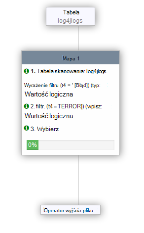
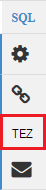

<properties
   pageTitle="Praca z gałęzi na HDInsight (Hadoop) za pomocą widoków Ambari | Microsoft Azure"
   description="Dowiedz się, jak przesyła gałęzi zapytań za pomocą widoku gałęzi z przeglądarki sieci web. Widok gałęzi jest częścią Interfejsu sieci Web Ambari dostarczoną z systemem Linux HDInsight klaster."
   services="hdinsight"
   documentationCenter=""
   authors="Blackmist"
   manager="jhubbard"
   editor="cgronlun"
    tags="azure-portal"/>

<tags
   ms.service="hdinsight"
   ms.devlang="na"
   ms.topic="article"
   ms.tgt_pltfrm="na"
   ms.workload="big-data"
   ms.date="10/28/2016"
   ms.author="larryfr"/>

#Korzystanie z widoku gałęzi z Hadoop w HDInsight

[AZURE.INCLUDE [hive-selector](../../includes/hdinsight-selector-use-hive.md)]

Ambari jest zarządzania i monitorowania narzędzia dostarczanego z systemem Linux HDInsight klastrów. Jedna z funkcji zapewnianych przez Ambari jest interfejs sieci Web, który może być używany do uruchomienia kwerendy gałęzi. To jest __Widok gałęzi__, część dostępnych widoków Ambari z klaster HDInsight.

> [AZURE.NOTE] Ambari ma wiele funkcji, które nie będą omawiane w tym dokumencie. Aby uzyskać więcej informacji zobacz [Zarządzanie HDInsight klastrów przy użyciu Interfejsu sieci Web Ambari](hdinsight-hadoop-manage-ambari.md).

##Wymagania wstępne

- Klaster HDInsight systemem Linux. Aby uzyskać informacje na temat tworzenia nowych klaster zobacz [Rozpoczynanie pracy z systemem Linux HDInsight](hdinsight-hadoop-linux-tutorial-get-started.md).

##Otwórz widok gałęzi

Czy widoki Ambari z Portal Azure. Wybierz klaster HDInsight, a następnie wybierz __Widoki Ambari__ w sekcji __Szybkie łącza__ .

Możesz również przejść bezpośrednio do Ambari, przechodząc do https://CLUSTERNAME.azurehdinsight.net w przeglądarce sieci web (gdzie __NAZWAKLASTRA__ jest nazwą klaster HDInsight), a następnie wybierz zestaw kwadratów w menu strony (obok pozycji link __Administrator__ i przycisk po lewej stronie) do listy dostępne widoki. Wybierz pozycję __gałęzi widoku__.

.

> [AZURE.NOTE] Podczas uzyskiwania dostępu do Ambari, zostanie wyświetlony monit o uwierzytelnienia do witryny. Wprowadź administrator (domyślny `admin`,) konta i hasło używane podczas tworzenia klaster.

Powinien zostać wyświetlony strony podobny do następującego:

##Tabele widoków

W sekcji __Eksplorator bazy danych__ na stronie wybierz pozycję __domyślny__ na karcie __bazy danych__ . Spowoduje to wyświetlenie listy tabel w domyślnej bazy danych. Dla nowy klaster HDInsight musi istnieć tylko jedną tabelę; __hivesampletable__.

Po dodaniu nowych tabel kroków w tym dokumencie, aby odświeżyć listę dostępnych tabel za pomocą ikona odświeżania w prawym górnym rogu Eksplorator bazy danych.

##Edytor zapytań

Wykonaj następujące czynności z poziomu widoku gałęzi, aby uruchomić kwerendę gałęzi danych dostępnych w programie klaster.

1. W sekcji __Edytora zapytań__ strony wklej poniższe instrukcje HiveQL w arkuszu:

        DROP TABLE log4jLogs;
        CREATE EXTERNAL TABLE log4jLogs(t1 string, t2 string, t3 string, t4 string, t5 string, t6 string, t7 string)
        ROW FORMAT DELIMITED FIELDS TERMINATED BY ' '
        STORED AS TEXTFILE LOCATION 'wasbs:///example/data/';
        SELECT t4 AS sev, COUNT(*) AS cnt FROM log4jLogs WHERE t4 = '[ERROR]' GROUP BY t4;

    Poniższe instrukcje należy wykonać następujące czynności:

    - **DROP TABLE** — powoduje usunięcie tabeli i w pliku danych, w przypadku, gdy tabela już istnieje.
    - **Tworzenie tabeli zewnętrznej** — powoduje utworzenie nowej tabeli "zewnętrzne" w gałęzi. Tylko definicję tabeli są przechowywane w tabelach zewnętrznych w gałęzi; dane pozostaje w pierwotnej lokalizacji.
    - **FORMAT wiersza** — informuje gałęzi, jak dane są sformatowane. W tym przypadku pola w każdej dziennika są oddzielone spacją.
    - **PRZECHOWYWANE jako lokalizacji TEXTFILE** — informuje gałęzi miejsce, w którym dane są przechowywane (katalogu przykładzie danych) i że są przechowywane jako tekst.
    - **Wybierz pozycję** - zaznacza liczbę wierszy miejsce, w którym t4 kolumna zawiera wartość [Błąd].

    >[AZURE.NOTE] Jeśli oczekiwać danych źródłowych, które mają być aktualizowane przez źródło zewnętrzne, taką jak proces przekazywania danych lub przez inną operację MapReduce, należy użyć zewnętrzne tabele, ale chcesz zawsze gałęzi kwerendy do korzystania z najnowszych danych. Usuwanie tabeli zewnętrznej czy *nie* Usuń dane, tylko definicję tabeli.

2. Użyj przycisku __Wykonywanie__ u dołu edytora zapytań, aby uruchomić kwerendę. Należy włączać pomarańczowy, a tekst zmieni się __zatrzymać wykonywanie__. Sekcja __Wyniki procesu kwerendy__ należy są wyświetlane poniżej edytora zapytań i wyświetlać informacje o zadaniu.

    > [AZURE.IMPORTANT] Niektóre przeglądarki nie może poprawnie odświeżyć informacje dziennika lub wyników. Jeśli uruchomienie zadania i wydaje się zawsze uruchamiane bez aktualizowania dziennik lub zwraca wyników, spróbuj użyć programu Mozilla FireFox lub Google Chrome.

3. Po zakończeniu kwerendy, sekcji __Proces wyniki__ są wyświetlane wyniki operacji. Przycisk __Zatrzymaj wykonanie__ również zmieni się ponownie w zielony przycisk __Wykonaj__ . Karta __wyników__ powinien zawierać następujące informacje:

        sev       cnt
        [ERROR]   3

    Na karcie __Dzienniki__ można wyświetlić informacje o rejestrowaniu utworzonych przez zadanie. Za pomocą tego programu do rozwiązywania problemów w przypadku problemów za pomocą kwerendy.

    > [AZURE.TIP] Uwaga okno dialogowe listy rozwijanej __Zapisz wyniki__ w lewym górnym rogu sekcji __Wyniki procesu kwerendy__ . za pomocą tego programu do pobierania wyników lub zapisywanie ich do magazynu HDInsight jako pliku CSV.

3. Zaznacz wiersze pierwsze cztery kwerendy, a następnie wybierz __Wykonywanie__. Zwróć uwagę, że nie istnieją żadne wyniki po zakończeniu zadania. Jest to spowodowane za pomocą przycisku __Wykonywanie__ po zaznaczeniu części zapytania działa tylko wybrane instrukcje. W tym przypadku zaznaczenia nie włączono ostatecznego zestawienia, która pobiera wiersze z tabeli. Wybierz pozycję tylko ten wiersz, za pomocą __Wykonywanie__powinien zostać wyświetlony oczekiwanych wyników.

3. Użyj przycisku __Nowy arkusz__ w dolnej części __Edytora zapytań__ , aby utworzyć nowy arkusz. W nowym arkuszu wpisz następujące instrukcje HiveQL:

        CREATE TABLE IF NOT EXISTS errorLogs (t1 string, t2 string, t3 string, t4 string, t5 string, t6 string, t7 string) STORED AS ORC;
        INSERT OVERWRITE TABLE errorLogs SELECT t1, t2, t3, t4, t5, t6, t7 FROM log4jLogs WHERE t4 = '[ERROR]';

    Poniższe instrukcje należy wykonać następujące czynności:

    - **Tworzenie tabeli IF NOT EXISTS** - tworzy tabelę, jeśli jeszcze nie istnieje. Ponieważ **zewnętrznych** słów kluczowych nie jest używany, to wewnętrznych tabela, w której są przechowywane w magazynie danych gałęzi i całkowicie zarządza gałęzi. W odróżnieniu od tabele zewnętrzne upuszczanie wewnętrznej tabeli spowoduje usunięcie danych źródłowych.
    - **PRZECHOWYWANE jako ORC** - są przechowywane dane w formacie zoptymalizowane wiersza kolumnowy (ORC). To jest wysoce zoptymalizowane i wydajną format do przechowywania danych gałęzi.
    - Zastąp **Wstawianie... Wybierz** - wybiera wiersze z tabeli **log4jLogs** , które zawierają [Błąd], a następnie wstawia dane do tabeli **errorLogs** .

    Użyj przycisku __Execute__ do uruchomienia tej kwerendy. Karta __wyników__ nie będzie zawierać dowolne informacje o żadnych wierszy są zwracane przez tę kwerendę, ale stan należy wyświetlić w formacie __powiodło się__.

###Ustawienia gałęzi

Wybierz ikonę __Ustawienia__ po prawej stronie edytorze.

Ustawienia można zmienić różne ustawienia gałęzi, takie jak zmiana aparat wykonania gałęzi z Tez (ustawienie domyślne), aby MapReduce.

###Wyjaśnić wizualne

Wybierz ikonę __Wizualne wyjaśnić__ po prawej stronie edytorze.

Oto widok __Wizualne wyjaśnić__ kwerendy, które mogą być pomocne w opis przepływu złożonych kwerend. Tekstowy odpowiednik tego widoku można wyświetlić za pomocą przycisk __Wyjaśnij__ w edytorze zapytań.

###Tez

Wybierz ikonę __Tez__ po prawej stronie edytorze.

Spowoduje to wyświetlenie skierowane acykliczne wykresu (AG) używane przez Tez dla tej kwerendy, jeśli jest dostępny. Jeśli chcesz wyświetlić AG kwerend zostały uruchomiono w przeszłości lub debugowania proces Tez, użyj [Widoku Tez](hdinsight-debug-ambari-tez-view.md) zamiast tego.

###Powiadomienia

Wybierz ikonę __powiadomień__ po prawej stronie edytorze.

Powiadomienia są wiadomości, które są generowane podczas wykonywania kwerend. Na przykład otrzymasz powiadomienie po przesłaniu kwerendy lub w przypadku, gdy wystąpi błąd.

##Zapisane kwerendy

1. W edytorze zapytań Utwórz nowy arkusz i wprowadź poniższe zapytanie:

        SELECT * from errorLogs;

    Wykonywanie zapytania, aby sprawdzić, czy działa. Wyniki będą następujące:

        errorlogs.t1    errorlogs.t2    errorlogs.t3    errorlogs.t4    errorlogs.t5    errorlogs.t6    errorlogs.t7
        2012-02-03  18:35:34    SampleClass0    [ERROR]     incorrect   id  
        2012-02-03  18:55:54    SampleClass1    [ERROR]     incorrect   id  
        2012-02-03  19:25:27    SampleClass4    [ERROR]     incorrect   id

2. W dolnej części edytora za pomocą przycisku __Zapisz jako__ . Nazwij tę kwerendę __Errorlogs__ i wybierz __przycisk OK__. Zauważ, że nazwa arkusza zmieni się na __Errorlogs__.

3. Wybierz kartę __Zapisane kwerendy__ w górnej części strony gałęzi widoku. Należy zauważyć, że __Errorlogs__ będzie teraz wyświetlany jako zapisane zapytanie. Pozostaną na tej liście do momentu jej usunięcia. Wybierając nazwę otworzy kwerendę w edytorze zapytań.

##Historia kwerendy

Przycisk __Historia__ w górnej części widoku gałęzi umożliwi do widoku kwerend, które masz uruchomiono wcześniej. Za pomocą go teraz, a następnie wybierz, które niektórych kwerend, musisz wcześniej uruchomiono. Po wybraniu kwerendy zostanie otwarty go w edytorze zapytań.

##Funkcje (UDF) zdefiniowane przez użytkownika

Gałąź może zostać wydłużony również za pomocą **funkcji zdefiniowanych przez użytkownika (UDF)**. UDF umożliwia wdrożenie funkcji lub logiki, która nie jest łatwe modelowania w HiveQL.

Podczas dodawania UDF jako część instrukcji HiveQL w kwerendzie, na karcie UDF w górnej części widoku gałęzi umożliwia deklarować i Zapisywanie zestawu funkcji zdefiniowanych przez użytkownika, których można używać za pomocą __Edytora zapytań__.

Po dodaniu UDF do widoku gałęzi przycisku __Wstaw funkcji zdefiniowanych przez użytkownika__ pojawi się w dolnej części __Edytora zapytań__. Wybranie tej opcji spowoduje wyświetlenie listy rozwijanej pakietu zdefiniowanych w widoku gałęzi funkcji zdefiniowanych przez użytkownika. Wybieranie UDF spowoduje dodanie instrukcji HiveQL do zapytania, aby włączyć UDF.

Jeśli na przykład zdefiniowano UDF o następujących właściwościach:

* Nazwa zasobu: myudfs
* Ścieżka zasobu: wasbs:///myudfs.jar
* Nazwa UDF: myawesomeudf
* Nazwa klasy UDF: com.myudfs.Awesome

Za pomocą przycisku __Wstaw funkcji zdefiniowanych przez użytkownika__ będzie wyświetlana wpis o nazwie __myudfs__z innej listy rozwijanej dla każdego UDF zdefiniowane dla tego zasobu. W tym przypadku __myawesomeudf__. Wybranie tego wpisu Dodaj następujący na początku kwerendy:

    add jar wasbs:///myudfs.jar;

    create temporary function myawesomeudf as 'com.myudfs.Awesome';

Następnie można UDF w kwerendzie. Na przykład `SELECT myawesomeudf(name) FROM people;`.

Aby uzyskać więcej informacji na temat korzystania z funkcji zdefiniowanych przez użytkownika z gałęzi na HDInsight zobacz:

* [Za pomocą Python z gałęzi i świnka w HDInsight](hdinsight-python.md)

* [Jak dodać niestandardowe UDF gałęzi do HDInsight](http://blogs.msdn.com/b/bigdatasupport/archive/2014/01/14/how-to-add-custom-hive-udfs-to-hdinsight.aspx)

##Następne kroki

Ogólne informacje na temat gałąź w HDInsight:

* [Gałąź za pomocą Hadoop na HDInsight](hdinsight-use-hive.md)

Aby uzyskać informacje na inne sposoby pracy z Hadoop na HDInsight:

* [Używanie świnka z Hadoop na HDInsight](hdinsight-use-pig.md)

* [MapReduce za pomocą Hadoop na HDInsight](hdinsight-use-mapreduce.md)
