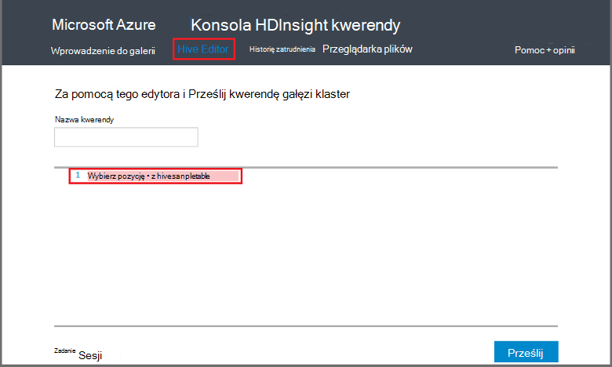

<properties
   pageTitle="Używanie gałąź Hadoop na konsoli zapytania w polu HDInsight | Microsoft Azure"
   description="Dowiedz się, jak za pomocą konsoli kwerendy sieci web uruchamianie kwerend gałęzi w klastrze HDInsight Hadoop za pomocą przeglądarki."
   services="hdinsight"
   documentationCenter=""
   authors="Blackmist"
   manager="jhubbard"
   editor="cgronlun"
    tags="azure-portal"/>

<tags
   ms.service="hdinsight"
   ms.devlang="na"
   ms.topic="article"
   ms.tgt_pltfrm="na"
   ms.workload="big-data"
   ms.date="09/20/2016"
   ms.author="larryfr"/>

# Uruchamianie kwerend gałęzi za pomocą konsoli kwerendy

[AZURE.INCLUDE [hive-selector](../../includes/hdinsight-selector-use-hive.md)]

W tym artykule dowiesz się, jak za pomocą konsoli kwerendy HDInsight uruchamianie kwerend gałęzi w klastrze HDInsight Hadoop za pomocą przeglądarki.

> [AZURE.IMPORTANT] Konsola kwerendy HDInsight jest dostępna tylko na klastrów HDInsight systemu Windows. Jeśli korzystasz z klastrem systemem Linux HDInsight, zobacz [Uruchamianie gałęzi kwerendy przy użyciu widoku gałęzi](hdinsight-hadoop-use-hive-ambari-view.md).

##Wymagania wstępne

Aby wykonać czynności opisane w tym artykule, będą potrzebne następujące elementy.

* Klaster HDInsight Hadoop systemu Windows

* Przeglądarki sieci web nowoczesny

##Uruchamianie kwerend gałęzi za pomocą konsoli kwerendy

1. Otwórz przeglądarkę sieci web i przejdź do __https://CLUSTERNAME.azurehdinsight.net__, gdzie __NAZWAKLASTRA__ to nazwa klaster HDInsight. Jeśli zostanie wyświetlony monit, wprowadź nazwę użytkownika i hasło używane podczas tworzenia klaster.

2. Łącza w górnej części strony zaznacz **Edytor gałęzi**. Zostanie wyświetlony formularz, który może być używany do wprowadzania instrukcji HiveQL, które chcesz uruchomić w klastrze HDInsight.

    

    Zamień tekst `Select * from hivesampletable` z poniższych stwierdzeń HiveQL:

        set hive.execution.engine=tez;
        DROP TABLE log4jLogs;
        CREATE EXTERNAL TABLE log4jLogs (t1 string, t2 string, t3 string, t4 string, t5 string, t6 string, t7 string)
        ROW FORMAT DELIMITED FIELDS TERMINATED BY ' '
        STORED AS TEXTFILE LOCATION 'wasbs:///example/data/';
        SELECT t4 AS sev, COUNT(*) AS count FROM log4jLogs WHERE t4 = '[ERROR]' AND INPUT__FILE__NAME LIKE '%.log' GROUP BY t4;

    Poniższe instrukcje należy wykonać następujące czynności:

    * **Usuwanie tabeli**: usuwa tabeli i w pliku danych, jeśli tabela już istnieje.
    * **Tworzenie tabeli zewnętrznej**: tworzy nową tabelę "zewnętrzne" w gałęzi. Tylko definicję tabeli są przechowywane w tabelach zewnętrznych w gałęzi; dane pozostaje w pierwotnej lokalizacji.

    > [AZURE.NOTE] Tabele zewnętrzne powinien być używany, gdy można się spodziewać danych źródłowych, które mają być aktualizowane przez zewnętrznego źródła (na przykład procesu przekazywania danych) lub inna operacja MapReduce, ale zawsze ma gałęzi kwerendy do korzystania z najnowszych danych.
    >
    > Usuwanie tabeli zewnętrznej czy **nie** Usuń dane, tylko definicję tabeli.

    * **Formatowanie wierszy**: informuje gałęzi, jak dane są sformatowane. W tym przypadku pola w każdej dziennika są oddzielone spacją.
    * **PRZECHOWYWANE jako lokalizacji TEXTFILE**: informuje gałęzi miejsce, w którym dane są przechowywane (katalogu przykładzie danych) i są przechowywane jako tekst
    * **Wybierz pozycję**: Wybierz liczbę wierszy miejsce, w którym kolumny **t4** zawierają wartość **[Błąd]**. Powinna zwrócić wartość **3** , ponieważ nie istnieją trzy wiersze, które zawierają wartość.
    * **INPUT__FILE__NAME takie jak "%.log"** - zawiera informację, który należy tylko zwróconych danych z plików kończącymi się gałęzi. dziennika. To ogranicza wyszukiwanie do pliku sample.log, który zawiera dane, a zachowany z zwraca dane z innych przykładowe pliki danych, które nie pasuje do schematu, możemy zdefiniowanych przez.

2. Kliknij przycisk **Prześlij**. Szczegóły zadania powinien być wyświetlany w **Sesji zadania** w dolnej części strony.

3. Gdy wartość pola **Stan** zmieni się na **wykonane**, wybierz pozycję **Wyświetl szczegóły** zadania. Na stronie szczegółów zawiera **Dane wyjściowe zadania** `[ERROR]   3`. Przycisk **Pobierz** w obszarze to pole umożliwia pobieranie pliku zawierającego dane wyjściowe zadania.

##Podsumowanie

Jak widać, konsoli kwerendy zawiera łatwym sposobem uruchamianie kwerend gałęzi w klastrze HDInsight, monitorować stan zadania i pobrać dane wyjściowe.

Aby uzyskać więcej informacji na temat używania gałęzi konsoli kwerendy gałęzi zadań, wybierz **Wprowadzenie** w górnej części konsoli kwerendy, a następnie za pomocą próbki, które są dostępne. Każda próbka przeprowadzi przez proces używania gałęzi do analizowania danych, w tym informacje na temat instrukcji HiveQL używane w próbce.

##Następne kroki

Aby uzyskać ogólne informacje na temat gałąź w HDInsight:

* [Gałąź za pomocą Hadoop na HDInsight](hdinsight-use-hive.md)

Aby uzyskać informacje o innych sposobach możesz pracować z Hadoop na HDInsight:

* [Używanie świnka z Hadoop na HDInsight](hdinsight-use-pig.md)

* [MapReduce za pomocą Hadoop na HDInsight](hdinsight-use-mapreduce.md)

Jeśli używasz Tez z gałęzi, zobacz następujące dokumenty dla informacji debugowania:

* [Korzystanie z interfejsu użytkownika Tez na HDInsight systemu Windows](hdinsight-debug-tez-ui.md)

* [Korzystanie z widoku Ambari Tez na podstawie Linux HDInsight](hdinsight-debug-ambari-tez-view.md)

[1]: ../HDInsight/hdinsight-hadoop-visual-studio-tools-get-started.md

[hdinsight-sdk-documentation]: http://msdnstage.redmond.corp.microsoft.com/library/dn479185.aspx

[azure-purchase-options]: http://azure.microsoft.com/pricing/purchase-options/
[azure-member-offers]: http://azure.microsoft.com/pricing/member-offers/
[azure-free-trial]: http://azure.microsoft.com/pricing/free-trial/

[apache-tez]: http://tez.apache.org
[apache-hive]: http://hive.apache.org/
[apache-log4j]: http://en.wikipedia.org/wiki/Log4j
[hive-on-tez-wiki]: https://cwiki.apache.org/confluence/display/Hive/Hive+on+Tez
[import-to-excel]: http://azure.microsoft.com/documentation/articles/hdinsight-connect-excel-power-query/

[hdinsight-use-oozie]: hdinsight-use-oozie.md
[hdinsight-analyze-flight-data]: hdinsight-analyze-flight-delay-data.md

[hdinsight-storage]: hdinsight-hadoop-use-blob-storage.md

[hdinsight-provision]: hdinsight-provision-clusters.md
[hdinsight-submit-jobs]: hdinsight-submit-hadoop-jobs-programmatically.md
[hdinsight-upload-data]: hdinsight-upload-data.md
[hdinsight-get-started]: hdinsight-hadoop-linux-tutorial-get-started.md

[Powershell-install-configure]: powershell-install-configure.md
[powershell-here-strings]: http://technet.microsoft.com/library/ee692792.aspx

[img-hdi-hive-powershell-output]: ./media/hdinsight-use-hive/HDI.Hive.PowerShell.Output.png
