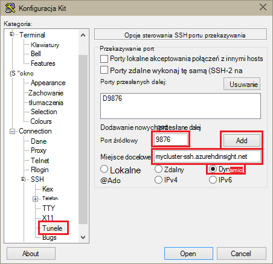
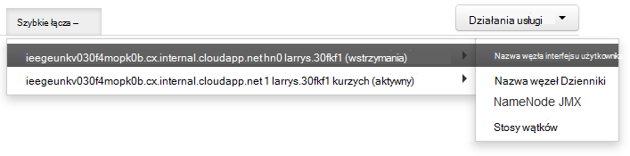

<properties
pageTitle="Uzyskiwanie dostępu do sieci web Ambari interfejsu użytkownika, ResourceManager, JobHistory, NameNode, Oozie i innych sieci web interfejsu użytkownika za pomocą tunelowania SSH"
description="Dowiedz się, jak za pomocą tunelem SSH bezpieczne przeglądanie zasobów sieci web znajdujących się na węzły HDInsight systemem Linux."
services="hdinsight"
documentationCenter=""
authors="Blackmist"
manager="jhubbard"
editor="cgronlun"/>

<tags
ms.service="hdinsight"
ms.devlang="na"
ms.topic="article"
ms.tgt_pltfrm="na"
ms.workload="big-data"
ms.date="10/17/2016"
ms.author="larryfr"/>

# Uzyskiwanie dostępu do sieci web Ambari interfejsu użytkownika, JobHistory NameNode, Oozie i innych sieci web interfejsu użytkownika za pomocą tunelowania SSH

Systemem Linux klastrów HDInsight zapewniają dostęp do Ambari interfejs użytkownika sieci web w Internecie, ale niektóre funkcje interfejsu użytkownika nie są. Na przykład interfejs użytkownika sieci web dla innych usług, które są udostępnione za pośrednictwem Ambari. Funkcje programu web Ambari interfejsu użytkownika należy użyć tunelem SSH do nagłówka klaster.

## Co wymaga tunelem SSH?

Kilka menu Ambari będą nie pełni wypełniać bez tunelem SSH jako polegają na witryn sieci web i usługach ujawnionego przez inne usługi Hadoop uruchamiania w klastrze. Często tych witryn sieci web nie są zabezpieczone, więc nie jest bezpieczne bezpośrednio udostępniania ich w Internecie. Czasami działa usługa witryny sieci web w innym węźle klaster, takich jak węzeł Zookeeper.

Usługi, które korzysta z sieci web Ambari interfejsu użytkownika, które nie są dostępne bez tunelem SSH są następujące:

* JobHistory,
* NameNode,
* Stosy wątku
* Oozie interfejs użytkownika sieci web
* Wzorzec HBase i dzienniki interfejsu użytkownika

Jeśli dostosowywanie klaster za pomocą akcji skryptu dowolnej usług lub narzędzi, które można zainstalować z użyciem interfejs użytkownika w sieci web wymaga tunelem SSH. Na przykład po zainstalowaniu odcień przy użyciu akcji skrypt, należy użyć tunelem SSH dostępu do sieci web odcień interfejsu użytkownika.

## Co to jest tunelem SSH?

[Secure Shell (SSH) tunneling](https://en.wikipedia.org/wiki/Tunneling_protocol#Secure_Shell_tunneling) kieruje ruch wysyłany do portu w miejscu pracy lokalnych, za pośrednictwem połączenia SSH do usługi HDInsight głowy węzła, gdzie żądanie zostanie rozwiązany następnie tak, jakby rozpoczęte na węzła głównego. Następnie rozesłaniu odpowiedź wstecz przez tunelem do pracy.

## Wymagania wstępne

Używając tunelem SSH dla ruchu w sieci web, musisz mieć następujące czynności:

* Klient SSH. Rozkład Linux i Unix lub Macintosh OS X `ssh` polecenie jest dostępne w systemie operacyjnym. Dla systemu Windows zalecamy [Kit](http://www.chiark.greenend.org.uk/~sgtatham/putty/download.html)

    > [AZURE.NOTE] Jeśli chcesz użyć innego niż klienta SSH `ssh` lub Kit, zapoznaj się z dokumentacją dla klienta na temat ustanawiania tunelem SSH.

* Przeglądarki sieci web, która może być skonfigurowany do używania serwera proxy SOCKS

## Tworzenie tunelem za pomocą polecenia SSH

Użyj następujące polecenie, aby utworzyć SSH tunelu przy użyciu `ssh` polecenia. Zamień __nazwę użytkownika__ na użytkownika SSH klaster HDInsight i Zamień __NAZWAKLASTRA__ nazwę klaster HDInsight

    ssh -C2qTnNf -D 9876 USERNAME@CLUSTERNAME-ssh.azurehdinsight.net

Spowoduje to utworzenie połączenia, który kieruje ruch do portu lokalnego 9876 z klastrem przez SSH. Dostępne są następujące opcje:

* **D 9876** - port lokalny, który będzie skierować ruch do tunelem.

* **C** - skompresować wszystkie dane, ponieważ ruchu w sieci web jest głównie tekstem.

* **2** - Wymuszaj SSH wypróbować protokół tylko w wersji 2.

* **pytania** — tryb cichy.

* **T** - Wyłącz pseudo tty alokacji, ponieważ firma Microsoft po prostu przesyłasz portu.

* **n** - zapobieganie odczytu STDIN, ponieważ firma Microsoft po prostu przesyłasz portu.

* **N** - nie wykonuj polecenia zdalnego, ponieważ firma Microsoft po prostu przesyłasz portu.

* **f** - działanie w tle.

Jeśli skonfigurowano klaster przy użyciu klucza SSH, może być konieczne używanie `-i` parametru i określ ścieżkę do klucz prywatny SSH.

Po zakończeniu wykonywania polecenia ruch wysyłane do portu 9876 na komputerze lokalnym będzie kierowane przez warstwy SSL (Secure Sockets) z klastrem głowy węzeł i wydaje się pochodzą.

## Tworzenie tunelem przy użyciu Kit

Wykonaj następujące czynności, aby utworzyć tunelem SSH przy użyciu Kit.

1. Otwórz Kit i wprowadź informacje o połączeniu. Jeśli nie znasz Kit, zobacz [Używanie SSH z systemem Linux Hadoop na HDInsight z systemu Windows](hdinsight-hadoop-linux-use-ssh-windows.md) dla informacji na temat sposobu używania go z usługi HDInsight.

2. W sekcji **kategorii** po lewej stronie okna dialogowego rozwiń **połączenie**, rozwiń **SSH**, a następnie wybierz pozycję **tuneli**.

3. Wprowadź następujące informacje w formularzu **Opcje przekierowania portów SSH** :

    * **Port źródłowy** — port klienta, który chcesz przesłać dalej. Na przykład **9876**.

    * **Miejsce docelowe** - SSH adres klaster HDInsight systemem Linux. Na przykład **mycluster ssh.azurehdinsight.net**.

    * **Dynamiczne** — umożliwia dynamiczne serwera proxy SOCKS routing.

    

4. Kliknij przycisk **Dodaj** , aby dodać ustawienia, a następnie kliknij przycisk **Otwórz** , aby otworzyć połączenie SSH.

5. Gdy zostanie wyświetlony monit, zaloguj się na serwerze. Spowoduje to ustanowić sesję SSH i Włącz tunelem.

## Używanie tunelem za pomocą przeglądarki

> [AZURE.NOTE] Czynności opisane w tej sekcji za pomocą przeglądarki FireFox, ponieważ jest dostępne bezpłatnie do systemów Linux, Unix, Macintosh OS X i Windows. Inne nowoczesne przeglądarki, które obsługa przy użyciu serwera proxy SOCKS będą również działać.

1. Konfigurowanie przeglądarki, aby użyć **localhost:9876** jako serwer proxy **SOCKS v5** . Poniżej przedstawiono wygląd ustawienia przeglądarki Firefox. Jeśli używasz innego portu niż 9876, zmień portu, którego używasz:

    

    > [AZURE.NOTE] Wybieranie **Zdalnego DNS** rozwiąże żądania systemu nazw domen (DNS) przy użyciu klaster HDInsight. Jeśli ta opcja jest zaznaczona, DNS zostaną rozwiązane lokalnie.

2. Upewnij się, że ruch jest rozsyłana za pośrednictwem tunelem przez vising witrynie, takiej jak [http://www.whatismyip.com/](http://www.whatismyip.com/) dotyczącą ustawień serwera proxy włączona, a wyłączona w programie Firefox. Ustawienia są włączone, adres IP będzie dla komputera w centrum danych Microsoft Azure.

##Sprawdź z sieci web Ambari interfejsu użytkownika

Po ustaleniu klaster, wykonaj następujące czynności, aby zweryfikować, że uzyskiwania dostępu do usług sieci web pakietu z sieci Ambari Web:

1. W przeglądarce przejdź do http://headnodehost:8080. `headnodehost` Adres z klastrem będą przesyłane tunelem i rozpoznawać headnode, na którym działa Ambari. Po wyświetleniu monitu wprowadź nazwę użytkownika administratora (Administrator) i hasło klaster. Może pojawić się monit po raz drugi, web Ambari interfejsu użytkownika. Jeśli tak, ponownie wprowadzić informacje.
    
    > [AZURE.NOTE] Połącz się z klastrem za pomocą adresu http://headnodehost:8080, łączysz się bezpośrednio nad tunelem do węzła głównego, który Ambari pracuje przy użyciu protokołu HTTP i komunikacji jest chronione za pomocą tunelem SSH. podczas nawiązywania połączenia przez internet bez użycia tunelem, komunikacji jest chronione za pomocą protokołu HTTPS. Aby połączyć się przez internet przy użyciu protokołu HTTPS, należy użyć https://CLUSTERNAME.azurehdinsight.net, gdzie __NAZWAKLASTRA__ jest nazwę grupie.

2. Interfejs sieci Web Ambari zaznacz HDFS na liście po lewej stronie.

    

3. Po wyświetleniu informacji usługi HDFS, wybierz pozycję __Szybkie łącza__. Zostanie wyświetlona lista głowy węzłach. Wybierz jedną z głowy węzły, a następnie wybierz __NameNode interfejsu użytkownika__.

    

    > [AZURE.NOTE] Jeśli korzystasz z wolnego połączenia z Internetem lub węzła głównego jest bardzo zajęty, może zostać wyświetlony wskaźnik oczekiwania zamiast menu, po wybraniu __Szybkie łącza__. Jeśli tak, zaczekaj minutę lub dwie dla danych z serwera, a następnie spróbuj ponownie listy.
    >
    > Jeśli masz dolnym monitor o rozdzielczości lub oknie przeglądarki nie jest zmaksymalizowany, niektóre wpisy w menu __Szybkie łącza__ może być obcinana przez po prawej stronie ekranu. Jeśli tak, rozwiń menu za pomocą myszy, a następnie przewiń ekran w prawo, aby zobaczyć pozostałą część menu za pomocą klawisza Strzałka w prawo.

4. Powinna zostać wyświetlona strona podobna do następującej:

    

    > [AZURE.NOTE] Zwróć uwagę, adres URL strony; powinna być podobna do __http://hn1-CLUSTERNAME.randomcharacters.cx.internal.cloudapp.net:8088-klaster__. Za pomocą w wewnętrznych w pełni kwalifikowaną nazwę domeny (FQDN) węzła, a nie jest dostępny bez użycia tunelem SSH.

## Następne kroki

Teraz, gdy znasz sposobu tworzenia i używania tunelem SSH, zobacz następujące informacje dotyczące monitorowania i zarządzania klaster przy użyciu Ambari:

* [Zarządzanie klastrów HDInsight przy użyciu Ambari](hdinsight-hadoop-manage-ambari.md)

Aby uzyskać więcej informacji na temat korzystania z usługi HDInsight SSH zobacz:

* [Używanie SSH z systemem Linux Hadoop na HDInsight z Linux, Unix lub systemu OS X](hdinsight-hadoop-linux-use-ssh-unix.md)

* [Używanie SSH z systemem Linux Hadoop na HDInsight z systemu Windows](hdinsight-hadoop-linux-use-ssh-windows.md)
