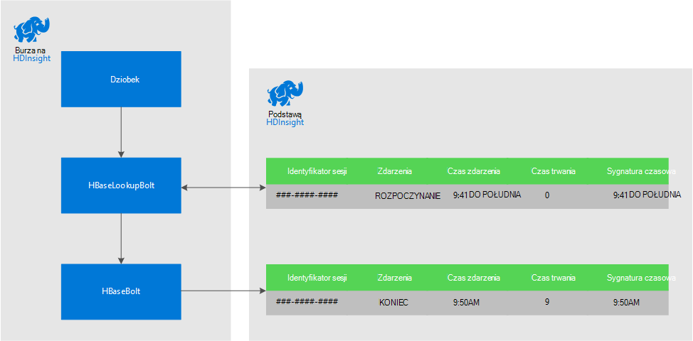
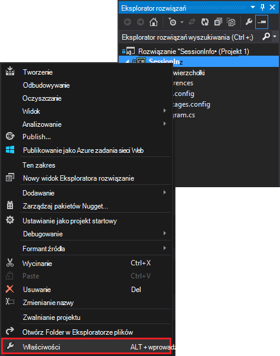
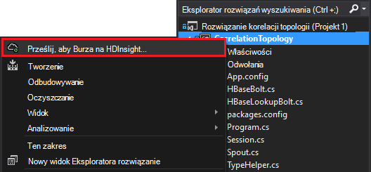

<properties
 pageTitle="Przeniesionym zdarzeń w czasie z Burza i HBase na HDInsight"
 description="Dowiedz się, jak dostosować zdarzenia pojawiające się w innym czasie przy użyciu Burza i HBase na HDInsight."
 services="hdinsight"
 documentationCenter=""
 authors="Blackmist"
 manager="jhubbard"
 editor="cgronlun"
 tags="azure-portal"/>

<tags
 ms.service="hdinsight"
 ms.devlang="dotnet"
 ms.topic="article"
 ms.tgt_pltfrm="na"
 ms.workload="big-data"
 ms.date="10/27/2016"
 ms.author="larryfr"/>

# Przeniesionym zdarzeń w czasie z Burza i HBase na HDInsight

Korzystając z magazynu trwałych danych z Burza Apache, można dostosować pozycji danych, pojawiające się w innym czasie. Na przykład łączenie logowanie i wyrejestrowywanie zdarzeń dla sesji użytkownika do obliczania, jak długo trwa trwającej sesji.

W tym dokumencie dowiesz się, jak utworzyć podstawowy topologię C# burza, która śledzi logowanie i wyrejestrowywanie zdarzeń dla sesji użytkowników i czas trwania sesji. Topologia używa HBase przechowywania trwałych danych. HBase umożliwia także wykonywać partii kwerendy na danych historycznych w celu utworzenia wniosków dodatkowe, na przykład liczbę sesji użytkowników zostały rozpoczęte lub zakończone w określonym okresie.

## Wymagania wstępne

- Program Visual Studio i narzędzia HDInsight programu Visual Studio: Aby uzyskać informacje na temat instalacji, zobacz [rozpocząć korzystanie z narzędzia HDInsight programu Visual Studio](../HDInsight/hdinsight-hadoop-visual-studio-tools-get-started.md) .

- Burza Apache na HDInsight klaster (opartych na systemie Windows). Zostanie zwrócony topologii burza, który przetwarza dane przychodzące i zapisuje go do HBase.

    > [AZURE.IMPORTANT] Podczas topologii SCP.NET są obsługiwane na klastrów systemem Linux Burza utworzone po 2016-10-28, SDK HBase pakietu .NET dostępne na 2016-10-28 nie działa poprawnie w systemie Linux.

- HBase Apache w klastrze HDInsight (Linux lub systemu Windows). Jest to magazyn danych, w tym przykładzie.

## Architektura

Korelacji zdarzeń wymaga identyfikatora wspólne dla źródła zdarzenia. For example identyfikator użytkownika, identyfikator sesji lub inny element danych, który jest) unikatowych i b) objęte wszystkie dane przesyłane do Burza. W tym przykładzie użyto wartości GUID reprezentować identyfikator sesji.

W tym przykładzie składa się z dwóch klastrów HDInsight:

-   HBase: danych historycznych w magazynie danych trwałych

-   Burza: umożliwia mogły zjeść tej ostatniej przychodzących danych

Dane jest generowany losowo topologii Burza i składa się z następujących elementów:

-   Identyfikator sesji: identyfikator GUID, który musi jednoznacznie identyfikować każdy sesji

-   Zdarzenie: rozpoczęcia lub zakończenia zdarzenia. W tym przykładzie, Rozpocznij zawsze występuje przed zakończeniem

-   Czas: czas zdarzenia.

Te dane są przetwarzane i przechowywane w HBase.

### Topologia Burza

Po uruchomieniu sesji zdarzenie **początkowe** jest odebrana przez topologii i zalogowanie się HBase. Po odebraniu zdarzenie **końcowe** topologii pobiera zdarzenie **początkowe** i oblicza czasu między dwa zdarzenia. Ta wartość **czasu trwania** jest następnie przechowywany w HBase wraz z informacjami o zdarzenia **zakończenia** .

> [AZURE.IMPORTANT] Podczas tej topologii zaprezentowano podstawowy wzorzec, rozwiązanie produkcji należy wykonać projektu w następujących przypadkach:
>
> - Zdarzenia nadchodzi nie działa
> - Zduplikowane zdarzenia
> - Porzucone zdarzenia

Topologia próbki składa się z następujących składników:

-   Session.CS: symuluje sesji użytkownika, tworząc Identyfikatora sesji losowe rozpoczęcia czasu oraz jak długo trwa sesji

-   Spout.CS: tworzy 100 sesjach, emituje zdarzenie początkowe, czeka losowe limitu czasu dla każdej sesji i następnie emituje zdarzenie końcowe. Następnie odtwarza zakończone sesje, aby wygenerować nowych plików.

-   HBaseLookupBolt.cs: używa Identyfikatora sesji wyszukująca informacje sesji z HBase. Podczas przetwarzania zdarzenie końcowe umożliwia znalezienie wyrazów odpowiednie zdarzenie rozpoczęcia i czas trwania sesji.

-   HBaseBolt.cs: Przechowuje informacji do HBase.

-   TypeHelper.cs: Ułatwia konwersji typów odczytu / zapisu w HBase.

### HBase schematu

W HBase dane są przechowywane w tabeli przy użyciu schematów i ustawień:

-   Klucz wiersza: sesja identyfikator jest używany jako klucz dla wierszy w tabeli

-   Rodzina kolumn: Nazwa rodziny jest "cf". Są przechowywane w tym rodziny kolumn:

    -   zdarzenia: rozpoczęcie lub zakończenie

    -   czasu: czas (w milisekundach), które wystąpiło zdarzenie

    -   czas trwania: odległość między rozpoczęcia i zakończenia zdarzenia

-   WERSJE: Ustawianie rodziny "cf" przechowywania wersji 5 każdego wiersza

    > [AZURE.NOTE] Wersje są dziennika poprzedniej wartości przechowywanych na klucz określonego wiersza. Domyślnie HBase tylko zwraca wartość dla najnowszej wersji wiersza. W tym przypadku tym samym wierszu jest używana dla wszystkich zdarzeń (początek, koniec.) w każdej wersji wiersza jest identyfikowany przez wartość sygnatury czasowej. Dzięki temu historycznych widoku rejestrowania zdarzeń dla określonego identyfikatora.

## Pobierz projektu

Przykładowy projekt można pobrać z [https://github.com/Azure-Samples/hdinsight-storm-dotnet-event-correlation](https://github.com/Azure-Samples/hdinsight-storm-dotnet-event-correlation).

Pobierz ten zawiera następujące projekty C#:

-   CorrelationTopology: Topologia C# Burza losowo emituje rozpoczęcia i zakończenia zdarzenia dla sesji użytkowników. Każda sesja trwa od 1 do 5 minut.

-   SessionInfo: C# aplikacji konsoli tworzy tabelę HBase, która zawiera przykładowych kwerend do zwracania informacji o przechowywane dane sesji.

## Tworzenie tabeli

1. Otwórz projekt **SessionInfo** w programie Visual Studio.

2. W **Eksploratorze rozwiązań**kliknij prawym przyciskiem myszy projektu **SessionInfo** i wybierz polecenie **Właściwości**.

    

3. Wybierz pozycję **Ustawienia**, a następnie ustaw następujące wartości:

    -   HBaseClusterURL: adres URL klaster HBase. Na przykład https://myhbasecluster.azurehdinsight.net

    -   HBaseClusterUserName: administrator/HTTP konto użytkownika dla klaster

    -   HBaseClusterPassword: hasło do konta użytkownika Administrator/HTTP

    -   HBaseTableName: Nazwa tabeli, aby w tym przykładzie za pomocą

    -   HBaseTableColumnFamily: Rodzina nazwa kolumny

    

5. Uruchom rozwiązanie. Po wyświetleniu monitu wybierz klucz "c", aby utworzyć tabelę w klastrze HBase.

## Tworzenie i wdrażanie topologii Burza

1.  Otwórz rozwiązanie **CorrelationTopology** w programie Visual Studio.

2.  W **Eksploratorze rozwiązań**kliknij prawym przyciskiem myszy projektu **CorrelationTopology** i wybierz polecenie Właściwości.

3.  W oknie właściwości wybierz pozycję **Ustawienia** , a następnie wprowadź następujące informacje. Pierwszych 5 powinny być tych samych wartości używane w programie **SessionInfo** project:

    -   HBaseClusterURL: adres URL klaster HBase. Na przykład https://myhbasecluster.azurehdinsight.net

    -   HBaseClusterUserName: administrator/HTTP konto użytkownika dla klaster

    -   HBaseClusterPassword: hasło do konta użytkownika Administrator/HTTP

    -   HBaseTableName: Nazwa tabeli za pomocą w tym przykładzie. Ten powinien zawierać tę samą nazwę tabeli, jak w programie project SessionInfo

    -   HBaseTableColumnFamily: Rodzina nazwę kolumny. Ten powinien zawierać tej samej nazwy rodziny kolumny, jak w programie project SessionInfo

    > [AZURE.IMPORTANT] Nie zmieniają się HBaseTableColumnNames, jak ustawienia domyślne nazwy używane przez **SessionInfo** do pobierania danych.

4.  Zapisywanie właściwości, a następnie utworzyć projektu.

5.  W **Eksploratorze rozwiązań**kliknij prawym przyciskiem myszy projektu, a następnie wybierz pozycję **Prześlij, aby Burza na HDInsight**. Jeśli zostanie wyświetlony monit, wprowadź poświadczenia dla subskrypcji Azure.

    

6.  W oknie dialogowym **Przesyłanie topologii** wybierz klaster Burza uruchomienia tej topologii.

    > [AZURE.NOTE] Przesyłanie topologii, po raz pierwszy może potrwać kilka sekund pobrać nazwy klastrów HDInsight.

7.  Po topologii został przekazane i przesłane z klastrem, **Burza topologii widok** będzie otworzyć i wyświetlić uruchomionego topologii. Zaznacz **CorrelationTopology** i użyj przycisk Odśwież na górze rogu strony, aby odświeżyć informacje o topologii.

    

    Po rozpoczęciu topologii generowania danych będzie zwiększać wartość w kolumnie **Emitted** .

    > [AZURE.NOTE] Jeśli **Widok topologii Burza** nie jest otwierany automatycznie, wykonaj następujące czynności, aby go otworzyć:
    >
    > 1. W **Eksploratorze rozwiązań**rozwiń **Azure**, a następnie rozwiń węzeł **HDInsight**.
    >
    > 2. Kliknij prawym przyciskiem myszy klaster Burza topologii działa na, a następnie wybierz **Widok Burza topologii**

## Kwerendy danych

Gdy dane zostały emisji, wykonaj następujące czynności do pobrania danych.

1. Wróć do programu project **SessionInfo** . Jeśli nie działa, Uruchom nowe wystąpienie.

2. Gdy zostanie wyświetlony monit, wybierz pozycję **s** , aby wyszukać rozpoczęcia zdarzenia. Użytkownik zostanie wyświetlony monit o wprowadź godzinę rozpoczęcia i zakończenia, aby zdefiniować zakres czasu — zostaną zwrócone tylko wydarzenia między tymi dwiema godzinami.

    Podczas wprowadzania godzin rozpoczęcia i zakończenia należy użyć następującego formatu: hh: mm i "am" lub "pm". Na przykład 11:20 pm.

    Ponieważ topologii właśnie zostało uruchomione, użyj rozpoczęcia czasu z przed został wdrożony i czas zakończenia teraz. Należy to Przechwytywanie większość zdarzeń rozpoczęcia, wygenerowane podczas jego uruchamiania. Podczas uruchamiania kwerendy, należy wyświetlić listę pozycji podobny do następującego:

        Session e6992b3e-79be-4991-afcf-5cb47dd1c81c started at 6/5/2015 6:10:15 PM. Timestamp = 1433527820737

Wyszukiwanie zdarzeń zakończenia działa tak samo jako rozpoczęcia zdarzenia. Jednak zakończenia zdarzenia są generowane losowo od 1 do 5 minut po zdarzeniu START. Dlatego może być wypróbować kilka zakresów czasu, aby znaleźć zdarzeń zakończenia. Zdarzeń zakończenia będzie również zawierać czas trwania sesji - różnica między godzina zdarzenia rozpoczęcia i czas zakończenia zdarzenia. Oto przykład danych w celu zakończenia zdarzenia:

    Session fc9fa8e6-6892-4073-93b3-a587040d892e lasted 2 minutes, and ended at 6/5/2015 6:12:15 PM

> [AZURE.NOTE] Po wprowadzeniu wartości czasu są na czas lokalny, czasu zwrócone przez kwerendę będzie UTC.

##Zatrzymywanie topologii

Gdy chcesz zatrzymać topologii, powróć do projektu **CorrelationTopology** programu Visual Studio. W **Widoku topologii Burza**Wybierz topologię, a następnie użyj przycisku **skasować** w górnej części widoku topologii.

##Usuwanie klaster

[AZURE.INCLUDE [delete-cluster-warning](../../includes/hdinsight-delete-cluster-warning.md)]

##Następne kroki

Więcej przykładów Burza zobacz [przykład topologii dla Burza na HDInsight](hdinsight-storm-example-topology.md).
 
