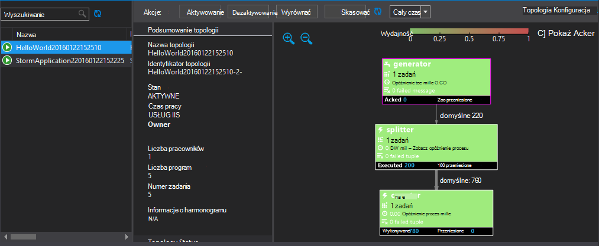

<properties
   pageTitle="Wdrażanie i zarządzanie nią topologii Burza Apache na HDInsight | Microsoft Azure"
   description="Dowiedz się, jak wdrażać, monitorowanie i zarządzanie topologii Burza Apache za pomocą pulpitu nawigacyjnego Burza na HDInsight. Użyj narzędzia Hadoop programu Visual Studio."
   services="hdinsight"
   documentationCenter=""
   authors="Blackmist"
   manager="jhubbard"
   editor="cgronlun"
    tags="azure-portal"/>

<tags
   ms.service="hdinsight"
   ms.devlang="java"
   ms.topic="article"
   ms.tgt_pltfrm="na"
   ms.workload="big-data"
   ms.date="10/11/2016"
   ms.author="larryfr"/>

#Wdrażanie i zarządzanie nią topologii Burza Apache na HDInsight systemu Windows

Pulpit nawigacyjny Burza pozwala na łatwe wdrażanie i uruchamianie topologii Burza Apache do klaster HDInsight za pomocą przeglądarki sieci web. Za pomocą pulpitu nawigacyjnego do monitorowania i zarządzania żywa topologii. Jeśli używasz programu Visual Studio, narzędzia HDInsight programu Visual Studio Podaj podobne funkcje w programie Visual Studio.

Pulpit nawigacyjny Burza i funkcje Burza w narzędziach HDInsight oparte na interfejsu API usługi REST burza, które mogą być używane do tworzenia własnych monitorowania i zarządzania rozwiązań.

> [AZURE.IMPORTANT] Kroki opisane w tym dokumencie wymagają systemu Windows Burza w klastrze HDInsight. Aby uzyskać informacje na temat korzystania z systemem Linux klaster, zobacz [rozmieszczanie i zarządzanie nimi topologii Burza Apache na podstawie Linux HDInsight](hdinsight-storm-deploy-monitor-topology-linux.md)

##Wymagania wstępne

* **Burza Apache na HDInsight** — zobacz <a href="../hdinsight-storm-getting-started/" target="_blank">Rozpoczynanie pracy z Burza Apache na HDInsight</a> instrukcje dotyczące tworzenia klastrze

* **Pulpit nawigacyjny Burza**: nowoczesny przeglądarki obsługującej HTML5

* Dla **Programu Visual Studio** — Azure SDK 2.5.1 lub nowszego i narzędzia HDInsight programu Visual Studio. Zobacz <a href="../hdinsight-hadoop-visual-studio-tools-get-started/" target="_blank">rozpocząć korzystanie z narzędzia HDInsight programu Visual Studio</a> , aby zainstalować i skonfigurować narzędzia HDInsight programu Visual Studio.

    Jedna z następujących wersji programu Visual Studio:

    * Program Visual Studio 2012 w przypadku <a href="http://www.microsoft.com/download/details.aspx?id=39305" target="_blank">aktualizacji 4</a>

    * Visual Studio 2013 <a href="http://www.microsoft.com/download/details.aspx?id=44921" target="_blank">Aktualizacja 4</a> lub <a href="http://go.microsoft.com/fwlink/?LinkId=517284" target="_blank">Program Visual Studio 2013 społeczności</a>

    * <a href="http://visualstudio.com/downloads/visual-studio-2015-ctp-vs" target="_blank">Visual Studio 2015 CTP6</a>

    > [AZURE.NOTE] Narzędzia HDInsight programu Visual Studio obsługuje obecnie tylko Burza na wersję klaster HDInsight 3,2.

##Pulpit nawigacyjny Burza

Pulpit nawigacyjny Burza jest dostępna w klastrze Burza strony sieci web. Adres URL jest **https://&lt;NazwaKlastra >.azurehdinsight.net/**, gdzie **NazwaKlastra** to nazwa Twojej Burza w klastrze HDInsight.

U góry pulpitu nawigacyjnego Burza wybierz **Przesyłanie topologii**. Postępuj zgodnie z instrukcjami na stronie Uruchom topologii próbki lub przekazywanie i uruchamianie topologii utworzone przez Ciebie.

![Przesyłanie strony topologii][storm-dashboard-submit]

###Burza interfejsu użytkownika

Na pulpicie nawigacyjnym Burza wybierz łącze **Burza interfejsu użytkownika** . Spowoduje to wyświetlenie informacji o klastrze oprócz dowolnego uruchomionego topologii.

![Interfejs użytkownika Burza][storm-dashboard-ui]

> [AZURE.NOTE] W niektórych wersjach programu Internet Explorer można odkryć Burza interfejsu użytkownika nie odświeżenia po pierwszym wcześniej odwiedzić. Na przykład może nie pokazywać nowy topologii przesłane lub może pokazywać topologii jako aktywny podczas wcześniej dezaktywowana. Firma Microsoft zna ten problem i pracuje nad rozwiązaniem.

####Strona główna

Stronie głównej interfejsu użytkownika Burza zawiera następujące informacje:

* **Klaster podsumowanie**: podstawowe informacje o grupie Burza.

* **Podsumowanie topologii**: listę uruchomionych topologii. Aby wyświetlić więcej informacji na temat określonej topologii za pomocą łącza w tej sekcji.

* **Inspektor podsumowanie**: informacji na temat Inspektora Burza.

* **Konfiguracja nimbus**: Konfiguracja Nimbus klaster.

####Topologia podsumowania

Wybieranie łącza z sekcji **topologii podsumowanie** zostaną wyświetlone następujące informacje o topologii:

* **Podsumowanie topologii**: podstawowe informacje o topologii.

* **Akcje topologii**: Zarządzanie akcje, które można wykonać dla topologii.

    * **Aktywuj**: życiorysy przetwarzania topologii został dezaktywowany.

    * **Dezaktywuj**: wstrzymano uruchomionego topologii.

    * **Wyrównać**: skoryguje podobieństwa topologii. Po zmianie liczby węzłów w klastrze, należy wyrównać uruchomionego topologii. Dzięki temu topologię, aby dostosować równoległości wyrównania zwiększona lub zmniejszona liczby węzłów w klastrze.

        Aby uzyskać więcej informacji zobacz <a href="http://storm.apache.org/documentation/Understanding-the-parallelism-of-a-Storm-topology.html" target="_blank">Opis podobieństwa topologii Burza</a>.

    * **Skasować**: kończy topologii Burza po określonym czasie.

* **Statystyka topologii**: statystykę topologii. Aby ustawić okres dla pozostałych wpisów na stronie za pomocą łącza w kolumnie **okna** .

* **Spouts**: spouts używane przez topologii. Aby wyświetlić więcej informacji na temat określonej spouts za pomocą łącza w tej sekcji.

* **Śrub**: tekst "Śruby" używane przez topologii. Za pomocą łącza w tej sekcji, aby wyświetlić więcej informacji na temat określonej tekst "Śruby".

* **Topologia Konfiguracja**: Konfiguracja wybrana topologia.

####Dziobek i podsumowanie błyskawicy

Wybieranie dziobek z sekcji **Spouts** lub **śrub** zostaną wyświetlone następujące informacje na temat zaznaczonego elementu:

* **Składnik podsumowanie**: podstawowe informacje o dziobek lub błyskawicy.

* **Statystyka dziobek-błyskawicy**: statystykę dziobek lub błyskawicy. Aby ustawić okres dla pozostałych wpisów na stronie za pomocą łącza w kolumnie **okna** .

* **Statystyki wprowadzania** (tylko śruby): informacji na temat wejściowych strumieni zużywanej przez śruby.

* **Dane wyjściowe statystykę**: informacje o strumienie dostarczanych przez to spout lub zablokowanie.

* **Testamentu**: informacji na temat wystąpienia dziobek lub błyskawicy. Wybierz pozycję **portu** dla określonego program wyświetlić dziennik informacji diagnostycznych wyprodukowano dla tego wystąpienia.

* **Błędy**: informacje o błędzie, w tym spout lub zablokowanie.

##Narzędzia HDInsight programu Visual Studio

Narzędzia HDInsight może służyć do przesyłania C# lub hybrydowych topologii klaster Burza. W poniższej procedurze użyto przykładowej aplikacji. Aby uzyskać informacji o tworzeniu własnych topologii przy użyciu narzędzi z usługi HDInsight zobacz [opracowywanie C# topologii za pomocą narzędzi HDInsight programu Visual Studio](hdinsight-storm-develop-csharp-visual-studio-topology.md).

Wykonaj następujące czynności, aby wdrażanie usługi Burza w klastrze HDInsight próbki, a następnie przejrzeć i zarządzać topologii.

1. Jeśli nie masz już zainstalowany najnowszej wersji narzędzia HDInsight programu Visual Studio, zobacz <a href="../hdinsight-hadoop-visual-studio-tools-get-started/" target="_blank">rozpocząć korzystanie z narzędzia HDInsight programu Visual Studio</a>.

2. Otwórz program Visual Studio, wybierz **plik** > **Nowy** > **projektu**.

3. W oknie dialogowym **Nowy projekt** , rozwiń **zainstalowano** > **Szablony**, a następnie wybierz pozycję **HDInsight**. Z listy szablonów wybierz **Burza próbki**. W dolnej części okna dialogowego wpisz nazwę dla aplikacji.

    

1. W **Eksploratorze rozwiązań**kliknij prawym przyciskiem myszy projektu, a następnie wybierz pozycję **Prześlij, aby Burza na HDInsight**.

    > [AZURE.NOTE] Jeśli zostanie wyświetlony monit, wprowadź poświadczenia logowania dla subskrypcji Azure. Jeśli masz więcej niż jedną subskrypcję, zaloguj się do szablonu, który zawiera usługi Burza w klastrze HDInsight.

2. Wybierz swojego Burza w klastrze HDInsight z listy rozwijanej **Klaster Burza** , a następnie wybierz pozycję **Prześlij**. Można monitorować czy przekazywania zostanie przeprowadzone pomyślnie za pomocą okna **dane wyjściowe** .

3. Po pomyślnym przesłaniu topologii **Topologii Burza** dla klaster powinien być wyświetlany. Topologia wybierz z listy, aby wyświetlić informacje o topologii uruchomionego.

    

    > [AZURE.NOTE] Możesz także wyświetlić **Topologii Burza** Eksploratora **Serwera** po rozwinięciu **Azure** > **HDInsight**, a następnie prawym przyciskiem myszy Burza w klastrze HDInsight i wybranie **Widoku Burza topologii**.

    Zaznacz kształt spouts lub tekst "Śruby", aby wyświetlić informacje dotyczące tych składników. Dla każdej z nich wybrany element zostanie otwarte nowe okno.
    
    > [AZURE.NOTE] Nazwa topologii jest nazwą klasy topologii (w tym przypadku `HelloWord`,) z dodanym sygnatura czasowa.

4. W widoku **Podsumowanie topologii** wybierz **skasować** , aby zatrzymać topologii.

    > [AZURE.NOTE] Topologii burzy nadal uruchomiony, dopóki nie zostały one zatrzymane lub klaster zostanie usunięty.

##INTERFEJSU API USŁUGI REST

Interfejs użytkownika Burza jest tworzona na bieżąco interfejsu API usługi REST, aby przeprowadzić podobne zarządzania i monitorowania funkcji za pomocą interfejsu API usługi REST. Interfejsu API usługi REST służy do tworzenia niestandardowych narzędzi do zarządzania i monitorowania Burza topologii.

Aby uzyskać więcej informacji zobacz [Burza interfejsu API usługi REST interfejsu użytkownika](https://github.com/apache/storm/blob/0.9.3-branch/STORM-UI-REST-API.md). Poniższe informacje są specyficzne dla interfejsu API usługi REST za pomocą Burza Apache na HDInsight.

###Identyfikator URI Base

Podstawowy identyfikator URI dla interfejsu API usługi REST dotyczących klastrów HDInsight jest **https://&lt;NazwaKlastra >.azurehdinsight.net/stormui/api/v1/**, gdzie **NazwaKlastra** to nazwa Twojej Burza w klastrze HDInsight.

###Uwierzytelnianie

Żądania interfejsu API usługi REST, należy użyć **uwierzytelniania podstawowego**, aby używać HDInsight klaster nazwą i hasłem administratora.

> [AZURE.NOTE] Ponieważ uwierzytelnianie podstawowe są wysyłane przy użyciu zwykłego tekstu, należy **zawsze** są używane HTTPS do zabezpieczania komunikacji z klastrem.

###Zwracane wartości

Informacje, które zostanie zwrócony interfejsu API usługi REST może być tylko można używać z poziomu klaster lub maszyn wirtualnych w tej samej Azure wirtualnej sieci jako klaster. Na przykład w pełni kwalifikowaną nazwę domeny (FQDN) dla serwerów Zookeeper zwracana nie będą dostępne z Internetu.

##Następne kroki

Teraz, gdy znasz już wdrażanie i topologii można monitorować za pomocą pulpitu nawigacyjnego burza, Dowiedz się, jak:

* [Można opracowywać C# topologii za pomocą narzędzi HDInsight programu Visual Studio](hdinsight-storm-develop-csharp-visual-studio-topology.md)

* [Można opracowywać topologii opartego na języku Java przy użyciu środowiska Maven](hdinsight-storm-develop-java-topology.md)

Aby uzyskać listę topologii przykład więcej zobacz [przykład topologii dla Burza na HDInsight](hdinsight-storm-example-topology.md).

[hdinsight-dashboard]: ./media/hdinsight-storm-deploy-monitor-topology/dashboard-link.png
[storm-dashboard-submit]: ./media/hdinsight-storm-deploy-monitor-topology/submit.png
[storm-dashboard-ui]: ./media/hdinsight-storm-deploy-monitor-topology/storm-ui-summary.png
