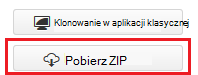
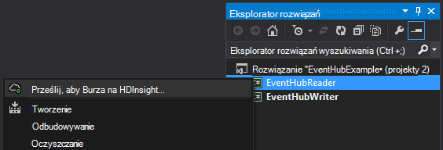
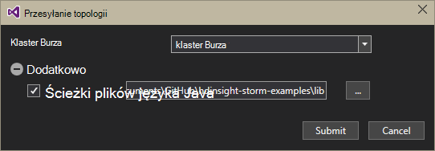
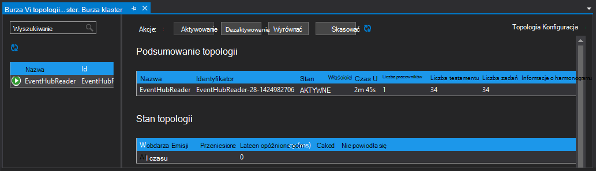

<properties
   pageTitle="Przetwarzanie wydarzenia z koncentratory wydarzenia z Burza na HDInsight | Microsoft Azure"
   description="Dowiedz się, jak przetwarzanie danych koncentratory zdarzenia w topologii C# Burza utworzone w programie Visual Studio za pomocą narzędzi HDInsight programu Visual Studio."
   services="hdinsight,notification hubs"
   documentationCenter=""
   authors="Blackmist"
   manager="jhubbard"
   editor="cgronlun"/>

<tags
   ms.service="hdinsight"
   ms.devlang="dotnet"
   ms.topic="article"
   ms.tgt_pltfrm="na"
   ms.workload="big-data"
   ms.date="10/27/2016"
   ms.author="larryfr"/>

# Proces wydarzenia z Azure koncentratory wydarzenia z Burza na HDInsight (C#)

Azure koncentratory zdarzenia umożliwia przetwarzanie dużych ilości danych z witryny sieci Web, aplikacji i urządzeń. Dziobek koncentratory zdarzeń ułatwia łatwy w użyciu Burza Apache na HDInsight do analizowania danych w czasie rzeczywistym. Można także napisać danych do zdarzenia koncentratorów z Burza przy użyciu śruby koncentratory zdarzenia.

W tym samouczku dowiesz się, jak utworzyć dwa topologii, które współpracują z koncentratorów zdarzenia Azure za pomocą szablonów programu Visual Studio zainstalowanych przy użyciu narzędzia HDInsight programu Visual Studio.

* **EventHubWriter**: losowo generuje dane i zapisuje koncentratory zdarzenia

* **EventHubReader**: odczytuje dane zdarzenie koncentratory i rejestruje dane dzienników Burza

> [AZURE.NOTE] Podczas czynności opisane w tym dokumencie korzystania z systemu Windows środowiska Visual Studio, skompilowany projektu można wysłać do klastrów Linux lub HDInsight systemu Windows. Systemem Linux klastrów tworzone tylko po pomocy technicznej 2016-10-28 SCP.NET topologii.
>
> Aby użyć topologii C# z systemem Linux klaster, możesz zaktualizować pakiet Microsoft.SCP.Net.SDK NuGet używanych w danym projekcie do wersji 0.10.0.6 lub nowszej. Wersja pakietu musi się zgadzać wersji głównej Burza zainstalowanym HDInsight. Na przykład Burza w wersjach HDInsight 3.3 i 3.4 użyć wersji Burza 0.10.x podczas burzy korzysta z usługi HDInsight 3.5 1.0.x.
> 
> C# topologii na podstawie Linux klastrów należy użyć 4,5 .NET i używać jedno do uruchamiania w klastrze HDInsight. Większość poleceń będzie działać, jednak należy sprawdzić dokument [Zgodności jedno](http://www.mono-project.com/docs/about-mono/compatibility/) pod kątem potencjalnych niezgodności.
>
> Dla wersji języka Java tego projektu, które będą również działać w klastrze systemem Linux lub systemem Windows, zobacz [zdarzenia procesu z Azure koncentratory wydarzenia z Burza na HDInsight (Java)](hdinsight-storm-develop-java-event-hub-topology.md).

## Wymagania wstępne

* [Burza Apache w klastrze HDInsight](hdinsight-apache-storm-tutorial-get-started.md)

* [Centrum Azure zdarzenia](../event-hubs/event-hubs-csharp-ephcs-getstarted.md)

* [Zestaw SDK Azure .NET](http://azure.microsoft.com/downloads/)

* [Narzędzia HDInsight programu Visual Studio](hdinsight-hadoop-visual-studio-tools-get-started.md)

## Ukończonego projektu

Możesz pobrać pełną wersję projektu utworzonego w tym samouczku z GitHub: [eventhub Burza hybrydowy](https://github.com/Azure-Samples/hdinsight-dotnet-java-storm-eventhub). Jednak nadal musisz podać ustawienia konfiguracji, wykonując czynności opisane w tym samouczku.

## Zdarzenia koncentratory dziobek i śrubę

Koncentratory zdarzenia spout i bolcem są składnikami Java, które umożliwiają Ułatwiona praca z koncentratorów wydarzenia z Burza Apache. Mimo że te elementy są zapisywane w języku Java, narzędzia HDInsight programu Visual Studio umożliwiają tworzenie topologii hybrydowe, które mieszać C# i składników Java.

Dziobek i śrubę są rozdzielane w jednym pliku archiwum (.jar) Java o nazwie **eventhubs-storm-spout-#.#-jar-with-dependencies.jar**, gdzie #. # jest wersji pliku.

### Pobierz plik .jar

Najnowsza wersja pliku słoik znajduje się w programie project [Przykłady Burza HDInsight](https://github.com/hdinsight/hdinsight-storm-examples) w folderze **Biblioteka i eventhubs** . Aby pobrać plik, wykonaj jedną z następujących metod.

> [AZURE.NOTE] Dziobek i śrubę zostały przesłane do uwzględnienia w programie project Burza Apache. Aby uzyskać więcej informacji, zobacz [583 Burza: początkowa ewidencjonowania dla zdarzenia Burza koncentratorów](https://github.com/apache/storm/pull/336/files) w GitHub.

* **Pobieranie pliku ZIP**: Z witryny [Przykłady Burza HDInsight](https://github.com/hdinsight/hdinsight-storm-examples) wybierz pozycję **Pobierz ZIP** w okienku po prawej stronie do pobrania pliku zip zawierający projekt.

    

    Po pobraniu plik można wyodrębnić archiwum, a plik zostanie w katalogu **Biblioteka** .

* **Klonowanie projektu**: Jeśli masz zainstalowaną [cyfra](http://git-scm.com/) , użyj następującego polecenia klonowanie repozytorium lokalnie, a następnie znajdź plik w katalogu **Biblioteka** .

        git clone https://github.com/hdinsight/hdinsight-storm-examples

## Konfigurowanie koncentratorów zdarzenia

Koncentratory zdarzenie jest źródłem danych, w tym przykładzie. Skorzystaj z informacji w sekcji __Tworzenie Centrum zdarzenia__ dokumentu [wprowadzenie koncentratory zdarzenia](../event-hubs/event-hubs-csharp-ephcs-getstarted.md) .

3. Po utworzeniu Centrum zdarzeń wyświetlanie karta EventHub w Azure Portal i wybierz pozycję __dostęp udostępnione zasady__. __+ Dodaj__ wpis umożliwia dodawanie następujących zasad:

  	| Nazwa | Uprawnienia |
  	| ----- | ----- |
  	| Edytor | Wyślij |
  	| Czytnik | Odsłuchać |

    

5. Wybierz zasady __czytnika__ i __Twórca__ . Kopiowanie i Zapisz wartość __Klucza podstawowego__ dla obu zasady, jak będą one używane później.

## Konfigurowanie EventHubWriter

1. Jeśli nie masz już zainstalowany najnowszej wersji narzędzia HDInsight programu Visual Studio, zobacz [rozpocząć korzystanie z narzędzia HDInsight programu Visual Studio](hdinsight-hadoop-visual-studio-tools-get-started.md).

2. Pobierz rozwiązania z [eventhub Burza hybrydowy](https://github.com/Azure-Samples/hdinsight-dotnet-java-storm-eventhub). Otwórz rozwiązanie i przejrzyj kod projektu __EventHubWriter__ może chwilę potrwać.

4. W programie project __EventHubWriter__ Otwórz plik __App.config__ . Użyj informacji z poziomu Centrum zdarzenia, które skonfigurowano wcześniej wypełniać wartość następujące klucze:

  	| Klawisz | Wartość |
  	| ----- | ----- |
  	| EventHubPolicyName | Edytor (jeśli została użyta pod inną nazwą dla zasad z uprawnieniem _Wysyłanie_ , użyj jej zamiast.) |
  	| EventHubPolicyKey | Klucz zasady writer |
  	| EventHubNamespace | Przestrzeń nazw, zawierający Twoim Centrum zdarzenia |
  	| EventHubName | Nazwy Centrum zdarzenia |
  	| EventHubPartitionCount | Liczba partycje w Twoim Centrum zdarzenia |

4. Zapisz i zamknij plik **App.config** .

## Konfigurowanie EventHubReader

1. Otwórz projekt __EventHubReader__ i wykonać kilka momoents, aby przejrzeć kod.

2. Otwieranie __App.config__ dla __EventHubWriter__. Użyj informacji z poziomu Centrum zdarzenia, które skonfigurowano wcześniej wypełniać wartość następujące klucze:

  	| Klawisz | Wartość |
  	| ----- | ----- |
  	| EventHubPolicyName | Czytnik (jeśli została użyta pod inną nazwą dla zasad z uprawnieniami _odsłuchać_ , użyj jej zamiast.) |
  	| EventHubPolicyKey | Klucz zasady reader |
  	| EventHubNamespace | Przestrzeń nazw, zawierający Twoim Centrum zdarzenia |
  	| EventHubName | Nazwy Centrum zdarzenia |
  	| EventHubPartitionCount | Liczba partycje w Twoim Centrum zdarzenia |

3. Zapisz i zamknij plik **App.config** .

## Wdrażanie topologii

1. **Eksplorator rozwiązań**kliknij prawym przyciskiem myszy projektu **EventHubReader** i wybierz polecenie **Prześlij, aby Burza na HDInsight**.

    

2. Na ekranie **Przesyłanie topologii** wybierz **Klaster Burza**. Rozwijanie **Dodatkowo**, zaznacz **Ścieżki pliku Java**, wybierz **...** i wybierz katalogu, w którym znajduje się plik **eventhubs-storm-spout-0.9-jar-with-dependencies.jar** pobranego wcześniej. Na koniec kliknij przycisk **Prześlij**.

    

3. Pojawi się **Podgląd topologii Burza** przesyłanej topologii. Zaznacz topologii **EventHubReader** w okienku po lewej stronie, aby wyświetlić statystykę dla topologii. Należy nic obecnie dzieje, ponieważ zdarzenia nie zostały zapisane w koncentratory zdarzenia jeszcze.

    

4. **Eksplorator rozwiązań**kliknij prawym przyciskiem myszy projektu **EventHubWriter** i wybierz polecenie **Prześlij, aby Burza na HDInsight**.

2. Na ekranie **Przesyłanie topologii** wybierz **Klaster Burza**. Rozwijanie **Dodatkowo**, zaznacz **Ścieżki pliku Java**, wybierz **...** i wybierz katalog zawierający **eventhubs-storm-spout-0.9-jar-with-dependencies.jar** plik, który został pobrany wcześniej. Na koniec kliknij przycisk **Prześlij**.

5. Przesyłanej topologii odświeżenie listy topologii w oknie **Podglądu topologii Burza** , sprawdź, czy oba topologii są uruchomione w klastrze.

6. W **Podglądzie topologii Burza**wybierz topologii **EventHubReader** .

4. W widoku wykresu kliknij dwukrotnie składnik __LogBolt__ . Spowoduje to otwarcie stronie __Podsumowanie składnika__ śruby.

3. W sekcji __testamentu__ wybierz jedno z łączy w kolumnie __Port__ . Spowoduje to wyświetlenie informacji, rejestrowane przez składnik. Zarejestrowane informacje jest podobny do następującego:

        2016-10-20 13:26:44.186 m.s.s.b.ScpNetBolt [INFO] Processing tuple: source: com.microsoft.eventhubs.spout.EventHubSpout:7, stream: default, id: {5769732396213255808=520853934697489134}, [{"deviceId":3,"deviceValue":1379915540}]
        2016-10-20 13:26:44.234 m.s.s.b.ScpNetBolt [INFO] Processing tuple: source: com.microsoft.eventhubs.spout.EventHubSpout:7, stream: default, id: {7154038361491319965=4543766486572976404}, [{"deviceId":3,"deviceValue":459399321}]
        2016-10-20 13:26:44.335 m.s.s.b.ScpNetBolt [INFO] Processing tuple: source: com.microsoft.eventhubs.spout.EventHubSpout:6, stream: default, id: {513308780877039680=-7571211415704099042}, [{"deviceId":5,"deviceValue":845561159}]
        2016-10-20 13:26:44.445 m.s.s.b.ScpNetBolt [INFO] Processing tuple: source: com.microsoft.eventhubs.spout.EventHubSpout:7, stream: default, id: {-2409895457033895206=5479027861202203517}, [{"deviceId":8,"deviceValue":2105860655}]

## Zatrzymywanie topologii

Aby zatrzymać topologii, zaznacz każdy topologii w **Podglądzie topologii Burza**, a następnie kliknij **skasować**.

## Usuwanie klaster

[AZURE.INCLUDE [delete-cluster-warning](../../includes/hdinsight-delete-cluster-warning.md)]

## Notatki

### Punkt kontrolny

EventHubSpout okresowo punktów kontrolnych, przeczytaj stanu do węzła Zookeeper, co powoduje zapisanie przesunięcie bieżącego dla wiadomości, z kolejki. Dzięki temu składnik zacząć odbieranie wiadomości zapisanych offset w następujących sytuacjach:

* Wystąpienie składnika kończy się niepowodzeniem i jest ponownie uruchomić.

* Powiększanie lub zmniejszanie klaster przez dodanie lub usunięcie węzły.

* Topologia powoduje skasowanie i ponownie uruchomić **o takiej samej nazwie**.

Można także eksportowanie i importowanie trwałe punktów kontrolnych do WASB (Azure magazynie używane przez klaster HDInsight.) Skryptów w tym celu znajdują się na Burza na klastrze HDInsight, u **c:\apps\dist\storm-0.9.3.2.2.1.0-2340\zkdatatool-1.0\bin**.

>[AZURE.NOTE] Numer wersji w ścieżce może być inny, jak wersja Burza zainstalowanej w klastrze może się zmienić w przyszłości.

W tym katalogu są:

* **stormmeta_import.cmd**: importowanie wszystkie metadane Burza z kontenera magazynu domyślnego klaster do Zookeeper.

* **stormmeta_export.cmd**: eksportowanie wszystkie metadane Burza z Zookeeper do kontenera magazynu klastrze domyślne.

* **stormmeta_delete.cmd**: Usuń wszystkie metadane Burza z Zookeeper.

Eksportowanie, importowanie umożliwia utrzymują danych punkt kontrolny, gdy trzeba usunąć klaster, ale chcesz wznowić przetwarzanie przesunięcie bieżącego w Centrum po przywróceniu nowy klaster trybu online.

> [AZURE.NOTE] Dane są przenoszone do kontenera magazynu domyślnego, nowy klaster **należy** użyć tego samego konta miejsca do magazynowania i kontener poprzedniego klaster.

## Następne kroki

W tym dokumencie zapoznaniu używać języka Java zdarzenia koncentratory Spout i śrubę z topologii C# do pracy z danymi w Centrum zdarzeń Azure. Aby dowiedzieć się więcej na temat tworzenia topologii C#, zobacz następujące artykuły.

* [Można opracowywać C# topologii dla Burza Apache na HDInsight przy użyciu programu Visual Studio](hdinsight-storm-develop-csharp-visual-studio-topology.md)

* [Podręcznik programowania połączenia](hdinsight-storm-scp-programming-guide.md)

* [Przykład topologii dla Burza na HDInsight](hdinsight-storm-example-topology.md)
 
