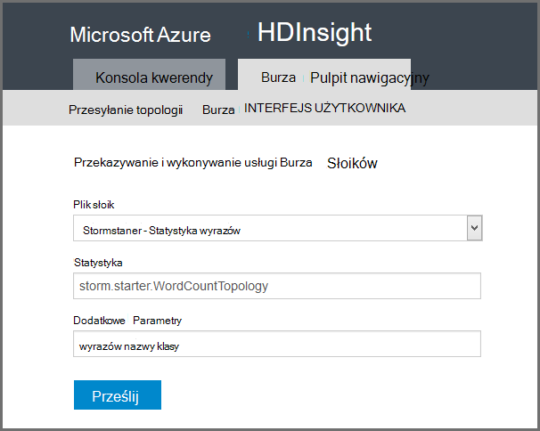

<properties
    pageTitle="Wprowadzenie do Burza Apache na HDInsight | Microsoft Azure"
    description="Wprowadzenie do Burza Apache i Dowiedz się, jak używać Burza na HDInsight do tworzenia rozwiązań analizy danych w czasie rzeczywistym w chmurze."
    services="hdinsight"
    documentationCenter=""
    authors="Blackmist"
    manager="jhubbard"
    editor="cgronlun"
    tags="azure-portal"/>

<tags
   ms.service="hdinsight"
   ms.devlang="na"
   ms.topic="get-started-article"
   ms.tgt_pltfrm="na"
   ms.workload="big-data"
   ms.date="10/11/2016"
   ms.author="larryfr"/>

#Wprowadzenie do Burza Apache na HDInsight: w czasie rzeczywistym analizy Hadoop

Burza Apache na HDInsight umożliwia tworzenie rozwiązań analizy rozłożone, w czasie rzeczywistym w środowisku Azure za pomocą [Apache Hadoop](http://hadoop.apache.org).

##Co to jest Apache Burza?

Burza Apache jest systemem obliczeń rozłożone, odporność na uszkodzenia, Otwórz źródło, który pozwala na przetwarzanie danych w czasie rzeczywistym z Hadoop. Rozwiązania Burza oferuje również gwarantowanej przetwarzania danych, z możliwością ponownego odtworzenia danych, który nie został pomyślnie przetworzony po raz pierwszy.

##Dlaczego warto używać Burza na HDInsight?

Burza Apache na HDInsight to zarządzane klaster zintegrowane środowisko Azure. Zapewnia następujące kluczowe korzyści:

* Wykonuje jako usługa zarządzanych z SLA 99,9% czas pracy

* Za pomocą języka wyboru: zapewnia obsługę składników Burza napisanych w **Java**, **C#**i **Python**

    * Obsługuje języków programowania: więcej danych przy użyciu języka Java, a następnie procesu za pomocą C#
    
        > [AZURE.NOTE] C# topologii są obsługiwane tylko w klastrów HDInsight systemu Windows.

    * Tworzenie przy użyciu interfejsu Java **Trident** topologii burza, które obsługują "dokładnie po" przetwarzanie wiadomości, utrzymywanie "transakcji" magazynu danych i zestaw typowych operacji analizy strumieniu

* Zawiera wbudowane funkcje skali w górę i w dół skali: skalowanie klaster HDInsight, bez wpływu na uruchamianiu topologii Burza

* Integracja z innymi usługami Azure, łącznie z Centrum zdarzenia, wirtualną sieć Azure baza danych SQL, magazyn obiektów Blob i DocumentDB

    * Łączenie możliwości wielu klastrów HDInsight przy użyciu wirtualnej sieci Azure: tworzenie kanał analitycznych za pomocą usługi HDInsight, HBase lub Hadoop klastrów

Aby uzyskać listę firm, które używają Burza Apache rozwiązań ich analizy w czasie rzeczywistym zobacz [Burza Apache przy użyciu firmy](https://storm.apache.org/documentation/Powered-By.html).

Aby rozpocząć używanie burza, zobacz [Rozpoczynanie pracy z Burza na HDInsight][gettingstarted].

###Łatwość inicjowania obsługi administracyjnej

Umożliwia obsługę nowego Burza w klastrze HDInsight w minutach. Określ nazwę klaster, rozmiar, konta administratora i konta miejsca do magazynowania. Azure utworzy klastrze, włącznie z próbki topologii i zarządzanie sieci web pulpitu nawigacyjnego.

> [AZURE.NOTE] Umożliwia także obsługę klastrów Burza za pomocą [Interfejsu wiersza polecenia Azure](../xplat-cli-install.md) lub [Azure programu PowerShell](../powershell-install-configure.md).

W ciągu 15 minut przesyłanie żądania będzie zawierać klastrze Burza systemem, a gotowy do imienia planowanej analizy w czasie rzeczywistym.

###Łatwość użytkowania

__Systemem Linux oraz dla Burza dotyczących klastrów HDInsight__nawiązanie połączenia z klastrem przy użyciu SSH i używanie `storm` polecenie Uruchom i zarządzać nimi topologii. Ponadto można użyć Ambari monitorowanie usługi Burza i interfejsu użytkownika Burza do monitorowania i zarządzania uruchomionego topologii.

Aby uzyskać więcej informacji o pracy z systemem Linux Burza klastrów zobacz [Rozpoczynanie pracy z Burza Apache na podstawie Linux HDInsight](hdinsight-apache-storm-tutorial-get-started-linux.md).

__Burza dotyczących klastrów HDInsight systemu Windows dla__narzędzia HDInsight programu Visual Studio umożliwiają tworzenie C# i hybrydowego C#-topologii Java i wysłać je do swojego Burza w klastrze HDInsight.  

Usługa HDInsight Tools for Visual Studio również interfejs, który umożliwia monitorowania i zarządzania topologii Burza w klastrze.

Przykład tworzenia aplikacji Burza przy użyciu narzędzia HDInsight zobacz [topologii opracowywanie C# Burza narzędziami HDInsight programu Visual Studio](hdinsight-storm-develop-csharp-visual-studio-topology.md).

Aby uzyskać więcej informacji na temat narzędzia HDInsight programu Visual Studio zobacz [rozpocząć korzystanie z narzędzia HDInsight programu Visual Studio](../HDInsight/hdinsight-hadoop-visual-studio-tools-get-started.md).

Każdy Burza w klastrze HDInsight także oparte na sieci web Burza pulpitu nawigacyjnego umożliwiające przesyłanie, monitorowanie i zarządzanie topologii Burza uruchamiania w klastrze.

Aby uzyskać więcej informacji o korzystaniu z pulpitu nawigacyjnego burza, zobacz [rozmieszczanie i zarządzanie nimi topologii Burza Apache na HDInsight](hdinsight-storm-deploy-monitor-topology.md).

Burza na HDInsight umożliwia łatwe Integracja z koncentratorów zdarzenia Azure za pośrednictwem **Spout Centrum zdarzeń**. Najnowsza wersja tego składnika jest dostępna w [https://github.com/hdinsight/hdinsight-storm-examples/tree/master/lib/eventhubs](https://github.com/hdinsight/hdinsight-storm-examples/tree/master/lib/eventhubs). Aby uzyskać więcej informacji na temat korzystania z tego składnika zobacz następujące dokumenty.

* [Można opracowywać topologię C#, która używa koncentratory zdarzenia Azure](hdinsight-storm-develop-csharp-event-hub-topology.md)

* [Można opracowywać topologię Java, która używa koncentratory zdarzenia Azure](hdinsight-storm-develop-java-event-hub-topology.md)

###Niezawodność

Zawsze Burza Apache gwarantuje, że każdej wiadomości przychodzącej będzie w pełni przetwarzana, nawet wtedy, gdy analiza danych jest rozłożone setki węzły.

**Węzeł Nimbus** zawiera podobne funkcje do Hadoop JobTracker i przydziela zadania inne węzły w klastrze za pośrednictwem **Zookeeper**. Węzły zookeeper udostępnia można je zsynchronizować dla klaster i ułatwienia komunikacji między Nimbus i proces **opiekuna** w węzłach pracownika. Jeśli jeden węzeł przetwarzanie odbywa się w dół, węzeł Nimbus jest informowany i przypisuje zadań i skojarzonych z nim danych do innego węzła.

Domyślną konfigurację Burza Apache jest tylko jeden węzeł Nimbus. Burza na HDInsight uruchamia dwa węzły Nimbus. Jeśli węzeł podstawowego nie powiedzie się, klaster HDInsight przełączy się do pomocniczej węzeł podczas węzeł podstawowy jest odzyskać.

###Skala

Mimo że można określić liczbę węzłów w klastrze, podczas tworzenia, warto Zwiększ lub Zmniejsz klaster zgodnie z pracą. Wszystkich klastrów HDInsight umożliwiają zmienianie liczby węzłów w klastrze, nawet podczas przetwarzania danych.

> [AZURE.NOTE] Aby skorzystać z nowych węzłów dodać za pomocą opcji skalowania, będzie konieczne wyrównać topologii pracę przed została zwiększenie rozmiaru klaster.

###Pomoc techniczna

Burza na HDInsight zawiera pomoc techniczna 24-7 enterprise poziom. Burza na HDInsight zawiera również SLA 99,9%. Oznacza to, że możemy zagwarantować klaster że połączeniami zewnętrznymi 99,9% czasu.

##Typowe przypadki użycia analiz w czasie rzeczywistym

Poniżej przedstawiono kilka typowych scenariuszy, dla których można użyć Burza Apache na HDInsight. Aby uzyskać informacje dotyczące rzeczywistych scenariuszy przeczytaj [jak firmy używają Burza](https://storm.apache.org/documentation/Powered-By.html).

* Internet czynności (IoT)
* Wykrywanie oszustwa
* Analizy społecznościowych
* Wyodrębnianie, przekształcanie i ładowania (ETL)
* Monitorowanie sieci
* Wyszukiwanie
* Zaangażowania urządzeń przenośnych

##Sposób przetwarzania danych w HDInsight Burza?

Burza Apache uruchamia **topologii** zamiast zadań MapReduce, które mogą być znane z usługi HDInsight lub Hadoop. Burza w klastrze HDInsight zawiera dwa typy węzłów: głowy węzły uruchamianych węzły **Nimbus** i Pracownik, uruchamianych **kierownika**.

* **Nimbus**: podobne do JobTracker w Hadoop, jest odpowiedzialny za rozpowszechniania kodu klaster, przydzielanie zadań maszyn wirtualnych i monitorowanie błąd. Usługa HDInsight zawiera dwa węzły Nimbus, dlatego bez pojedynczego miejsca awarii Burza na HDInsight

* **Inspektor**: Inspektor dla każdego węzła pracownik jest odpowiedzialny za uruchamianie i zatrzymywanie **procesy** w węźle.

* **Proces podrzędny**: uruchamia podzbiór **topologii**. Bieżąca topologia jest rozkładany wiele procesów roboczych w grupie.

* **Topologia**: Określa wykres obliczeń, która przetwarza **strumienie** danych. W przeciwieństwie do zadań MapReduce topologii działać, dopóki nie je zatrzymać.

* **Strumień**: niezwiązany zbiór **krotki**. Strumienie są wytwarzane przez **spouts** i **śrub**i są one używane przez **śrub**.

* **Krotki**: listę nazwanych dynamicznie wpisywane wartości.

* **Spout**: Korzystanie z danych ze źródła danych i emituje jeden lub więcej **strumieni**.

    > [AZURE.NOTE] W większości przypadków danych jest do odczytu z kolejki, takich jak Kafka, kolejek Bus usługi Azure lub koncentratorów zdarzenia. Kolejka gwarantuje, że dane jest zachowywane w przypadku awarii.

* **Błyskawicy**: powoduje zużycie **strumienie**, przetwarza na **krotki**i mogą emitować **strumieni**. Tekst "Śruby" jest także odpowiedzialny za zapisywania danych do przechowywania zewnętrznych, takich jak kolejki, HDInsight, HBase, obiektów blob lub innych magazynu danych.

* **Apache Thrift**: ramy oprogramowania w zakresie rozwoju skalowalna usługi wielu języków. Umożliwia tworzenie usług, które działają między C++, Java, Python, PHP, dopiskiem, Erlang, Perl, Haskell, C#, kakao, JavaScript, Node.js, Smalltalk i innych języków.

    * **Nimbus** to usługa Thrift i **topologii** jest definicję Thrift, więc można opracowywać topologii za pomocą różnych języków programowania.

Aby uzyskać więcej informacji na temat składników burza, zobacz [Samouczek Burza] [ apachetutorial] na apache.org.

##Jakich języków programowania można używać?

Burza w klastrze HDInsight zapewnia obsługę C#, Java i Python.

### C & #35;

Narzędzia HDInsight programu Visual Studio umożliwiają projektantom .NET do projektowania i implementacji topologii języka C#. Można także tworzyć topologii hybrydowe, które używają składników Java i C#.

Aby uzyskać więcej informacji zobacz [topologii opracowywanie C# dla Burza Apache na HDInsight przy użyciu programu Visual Studio](hdinsight-storm-develop-csharp-visual-studio-topology.md).

###Java

Większość przykładów Java, które wystąpić będzie zwykły Java lub Trident. Trident jest abstrakcji wysokiego poziomu, co ułatwi do wykonywania operacji, takich jak sprzężenia, agregacji, grupowania i filtrowania. Jednak Trident działa na partie krotki, dlatego nieprzetworzonych rozwiązanie Java przetwarza krotki jednego strumienia naraz.

Aby uzyskać więcej informacji na temat Trident zobacz [Samouczek Trident](https://storm.apache.org/documentation/Trident-tutorial.html) u apache.org.

Przykłady Java i Trident topologii zobacz [listę topologii Burza przykład](hdinsight-storm-example-topology.md) lub przykłady Burza starter w klastrze HDInsight.

Przykłady starter Burza znajdują się w katalogu __/usr/hdp/current/storm-client/contrib/storm-starter__ na podstawie Linux klastrów i katalogu **%storm_home%\contrib\storm-starter** klastrów opartych na systemie Windows.

##Jakie są niektóre typowe wzorce rozwoju?

###Przetwarzanie wiadomości

Burza zapewnia różne poziomy przetwarzania wiadomości. Na przykład podstawowe aplikacji Burza gwarantuje przetwarzanie najmniej jednocześnie i gwarantuje można Trident — po zakończeniu przetwarzania.

Aby uzyskać więcej informacji zobacz [gwarancje dotyczące przetwarzania danych](https://storm.apache.org/about/guarantees-data-processing.html) w apache.org.

###IBasicBolt

Wzór czytania wprowadzania krotki wysyłających zero lub więcej krotki, a następnie acking wprowadzania krotki bezpośrednio na końcu metoda execute jest często, a burza oferuje interfejs [IBasicBolt](https://storm.apache.org/apidocs/backtype/storm/topology/IBasicBolt.html) , aby zautomatyzować tego wzorca.

###Sprzężenia

Dołączanie dwoma strumieniami danych różnią się między aplikacjami. Na przykład można dołączyć do każdej krotki z wielu strumieni do jednego nowego strumienia lub można dołączyć tylko partie krotki dla określonego okna. Obie te metody dołączania można wykonywać przy użyciu [fieldsGrouping](http://javadox.com/org.apache.storm/storm-core/0.9.1-incubating/backtype/storm/topology/InputDeclarer.html#fieldsGrouping%28java.lang.String,%20backtype.storm.tuple.Fields%29), która jest sposób określania rozsyłania krotki tekst "Śruby".

W poniższym przykładzie Java fieldsGrouping służy do kierowania krotki, że pochodzą z składniki "1", "2" i "3" na śruby **MyJoiner** .

    builder.setBolt("join", new MyJoiner(), parallelism) .fieldsGrouping("1", new Fields("joinfield1", "joinfield2")) .fieldsGrouping("2", new Fields("joinfield1", "joinfield2")) .fieldsGrouping("3", new Fields("joinfield1", "joinfield2"));

###Tworzeniu partii

Tworzeniu partii można zrealizować na kilka sposobów. Przy podstawowe topologii Java Burza może przed ich wysyłających za pomocą prostego licznika partii X liczby krotki lub użyj mechanizm wewnętrzny chronometraż znana pod nazwą "krotki osi" na emitowanie partię co X sekund.

Przykład użycia krotki osi zobacz [Analizowanie danych czujnik z Burza i HBase na HDInsight](hdinsight-storm-sensor-data-analysis.md).

Jeśli używasz Trident opiera się na przetwarzanie partii krotki.

###Pamięci podręcznej

Często używane w pamięci, pamięci podręcznej, mechanizm przyspieszenia przetwarzania, ponieważ zachowuje często używane składniki majątku w pamięci. Ponieważ topologii jest dostarczany przez wiele węzłów i wielu procesów w każdym węźle, należy rozważyć użycie [fieldsGrouping](http://javadox.com/org.apache.storm/storm-core/0.9.1-incubating/backtype/storm/topology/InputDeclarer.html#fieldsGrouping%28java.lang.String,%20backtype.storm.tuple.Fields%29) aby upewnić się, że krotki zawierającą pola, które są używane do wyszukiwania pamięci podręcznej zawsze są kierowane do tego samego procesu. Duplikowanie wpisy w pamięci podręcznej pozwala uniknąć wielu procesów.

###Przesyłanie strumieniowe góry N

Gdy topologii zależy od tego, obliczania wartości "pierwszych N", takie jak górny trendów 5 w serwisie Twitter, należy obliczyć wartość górnej N równolegle i następnie scalić wyniki tych obliczeń globalną wartość. Można to zrobić, używając [fieldsGrouping](http://javadox.com/org.apache.storm/storm-core/0.9.1-incubating/backtype/storm/topology/InputDeclarer.html#fieldsGrouping%28java.lang.String,%20backtype.storm.tuple.Fields%29) trasę pola równoległe tekst "Śruby", (które partycje dane według wartości pola), a następnie trasy do beli globalnie określające wartość górnej N.

Aby na przykład Zobacz przykład [RollingTopWords](https://github.com/nathanmarz/storm-starter/blob/master/src/jvm/storm/starter/RollingTopWords.java) .

##Jakiego rodzaju rejestrowanie Burza Użyj?

Burza używa Apache Log4j rejestrowanie informacji. Domyślnie jest rejestrowany dużych ilości danych, a może być trudne do sortowania za pomocą informacji. Możesz umieścić pliku konfiguracji rejestrowania jako część topologii Burza do kontrolki sposób rejestrowania.

Dla topologii przykład, którego dowiesz się, jak skonfigurować rejestrowanie, zobacz przykład [opartego na języku Java WordCount](hdinsight-storm-develop-java-topology.md) dla Burza na HDInsight.

##Następne kroki

Dowiedz się więcej na temat analizy w czasie rzeczywistym rozwiązaniami Burza Apache w HDInsight:

* [Wprowadzenie do programu Burza na HDInsight][gettingstarted]

* [Przykład topologii dla Burza na HDInsight](hdinsight-storm-example-topology.md)

[stormtrident]: https://storm.apache.org/documentation/Trident-API-Overview.html
[samoa]: http://yahooeng.tumblr.com/post/65453012905/introducing-samoa-an-open-source-platform-for-mining
[apachetutorial]: https://storm.apache.org/documentation/Tutorial.html
[gettingstarted]: hdinsight-apache-storm-tutorial-get-started-linux.md
