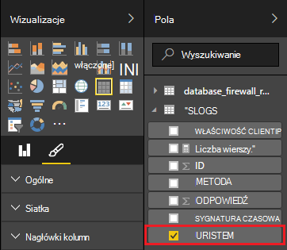

<properties
 pageTitle="Dzięki usłudze Power BI za pomocą Burza Apache | Microsoft Azure"
 description="Tworzenie raportu programu Power BI przy użyciu danych z topologii C# uruchamiania w klastrze Burza Apache w HDInsight."
 services="hdinsight"
 documentationCenter=""
 authors="Blackmist"
 manager="jhubbard"
 editor="cgronlun"
    tags="azure-portal"/>

<tags
 ms.service="hdinsight"
 ms.devlang="dotnet"
 ms.topic="article"
 ms.tgt_pltfrm="na"
 ms.workload="big-data"
 ms.date="10/27/2016"
 ms.author="larryfr"/>

# Dane z topologii Burza Apache za pomocą usługi Power BI

Power BI pozwala wizualnie wyświetlać dane jako raportów. Korzystanie z szablonów programu Visual Studio dla Burza na HDInsight, można łatwo korzystania ze sklepu danych z topologii występowania na Burza Apache w klastrze HDInsight platformy SQL Azure i następnie wizualizowanie danych za pomocą usługi Power BI.

W tym dokumencie dowiesz się, jak utworzyć raport z danych generowane przez topologii Burza Apache i przechowywane w bazie danych SQL Azure za pomocą usługi Power BI.

> [AZURE.NOTE] Podczas czynności opisane w tym dokumencie korzystania z systemu Windows środowiska Visual Studio, skompilowany projektu można wysłać do klastrów Linux lub HDInsight systemu Windows. Systemem Linux klastrów tworzone tylko po pomocy technicznej 2016-10-28 SCP.NET topologii.
>
> Aby użyć topologii C# z systemem Linux klaster, możesz zaktualizować pakiet Microsoft.SCP.Net.SDK NuGet używanych w danym projekcie do wersji 0.10.0.6 lub nowszej. Wersja pakietu musi się zgadzać wersji głównej Burza zainstalowanym HDInsight. Na przykład Burza w wersjach HDInsight 3.3 i 3.4 użyć wersji Burza 0.10.x podczas burzy korzysta z usługi HDInsight 3.5 1.0.x.
> 
> C# topologii na podstawie Linux klastrów należy użyć 4,5 .NET i używać jedno do uruchamiania w klastrze HDInsight. Większość poleceń będzie działać, jednak należy sprawdzić dokument [Zgodności jedno](http://www.mono-project.com/docs/about-mono/compatibility/) pod kątem potencjalnych niezgodności.
>
> Dla wersji języka Java tego projektu, które będą również działać w klastrze systemem Linux lub systemem Windows, zobacz [zdarzenia procesu z Azure koncentratory wydarzenia z Burza na HDInsight (Java)](hdinsight-storm-develop-java-event-hub-topology.md).

## Wymagania wstępne

- Subskrypcję usługi Azure. Zobacz [Azure pobrać bezpłatną wersję próbną](https://azure.microsoft.com/documentation/videos/get-azure-free-trial-for-testing-hadoop-in-hdinsight/).

* Użytkownik usługi Azure Active Directory z dostępem do [Usługi Power BI](https://powerbi.com)

* Program Visual Studio (jeden z następujących wersji)

    * Program Visual Studio 2012 w przypadku [aktualizacji 4](http://www.microsoft.com/download/details.aspx?id=39305)

    * Visual Studio 2013 [Aktualizacja 4](http://www.microsoft.com/download/details.aspx?id=44921) lub [Program Visual Studio 2013 społeczności](http://go.microsoft.com/fwlink/?linkid=517284&clcid=0x409)

    * [Visual Studio 2015 r.](https://www.visualstudio.com/downloads/download-visual-studio-vs.aspx)

* Narzędzia HDInsight programu Visual Studio: zobacz [Wprowadzenie do korzystania z usługi HDInsight narzędzi programu Visual Studio](../HDInsight/hdinsight-hadoop-visual-studio-tools-get-started.md) uzyskać informacji na temat informacje o instalacji.

## Jak to działa

W tym przykładzie zawiera topologii C# Burza losowo generowany danych dziennika informacji usług internetowych. Następnie napisano te dane do bazy danych SQL, a stamtąd jest używana do generowania raportów w usłudze Power BI.

Oto lista plików, które implementowania głównym tego przykładu.

* **SqlAzureBolt.cs**: zapisuje informacje wyprodukowano w topologii Burza do bazy danych SQL.

* **IISLogsTable.sql**: służy do generowania bazy danych znajduje się w instrukcji Transact-SQL.

> [AZURE.WARNING] Przed rozpoczęciem topologii w klastrze HDInsight, musisz utworzyć tabelę w bazie danych SQL.

## Pobierz przykład

Pobierz [przykład HDInsight C# Burza Power BI](https://github.com/Azure-Samples/hdinsight-dotnet-storm-powerbi). Aby go pobrać, rozwidlenia i klonowanie, za pomocą [cyfra](http://git-scm.com/)albo Pobierz zip archiwum za pomocą łącze **Pobierz** .

## Tworzenie bazy danych

1. Wykonaj czynności podane w dokumencie [Samouczek bazy danych SQL](../sql-database/sql-database-get-started.md) , aby utworzyć nową bazę danych programu SQL.

2. Nawiązywanie połączenia z bazą danych, wykonując czynności opisane w dokumencie [Nawiązywanie połączenia z bazą danych SQL z programem Visual Studio](../sql-database/sql-database-connect-query.md) połączenia z bazą danych.

4. Kliknij prawym przyciskiem myszy w Eksploratorze obiektów bazy danych i tworzenie __Nowej kwerendy__. Wklej zawartość pliku __IISLogsTable.sql__ uwzględnione w projekcie pobrany okno kwerendy, a następnie użyj klawiszy Ctrl + Shift + E, aby wykonać kwerendę. Powinien zostać wyświetlony komunikat pomyślnie ukończono command(s).

    Po ukończeniu tej operacji będzie nowej tabeli o nazwie __IISLOGS__ w bazie danych.

## Konfigurowanie próbki

1. [Azure portal](https://portal.azure.com)zaznacz bazy danych SQL. W sekcji __Essentials__ karta bazy danych SQL zaznacz pole wyboru __Pokaż parametry połączenia bazy danych__. Na liście skopiować informacje z __ADO.NET (uwierzytelnianie SQL)__ .

1. Otwórz próbki w programie Visual Studio. Korzystając z **Eksploratora rozwiązań**Otwórz plik **App.config** , a następnie znajdź następujący wpis:

        <add key="SqlAzureConnectionString" value="##TOBEFILLED##" />
    
    Zamień wartość __## TOBEFILLED ##__ przy użyciu parametrów połączenia bazy danych, które są kopiowane w poprzednim kroku. Zamienianie __{usługi\_username}__ i __{usługi\_hasło}__ przy użyciu nazwy użytkownika i hasła bazy danych.

2. Zapisz i zamknij pliki.

## Wdrażanie próbki

1. **Eksplorator rozwiązań**kliknij prawym przyciskiem myszy projektu **StormToSQL** i wybierz polecenie **Prześlij, aby Burza na HDInsight**. Wybierz klaster HDInsight w oknie dialogowym Lista rozwijana **Burza klaster** .

    > [AZURE.NOTE] Może potrwać kilka sekund dla listy rozwijanej **Klaster Burza** wypełniania nazwy serwerów.
    >
    > Jeśli zostanie wyświetlony monit, wprowadź poświadczenia logowania dla subskrypcji Azure. Jeśli masz więcej niż jedną subskrypcję, zaloguj się do szablonu, który zawiera usługi Burza w klastrze HDInsight.

2. Po pomyślnym przesłaniu topologii topologii Burza dla klaster powinien być wyświetlany. Wybierz pozycję SqlAzureWriterTopology z listy, aby wyświetlić informacje o topologii uruchomionego.

    

    Ten widok umożliwia informacje o topologii lub kliknij dwukrotnie zapisów (na przykład SqlAzureBolt), aby wyświetlić informacje dotyczące składnik w topologii.

3. Po topologii uruchomiono przez kilka minut, wróć do okna kwerendy SQL, które zostało użyte do utworzenia bazy danych. Zamień istniejące instrukcje z następujących czynności.

        select * from iislogs;
    
    Użyj klawisza Ctrl + Shift + E, aby wykonać kwerendę, a powinien otrzymać wyniki podobne do następujących.
    
        1   2016-05-27 17:57:14.797 255.255.255.255 /bar    GET 200
        2   2016-05-27 17:57:14.843 127.0.0.1   /spam/eggs  POST    500
        3   2016-05-27 17:57:14.850 123.123.123.123 /eggs   DELETE  200
        4   2016-05-27 17:57:14.853 127.0.0.1   /foo    POST    404
        5   2016-05-27 17:57:14.853 10.9.8.7    /bar    GET 200
        6   2016-05-27 17:57:14.857 192.168.1.1 /spam   DELETE  200

    To dane, które zostały zapisane z topologii Burza.

## Tworzenie raportu

1. Nawiązywanie połączenia z [bazą danych SQL Azure łącznik](https://app.powerbi.com/getdata/bigdata/azure-sql-database-with-live-connect) usługi Power BI.

2. W __bazach danych__wybierz pozycję __Pobierz__.

3. Wybieranie __Bazy danych SQL Azure__, a następnie zaznacz pole wyboru __Połącz__.

4. Wprowadź informacje, aby nawiązać połączenie z bazą danych SQL Azure. Możesz znaleźć to odwiedzania [Azure portal](https://portal.azure.com) i wybierając bazy danych SQL.

    > [AZURE.NOTE] Można także ustawić interwał odświeżania i niestandardowe filtry przy użyciu __Włączyć opcje zaawansowane__ w oknie dialogowym Łączenie.

5. Po nawiązaniu połączenia zostanie wyświetlony nowy zestaw danych o takiej samej nazwie jako bazę danych, z którą masz połączenie. Wybierz zestaw danych, aby rozpocząć projektowania raportu.

3. Z __pola__rozwiń pozycję __IISLOGS__ . Zaznacz pole wyboru dla __URISTEM__. Spowoduje to utworzenie nowego raportu zawierającego łodyg identyfikator URI (-foo, / pasku itp.) rejestrowane w bazie danych.

    

5. Następnie przeciągnij __metody__ do raportu. Raport zostanie zaktualizowany listy łodygi i odpowiedniej metody HTTP używana do żądania HTTP.

    

4. W kolumnie __wizualizacje__ wybierz ikonę __pola__ , a następnie wybierz strzałkę w dół obok __metody__ w sekcji __wartości__ . Z wyświetlonej listy wybierz pozycję __liczność__. Spowoduje to zmianę raport, aby liście liczba ile razy dostęp do określonego identyfikatora URI.

    

6. Następnie wybierz pozycję __skumulowany wykres kolumnowy__ , aby zmienić sposób wyświetlania danych.

    

7. Po utworzeniu raportu w jaki sposób chcesz go za pomocą wpisu __Zapisz__ w menu wprowadź nazwę, a następnie zapiszesz raport.

## Zatrzymywanie topologii

Topologia będzie nadal działać, dopóki nie możesz zatrzymać lub usunąć Burza w klastrze HDInsight. Wykonaj poniższe czynności, aby zatrzymać topologii.

1. W programie Visual Studio wróć do podglądu topologii i wybierz topologię.

2. Wybierz przycisk **skasować** , aby zatrzymać topologii.

    

## Usuwanie klaster

[AZURE.INCLUDE [delete-cluster-warning](../../includes/hdinsight-delete-cluster-warning.md)]

## Następne kroki

W tym dokumencie wiesz, jak wysyłać dane z topologii Burza do bazy danych SQL, a następnie wizualizowanie danych za pomocą usługi Power BI. Aby uzyskać informacje na temat pracy z innymi technologiami Azure za pomocą Burza na HDInsight zobacz:

* [Przykład topologii dla Burza na HDInsight](hdinsight-storm-example-topology.md)
