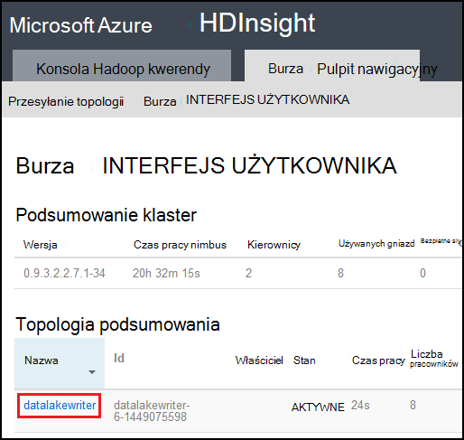

<properties
pageTitle="Użyj Azure danych Lake Sklepu przy użyciu Burza Apache na usługa Azure HDInsight"
description="Dowiedz się, jak zapisać dane magazynu Lake Azure danych z topologii Burza Apache na HDInsight. Ten dokument i skojarzone przykładzie pokazano, jak składnik HdfsBolt można zapisać do magazynu Lake danych."
services="hdinsight"
documentationCenter="na"
authors="Blackmist"
manager="jhubbard"
editor="cgronlun"/>

<tags
ms.service="hdinsight"
ms.devlang="na"
ms.topic="article"
ms.tgt_pltfrm="na"
ms.workload="big-data"
ms.date="09/06/2016"
ms.author="larryfr"/>

#Użyj Azure danych Lake Sklepu przy użyciu Burza Apache z usługi HDInsight

Magazyn Lake danych Azure jest HDFS zgodne przestrzeni dyskowej usługi w chmurze zawierającego wysokiej wydajności, dostępność wytrzymałości i niezawodności dla określonego typu danych. W tym dokumencie dowiesz sposobu używania topologii opartego na języku Java Burza zapisać danych do magazynu Lake danych Azure za pomocą składnika [HdfsBolt](http://storm.apache.org/javadoc/apidocs/org/apache/storm/hdfs/bolt/HdfsBolt.html) , która jest dostępna w ramach Burza Apache.

> [AZURE.IMPORTANT] Topologia przykładowe używane w tym dokumencie zależy od składników, które są dołączone Burza dotyczących klastrów HDInsight i mogą wymagać modyfikacji do pracy z magazynu Lake danych Azure użycia z innych klastrów Burza Apache.

##Wymagania wstępne

* [Java JDK 1.7](https://www.oracle.com/technetwork/java/javase/downloads/jdk7-downloads-1880260.html) lub nowszy
* [Środowiska maven 3.x](https://maven.apache.org/download.cgi)
* Subskrypcję usługi Azure
* Burza w wersji klaster HDInsight 3,2. Aby utworzyć nowy Burza w klastrze HDInsight, wykonaj czynności podane w dokumencie [za pomocą usługi HDInsight z magazynu Lake danych przy użyciu Azure](../data-lake-store/data-lake-store-hdinsight-hadoop-use-portal.md) . Kroki opisane w tym dokumencie przeprowadzi Cię przez proces tworzenia nowego klaster HDInsight i magazynu Lake danych Azure.  

    > [AZURE.IMPORTANT] Po utworzeniu klaster HDInsight po zaznaczeniu __Burza__ jako typ klaster i __3,2__ w tej wersji. System operacyjny może być systemu Windows i Linux oraz.  

###Konfigurowanie środowiska zmienne

Następujące zmienne środowiska może być ustawiona po zainstalowaniu Java i JDK w miejscu pracy rozwoju. Jednak należy sprawdzić, czy istnieją i zawierają poprawne wartości dla systemu.

* __JAVA_HOME__ — powinny wskazywać katalogu, w którym zainstalowano środowiska wykonawczego języka Java (JRE). Na przykład w rozkładzie Unix lub Linux powinien mieć wartość podobne do `/usr/lib/jvm/java-7-oracle`. W systemie Windows może zawierać podobne do wartość `c:\Program Files (x86)\Java\jre1.7`.

* __ŚCIEŻKA__ - powinien zawierać następujące ścieżki:

    * __JAVA\_dla użytkowników domowych__ (lub ścieżkę równoważne)
    
    * __JAVA\_HOME\bin__ (lub ścieżkę równoważne)
    
    * Katalogu, w którym zainstalowano środowiska Maven

##Implementacja topologii

Przykład używanego w dokumencie jest napisany w języku Java i korzysta z następujących składników:

* __TickSpout__: generuje dane używane przez inne składniki w topologii.

* __PartialCount__: zlicza zdarzeń generowanych przez TickSpout.

* __FinalCount__: agregacje zliczania danych z PartialCount.

* __ADLStoreBolt__: zapisuje dane do magazynu Lake danych Azure za pomocą składnika [HdfsBolt](http://storm.apache.org/javadoc/apidocs/org/apache/storm/hdfs/bolt/HdfsBolt.html) .

Projekt zawierający tej topologii jest dostępna do pobrania z [https://github.com/Azure-Samples/hdinsight-storm-azure-data-lake-store](https://github.com/Azure-Samples/hdinsight-storm-azure-data-lake-store).

###Opis ADLStoreBolt

ADLStoreBolt jest to nazwa używana dla wystąpienia HdfsBolt w topologii, która zapisuje Lake danych Azure. Nie jest to specjalna wersja HdfsBolt utworzoną przez firmę Microsoft; jednak korzystają na wartości konfiguracji core witryny, a także składników Hadoop, które są dołączone Azure HDInsight do komunikacji z Lake danych.

W szczególności podczas tworzenia klaster HDInsight możesz skojarzyć go z magazynu Lake Azure danych. To zapisuje wpisy do witryn core sklepu Lake danych wybrano, które są używane przez składniki, takie jak hadoop klienta i usługi hadoop hdfs, aby umożliwić komunikację z magazynu Lake danych.

> [AZURE.NOTE] Microsoft jest użytkownikiem kod do Apache Hadoop i projektów burza, który umożliwia komunikację z magazynu Lake Azure danych i obiektów Blob platformy Azure, ale ta funkcja może nie być uwzględniane domyślnie w innych Hadoop i Burza dystrybucji.

Konfiguracja HdfsBolt w topologii jest w następujący sposób:

    // 1. Create sync and rotation policies to control when data is synched
    //    (written) to the file system and when to roll over into a new file.
    SyncPolicy syncPolicy = new CountSyncPolicy(1000);
    FileRotationPolicy rotationPolicy = new FileSizeRotationPolicy(0.5f, Units.KB);
    // 2. Set the format. In this case, comma delimited
    RecordFormat recordFormat = new DelimitedRecordFormat().withFieldDelimiter(",");
    // 3. Set the directory name. In this case, '/stormdata/'
    FileNameFormat fileNameFormat = new DefaultFileNameFormat().withPath("/stormdata/");
    // 4. Create the bolt using the previously created settings,
    //    and also tell it the base URL to your Data Lake Store.
    // NOTE! Replace 'MYDATALAKE' below with the name of your data lake store.
    HdfsBolt adlsBolt = new HdfsBolt()
        .withFsUrl("adl://MYDATALAKE.azuredatalakestore.net/")
        .withRecordFormat(recordFormat)
        .withFileNameFormat(fileNameFormat)
        .withRotationPolicy(rotationPolicy)
        .withSyncPolicy(syncPolicy);
    // 4. Give it a name and wire it up to the bolt it accepts data
    //    from. NOTE: The name used here is also used as part of the
    //    file name for the files written to Data Lake Store.
    builder.setBolt("ADLStoreBolt", adlsBolt, 1)
      .globalGrouping("finalcount");
      
Jeśli znasz przy użyciu HdfsBolt, można zauważyć, czy jest dosyć standardowej konfiguracji wszystkich z wyjątkiem adresu URL. Adres URL określa ścieżkę do katalogu głównego sklepu Lake Azure danych.

Zapisywanie do magazynu Lake danych używa HdfsBolt i tylko w przypadku zmiany adresu URL, powinno być możliwe podjąć wszelkie istniejące topologię, która zapisuje HDFS lub WASB przy użyciu HdfsBolt i go używać magazynu Lake danych Azure łatwo zmienić.

##Tworzenie i pakowanie topologii

1. Pobierz przykład projektu z [https://github.com/Azure-Samples/hdinsight-storm-azure-data-lake-store](https://github.com/Azure-Samples/hdinsight-storm-azure-data-lake-store
) do środowiska programowania.

2. Otwórz `StormToDataLake\src\main\java\com\microsoft\example\StormToDataLakeStore.java` plik w edytorze i znajdź wiersz zawierający `.withFsUrl("adl://MYDATALAKE.azuredatalakestore.net/")`. Zmiany __MYDATALAKE__ nazwy magazynu Lake danych Azure używany podczas tworzenia serwera HDInsight.

3. Polecenia monit, terminal lub sesję powłoki zmiana katalogu głównego pobrany projektu, a uruchom następujące polecenia do tworzenia i pakowanie topologii.

        mvn compile
        mvn package
    
    Po wykonaniu kompilacji i opakowania będzie nowego katalogu o nazwie `target`, który zawiera plik o nazwie `StormToDataLakeStore-1.0-SNAPSHOT.jar`. Ta strona zawiera skompilowany topologii.

##Wdrażanie i uruchamianie na podstawie Linux HDInsight

Jeśli utworzono z systemem Linux Burza w klastrze HDInsight umożliwia poniższe kroki wdrażanie i uruchamianie topologii.

1. Użyj następującego polecenia, aby skopiować topologii do klastrów HDInsight. Zamień nazwę użytkownika SSH użytą podczas tworzenia klaster __użytkownika__ . Zamień __NAZWAKLASTRA__ nazwę grupie.

        scp target\StormToDataLakeStore-1.0-SNAPSHOT.jar USER@CLUSTERNAME-ssh.azurehdinsight.net:StormToDataLakeStore-1.0-SNAPSHOT.jar
    
    Gdy zostanie wyświetlony monit, wprowadź hasło używane podczas tworzenia użytkownika SSH klaster. Jeśli został użyty klucz publiczny zamiast hasła, może być konieczne używanie `-i` parametr Określ ścieżkę do odpowiadającego mu klucz prywatny.
    
    > [AZURE.NOTE] Jeśli korzystasz z systemu Windows klienta rozwoju, być może nie masz `scp` polecenia. Jeśli tak, możesz użyć `pscp`, który jest dostępny w [http://www.chiark.greenend.org.uk/~sgtatham/putty/download.html](http://www.chiark.greenend.org.uk/~sgtatham/putty/download.html).

2. Po zakończeniu przekazywania, połącz się z klastrem HDInsight przy użyciu SSH należy wykonać następujące kroki. Zamień nazwę użytkownika SSH użytą podczas tworzenia klaster __użytkownika__ . Zamień __NAZWAKLASTRA__ nazwę grupie.

        ssh USER@CLUSTERNAME-ssh.azurehdinsight.net

    Gdy zostanie wyświetlony monit, wprowadź hasło używane podczas tworzenia użytkownika SSH klaster. Jeśli został użyty klucz publiczny zamiast hasła, może być konieczne używanie `-i` parametr Określ ścieżkę do odpowiadającego mu klucz prywatny.
    
    > [AZURE.NOTE] Jeśli korzystasz z systemu Windows klienta rozwoju, wykonaj informacje w [Nawiązywanie połączenia z systemem Linux HDInsight z SSH z systemu Windows](hdinsight-hadoop-linux-use-ssh-windows.md) , aby uzyskać informacje na nawiązywanie połączenia z klastrem za pomocą Kit klienta.
    
3. Po połączeniu, uruchom topologii należy wykonać następujące kroki:

        storm jar StormToDataLakeStore-1.0-SNAPSHOT.jar com.microsoft.example.StormToDataLakeStore datalakewriter
    
    Rozpoczyna się topologii od przyjazną nazwę `datalakewriter`.

##Wdrażanie i uruchamianie na HDInsight systemu Windows

1. Otwórz przeglądarkę sieci web i przejdź do HTTPS://CLUSTERNAME.azurehdinsight.net, gdzie __NAZWAKLASTRA__ to nazwa klaster HDInsight. Po wyświetleniu monitu wprowadź nazwę użytkownika administratora (`admin`) i hasło, którego należy użyć dla tego konta podczas tworzenia klaster.

2. Na pulpicie nawigacyjnym Burza z listy rozwijanej __Jar pliku__ wybierz pozycję __Przeglądaj__ , a następnie wybierz plik StormToDataLakeStore-1.0-SNAPSHOT.jar z `target` katalogu. Dla pozostałych wpisów w formularzu, należy użyć następujących wartości:

    * Nazwa klasy: com.microsoft.example.StormToDataLakeStore
    * Dodatkowe parametry: datalakewriter
    
    

3. Wybierz przycisk __Zatwierdź__ , aby przekazać i rozpocząć topologii. Po rozpoczęciu topologii polu wynik poniżej przycisku __Zatwierdź__ powinien być wyświetlany informacje podobne do następujących czynności:

        Process exit code: 0
        Currently running topologies:
        Topology_name        Status     Num_tasks  Num_workers  Uptime_secs
        -------------------------------------------------------------------
        datalakewriter       ACTIVE     68         8            10        

##Widok danych wyjściowych

Istnieje kilka sposobów, aby wyświetlić dane. W tej sekcji firma Microsoft korzysta z Azure Portal i `hdfs` polecenie, aby wyświetlić dane.

> [AZURE.NOTE] Zezwól na topologii uruchomienie kilka minut przed sprawdzeniem dane wyjściowe, tak aby danych ma zostały zsynchronizowane do kilku plików Azure danych Lake magazynu.

* __ [Azure Portal](https://portal.azure.com)__: W portalu, wybierz żądany sklep Lake danych Azure używane z usługi HDInsight.

    > [AZURE.NOTE] Jeśli nie przypiąć magazynu Lake danych do pulpitu nawigacyjnego portal Azure, możesz znaleźć go __Przeglądanie__ u dołu listy po lewej stronie, a następnie __Magazynu Lake danych__, a na koniec zaznaczając magazynie.
    
    Ikony u góry magazynu Lake danych zaznacz __Eksplorator danych__.
    
    
    
    Następnie wybierz __stormdata__ folder. Ma być wyświetlana lista plików tekstowych.
    
    
    
    Wybierz jeden z tych plików, aby wyświetlić jego zawartość.

* __W grupie__: Jeśli połączono z klastrem HDInsight przy użyciu SSH (Linux klaster) lub pulpitu zdalnego (klaster systemu Windows), można użyć następujących do wyświetlania danych. Zamień __DATALAKE__ nazwę Sklepu Lake danych

        hdfs dfs -cat adl://DATALAKE.azuredatalakestore.net/stormdata/*.txt

    Spowoduje to ZŁĄCZ.teksty pliki tekstowe, przechowywane w katalogu i Wyświetl informacje o podobny do następującego:
    
        406000000
        407000000
        408000000
        409000000
        410000000
        411000000
        412000000
        413000000
        414000000
        415000000
        
##Zatrzymywanie topologii

Topologii Burza spowoduje uruchomienie do momentu zatrzymania lub klaster zostanie usunięty. Aby zatrzymać topologii, korzystając z następujących informacji.

__Na podstawie Linux HDInsight__:

Z sesji SSH z klastrem Użyj następującego polecenia:

    storm kill datalakewriter

__Dla usługi HDInsight systemu Windows__:

1. Z Burza pulpitu nawigacyjnego (https://CLUSTERNAME.azurehdinsight.net) kliknij łącze __Burza interfejsu użytkownika__ w górnej części strony.

2. Po załadowaniu Burza interfejsu użytkownika, kliknij łącze __datalakewriter__ .

    

3. W sekcji __Akcje topologii__ wybierz __skasować__ , a następnie wybierz przycisk OK w oknie dialogowym, które zostanie wyświetlone.

    

## Usuwanie klaster

[AZURE.INCLUDE [delete-cluster-warning](../../includes/hdinsight-delete-cluster-warning.md)]

##Następne kroki

Teraz, gdy znasz sposobu używania Burza do zapisu magazynu Lake danych Azure, Poznaj inne [Przykłady Burza HDInsight](hdinsight-storm-example-topology.md).
