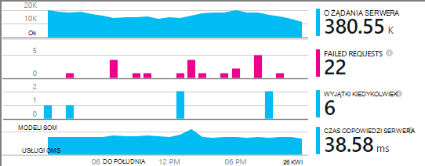

<properties
    pageTitle="Przykład MyDriving Azure IoT: jego tworzenia | Microsoft Azure"
    description="Tworzenie aplikacji, która jest pełna pokaz zaprojektować IoT system przy użyciu programu Microsoft Azure, w tym analizy strumieniu, nauki komputera i koncentratory wydarzenie."
    services=""
    documentationCenter=".net"
    suite=""
    authors="harikmenon"
    manager="douge"/>

<tags
    ms.service="multiple"
    ms.workload="tbd"
    ms.tgt_pltfrm="ibiza"
    ms.devlang="dotnet"
    ms.topic="article"
    ms.date="03/25/2016"
    ms.author="harikm"/>


# <a name="build-and-deploy-the-mydriving-solution-to-your-environment"></a>Tworzenie i wdrażanie rozwiązania MyDriving w środowisku

MyDriving to rozwiązanie Internet czynności (IoT) zbiera dane z samochód, przetwarza je przy użyciu komputera szkoleniowe i prezentuje je na telefon komórkowy. Wewnętrzna składa się z wielu usług firmy Microsoft Azure. Klienci mogą być telefonów z systemem Android, iOS lub systemu Windows 10.

Możemy utworzyć rozwiązanie MyDriving, aby zapewnić sobie szybkiego rozpoczęcia tworzenia podczas tworzenia systemu IoT. W [repozytorium MyDriving w GitHub](https://github.com/Azure-Samples/MyDriving)można uzyskać skrypty Menedżera zasobów Azure wdrożenia architektura wewnętrznej do Azure konta. Od tej chwili możesz skonfigurowanie różnych usług, modyfikowanie kwerendy do potrzeb własnych danych i tak dalej. Znajdują się te skrypty — a także kod dla aplikacji dla urządzeń przenośnych, Azure interfejs API usługi aplikacji programu project i nie tylko — w repozytorium MyDriving.

Jeśli aplikacji nie był jeszcze, spójrz na [Uzyskiwanie przewodnik wprowadzenie](iot-solution-get-started.md).

Istnieje szczegółowe zestawienie architektura [MyDriving przewodnik](http://aka.ms/mydrivingdocs). Podsumowując istnieje kilka części, które skonfigurować i że należy ustawić maksymalnie tworzenie podobne projektu:

* **Aplikacja klienta** działa na telefonów z systemem Android, iOS i systemu Windows 10. Firma Microsoft korzysta z platformy Xamarin duża część kod, który jest przechowywany w GitHub w obszarze udostępnianie `src/MobileApp`. Aplikacja faktycznie wykonuje dwie funkcje różnią się:
 * Przekazuje je telemetrycznego z urządzenia płycie Diagnostyka oraz z własnej usługi lokalizacji w celu przechodzenia wstecz w chmurze systemu.
 * Jest to interfejs użytkownika miejsce, w którym użytkownicy mogą wykonywać kwerendy o ich podróży zarejestrowanych drogi.
* **Usługa w chmurze** ingests podróży drogi dane w czasie rzeczywistym i przetwarza je. Głównym pracy tworzenia tej usługi jest wybierz, definiowanie parametrów i szkielety różnych usług Azure w górę. Niektóre części wymagają skryptom filtr i proces przychodzących danych. Aby skonfigurować wszystkie części firma Microsoft korzysta z szablonu Azure Menedżera zasobów.
* **Usługa mobilna aplikacji** jest usługi sieci web za część interfejsu użytkownika aplikacji urządzenia. Jego głównym zadaniem jest przechowywane, przetworzone danych w bazie danych. Jego kod jest na GitHub w obszarze `src/MobileAppService`.
* **Program Visual Studio z Xamarin** jest nasze środowisko projektowania. Xamarin, która istnieje składnik programu Visual Studio oraz w autonomicznej zintegrowane środowisko programistyczne (IDE), jest używany do tworzenia kod urządzenia między platformami. Aby utworzyć kod iOS, należy mieć wystąpienie Xamarin uruchomione na komputerze z systemem operacyjnym X. W razie potrzeby można uruchomić jako agenta programu Visual Studio.
* **Testowanie jednostek** aplikacji urządzenia odbywa się w chmurze Test Xamarin.
* **GitHub** to repozytorium, w którym przechowywane wszystkie kodu, skrypty i szablony.
* **Visual Studio Team Services** jest usługa w chmurze, która jest używana do zarządzania ciągły tworzenie i testowanie aplikacji sieci web usługi i urządzenia.
* **HockeyApp** jest używany do rozpowszechniania wersjach kod urządzenia. Zbiera również awarię i zastosowania raportów i opinii użytkowników.
* **Visual Studio aplikacji wniosków** monitoruje usługi sieci web urządzeń przenośnych.

Dlatego Zobaczmy, jak firma Microsoft skonfigurować to wszystko. Należy zauważyć, że wiele z tych kroków opcjonalne.

## <a name="sign-up-for-accounts"></a>Utwórz konto w przypadku kont

-   [Podstawowe informacje dotyczące deweloperów programu visual Studio](https://www.visualstudio.com/products/visual-studio-dev-essentials-vs.aspx). Ten bezpłatny program zapewnia łatwy dostęp do wielu narzędzi dla deweloperów i usług, w tym programu Visual Studio, Visual Studio Team Services i Azure. Udostępnia kredytowej 25 zł/miesiąca Azure 12 miesięcy. Zawiera także subskrypcje szkolenie Pluralsight i Xamarin dla studentów. Możesz również utworzyć konto oddzielnie dla bezpłatne poziomów [Azure](https://azure.com) i [Visual Studio Team Services](https://www.visualstudio.com/products/visual-studio-team-services-vs.aspx), ale nie zostaną one Azure środków.

-   [HockeyApp](https://rink.hockeyapp.net/) (opcjonalnie), zarządzania test dystrybucja aplikacji dla urządzeń przenośnych i zbieranie danych telemetrycznych.

-   [Xamarin](https://xamarin.com/) (wymagane), do tworzenia aplikacji dla urządzeń przenośnych i uruchamiania debugowania zostanie uruchomiony i testy na [Chmurze Test Xamarin](https://xamarin.com/test-cloud).

-   [GitHub](https://github.com/Azure-Samples/MyDriving/) (opcjonalnie) utworzyć bezpłatne repozytoria publicznej własnego kodu (prywatne repozytoria zostały zapłacone). Alternatywnie można użyć podstawowe planu w Visual Studio Team Services dla repozytoria prywatne.

-   [Power BI](https://powerbi.microsoft.com/) (opcjonalnie), aby utworzyć zaawansowanych wizualizacji danych w ramach całego systemu.

> [AZURE.NOTE] Konto GitHub dostęp do kodu MyDriving w [repozytorium GitHub MyDriving](https://github.com/Azure-Samples/MyDriving)nie jest potrzebny.

## <a name="install-development-tools"></a>Instalowanie narzędzia programistyczne

Następujące ustawienia dotyczy opracowywania pełny rozwiązanie: iOS, Android i systemu Windows 10 Mobile aplikacji i platform, w tym z Azure wewnętrzna baza danych.

Alternatywnie, umożliwia Xamarin Studio w systemie Mac lub Windows opracowywania aplikacji dla urządzeń przenośnych, jeśli nie działają w Azure wewnętrzna baza danych.

Istnieje [dłuższy opis tego ustawienia](https://msdn.microsoft.com/library/mt613162.aspx).

### <a name="windows-development-machine"></a>Komputer rozwoju systemu Windows

Narzędzie centralnej w systemie Windows jest Visual Studio do pracy z aplikacji MyDriving dla systemu Android i systemu Windows, interfejs API usługi aplikacji programu project i rozszerzenia microservice.

Xamarin, cyfra emulatory i inne przydatne składniki zostały zintegrowane z programem Visual Studio.

Zainstaluj:

-   [Visual Studio 2015 z Xamarin](https://www.visualstudio.com/products/visual-studio-community-vs) (dowolna wersja — społeczności jest bezpłatne).

-   [SQLite platformy Windows uniwersalny](https://visualstudiogallery.msdn.microsoft.com/4913e7d5-96c9-4dde-a1a1-69820d615936). Wymagane do utworzenia kodu systemu Windows 10 Mobile.

-   [Azure zestaw SDK programu Visual Studio 2015 r](https://go.microsoft.com/fwlink/?linkid=518003&clcid=0x409). Otrzymujesz zestawu SDK uruchamiania aplikacji w Azure, wraz z wiersza polecenia narzędzia do zarządzania Azure.

-   [Usługa azure tkaninie SDK](http://www.microsoft.com/web/handlers/webpi.ashx?command=getinstallerredirect&appid=MicrosoftAzure-ServiceFabric). Wymagane do utworzenia rozszerzenia [microservice](../service-fabric/service-fabric-get-started.md) .

Upewnij się również, że masz prawo rozszerzenia programu Visual Studio. Sprawdź, czy w obszarze **Narzędzia**jest widoczny **Android, iOS, Xamarin...**. Jeśli nie, otwórz Panel sterowania, a następnie wybierz pozycję **Programy i funkcje** > **Microsoft** > **programu Visual Studio 2015** > **Modyfikuj**. W obszarze **wiele platform**, zaznacz **C\#/.Net (Xamarin)**. Stamtąd, sprawdź, czy jest zainstalowany **Cyfra dla systemu Windows** .

### <a name="mac-development-machine"></a>Mac rozwoju komputera

Mac (Yosemite lub nowsza) jest wymagana, aby opracować dla systemu iOS. Mimo że firma Microsoft za pomocą programu Visual Studio Xamarin w systemie Windows można opracowywać i zarządzanie nimi cały kod, Xamarin używa agenta zainstalowany na komputerze Mac, aby można było tworzyć i zaloguj kod iOS.


(Alternatywnym umożliwia Xamarin Studio bezpośrednio na komputerze Mac można opracowywać aplikacje między platformami.)

Jeśli nie chcesz uwzględniać iOS jako platformy docelowej nie jest konieczne Mac.

Zainstaluj:

-   [Xamarin Studio dla systemu iOS](https://developer.xamarin.com/guides/ios/getting_started/installation/mac/). Możesz również skonfigurować Visual Studio i Xamarin na komputerze Mac, uruchomionym maszyny wirtualnej systemu Windows. Zobacz [konfiguracji, instalowanie i weryfikacji użytkownicy komputerów Mac](https://msdn.microsoft.com/library/mt488770.aspx) w witrynie MSDN.

-   [Narzędzia programistyczne Azure](https://azure.microsoft.com/downloads/) (opcjonalnie).

Włączanie zdalnego logowania Mac. Otwórz **Okno Preferencje systemowe** > **udostępniania**, a następnie wybierz pozycję **Logowania zdalnego**.

Po otwarciu projektu iOS w programie Visual Studio w systemie Windows Xamarin wtyczki wyświetli monit o wprowadzenie Identyfikatora Mac.

## <a name="fetch-the-github-repository"></a>Uzyskiwanie zdalnego dostępu do repozytorium GitHub

Pobierz kopię lokalną [repozytorium GitHub MyDriving](https://github.com/Azure-Samples/MyDriving) za pomocą przycisku **Pobierz ZIP** w GitHub, Visual Studio lub innego klienta cyfra.

Rozpakuj plik pliku do folderu z krótkiej nazwy ścieżki, takie jak C:\\kodu.

Ewentualnie Jeśli chcesz na bieżąco z lub współtworzyć naszemu kodowi, klonowanie następująco repozytorium:

**https://github.com/Azure-Samples/MyDriving.git klonowanie cyfra**

## <a name="get-a-bing-maps-api-key"></a>Uzyskaj klucz interfejsu API mapy Bing

[Zarejestruj się w usłudze klucz interfejsu API mapy Bing](https://msdn.microsoft.com/library/ff428642.aspx).

Aby zastąpić to w wierszu 22 `src/MobileApps/MyDriving/MyDriving.Utils/Logger.cs`.


## <a name="build-the-demo-app"></a>Tworzenie aplikacji pokaz

Otwórz te rozwiązania w programie Visual Studio:

-   src\MobileApps\MyDriving.sln

-   src\MobileAppService\MyDrivingService.sln

-   src\Extensions\ServiceFabric\VINLookUpApplication\VINLookUpApplication.sln

Zostanie wyświetlony instrukcjami, aby:

-   Ufaj niektóre potencjalnie wiarygodność projektów. Wybierz je otworzyć, jeśli chcesz przejść do przodu.

-   Jeśli pracujesz na komputerze z systemem Windows 10 świeży, należy ustawić tryb dewelopera.

-   Podaj poświadczenia Xamarin.

-   Nawiązywanie połączenia z Xamarin komputerów Macintosh. Jeśli nie masz komputera Mac, iOS projektu w programie Visual Studio kliknij prawym przyciskiem myszy, a następnie wybierz **Zwolnij projektu**.

Ponownie utworzyć rozwiązanie.

Jeśli masz problemy z budynku, wypróbuj rozwiązania do Osobliwości, które zostały znalezionych:

-   *Projekt VINLookupApplication nie ładuje*: Upewnij się, że jest zainstalowany [Azure zestaw SDK programu Visual Studio 2015 r](https://go.microsoft.com/fwlink/?linkid=518003&clcid=0x409).

-   *Tworzenie nie tkaninie usługi project*: tworzenie projektów interfejsu najpierw i upewnij się, zainstalowania SDK tkaninie usługi.

-   *Tworzenie nie aplikacja systemu android*:

    -   Otwieranie **Narzędzia** > **Android** > **Menedżera SDK systemu Android**i upewnij się, że Android 6 (interfejsu API 23) / platformy SDK jest zainstalowany.

    -   Usuwanie katalogu, a następnie ponownie utworzyć:<br/>
        `%LocalAppData%\Xamarin\zips`

## <a name="get-to-know-the-code"></a>Informacje o kodzie

Rozwiązanie, można znaleźć w:

-   Azure rozszerzenia: Usługa tkaninie.

-   Usługa Azure HDInsight: Skrypty przetwarzania danych podróży platformy Azure.

-   Aplikacje dla urządzeń przenośnych: Urządzenie aplikacje.

-   MobileAppsService-MyDrivingService: Kończenie ponownie sieci web.

-   Power BI: Definicji raportu.

-   Skrypty:

    -   Menedżer zasobów: szablony do utworzenia Azure zasobów.

    -   PowerShell: Skrypty do uruchomienia szablony Menedżera zasobów.

    -   Baza danych SQL Azure: Debugowania baz danych.

-   Baza danych SQL: CreateTables: definicji schematu.

-   Azure analizy strumieniu: Kwerendy, które Przekształcanie przychodzących strumienia danych.

## <a name="run-the-apps-in-development-mode"></a>Uruchamianie aplikacji w trybie projektowania

Wykonywanie akcji do uruchamiania aplikacji, oparty na urządzeniu, której używasz:

-  Wewnętrznej: Ustawianie MyDrivingService jako projekt startowy i naciśnij klawisz F5, aby uruchomić usługę wewnętrznej sieci web. Zostanie otwarty widok przeglądarki listy interfejsu API.

-  Klienci przenośni: [aplikacje mobilne są opracowywane w Xamarin](https://developer.xamarin.com/guides/cross-platform/deployment,_testing,_and_metrics/debugging_with_xamarin/).
 -  Android: Aby uzyskać szczegółowe informacje, zobacz [Debugowanie Android w Xamarin](http://developer.xamarin.com/guides/android/deployment,_testing,_and_metrics/debugging_with_xamarin_android/).

 -  iOS: Aby uzyskać szczegółowe informacje, zobacz [Debugowanie w systemie iOS](http://developer.xamarin.com/guides/ios/deployment,_testing,_and_metrics/debugging_in_xamarin_ios/).

 -  Windows Phone: Aby uzyskać szczegółowe informacje, zobacz [Xamarin + Windows Phone](https://developer.xamarin.com/guides/cross-platform/windows/phone/).

## <a name="upload-the-mobile-app-to-hockeyapp"></a>Przekazywanie aplikacji dla urządzeń przenośnych do HockeyApp

HockeyApp zarządza rozkład aplikacji Android, iOS lub okna, aby przetestować użytkowników, powiadamiania użytkowników o nowych wersji. Zbiera również awarię przydatne raporty, opinii użytkowników ze zrzutów ekranu i zastosowania metryki.

[Zacznij od przekazywania](http://support.hockeyapp.net/kb/app-management-2/how-to-create-a-new-app) aplikacji kompilacji. Zaloguj się do [HockeyApp](https://rink.hockeyapp.net) z komputera rozwoju. Na pulpicie nawigacyjnym Deweloper kliknij pozycję **Nowa aplikacja**, a następnie przeciągnij tworzone pliki do okna. (Później, można zautomatyzować usługi kompilacji w tym celu.)

Teraz możesz w pulpicie nawigacyjnym aplikacji.


Należy powtórzyć dla każdej platformy uruchamianej na aplikacji. Następnie możesz wykonać następujące czynności:

-  Wysyłanie danych awarii i opinie z Twojej aplikacji za pomocą [Identyfikator aplikacji](http://support.hockeyapp.net/kb/app-management-2/how-to-find-the-app-id) z pulpitu nawigacyjnego. W MyDriving zaktualizuj identyfikatorami w src/MobileApps/MyDriving/MyDriving.Utils/Logger.cs.

-  [Zaproś użytkowników testowych](http://support.hockeyapp.net/kb/app-management-2/how-to-invite-beta-testers). Uzyskiwanie adresu URL rekrutacji testerzy użytkowników. Ta osoba będzie konta dla zespołu, Pobierz aplikację i wysłać opinię.

-  Jeśli wolisz bardziej otwartych wersji beta, Ustaw podział publicznej. Kliknij pozycję **Zarządzaj aplikacji** > **rozkładu** > **Pobierz = publicznej**. Teraz każdy pobieranie aplikacji i wysłać opinię, a one wyświetlone powiadomienie, gdy publikować nowej wersji. Może zostać wyświetlony również niektóre raporty awarii z nich.

    

-  [Raporty z awarii łącza do programu Visual Studio Team Services](http://support.hockeyapp.net/kb/third-party-bug-trackers-services-and-webhooks/how-to-use-hockeyapp-with-visual-studio-team-services-vsts-or-team-foundation-server-tfs). Kliknij pozycję **Zarządzaj aplikacji** > **programu Visual Studio Team Services**. HockeyApp można automatycznie utworzyć elementów pracy w usługach zespołu, w przypadku awarii raporty lub po odebraniu opinii.

Przeczytaj więcej w [witrynie HockeyApp](https://hockeyapp.net).

## <a name="test-the-mobile-app-on-xamarin-test-cloud"></a>Testowanie aplikacji dla urządzeń przenośnych na chmurze Test Xamarin

[Chmura Test Xamarin](https://developer.xamarin.com/guides/testcloud/introduction-to-test-cloud/) zautomatyzowanie testowanie interfejsu użytkownika na urządzeniach rzeczywistych w chmurze. Przy użyciu struktury NUnit, możesz zapisać testów, które uruchamianie aplikacji za pomocą interfejsu użytkownika.

Aby użyć Xamarin, możesz dołączyć do aplikacji, które pojawia się w pakiecie NuGet [Xamarin.UITests](https://developer.xamarin.com/guides/testcloud/uitest/intro-to-uitest/) SDK. Znajdziesz go w aplikacji pokaz, a on uwzględniony podczas tworzenia nowych projektów test z szablonami Xamarin.


Przykład projektu badania jest dołączany do aplikacji w repozytorium. W [MyDriving](https://github.com/Azure-Samples/MyDriving/tree/master/src/MobileAppService)Sprawdź w obszarze [src](https://github.com/Azure-Samples/MyDriving/tree/master/src)/MobileApps/[MyDriving](https://github.com/Azure-Samples/MyDriving/tree/master/src/MobileApps/MyDriving)/MyDriving.UITests/.

Jeśli używasz kompilacji programu Visual Studio Team Services jest proste napisać interfejsu użytkownika Xamarin testy jednostek i uruchomić je w ramach systemu.

## <a name="deploy-azure-services"></a>Wdrażanie usług Azure

Aby wykonać automatyczne wdrażanie usługi Azure i tworzenie Team Services, skorzystaj z szczegółowe instrukcje w **scripts/README.md**.

Microsoft Azure udostępnia wiele różnych usługach, których można użyć do utworzenia aplikacje w chmurze. Chociaż wiele może być używana pojedynczo (na przykład aplikacji sieci Web i usługi), są one w ich podczas są połączone ze sobą do formularza zintegrowanego systemu, takich jak firma Microsoft korzysta w MyDriving.

Istnieje możliwość tworzenia i łączenia usług Azure ręcznie, ale jest znacznie szybsze i bardziej niezawodne za pomocą Menedżera zasobów Azure szablonów. [Menedżer zasobów](../azure-resource-manager/resource-group-overview.md) zautomatyzowanie wdrażania rozwiązania zasobów i nawiązywanie połączeń między nimi.

Szablon systemu MyDriving znajdują się w repozytorium GitHub w obszarze [Skryptów/ARM](https://github.com/Azure-Samples/MyDriving/tree/master/scripts/ARM). Umożliwia pełna i zwięzły widoku jak różnych usługach w naszej architektury są połączone ze sobą. Firma Microsoft all omówione w [MyDriving przewodnik](http://aka.ms/mydrivingdocs)wyjaśnić, ale można znaleźć wiele po prostu, czytając za pomocą samego szablonu.

> [AZURE.NOTE] Najbardziej Azure usługi mają skojarzone koszt, w zależności od poziomu cennik. Jeśli jesteś nowym użytkownikiem Azure, możesz [spróbować je bezpłatnie](https://azure.microsoft.com/free/). Jednak jeśli nie planujesz używać niektóre składniki w systemie MyDriving, należy usunąć ich tak, aby uniknąć naliczania kosztów. Sekcja "Oszacowanie kosztów operacyjnych" w dalszej części tego artykułu zawiera podsumowanie wydatków typowe usługi.

### <a name="edit-the-template"></a>Edytowanie szablonu

Dostosowywanie wdrożenia, być może w celu usunięcia niepotrzebnych części lub Dodaj inne osoby, najpierw upewnij kopii scenariusz\_complete.params.json i scenariusz\_complete.json, w której chcesz wprowadzić zmiany.

Korzystając z tego scenariusza\_pliku complete.params.json zastępowania różnych wartości domyślnych, takich jak usługa SKU lub typ replikacji miejsca do magazynowania, zgodnie z opisem w poniższej tabeli. Domyślne wartości wybierz odpowiednie opcje najniższego kosztu.

| **Parametr**         | **Opis**                | **Wartość domyślna** |
|--------|---------|-------|
| Centrum IoT SKU           | Warstwa usługi Azure IoT Centrum | F1                |
| W obszarze Typ konta miejsca do magazynowania  | Typ replikacji miejsca do magazynowania       | Standardowe LRS      |
| Celem usługi SQL | Zużycie przedział współbieżności   | DW100             |
| Plan hostingu SKU      | Plan usług dla aplikacji usługi   | F1                |

Scenariusz\_complete.json:

-   Wyszukaj "baseName" i zmienić ją na odpowiednią nazwę.

-   Wyszukiwanie "Tworzenie". Każda z tych sekcji tworzy zasób.

-   Ustaw odpowiednie wartości sqlServerAdminLogin i sqlServerAdminPassword.

-   Przed usunięciem sekcji, który tworzy zasób, sprawdź, czy ma zależności, wyszukując jej nazwę w innym miejscu w pliku. Zauważ, że każdej sekcji, który tworzy usługę zawiera sekcję *dependsOn* zawierającą listę jego zależności.

Oto, co konfiguruje szablonu. Szczegóły można znaleźć w [Przewodnik](http://aka.ms/mydrivingdocs).

| **Usługa**                 | **Szczegóły i opis**  
|---|----
| Konta miejsca do magazynowania            | Szablon tworzy trzy konta:                                                                                                                                                                       
|| -Z bazą danych SQL, otrzymuje zagregowane telemetrycznego z analizy strumieniu i służy do przechowywania kopii dla tabel Azure aplikacji usługi, z użyciem tych danych za pośrednictwem interfejsu API punktów końcowych.                      
|| -Magazyn obiektów blob która sumuje historycznych danych z innego zadania analizy strumieniu, zostanie przetworzony przez HDInsight.                                                                                         
|| — W bazie danych SQL, otrzymuje wyniki przetwarzanych przez HDInsight do użytku z usługi Power BI.                                                                                                                 
| Centrum IoT Azure                     | Nawiązuje połączenie dwukierunkowe do każdego urządzenia połączonego. W rozwiązaniu MyDriving aplikacji dla urządzeń przenośnych pełni rolę bramy pole wysyłanie danych do Centrum IoT Azure. Azure Centrum IoT następnie służy jako dane wejściowe do analizy strumieniu. |
| Koncentratory Azure zdarzenia                   | Wynik dla kolejek dane wyjściowe do rozszerzenia utworzone za pomocą tkaninie usługi Azure zadanie analizy strumieniu.                                                                                               
| Magazyn danych Azure SQL          |                                                                                                                                                                                                            
| Zadania analizy strumieniu | Połącz dane wejściowe i wyjściowe z kwerendę, która jest używana do zbierania zarówno w czasie rzeczywistym i historycznych danych dla aplikacji interfejsów API usługi, Azure maszynowego uczenia rozszerzenia i Power BI.                               
| Obszar roboczy nauki komputera  | Zawiera doświadczeń, R kod i interfejsu API usługi.                                                                                                                                                              
| Factory Azure danych                | Zaplanowane przeszkolenie nauki komputera.                                                                                                                                                                     
| Plan hostingu tkaninie usługi | Dla rozszerzenia.                                                                                                                                                                                            
| Usługa aplikacji ("aplikacji dla urządzeń przenośnych")  | Obsługuje projekt interfejsu API aplikacje Mobile, który zawiera punkty końcowe dla aplikacji dla urządzeń przenośnych. Interfejs API kodu należy wdrożyć do usługi aplikacji z programu Visual Studio.                                                         
| Reguły alertów                 | Wysyła wiadomości e-mail, jeśli odpowiedzi aplikacji wskazują błędy.                                                                                                                                            
| Wnioski aplikacji        | Monitorowania wydajności interfejsów API w aplikacji usługi. Musisz skonfigurować połączenie w programie Visual Studio.                                                                                          
| Azure klucza magazynu                   | Podczas zapisywania certyfikatu klaster usługi sieci web.                                                                                                                                                                

### <a name="run-the-template"></a>Uruchamianie szablonu

W **scripts/README.md**istnieje szczegółowe instrukcje dotyczące uruchamiania tego szablonu.

Do zapewniania obsługi tych usług w Azure konta za pomocą skryptu, wykonaj jedną z następujących czynności:

-   Za pomocą programu PowerShell:

    ```

    cd scripts/PowerShell;
    deploy.ps1 *location* *resourceGroupName*
    ```

 -   *Lokalizacja* jest [Azure lokalizacji](https://azure.microsoft.com/regions/), takiej jak `North Europe` lub `West US`. Używanie `Get-AzureLocation` Aby znaleźć listę dostępnych lokalizacji.

 -   *resourceGroupName* jest nazwą, który chcesz przekazać do grupy, do której należy wszystkie zasoby. Po zakończeniu z zasobami, można usunąć je wszystkie razem przez usunięcie tej grupy.

-   Uruchom DeploymentScripts/Bash/deploy.sh z imprezie.

-   Otwórz, a następnie utworzyć rozwiązanie programu Visual Studio DeploymentScripts/VS/DeployARM.sln.

Należy zauważyć, że zawsze szablon zostanie uruchomiony, który tworzy nowy zestaw zasobów pod inną nazwą. Aby usunąć zasobów, przejdź do portalu i usuwanie grup zasobów.

Jeśli skrypt nie powiedzie się z dowolnego powodu, można uruchomić ponownie go.

Skrypt umożliwia konfigurowanie integracji ciągły w Visual Studio Team Services. Jeśli masz skonfigurowane usługi zespołu projektu, konieczne jest adres URL: https://yourAccountName.visualstudio.com. Gdy pojawi się odpowiedni monit, wprowadź pełny adres URL. Można nadać mu nazwę nowego lub istniejącego projektu w usługach zespołu.

## <a name="set-up-build-and-test-definitions-in-visual-studio-team-services"></a>Konfigurowanie tworzenie i testowanie definicji w Visual Studio Team Services

Firma Microsoft usług zespołu można używać dla tego projektu, głównie dla jej kompilacji i testowania funkcji. Umożliwia także obsługuje doskonałe współpracy, takie jak zarządzanie zadaniami z tablic Kanban, tworzy Przegląd kodu zintegrowany z zadaniami i kontrolki źródła i gated, ale. Doskonale współpracuje z innych narzędzi, takich jak GitHub, Xamarin HockeyApp i oczywiście Visual Studio. Możesz do niego dostęp za pośrednictwem interfejsu sieci web lub programu Visual Studio, zależnie od wygodniej jest w dowolnym momencie.

Kroki opisane w definicji kompilacji i wersji za pomocą różnych wtyczki usług, które są dostępne w usługach zespołu [Marketplace](https://marketplace.visualstudio.com/VSTS). Oprócz podstawowych funkcji uruchamiać wiersze polecenia lub kopiować pliki są usługi, który wywołania kompilacjach Xamarin, Android i innych dostawców, a które nawiązywanie HockeyApp.


### <a name="build-definitions"></a>Tworzenie definicji

Mamy definicje kompilacji dla każdej z głównych elementów docelowych. Ponadto mamy odmiany funkcji i testowanie metodą regresji. Która daje:

-   MyDriving.Services (wewnętrznej aplikacji sieci web dla aplikacji dla urządzeń przenośnych)

-   MyDriving.Xamarin.Android

    -   Funkcja MyDriving.Xamarin.Android

    -   MyDriving.Xamarin.Android regresji

-   MyDriving.Xamarin.iOS

    -   Funkcja MyDriving.Xamarin.iOS

    -   MyDriving.Xamarin.iOS regresji

-   MyDriving.Xamarin.UWP

    -   Funkcja MyDriving.Xamarin.UWP

    -   MyDriving.Xamarin.UWP regresji

Jeśli chcesz wyświetlić wszystkie szczegóły naszych konfiguracji, zobacz sekcję 4.7 [Przewodnik MyDriving](http://aka.ms/mydrivingdocs)"Tworzenie i Konfiguracja wersji". Są zgodne z takim samym wzorcem ogólne. Skrypt:

1.  Przywraca pakietu NuGet. Firma Microsoft nie zachowuj skompilowany kod w repozytorium, tak aby przywrócić wymagane pakiety NuGet pierwsze kroki każdego kompilacji.

2.  Uaktywnia licencji. Kompilacja odbywa się w chmurze, dlatego w przypadku, gdy jest potrzebna licencji — w szczególności usługi kompilacji Xamarin — mamy aktywować naszych licencji na bieżącym komputerze kompilacji. Następnie możemy go dezaktywować natychmiast później, aby zezwolić na jego do użytku na innym komputerze.

3.  Tworzy przy użyciu odpowiednią usługę. Firma Microsoft korzysta z kompilacjach Xamarin dla aplikacji dla urządzeń przenośnych i programu Visual Studio tworzy usługi sieci web wewnętrznej.

4.  Tworzy testów.

5.  Uruchamia testy. Firma Microsoft Uruchom testy aplikacji dla urządzeń przenośnych w chmurze Test Xamarin.

6.  Wynik kompilacji publikuje do lokalizacji docelowej.

Uruchamiać głównym kompilacjach ustawiono integracji ciągły. Oznacza to, że kompilacji jest uruchamiany każdorazowo kodu został zaewidencjonowany gałąź wzorca.


### <a name="release-definitions"></a>Definicje wersji

Definicje wersji są skonfigurowane w bardzo tak samo.

Usługi sieci web możemy skonfigurować wdrożenie jako Azure w przeglądarce:


I firma Microsoft Ustaw wyzwalacz wersji do wdrożenia ciągły. Oznacza to, że każdy ewidencjonowania następuje pomyślnego kompilacji skutkuje aktualizację do aplikacji sieci web.


Dla aplikacji dla urządzeń przenośnych możemy Wdroż HockeyApp:


## <a name="explore-telemetry-by-using-application-insights"></a>Poznaj telemetrycznego przy użyciu aplikacji wniosków

[Wnioski aplikacji](../application-insights/app-insights-overview.md) zbiera telemetrycznego dotyczące wydajności i użycia usług sieci web. SDK wniosków aplikacji wysyła telemetrycznego przez usługę do zasobu wniosków aplikacji Azure.

Przejdź do zasobu wniosków aplikacji skonfigurowanego szablonu. Można sprawdzić wykresy wydajności [projektu usługi aplikacji mobilnej](https://github.com/Azure-Samples/MyDriving/tree/master/src/MobileAppService). Są pokazywane żądania serwera i czas odpowiedzi, błędów, i zlicza wyjątek. Dostępne są także wykresy współzależności czasy odpowiedzi — oznacza to, że połączenia z bazą danych i do interfejsów API usługi REST, takich jak maszynowego uczenia. W przypadku problemów z wydajnością, można zobaczyć, jakie fragmentu systemu powoduje ich.



Jeśli masz skonfigurowanego ręcznie usługi sieci web jest łatwo uzyskać na tym samym wykresy. Karta usługi sieci web, wybierz polecenie **Narzędzia** > **rozszerzenia** > **Dodaj**. Wybierz **aplikację wnioski**.


Funkcja działa przez Instrumentacja aplikacji przy użyciu aplikacji SDK wnioski.

Możesz dodać niestandardowe telemetrycznego (lub dokumentu aplikacji, która działa w dowolne miejsce poza Azure), [dodając SDK wniosków aplikacji](../application-insights/app-insights-asp-net.md) w czasie projektowania. Jest to przydatne do dziennika metryk zależą od aplikacji, takiej jak użytkowników podróży średnia długość lub całkowita przebiegu. W programie Visual Studio kliknij prawym przyciskiem myszy projektu, a następnie wybierz **Dodaj wniosków aplikacji**.


Wnioski aplikacji będzie wysyłać wiadomości e-mail alertu, jeśli nietypowe liczby odpowiedzi błąd. Możesz również skonfigurować alerty na różnych miar, takich jak czasy odpowiedzi.

Tylko upewnij się, że usługa sieci web jest zawsze aktualne i uruchomiony, możesz skonfigurować [sprawdza dostępności](../application-insights/app-insights-monitor-web-app-availability.md). Testy ping witryny w różnych lokalizacjach na całym świecie co 15 minut. Ponownie otrzymasz wiadomość e-mail Jeśli wystąpił problem.

## <a name="estimate-operational-costs"></a>Szacowanie kosztów operacyjnych

Jest nadzwyczajnie większą Uruchom aplikację, taki jak przedstawiony poniżej na małą skalę. Wiele usług mają bezpłatnej podstawowej poziomów, więc rozwoju i działania niewielkich kosztów bardzo podobne. I oczywiście własnych aplikacji nie trzeba było korzystać ze wszystkich funkcji pokazano w MyDriving.

Oto oszacowanie koszty w procesie konfigurowania konfiguracji rozwoju MyDriving. Firma Microsoft należy również zauważyć, niektóre rozwiązania alternatywne, które NAS *usługi* . Te informacje mogą być pomocne Szacowanie własnych kosztów.

Przyjęto założenie:

-   Zespół nie więcej niż pięciu (plus obserwowania biorący udział w projekcie).

-   Uruchomiony około miesiąca.

-   100 użytkowników z czterech podróży dziennie.

>[AZURE.NOTE] Jeśli jesteś nowym użytkownikiem Azure, jest [bezpłatne konto](https://azure.microsoft.com/free/).

| **Składnik i usługi**  | **Notatki** | **Koszt/miesiąca** |
|--------|--------|----------------|
| [Visual Studio 2015 społeczności](https://www.visualstudio.com/products/visual-studio-community-vs) z [Xamarin](https://visualstudiogallery.msdn.microsoft.com/dcd5b7bd-48f0-4245-80b6-002d22ea6eee) <br/>Środowisku testowym i platform| Społeczność programu Visual Studio. (Konieczne [Visual Studio Professional](https://www.visualstudio.com/vs-2015-product-editions) dla [Xamarin.Forms](https://xamarin.com/forms)zaprojektować i platform z podstawy pojedynczy kod).  | $0   |
| [Centrum IoT Azure](https://azure.microsoft.com/pricing/details/iot-hub/) <br/>Połączenia danych dwukierunkowe urządzeń | bezpłatne wiadomości 8000 + 0,5 KB/wiadomości. | 0 zł             |
| [Analizy strumieniu](https://azure.microsoft.com/pricing/details/stream-analytics/)  <br/>   Duże strumienia przetwarzania danych                                                                                                                                                              | Opłata 0.031 $ na streaming jednostek na godzinę, podczas włączania. Wybierz liczbę jednostek przesyłanie strumieniowe, które mają; więcej rozbudowy. | $23            |
| [Nauka komputera](https://azure.microsoft.com/documentation/services/machine-learning/)<br/> Adaptacyjne odpowiedzi                                                                                                                                                                              |  10 zł Szef miesięcznie. <br/>                                                                                                                                                                                 + 3-godzinnego doświadczenia \* $1 / poeksperymentować godzinę. <br/>                                                                                                                                                           + 3.5-godzinnego interfejsu API Procesora \* $2-produkcji Procesora godzinę. <br/>                                                                                                                                                          Czas CPU interfejsu API założono 5 minut dziennie przeszkolenie, ale to może spowodować więcej wprowadzania danych.                   <br/>                                                                                                                                                                     + 2 minuty na dzień wyników podczas podróży 400-dzień.  | wynosi 20 zł            |
| [Aplikacji usługi](https://azure.microsoft.com/pricing/details/app-service/)  <br/> Host dla urządzeń przenośnych back-end                                                                                                                                                                              | Warstwa B1 — produkcji aplikacji sieci web. | $56            |
| [Program Visual Studio Team Services](https://azure.microsoft.com/pricing/details/visual-studio-team-services/)  <br/> Tworzenie testu jednostki i zarządzania wersji; Zarządzanie zadaniami | Prywatne agentami, pięciu użytkowników.| 0 zł             |
| [Wnioski aplikacji](https://azure.microsoft.com/pricing/details/application-insights/) <br/>Monitorowanie wydajności i użycia usług sieci web i witryn| Bezpłatne warstwa.  | $0             |
| [HockeyApp](http://hockeyapp.net/pricing/) <br/> Rozkład beta aplikacje oraz zbiór opinii, zastosowania i awarie danych                                                                                                                                      | Dwa bezpłatne aplikacje dla nowych użytkowników.<br/> 30 zł/miesiąc później.  | 0 zł    |
| [Xamarin](https://store.xamarin.com/)<br/> Kod na platformie jednolitego dla wielu urządzeń | Bezpłatna wersja próbna. <br/>25 zł/miesiąc później.| 0 zł    |
| [Baza danych SQL](https://azure.microsoft.com/pricing/details/sql-database/) dla Azure aplikacji usługi| Podstawowe warstwie; model jednej bazie danych. | $5             |
| [Usługa tkaninie](https://azure.microsoft.com/pricing/details/service-fabric/) (opcjonalnie)  | Uruchom klaster lokalny. | $0             |
| [Power BI](https://powerbi.microsoft.com/pricing/)<br/> Wyświetla uniwersalny i badania danych strumieniowych i statyczne| Bezpłatne warstwa: 1 GB, 10 000 wierszy na godzinę, dzienny odświeżania. <br/> 10 zł użytkownika miesięcznie dla [wyższą limity](https://powerbi.microsoft.com/documentation/powerbi-power-bi-pro-content-what-is-it/)więcej opcje połączenia, współpracy.    | 0 zł             |
| [Miejsca do magazynowania](https://azure.microsoft.com/pricing/details/storage/)   | L (lokalnie zbędne) &lt; 100 G $0.024-GB.  | $3             |
| [Factory danych](https://azure.microsoft.com/pricing/details/data-factory/)                                                                                                                       | : 0,60 $ na aktywności \* (FOC 8-5).| $2             |
| [Usługa HDInsight](https://azure.microsoft.com/pricing/details/hdinsight/) <br/>  Klaster na żądanie dla przeszkolenie dzienny   | Trzy węzły A3 godzinie $0.32-1 godziny codziennie * 31 dni. | 30 zł            |
| [Koncentratory zdarzenia](https://azure.microsoft.com/pricing/details/event-hubs/)  | Podstawowe z jednostka przepustowość $11-miesiąc + ingress $0.028. | $11            |
| Klucz diagnostycznego  || $12            |
| **Suma**|    | **$157**       |

Aby uzyskać więcej informacji zobacz:

-   Podsumowanie [przydziały usługi Azure i ograniczenia](../azure-subscription-service-limits.md#iot-hub-limits)

-   Azure [ceny kalkulatora](https://azure.microsoft.com/pricing/calculator/)

## <a name="send-us-your-feedback"></a>Wyślij nam swoją opinię

Ponieważ utworzonych MyDriving ułatwiające szybkiego rozpoczęcia tworzenia systemów IoT chcemy na pewno poznać Twoją opinię o tym, jak działa. Pozwól nam sprawdzić, czy:

-  Możesz napotkać problemy lub problemach.

-  Ma punktu wewnętrzny, który spowodowałby jej bardziej odpowiednie do rozwiązania.

-  Możesz znaleźć bardziej wydajnym sposobem wykonywania określonych wymagań.

-  Masz inne sugestii dotyczących poprawy MyDriving lub Niniejsza dokumentacja.

Aby przekazać opinię, plik [problem na GitHub] lub zostaw komentarz poniżej (en-us edition).

Czekamy na słuchu od Ciebie!

## <a name="next-steps"></a>Następne kroki

Zalecamy [MyDriving przewodnik](http://aka.ms/mydrivingdocs), która jest kompleksowy opis projektu i jego części.
