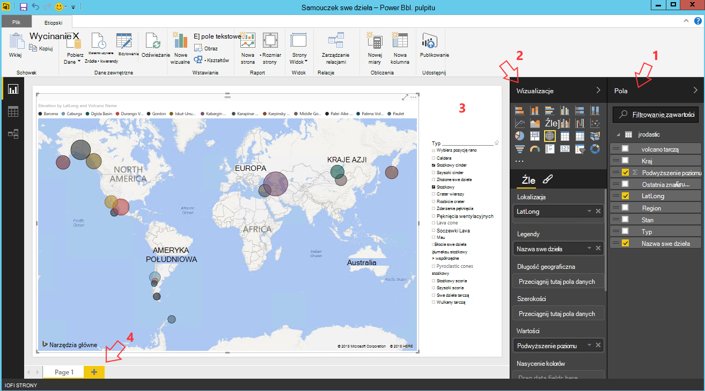

<properties
    pageTitle="Dziesięć czynności można wykonywać nauki danych maszyn wirtualnych | Microsoft Azure"
    description="Wykonywanie różnych badań danych i modelowanie zadania do nauki danych maszyn wirtualnych."
    services="machine-learning"
    documentationCenter=""
    authors="bradsev"
    manager="jhubbard"
    editor="cgronlun"  />

<tags
    ms.service="machine-learning"
    ms.workload="data-services"
    ms.tgt_pltfrm="na"
    ms.devlang="na"
    ms.topic="article"
    ms.date="08/29/2016"
    ms.author="gokuma;weig;bradsev" />

# <a name="ten-things-you-can-do-on-the-data-science-virtual-machine"></a>Dziesięć rzeczy, które można wykonywać nauki danych maszyn wirtualnych

Maszyn wirtualnych nauki danych firmy Microsoft (DSVM) jest środowiskiem rozwoju nauki zaawansowanych danych, które można wykonywać różne zadania badań i modelowanie danych. Środowisko jest już gotowy i powiązane z kilka narzędzi analizy danych popularne, które ułatwiają szybkie wprowadzenie analizę dla lokalnego, wdrożeń chmurze lub hybrydowymi połączeniami. DSVM ściśle współpracuje z wielu usług Azure i będzie mógł przeczytać i przetwarzanie danych, który znajduje się już na Azure w magazynie danych SQL Azure, Lake danych Azure, Magazyn Azure lub DocumentDB. Go również wykorzystać innych narzędzi analizy, takich jak Azure maszynowego uczenia się i Azure danych fabrycznych.


W tym artykule wykonaniem jak wykonywać różne zadania nauki danych i Praca z innymi usługami Azure za pomocą usługi DSVM. Oto kilka rzeczy, które można wykonywać DSVM:

1. Eksplorowanie danych i opracowanie modelach lokalnie na DSVM przy użyciu programu Microsoft R serwera, Python
2. Korzystanie z notesu Jupyter Aby poeksperymentować z danymi w przeglądarce przy użyciu Python 2, Python 3 Microsoft R wersji enterprise gotowe R przeznaczone do wydajność i skalowalność
3. Operationalize modeli utworzony przy użyciu R i Python po otrzymaniu komputera Azure, aby aplikacje klienckie mogą uzyskiwać dostęp do modeli za pomocą interfejsu usług sieci web prostych
4. Administrowanie zasobami Azure za pomocą Azure portal lub programu Powershell
5. Rozszerzanie miejsca na dysku i udostępnianie dużych zestawów danych / kod w całym zespołem, tworząc magazyn plików Azure jako dysk instalację na Twojej DSVM
6. Udostępnianie kodu z zespołem za pomocą Github i uzyskać dostęp do repozytorium przy użyciu wstępnie zainstalowany cyfra klientów — imprezie cyfra Graficznym cyfra.
7. Uzyskiwać dostęp do różnych Azure danych i analizy usług takich jak magazyn obiektów blob platformy Azure Lake danych Azure, usługa Azure HDInsight (Hadoop), Azure DocumentDB magazynu danych SQL Azure & bazy danych
8. Tworzenie raportów i pulpitów nawigacyjnych za pomocą Power BI Desktop preinstalowane w systemie DSVM i rozmieszczanie ich w chmurze
9. Dynamiczne skalowanie do DSVM stosownie do potrzeb projektu
10. Instalowanie narzędzia dodatkowe na tym komputerze wirtualnych   


>[AZURE.NOTE] Opłaty za zużycie dodatkowe zostaną zastosowane dla wielu usług przechowywania i analizy danych dodatkowe wymienione w tym artykule. Zajrzyj do strony [Ceny Azure](https://azure.microsoft.com/pricing/) , aby uzyskać szczegółowe informacje.


**Wymagania wstępne**

- Konieczne będzie Azure subskrypcji. Możesz zalogować do bezpłatnej wersji próbnej [tutaj](https://azure.microsoft.com/free/).

- Instrukcje dotyczące obsługi administracyjnej maszyny wirtualnej nauki danych w portalu Azure są dostępne podczas [tworzenia maszyny wirtualnej](https://portal.azure.com/#create/microsoft-ads.standard-data-science-vmstandard-data-science-vm).

## <a name="1-explore-data-and-develop-models-using-microsoft-r-server-or-python"></a>1. eksplorować dane i opracowywanie modeli za pomocą serwera Microsoft R lub Python

Korzystając z języków, takich jak R i Python, można wykonać do analizy danych bezpośrednio na DSVM.

Aby R można używać IDE o nazwie "Obrót R Enterprise 8.0", którą można znaleźć w start menu lub pulpitu. Firma Microsoft udostępnia dodatkowe biblioteki na bieżąco Otwórz źródło CRAN-R umożliwiające skalowalna analizy i możliwość analizowania danych przekracza dozwolony, wykonując równoległe analizy fragmentarycznego rozmiar pamięci. Można również zainstalować IDE R wybraną takich jak [RStudio](https://www.rstudio.com/products/rstudio-desktop/).

Aby Python można używać IDE, takich jak program Visual Studio Edition społeczności, którego narzędzia Python dla preinstalowane rozszerzenie programu Visual Studio (PTVS). Domyślnie tylko podstawowe 2.7 Python skonfigurowanym na PTVS (bez dowolnej bibliotece analizy, takich jak SciKit, Pandas). W celu umożliwienia Anaconda Python 2.7 i 3.5, należy wykonać następujące czynności:

* Tworzenie niestandardowych środowiskach dla każdej wersji, przechodząc do **Narzędzia** -> **Narzędzia Python** -> **Środowiskach Python** , a następnie klikając pozycję "**+ niestandardowe**" w Visual Studio Edition społeczności 2015 r.
* Opis i Ustawianie ścieżek prefiks środowiska jako *c:\anaconda* dla Anaconda Python 2.7 lub *c:\anaconda\envs\py35* dla Anaconda Python 3.5
* Kliknij przycisk **Autowykrywanie** , a następnie **Zastosuj** do zapisania środowiska.

Poniżej przedstawiono, jak wygląda konfigurowania środowiska niestandardowego w programie Visual Studio.


Zapoznaj się z [dokumentacją PTVS](https://github.com/Microsoft/PTVS/wiki/Selecting-and-Installing-Python-Interpreters#hey-i-already-have-an-interpreter-on-my-machine-but-ptvs-doesnt-seem-to-know-about-it) Aby uzyskać dodatkowe informacje na temat tworzenia Python środowiskach.

Teraz możesz są skonfigurowane do utworzenia nowego projektu Python. Przejdź do **pliku** -> **Nowy** -> **projektu** -> **Python** , a następnie wybierz typ aplikacji Python tworzysz. Można ustawić środowiska Python dla bieżącego projektu odpowiedniej wersji (Anaconda 2.7 lub 3.5): kliknij prawym przyciskiem myszy **środowiska Python**wybierz **Środowiskach Python Dodaj lub usuń**, a następnie wybierz odpowiednie środowisko skojarzyć z projektem. Można znaleźć więcej informacji na temat pracy z PTVS na stronie [dokumentacji](https://github.com/Microsoft/PTVS/wiki) produktu.

## <a name="2-using-a-jupyter-notebook-to-explore-and-model-your-data-with-python-or-r"></a>2. za pomocą notesu Jupyter Eksplorowanie i modelu danych za pomocą Python lub R

Notes Jupyter znajduje się w środowisku zaawansowanych zawierającego zgodny z przeglądarką "IDE" poszukiwania danych i modelowanie. Za pomocą Python 2, Python 3 lub R (Otwórz źródło i serwer Microsoft R) w notesie Jupyter.

Aby uruchomić Jupyter notesu kliknij ikonę menu start / ikony na pulpicie zatytułowany **Jupyter notesu**. Na DSVM można też przejść do "https://localhost:9999-" Aby uzyskać dostęp do notesu Jowisz. Jeśli go zostanie wyświetlony monit o podanie hasła, Utwórz silne hasło, aby uzyskać dostęp do notesu Jupyter za pomocą instrukcje opisane w sekcji ***jak tworzenie silnego hasła na serwerze notes Jupyter*** tematu [należy nauki wirtualna maszyna danych firmy Microsoft](machine-learning-data-science-provision-vm.md) . 

Po otwarciu notesu, zostanie wyświetlony katalog, który zawiera kilka notesów przykład, które są wstępnie detaliczny do DSVM. Teraz możesz wykonać następujące czynności:

- Kliknij notes, aby wyświetlić kod.
- wykonywanie każdej komórki, naciskając klawisze **SHIFT ENTER**.
- uruchamianie całego notesu, klikając **komórkę** -> **Uruchamianie**
- Tworzenie nowego notesu, klikając ikonę Jupyter (w lewym górnym rogu), a następnie kliknięcie przycisku **Nowy** po prawej stronie, a następnie wybierając język notesu (nazywane także jądra).   


>[AZURE.NOTE] Obecnie obsługujemy Python 2.7, Python 3.5 i R. Jądro R obsługuje programowania w zarówno Otwórz źródło R, a także przedsiębiorstwa skalowalność serwera R.   


Po wejściu w notesie, które można eksplorować dane, tworzenie modelu, testowanie modelu za pomocą wyboru bibliotek.


## <a name="3-build-models-using-r-or-python-and-operationalize-them-using-azure-machine-learning"></a>3. tworzenie modeli przy użyciu R lub Python i Operationalize je za pomocą nauki maszynowego Azure

Po skonstruowaniu i sprawdzania poprawności modelu następnym krokiem jest zazwyczaj wdrożyć go do produkcji. Dzięki temu klient aplikacjom wywołania przewidywań modelu w czasie rzeczywistym lub na podstawie tryb partię. Azure maszynowego uczenia udostępnia mechanizm operationalize modelu wbudowana R lub Python.

Gdy operationalize modelu w Azure maszynowego uczenia, usługi sieci web są prezentowane umożliwiający klientom nawiązywanie połączeń pozostałych, które przekazać parametrów wejściowych i odbieranie przewidywań z modelu jako.   


>[AZURE.NOTE] Jeśli nie został jeszcze zapisany AzureML, można uzyskać bezpłatne obszaru roboczego lub standardowy obszar roboczy odwiedzania strony głównej [AzureML Studio](https://studio.azureml.net/) i klikając "Wprowadzenie".   


### <a name="build-and-operationalize-python-models"></a>Tworzenie i Operationalize Python modeli

Oto wstawki kodu opracowanych w notesie Jupyter Python, który tworzy prostego modelu przy użyciu biblioteki informacje SciKit.

    #IRIS classification
    from sklearn import datasets
    from sklearn import svm
    clf = svm.SVC()
    iris = datasets.load_iris()
    X, y = iris.data, iris.target
    clf.fit(X, y)

Metoda umożliwia Wdroż modelach python Azure maszynowego uczenia był zawijany przewidywania modelu do funkcji i decorates go przy użyciu atrybutów dostarczony przez zainstalowany biblioteki python Azure maszynowego uczenia oznaczenia Identyfikatora obszaru roboczego Azure maszynowego uczenia, klucz interfejsu API i dane wejściowe i zwraca parametry.  

    from azureml import services
    @services.publish(workspaceid, auth_token)
    @services.types(sep_l = float, sep_w = float, pet_l=float, pet_w=float)
    @services.returns(int) #0, or 1, or 2
    def predictIris(sep_l, sep_w, pet_l, pet_w):
    inputArray = [sep_l, sep_w, pet_l, pet_w]
    return clf.predict(inputArray)

Klient możliwość nawiązywania połączeń z usługą sieci web. Istnieje otoki wygody, które skonstruować żądania interfejsu API usługi REST. Poniżej przedstawiono przykładowy kod do korzystania z usługi sieci web.

    # Consume through web service URL and keys
    from azureml import services
    @services.service(url, api_key)
    @services.types(sep_l = float, sep_w = float, pet_l=float, pet_w=float)
    @services.returns(float)
    def IrisPredictor(sep_l, sep_w, pet_l, pet_w):
    pass

    IrisPredictor(3,2,3,4)


>[AZURE.NOTE] Biblioteka Azure maszynowego uczenia jest obsługiwana tylko na Python 2.7 obecnie.   


### <a name="build-and-operationalize-r-models"></a>Tworzenie i Operationalize R modele

Można wdrażać wbudowany na maszyny wirtualnej nauki danych lub innego miejsca na Azure maszynowego uczenia w sposób, który jest podobny do jak to zrobić dla Python modeli R. Jej przedstawiono kroki:

- Tworzenie pliku settings.json, jak pokazano poniżej podaj swoją nazwę obszaru roboczego i auth token.
- Napisz opakowanie dla modelu przewidywanie funkcji.
- połączenie ```publishWebService``` w bibliotece Azure maszynowego uczenia przenieść opakowanie funkcji.  

Poniżej przedstawiono procedurę i kod wstawki, które można skonfigurować, tworzenie, publikowanie i używać modelu usługi sieci web w Azure maszynowego uczenia.

#### <a name="setup"></a>Konfiguracja

1.  Zainstaluj pakiet AzureML R, wpisując ```install.packages("AzureML")``` obrót R Enterprise 8.0 IDE lub usługi IDE R.
2.  Pobierz RTools [tutaj](https://cran.r-project.org/bin/windows/Rtools/). Potrzebujesz narzędzie zip w ścieżką (a nazwany zip.exe) do operationalize pakietu R do AzureML.
3.  Tworzenie pliku settings.json w katalogu o nazwie ```.azureml``` w obszarze katalogu macierzystego i wprowadź odpowiednie parametry z obszaru roboczego Azure ML:

Settings.JSON struktura pliku:

    {"workspace":{
    "id"                  : "ENTER YOUR AZUREML WORKSPACE ID",
    "authorization_token" : "ENTER YOUR AZUREML AUTH TOKEN"
    }}


#### <a name="build-a-model-in-r-and-publish-it-in-azure-ml"></a>Tworzenie modelu w R w celu opublikowania go w Azure ML

    library(AzureML)
    ws <- workspace(config="~/.azureml/settings.json")

    if(!require("lme4")) install.packages("lme4")
    library(lme4)
    set.seed(1)
    train <- sleepstudy[sample(nrow(sleepstudy), 120),]
    m <- lm(Reaction ~ Days + Subject, data = train)

    # Define a prediction function to publish based on the model:
    sleepyPredict <- function(newdata){
        predict(m, newdata=newdata)
    }

    ep <- publishWebService(ws, fun = sleepyPredict, name="sleepy lm", inputSchema = sleepstudy, data.frame=TRUE)

#### <a name="consume-the-model-deployed-in-azure-ml"></a>Używanie modelu wdrożony w Azure ML

Do korzystania z modelu z aplikacją kliencką, firma Microsoft korzysta z biblioteki Azure maszynowego uczenia wyszukująca usługi opublikowanych sieci web przy użyciu nazwy `services` połączenie interfejsu API do oznaczania punktu końcowego. A następnie po prostu połączeń `consume` działać i przekazać w ramce danych, aby dotyczyła.
Poniższy kod służy do korzystania z modelu opublikowany jako usługi sieci web Azure maszynowego uczenia.


    library(AzureML)
    library(lme4)
    ws <- workspace(config="~/.azureml/settings.json")

    s <-  services(ws, name = "sleepy lm")
    s <- tail(s, 1) # use the last published function, in case of duplicate function names

    ep <- endpoints(ws, s)

    # OK, try this out, and compare with raw data
    ans = consume(ep, sleepstudy)$ans

Więcej informacji o bibliotece Azure maszynowego uczenia R można znaleźć [tutaj](https://cran.r-project.org/web/packages/AzureML/AzureML.pdf).


## <a name="4-administer-your-azure-resources-using-azure-portal-or-powershell"></a>4. administrowanie zasobami Azure za pomocą Azure portal lub programu Powershell

DSVM nie tylko umożliwia tworzenie rozwiązania analizy lokalnie na komputerze wirtualnych, ale pozwala uzyskać dostęp do usług w chmurze Azure firmy Microsoft. Azure udostępnia kilka obliczeń, miejsca do magazynowania, usług analiz danych i innych usług, które można administrowanie i uzyskać dostęp z programu DSVM.

Administrowanie Azure zasobów subskrypcji i chmura można przy użyciu przeglądarki i wskaż [Azure portal](https://portal.azure.com). Za pomocą programu Powershell Azure administrowania Azure subskrypcję i zasobów za pomocą skryptu.
Azure programu Powershell można uruchamiać z skrót na pulpicie lub z menu start zatytułowany "Microsoft Azure programu Powershell". Zapoznaj się z [dokumentacją Microsoft Azure programu Powershell](../powershell-azure-resource-manager.md) , aby uzyskać więcej informacji na temat sposobu do administrowania Azure subskrypcji i zasobów za pomocą skrypty środowiska Windows Powershell.


## <a name="5-extend-your-storage-space-with-a-shared-file-system"></a>5. rozszerzenie miejsca w systemie plików udostępnionych

Naukowców danych można udostępniać dużych zestawów danych, kod lub inne zasoby w ramach zespołu. DSVM, sam ma około 70GB miejsca. Aby rozszerzyć z magazynu, można użyć usługi Azure pliku i albo zainstalować go na DSVM lub uzyskać do niego dostęp za pośrednictwem interfejsu API usługi REST.   


>[AZURE.NOTE] Limit miejsca na dysku udziału w usłudze Azure plik jest 5TB i limit rozmiaru pliku poszczególnych wynosi 1TB.   


Azure programu Powershell umożliwia tworzenie Udostępnij usługa Azure plików. Oto skrypt, aby była uruchamiana Azure programu PowerShell, aby utworzyć udział usługi Azure pliku.

    # Authenticate to Azure.
    Login-AzureRmAccount
    # Select your subscription
    Get-AzureRmSubscription –SubscriptionName "<your subscription name>" | Select-AzureRmSubscription
    # Create a new resource group.
    New-AzureRmResourceGroup -Name <dsvmdatarg>
    # Create a new storage account. You can reuse existing storage account if you wish.
    New-AzureRmStorageAccount -Name <mydatadisk> -ResourceGroupName <dsvmdatarg> -Location "<Azure Data Center Name For eg. South Central US>" -Type "Standard_LRS"
    # Set your current working storage account
    Set-AzureRmCurrentStorageAccount –ResourceGroupName "<dsvmdatarg>" –StorageAccountName <mydatadisk>

    # Create a Azure File Service Share
    $s = New-AzureStorageShare <<teamsharename>>
    # Create a directory under the FIle share. You can give it any name
    New-AzureStorageDirectory -Share $s -Path <directory name>
    # List the share to confirm that everything worked
    Get-AzureStorageFile -Share $s


Teraz, gdy utworzono udziale plików Azure, możesz zainstalować go w maszyn wirtualnych w Azure. Zdecydowanie zaleca się, że maszyn wirtualnych znajduje się w tym samym centrum danych Azure za pomocą konta miejsca do magazynowania w celu uniknięcia opłat za przesyłanie opóźnienie i danych. Poniżej przedstawiono polecenia służące do zainstalowania dysku na DSVM, które można uruchamiać na Azure programu Powershell.


    # Get storage key of the storage account that has the Azure file share from Azure portal. Store it securely on the VM to avoid prompted in next command.
    cmdkey /add:<<mydatadisk>>.file.core.windows.net /user:<<mydatadisk>> /pass:<storage key>

    # Mount the Azure file share as Z: drive on the VM. You can chose another drive letter if you wish
    net use z:  \\<mydatadisk>.file.core.windows.net\<<teamsharename>>


Teraz masz dostęp ten dysk jak dowolnego dysku normalny na maszyn wirtualnych.

## <a name="6-share-code-with-your-team-using-github"></a>6. udostępnianie kodu członkom zespołu za pomocą Github

Github to repozytorium kodu, gdzie można znaleźć wiele przykładowy kod i źródeł dla różnych narzędzi, za pomocą różnych technologii udostępnione przez społeczność deweloperów. Cyfra używa technologii śledzenia i przechowywanie wersji plików kodu. Github jest również platformą miejsce, w którym można utworzyć własne repozytorium do przechowywania udostępnionego kodu źródłowego i dokumentacji zespołu, zaimplementowania kontroli wersji i kontrolować również mających dostęp do wyświetlania i współtworzenia kodu. Odwiedź [strony pomocy Github](https://help.github.com/) uzyskać więcej informacji na temat korzystania z cyfra. Github można użyć jako jedną z metod współpraca z zespołem, przy użyciu kodu opracowanych przez społeczność i współtworzyć kod społeczność.

DSVM już jest wyposażony w narzędziach klienta na obu wiersza polecenia jako dobrze Graficznym, aby uzyskać dostęp do repozytorium Github. Narzędzie wiersza polecenia do pracy z cyfra i Github jest określana mianem imprezie cyfra. Program Visual Studio zainstalowanym DSVM ma rozszerzenia cyfra. Do tych narzędzi w start menu i pulpitu można znaleźć ikony uruchamiania.

Aby pobrać kod z repozytorium Github będą ```git clone``` polecenia. Na przykład aby pobrać dane nauki repozytorium publikowane przez firmę Microsoft do bieżącego katalogu można uruchom następujące polecenie, po wejściu ```git-bash```.

    git clone https://github.com/Azure/Azure-MachineLearning-DataScience.git

W programie Visual Studio jak tej samej operacji klonowanie. Ekran zrzut poniżej pokazano, jak uzyskać dostęp do narzędzia cyfra i Github w programie Visual Studio.


Można znaleźć więcej informacji na temat korzystania z cyfra do pracy z repozytorium Github z kilku zasobów dostępnych na github.com. [Cheat arkusz](https://training.github.com/kit/downloads/github-git-cheat-sheet.pdf) jest przydatne odwołanie.


## <a name="7-access-various-azure-data-and-analytics-services"></a>7. dostęp do różnych usług Azure danych i analizy

### <a name="azure-blob"></a>Obiektów Blob platformy Azure

Obiektów blob platformy Azure jest magazynu w chmurze niezawodnych i ekonomicznych danych dużych i małych. Pozwól nam Przyjrzyj się, jak przenieść dane do obiektów Blob platformy Azure i przechowywane w obiektów Blob platformy Azure danych programu access.

**Wymagania wstępne**

- **Tworzenie konta magazyn obiektów Blob platformy Azure [Azure w portalu](https://portal.azure.com).**


- Upewnij się, że narzędzia AzCopy zainstalowany wiersza polecenia znajduje się na ```C:\Program Files (x86)\Microsoft SDKs\Azure\AzCopy\azcopy.exe```. Możesz dodać katalog zawierający azcopy.exe do środowiska ŚCIEŻKA zmienna konieczności wpisywania ścieżce polecenia pełny, gdy działa to narzędzie. Aby uzyskać więcej informacji na temat narzędzia AzCopy należy zapoznać się z [dokumentacją AzCopy](../storage/storage-use-azcopy.md)

- Uruchom narzędzie Azure Eksploratora magazynu. Czy można pobrać z [Eksploratora magazynu usługi Microsoft Azure](http://storageexplorer.com/). 


**Przenoszenie danych z maszyn wirtualnych do obiektów Blob platformy Azure: AzCopy**

Przenoszenie danych między pliki lokalne i magazyn obiektów blob, można AzCopy w wierszu polecenia lub programu PowerShell:

    AzCopy /Source:C:\myfolder /Dest:https://<mystorageaccount>.blob.core.windows.net/<mycontainer> /DestKey:<storage account key> /Pattern:abc.txt

Zamień **C:\myfolder** ścieżkę, której jest przechowywany plik, **mystorageaccount** do nazwy konta magazyn obiektów blob, **mycontainer** do nazwy kontenera **klucz konta miejsca do magazynowania** klucza dostępu magazyn obiektów blob. [Azure portal](https://portal.azure.com)można znaleźć swoje poświadczenia konta miejsca do magazynowania.


Uruchom polecenie AzCopy w programie PowerShell lub wiersz polecenia. Oto niektóre Przykładowe użycie polecenia AzCopy:


    # Copy *.sql from local machine to a Azure Blob
    "C:\Program Files (x86)\Microsoft SDKs\Azure\AzCopy\azcopy" /Source:"c:\Aaqs\Data Science Scripts" /Dest:https://[ENTER STORAGE ACCOUNT].blob.core.windows.net/[ENTER CONTAINER] /DestKey:[ENTER STORAGE KEY] /S /Pattern:*.sql

    # Copy back all files from Azure Blob container to Local machine

    "C:\Program Files (x86)\Microsoft SDKs\Azure\AzCopy\azcopy" /Dest:"c:\Aaqs\Data Science Scripts\temp" /Source:https://[ENTER STORAGE ACCOUNT].blob.core.windows.net/[ENTER CONTAINER] /SourceKey:[ENTER STORAGE KEY] /S


Po uruchomieniu polecenia AzCopy kopiowania do obiektów blob platformy Azure będzie widoczne pokazie pliku w górę w Eksploratorze magazynu Azure wkrótce.


**Przenoszenie danych z maszyn wirtualnych do obiektów Blob platformy Azure: Eksplorator magazynu platformy Azure**

Możesz również przekazać danych z pliku lokalnego w swojej maszyn wirtualnych za pomocą Eksploratora magazynu Azure:

- Aby przekazać danych do kontenera, zaznacz kontenera docelowego i kliknij przycisk **Przekaż** .
- Kliknij na **...** po prawej stronie pola **pliki** , wybierz jeden lub wiele plików przekazać z systemu plików i kliknij przycisk **Przekaż** , aby rozpocząć przekazywanie plików.


**Odczytywanie danych z obiektów Blob platformy Azure: AML czytnika modułu**

**Importowanie danych modułu** Azure maszynowego uczenia Studio umożliwia odczyt danych z obiektów blob.


**Odczytywanie danych z obiektów Blob platformy Azure: Python ODBC**

Biblioteka **BlobService** umożliwia odczytać dane bezpośrednio z obiektów blob w programie Notes Jupyter lub Python.

Najpierw zaimportować wymagane pakiety:

    import pandas as pd
    from pandas import Series, DataFrame
    import numpy as np
    import matplotlib.pyplot as plt
    from time import time
    import pyodbc
    import os
    from azure.storage.blob import BlobService
    import tables
    import time
    import zipfile
    import random

Następnie podłącz swoje poświadczenia konta obiektów Blob platformy Azure i odczyt obiektów Blob danych:

    CONTAINERNAME = 'xxx'
    STORAGEACCOUNTNAME = 'xxxx'
    STORAGEACCOUNTKEY = 'xxxxxxxxxxxxxxxx'
    BLOBNAME = 'nyctaxidataset/nyctaxitrip/trip_data_1.csv'
    localfilename = 'trip_data_1.csv'
    LOCALDIRECTORY = os.getcwd()
    LOCALFILE =  os.path.join(LOCALDIRECTORY, localfilename)

    #download from blob
    t1 = time.time()
    blob_service = BlobService(account_name=STORAGEACCOUNTNAME,account_key=STORAGEACCOUNTKEY)
    blob_service.get_blob_to_path(CONTAINERNAME,BLOBNAME,LOCALFILE)
    t2 = time.time()
    print(("It takes %s seconds to download "+BLOBNAME) % (t2 - t1))

    #unzipping downloaded files if needed
    #with zipfile.ZipFile(ZIPPEDLOCALFILE, "r") as z:
    #    z.extractall(LOCALDIRECTORY)

    df1 = pd.read_csv(LOCALFILE, header=0)
    df1.columns = ['medallion','hack_license','vendor_id','rate_code','store_and_fwd_flag','pickup_datetime','dropoff_datetime','passenger_count','trip_time_in_secs','trip_distance','pickup_longitude','pickup_latitude','dropoff_longitude','dropoff_latitude']
    print 'the size of the data is: %d rows and  %d columns' % df1.shape

Odczytanie danych w jako ramki danych:


### <a name="azure-data-lake"></a>Azure Lake danych

Azure magazynowanie Lake danych jest wyraźny repozytorium obciążenia analizy danych duży i zgodny z pliku usługi Hadoop Distributed System (HDFS). Działa z ekosystemie Hadoop i analizy Lake Azure danych. Pokażemy, jak można przenieść dane w magazynie Lake danych Azure i uruchomić analiz za pomocą analizy Lake danych Azure.

**Wymagania wstępne**

- Tworzenie analizy Lake danych usługi Azure w [Azure portal](https://portal.azure.com).


- **Narzędzia Lake danych Azure** programu **Visual Studio** znajdujących się w to [łącze](https://www.microsoft.com/download/details.aspx?id=49504) jest już zainstalowany na program Visual Studio społeczności Edition znajdujący się maszyny wirtualnej. Po uruchamianie programu Visual Studio i rejestrowania w ramach subskrypcji Azure, zostanie wyświetlona swoje konto Azure analizy danych i magazynowania w panelu po lewej stronie programu Visual Studio.


**Przenoszenie danych z maszyn wirtualnych do Lake danych: Eksplorator Lake danych Azure**

**Eksplorator Lake danych Azure** umożliwia przekazywanie danych z lokalnych plików na tym komputerze wirtualnych do magazynu Lake danych.


Można również tworzyć potok danych do productionize do przenoszenia danych do lub z Azure Lake danych przy użyciu [Factory(ADF) danych Azure](https://azure.microsoft.com/services/data-factory/). Firma Microsoft przycisk odwołują się do tego [artykułu](https://azure.microsoft.com/blog/creating-big-data-pipelines-using-azure-data-lake-and-azure-data-factory/) , wykonaj kroki tworzenia procesy danych.

**Odczyt danych obiektów Blob platformy Azure do Lake danych: U SQL**

Jeśli dane znajdują się w magazynie obiektów Blob platformy Azure, można bezpośrednio odczytywać dane z Azure magazyn obiektów blob U SQL kwerendy. Przed tworzenia zapytania U SQL, upewnij się, że Twoje konto magazyn obiektów blob jest połączone z Lake danych usługi Azure. Przejdź do **portalu Azure**, Znajdź pulpitu nawigacyjnego Azure danych Lake analizy, kliknij pozycję **Dodaj źródło danych**, wybierz typ miejsca do magazynowania do **Magazynu Azure** i Podłącz swój nazwę konta magazynu platformy Azure i klucz. Następnie można odwołać się do danych przechowywanych w oknie konta miejsca do magazynowania.


W programie Visual Studio można czytać danych z magazynem obiektów blob, wykonaj kilka manipulowania danych, funkcja techniczny i wyprowadzenia danych Lake danych Azure lub magazyn obiektów Blob platformy Azure. Gdy odwołać się do danych w magazynie obiektów blob, użyj **wasb: / /**; gdy odwołać się do danych w Lake danych Azure, użyj **swbhdfs: / /**


Można użyć następujących zapytania U SQL w programie Visual Studio:

    @a =
        EXTRACT medallion string,
                hack_license string,
                vendor_id string,
                rate_code string,
                store_and_fwd_flag string,
                pickup_datetime string,
                dropoff_datetime string,
                passenger_count int,
                trip_time_in_secs double,
                trip_distance double,
                pickup_longitude string,
                pickup_latitude string,
                dropoff_longitude string,
                dropoff_latitude string

        FROM "wasb://<Container name>@<Azure Blob Storage Account Name>.blob.core.windows.net/<Input Data File Name>"
        USING Extractors.Csv();

    @b =
        SELECT vendor_id,
        COUNT(medallion) AS cnt_medallion,
        SUM(passenger_count) AS cnt_passenger,
        AVG(trip_distance) AS avg_trip_dist,
        MIN(trip_distance) AS min_trip_dist,
        MAX(trip_distance) AS max_trip_dist,
        AVG(trip_time_in_secs) AS avg_trip_time
        FROM @a
        GROUP BY vendor_id;

    OUTPUT @b   
    TO "swebhdfs://<Azure Data Lake Storage Account Name>.azuredatalakestore.net/<Folder Name>/<Output Data File Name>"
    USING Outputters.Csv();

    OUTPUT @b   
    TO "wasb://<Container name>@<Azure Blob Storage Account Name>.blob.core.windows.net/<Output Data File Name>"
    USING Outputters.Csv();


Po przesłaniu kwerendy na serwerze pojawi się diagram przedstawiający stan zadania.


**Kwerendy danych w Lake danych: U SQL**

Po zestawu danych jest spożywana do Azure Lake danych, możesz za pomocą [języka U SQL](../data-lake-analytics/data-lake-analytics-u-sql-get-started.md) kwerendy i eksplorować dane. Języka U SQL jest podobne do T-SQL, ale łączy niektóre funkcje pochodzące z C#, dzięki czemu użytkownicy mogą zapisywać niestandardowe moduły, funkcje zdefiniowane przez użytkownika i itp. Za pomocą skryptów w poprzednim kroku.

Po zapytanie zostaje przesłane do serwera, tripdata_summary. CSV znajduje się krótko w **Eksploratorze Lake danych Azure**, użytkownik może wyświetlić podgląd danych klikając prawym przyciskiem myszy plik.


Aby wyświetlić informacje o pliku:


### <a name="hdinsight-hadoop-clusters"></a>Usługa HDInsight Hadoop klastrów

Usługa Azure HDInsight jest zarządzane usługi Apache Hadoop, Spark HBase i Burza w chmurze. Można łatwo pracować z klastrów Azure HDInsight z komputera wirtualnych nauki danych.

**Wymagania wstępne**

- Tworzenie konta magazyn obiektów Blob platformy Azure [Azure w portalu](https://portal.azure.com). To konto przestrzeni dyskowej służy do przechowywania danych dla klastrów HDInsight.


- Dostosowywanie Azure HDInsight Hadoop klastrów z [Azure portal](machine-learning-data-science-customize-hadoop-cluster.md)

  - Należy połączyć rachunku miejsca do magazynowania utworzone za pomocą klaster HDInsight po jego utworzeniu. To konto magazynu jest używana do uzyskiwania dostępu do danych, które mogą być przetwarzane w klastrze.


  - Należy włączyć **Dostęp zdalny** do głowy węzła klaster po jego utworzeniu. Zapamiętaj poświadczenia dostępu zdalnego określone w tym miejscu (inny niż określone dla klastrów podczas jej tworzenia): należy je poniżej.


  - Tworzenie obszaru roboczego Azure ML. W tym obszarze roboczym ML będą przechowywane doświadczeń nauki swojego komputera. Wybierz odpowiednie opcje wyróżnione w portalu, jak pokazano poniżej ekranu.


  - Następnie wprowadź parametry Azure ML obszaru roboczego


  - Przekazywanie danych przy użyciu IPython notesu. Najpierw zaimportować wymagane pakiety, podłącz poświadczeń, tworzenie bazy danych na swoim koncie miejsca do magazynowania, a następnie załadować dane do klastrów HDI.


        #Import required Packages
        import pyodbc
        import time as time
        import json
        import os
        import urllib
        import urllib2
        import warnings
        import re
        import pandas as pd
        import matplotlib.pyplot as plt
        from azure.storage.blob import BlobService
        warnings.filterwarnings("ignore", category=UserWarning, module='urllib2')


        #Create the connection to Hive using ODBC
        SERVER_NAME='xxx.azurehdinsight.net'
        DATABASE_NAME='nyctaxidb'
        USERID='xxx'
        PASSWORD='xxxx'
        DB_DRIVER='Microsoft Hive ODBC Driver'
        driver = 'DRIVER={' + DB_DRIVER + '}'
        server = 'Host=' + SERVER_NAME + ';Port=443'
        database = 'Schema=' + DATABASE_NAME
        hiveserv = 'HiveServerType=2'
        auth = 'AuthMech=6'
        uid = 'UID=' + USERID
        pwd = 'PWD=' + PASSWORD
        CONNECTION_STRING = ';'.join([driver,server,database,hiveserv,auth,uid,pwd])
        connection = pyodbc.connect(CONNECTION_STRING, autocommit=True)
        cursor=connection.cursor()


        #Create Hive database and tables
        queryString = "create database if not exists nyctaxidb;"
        cursor.execute(queryString)

        queryString = """
                        create external table if not exists nyctaxidb.trip
                        (
                            medallion string,
                            hack_license string,
                            vendor_id string,
                            rate_code string,
                            store_and_fwd_flag string,
                            pickup_datetime string,
                            dropoff_datetime string,
                            passenger_count int,
                            trip_time_in_secs double,
                            trip_distance double,
                            pickup_longitude double,
                            pickup_latitude double,
                            dropoff_longitude double,
                            dropoff_latitude double)  
                        PARTITIONED BY (month int)
                        ROW FORMAT DELIMITED FIELDS TERMINATED BY ',' lines terminated by '\\n'
                        STORED AS TEXTFILE LOCATION 'wasb:///nyctaxidbdata/trip' TBLPROPERTIES('skip.header.line.count'='1');
                    """
        cursor.execute(queryString)

        queryString = """
                        create external table if not exists nyctaxidb.fare
                        (
                            medallion string,
                            hack_license string,
                            vendor_id string,
                            pickup_datetime string,
                            payment_type string,
                            fare_amount double,
                            surcharge double,
                            mta_tax double,
                            tip_amount double,
                            tolls_amount double,
                            total_amount double)
                        PARTITIONED BY (month int)
                        ROW FORMAT DELIMITED FIELDS TERMINATED BY ',' lines terminated by '\\n'
                        STORED AS TEXTFILE LOCATION 'wasb:///nyctaxidbdata/fare' TBLPROPERTIES('skip.header.line.count'='1');
                    """
        cursor.execute(queryString)


        #Upload data from blob storage to HDI cluster
        for i in range(1,13):
            queryString = "LOAD DATA INPATH 'wasb:///nyctaxitripraw2/trip_data_%d.csv' INTO TABLE nyctaxidb2.trip PARTITION (month=%d);"%(i,i)
            cursor.execute(queryString)
            queryString = "LOAD DATA INPATH 'wasb:///nyctaxifareraw2/trip_fare_%d.csv' INTO TABLE nyctaxidb2.fare PARTITION (month=%d);"%(i,i)  
            cursor.execute(queryString)


- Alternatywnie możesz wykonać w tym [instruktażu](machine-learning-data-science-process-hive-walkthrough.md) przekazać taksówki Warszawa danych do klastrów HDI. Głównych kroków obejmują:

    - AzCopy: pobieranie zip CSV z publicznej obiektów blob lokalnego folderu
    - AzCopy: przekazywanie rozpakowane CSV osoby z lokalnego folderu do klastrów HDI
    - Zaloguj się do węzła głównego klastrze Hadoop i przygotowanie do analizy danych badawczych

Po załadowaniu danych do klastrów HDI, można sprawdzić danych w Eksploratorze magazynu Azure. I masz nyctaxidb baza danych utworzona w klastrze HDI.


**Poszukiwanie danych: gałęzi kwerend w Python**

Ponieważ dane są w klastrze Hadoop, umożliwia pakietu pyodbc nawiązywanie połączenia z klastrów Hadoop i kwerendy bazy danych przy użyciu programu Hive badań i funkcji techniczny. Przeglądanie istniejących tabel, utworzone w kroku wstępne.

    queryString = """
        show tables in nyctaxidb2;
        """
    pd.read_sql(queryString,connection)


Przyjrzyjmy się liczby rekordów w każdym miesiącu i częstotliwości Przechylony lub nie ma w tabeli podróży:

    queryString = """
        select month, count(*) from nyctaxidb.trip group by month;
        """
    results = pd.read_sql(queryString,connection)

    %matplotlib inline

    results.columns = ['month', 'trip_count']
    df = results.copy()
    df.index = df['month']
    df['trip_count'].plot(kind='bar')


    queryString = """
        SELECT tipped, COUNT(*) AS tip_freq
        FROM
        (
            SELECT if(tip_amount > 0, 1, 0) as tipped, tip_amount
            FROM nyctaxidb.fare
        )tc
        GROUP BY tipped;
        """
    results = pd.read_sql(queryString,connection)

    results.columns = ['tipped', 'trip_count']
    df = results.copy()
    df.index = df['tipped']
    df['trip_count'].plot(kind='bar')


Możemy również obliczyć odległość między lokalizacji pobrania i lokalizacji dropoff i porównać ją odległość podróży.

    queryString = """
                    select pickup_longitude, pickup_latitude, dropoff_longitude, dropoff_latitude, trip_distance, trip_time_in_secs,
                        3959*2*2*atan((1-sqrt(1-pow(sin((dropoff_latitude-pickup_latitude)
                        *radians(180)/180/2),2)-cos(pickup_latitude*radians(180)/180)
                        *cos(dropoff_latitude*radians(180)/180)*pow(sin((dropoff_longitude-pickup_longitude)*radians(180)/180/2),2)))
                        /sqrt(pow(sin((dropoff_latitude-pickup_latitude)*radians(180)/180/2),2)
                        +cos(pickup_latitude*radians(180)/180)*cos(dropoff_latitude*radians(180)/180)*
                        pow(sin((dropoff_longitude-pickup_longitude)*radians(180)/180/2),2))) as direct_distance
                        from nyctaxidb.trip
                        where month=1
                            and pickup_longitude between -90 and -30
                            and pickup_latitude between 30 and 90
                            and dropoff_longitude between -90 and -30
                            and dropoff_latitude between 30 and 90;
                """
    results = pd.read_sql(queryString,connection)
    results.head(5)


    results.columns = ['pickup_longitude', 'pickup_latitude', 'dropoff_longitude',
                       'dropoff_latitude', 'trip_distance', 'trip_time_in_secs', 'direct_distance']
    df = results.loc[results['trip_distance']<=100] #remove outliers
    df = df.loc[df['direct_distance']<=100] #remove outliers
    plt.scatter(df['direct_distance'], df['trip_distance'])


Teraz Przyjrzyjmy przygotowywanie pobrane w dół (1%) zbiór danych do modelowania. Używamy tych danych w module czytnika AML.


        queryString = """
        create  table if not exists nyctaxi_downsampled_dataset_testNEW (
        medallion string,
        hack_license string,
        vendor_id string,
        rate_code string,
        store_and_fwd_flag string,
        pickup_datetime string,
        dropoff_datetime string,
        pickup_hour string,
        pickup_week string,
        weekday string,
        passenger_count int,
        trip_time_in_secs double,
        trip_distance double,
        pickup_longitude double,
        pickup_latitude double,
        dropoff_longitude double,
        dropoff_latitude double,
        direct_distance double,
        payment_type string,
        fare_amount double,
        surcharge double,
        mta_tax double,
        tip_amount double,
        tolls_amount double,
        total_amount double,
        tipped string,
        tip_class string
        )
        row format delimited fields terminated by ','
        lines terminated by '\\n'
        stored as textfile;
        """
        cursor.execute(queryString)

        --- now insert contents of the join into the above internal table

        queryString = """
        insert overwrite table nyctaxi_downsampled_dataset_testNEW
        select
        t.medallion,
        t.hack_license,
        t.vendor_id,
        t.rate_code,
        t.store_and_fwd_flag,
        t.pickup_datetime,
        t.dropoff_datetime,
        hour(t.pickup_datetime) as pickup_hour,
        weekofyear(t.pickup_datetime) as pickup_week,
        from_unixtime(unix_timestamp(t.pickup_datetime, 'yyyy-MM-dd HH:mm:ss'),'u') as weekday,
        t.passenger_count,
        t.trip_time_in_secs,
        t.trip_distance,
        t.pickup_longitude,
        t.pickup_latitude,
        t.dropoff_longitude,
        t.dropoff_latitude,
        t.direct_distance,
        f.payment_type,
        f.fare_amount,
        f.surcharge,
        f.mta_tax,
        f.tip_amount,
        f.tolls_amount,
        f.total_amount,
        if(tip_amount>0,1,0) as tipped,
        if(tip_amount=0,0,
        if(tip_amount>0 and tip_amount<=5,1,
        if(tip_amount>5 and tip_amount<=10,2,
        if(tip_amount>10 and tip_amount<=20,3,4)))) as tip_class
        from
        (
        select
        medallion,
        hack_license,
        vendor_id,
        rate_code,
        store_and_fwd_flag,
        pickup_datetime,
        dropoff_datetime,
        passenger_count,
        trip_time_in_secs,
        trip_distance,
        pickup_longitude,
        pickup_latitude,
        dropoff_longitude,
        dropoff_latitude,
        3959*2*2*atan((1-sqrt(1-pow(sin((dropoff_latitude-pickup_latitude)
        radians(180)/180/2),2)-cos(pickup_latitude*radians(180)/180)
        *cos(dropoff_latitude*radians(180)/180)*pow(sin((dropoff_longitude-pickup_longitude)*radians(180)/180/2),2)))
        /sqrt(pow(sin((dropoff_latitude-pickup_latitude)*radians(180)/180/2),2)
        +cos(pickup_latitude*radians(180)/180)*cos(dropoff_latitude*radians(180)/180)*pow(sin((dropoff_longitude-pickup_longitude)*radians(180)/180/2),2))) as direct_distance,
        rand() as sample_key

        from trip
        where pickup_latitude between 30 and 90
            and pickup_longitude between -90 and -30
            and dropoff_latitude between 30 and 90
            and dropoff_longitude between -90 and -30
        )t
        join
        (
        select
        medallion,
        hack_license,
        vendor_id,
        pickup_datetime,
        payment_type,
        fare_amount,
        surcharge,
        mta_tax,
        tip_amount,
        tolls_amount,
        total_amount
        from fare
        )f
        on t.medallion=f.medallion and t.hack_license=f.hack_license and t.pickup_datetime=f.pickup_datetime
        where t.sample_key<=0.01
        """
        cursor.execute(queryString)

Po jakimś czasie możesz sprawdzić, czy dane zostały załadowane w Hadoop klastrów:

    queryString = """
        select * from nyctaxi_downsampled_dataset limit 10;
        """
    cursor.execute(queryString)
    pd.read_sql(queryString,connection)


**Odczyt danych za pomocą AML HDI: moduł reader**

Dostęp do bazy danych w klastrze Hadoop może również użyć modułu **czytnika** w AML studio. Podłącz poświadczeń klastrów HDI i konta na platformie Azure i będzie można tworzyć modele nauki komputera przy użyciu bazy danych w HDI klastrów.


Następnie można wyświetlać scored zestawu danych:


### <a name="azure-sql-data-warehouse--databases"></a>Azure SQL Data Warehouse & bazy danych

Magazyn danych SQL Azure jest magazyn elastyczne danych jako usługa klasy korporacyjnej klasy programu SQL Server.

Umożliwia obsługę magazynu danych SQL Azure, postępując zgodnie z instrukcjami podanymi w tym [artykule](../sql-data-warehouse/sql-data-warehouse-get-started-provision.md). Po przepisu magazynu danych SQL Azure umożliwia tego [instruktażu](machine-learning-data-science-process-sqldw-walkthrough.md) jak przekazywanie danych, badań i modelowania przy użyciu danych w magazynie danych SQL.

#### <a name="azure-documentdb"></a>Azure DocumentDB

Azure DocumentDB jest NoSQL bazy danych w chmurze. Umożliwia pracę z dokumentów, takich jak JSON oraz pozwala na przechowywanie i kwerendy dokumenty.

Należy wykonać następujące czynności na wymagania, aby uzyskać dostęp do DocumentDB z DSVM.

1. Zainstaluj zestaw SDK Python DocumentDB (Uruchom ```pip install pydocumentdb``` z wiersza polecenia)
1. Tworzenie konta DocumentDB i baza danych DB dokumentu na podstawie [Azure portal](https://portal.azure.com)
1. Pobierz "DocumentDB narzędzia do migracji" [tutaj](http://www.microsoft.com/downloads/details.aspx?FamilyID=cda7703a-2774-4c07-adcc-ad02ddc1a44d) i wyodrębnij do katalogu
1. Importowanie danych JSON (swe dzieła dane) przechowywane na [publicznej obiektów blob](https://cahandson.blob.core.windows.net/samples/volcano.json) do DocumentDB po parametry polecenia narzędzia do migracji (dtui.exe z katalogu, w którym zainstalowano narzędzia do migracji DocumentDB). Wprowadź źródło i docelowych parametry lokalizacji poniżej.

    /s:JsonFile /s.Files:https://cahandson.blob.core.windows.net/samples/volcano.json /t:DocumentDBBulk /t.ConnectionString:AccountEndpoint=https://[DocDBAccountName].documents.azure.com:443/; AccountKey = [[klawisz]; bazy danych = /t.Collection:volcano1 swe dzieła

Po zaimportowaniu danych można przejdź do pozycji Jupyter i Otwórz notes, tytuł *DocumentDBSample* zawiera kod python, aby uzyskać dostęp do DocumentDB i wykonać kilka podstawowych kwerend. Więcej informacji o DocumentDB, odwiedź witrynę usługi [dokumentacji strony](https://azure.microsoft.com/documentation/learning-paths/documentdb/)


## <a name="8-build-reports-and-dashboard-using-the-power-bi-desktop"></a>8. Tworzenie raportów i pulpitów nawigacyjnych za pomocą Power BI Desktop

Pozwól nam wizualizowanie plik JSON swe dzieła, który firma Microsoft pokazano w powyższym przykładzie DocumentDB w usłudze Power BI uzyskanie wniosków wizualne przeanalizować dane. Szczegółowy opis czynności są dostępne w [artykule Power BI](../documentdb/documentdb-powerbi-visualize.md). Kroki wysokiego poziomu są poniżej:

1. Otwórz Power BI Desktop, a następnie wykonaj "Pobieranie danych". Określ adres URL jako: https://cahandson.blob.core.windows.net/samples/volcano.json
2. Powinien zostać wyświetlony JSON rekordy zaimportowane w postaci listy
3. Konwertowanie listy na tabelę dzięki PowerBI można pracować z tym samym
4. Rozwijanie kolumny, klikając ikonę rozwijania (jeden z ikoną "Strzałka w lewo i Strzałka w prawo" po prawej stronie kolumny)
5. Zwróć uwagę, że lokalizacja jest polem "Rekord". Rozwiń węzeł rekordu, a następnie wybierz tylko współrzędne. Współrzędnych jest kolumną listy
6. Dodawanie nowej kolumny, aby przekonwertować kolumnie współrzędnych lista przecinek oddzielnej kolumny LatLong łączenia dwóch elementów w polu listy współrzędnych za pomocą formuły ```Text.From([coordinates]{1})&","&Text.From([coordinates]{0})```.
7. Na koniec przekonwertować ```Elevation``` kolumny dziesiętne i wybierz pozycję **Zamknij** i **Zastosuj**.

Zamiast powyższe kroki można wkleić poniższy kod, że skrypty out powyższe kroki w edytora zaawansowanego w PowerBI umożliwiające pisanie przekształcenia danych w języku kwerend.


    let
        Source = Json.Document(Web.Contents("https://cahandson.blob.core.windows.net/samples/volcano.json")),
        #"Converted to Table" = Table.FromList(Source, Splitter.SplitByNothing(), null, null, ExtraValues.Error),
        #"Expanded Column1" = Table.ExpandRecordColumn(#"Converted to Table", "Column1", {"Volcano Name", "Country", "Region", "Location", "Elevation", "Type", "Status", "Last Known Eruption", "id"}, {"Volcano Name", "Country", "Region", "Location", "Elevation", "Type", "Status", "Last Known Eruption", "id"}),
        #"Expanded Location" = Table.ExpandRecordColumn(#"Expanded Column1", "Location", {"coordinates"}, {"coordinates"}),
        #"Added Custom" = Table.AddColumn(#"Expanded Location", "LatLong", each Text.From([coordinates]{1})&","&Text.From([coordinates]{0})),
        #"Changed Type" = Table.TransformColumnTypes(#"Added Custom",{{"Elevation", type number}})
    in
        #"Changed Type"


Teraz masz danych w modelu danych w usłudze Power BI. Pulpit Power BI powinna wyglądać tak jak pokazano poniżej.


Można rozpocząć tworzenie raportów i wizualizacji przy użyciu modelu danych. Aby wykonać czynności opisane w tym [artykule Power BI](../documentdb/documentdb-powerbi-visualize.md#build-the-reports) do utworzenia raportu. Wynik końcowy będzie raportu, który wygląda jak poniżej.



## <a name="9-dynamically-scale-your-dsvm-to-meet-your-project-needs"></a>9. dynamicznie skalowanie do DSVM stosownie do potrzeb projektu

Można skalować DSVM stosownie do potrzeb projektu w górę lub w dół. Jeśli nie chcesz używać maszyn wirtualnych wieczorem lub w weekendy, po prostu można zamknąć maszyn wirtualnych z [Azure portal](https://portal.azure.com).

>[AZURE.NOTE]  Jeśli używasz tylko przycisk Zamknij system operacyjny na maszyn wirtualnych, będzie spowodować opłaty obliczeń.  

Jeśli potrzebujesz obsługi niektórych analizy dużą skalę i potrzebujesz więcej możliwości Procesora i pamięci i/lub dysk można znaleźć duży wybór rozmiarów maszyn wirtualnych rdzenie Procesora, pamięci i typy dysku (w tym dyski), które spełniają do obliczeń i budżetowe potrzeb. Pełna lista maszyny wirtualne wraz z ich co godzina wyliczenia o cenach są dostępne na stronie [Ceny maszyn wirtualnych Azure](https://azure.microsoft.com/pricing/details/virtual-machines/) .

Podobnie jeśli zmniejsza potrzeby możliwości przetwarzania maszyn wirtualnych (na przykład: głównych obciążenie pracą został przeniesiony do Hadoop lub klastrze Spark), można skalować klastrem z [Azure portal](https://portal.azure.com) i rozpoczęcie pracy z ustawieniami wystąpienia maszyn wirtualnych w dół. Poniżej przedstawiono zrzut ekranu.


## <a name="10-install-additional-tools-on-your-virtual-machine"></a>10. Zainstaluj dodatkowe narzędzia na komputerze wirtualnych

Firma Microsoft jest dostarczana kilka narzędzi, które naszym zdaniem będą mogli odpowiedź na wiele typowych danych, analizy potrzeb i że należy zaoszczędzić czas, można uniknąć konieczności instalowania i konfigurowania usługi środowisk kolejno i zaoszczędzić płacąc tylko dla zasobów, których używasz.

Mogą korzystać z innych usług Azure danych i analizy wyprofilowane w tym artykule do poprawy środowiska analizy. Firma Microsoft zrozumieć, że w niektórych przypadkach potrzeb mogą wymagać dodatkowych narzędzi, takich jak niektóre narzędzia własnych innych firm. Masz dostęp administracyjny pełnego na komputerze wirtualnych do zainstalowania nowych narzędzi, które są potrzebne. Można również zainstalować dodatkowe pakiety Python i R, które nie są wstępnie zainstalowane. W przypadku Python można użyć albo ```conda``` lub ```pip```. W przypadku R można użyć ```install.packages()``` w R konsoli lub za pomocą IDE i wybierz pozycję "**pakietów** -> **Zainstalować pakiety**".

## <a name="summary"></a>Podsumowanie
Są to tylko niektóre czynności, które można wykonywać w programie Microsoft danych nauki maszyny wirtualnej. Istnieje wiele więcej rzeczy, które można zrobić, aby był środowisku skutecznych analiz.
