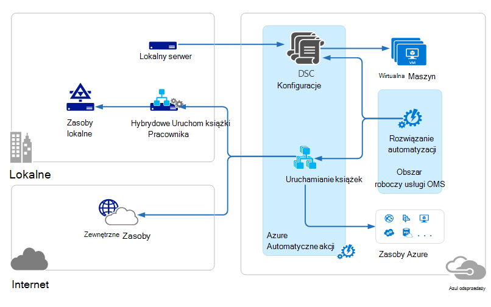

<properties 
   pageTitle="Operacje usługi zarządzania pakietu (OMS) architektura | Microsoft Azure"
   description="Pakiet Microsoft operacje zarządzania usługi (OMS) jest firmy Microsoft w chmurze IT zarządzania rozwiązanie, które ułatwia zarządzanie i ochrona sieci lokalnej i w chmurze infrastruktury.  W tym artykule identyfikuje różnych usługach objęte usługi OMS i znajdują się łącza do szczegółowych zawartości."
   services="operations-management-suite"
   documentationCenter=""
   authors="bwren"
   manager="jwhit"
   editor="tysonn" />
<tags 
   ms.service="operations-management-suite"
   ms.devlang="na"
   ms.topic="get-started-article"
   ms.tgt_pltfrm="na"
   ms.workload="infrastructure-services"
   ms.date="10/27/2016"
   ms.author="bwren" />

# Architektura usługi OMS

[Usługi operacje zarządzania pakietu (OMS)](https://azure.microsoft.com/documentation/services/operations-management-suite/) jest to zbiór opartej na chmurze usług zarządzania sieci lokalnej i w chmurze środowiskach.  Ten artykuł zawiera opis różnych lokalnych i składników chmury usługi OMS i ich komputerowych architektury wysokiego poziomu chmury.  Czy można znaleźć w dokumentacji dla każdej usługi, aby uzyskać więcej informacji.

## Analizy dziennika

Wszystkie dane zbierane przez [Analizy dziennika](https://azure.microsoft.com/documentation/services/log-analytics/) są przechowywane w repozytorium usługi OMS, który jest obsługiwany w Azure.  Połączonych źródeł wygenerować danych zebranych do repozytorium usługi OMS.  Obecnie są trzy typy połączonego źródła obsługiwane.

- Agent zainstalowane w systemie [Windows](../log-analytics/log-analytics-windows-agents.md) i [Linux oraz](../log-analytics/log-analytics-linux-agents.md) podłączone bezpośrednio do usługi OMS.
- System Center Operations Manager (SCOM) Zarządzanie grupy [podłączony do analizy dziennika](../log-analytics/log-analytics-om-agents.md) .  Czynniki SCOM nadal można komunikować się z serwerami zarządzania, które przekazują analizy dziennika zdarzeń i danych dotyczących wydajności.
- [Konto Azure miejsca do magazynowania](../log-analytics/log-analytics-azure-storage.md) , które zbiera dane [Diagnostyki Azure](../cloud-services/cloud-services-dotnet-diagnostics.md) z roli Pracownik, ról w sieci web lub maszyn wirtualnych w Azure.

Źródła danych zdefiniować dane, które analizy dziennika zbiera z połączonych źródeł, takich jak liczniki wydajności i dzienniki zdarzeń.  Rozwiązania Dodawanie funkcji do usługi OMS i łatwo można dodać do obszaru roboczego z [Galerii rozwiązań usługi OMS](../log-analytics/log-analytics-add-solutions.md).  Niektóre rozwiązania może wymagać bezpośredniego połączenia do analizy dziennika czynnikami SCOM mogą one wymagać dodatkowych agenta musi być zainstalowany.

Analizy dziennika ma portalu oparte na sieci web, który służy do zarządzania zasobami usługi OMS, dodawanie i konfigurowanie rozwiązań usługi OMS i wyświetlania i analizowania danych w repozytorium usługi OMS.

## Azure automatyzacji

[Runbooks automatyzacji Azure](http://azure.microsoft.com/documentation/services/automation) są wykonywane w chmurze Azure i można uzyskać dostęp do zasobów, które znajdują się w Azure w innych usług w chmurze lub dostępne za pośrednictwem publicznego Internetu.  Można również wyznaczyć maszyn lokalnego za pomocą Centrum danych lokalnych przy użyciu [Hybrydowych działań aranżacji pracownik](../automation/automation-hybrid-runbook-worker.md) , runbooks można uzyskać dostęp do zasobów lokalnych.

[DSC konfiguracji](../automation/automation-dsc-overview.md) przechowywanych w automatyzacji Azure mogą być stosowane bezpośrednio do Azure maszyn wirtualnych.  Inne fizycznych i maszyn wirtualnych można zażądać konfiguracji z serwera pobieraj DSC automatyzacji Azure.

Azure automatyzacji ma usługi OMS rozwiązanie, które zawiera statystyki i łącza do uruchamiania portal Azure dla wszystkich operacji.

## Kopia zapasowa Azure

Dane chronione w [Kopii zapasowej Azure](http://azure.microsoft.com/documentation/services/backup) znajduje się w kopii zapasowej magazynu, znajduje się w określonym regionu geograficznego.  Dane są replikowane w ramach tego samego regionu i w zależności od typu magazynu, także mogą być replikowane do innego regionu, aby dodatkowo nadmiarowości.

Kopia zapasowa Azure występują trzy podstawowe scenariusze.

- Windows maszyny liczącej z agent Azure Backup.  Umożliwia zapasowe plików i folderów z systemem Windows server lub klienta bezpośrednio do usługi Azure magazynu kopii zapasowej.  
- System Center Data Protection Manager (DPM) lub serwer kopii zapasowej platformy Microsoft Azure. Dzięki temu będzie można wykorzystać DPM lub Microsoft Azure kopii zapasowych serwera, aby utworzyć kopię zapasową plików i folderów oprócz obciążenia aplikacji, takich jak SQL i programu SharePoint do magazynu lokalnego, a następnie replikować do usługi Azure magazynu kopii zapasowej.
- Rozszerzenia Azure maszyn wirtualnych.  Dzięki temu będzie można utworzyć kopię zapasową Azure maszyn wirtualnych do usługi Azure magazynu kopii zapasowej.

Kopia zapasowa Azure ma usługi OMS rozwiązanie, które zawiera statystyki i łącza do uruchamianie portal Azure dla wszystkich operacji.

## Odzyskiwanie witryny Azure

[Odzyskiwanie witryny Azure](http://azure.microsoft.com/documentation/services/site-recovery) orchestrates replikacji, pracy awaryjnej i powrotu maszyn wirtualnych i serwerów fizycznych. Wymiany danych replikacji między hosts funkcji Hyper-V, monitorami VMware i serwerów fizycznych w głównego i pomocniczego centrach danych, lub centrum danych i Azure miejsca do magazynowania.  Odzyskiwanie witryny metadane są przechowywane w magazynami znajduje się w określonym Azure regionu geograficznego. Nie zreplikowanej dane są przechowywane przez usługę Odzyskiwanie witryny.

Odzyskiwanie witryny Azure występują trzy scenariusze podstawowe replikacji.

**Replikacja maszyn wirtualnych funkcji Hyper-V**
- Maszyn wirtualnych funkcji Hyper-V odbywa się w chmury VMM, można replikować do centrum danych pomocniczej lub Azure miejsca do magazynowania.  Replikacja Azure został przekroczony bezpieczne połączenie internetowe.  Replikacja pomocniczej centrum danych jest w sieci LAN.
- Jeśli maszyn wirtualnych funkcji Hyper-V nie są zarządzane przez program VMM, można replikować do tylko Azure magazynu.  Replikacja Azure został przekroczony bezpieczne połączenie internetowe.
 
**Replikacja maszyn wirtualnych VMWare**
- Można replikować maszyn wirtualnych VMware pomocniczej centrum danych uruchomiony VMware lub Azure miejsca do magazynowania.  Replikacja Azure mogą występować na VPN witryny do witryny lub Azure ExpressRoute lub bezpieczne połączenie internetowe. Replikacja pomocniczej centrum danych odbywa się za pośrednictwem kanału informacyjnego InMage Scout.
 
**Replikacja serwerów fizycznych Windows i Linux** 
- Można replikować serwerów fizycznych pomocniczej centrum danych lub Azure miejsca do magazynowania. Replikacja Azure mogą występować na VPN witryny do witryny lub Azure ExpressRoute lub bezpieczne połączenie internetowe. Replikacja pomocniczej centrum danych odbywa się za pośrednictwem kanału informacyjnego InMage Scout.  Odzyskiwanie witryny Azure zawiera usługi OMS rozwiązanie, które są wyświetlane niektóre statystyki, ale Azure portal należy użyć dla wszystkich operacji.

## Następne kroki

- Informacje na temat [analizy dziennika](http://azure.microsoft.com/documentation/services/log-analytics).
- Informacje na temat [Azure automatyzacji](https://azure.microsoft.com/documentation/services/automation).
- Informacje na temat [Azure kopii zapasowej](http://azure.microsoft.com/documentation/services/backup).
- Informacje na temat [odzyskiwania Azure witryny](http://azure.microsoft.com/documentation/services/site-recovery).
