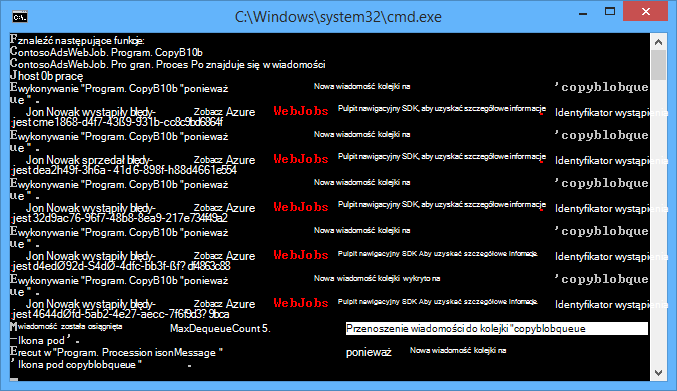
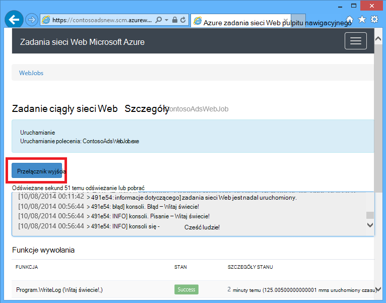
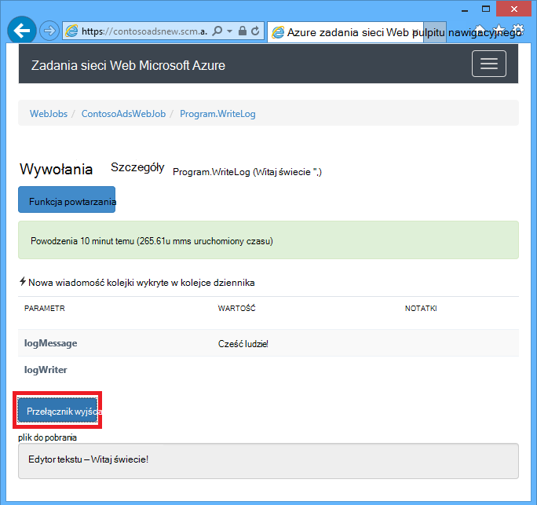
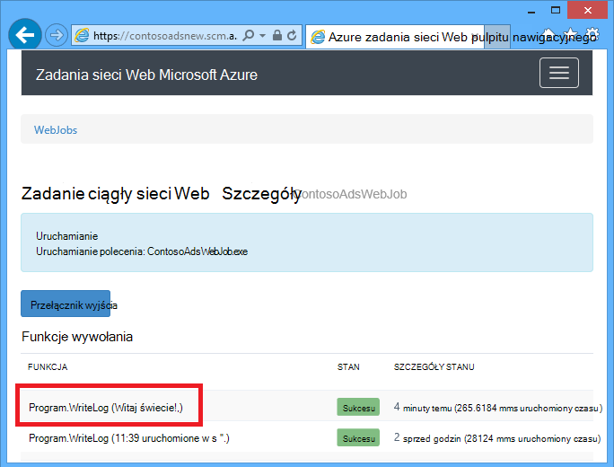
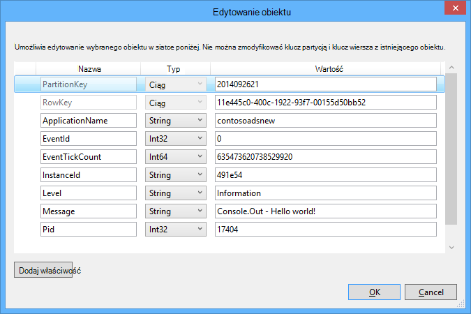
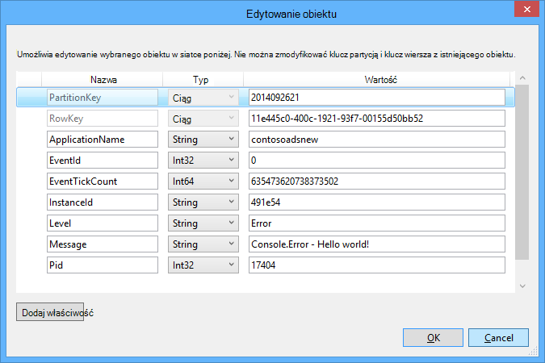

<properties
    pageTitle="Wprowadzenie do programu Visual Studio i magazynowania kolejki połączenia usług (WebJob projektów) | Microsoft Azure"
    description="Jak rozpocząć korzystanie z magazynu kolejki Azure w projekcie WebJob po nawiązaniu połączenia z kontem miejsca do magazynowania przy użyciu programu Visual Studio połączony usług."
    services="storage"
    documentationCenter=""
    authors="TomArcher"
    manager="douge"
    editor=""/>

<tags
    ms.service="storage"
    ms.workload="web"
    ms.tgt_pltfrm="vs-getting-started"
    ms.devlang="na"
    ms.topic="article"
    ms.date="07/18/2016"
    ms.author="tarcher"/>

# Wprowadzenie do programu Visual Studio i magazynowania kolejki Azure połączenia usług (WebJob projektów)

[AZURE.INCLUDE [storage-try-azure-tools-queues](../../includes/storage-try-azure-tools-queues.md)]

## Omówienie

W tym artykule opisano, jak rozpocząć korzystanie z magazyn kolejek Azure w projekcie programu Visual Studio Azure WebJob po utworzony lub odwołuje się przy użyciu okna dialogowego Visual Studio **Dodaj usługi połączone** konto Azure miejsca do magazynowania. Po dodaniu konta miejsca do magazynowania do projektu WebJob za pomocą okna dialogowego Visual Studio **Dodaj usługi połączone** odpowiednich pakietów NuGet miejsca do magazynowania Azure są zainstalowane, odpowiednie odwołania .NET są dodawane do projektu i parametry połączenia dla konta przestrzeni dyskowej są aktualizowane w pliku App.config.  

Ten artykuł zawiera C# przykłady kodu, których pokazująca, jak korzystać z wersji Azure WebJobs SDK 1.x z usługą Azure kolejki magazyn.

Magazyn kolejek Azure to usługa do przechowywania dużej liczby wiadomości, które są dostępne z dowolnego miejsca na świecie za pośrednictwem uwierzytelnionego połączenia przy użyciu protokołu HTTP lub HTTPS. Wiadomość kolejka może zawierać maksymalnie 64 KB i kolejki może zawierać miliony wiadomości do granicy pojemność konta miejsca do magazynowania. Aby uzyskać więcej informacji, zobacz [Wprowadzenie do magazynowania kolejki Azure za pomocą .NET](storage-dotnet-how-to-use-queues.md) . Aby uzyskać więcej informacji na temat programu ASP.NET zobacz [ASP.NET](http://www.asp.net).

## Jak funkcja wyzwalacza po odebraniu wiadomości kolejki

Aby napisać funkcję, która wymaga WebJobs SDK po odebraniu wiadomości kolejki, użyj atrybutu **QueueTrigger** . Konstruktor atrybutu ma parametr ciąg określający nazwę kolejki ankieta. Aby sprawdzić, jak ustawić nazwy kolejki dynamiczne, zaznacz się, [jak ustawić opcje konfiguracji](#how-to-set-configuration-options).

### Ciąg wiadomości w kolejce

W poniższym przykładzie kolejki zawiera wiadomości w ciągu, więc **QueueTrigger** jest stosowana do parametru ciągu o nazwie **logMessage** , który zawiera zawartość wiadomości kolejki. Funkcja [zapisuje wiadomości dziennika do pulpitu nawigacyjnego](#how-to-write-logs).

        public static void ProcessQueueMessage([QueueTrigger("logqueue")] string logMessage, TextWriter logger)
        {
            logger.WriteLine(logMessage);
        }

Oprócz **ciąg**parametr może być tablicy bajtów, obiekt **CloudQueueMessage** lub POCO, który zdefiniujesz.

### POCO [(zwykły stary obiekt CLR](http://en.wikipedia.org/wiki/Plain_Old_CLR_Object)) w kolejce wiadomości

W poniższym przykładzie wiadomości kolejki zawiera JSON obiektu **BlobInformation** , który zawiera właściwość **BlobName** . Zestaw SDK automatycznie deserializes obiektu.

        public static void WriteLogPOCO([QueueTrigger("logqueue")] BlobInformation blobInfo, TextWriter logger)
        {
            logger.WriteLine("Queue message refers to blob: " + blobInfo.BlobName);
        }

Zestaw SDK używa [pakiet Newtonsoft.Json NuGet](http://www.nuget.org/packages/Newtonsoft.Json) szeregować i deserializować wiadomości. Jeśli tworzysz wiadomości w kolejce programu, która nie korzysta z zestawu SDK WebJobs, można napisać kod, jak w następującym przykładzie, aby utworzyć wiadomość kolejki POCO, które można analizować zestawu SDK.

        BlobInformation blobInfo = new BlobInformation() { BlobName = "log.txt" };
        var queueMessage = new CloudQueueMessage(JsonConvert.SerializeObject(blobInfo));
        logQueue.AddMessage(queueMessage);

### Funkcje asynchroniczne

Następujące asynchronicznych funkcji [zapisuje dziennika do pulpitu nawigacyjnego](#how-to-write-logs).

        public async static Task ProcessQueueMessageAsync([QueueTrigger("logqueue")] string logMessage, TextWriter logger)
        {
            await logger.WriteLineAsync(logMessage);
        }

Funkcje asynchroniczne może potrwać [token anulowania](http://www.asp.net/mvc/overview/performance/using-asynchronous-methods-in-aspnet-mvc-4#CancelToken), jak pokazano w poniższym przykładzie, który kopiuje obiektów blob. (Opis symbolu zastępczego **queueTrigger** , zobacz sekcję [obiektów blob](#how-to-read-and-write-blobs-and-tables-while-processing-a-queue-message) ).

        public async static Task ProcessQueueMessageAsyncCancellationToken(
            [QueueTrigger("blobcopyqueue")] string blobName,
            [Blob("textblobs/{queueTrigger}",FileAccess.Read)] Stream blobInput,
            [Blob("textblobs/{queueTrigger}-new",FileAccess.Write)] Stream blobOutput,
            CancellationToken token)
        {
            await blobInput.CopyToAsync(blobOutput, 4096, token);
        }

## Typy atrybut QueueTrigger współdziała z

Za pomocą **QueueTrigger** następujących typów:

* **ciąg**
* Typ POCO seryjnych jako JSON
* **bajt]**
* **CloudQueueMessage**

## Algorytm ankieta

Zestaw SDK zawiera losowe wykładniczego wycofywania algorytmu zmniejszyć efekt bezczynności kolejki sondowanie kosztów transakcja miejsca do magazynowania.  Po znalezieniu wiadomości zestawu SDK czeka dwie sekundy, a następnie sprawdza następnej wiadomości; Po znalezieniu wiadomości nie czeka około cztery sekund przed próbą ponownie. Po kolejnych niepomyślne do komunikat kolejki czas oczekiwania w dalszym ciągu zwiększyć, aż osiągnie ona maksymalny czas oczekiwania, który domyślnie minutę. [Czas oczekiwania maksymalna jest konfigurowany](#how-to-set-configuration-options).

## Wielu wystąpień

Jeśli aplikacji sieci web działa na wielu wystąpień, ciągły WebJobs działa na każdym komputerze i każdym komputerze będzie zaczekać, aż wyzwalaczami i spróbuj uruchomić funkcje. W niektórych scenariuszach, które to może prowadzić do niektóre funkcje dwa razy przetwarzanie tych samych danych dlatego funkcje powinny być idempotent (zapisu, tak aby wywoływanie ich wielokrotnie przy użyciu tych samych danych wejściowych nie da zduplikowane wyniki).  

## Równoległego

Jeśli masz wiele funkcji nasłuchują na różnych kolejkach zestawu SDK nawiąże połączenie ich równolegle po odebraniu wiadomości jednocześnie.

Ograniczenie dotyczy po odebraniu wielu wiadomości dla pojedynczej kolejki. Domyślnie zestawu SDK otrzymuje partię 16 wiadomości w kolejce naraz i wykonuje funkcję przetwarza je równolegle. [Rozmiar partii jest konfigurowany](#how-to-set-configuration-options). Kiedy liczba przetwarzanych uzyskuje w dół do połowie rozmiaru partii, zestawu SDK pobiera innej partii i rozpoczynają przetwarzanie tych wiadomości. Dlatego maksymalna liczba wiadomości równoczesne przetwarzane dla każdej funkcji jest jednym pół godziny i rozmiar partii. Ten limit dotyczy oddzielnie poszczególnych funkcji, która ma atrybut **QueueTrigger** . Jeśli nie chcesz równoległego dla wiadomości odebranych w jednej kolejce, ustaw rozmiar partii 1.

## Uzyskiwanie kolejki lub kolejka komunikatów metadanych

Możesz uzyskać następujące właściwości wiadomości przez dodanie parametrów w podpisie metody:

* **DateTimeOffset** expirationTime
* **DateTimeOffset** insertionTime
* **DateTimeOffset** nextVisibleTime
* queueTrigger **ciąg** (zawiera tekst wiadomości)
* Identyfikator **ciągu**
* **ciąg** popReceipt
* **int** dequeueCount

Jeśli chcesz pracować bezpośrednio z magazynu Azure interfejsu API, możesz również dodać parametr **CloudStorageAccount** .

Poniższy przykład zapisuje wszystkie te metadane informacje dziennika aplikacji. W tym przykładzie zarówno logMessage, jak i queueTrigger zawierają zawartość wiadomości kolejki.

        public static void WriteLog([QueueTrigger("logqueue")] string logMessage,
            DateTimeOffset expirationTime,
            DateTimeOffset insertionTime,
            DateTimeOffset nextVisibleTime,
            string id,
            string popReceipt,
            int dequeueCount,
            string queueTrigger,
            CloudStorageAccount cloudStorageAccount,
            TextWriter logger)
        {
            logger.WriteLine(
                "logMessage={0}\n" +
            "expirationTime={1}\ninsertionTime={2}\n" +
                "nextVisibleTime={3}\n" +
                "id={4}\npopReceipt={5}\ndequeueCount={6}\n" +
                "queue endpoint={7} queueTrigger={8}",
                logMessage, expirationTime,
                insertionTime,
                nextVisibleTime, id,
                popReceipt, dequeueCount,
                cloudStorageAccount.QueueEndpoint,
                queueTrigger);
        }

Poniżej przedstawiono przykładowy dziennik napisane przez przykładowy kod:

        logMessage=Hello world!
        expirationTime=10/14/2014 10:31:04 PM +00:00
        insertionTime=10/7/2014 10:31:04 PM +00:00
        nextVisibleTime=10/7/2014 10:41:23 PM +00:00
        id=262e49cd-26d3-4303-ae88-33baf8796d91
        popReceipt=AgAAAAMAAAAAAAAAfc9H0n/izwE=
        dequeueCount=1
        queue endpoint=https://contosoads.queue.core.windows.net/
        queueTrigger=Hello world!

## Bezpiecznie zamknięty

Funkcja, która działa w ciągły WebJob może zaakceptować parametr **CancellationToken** , który umożliwia do powiadomienia o tym, funkcja ma być zamykane WebJob systemu operacyjnego. To powiadomienie służy do upewnij się, że funkcja nie nieoczekiwane zakończenie w taki sposób, aby liście danych niespójna.

W poniższym przykładzie pokazano, jak sprawdzić, czy zbliżającym się zakończenie WebJob w funkcji.

    public static void GracefulShutdownDemo(
                [QueueTrigger("inputqueue")] string inputText,
                TextWriter logger,
                CancellationToken token)
    {
        for (int i = 0; i < 100; i++)
        {
            if (token.IsCancellationRequested)
            {
                logger.WriteLine("Function was cancelled at iteration {0}", i);
                break;
            }
            Thread.Sleep(1000);
            logger.WriteLine("Normal processing for queue message={0}", inputText);
        }
    }

**Uwaga:** Pulpit nawigacyjny nie może być poprawnie wyświetlana jest stan i dane wyjściowe funkcji, które został zamknięty.

Aby uzyskać więcej informacji zobacz [WebJobs bezpiecznie zamknięty](http://blog.amitapple.com/post/2014/05/webjobs-graceful-shutdown/#.VCt1GXl0wpR).   

## Jak utworzyć wiadomość kolejki podczas przetwarzania wiadomości kolejki

Aby napisać funkcję, która umożliwia utworzenie nowej wiadomości kolejki, użyj atrybutu **kolejki** . Jak **QueueTrigger**się pomyślnie w polu Nazwa kolejki w postaci ciągu lub możesz [ustawić nazwę kolejki dynamiczne](#how-to-set-configuration-options).

### Ciąg wiadomości w kolejce

Poniższy przykład kodu nie asynchroniczne tworzy nową wiadomość kolejki w kolejce, o nazwie "outputqueue", z taką samą zawartość jak kolejki komunikat w kolejce, o nazwie "inputqueue". (Asynchroniczne za pomocą funkcji **IAsyncCollector<T> ** jak pokazano w dalszej części w tej sekcji.)

        public static void CreateQueueMessage(
            [QueueTrigger("inputqueue")] string queueMessage,
            [Queue("outputqueue")] out string outputQueueMessage )
        {
            outputQueueMessage = queueMessage;
        }

### POCO [(zwykły stary obiekt CLR](http://en.wikipedia.org/wiki/Plain_Old_CLR_Object)) w kolejce wiadomości

Aby utworzyć wiadomość kolejki, która zawiera POCO zamiast ciągu, należy przekazać typ POCO jako parametru wyjściowego do konstruktora atrybut **kolejki** .

        public static void CreateQueueMessage(
            [QueueTrigger("inputqueue")] BlobInformation blobInfoInput,
            [Queue("outputqueue")] out BlobInformation blobInfoOutput )
        {
            blobInfoOutput = blobInfoInput;
        }

Zestaw SDK automatycznie serializes obiektu JSON. Wiadomości kolejki zawsze jest tworzona, nawet jeśli obiekt ma wartość null.

### Tworzenie wielu wiadomości lub w funkcjach asynchroniczne

Aby utworzyć wiele wiadomości, należy typ parametru dla kolejki dane wyjściowe **ICollector<T> ** lub **IAsyncCollector<T>**, jak pokazano w poniższym przykładzie.

        public static void CreateQueueMessages(
            [QueueTrigger("inputqueue")] string queueMessage,
            [Queue("outputqueue")] ICollector<string> outputQueueMessage,
            TextWriter logger)
        {
            logger.WriteLine("Creating 2 messages in outputqueue");
            outputQueueMessage.Add(queueMessage + "1");
            outputQueueMessage.Add(queueMessage + "2");
        }

Każda wiadomość kolejki jest tworzony natychmiast po nosi nazwę metody **Add** .

### Typy atrybut kolejki współdziała z

Za pomocą atrybutu **kolejki** na następujące typy parametrów:

* **limit ciągu** (tworzy kolejki wiadomości, jeśli wartość parametru jest różne od null, gdy funkcja kończy działanie)
* **limit bajt]** (działanie **ciągu**)
* **limit CloudQueueMessage** (działanie **ciągu**)
* **limit POCO** (typu można tworzy wiadomość z obiektu o wartości null w przypadku parametrycznej null po zakończeniu funkcję)
* **ICollector**
* **IAsyncCollector**
* **CloudQueue** (w przypadku tworzenia wiadomości ręcznie bezpośrednio przy użyciu interfejsu API magazynu Azure)

### Używanie atrybutów WebJobs SDK w treści funkcji

Jeśli musisz wykonać niektóre pracę w swojej funkcji przed użyciem atrybut WebJobs SDK, takich jak **kolejki**, **obiektów Blob**lub **tabeli**, można użyć interfejsu **IBinder** .

W poniższym przykładzie trwa wiadomości kolejki wejściowej i tworzy nową wiadomość o tej samej zawartości w kolejce dane wyjściowe. Nazwa kolejki wynik jest ustawiany przez kod w treści funkcji.

        public static void CreateQueueMessage(
            [QueueTrigger("inputqueue")] string queueMessage,
            IBinder binder)
        {
            string outputQueueName = "outputqueue" + DateTime.Now.Month.ToString();
            QueueAttribute queueAttribute = new QueueAttribute(outputQueueName);
            CloudQueue outputQueue = binder.Bind<CloudQueue>(queueAttribute);
            outputQueue.AddMessage(new CloudQueueMessage(queueMessage));
        }

Można także interfejsu **IBinder** z atrybutami **tabel** i **obiektów Blob** .

## Jak odczytywanie i zapisywanie obiektów blob i tabel podczas przetwarzania wiadomości kolejki

Atrybuty **obiektów Blob** i **tabeli** pozwalają na odczytywanie i zapisywanie obiektów blob i tabel. Przykłady w tej sekcji dotyczą obiektów blob. Dla przykłady kodu, pokazujące wyzwolić procesów, podczas tworzenia lub aktualizowania obiektów blob Dowiedz się, [jak korzystać z magazynem obiektów blob Azure z zestawu SDK WebJobs](../app-service-web/websites-dotnet-webjobs-sdk-storage-blobs-how-to.md), a dla przykłady kodu, których odczytywanie i zapisywanie tabel, zobacz, [jak używać magazyn tabel platformy Azure z zestawu SDK WebJobs](../app-service-web/websites-dotnet-webjobs-sdk-storage-tables-how-to.md).

### Wiadomości w kolejce ciąg powodujące operacje obiektów blob

W przypadku komunikatu kolejki zawierającego ciąg **queueTrigger** to symbol zastępczy używanych w parametrze **blobPath** atrybut **obiektów Blob** , zawierającego treść wiadomości.

W poniższym przykładzie użyto obiektów **strumienia** do odczytu i zapisu obiektów blob. Wiadomości kolejki jest nazwą obiektów blob znajdujące się w kontenerze textblobs. Kopię obiektów blob z "-nowy" dołączane do nazwy zostanie utworzona w tym samym kontenerze.

        public static void ProcessQueueMessage(
            [QueueTrigger("blobcopyqueue")] string blobName,
            [Blob("textblobs/{queueTrigger}",FileAccess.Read)] Stream blobInput,
            [Blob("textblobs/{queueTrigger}-new",FileAccess.Write)] Stream blobOutput)
        {
            blobInput.CopyTo(blobOutput, 4096);
        }

Konstruktor atrybutu **obiektów Blob** przyjmuje parametr **blobPath** , który określa kontener i nazwę obiektów blob. Aby uzyskać więcej informacji na temat ten symbol zastępczy zobacz [jak korzystać z magazynem obiektów blob Azure z zestawu SDK WebJobs](../app-service-web/websites-dotnet-webjobs-sdk-storage-blobs-how-to.md).

Jeśli ten atrybut decorates obiektu **strumienia** , inny parametr konstruktora Określa tryb **FileAccess** jako odczyt, zapis lub odczytu/zapisu.

W poniższym przykładzie użyto obiektu **CloudBlockBlob** , aby usunąć obiektów blob. Wiadomości kolejki to nazwa to.

        public static void DeleteBlob(
            [QueueTrigger("deleteblobqueue")] string blobName,
            [Blob("textblobs/{queueTrigger}")] CloudBlockBlob blobToDelete)
        {
            blobToDelete.Delete();
        }

### POCO [(zwykły stary obiekt CLR](http://en.wikipedia.org/wiki/Plain_Old_CLR_Object)) w kolejce wiadomości

Aby POCO przechowywane jako JSON w kolejce wiadomości można używać symboli zastępczych tej właściwości nazwę obiektu w parametrze **blobPath** atrybut **kolejki** . Za pomocą nazwy właściwości metadanych kolejki jako symbole zastępcze. Zobacz [Pobieranie kolejki lub kolejka komunikatów metadanych](#get-queue-or-queue-message-metadata).

Poniższy przykład kopiuje obiektów blob do nowych obiektów blob z innym rozszerzeniem. Wiadomości kolejki jest obiektem **BlobInformation** , który zawiera właściwości **BlobName** i **BlobNameWithoutExtension** . Nazwy właściwości są używane jako symbole zastępcze w ścieżce obiektów blob atrybutów **obiektów Blob** .

        public static void CopyBlobPOCO(
            [QueueTrigger("copyblobqueue")] BlobInformation blobInfo,
            [Blob("textblobs/{BlobName}", FileAccess.Read)] Stream blobInput,
            [Blob("textblobs/{BlobNameWithoutExtension}.txt", FileAccess.Write)] Stream blobOutput)
        {
            blobInput.CopyTo(blobOutput, 4096);
        }

Zestaw SDK używa [pakiet Newtonsoft.Json NuGet](http://www.nuget.org/packages/Newtonsoft.Json) szeregować i deserializować wiadomości. Jeśli tworzysz wiadomości w kolejce programu, która nie korzysta z zestawu SDK WebJobs, można napisać kod, jak w następującym przykładzie, aby utworzyć wiadomość kolejki POCO, które można analizować zestawu SDK.

        BlobInformation blobInfo = new BlobInformation() { BlobName = "boot.log", BlobNameWithoutExtension = "boot" };
        var queueMessage = new CloudQueueMessage(JsonConvert.SerializeObject(blobInfo));
        logQueue.AddMessage(queueMessage);

Jeśli potrzebujesz niektórych prac w funkcja przed wiązanie obiektów blob do obiektu, można atrybutu w treści funkcji, jak pokazano w [atrybutach za pomocą SDK WebJobs w treści funkcji](#use-webjobs-sdk-attributes-in-the-body-of-a-function).

###Typy, które umożliwiają atrybut obiektów Blob o

Atrybut **obiektów Blob** można używać następujących typów:

* **Strumień** (odczytu lub zapisu, określona przy użyciu parametru konstruktora FileAccess)
* **Elementu TextReader**
* **TextWriter**
* **ciąg** (do odczytu)
* **limit ciągu** (pisanie; tworzy obiektów blob tylko wtedy, gdy parametr ciągu jest różne od null, gdy funkcja zwraca wartość)
* POCO (do odczytu)
* limit POCO (pisanie; zawsze tworzy obiektów blob, tworzy jako obiekt o wartości null, jeśli parametr POCO ma wartość null, gdy funkcja zwraca wartość)
* **CloudBlobStream** (Zapisz)
* **ICloudBlob** (odczytu lub zapisu)
* **CloudBlockBlob** (odczytu lub zapisu)
* **CloudPageBlob** (odczytu lub zapisu)

##Jak obsługiwać wiadomości

Wiadomości, której zawartość powoduje, że funkcja niepowodzenie są nazywane *wiadomości*. Gdy funkcja nie powiedzie się, wiadomości kolejki nie zostanie usunięty i ostatecznie zostaje pobrana ponownie powoduje cykl ma być powtarzane. Zestaw SDK można automatycznie przerwać cyklu po ograniczoną liczbę iteracji, lub możesz zrobić to ręcznie.

### Obsługi automatyczne uszkodzonych komunikatów

Zestaw SDK nawiąże połączenie funkcji maksymalnie 5 razy przetwarzania wiadomości kolejki. Jeśli piątym spróbuj kończy się niepowodzeniem, wiadomość zostanie przeniesiona do poison kolejki. Widać, jak skonfigurować maksymalna liczba prób w [sposób ustawić opcje konfiguracji](#how-to-set-configuration-options).

Poison kolejki nosi nazwę *{originalqueuename}*-poison. Można wpisać funkcję proces wiadomości z poison kolejki, rejestrowanie je lub wysyłając powiadomienie tego ręcznego uwagę jest potrzebna.

W poniższym przykładzie **CopyBlob** funkcja zakończy się niepowodzeniem po wiadomości kolejki zawiera nazwę blob, w którym nie istnieje. W takiej sytuacji wiadomość zostanie przeniesiona do kolejki copyblobqueue poison z kolejki copyblobqueue. **ProcessPoisonMessage** zarejestrować Trująca wiadomość.

        public static void CopyBlob(
            [QueueTrigger("copyblobqueue")] string blobName,
            [Blob("textblobs/{queueTrigger}", FileAccess.Read)] Stream blobInput,
            [Blob("textblobs/{queueTrigger}-new", FileAccess.Write)] Stream blobOutput)
        {
            blobInput.CopyTo(blobOutput, 4096);
        }

        public static void ProcessPoisonMessage(
            [QueueTrigger("copyblobqueue-poison")] string blobName, TextWriter logger)
        {
            logger.WriteLine("Failed to copy blob, name=" + blobName);
        }

Na poniższej ilustracji przedstawiono wyjścia konsoli z tych funkcji podczas przetwarzania poison wiadomości.

### Obsługi ręcznego uszkodzonych komunikatów

Liczba powtórzeń pobrana wiadomość do przetwarzania można uzyskać, dodając parametr **int** o nazwie **dequeueCount** z funkcji. Następnie możesz sprawdzić statystykę kolejki w kodzie funkcji i wykonywać własne poison wiadomościami gdy liczba przekracza próg, jak pokazano w poniższym przykładzie.

        public static void CopyBlob(
            [QueueTrigger("copyblobqueue")] string blobName, int dequeueCount,
            [Blob("textblobs/{queueTrigger}", FileAccess.Read)] Stream blobInput,
            [Blob("textblobs/{queueTrigger}-new", FileAccess.Write)] Stream blobOutput,
            TextWriter logger)
        {
            if (dequeueCount > 3)
            {
                logger.WriteLine("Failed to copy blob, name=" + blobName);
            }
            else
            {
            blobInput.CopyTo(blobOutput, 4096);
            }
        }

## Jak ustawić opcje konfiguracji

Typ **JobHostConfiguration** pozwala ustawić następujące opcje konfiguracji:

* Ustaw parametry połączenia SDK w kodzie.
* Konfigurowanie **QueueTrigger** ustawień, takich jak maksymalna liczba usuwania z kolejki.
* Pobierz nazwy kolejek z konfiguracji.

###Parametry połączenia zestawu SDK w kodzie

Ustawianie parametry połączenia SDK w kodzie umożliwia własnych nazw parametrów połączenia w plikach konfiguracji lub zmienne środowiska, jak pokazano w poniższym przykładzie.

        static void Main(string[] args)
        {
            var _storageConn = ConfigurationManager
                .ConnectionStrings["MyStorageConnection"].ConnectionString;

            var _dashboardConn = ConfigurationManager
                .ConnectionStrings["MyDashboardConnection"].ConnectionString;

            var _serviceBusConn = ConfigurationManager
                .ConnectionStrings["MyServiceBusConnection"].ConnectionString;

            JobHostConfiguration config = new JobHostConfiguration();
            config.StorageConnectionString = _storageConn;
            config.DashboardConnectionString = _dashboardConn;
            config.ServiceBusConnectionString = _serviceBusConn;
            JobHost host = new JobHost(config);
            host.RunAndBlock();
        }

### Konfigurowanie ustawień QueueTrigger

Możesz skonfigurować następujące ustawienia, które dotyczą kolejki przetwarzania wiadomości:

- Maksymalna liczba wiadomości, które są pobierane jednocześnie do wykonania równolegle (wartość domyślna to 16).
- Maksymalna liczba prób przed wysłaniem wiadomości kolejki do kolejki poison (wartość domyślna to 5).
- Maksymalny czas oczekiwania przed sondowanie ponownie, gdy kolejka jest pusta (wartość domyślna to 1 minuta).

W poniższym przykładzie pokazano, jak skonfigurować następujące ustawienia:

        static void Main(string[] args)
        {
            JobHostConfiguration config = new JobHostConfiguration();
            config.Queues.BatchSize = 8;
            config.Queues.MaxDequeueCount = 4;
            config.Queues.MaxPollingInterval = TimeSpan.FromSeconds(15);
            JobHost host = new JobHost(config);
            host.RunAndBlock();
        }

### Ustawianie wartości dla WebJobs SDK konstruktora parametrów w kodzie

Czasem warto Określ nazwę kolejki, nazwy obiektów blob lub kontenera lub tabeli w kodzie zamiast kodowane nadaj mu nazwę. Na przykład można określić nazwę kolejki dla **QueueTrigger** w zmiennej konfiguracji pliku lub środowiska.

Możesz można to zrobić przez przekazywanie w obiekcie **NameResolver** typu **JobHostConfiguration** . Zawiera specjalne symbole zastępcze ujęte w znaki procentu (%) w parametrach konstruktora atrybut WebJobs SDK i kod **NameResolver** określa rzeczywiste wartości można używać zamiast tych symboli zastępczych.

Załóżmy, że chcesz używać kolejki o nazwie logqueuetest w środowisku testowym i jeden nazwany logqueueprod produkcji. Zamiast nazwy kolejki stałe chcesz określić nazwę wpisu w zbiorze **appSettings** , zawierających nazwy kolejki rzeczywiste. Jeśli klucz **appSettings** jest logqueue, funkcja może wyglądać jak w następującym przykładzie.

        public static void WriteLog([QueueTrigger("%logqueue%")] string logMessage)
        {
            Console.WriteLine(logMessage);
        }

Klasy **NameResolver** następnie można uzyskać nazwę kolejki z **appSettings** , jak pokazano w poniższym przykładzie:

        public class QueueNameResolver : INameResolver
        {
            public string Resolve(string name)
            {
                return ConfigurationManager.AppSettings[name].ToString();
            }
        }

Należy przekazać klasy **NameResolver** w obiekcie **JobHost** , jak pokazano w poniższym przykładzie.

        static void Main(string[] args)
        {
            JobHostConfiguration config = new JobHostConfiguration();
            config.NameResolver = new QueueNameResolver();
            JobHost host = new JobHost(config);
            host.RunAndBlock();
        }

**Uwaga:** Nazwy obiektów blob, tabel i kolejki rozpoznawania zawsze nosi nazwę funkcji, ale rozpoznawania nazw kontenera obiektów blob tylko podczas uruchamiania aplikacji. Nie można zmienić nazwy kontenera obiektów blob podczas uruchamiania zadania.

## Jak ręcznie wyzwalanie funkcji

Aby wyzwolić funkcji ręcznie, użyj metody **połączenia** lub **CallAsync** na obiekt **JobHost** i atrybut **NoAutomaticTrigger** na tej funkcji, jak pokazano w poniższym przykładzie.

        public class Program
        {
            static void Main(string[] args)
            {
                JobHost host = new JobHost();
                host.Call(typeof(Program).GetMethod("CreateQueueMessage"), new { value = "Hello world!" });
            }

            [NoAutomaticTrigger]
            public static void CreateQueueMessage(
                TextWriter logger,
                string value,
                [Queue("outputqueue")] out string message)
            {
                message = value;
                logger.WriteLine("Creating queue message: ", message);
            }
        }

## Jak pisać dzienników

Pulpit nawigacyjny zawiera dzienniki w dwóch miejscach: na stronie WebJob i stron dla poszczególnych wywołań WebJob.

Dane wyjściowe metody konsoli, wywołujących w funkcji lub metodę **Main()** pojawi się na stronie pulpitu nawigacyjnego WebJob, a nie na stronie wywołania określonej metody. Dane wyjściowe obiektu TextWriter pobranego z parametrem w podpisie metody pojawi się na stronie pulpitu nawigacyjnego wywołania metody.

Nie można połączyć wyjścia konsoli wywołania konkretnej metody, ponieważ konsola jest pojedynczym wątku, gdy wiele funkcji zadania może być uruchomiona w tym samym czasie. Dlatego zestawu SDK zawiera każdego wywołania funkcji wraz z obiektem dziennika writer.

Aby zapisać [Dzienniki śledzenia aplikacji](web-sites-dotnet-troubleshoot-visual-studio.md#logsoverview), należy użyć **Console.Out** (tworzy Dzienniki oznaczone jako informacje) i **Console.Error** (tworzy Dzienniki oznaczone jako błąd). Alternatywny jest użycie [śledzenia lub TraceSource](http://blogs.msdn.com/b/mcsuksoldev/archive/2014/09/04/adding-trace-to-azure-web-sites-and-web-jobs.aspx), która udostępnia pełne, ostrzeżenia i krytyczne poziomy oprócz informacje i błędów. Dzienniki śledzenia aplikacji są wyświetlane w plikach dziennika aplikacji sieci web, Azure tabel lub obiektów blob platformy Azure w zależności od sposobu skonfigurowania aplikacji sieci Azure web. Podobnie jak dla wszystkich wyjścia konsoli, ostatnio Dzienniki aplikacji 100 również są wyświetlane w strony pulpitu nawigacyjnego w WebJob, a nie do strony wywołanie funkcji.

Wyjścia konsoli jest wyświetlany na pulpicie nawigacyjnym tylko wtedy, gdy program jest uruchomiony w WebJob Azure, nie, jeśli program działa lokalnie lub w niektórych innych środowiska.

Ustawianie parametrów połączenia pulpitu nawigacyjnego NULL można wyłączyć rejestrowanie. Aby uzyskać więcej informacji zobacz [jak ustawić opcje konfiguracji](#how-to-set-configuration-options).

W poniższym przykładzie pokazano kilka sposobów, aby zapisać dzienniki:

        public static void WriteLog(
            [QueueTrigger("logqueue")] string logMessage,
            TextWriter logger)
        {
            Console.WriteLine("Console.Write - " + logMessage);
            Console.Out.WriteLine("Console.Out - " + logMessage);
            Console.Error.WriteLine("Console.Error - " + logMessage);
            logger.WriteLine("TextWriter - " + logMessage);
        }

Na pulpicie nawigacyjnym SDK WebJobs dane wyjściowe obiektu **TextWriter** są widoczne po przejdź na stronę wywołania określonej funkcji i zaznacz opcję **Wyjście przełącznik**:

Na pulpicie nawigacyjnym SDK WebJobs 100 ostatnich wierszy konsoli wyjściowy Pokaż w górę, gdy przejdź do strony WebJob (a nie dla wywołania funkcji) i wybierz pozycję **Przełącz dane wyjściowe**.

W ciągły WebJob Dzienniki aplikacji widoczne w/danych/zadania/ciągły /*{webjobname}*/job_log.txt w systemie plików aplikacji sieci web.

        [09/26/2014 21:01:13 > 491e54: INFO] Console.Write - Hello world!
        [09/26/2014 21:01:13 > 491e54: ERR ] Console.Error - Hello world!
        [09/26/2014 21:01:13 > 491e54: INFO] Console.Out - Hello world!

Platformy Azure blob aplikacji dzienniki wygląda tak: 2014-09-26T21:01:13,Information,contosoadsnew,491e54,635473620738373502,0,17404,17,Console.Write - Witaj świecie!, 2014-09-26T21:01:13,Error,contosoadsnew,491e54,635473620738373502,0,17404,19,Console.Error - Witaj świecie!, 2014-09-26T21:01:13,Information,contosoadsnew,491e54,635473620738529920,0,17404,17,Console.Out - Witaj świecie!,

I tabeli Azure dzienniki **Console.Out** i **Console.Error** wyglądać podobnie do następującej:

##Następne kroki

W tym artykule udostępniła przykłady kodu, pokazujące sposób obsługi typowe scenariusze dotyczące pracy z kolejek Azure. Aby uzyskać więcej informacji o używaniu Azure WebJobs i WebJobs SDK, zobacz [zasoby dokumentacji Azure WebJobs](http://go.microsoft.com/fwlink/?linkid=390226).
